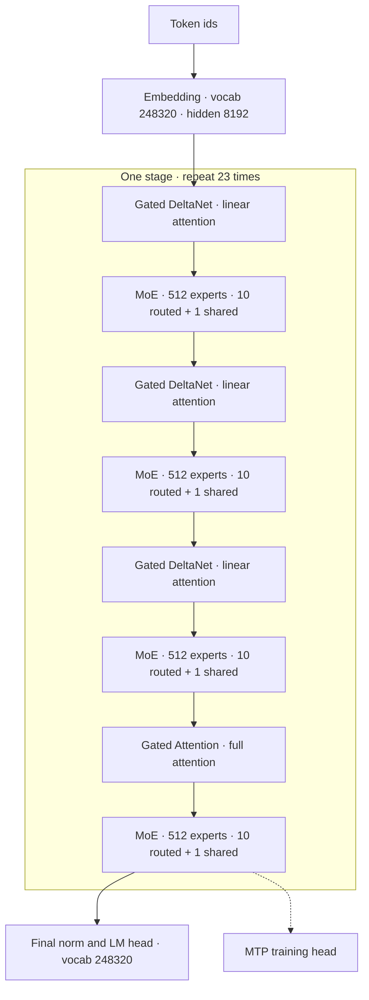
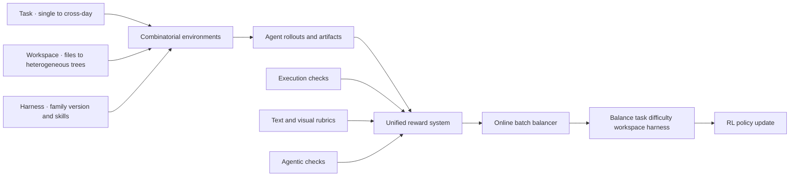

# Qwen3.8：用混合稀疏骨干承载长程交付，把扩展轴从参数量推进到“环境 × 算力”

> **来源基线**：Qwen Team 官方发布博客 *Qwen3.8-Max: A New Bar for Coding and Cowork*（2026-08-03）与开放权重 [Qwen/Qwen3.8-2.4T-A95B `207bd685`](https://huggingface.co/Qwen/Qwen3.8-2.4T-A95B/tree/207bd685a7e3696cfaff12ded7c6a7ea0f88c996)（2026-08-12）。
> - 博客快照：`raw/01_theory/01_models/alibaba_qwen/Qwen3_8_Max_blog_2026-08-03.txt`。
> - 模型卡快照：`raw/01_theory/01_models/alibaba_qwen/Qwen3_8_2_4T_A95B_model_card_207bd685.md`；精确结构数值再与同 revision 的 [`config.json`](https://huggingface.co/Qwen/Qwen3.8-2.4T-A95B/blob/207bd685a7e3696cfaff12ded7c6a7ea0f88c996/config.json) 交叉核对。
> - 许可证快照：`raw/01_theory/01_models/alibaba_qwen/Qwen3_8_Max_LICENSE_207bd685.txt`。
> **维度**：开放模型发布总览 + 机制级报告分析。
> **更新**：2026-08-13。

> [!note]
> 官方模型卡没有链接独立的 arXiv/PDF 技术报告，而是把 2026-08-03 博客作为引用对象（模型卡 `:39,450-460`）。因此本页的“报告”基线是**官方博客 + 开放权重模型卡/配置**，不是把发布文章误称为同行评审论文。

---

## 一、中央论点：架构不是新赌注，长程任务闭环才是

Qwen3.8 的核心叙事不是发明一套全新 backbone，而是把 **Qwen3.5 的 3:1 混合注意力 + 高稀疏 MoE** 扩大到 2.4T 总参数/95B 激活参数，再把后训练目标从“答对一轮”推进到“在不同 harness 和真实工作空间里，经过数小时乃至数天的反馈循环把任务交付”。官方自己也把差异写成“基于 Qwen3.5 的架构基础构建”与“carry complex, multi-step tasks through to completion”（博客 `:7-12`；模型卡 `:25-36`）。

这条主线有两个相互咬合的部分：

1. **模型侧**：92 层中只有每第 4 层使用一次全注意力，其余 3 层使用 Gated DeltaNet；每层再接 512 专家 MoE，仅激活 10 个 routed expert 和 1 个 shared expert。它把“可容纳的参数容量”与“每 token 实际计算”解耦。
2. **训练侧**：真实工作 RL 不为每个任务单独造一条管线，而是把 Task / Workspace / Harness 拆成三个可组合轴，再用统一奖励系统和在线数据均衡器把组合环境变成稳定训练信号（博客 `:60-72`）。

报告真正新增的机制信息集中在第 2 点；对预训练、优化器和架构消融几乎没有披露。因而严谨的结论应是：**Qwen3.8 展示了一个面向长程 Agent 交付的系统化训练方向，但没有公开足以隔离各组件因果贡献的训练配方。**

## 二、先拆清两个产品：开放 checkpoint 不等于 Max endpoint

| 维度 | 开放权重 `Qwen3.8-2.4T-A95B` | 托管 `Qwen3.8-Max` | 证据 |
|---|---|---|---|
| 关系 | post-trained Transformers checkpoint | 基于左侧 checkpoint 的官方服务版本 | 模型卡 `:13-28` |
| 输入模态 | **纯文本** | 文本 + 视觉输入 | 模型卡 `:21,350-354` |
| thinking | **必须开启**，不能禁用 | 支持 non-thinking | 模型卡 `:21,350-367` |
| 上下文 | 原生 **262,144**，可扩到 **1,010,000** | 默认 **1M** | 模型卡 `:64`；博客 `:455-459` |
| 内置能力 | 权重与配置；工具由部署方接入 | 官方内置工具、API 协议与产品能力 | 模型卡 `:13-22` |
| 报告基准归属 | 没有单列 checkpoint 成绩 | 表中明确写 `Qwen3.8-Max` | 博客 `:165-223`；模型卡 `:67-328` |

> [!contradiction]
> 不能把博客中的多模态、GUI、视频和 1M 默认上下文案例直接写成开放 checkpoint 的原生能力。模型卡明确说开放权重模型是 text-only 且强制 thinking；这些案例对应功能更多的托管 Max endpoint。

## 三、模型结构：23 个四层 stage，把全注意力预算压到四分之一层

*图是模型卡 `:41-64` 与固定 `config.json` 的结构展开；只表达层拓扑，不补造报告未披露的 norm/residual 细节。*

| 组件 | 固定配置 | 机制读法 |
|---|---:|---|
| 总参数 / 激活参数 | **2.4T / 95B** | 每 token 激活约占总参数预算 **3.96%**；这是参数口径，不等于 FLOPs 或吞吐提升 25.3× |
| 层数 / hidden | **92 / 8192** | `23 × 4` 的规则 stage |
| Gated DeltaNet | V heads **128**；QK heads **16**；head dim **128**；conv kernel **4** | 69 层承担线性时间的状态更新；配置还把状态计算 dtype 固定为 FP32 |
| Gated Attention | Q heads **64**；KV heads **4**；head dim **256**；RoPE dim **64** | 23 层保留内容寻址式全局交互；GQA 降低 KV 头数 |
| MoE | **512** routed experts；top-**10** + **1 shared**；expert dim **2048** | routed 容量与常驻共享路径并存；单看 `512/10` 不能推导端到端稀疏倍率 |
| 上下文 | native **262,144**；extensible **1,010,000** | 开放配置的 `max_position_embeddings` 是 262,144；百万长度需要扩展设置与相应服务支持 |
| MTP | 模型卡只写 “trained with multiple steps”；配置 `mtp_num_hidden_layers=1` | 已训练 MTP 头，但报告没有说明预测步数、接受率或是否用于公开服务 |

结构硬数值来自模型卡 `:41-64` 与固定 `config.json`。其中 `3.96% = 95B / 2.4T` 是本页计算；它只说明**参数激活比例**，不能忽略 attention、shared expert、通信、路由和内存带宽后外推为速度。

### 3.1 为什么是 3 个线性层 + 1 个全注意力层

报告只给结构，没有给替代方案消融。下面因此必须分成“事实”和“推断”：

- **事实**：`layer_types` 精确重复 `linear_attention × 3 → full_attention × 1` 共 23 次；模型卡称其继承 Qwen3.5 架构（模型卡 `:25-28,41-64`）。
- **【推断】计算动机**：让 69/92 层不构造随序列长度增长的完整注意力矩阵/KV 历史，可把长上下文主要路径从二次注意力成本转向固定状态更新；每四层插入一次 full attention，则补回纯递归状态难以保真的精确内容寻址。
- **边界**：报告没有给 full-attention interval 的对照实验，也没有披露 262K/1M 下的吞吐、显存或质量曲线；所以不能声称 3:1 是最优比例，更不能把它写成已经测得的 4× 注意力加速。

### 3.2 为什么是 512 选 10 + 1 shared

高稀疏 MoE 让总容量升到 2.4T，而每 token 官方口径仍是 95B。shared expert 为所有 token 提供稳定公共路径，routed experts 承担条件容量；明显替代方案是 dense FFN 或更少专家，但报告没有给等 FLOPs 对照、路由负载、expert specialization 或通信开销。因此这次发布能确认“**用了什么**”，不能回答“为什么 512/10 优于 256/8”。

## 四、真实工作 RL：可组合环境、统一奖励、在线均衡三件套

### 4.1 动机：工作任务的异构性会同时击穿环境规模、reward 一致性和 batch 稳定性

办公与工程任务跨越多文件、不同工具协议、不同时间跨度和不同 harness。逐任务手工集成会让环境数线性增长；逐任务 verifier 会产生不可比奖励；环境难度和轨迹长度的长尾又会放大 batch 间梯度方差。官方把这三个问题明确称为相互耦合的挑战（博客 `:56-68`）。

### 4.2 机制

1. **环境组合化**：把 Task、Workspace、Harness 三轴解耦，使单任务→多任务→跨天任务、多文件→异构目录、不同 harness/版本/skills 可以组合扩展，而不是为每个笛卡尔积逐个定制（博客 `:60-62`）。
2. **统一 reward**：把可执行校验、文本/渲染视觉 rubric、agentic checks 收到一个奖励系统，直接针对任务最终产物，而不是维护互相不一致的 task-specific verifier（博客 `:64`）。
3. **在线均衡**：每个 batch 按任务、难度、workspace、harness 重构分布，目标是降低 batch 间梯度方差，使训练算力能够继续扩展（博客 `:66-68`）。

这三件套分别解决**广度、奖励可比性、优化稳定性**。相比“只加更多 RL 环境”的明显替代方案，它把数据调度与 reward contract 也纳入扩展对象；否则新增环境可能只带来更大的分布漂移。

### 4.3 证据与未披露边界

官方图 1 声称随着 RL 持续 scale up，数十个内部/公开工作基准稳步提升；图 2 声称在 QwenWork、Claude Code、Codex、OpenClaw、Hermes 上表现接近（博客 `:68-72`）。但图文没有公开：

- RL 算法、advantage/credit 粒度、policy lag 与同步方式；
- 环境数量、rollout/token 规模、训练 FLOPs、学习率或 batch 大小；
- reward 各分量权重、judge 模型、online balancer 的采样目标与方差实测值；
- “只扩环境”“只扩算力”“无均衡”“独立 verifier”四类必要消融。

因此能从报告得到的是**工业配方的结构**，不是可复现算法。相关工程含义可与 [[24_agentic_rl_algorithm_analysis]] 的 trajectory / reward / harness contract 对照阅读。

## 五、长程案例证明了什么，又没有证明什么

| 案例 | 官方观测 | 真正承载论点的机制 | 证据边界 |
|---|---|---|---|
| `oh-my-cli` 自进化 harness | 约 **16 天**；265 commits、127 PR、151 issues；公开 [GitHub trace](https://github.com/qwen-code-dev-bot/oh-my-cli) | issue 状态机 `ready → leased → active`、CI/E2E 自测、异常回退与多源反馈 | 有公开产物，但不是固定任务集上的对照实验；博客 `:20-32` |
| 论文复现与改进 | **125 小时**、约 7,600 行代码、1,100+ 操作、33 次 GPU 训练；HES vs random **+7.7**，再改进 **+2.7 分** | 假设→代码→训练→分析的四轮、18 方案闭环 | 官方交互演示；未给随机种子、置信区间或独立复现；博客 `:34-45` |
| 天池真实比赛 | 24 小时、45 次提交，准确率 **0.60→0.853**，击败 458/526 队 | leaderboard 反馈驱动模型融合与权重重配 | 反复提交本身是测试反馈；不能与盲测一次提交等同；博客 `:46-54` |
| RTL→物理设计 | 500 轮、71 次评估；**8,298→678** gates；面积 **106²→46² µm²**，最终 500 MHz 时序闭合 | cocotb→Yosys→OpenROAD 的可执行反馈闭环，后期仍做结构重写 | 高价值案例但任务单一；未披露完整对照集与总资源；博客 `:107-130` |

这些案例共同证明的是：在给定 harness、工具链、预算和 verifier 后，系统可以长时间维持“执行—反馈—修正”循环。它们**不能单独隔离**基础模型、context manager、工具实现、并行子 agent 或 evaluator 各自的贡献，也不能把“无人手工写代码”偷换成“系统没有人类预先设计环境与评估器”。

## 六、评测：代际提升明显，但跨模型排行榜不是同一把尺

为了减少 harness 差异，本页先看官方表中 **Qwen3.7-Max → Qwen3.8-Max** 的同家族切片：

| 维度 | Benchmark | Qwen3.7-Max | Qwen3.8-Max | 报告分数增量 |
|---|---|---:|---:|---:|
| Coding Agent | Terminal Bench 2.1 | 74.5 | **86.6** | **+12.1** |
| Coding Agent | SWE-bench Pro | 60.6 | **67.7** | **+7.1** |
| Coding Agent | PaperBench | 64.8 | **93.0** | **+28.2** |
| General Agent | CoWorkBench | 64.6 | **74.8** | **+10.2** |
| General Agent | WideSearch | 75.2 | **81.9** | **+6.7** |
| General | GPQA Diamond | 92.4 | **92.6** | +0.2 |
| General | IFBench | 79.1 | **82.8** | +3.7 |
| Long context | MRCR v2 256K | 86.7 | **92.9** | +6.2 |
| Long context | LongBench v2 | 65.3 | **66.3** | +1.0 |

原始表见博客 `:165-200` / 模型卡 `:67-327`；增量为本页相减。画像很清楚：提升主要集中在 coding/agentic 交付，通用知识项已接近平台期，长上下文则不是所有基准都同幅增长。

但不能据此直接做跨厂商总排名，原因写在官方脚注本身：

- Terminal Bench 外部模型取“各 harness 最佳已发布分数”，Qwen3.8 用 Claude Code；Fable 5 还可能 fallback（博客 `:202-203`）。
- DeepSWE 在 Claude Code 与 mini-SWE-agent 中取**更高值**；PaperBench 由 Claude Opus 4.6 judge，三次运行、单次最长 12 小时（博客 `:204-210`）。
- QwenSWEBench、QwenQoderBench、QwenReactBench、QwenSVGBench、CoWorkBench 是内部基准（博客 `:211-215`）。
- SkillsBench 的 Opus/Fable 用 Claude Code、GPT 用 Codex、Qwen 用 OpenCode；WideSearch 更直接是外部模型用 Claude Code、Qwen 用 Qwen-Agent（博客 `:216-220`）。
- 最关键的是，表格列名是**托管 Qwen3.8-Max**，不是开放 checkpoint 的独立复测。

所以最可信的读法是“官方代际回归测试显示 agent/coding 大幅改善”；“开放权重在统一第三方 harness 上超过某闭源模型”仍需独立复测。

## 七、推理语义与许可证：开放的是可部署权重，不是 Apache 2.0

开放 checkpoint 默认输出 `<think>…</think>` 后再给最终答案，thinking 不可关闭；`reasoning_effort` 支持 `low / medium / xhigh`，`preserve_thinking` 默认开启。官方推荐采样为 `temperature=1.0, top_p=0.95, top_k=20`，并为 agentic task 建议最多 262,144 reasoning tokens + 131,072 final tokens（模型卡 `:350-367,435-448`）。这说明评测和部署若压缩输出预算，可能测到的不是官方设定下的能力。

许可证在模型卡元数据中明确标为 `license: other`，不是 Apache 2.0（模型卡 `:1-5`）：

- 一般地允许使用、修改、分发、部署、托管、微调和制作衍生物（许可证 `:5`）。
- 商业产品/服务若超过 **1 亿 MAU** 或 **月收入 2,000 万美元**，UI 需显著展示相应模型名（许可证 `:7`）。
- 从事 Model as a Service 或 AI Work Assistant，且集团连续 12 个月收入超过 **5,000 万美元**时，商业使用需另行取得 Qwen 许可；内部使用有例外（许可证 `:9-12`）。

因此更准确的称呼是 **open-weight / 开放权重**。权重可检查、可自部署，但许可证带特定商业门槛；部署方仍需自行做法律评估。

## 八、知识缺口与审计结论

| 问题 | 当前答案 |
|---|---|
| 预训练多少 token、什么数据配比？ | **未披露** |
| 使用什么优化器、并行策略、硬件规模和训练精度？ | **未披露** |
| 3:1 注意力、512/10 MoE、MTP 的隔离消融？ | **未披露** |
| 后训练具体算法、SFT/RL 数据量、reward 权重与 judge？ | **未披露** |
| 在线均衡器怎样实现、方差降低多少？ | 只给目标，没有实现与数字 |
| 开放 Base checkpoint？ | 当前模型卡明确是 post-trained artifact，未链接 Base 版本（模型卡 `:13-16`） |
| 开放 checkpoint 的独立 benchmark？ | 官方表报告 Max endpoint，没有拆分开放 checkpoint |
| 多模态能力是否随权重开放？ | 这次 2.4T-A95B 权重是 text-only；Max endpoint 才有视觉输入 |

**最终判断**：Qwen3.8 的价值不应被简化为“2.4T 又大了一轮”。更有信息量的变化是：它用 3:1 混合注意力和 512 专家 MoE 承载超大容量，并把 RL 的扩展对象明确写成“环境组合性 + 统一 reward + 在线 batch 均衡”。但公开材料仍是一份**产品/系统发布报告**，还不是可复现的训练论文；能力数字需要始终带上 endpoint、harness、工具预算与内部基准四个限定。

## Related Pages

- [[14_kimi_k3_analysis]] — 同为 2T+ 开放权重模型；K3 披露了更完整的训练/Infra 报告，可对照报告透明度与 3:1 混合注意力路线。
- [[20_gdn_kda_linear_attention_analysis]] — 从递归状态更新解释 Gated DeltaNet/KDA 一类线性注意力的机制与边界。
- [[24_agentic_rl_algorithm_analysis]] — 把 Qwen3.8 未展开的 trajectory、reward、harness 与长尾调度问题补成工程 contract。
- [[longcat_2_analysis]] — 另一条万亿参数 MoE + 稀疏注意力 + 真实工作后训练路线。
- [[13_deepseek_v4_analysis]] — 以 1.6T MoE 的训练论文为对照，比较结构消融、稳定性和低精度披露深度。
