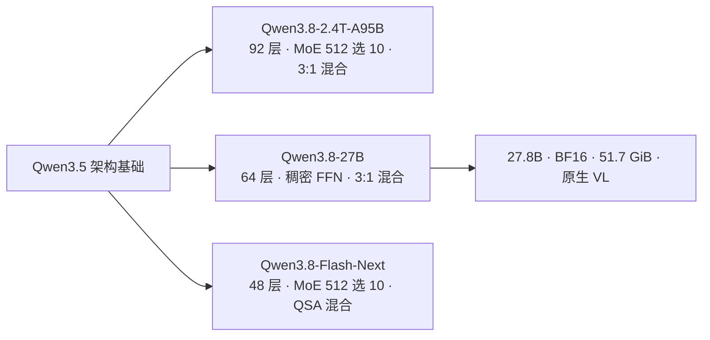

# Qwen3.8-27B：把 3:1 混合注意力压进 27B 稠密体，用可部署尺寸接住 agentic 编码

> **来源基线**：
> - 模型卡快照 `raw/01_theory/01_models/alibaba_qwen/Qwen3_8_27B_model_card_1d4bf0f2.md`，对应 [Qwen/Qwen3.8-27B `1d4bf0f2`](https://huggingface.co/Qwen/Qwen3.8-27B/tree/1d4bf0f2)（HF 仓库创建于 2026-08-05）。
> - 结构数值取自同 revision 的 `config.json` 快照 `Qwen3_8_27B_config_1d4bf0f2.json`（同目录）。
> - 参数量取自 HuggingFace safetensors 索引（2026-08-27 读取）。
>
> **维度**：开放权重发布分析（模型卡 + 权重配置交叉核对）。
> **更新**：2026-08-27。

> [!note]
> Qwen3.8 系列**没有独立技术报告**（见 [[10_qwen3_8_analysis]] 的同一结论）。本页的"报告"基线是模型卡 + 权重配置；训练数据、优化器、后训练配方均未披露。旗舰档 `Qwen3.8-2.4T-A95B` 与托管 `Qwen3.8-Max` 的分析见 [[10_qwen3_8_analysis]]，本页只覆盖 **27B 稠密档**。

---

## 一、中央论点：同一套骨架的最小可部署切片

Qwen3.8-27B 的定位在卡片第一段就说清了：把 Qwen3.8 的进展"带到一个紧凑、易部署的**稠密**模型上"，并且是**原生视觉语言模型**（`:21`）。它与 [[10_qwen3_8_analysis|2.4T-A95B 旗舰]] 共享同一条架构谱系——"Built on the architectural foundation of Qwen3.5"（`:21`）——但做了两处关键取舍：

1. **去掉 MoE，改回稠密 FFN**。旗舰是 512 专家选 10 + 1 shared；27B 的 `config.json` 里**没有任何专家字段**，只有 `intermediate_size: 17408` 的普通 FFN。
2. **保留 3:1 混合注意力**。`full_attention_interval: 4`，`layer_types` 是 `linear_attention × 3 → full_attention × 1` 的重复。

**这个组合值得单独记一笔**：混合线性注意力常被当作"超大模型才划算"的长上下文手段，而 Qwen 把它一路下放到 27B 稠密档。**稀疏性被舍弃了，混合注意力没有。**



---

## 二、结构：16 个四层 stage，稠密 FFN

模型卡把层布局写成 `16 × (3 × (Gated DeltaNet → FFN) → 1 × (Gated Attention → FFN))`（`:41`）。`config.json` 的 `layer_types` 与 `full_attention_interval: 4` 与之一致，`num_hidden_layers: 64 = 16 × 4` 也对得上。

| 组件 | 卡片声称 | 配置字段（`text_config`） | 配置值 | 对账 |
|---|---|---|---|:---:|
| 参数量 | 27B | safetensors 索引 | **27.8B**（BF16，51.7 GiB） | ✅ |
| 层数 | 64 | `num_hidden_layers` | 64 | ✅ |
| hidden | 5120 | `hidden_size` | 5120 | ✅ |
| 词表 | 248,320（padded） | `vocab_size` | 248320 | ✅ |
| FFN 中间维 | 17,408 | `intermediate_size` | 17408 | ✅ |
| 全注意力间隔 | 每 4 层 1 次 | `full_attention_interval` | 4 | ✅ |
| Gated Attention 头 | Q 24 / KV 4 | `num_attention_heads` / `num_key_value_heads` | 24 / 4 | ✅ |
| Gated Attention 头维 | 256 | `head_dim` | 256 | ✅ |
| GDN 短卷积核 | 4 | `linear_conv_kernel_dim` | 4 | ✅ |
| 原生上下文 | 262,144 | `max_position_embeddings` | 262144 | ✅ |

卡片另给了配置里看不到的 GDN 内部维度：**线性注意力 V 头 48 个、QK 头 16 个，头维 128**；Gated Attention 的 **RoPE 维 64**（`:44-51`）。MTP 只写了"trained with multiple steps"（`:53`），没有步数与接受率。

**一个耐人寻味的对照**：GDN 的头数（48 V / 16 QK）与头维（128）、Gated Attention 的头维（256）与 RoPE 维（64），**与 2.4T 旗舰完全相同**（对照 [[10_qwen3_8_analysis]] §3 的表）。变的只有 hidden（8192→5120）、层数（92→64）、Q/KV 头数（64/4→24/4）和 FFN 形态。**即：注意力单元本身是跨尺度复用的固定件。**

---

## 三、1M 上下文：不是原生的，是 YaRN 外推

卡片写"262,144 natively and extensible up to 1,000,000 tokens"（`:55`）。这里的"extensible"有明确的操作定义，不是营销话术——卡片 `Best Practices` 第 3 条（`:519-540`）直接给出了改法：把 `text_config.rope_parameters` 换成

```json
{
  "mrope_interleaved": true,
  "mrope_section": [11, 11, 10],
  "rope_type": "yarn",
  "rope_theta": 10000000,
  "partial_rotary_factor": 0.25,
  "factor": 4.0,
  "original_max_position_embeddings": 262144
}
```

262144 × 4.0 = 1,048,576。**1M 是 262K 的 4× YaRN 外推，需要使用方主动改配置或传 `--hf-overrides`**，开箱的 `config.json` 并不是这个设置。

> [!contradiction]
> **不要把"1M 上下文"写成 Qwen3.8-27B 的原生能力。** 权重配置里的 `max_position_embeddings` 是 262144；1M 要靠使用方自行启用 YaRN。卡片没有给出外推后在长上下文上的质量对照（如召回率或长文档任务分数），因此**外推的代价未知**。托管版另有说法——卡片提示 Qwen Cloud 上的 27B 将"默认 1M 上下文"并带官方内置工具（`:17`），那是**服务侧配置，不是这份权重的属性**。

卡片同时给了 agentic 任务的输出预算建议：在 1M 上下文内，**推理内容上限 262,144 token、最终回答上限 131,072 token**（`:512-515`）。这个数字本身说明了目标场景——单次任务的思考量被设计成可以达到几十万 token 量级。

---

## 四、能力位置：27B 稠密体在编码上越级

同表对比（`:78-186`，基线列为上一代同尺寸的 Qwen3.6-27B 与更大的 Qwen3.7-Plus）：

| 基准 | **Qwen3.8-27B** | Qwen3.6-27B | Qwen3.7-Plus | Opus 4.6 Max |
|---|---:|---:|---:|---:|
| QwenSWEBench † | **79.0** | 49.3 | 59.2 | 63.8 |
| SWE-bench Pro ‡ | **61.7** | 53.5 | 57.6 | 53.4 |
| DeepSWE 1.1 | **42.2** | 13.3 | 14.2 | — |
| Terminal Bench 2.1 (Terminus) | 73.0 | 63.4 | 64.0 | **78.2** |
| NL2Repo-Bench | 42.3 | 36.2 | 41.1 | **47.6** |
| CoWorkBench † | **70.7** | 61.0 | 65.1 | 68.2 |
| JobBench | **33.4** | 21.8 | 27.6 | — |
| IFBench | **79.5** | 69.1 | 79.1 | 62.5 |
| LiveCodeBench v6 | **90.3** | 83.9 | 89.6 | 88.8 |
| GPQA Diamond | 89.2 | 87.8 | 90.3 | **91.3** |
| HLE | 30.8 | 24.0 | 34.7 | **40.0** |

† 阿里内部基准（`:180,182`）　‡ 见下方反驳栏

**读法**：相对同尺寸前代（Qwen3.6-27B）的提升集中且巨大——DeepSWE 1.1 从 13.3 到 42.2（×3.2），QwenSWEBench 从 49.3 到 79.0。而**通用知识推理（GPQA、HLE）几乎没动**，HLE 甚至落后于更大的 Qwen3.7-Plus。**这是一次针对编码与 agent 的定向升级，不是全面能力跃升。**

> [!contradiction]
> **SWE-bench Pro 这一行的分数不能与其他来源的 SWE-bench Pro 分数直接比较。** 卡片脚注写明：除 Opus4.6 Max 用官方公布分外，其余模型都在 Claude Code harness 下重测，并且"**Problematic tasks were corrected, and all baseline models were re-evaluated on the refined benchmark**"（`:178`）——**阿里修改了基准本身再重测所有基线**。这在方法上未必不合理（修正有问题的题目），但意味着这张表里的 61.7 与公开榜单上的 SWE-bench Pro 分数**不是同一个量**。同理，QwenSWEBench 与 CoWorkBench 是内部基准，外部无法复现。

另外，评测统一在 **Claude Code harness、256K 上下文**下进行（`:178-183`）——用竞品的 agent 框架测自己的模型，harness 层面反而比多数厂商自测更中立。

---

## 五、视觉与思考控制

- **原生视觉语言**：`config.json` 含 `vision_config`（hidden 1024→别的尺寸见配置，`model_type: qwen3_5`），卡片声称支持图像与**小时级视频**理解，从 STEM 图表、文档到长视频（`:29`）。vLLM 侧可通过 `--media-io-kwargs` 与 `mm_processor_kwargs` 调整视频抽帧率（默认 `fps=2`，`:405-410`）。
- **思考控制三件套**（`:28`）：thinking 默认开启、可按请求关闭；`reasoning_effort` 调节推理深度；`preserve_thinking` 保留历史消息里的推理上下文。**这比 [[10_qwen3_8_analysis|2.4T 开放档强制 thinking 不可关闭]] 更灵活**，也比 [[15_kimi_k2_6_k2_7_analysis|Kimi K2.7-Code 强制 thinking]] 更灵活——对紧凑部署档来说是合理的取舍。
- **采样参数**（`:499-501`）：thinking 模式 `temperature=1.0, top_p=0.95, top_k=20`；instruct 模式 `temperature=0.7, top_p=0.80, top_k=20, presence_penalty=1.5`。

---

## 六、未披露边界

- 无技术报告：预训练 token 数、数据构成、优化器、后训练/RL 配方全部未知。
- 3:1 混合比例**没有消融**——与 [[10_qwen3_8_analysis]] 面对的是同一个缺口。
- 稠密 FFN vs MoE 在这个尺寸上的取舍**没有等 FLOPs 对照**。
- YaRN 外推到 1M 后的质量代价无数据（§3 反驳栏）。
- 三项关键基准是内部或经修改的（§4 反驳栏）。
- MTP 已训练但预测步数、接受率、是否用于公开服务均未说明。
- 视觉侧只有能力声明，卡片的 VL 基准表（`:189-224`）本页未逐行摄入。

---

## 关联页面

- [[10_qwen3_8_analysis]] — Qwen3.8 旗舰档（2.4T-A95B + Max endpoint），本页的上位页。
- [[12_qwen3_8_flash_next_analysis]] — Qwen3.8-Flash-Next：**Qwen4 架构预览**，把本页的 Gated Attention 换成 QSA。
- [[12_kimi_linear_analysis]] · [[20_gdn_kda_linear_attention_analysis]] — Gated DeltaNet / KDA 这类线性注意力的机制深挖。
- [[01_theory/01_models/index|模型架构与模型家族总索引]]
