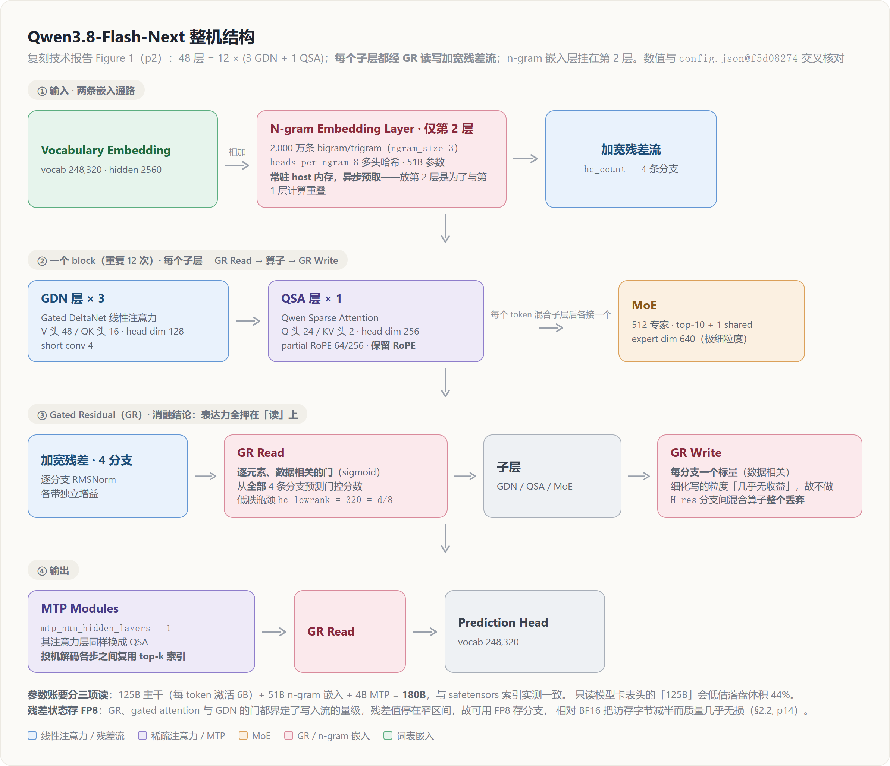
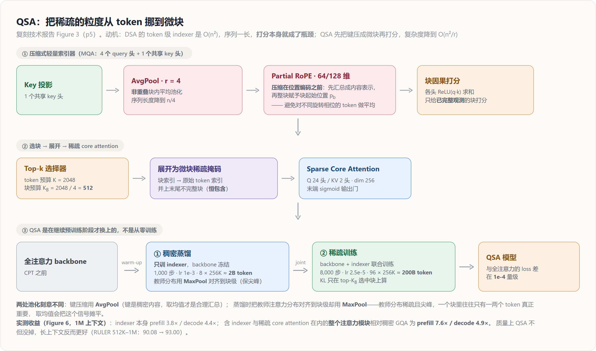

# Qwen3.8-Flash-Next 架构深挖：每一处扩展，都先算清它在 prefill 和 decode 上要付多少

> **来源基线**：Qwen Team《On the Design of Qwen3.8-Next Architecture: Evaluation, Efficiency, and Training Stability》，**2026-08-26**，随 [github.com/QwenLM/Qwen3.8-Flash-Next](https://github.com/QwenLM/Qwen3.8-Flash-Next/blob/main/tech_report.pdf) 发布的 28 页 PDF（**无 arXiv 编号**）。来源元数据见 `raw/01_theory/01_models/alibaba_qwen/Qwen3_8_Flash_Next_tech_report.md`。
> 结构数值另与开放权重 [`Qwen3.8-Flash-Next@f5d08274`](https://huggingface.co/Qwen/Qwen3.8-Flash-Next/tree/f5d08274) 的 `config.json` 交叉核对。
> **维度**：Deep Dive（机制级），覆盖报告 **§2 Model Architecture**（p3–15）。
> **更新**：2026-08-27。
>
> 本页定位符格式为 `§章节, pN`（N 为 PDF 页码）与 `Tab. n` / `Fig. n`。优化、稳定性与整体评测见 [[21_qwen3_8_flash_next_optimization_deepdive]]；发布形态总览见 [[12_qwen3_8_flash_next_analysis]]。

---

## 1. 中央论点：把"改架构"当成三轴联立方程，而不是调 loss

报告开篇就把方法论摆在了机制之前（§1, p1）：一处架构改动**同时**触及三件事——下游能做什么、训练与服务要花多少、以及训练在规模上还稳不稳。因此每个候选改动都沿三条轴评估：

1. **loss 连同下游基准**；
2. **该改动在训练 / prefill / decode 三个阶段各自的成本**；
3. **它对最优超参与训练稳定性的影响**。

报告特意说明会"**标出三条轴彼此矛盾的地方，以及这些矛盾导向了哪些设计选择**"（§1, p1）。这不是修辞——本页与 [[21_qwen3_8_flash_next_optimization_deepdive|下篇]]会反复看到 loss 与下游基准背道而驰的实例，而报告每次都选择相信下游。

结论段把这条方法论的价值讲得最直白（§5, p23）：**去掉任意一条轴，都会放进一个看似无害的捷径**——

| 捷径 | 只看哪条轴会被骗 | 实际后果 |
|---|---|---|
| 稀疏残差读取（sparse writes） | 预训练 loss + 基准 | 后训练后质量明显退化（§2.2, p14） |
| 去掉位置编码（NoPE） | 预训练 loss | 后训练后**不停止生成**的比例大幅上升（§2.1.1, p4） |
| batch-size warmup | 直觉/惯例 | 多花 18.8% 优化器步数却无收益（§3.2, p18） |

---

先给整机结构，后面各节都是对图中某一块的展开（复刻报告 Figure 1，p2；数值与 `config.json@f5d08274` 交叉核对）：

---

## 2. GDN 混合：三层线性 + 一层全局，并且**保留** RoPE

### 2.1 动机

全自注意力提供对每个前序 token 的**直接内容寻址**，但 token 混合成本随序列长度二次增长、KV cache 线性增长；滑动窗口注意力（SWA）把全局访问换成有界局部感受野，省了算力与 cache，**但窗口外的信息只能靠深度间接传播**。报告把这称为"高效局部处理"与"持久的内容相关记忆"之间的张力（§2.1.1, p3–4）。

解法是**逐层混合** GDN 与全局注意力：GDN 把前缀压进固定大小的循环状态并按当前内容更新，而穿插的全局注意力层保留**任何有限状态循环记忆都难以精确复现**的 token 级检索（§2.1.1, p4）。

### 2.2 机制：门控 delta 规则

对每个头，GDN 维护状态 $S_t \in \mathbb{R}^{d_k \times d_v}$，应用门控 delta 规则（§2.1.1 Eq. 1–4, p4）：

$$
\tilde{S}_{t-1} = \alpha_t S_{t-1}, \qquad
e_t = v_t - \tilde{S}_{t-1}^\top k_t, \qquad
S_t = \tilde{S}_{t-1} + \beta_t k_t e_t^\top, \qquad
y_t = S_t^\top q_t
$$

等价地（Eq. 5）：

$$
S_t = \alpha_t \left( I - \beta_t k_t k_t^\top \right) S_{t-1} + \beta_t k_t v_t^\top
$$

**两个门的分工是理解 GDN 的关键**（§2.1.1, p4）：衰减 $\alpha_t$ 全局控制既有状态的**存活时长**，而 delta 项先估计 $k_t$ 已经关联到的值、**只写入残差误差**。因此重复或相似的 key 会**更新已有关联**，而不是不断累加外积——报告把这个"定向擦写"操作称为 GDN 区别于纯加性线性注意力之处。

参数化（Eq. 6–11, p4）：

| 步骤 | 形式 | 用意 |
|---|---|---|
| $q_t, k_t$ | `L2Norm(SiLU(ShortConv(W x)))` | 短因果卷积给出显式局部归纳偏置；**L2 归一化界定 q/k 幅值，稳定秩一 delta 转移** |
| $v_t$ | `SiLU(ShortConv(W_v x))` | 同上，但不做 L2 |
| $\beta_t$ | $\sigma(W_\beta x_t)$ | 写入强度 |
| $\alpha_t$ | $\exp[-\exp(A)\,\mathrm{softplus}(W_\alpha x_t + b)]$ | 衰减 |
| 输出 | $W_o[\sigma(W_z x_t) \odot \mathrm{RMSNorm}(y_t)]$ | **改用有界 sigmoid 门**（原 GDN 用 SiLU），报告称"在我们的实验中一致地更好" |

配置侧对账：`linear_attn_config.num_heads=64`、`head_dim=128`、`short_conv_kernel_size=4`、`gate_lower_bound=-5.0` 与报告一致。另外报告沿用 Qwen3-Next 的**零中心 RMSNorm** 约束 RMSNorm 权重增长，并**在全模型所有 RMSNorm 层统一采用**（§2.1.1, p4）。

### 2.3 证据：Tab. 1 的三方架构消融

28 层 25B-A3B MoE（Qwen3.5 架构），先在 4K 上下文上预训练 400B token，再在 32K 上训 80B token。两个混合变体都是**每 4 层 1 层全注意力**，其余分别用 SWA（窗口 128）或 GDN（§2.1.1, p5）。

| 架构 | MMLU | MMLU-Pro | SuperGPQA | MATH | GSM8K | BBH | MMMLU | EvalPlus | MultiPL-E | **Avg.** |
|---|---:|---:|---:|---:|---:|---:|---:|---:|---:|---:|
| 全注意力 Transformer | 62.65 | 37.59 | 21.76 | 49.40 | 75.13 | 63.78 | 47.74 | 51.01 | 39.73 | **49.87** |
| SWA 混合 | 66.26 | 40.67 | 22.45 | 45.48 | 74.22 | 65.88 | 51.33 | 49.71 | 41.93 | **51.15** |
| **GDN 混合** | 66.30 | 42.82 | 23.45 | 53.98 | 77.07 | 68.72 | 54.83 | 52.12 | 47.48 | **53.81** |

GDN 混合在 9 项中的 8 项优于 Transformer、7 项优于 SWA 混合（§2.1.1, p5）。

> [!note]
> 报告自己给这份消融划了边界：**"These results motivate a hybrid design, but they do not by themselves isolate which architectural component causes each improvement."**（§2.1.1, p4）——它证明"混合优于不混合、GDN 优于 SWA"，**不证明 3:1 这个比例最优**。3:1 的依据报告只给了一句定性表述："这个调度在效率与质量之间取得有利平衡，而周期性全注意力对长上下文尤其重要"（§2.1.1, p4）。**比例本身仍无消融。**

### 2.4 一处与 GLM-5.3-Flash 相反的取舍：保留 RoPE

报告明确写道（§2.1.1, p4）：

> RoPE 与不带位置编码的 NoPE 变体在**预训练期几乎没有差别**，但 NoPE 变体在**后训练之后出现明显更高的不停止生成（endless generation）比例**，因而更容易无法终止。

因此 Qwen 在全注意力层**保留** RoPE。

> [!contradiction]
> **这与 [[12_glm_5_3_flash_analysis|GLM-5.3-Flash]] 的选择正相反。** GLM-5.3-Flash 的 `config.json` 是 `qk_rope_head_dim: 0` 且 `mla_use_nope: true`——在同样是"线性 + 稀疏混合"的架构里**去掉了注意力层的 RoPE**。
>
> 本库此前在 GLM 页对该选择的解释是【推断】"位置信息由 KDA 层承担"。Qwen 的实验说明：**这个推断在预训练指标上成立，但可能在后训练后失效**——而失效模式（不停止生成）恰恰是预训练 loss 看不见的。
>
> **两家都没有错**：Qwen 测的是自己的 GDN 混合 + 自己的后训练配方，GLM 未公开任何相关数据。但这条把"NoPE 在混合架构里是安全的"从一个看似合理的推断，降级为**一个已被至少一家厂商实测推翻的假设**。引用 GLM-5.3-Flash 的 NoPE 设计时应一并带上这条。

### 2.5 Kernel：FlashQLA

GDN kernel 用 **FlashQLA**（基于 TileLang 的融合线性注意力 kernel 库）优化，在多种 NVIDIA GPU 设置下相对 FLA Triton kernel 取得**前向 2–3× / 反向约 2×** 加速，开源于 [github.com/QwenLM/FlashQLA](https://github.com/QwenLM/FlashQLA)（§2.1.1, p5）。

---

## 3. QSA：把稀疏的粒度从 token 挪到微块，并且**在 CPT 阶段才换上**

### 3.1 动机：被忽略的 indexer 成本

报告对 DSA（[[26_deepseek_v4_technical_deepdive|DeepSeek 稀疏注意力]]）的评价很精确（§2.1.2, p5）：它用轻量 indexer 生成 **token 级**稀疏掩码，推理加速可观，**但随序列变长，其 $O(n^2)$ indexer 的开销仍不可忽略**。

换句话说：稀疏注意力把 core attention 压下去之后，**打分这一步自己变成了瓶颈**。QSA 的全部设计都围绕这一点。

### 3.2 机制：先压缩、再打分

索引器采用 **MQA**：$H$ 个 query 头 + **1 个共享 key 头**（§2.1.2 Eq. 12, p6）。key 按 $r$ 个 token 的**非重叠块**用平均池化压缩（Eq. 13）：

$$
\bar{k}_b = \mathrm{RMSNorm}\left(\mathrm{AvgPool}(k_{p_b : p_b + r - 1})\right), \qquad 0 \le b < \tfrac{n}{r}
$$

块重要性用**块因果**打分（Eq. 15），对各索引头的 ReLU 激活相似度求和：

$$
I_{ib} = \begin{cases}
\sum_{h=1}^{H} \mathrm{ReLU}\left(\langle q_i^h,\ \tilde{k}_b \rangle\right), & p_b + r - 1 \le i \\
-\infty, & \text{otherwise}
\end{cases}
$$

块因果条件保证每个 query **只给已被完整观测的块打分**。给定 token 预算 $K$，块预算 $K_B = K / r$（Eq. 16）。选中的块展开回原始 token 索引并截断到 $K$，再**并上末尾那个不完整块中的 token（永远包含）**（§2.1.2, p6）。

**一处非显然的顺序设计**（§2.1.2 Eq. 13–14, p6）：

> [!note]
> **key 压缩发生在位置编码之前。** 每个块先被汇总成一个内容表示，**然后**才被赋予单一的块级位置 $p_b$。报告给的理由是：这个顺序**避免了对处于不同旋转相位的 token 表示做平均**。
>
> 若顺序反过来（先加 RoPE 再池化），块内 4 个 token 的旋转相位互不相同，平均会破坏相位信息。这是"先压缩后打分"这条路线上一个容易踩空的细节。

Partial RoPE 施加于每个索引头 128 维中的 **64 维**，与 core attention 的旋转维一致——配置侧 `partial_rotary_factor: 0.25 × head_dim 256 = 64` 对上。

### 3.3 训练：两阶段，并且是在**继续预训练**阶段才换上

这是模型卡完全没提、但对理解 QSA 至关重要的一节（§2.1.2 Training Details, p6–7）。QSA **不是从零训练的**，而是在 CPT 阶段以 256K 序列长度引入，分两步：

| 阶段 | 训什么 | 目标 | 超参 |
|---|---|---|---|
| **Stage 1 稠密蒸馏** | **只训 indexer**，backbone 冻结 | 把 backbone 的全序列注意力分布蒸馏进 indexer | **1,000 步**，lr $1\times10^{-3}$，每步 8 条 × 256K ≈ **2B token** |
| **Stage 2 稀疏训练** | backbone + indexer 联合 | 让 backbone 适应稀疏注意力模式 | **8,000 步**，lr $2.5\times10^{-5}$，每步 96 条 × 256K ≈ **200B token** |

**教师分布的构造**（Eq. 17）：把所有教师头的 softmax 注意力分布**求和**后做 L1 归一化得到 token 级分布 $a_i$；再用 **MaxPool**（不是 AvgPool）对齐到块级：

$$
\bar{a}_{ib} = \mathrm{MaxPool}(a_i,\ p_b{:}p_b{+}r{-}1), \qquad \hat{a}_i = \frac{\bar{a}_i}{\lVert \bar{a}_i \rVert_1}
$$

> [!note]
> **这里用 MaxPool 而 §3.2 的 key 压缩用 AvgPool，两者刻意不同。** 报告给的理由是 MaxPool "保留了在聚合中本会被稀释的显著 token 级信号"（§2.1.2, p6）。教师分布是**稀疏且尖峰**的——一个块里往往只有一两个 token 真正重要，平均会把这个信号摊平；而 key 表示是**稠密内容**，平均才是合理的汇总。同一篇报告里对两种池化的分别使用，本身就是对"该保留峰值还是该保留均值"的一次明确表态。

Stage 1 的 KL 损失只在**完整 key 块**上计算（Eq. 18）；Stage 2 则只在 **top-$K_B$ 选中块**上算，且教师概率先在 $B_i$ 内重归一化（Eq. 20）。

**落地配置**（§2.1.2 Implementation Details, p7）：backbone **与 MTP 模块中的全部全注意力层**都被替换为 QSA；索引器 4 个 query 头 + 1 共享 key 头；$K = 2048$、$r = 4$ → 每 query 选至多 **512 个完整块**。

### 3.4 证据一：QSA 不但不掉点，还略涨

**Tab. 2 短上下文通用能力**（§2.1.2, p8）：

| Method | MMLU-Pro | SuperGPQA | MATH | GSM8K | BBH | MMMLU | EvalPlus | MultiPL-E | **Avg.** |
|---|---:|---:|---:|---:|---:|---:|---:|---:|---:|
| Full Attn | 72.9 | 51.7 | 69.8 | 91.0 | 90.4 | 81.8 | 70.8 | 78.4 | **75.9** |
| **w/ QSA** | **73.7** | **52.1** | **71.6** | **92.2** | **91.6** | 81.1 | **72.3** | **79.8** | **76.8** |

8 项中 7 项持平或更优，均值 75.9 → 76.8。

**Tab. 3 长上下文检索**（§2.1.2, p8）：

| Method | RULER 128K | 128–256K | 256–512K | 512K–1M | MRCR 128K | 256K | 512K | 1M | **Avg.** |
|---|---:|---:|---:|---:|---:|---:|---:|---:|---:|
| Full Attn | 99.84 | **99.81** | 97.65 | 90.08 | **97.14** | **94.20** | 30.66 | 20.71 | **78.76** |
| **w/ QSA** | **99.89** | 99.62 | **98.95** | **93.00** | 95.98 | 93.00 | **40.53** | **26.44** | **80.93** |

**QSA 在短长度上与全注意力相当，越长反而越好**：RULER 512K–1M 从 90.08 → 93.00；MRCR 512K 从 30.66 → **40.53**、1M 从 20.71 → **26.44**。

> [!contradiction]
> **别把"QSA 在 1M 上赢了全注意力"读成"1M 检索已经解决"。** 同一张表里，MRCR 在 512K 与 1M 上**两个方法都断崖式下跌**（全注意力 97.14 → 30.66 → 20.71；QSA 95.98 → 40.53 → 26.44）。QSA 的相对优势（+9.87 / +5.73）是在一个**双方都已严重退化**的区间里取得的。RULER 保持在 90+ 而 MRCR 跌到 20–40，说明两个基准的难度天差地别，**不能用 RULER 的 93 分去暗示 1M 多针检索可用**。

**Tab. 4 MTP 接受长度**（四步投机解码，§2.1.2, p8）：全注意力均值 4.06 vs QSA 4.07，**无显著变化**。报告注明这里**跟随 GLM 的做法，在投机解码各步之间复用 top-k 索引**（引 GLM-5-Team, 2026）——与 config 中 MTP 相关字段一致。

### 3.5 证据二：与 IndexShare 的正面对比

这是本页对本库最有价值的一条外部证据。报告在 **Fig. 5(a)**（§2.1.2, p8–9）把 **training-aware IndexShare (Bai et al., 2026)** 作为基线，与 QSA 在同一张 RULER-vs-indexer 延迟图上比较：

| 方法 | 达到全注意力基线所需的相对 indexer 延迟 |
|---|---|
| **QSA** | **0.25** 时即持平全注意力基线 |
| IndexShare | **0.5 时仍低于基线** |

报告的解释（§2.1.2, p8）：对 IndexShare 而言，0.5 意味着"在**被三层 GDN 隔开的两个全注意力层**之间共享一份索引"，而"**这一结果凸显了层内压缩在混合架构中的优势——跨层索引共享会被较低的层间相似度所限制**"。

同样的论点在 §2.1.2 开头也讲过（p5–6）：与跨层共享索引的方法相比，QSA 的**层内序列压缩更少依赖跨层相似性，因而天然适配混合架构**。

> [!note] 三条限定，缺一不可
> 1. **这是 Qwen 在自己架构里复现的 IndexShare**，不是 GLM 官方结果。GLM-5.2 是 **78 层全 DSA**、相邻稀疏层紧挨着；Qwen 是 **3 层 GDN 隔开 1 层注意力**。层间距离差异巨大，而报告的结论恰恰就是"跨层共享吃层间相似度"——**这个对比在结构上先天不利于 IndexShare**，报告也确实把结论限定在 "in hybrid architectures"。
> 2. **本库对 IndexShare 的记录来自 [[11_glm_5_1_5_2_analysis|GLM-5.2 模型卡]]，其声称是"1M 上下文下 per-token FLOPs 降低 2.9×"**——那是**成本**指标，与这里的"RULER 质量 vs indexer 延迟"是不同的量，两者不冲突也不能互证。
> 3. **命名订正**：Qwen 引用的 arXiv:2603.12201 实际标题是 **"IndexCache: Accelerating sparse attention via cross-layer index reuse"**，而 GLM-5.2 模型卡称之为 "IndexShare"。**同一篇论文两个名字**，检索时两个都要试。

### 3.6 证据三：微块大小与索引头数

**微块大小**（Fig. 5(a) 中的 Block 4 / 8 / 16）：RULER 分数随块增大而下降（Block 16 最低，约 80；Block 8 约 82；**Block 4 约 85–86**）。这**回答了此前只看模型卡时无法回答的"为何 $r$ 取 4"**——更大的块省更多 indexer 延迟，但 RULER 掉得更快。

**索引头数**（Fig. 5(b)，1 / 2 / 4 / 16 头）：报告的两条观察（§2.1.2, p9）——

- **"After dense initialization, directly applying the indexer for sparse attention leads to a clear performance drop."** 即 Stage 1 之后直接上稀疏会明显掉点，**必须经过 Stage 2 的短暂联合训练**让 backbone 适应，才能回到全注意力水平。这是对 §3.3 两阶段设计必要性的直接证据。
- QSA 用**远少于 core attention 的索引头数**即可维持性能；最终取 **4 头**作为平衡推理速度与精度的轻量配置。

消融均在 **35B-A3B** 规模、Stage 2 之后的 CPT 模型上评测（§2.1.2, p8）。

### 3.7 效率：indexer 复杂度 $O(n^2) \to O(n^2/r)$

压缩比 $r$ 直接把 indexer 的 MQA logits 计算与 top-k 选择成本降下来，加速幅度与压缩比相当（§2.1.2 Efficiency Analysis, p9）。

**Fig. 6 kernel 级实测**（1M 上下文处的加速倍数，稠密基线用 FlashInfer 的 paged GQA；prefill 为 16K chunk、BS=1，decode 为 BS=4、`next_n=4` 即三步 MTP）：

| 测量对象 | Prefill @1M | Decode @1M |
|---|---:|---:|
| 仅 indexer（$r{=}4$ vs $r{=}1$） | **3.8×** | **4.4×** |
| 整个注意力模块（含 indexer + 稀疏 core attention）vs 稠密 GQA | **7.6×** | **4.9×** |

QSA 从 **64K 上下文起**就有加速，且随长度增长而扩大。

训练侧另有一个融合 kernel：**同时计算稀疏注意力输出与 KL 损失，不物化中间结果**，大幅降低显存（§2.1.2, p7）。

---

## 4. Gated Residual：把表达力全押在"读"上

### 4.1 动机

预归一化在规模上保持训练稳定，但它**衰减每层收到的信号**：所有 block 读同一条流，早期写入的特征必须与之后写入的一切竞争（§2.2, p10）。

报告把直接改残差路径的工作分成两族：**让读写更有表达力**（highway 网络一系），以及**加宽流本身**（AltUp、Hyper-Connections）。并指出**两者互补**——"加宽增加容量，更丰富的读写机制决定这份容量怎么花"（§2.2, p10）。

### 4.2 先量化"只加宽"值多少

报告先用一个适配 pre-norm 的简化 AltUp 变体单独测"宽度本身"的贡献（§2.2 Eq. 21–22, p10）：残差状态是 $n_r$ 个分支 $R^{(\ell)} \in \mathbb{R}^{n_r \times d}$，每个 block 用 $n_r$ 个可学标量加权求和读入，输出按深度**轮转（round-robin）**写回单一分支。

> 这只给每 block 增加 $n_r$ 个参数、**没有矩阵乘**，计算成本可忽略；额外代价只是携带 $n_r$ 条分支的访存。即便如此，它把 25B-A3B MoE（400B token）的训练 loss 降低了约 **0.01**。（§2.2, p10）

**只加宽就值 0.01 loss**——这是后续所有读写机制的比较基准。

### 4.3 HC 的统一形式与 mHC 的位置

HC 把上述两式推广为三个可学算子（§2.2 Eq. 23–28, p10）：读算子 $H_{\mathrm{mix}}$、写算子 $H_{\mathrm{combine}}$、分支间混合算子 $H_{\mathrm{res}}$，每个都是"静态项 + 数据相关项"：

$$
H_\bullet = H_\bullet^{s} + \lambda_\bullet\, \phi\!\left(\tilde{R} W_\bullet\right)
$$

报告在此明确给出 mHC 的定位（§2.2, p10）：

> HC 用 $\phi = \tanh$、$\lambda$ 初始化为 0.01；**mHC (Xie et al., 2025) 改用 sigmoid，并额外把 $H_{\mathrm{res}}$ 约束到双随机矩阵流形上**。

这正是本库 [[25_mhc_analysis]] 记录的机制。**至此，本库此前的一条【推断】被源头确认**：

> [!note] 对本库既有推断的确认与修正
> [[12_qwen3_8_flash_next_analysis]] 曾据配置字段前缀 `hc_` 推断 Gated Residual 与 Hyper-Connections / mHC 同源，并标注"两家均未确认"。**技术报告直接确认了这一点**：§2.2 (p12) 原文写 **"GR belongs to the same family as HC, mHC and VWN (Seed, 2025)"**，且 Tab. 5 就是拿 mHC 当基线做的消融。该推断可升级为事实。
>
> 但**"Qwen 采用了 mHC"仍然是错的**——GR 与 mHC 的分歧点恰恰在最关键处，见 §4.6。

### 4.4 证据：Tab. 5 消融

25B-A3B MoE，**560B token**，评测套件与 §2.1.1 相同；所有加宽变体用 $n_r = 4$ 分支（§2.2, p11）：

| 残差方案 | Loss | MMLU | MMLU-Pro | SuperGPQA | MATH | GSM8K | BBH | MMMLU | EvalPlus | MultiPL-E | **Avg.** |
|---|---:|---:|---:|---:|---:|---:|---:|---:|---:|---:|---:|
| Pre-norm | 1.617 | 64.29 | 38.40 | 21.78 | 53.92 | 77.41 | 64.73 | 51.26 | 49.25 | 37.15 | **50.91** |
| mHC（静态） | 1.596 | 64.62 | 43.69 | 22.20 | 55.08 | 78.05 | 65.42 | 52.78 | 49.59 | 40.94 | **52.49** |
| mHC（动态） | 1.594 | 66.11 | 45.84 | 24.20 | 59.54 | 78.51 | 66.01 | 56.61 | 52.16 | 41.30 | **54.47** |
| **GR** | **1.590** | **66.69** | **46.02** | 23.80 | **61.18** | 78.20 | **66.54** | 56.19 | 51.36 | **42.00** | **54.66** |

*（本页对上表做过三处算术自洽核验：静态较 pre-norm 降 loss 0.021、动态较静态再降 0.002、静态较基线 +1.58 分而动态再 +1.98 分，均与 §2.2 正文表述一致。）*

### 4.5 五条塑造了最终设计的观察（§2.2, p10–11）

| # | 观察 | 结论 |
|---|---|---|
| 1 | **有界正门**：sigmoid 门在 loss 与训练稳定性上都优于 tanh | 与 mHC 一致，也与 GDN/注意力处"sigmoid 优于 SiLU/tanh"的观察一致 |
| 2 | **数据依赖**：让 $H_{\mathrm{mix}}$/$H_{\mathrm{combine}}$ 数据相关，**loss 只降 0.002**（静态相对基线降 0.021），**但基准涨 1.98 分**（静态相对基线涨 1.58） | **两个比例正好相反**——报告点名这是"loss 与下游准确率不同向"的又一例 |
| 3 | **读的粒度比写的粒度重要**：把 $H_{\mathrm{mix}}$ 从"每分支一个标量"细化到"每分支每通道一个权重"有效；对 $H_{\mathrm{combine}}$ 做同样细化**几乎无收益** | **写保持每分支一个标量** |
| 4 | **要读全部分支**：从所有分支预测算子优于只用最后一个分支或先池化；**逐分支单独归一化**（即对加宽流做 group RMSNorm）再有增益 | — |
| 5 | **$H_{\mathrm{res}}$ 贡献很小**：读与写足够有表达力之后，$n_r \times n_r$ 混合算子**无显著改进** | **直接丢弃 $H_{\mathrm{res}}$** |

观察 2 是全篇方法论的最强注脚：**若只看 loss，"静态→动态"这一步只值 0.002，几乎会被判为噪声而砍掉；但它实际值 1.98 个基准点。** 报告原话是这"强化了我们在整个设计过程中把基准与 loss 并看的做法"（§2.2, p11）。

观察 3 则**精确解释了模型卡那句"elementwise data-dependent read gate + per-branch scalar write gate"**——这不是随意的不对称，而是消融结论。

### 4.6 GR 的定义，以及它与 mHC 的真正分歧

GR 的来源是另一项工作中的 **GatedNorm**（Qiu et al., 2026）——在 RMSNorm 后加一个轻量逐元素自门控（§2.2 Eq. 29, p11）：

$$
\begin{aligned}
\mathrm{GatedNorm}(u) &= \mathrm{RMSNorm}(u) \odot \sigma(g), \\
g &= W_2\,\mathrm{SiLU}\!\left(W_1\,\mathrm{RMSNorm}(u)\right)
\end{aligned}
$$

报告指出：**消融得出的那个"逐元素、数据相关、sigmoid 门"的读，恰好就是 Eq. 29 作用于加宽流**，于是把两者合并，称为 Gated Residual（§2.2, p11）。

具体形式（Eq. 30–34）：先对每分支独立 RMSNorm（各自带增益 $\gamma_i$），再从**全部分支**预测逐分支逐通道的门控分数并平均：

$$
\begin{aligned}
G &= \mathrm{unvec}\left(W_u\,\mathrm{SiLU}\!\left(\tfrac{1}{n_r} W_d\,\mathrm{vec}(\tilde{R})\right)\right) \in \mathbb{R}^{n_r \times d}, \\
x &= \frac{1}{n_r}\sum_{i=1}^{n_r} G_i \odot \tilde{R}_i
\end{aligned}
$$

写回则用**每分支一个数据相关标量**：$s = 2\sigma\!\left(\tfrac{1}{n_r} W_w \mathrm{vec}(\tilde{R})\right)$，$R_i \mathrel{+}= s_i y$。

**瓶颈秩 $r = d/8$**（§2.2, p11）。

> [!note] 与开放权重配置的精确对账
> $d = 2560$（`hidden_size`）→ $r = 2560/8 = $ **320**，与 `config.json` 的 `hc_lowrank: 320` **精确吻合**；$n_r = 4$ 与 `hc_count: 4` 吻合。
> 报告另注明：**注意力块与 MLP 块各有一个独立的 GR 模块**，且 GR 不需要特殊初始化（静态项 $H^s$ 对 GR 无改进，标准随机初始化即可）。

**GR 与 mHC 的分歧**（§2.2, p12）——报告把整个家族的取舍讲得很清楚：

| 方案 | 读 $H_{\mathrm{mix}}$ | 写 $H_{\mathrm{combine}}$ | 混合 $H_{\mathrm{res}}$ | 额外投入方向 |
|---|---|---|---|---|
| HC | 每分支标量 | 每分支标量 | 有，tanh | $H_{\mathrm{res}}$ |
| **mHC** | 每分支标量 | 每分支标量 | 有，**约束为双随机矩阵** | $H_{\mathrm{res}}$ + 流形约束 |
| VWN | 每分支标量 | 每分支标量 | — | **加宽 token 嵌入**并切成多个窄段 |
| **GR** | **逐元素门控** | 每分支标量 | **丢弃** | **读** |

Tab. 5 中 GR 与 mHC（动态）**在该规模上表现相当**（54.66 vs 54.47）；GR 的优势在别处：

- **效率**：丢掉 $H_{\mathrm{res}}$ 就**省掉每个 block 对残差状态的一次完整读取**——而这正是加宽流的主导推理成本。
- **稳定性**：双重收益——GatedNorm 本身改善训练稳定性（证据见 [[21_qwen3_8_flash_next_optimization_deepdive|下篇]] §3.3），且丢弃需要单独施加约束的 $H_{\mathrm{res}}$ **移除了一个潜在的不稳定来源**。

### 4.7 Fig. 7：GR 实际上把信息送去了哪里

报告做了一项少见的机制分析——把 GR 相对无 GR 参考模型**新增的跨层路径**量化出来（20 层 MoE，同配方同数据同步数，§2.2, p13）。定义每条路径的额外贡献份额 $\Delta\mu_{uv}$（分解精确到 $3\times10^{-8}$），只看 $\Delta\mu_{uv} \ge 0.05$ 且跨至少一层的路径，780 个有序对中命中 **21 条**。

结论异常清晰：

> **一条分支承载长程路径，另外三条保持局部。** 跨 5 个 GR checkpoint，每个都恰好有一条这样的分支，其典型跳距 **10.9 层**，其余三条为 **3.4–3.9 层**。

三个实例（括号内为"无 GR 参考模型 → GR"）：

| 路径 | 份额变化 | 说明 |
|---|---|---|
| Layer 0 GDN → Layer 15 attention | 0.020 → **0.138** | 在第 10–19 层的每个 reader 上都维持 0.072–0.138 且无下降趋势 |
| Layer 10 GDN → Layer 11 attention | → **0.117** | 增幅与上条相当，**但只跨一层**——GR 同时强化短程连接 |
| Layer 0 MLP → 两条分支 | 长程支 0.008 → 0.058；局部支 0.139 → 0.192 | **同一个输出以不同强度同时抵达近端与远端 reader**——单条残差流做不到，因为它对每个 writer 只有一个衰减率 |

按跳距分组求和后的整体图景（§2.2, p14）：**相邻层路径（skip 1）合计 +0.96，长程路径（skip > 12）合计 +0.91，而中程路径（skip 2–12）合计 −3.21**；加权平均跳距几乎不变（3.97 vs 3.91）。

> **即：跨层信息的总量没变，变的是分布。GR 挑出少数几条路径并放大它们，代价是中程路径。**

还有一条对混合架构特别有意义的观察（§2.2, p14）：**最重度读取 GR 分支的子层以 softmax 注意力层为主**，说明"全局注意力充当了整合显式长程历史上下文的关键枢纽，而这些上下文正是 GDN 层压缩掉的"。**这为 3:1 混合中那 1 层全注意力给出了功能性解释**，虽然仍不构成对比例本身的消融。

### 4.8 推理效率：两次尝试，一次否决一次采用

GR 的推理成本由加宽残差状态的**访存**主导，报告因此找了两条减少字节搬运的路（§2.2, p14）：

**尝试一：稀疏化读取——被否决。** 观察到训练后的模型里，每个 GR 层的写入通常由两条分支主导，于是尝试让每个 block 只读门控值最高的 2 条分支（从零训练或训练中途切换均试过）。

> **预训练 loss 与基准几乎不受影响，但后训练之后质量明显退化**，因此没有采用。跨层变化稀疏度等更复杂的变体也没能解决。报告原话：**"We note this as a case where pre-training metrics alone would have led to the wrong decision."**（§2.2, p14）

这是本报告第二个"预训练指标会骗人"的实例（第一个是 §2.4 的 NoPE）。报告顺带提到 xHC (Zhang et al., 2026) 用更大的 $n_r$ 让稀疏分支更新更容易，但考虑到更大 $n_r$ 的显存开销未继续。

**尝试二：残差状态存 FP8——采用。** 理由很漂亮（§2.2, p14）：**GR、gated attention 与 GDN 的门都界定了写入流中的量级，因此残差值停留在窄区间内，天然适配低精度格式。** 分支存 FP8 相对 BF16 **把残差状态的访存字节减半，质量几乎无损**。

此外，读（Eq. 30–32）与写（Eq. 33–34）各融合成单个 kernel，**group RMSNorm 折进读**，使加宽流每个 block 每个方向**只被遍历一次**。

---

## 5. N-gram 嵌入：把容量放到骨干之外

### 5.1 动机与本库既有页面的关系

嵌入式记忆为扩展模型容量提供了一条互补维度；n-gram 嵌入进一步把记忆检索**条件化于局部上下文**而非仅 token 身份：以每个 token 结尾的短 n-gram 作为键查表，取回的向量增强对应的 token 表示。其价值在于**以可忽略的每 token FLOPs 扩容**，而**确定性寻址使 host 内存卸载与异步预取成为可能**（§2.3, p14–15）。

> [!note] 对本库既有边界的修正
> [[12_qwen3_8_flash_next_analysis]] 曾写"卡片**没有引用** Engram，两者是否有承袭关系无法判定"。**技术报告的参考文献确认了引用关系**：§2.3 的动机段引用了 **Cheng et al., 2026《Conditional memory via scalable lookup: A new axis of sparsity for large language models》**——作者含 Xin Cheng、Damai Dai、Wenfeng Liang 等 DeepSeek 成员，即本库 [[29_engram_analysis]] 所分析的那条路线。同段还引用了美团的 Liu et al., 2026（arXiv:2601.21204，《Scaling embeddings outperforms scaling experts in language models》）。
>
> 即：**Qwen 明确把自己放在这条已有的"记忆稀疏"研究线上**，而非独立发明。但报告未与 Engram 做实现级对比。

全节实验统一使用 **300 TPP**（tokens per active parameter）（§2.3, p14）。

### 5.2 放置位置：单层足够，第 2 层是为了预取

**Tab. 7**（固定 n-gram 参数总量，§2.3.1, p14）比较了浅层（1–4）、中层（10、15）、深层（25）单层放置，以及"第 2 层 + 第 15/25 层"的多层组合。三条结论：

1. **没有哪个深度区间一致占优**；前两层表现强，中层与深层也有竞争力。
2. **把同样的参数预算分散到多层没有一致收益**——"第 2 层 + 第 25 层"组合带来的边际 loss 下降（1.540，全表最低）**没有转化为下游提升**。**单层就够。**
3. 不同放置的相对表现在全注意力与 GDN 下**相似**，说明放置选择**对注意力机制基本不敏感**。

最终放在 **Layer 2**，理由是**让 host 内存预取与第 1 层的计算重叠**（§2.3.1, p15）。

> 这就是 `config.json` 中 `ple_layer_ids: [2]` 的真正原因——**不是某种表示学习上的最优深度，而是一个流水线重叠的工程选择**。只看配置无从得知。

### 5.3 词表缩放：两种口径，两个结论

**口径一：固定总参数预算**（Tab. 8，§2.3.2, p15）——扩 n-gram 槽位的同时**减少 MoE 专家数**以保持总量不变，词表规模以基础 tokenizer 词表 $V = 250\text{K}$ 为单位。

| 词表规模（参数占比） | Loss | Uncheatable PPL | MMLU | MMLU-Pro | C-Eval | CMMLU |
|---|---:|---:|---:|---:|---:|---:|
| None (0%) | 1.202 | 5.55 | 68.25 | 44.38 | 70.78 | 73.01 |
| 5× (10%) | 1.200 | 5.54 | 68.15 | 44.49 | 70.93 | 73.44 |
| **10× (25%)** | **1.197** | 5.55 | 67.71 | 44.66 | 70.71 | 73.31 |
| 30× (50%) | 1.201 | 5.59 | 67.75 | 42.61 | 72.49 | 73.28 |

loss 随词表**非单调**变化，在 10×（25%）处最低——与既有工作报告的配比甜点一致。**但这个最优点在其他评估上并不存在**：域外 uncheatable PPL 几乎不变，下游基准相对纯 MoE 基线**没有明显改善**。

报告由此得出一个结构性结论（§2.3.2, p15）：**"N-gram embeddings and MoE experts play distinct roles in scaling capacity."** —— 于是**放弃固定预算的框架**，转而在保持 MoE 预算不变的前提下研究词表缩放。

**口径二：额外增加参数**（Tab. 9，§2.3.2, p15）——MoE 预算固定，词表从 20× 扩到 200×：

| 词表规模 | Loss | MMLU | MMLU-Pro | MATH | GSM8K | BBH | **C-Eval** | **CMMLU** | MMMLU |
|---|---:|---:|---:|---:|---:|---:|---:|---:|---:|
| None | 1.585 | 62.78 | 33.43 | 32.52 | 59.21 | 53.40 | 66.91 | 68.10 | 54.06 |
| 20× | 1.553 | 64.14 | 34.46 | 37.38 | 65.09 | 57.13 | 71.75 | 72.29 | 55.94 |
| 50× | **1.541** | **64.71** | **35.80** | 37.32 | 64.00 | **57.56** | 72.12 | 72.48 | **56.64** |
| 100× | 1.534 | 64.70 | 35.87 | 36.98 | 63.08 | 56.03 | 73.75 | 72.73 | 56.65 |
| 200× | **1.526** | 64.85 | 35.21 | 35.34 | 62.96 | 56.23 | **74.94** | **73.24** | 55.82 |

**这是全篇"loss 与下游不同向"最锋利的一个例子**：

- **loss 单调下降**（1.585 → 1.553 → 1.541 → 1.534 → 1.526），一路到 200× 都没有回头；
- **下游不跟随**：MMLU-Pro 在 50–100× 见顶后回落，MATH 从 20× 的 37.38 一路降到 200× 的 35.34，GSM8K 同样在 20× 达峰后单调下滑；
- **唯一一致跟随的是中文**：C-Eval 66.91 → 74.94、CMMLU 68.10 → 73.24，**随词表单调改善**。

> [!note] 出厂配置落在哪里
> 发布权重的 `ngram_vocab_size_base` 是 **20,000,000**。以报告的基础词表 $V = 250\text{K}$ 计，**20M / 250K = 80×**（本页算术），落在 50× 与 100× 之间——即**下游已基本饱和、而 loss 仍在下降**的区间。报告没有说明 80× 是如何选定的，也没有给 80× 这一档的数据。

报告还坦白了一批**没成功**的尝试（§2.3.2, p15）：token 归一化做词表压缩、跨 n-gram 阶数的非均匀分配、基于频率的嵌入槽划分——"尽管做了这些努力，在我们的训练配方下**未观察到一致的性能收益**"。

---

## 6. 未解决的问题（报告自身留下的）

- **3:1 混合比例仍无消融**（§2.3）——Tab. 1 证明的是"混合优于不混合、GDN 优于 SWA"，不是比例最优。§4.7 的路径分析给了功能性解释，但不是对比实验。
- **80× n-gram 词表的选定依据未说明**（§5.3）。
- **词表进一步扩大到 200× 以上会怎样**未探索；下游饱和的原因未分析。
- **QSA 与 GR 的交互未单独消融**——两者都在最终配方里，但没有 2×2 对照。
- **MRCR 在 512K/1M 的断崖式下跌未被讨论**（§3.4 反驳栏）。
- 报告结论段自陈最紧的瓶颈是**评测吞吐**：**"a cheaper mid-scale probe that reliably predicts post-training ordering would make the design space far more searchable"**（§5, p23）——即缺少一个能可靠预测后训练排序的廉价中等规模探针。这正是本页中 NoPE 与稀疏读取两次"预训练指标骗人"的根源。

---

## 关联页面

- [[21_qwen3_8_flash_next_optimization_deepdive]] — 同一报告的 §3–§4：Muon 工程、超参缩放律、稳定性压力测试与整体评测。
- [[12_qwen3_8_flash_next_analysis]] — 发布形态总览（模型卡 + `config.json` 对账），本页的上位页。
- [[11_qwen3_8_27b_analysis]] — Qwen3.8-27B：同为 3:1 混合但保留 Gated Attention 的稠密档。
- [[10_qwen3_8_analysis]] — Qwen3.8 旗舰档。
- [[25_mhc_analysis]] — mHC 原理；本页 §4.3/§4.6 给出 GR 与它的家族关系与分歧点。
- [[29_engram_analysis]] — DeepSeek 条件记忆查表；本页 §5.1 确认了 Qwen 对该路线的引用。
- [[11_glm_5_1_5_2_analysis]] — IndexShare/IndexCache；本页 §3.5 给出 Qwen 对它的第三方对比评测。
- [[12_glm_5_3_flash_analysis]] — GLM-5.3-Flash 的 NoPE 选择；本页 §2.4 给出与之相反的实测证据。
- [[12_kimi_linear_analysis]] · [[20_gdn_kda_linear_attention_analysis]] — GDN/KDA 线性注意力机制深挖。
- [[26_deepseek_v4_technical_deepdive]] — DSA/CSA/HCA，QSA 的对照点。
- [[01_theory/01_models/index|模型架构与模型家族总索引]]
