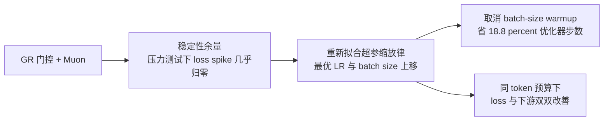

# Qwen3.8-Flash-Next 优化深挖：稳定性不是安全边际，是可以换成学习率的资源

> **来源基线**：Qwen Team《On the Design of Qwen3.8-Next Architecture: Evaluation, Efficiency, and Training Stability》，**2026-08-26**，随 [github.com/QwenLM/Qwen3.8-Flash-Next](https://github.com/QwenLM/Qwen3.8-Flash-Next/blob/main/tech_report.pdf) 发布的 28 页 PDF（**无 arXiv 编号**）。来源元数据见 `raw/01_theory/01_models/alibaba_qwen/Qwen3_8_Flash_Next_tech_report.md`。
> **维度**：Deep Dive（机制级），覆盖报告 **§3 Optimization**（p16–22）与 **§4 Evaluation**（p22–23）。
> **更新**：2026-08-27。
>
> 本页定位符格式为 `§章节, pN`（N 为 PDF 页码）与 `Tab. n` / `Fig. n`。架构部分见 [[20_qwen3_8_flash_next_architecture_deepdive]]；发布形态总览见 [[12_qwen3_8_flash_next_analysis]]。

---

## 1. 中央论点：稳定性余量被直接兑换成了更激进的超参

报告结论段把这条因果链说得最完整（§5, p23）：

> **GR 提供了一种明显改善训练稳定性的重缩放，而这份稳定性余量把最优学习率与 batch size 推高，从而同时改善吞吐与收敛。**

这不是"顺便更稳"，而是一条**被主动兑现的设计逻辑**：

本页按这条链的三段展开：Muon 的工程落地（§2）、被推高的超参（§3）、以及支撑这一切的稳定性证据（§4）。

---

## 2. Muon：谁用、怎么拆、怎么在 Megatron 里跑

### 2.1 正交化的具体设置

Newton–Schulz（NS）迭代作用于 Nesterov 加速动量（$\mu = 0.95$），正交化结果按 $\eta(A,B) = 0.2\sqrt{\max(A,B)}$ 缩放，使更新的 RMS **与矩阵形状无关**（§3.1, p16）。

| 项 | 取值 | 理由（报告原文要点） |
|---|---|---|
| 动量 | Nesterov，$\mu = 0.95$ | — |
| NS 系数调度 | **Polar Express**（Amsel et al., 2025） | 对给定步数预算是 **minimax 最优** |
| NS 迭代步数 | **8** | 比更少步数正交化更精确，且**降低压力测试中梯度范数尖峰的幅度与频率** |
| Frobenius 归一化数值稳定常数 | $10^{-14}$ | — |

注意 NS 步数的选择理由**不是收敛速度而是稳定性**——这是本报告"三轴联立"方法论的又一处体现。

### 2.2 哪些参数走 Muon，哪些不走

这是本节对工程实践最直接有用的一张表（§3.1 Which Parameters Use Muon, p16）。报告的原则是：**只对真正充当线性映射的二维权重用 Muon**。

| 优化器 | 参数 | 报告给的理由 |
|---|---|---|
| **Muon** | 注意力 q/k/v 与输出投影；GDN 输入/输出投影；routed 与 shared 专家的 fc1/fc2；**n-gram 嵌入层的 key/value 投影** | 真正的线性映射 |
| AdamW | 输入嵌入、输出头 | — |
| AdamW | **MoE 路由器** | Muon **加剧早期训练波动并使路由器失稳**；中后期用 Muon 虽不致失稳但**无显著收益**。可能的解释：**路由器的每个输出维对应一个专家的打分，各维基本独立，没有可供正交化利用的共享线性结构** |
| AdamW | **GR 的两个低秩投影** | 归因于其**极度扁长的形状** |
| AdamW | 输出门（注意力输出门、GDN 的 z 投影） | 消融显示 AdamW 与 Muon 持平或略优 |
| **Adam（关闭 weight decay）** | n-gram 嵌入表 | — |

> [!note]
> 路由器那条解释值得单独记：**"没有共享线性结构可供正交化利用"**是一个可迁移的判据——凡是输出维之间语义独立、不构成统一线性映射的矩阵（打分头、分类头的某些形态），都不适合矩阵型优化器。这比"经验上路由器用 AdamW"更有解释力。

### 2.3 拆分融合参数：一个被明确指认为"错"的常见做法

在 Megatron-LM 中，注意力 qkv 投影、SwiGLU 的 fc1、GDN 输入投影各自**存为一个融合矩阵**，但语义上它们是沿输出维**拼接的独立线性算子**。报告直接指出对融合矩阵做正交化**在两个方面是错的**（§3.1 Splitting Fused Parameters, p16）：

1. **迭代会在不相关的子块之间混合奇异方向**；
2. **缩放因子 $\eta(A,B)$ 用的是拼接后的形状，而不是真实算子的形状**。

做法是：**正交化前拆分融合梯度，对每个子矩阵独立跑 NS，再聚合回原布局施加更新**。

| 拆分对象 | 粒度 | 效果 |
|---|---|---|
| qkv 投影、GDN 输入投影 | **按头（per-head）** | **loss 与下游基准双双改善** |
| SwiGLU fc1 | 拆成 gate 与 up 两半 | loss 基本不变，**基准略有改善** |

拆分还带来一个副产品：**为"把某些子矩阵排除出 Muon"提供了天然粒度**。据此，**GDN 的 decay 与 beta 投影每头只产生一个标量、本质是向量，正交化没有意义**，被排除。

> 这一条对任何在 Megatron 上接矩阵型优化器的团队都是直接可复用的踩坑记录——**融合布局是实现细节，正交化必须按语义算子边界进行**。

### 2.4 Canzona：让 NS 迭代能在 Megatron 的切分下跑

NS 迭代要求**对每个完整参数矩阵做整体更新**（$K$ 步约 $4K\max(A,B)\min(A,B)^2$ FLOPs），这与 Megatron 的切分有两处冲突（§3.1 Implementation, p16）：

- **TP 下没有任何 rank 持有完整权重矩阵**；
- **DP 下成本对较短维是三次方的**，所以 Megatron 的等元素数切分会留下**严重的落后者（straggler）**。

解法是 **Canzona**（Wang et al., 2026a，arXiv:2602.06079），把**逻辑上的优化器归属与物理参数布局解耦**：

| 组件 | 作用 |
|---|---|
| $\alpha$-均衡静态分区器 | **以整个参数为单位重新分配**（不在张量内部切割），以**均衡各 DP rank 上估算的 NS FLOPs** |
| 异步 Micro-Group 流水线 | 通过**跨 TP rank 的融合 All-to-All** 重建每个 Muon 所属的矩阵 |

每个 owner 随后执行一个**在数学上等价于单设备 Muon** 的步骤；**ZeRO-1 的 bucket 几何被保留**，因而 Megatron 的 Reduce-Scatter / 反向重叠得以保持；该抽象可推广到其他矩阵型优化器。

第二个实现问题：**拆分之后，一层会贡献上百个子矩阵**，优化器步骤变成一长串极小的 kernel，瓶颈从算力变成 **launch 开销**。解法是**把整个 step 捕获进 CUDA graph**。

---

## 3. 超参缩放律：架构变了，旧配方就过期了

### 3.1 动机

最优学习率与 batch size **依赖于架构与优化器**，因此上一代最优的配方在两者都改变之后可能变得次优（§3.2, p16–17）。报告发现新架构与新优化器在旧 Qwen3.5 配方下**训练得明显比以前更稳**（详见 §4），这**提示存在更激进的超参空间**。

于是重新拟合缩放律。结果方向明确：**架构与优化器的改动把预测的近最优超参推向显著更大的 batch size 与学习率，且学习率随模型规模衰减得更慢**（§3.2, p17）。

### 3.2 验证策略：各自放到最敏感的区间去测

报告强调"小规模拟合的缩放律只有在能可靠外推时才有用"，因此**分别验证**，且每项都选在**其效应最被放大**的设置下（§3.2, p17）：

| 预测项 | 验证设置 | 为什么选这个设置 |
|---|---|---|
| **batch size** | 小模型 + 大量 token | 过大的 batch size 在此最容易暴露为次优 |
| **learning rate** | 大模型 + 有限 token 预算 | 训练不稳定在此是主要风险 |

### 3.3 batch size：预测值把 loss 拉低 7.2e-3，且上方是平台

20 层 10.8B-A0.89B MoE，**4T token**，各配置使用缩放律为其 batch size 规定的学习率，**token 预算相同**（等算力对比）（§3.2 Fig. 8a, p17）：

| 配置 | batch size | 最后 20B token 的平均 loss |
|---|---:|---:|
| 旧 Qwen3.5 配方 | 12.6M | 1.5774 |
| **新缩放律预测最优** | **25.2M** | **1.5702** |
| 再放大 1.5× | 37.7M | 1.5707 |

新拟合相对旧配方改善 **$7.2\times10^{-3}$**；再放大 1.5× 只带来 $4.3\times10^{-4}$ 的惩罚，**不显著**。

> **关键形状：loss 在预测值以下急剧上升，在其以上则趋于平台。** 报告据此判断预测接近最优、且"足够大到能兑现性能收益而不至于过头"。这个不对称性是下一节的直接前提。

### 3.4 batch-size warmup 不再必要

**这是模型卡上那句"eliminate traditional batch-size warmups"的完整论证。**

**惯例的理由**（§3.2, p17）：临界 batch size 在训练早期较小、随时间增长，因此大 batch 在开始时低效；且小 batch 配合缩放的学习率通常在最初几步更容易稳定。

**Qwen 的反证链**（§3.2, p18）分三步——

*第一步，三条观察构成假设：*

1. **把 batch size 降到预测最优值以下，其性能惩罚大于升到以上**（即 §3.3 的不对称性）；
2. **Muon 在更大 batch 下保持数据效率，而 AdamW 在此会退化**；
3. 对稀疏 MoE，**更大的 batch 保证每个专家每步收到足够且多样的 token 信号**，这**可能有助于专家特化**。

*第二步，实测。* 从 6.3M 起以 6.3M 为增量提升，在 **524B token** 处达到 25.2M 目标。两个变体：一个保持恒定 batch 最优的峰值学习率（**使 ramp 成为唯一差异**），另一个下调峰值学习率以适配早期较小的 batch。

| 变体 | 相对恒定 batch 基线 |
|---|---:|
| 保持峰值 LR 的 ramp | **−2.5e-4**（更差） |
| 下调峰值 LR 的 ramp | **−3.5e-4**（更差） |

两者都在 run-to-run 方差内收敛，**但都略差于恒定 batch 基线**。而且 **warmup 在相同 token 预算下需要多 18.8% 的优化器步数**，带来更多 wall-clock 开销。

稳定性也没有因此受益：本轮扫描中**没有任何一次运行出现 loss 超过其局部中位数 0.1 的步**，p99.9 的 pre-clip 梯度范数在 **0.088–0.190** 之间，**远低于 0.5 的裁剪阈值**。

*第三步，机制解释*（§3.2, p18）。报告从 loss 轨迹反推出完整过程：

> warmup 期间，较小的 batch 在**相同学习率**下引入更高的梯度噪声，导致 loss 高于恒定 batch 基线 → batch 达到目标后不久，warmup 变体可能因早期累积了**更多优化步数**而出现**短暂的 loss 优势** → 但随着学习率衰减、模型接近收敛，**这个步数优势被抵消** → 最终恒定 batch 基线反超，得到更好的最终 loss。

**结论：生产运行不使用 batch-size warmup。**

> [!note]
> 这条结论**强绑定于 Muon**（依赖观察 2）**与稀疏 MoE**（观察 3），报告没有声称它对 AdamW 稠密模型成立。迁移到别的配方前需重新验证。

### 3.5 learning rate：Tab. 10 的五次运行

48 层 MoE，**419B token**，同一 token 预算（§3.2 Fig. 9 / Tab. 10, p18–19）：

| 设置 | $B$ | $\eta$ | MMLU | MMLU-Pro | SuperGPQA | MATH | GSM8K | BBH | MMMLU | **Avg.** |
|---|---:|---:|---:|---:|---:|---:|---:|---:|---:|---:|
| **新拟合预测最优** | 8.4M | $1.76\times10^{-3}$ | 73.84 | **48.35** | **29.31** | **49.98** | **80.89** | 73.25 | 68.23 | **60.55** |
| 新拟合，$\eta \div 2$ | 8.4M | $1.24\times10^{-3}$ | 73.59 | 47.00 | 28.10 | 48.92 | 77.48 | 72.00 | 66.88 | 59.14 |
| 新拟合，$\eta \times 2$ | 8.4M | $2.49\times10^{-3}$ | **73.84** | 46.92 | 28.04 | 49.58 | 80.06 | **73.82** | **68.46** | 60.10 |
| 新拟合，$B \times 1.25$ | 10.5M | $2.01\times10^{-3}$ | 73.73 | 48.51 | 28.52 | 49.32 | 80.06 | 72.58 | 67.72 | 60.06 |
| **旧 Qwen3.5 配方** | 4.2M | $6.8\times10^{-4}$ | 71.23 | 45.35 | 25.67 | 45.54 | 74.32 | 69.54 | 63.19 | **56.41** |

新预测最优的学习率是旧配方的 **约 2.6×**、batch size 是 **2×**，平均分高 **4.14 点**。

报告自己的两条限定必须一并引用（§3.2, p19）：

- **"We treat these specific rankings as observational"** —— 每个 run 只评测一次，且前几名之间差距很窄，这些细微差异**很可能落在标准评测噪声内**。
- 超出预测最优地增大 batch size 或学习率，只带来**边际的、统计上不显著的**基准下降。报告把这解读为**优化景观高度稳定**——泛化不会因超参轻微偏离而急剧退化。

稳定性侧的数据同样值得记：**五次运行中，warmup 阶段之后梯度裁剪从未触发**。在预测最优点，pre-clip 梯度范数的最大值只到裁剪阈值的 **28%**，而旧配方是 **51%**（其 batch 更小，梯度更噪）。所有 loss 曲线**没有任何 loss spike**。

---

## 4. 稳定性压力测试：如何在中等预算下逼出生产规模才会出现的失稳

### 4.1 方法：把学习率钉在最优值的倍数上

模型扩到万亿参数、训练到数十万亿 token 时，会进入一个**小规模实验中完全不存在**的失稳区间；长训练在峰值学习率上花费的优化步数多得多，失稳的机会随之增加，表现为 loss spike 或发散、需要回滚 checkpoint（§3.3, p19–20）。

为在中等预算下**仍能逼出生产规模的失稳**，报告设计了压力测试：**把学习率恒定保持在其最优值的若干倍**。所有运行共享相同的 batch size 与 **0.5 的梯度范数裁剪阈值**，测量三个量（§3.3, p20）：

1. **loss spike**：超过 201 步滚动中位数 0.1 以上的步；
2. **pre-clip 梯度范数的 p99.9** 与**越过阈值的次数**；
3. **每 block 的最大激活值**。

### 4.2 结果：2× 已分化，4× 变成定性差异

28 层 25B-A3B MoE，三种配置对比（Fig. 10, §3.3, p20）：

| 学习率 | AdamW + Qwen3.5 结构 | Muon + Qwen3.5 结构 | **Muon + GR** |
|---|---|---|---|
| **2× 最优** | 开始出现尖峰，**4.3 次 / 万步** | 0.2 次 / 万步 | 0.2 次 / 万步 |
| **4× 最优** | **183 次 / 万步**；19,932 步中 **213 步越过裁剪阈值**，裁剪器持续介入 | **从未越过裁剪阈值** | **从未越过阈值，且 loss spike 为 0** |

**在同等压力下，新架构与优化器的组合稳定性显著更好。**

### 4.3 机制：门在做什么

一个反直觉的观察（§3.3, p21）：在 2× 最优学习率下，**Muon 运行的梯度范数中位数更高、最大激活也比 AdamW 更大，但 loss spike 却少得多**。加入 GR 后，**梯度范数尖峰的频率与幅度、以及激活离群值的幅度都下降**（Fig. 11）。

为**单独隔离门的作用**，报告做了一组单变量对照（Fig. 12）：**固定 AdamW 优化器、结构与数据顺序**，只开关 GatedNorm，在 3× 最优学习率下：

| 指标 | 关闭 GatedNorm | 开启 GatedNorm |
|---|---:|---:|
| loss spike 率 | 32.0 次 / 万步 | **3.2 次 / 万步**（**降低 10×**） |
| 越过裁剪阈值次数 | 256 | **20** |

> **注意这组对照用的是 AdamW，不是 Muon。** 这意味着**门本身**就带来稳定性，而非只有与 Muon 组合才生效——这正是把 GatedNorm 并入 GR 的核心动因（见 [[20_qwen3_8_flash_next_architecture_deepdive]] §4.6）。

### 4.4 在真实生产运行上复现：Fig. 13

最后，报告把压力测试的结论拿到**实际发布模型的早期训练**上验证（§3.3 Fig. 13, p21–22）：三次共享数据顺序、学习率调度与优化器的运行，各跑 **276B token**，**使用出厂学习率**（不再是压力倍数）：

**（a）loss**：

| 配置 | 276B token 处相对 Muon 基线的 loss 改善 |
|---|---:|
| Qwen3.5 + Muon | 基线 |
| + Gated Residual | **−0.026** |
| **完整 Flash-Next 配方** | 再 **−0.032**，合计 **−0.058** |

报告称这一 loss 改善"转化为显著的基准增益（§4），使 Qwen3.8-Flash-Next 以约九分之一的训练成本达到可与 Qwen3.7-Plus 相比的预训练结果"。

**（b）梯度范数**：Muon 单独运行的**中位数约为两个门控运行的 2 倍**，p99.9 是其 **4.2×**（0.097 / 0.298 对 0.053 / 0.071 与 0.043 / 0.066），且是**唯一越过裁剪阈值的运行**。门控运行还更平稳——1000 步滚动窗口内的**标准差低 4.3–4.7×**。

> 报告特别点明：这是**在 8 倍于压力测试的模型规模上、且在生产学习率下**复现了压力测试的发现。**这条交叉验证是这套方法论最有说服力的部分**——压力测试不是人为构造的极端场景，其结论在真实配置下同样成立。

报告还补了一条工程细节：**把残差读取与 LM head 前的最终归一化融合成一次门控读操作**，进一步降低了梯度范数，**可能是 Flash-Next 与 "Muon + GR" 配置之间差距的主要来源**。

**（c）激活**：加入 GR **在每个探测深度上都显著降低残差最大值**。其后果很实际：

> **这使得训练无需 qk-clip（Kimi Team, 2025）与 SwiGLU-clip（Agarwal et al., 2025）这类显式激活控制手段即可保持稳定。**（§3.3, p22）

> [!note]
> qk-clip 出自 Kimi K2 的训练稳定性工作（本库相关记录见 [[25_kimi_k3_stability_analysis]] 与 [[11_kimi_k2_analysis]]）。Qwen 的主张是：**门控架构从源头压住了激活离群值，因而不必再打这类补丁**。这是两条稳定性路线的直接对照——**事后钳制** vs **结构性抑制**。报告没有做两者的对比实验，因此这是设计主张而非实测比较。

---

## 5. 整体评测：Tab. 11

14 项预训练基准，三方基座模型对比（§4, p22）。评测设置：General 为 5-shot（BBH 3-shot，多数带 CoT）、Math & STEM 4–5 shot CoT、Coding 0-shot、Multilingual 5–8 shot。

| | **Flash-Next-Base** | 27B-Base | 3.7-Plus-Base |
|---|---:|---:|---:|
| 总参数 | 125B | 27B | 397B |
| **激活参数** | **6B** | 27B | 17B |
| n-gram 嵌入参数 | 51B | — | — |
| MMLU | 90.36 | 87.51 | **90.43** |
| MMLU-Redux | 90.68 | 87.26 | **91.47** |
| **MMLU-Pro** | **73.23** | 68.60 | 70.90 |
| **SuperGPQA** | **51.36** | 44.86 | 48.42 |
| **BBH** | **90.87** | 89.56 | 89.41 |
| GPQA | 51.42 | 45.01 | **51.52** |
| **GSM8K** | **93.29** | 93.18 | 92.95 |
| MATH | 72.78 | 60.54 | **74.38** |
| **EvalPlus** | **78.76** | 76.05 | 78.06 |
| MultiPL-E | 79.09 | 74.50 | **81.68** |
| **SWEBench-Pretrain** | **50.99** | 41.66 | 49.24 |
| **MGSM** | **89.33** | 86.37 | 85.42 |
| **MMMLU** | **84.86** | 79.74 | 84.53 |
| INCLUDE | 78.40 | 74.37 | **78.90** |

**读法**：

- 相对同代的 [[11_qwen3_8_27b_analysis|Qwen3.8-27B-Base]]，**14 项全胜**。
- 相对大得多的 Qwen3.7-Plus-Base（397B/17B），**8 项胜出、6 项落后**，落后幅度**最大 2.59 分**（MultiPL-E），其余五项均在 1.6 分以内（MMLU −0.07、GPQA −0.10、INCLUDE −0.50、MMLU-Redux −0.79、MATH −1.60）。
- 达成这一结果所用的是**约 1/3 的激活参数、约 1/3 的训练 token，对应约 1/9 的训练 FLOPs**（§4, p23）。

> [!contradiction]
> **这张表比较的是 base 模型，不是最终产品。** 而 [[12_qwen3_8_flash_next_analysis]] 里那张模型卡基准表比的是**后训练后的模型**，且包含 SWE-bench Pro 等经过 Qwen 修改口径的项。两张表**不可混用**：本页这张是干净的同厂预训练对照（同一评测管线、明确 shot 数），模型卡那张则带有 harness 与基准修改的折扣。
>
> 另外，Tab. 11 **没有列入任何非 Qwen 模型**——"1/9 训练 FLOPs 达到同等质量"这个结论是**相对 Qwen 自家上一代**成立的，不构成与其他厂商的效率对比。

---

## 6. 方法论的自我评价与遗留问题

报告结论段（§5, p23）对自身验证方式的总结值得完整记下：

> 每一条主张都在**评测预算仍可承受的规模上**被测试，且设置被刻意设计成**能暴露生产训练的失效模式**：压力测试把学习率钉在最优值的倍数上，使失稳在中等预算内显现；缩放律预测则在**各自最敏感的区间**上验证。**在预训练指标一致而后期评测出现分歧的地方，这套联合协议在问题进入生产前就抓住了它。**

**报告自陈的最紧瓶颈**：

> 展望未来，最紧的瓶颈是**评测吞吐**：**一个能可靠预测后训练排序的、更廉价的中等规模探针**，会让设计空间的可搜索性大幅提高。

这句话正是本报告两处"预训练指标骗人"实例（NoPE、稀疏残差读取，见 [[20_qwen3_8_flash_next_architecture_deepdive]] §1）的根源——**它们都只有在后训练之后才暴露，而后训练评测太贵，无法进入设计循环**。

**其余遗留问题**：

- Muon 各项设计（NS 步数 8、Polar Express 调度、拆分粒度）**没有逐项消融表**，只有定性表述。
- 新缩放律的**函数形式与拟合数据未给出**，只报告了它的方向（LR 与 batch size 上移、LR 随规模衰减更慢）与验证结果。
- batch-size warmup 的结论**强绑定 Muon + 稀疏 MoE**（§3.4），迁移性未验证。
- Canzona 的**加速比与落后者改善幅度未在本报告中给出**（需查 arXiv:2602.06079）。
- 与 qk-clip / SwiGLU-clip 的对照**是设计主张而非实测**（§4.4）。
- Tab. 10 的排名被报告自己标为"observational"，**样本量为 1**。

---

## 关联页面

- [[20_qwen3_8_flash_next_architecture_deepdive]] — 同一报告的 §2：GDN 混合、QSA、Gated Residual、N-gram 嵌入。
- [[12_qwen3_8_flash_next_analysis]] — 发布形态总览（模型卡 + `config.json` 对账）。
- [[25_kimi_k3_stability_analysis]] · [[11_kimi_k2_analysis]] — Kimi 的训练稳定性路线（qk-clip 等事后钳制手段），与本页 §4.4 的结构性抑制路线对照。
- [[02_engineering/02_train_frameworks/megatron-lm/index|Megatron-LM]] — 本页 §2.3/§2.4 的融合参数布局与切分冲突均发生在 Megatron 上。
- [[01_theory/02_pretraining/index|预训练/低精度]] — 优化器与训练稳定性相关主题。
- [[01_theory/01_models/index|模型架构与模型家族总索引]]
