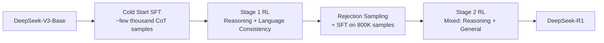

# DeepSeek-R1 Analysis

**Source:** `raw/05_model_families/deepseek/DeepSeek_R1-2501.12948.pdf`  
**Date Ingested:** 2026-04-21  
**Authors:** DeepSeek-AI  
**Published:** January 2025

---

## Overview

DeepSeek-R1 demonstrates that advanced reasoning capabilities in LLMs can emerge from **pure reinforcement learning (RL)** without human-annotated reasoning traces. Building on DeepSeek-V3-Base, the model develops self-verification, reflection, and dynamic strategy adaptation through outcome-based rewards alone. DeepSeek-R1-Zero achieves AIME 2024 pass@1 of **77.9%** (vs 15.6% base) through self-evolution, while the full DeepSeek-R1 refines these capabilities with a multi-stage pipeline and distills them into smaller open-source models.

---

## DeepSeek-R1-Zero: Pure RL Reasoning

### Core Philosophy

Bypass supervised fine-tuning (SFT) entirely. The hypothesis: human-defined reasoning patterns may limit model exploration, whereas unrestricted RL incentivizes novel reasoning capabilities.

### Algorithm: Group Relative Policy Optimization (GRPO)

GRPO eliminates the critic model (required by PPO), estimating the baseline from group scores instead:

$$
J_{GRPO}(\theta) = \mathbb{E}\left[ \frac{1}{G} \sum_{i=1}^{G} \left( \min\left( \frac{\pi_\theta(o_i|q)}{\pi_{\theta_{old}}(o_i|q)} A_i, \text{clip}\left(\frac{\pi_\theta(o_i|q)}{\pi_{\theta_{old}}(o_i|q)}, 1-\varepsilon, 1+\varepsilon\right) A_i \right) - \beta D_{KL}(\pi_\theta \| \pi_{ref}) \right) \right]
$$

Advantage from group rewards (no value model):

$$
A_i = \frac{r_i - \text{mean}(\{r_1, ..., r_G\})}{\text{std}(\{r_1, ..., r_G\})}
$$

**Key differences from PPO**:
- No value model → significant memory/compute savings
- Unbiased KL estimator in loss (vs per-token KL penalty in PPO)
- Periodic reference model updates (every 400 steps) to balance exploration and stability

### Reward Design (Rule-Based Only)

No neural reward models to avoid reward hacking:

$$
R_{total} = R_{accuracy} + R_{format}
$$

- **Accuracy reward**: Deterministic verification (math answer matching, code test cases)
- **Format reward**: Enforces `<think>...</think>` and `<answer>...</answer>` structure

### Training Configuration

| Parameter | Value |
|-----------|-------|
| Base Model | DeepSeek-V3-Base |
| Learning Rate | $3 \times 10^{-6}$ |
| KL Coefficient | 0.001 |
| Temperature | 1.0 |
| Group Size | 16 outputs per question |
| Max Length | 32,768 tokens (pre-8.2k step), 65,536 (post) |
| Batch Size | 512 (32 questions × 16 outputs) |
| Total Steps | 10,400 (~1.6 epochs) |
| Rollout Outputs | 8,192 per step |

### Emergent Behaviors

The model spontaneously develops sophisticated reasoning strategies without explicit training:

1. **Self-verification**: Checking intermediate results
2. **Reflection**: Re-evaluating previous steps
3. **Alternative exploration**: Trying different approaches when stuck
4. **Extended thinking**: Response length grows steadily throughout training (Figure 1b)

**The "Aha Moment"**: At around step 8,000, the model dramatically increases use of the word "wait" during reflection, marking a qualitative shift in reasoning patterns. Example (Table 2 in source):

> "Wait, wait. Wait. That's an aha moment I can flag here. Let's reevaluate this step-by-step..."

### Performance Trajectory

| Benchmark | DeepSeek-V3-Base | R1-Zero |
|-----------|-----------------|---------|
| AIME 2024 pass@1 | 15.6% | **77.9%** |
| AIME 2024 cons@16 | - | **86.7%** |
| MATH-500 | ~56% | **95.9%** |

---

## DeepSeek-R1: Multi-Stage Pipeline

R1-Zero suffers from poor readability and language mixing. DeepSeek-R1 addresses these through a structured pipeline:

### Stage 1: Cold Start + Reasoning RL

**Cold Start Data**:
- Thousands of long CoT samples with human-aligned conversational style
- First-person perspective ("I" instead of "we")
- Reflection and verification patterns
- Language consistency enforced

Created by:
1. Human annotators rewrite R1-Zero traces into natural conversational style
2. LLM generates additional samples in similar style
3. Human verification for quality

**Stage 1 RL**:
- Learning rate: $3 \times 10^{-6}$
- Additional **language consistency reward**: proportion of target-language words in CoT
- Clip ratio $\varepsilon = 10$ (higher than standard to prevent gradient truncation)

### Stage 2: Rejection Sampling + SFT

**800K Supervised Samples**:

| Domain | Samples | Avg Tokens |
|--------|---------|-----------|
| Math | 395K | 6,094 |
| Code | 211K | 7,436 |
| STEM | 10K | 4,929 |
| Logic | 10K | 2,739 |
| General (non-reasoning) | 178K | 1,420 |
| **Total** | **~805K** | **5,355** |

**Reasoning data** (600K): Rejection sampling from Stage 1 RL checkpoint. For each prompt, sample multiple responses, keep only correct ones. Expanded beyond rule-based evaluatable data using DeepSeek-V3 as generative judge.

**Non-reasoning data** (200K): Writing, factual QA, self-cognition, translation. Some tasks include CoT before answering; simple queries answered directly.

### Stage 3: General RL

Mixed reward signals over 1,700 steps:

$$
R_{total} = R_{reasoning} + R_{general} + R_{language}
$$

- $R_{reasoning} = R_{rule}$ (math correctness, code compilation)
- $R_{general} = R_{reward\_model} + R_{format}$ (helpfulness + harmlessness)
- $R_{language}$ = language consistency

Temperature reduced to 0.7. General preference data added only in final 400 steps to avoid reward hacking.

---

## Distillation to Smaller Models

Using the 800K reasoning dataset to fine-tune smaller open-source base models (2-3 epochs):

| Distilled Model | Base Model | LR |
|-----------------|------------|-----|
| R1-Distill-Qwen-1.5B | Qwen2.5-Math-1.5B | $1 \times 10^{-4}$ |
| R1-Distill-Qwen-7B | Qwen2.5-Math-7B | $8 \times 10^{-5}$ |
| R1-Distill-Qwen-14B | Qwen2.5-14B | $7 \times 10^{-5}$ |
| R1-Distill-Qwen-32B | Qwen2.5-32B | $6 \times 10^{-5}$ |
| R1-Distill-Llama-8B | Llama-3.1-8B | $5 \times 10^{-5}$ |
| R1-Distill-Llama-70B | Llama-3.3-70B-Instruct | $2 \times 10^{-5}$ |

**Key finding**: Distilled models outperform their instruction-tuned counterparts and even surpass some larger models on reasoning benchmarks, demonstrating that reasoning patterns transfer effectively through SFT.

---

## Training Costs

| Stage | GPU Hours | Cost |
|-------|-----------|------|
| R1-Zero RL | 101K H800 | $202K |
| SFT Data Creation | 5K H800 | $10K |
| R1 Training | 41K H800 | $82K |
| **Total** | **147K** | **$294K** |

---

## RL Infrastructure

Decoupled modular architecture with four phases:

1. **Rollout**: vLLM workers sample responses. Expert parallelism + redundant hotspot experts. MTP for self-speculative decoding.
2. **Inference**: Forward pass for reward model and reference model
3. **Rule-based Reward**: Async execution (code compiler, answer matcher, format checker) overlapped with rollout
4. **Training**: Actor (+ optional critic) update. Best-Fit data packing minimizes padding. DualPipe for pipeline parallelism.

**Memory management**: Models automatically offloaded from VRAM to CPU/disk between phases.

---

## Evaluation Highlights

### DeepSeek-R1 vs Frontier Models

| Benchmark | DeepSeek-R1 | o1-1217 | GPT-4o | Claude-3.5-Sonnet |
|-----------|------------|---------|--------|-------------------|
| AIME 2024 | **79.8%** | 79.2% | 9.3% | 16.0% |
| MATH-500 | **97.3%** | 96.4% | 74.6% | 78.3% |
| Codeforces (Rating) | **2029** | 1833 | - | - |
| GPQA-Diamond | 71.5% | **75.3%** | 49.9% | 65.0% |
| MMLU | 90.8% | **91.8%** | 87.2% | 88.3% |
| LiveCodeBench | **65.9%** | 63.4% | 33.4% | 36.3% |
| SWE-bench Verified | **49.2%** | 48.9% | 38.8% | **50.8%** |

### Key Observations

- **Few-shot prompting degrades performance** → recommend zero-shot only
- **Dynamic compute allocation**: Fewer tokens for simple tasks, more for complex ones
- **Language mixing** remains an issue for non-Chinese/English queries
- **Software engineering**: Less improvement over V3 due to long eval times limiting RL scale

---

## Limitations & Future Work

1. **Tool use**: No search engine or calculator integration
2. **Token efficiency**: Occasional overthinking on simple questions
3. **Language mixing**: Optimized for Chinese/English only
4. **Reward hacking**: Model-based rewards susceptible to exploitation; rule-based rewards limited to verifiable domains
5. **Structured output**: Suboptimal compared to specialized models
6. **Multi-turn dialogue**: SFT data mostly single-turn

---

## Related Pages

- [[12_deepseek_v3_analysis]] — Base model (DeepSeek-V3-Base) and FP8 training infrastructure
- [[11_deepseek_v2_analysis]] — GRPO algorithm origin and implementation
- [[10_deepseek_llm_analysis]] — Original DeepSeek scaling law studies
- [[18_deepseek_math_v2_analysis]] — Self-verifiable math reasoning with Generator-Verifier loops
- [[15_deepseek_coder_analysis]] — Code-specific model lineage
- [[16_deepseek_coder_v2_analysis]] — MoE code model with GRPO alignment
- [[17_deepseek_math_analysis]] — GRPO origin and math training pipeline
- [[22_deepseek_prover_analysis]] — Formal theorem proving with GRPO and RMaxTS
- [[21_deepseek_vl_analysis]] — Vision-language understanding
- [[25_mhc_analysis]] — Manifold-Constrained Hyper-Connections architecture research
- [[14_megatron_ep_analysis]] — Expert parallelism infrastructure
