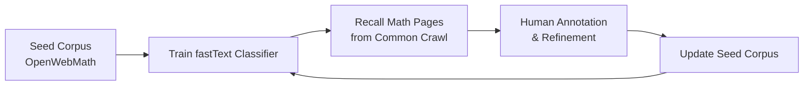

# DeepSeekMath Analysis

**Source:** `raw/01_theory/01_models/deepseek/DeepSeek_Math-2402.03300.md`  
**Date Ingested:** 2026-04-21  
**Authors:** DeepSeek-AI, Tsinghua University, Peking University  
**Published:** February 2024

---

## Overview

DeepSeekMath 7B is a domain-specific language model for mathematical reasoning that achieves **51.7% on the competition-level MATH benchmark** without external toolkits or voting techniques, approaching GPT-4 and Gemini-Ultra performance. It is initialized from DeepSeek-Coder-Base-v1.5 7B and further pre-trained on **120 billion math-related tokens** extracted from Common Crawl.

The paper makes two major contributions:
1. A scalable **iterative data selection pipeline** for mining high-quality math content from the web
2. **Group Relative Policy Optimization (GRPO)**, an efficient RL algorithm that eliminates the critic model

---

## Math Pre-Training

### Data Pipeline: Iterative fastText Classification

**Process**:
1. Start with OpenWebMath as seed corpus
2. Train fastText classifier (256-dim vectors, 3-gram, 3 epochs)
3. Recall math-related pages from 40B deduplicated Common Crawl HTML pages
4. Identify math-related domains (>10% pages collected), annotate URLs
5. Add uncollected pages to seed corpus
6. Repeat for 4 iterations

**Result**: 35.5M mathematical web pages, **120B tokens** (7x Minerva, 9x OpenWebMath).

**Key design choices**:
- Uses BPE tokenizer (not word-level) for better multilingual recall
- Multilingual: includes high-quality Chinese math content, not English-only
- arXiv papers showed **no notable improvement** on math benchmarks

### Data Quality Validation

A 1.3B model trained on different corpora for 150B tokens:

| Corpus | Size | GSM8K | MATH |
|--------|------|-------|------|
| No Math Training | — | 2.9% | 3.0% |
| MathPile | 8.9B | 2.7% | 3.3% |
| OpenWebMath | 13.6B | 11.5% | 8.9% |
| Proof-Pile-2 | 51.9B | 14.3% | 11.2% |
| **DeepSeekMath Corpus** | **120B** | **23.8%** | **13.6%** |

### Training Configuration

DeepSeekMath-Base 7B is trained for **500B tokens** with distribution:
- 56% DeepSeekMath Corpus
- 20% GitHub code
- 10% arXiv
- 4% AlgebraicStack
- 10% General natural language (English + Chinese)

| Hyperparameter | Value |
|----------------|-------|
| Initialized from | DeepSeek-Coder-Base-v1.5 7B |
| Max LR | 4.2e-4 |
| Batch Size | 10M tokens |
| LR Schedule | Multi-step decay (31.6% at 80%, 10% at 90%) |

---

## Base Model Performance

DeepSeekMath-Base 7B **outperforms Minerva 540B** (77x larger) on English math benchmarks and surpasses all open-source base models:

| Benchmark | DeepSeekMath-Base 7B | Minerva 540B | Llemma 34B |
|-----------|---------------------|--------------|------------|
| GSM8K | **64.2%** | 58.8% | 54.0% |
| MATH | **36.2%** | 33.6% | 25.3% |
| OCW | **15.4%** | 17.6% | 10.3% |
| SAT | **84.4%** | — | 71.9% |
| MMLU-STEM | **56.5%** | 63.9% | 52.9% |
| CMATH (Chinese) | **71.7%** | — | 56.1% |

**General capabilities preserved**: MMLU 54.9%, BBH 59.5%, HumanEval 40.9%.

---

## Supervised Fine-Tuning

**Training data** (776K examples):
- Chain-of-thought (CoT) reasoning
- Program-of-thought (PoT) with Python
- Tool-integrated reasoning (TIR)
- English and Chinese problems across 76 sub-topics

**Training**: 500 steps, batch size 256, LR $5 \times 10^{-5}$, max context 4K.

---

## Group Relative Policy Optimization (GRPO)

GRPO is introduced as a **memory-efficient alternative to PPO** that eliminates the critic model.

### From PPO to GRPO

PPO requires four models: policy, old policy, value model, and reference model. GRPO removes the **value model** entirely:

$$
\begin{aligned}
J_{\mathrm{GRPO}}(\theta)
&= \mathbb{E}\left[ \frac{1}{G} \sum_{i=1}^{G} \min\left( \frac{\pi_\theta(o_i\mid q)}{\pi_{\theta_{\mathrm{old}}}(o_i\mid q)} A_i, \text{clip}\left(\frac{\pi_\theta(o_i\mid q)}{\pi_{\theta_{\mathrm{old}}}(o_i\mid q)}, 1-\varepsilon, 1+\varepsilon\right) A_i \right) - \beta D_{KL}(\pi_\theta \| \pi_{\mathrm{ref}}) \right]
\end{aligned}
$$

Advantage is computed from **group rewards** (no value model):

$$
A_i = \frac{r_i - \text{mean}(\{r_1, ..., r_G\})}{\text{std}(\{r_1, ..., r_G\})}
$$

**Key differences from PPO**:
- No critic model → significant memory savings
- Group-relative baseline (unbiased, no GAE)
- Per-output advantage instead of per-token advantage

### Performance Gains

| Model | GSM8K | MATH | CMATH |
|-------|-------|------|-------|
| DeepSeekMath-Instruct | 82.9% | 46.8% | 84.6% |
| DeepSeekMath-RL (GRPO) | **88.2%** | **51.7%** | **88.8%** |

GRPO improves both in-domain and out-of-domain math performance using only English instruction-tuning data.

### Unified RL Paradigm

The paper provides a unified framework showing that:
- **RFT** (Rejection Sampling Fine-Tuning) = offline RL with outcome reward
- **DPO** = offline RL with preference reward
- **PPO** = online actor-critic RL
- **GRPO** = online actor-only RL with group baseline

**Key findings from ablations**:
- Online training outperforms offline training
- Outcome supervision is competitive with process supervision for math
- Iterative RL (re-training on model-generated data) provides diminishing returns

---

## Related Pages

- [[14_deepseek_r1_analysis]] — GRPO used extensively in DeepSeek-R1's multi-stage RL pipeline
- [[11_deepseek_v2_analysis]] — GRPO adopted for general RL alignment in DeepSeek-V2
- [[15_deepseek_coder_analysis]] — DeepSeek-Coder-Base-v1.5 is the initialization checkpoint for DeepSeekMath
- [[16_deepseek_coder_v2_analysis]] — Expanded math corpus (221B tokens) building on DeepSeekMath pipeline
- [[22_deepseek_prover_analysis]] — Formal theorem proving with GRPO and proof assistant feedback
- [[18_deepseek_math_v2_analysis]] — Self-verifiable math reasoning with Generator-Verifier loops

