# DeepSeek-V4.1-Flash：模型骨架、训推协同与能力评估

> **源码基线**：`deepseek-ai/DeepSeek-V4.1-Flash@fb2764a5cf321eaa5070ca8f9e892818f477c16d`（Hugging Face 发布仓快照，2026-09-10）
> **源码基线**：`deepseek-ai/DeepGEMM@39d8c4cacc2c07c1fa9921c6c29c6a8a2da75359`（Public Release 26/09，2026-09-10）；仅用于 §2.5 的 Mega-mHC 实现与测试补证，HF 模型基线不变。
> **文献基线**：上述 HF 模型提交中的《DeepSeek-V4.1-Flash: Pushing the Limits of KV Cache Compression》，51 页；下文以 PDF 印刷页码、章节和表号定位。官方 API 文档读取于 2026-09-10，北京时间。
> **主题**：从长任务的上下文成本引出完整模型骨架与代际变化，逐项分析实现、选型和实验证据，再讨论预训练、后训练、推理工程及主流模型对比。
> **适用范围**：V4.1 Flash 首发版本；生产系统优化依技术报告归因，参考代码只能证明其实际包含的路径。本次未运行权重推理或付费 API 评测。
> **最近更新**：2026-09-11。补全 mHC 的 20d/14d/10d 逐项读写推导、同精度容量示例与实际工作区边界；保留融合证据、KV 实例和并行分析。

## 1. 背景问题与完整模型骨架

**V4.1 Flash 的主要设计目标，是让模型在长时间运行的 Agent 任务里少重复计算、少保存和搬运上下文。** 例如，一个编码 Agent 已读完仓库，执行测试后又收到几千 token 的日志：新一轮不仅需要生成答案，还要处理新增输入、复用旧前缀，并恢复继续计算所需的状态。报告指出，稀疏注意力降低了长序列计算量以后，prefill、HBM 容量和持久 KV 缓存的存储与传输成为新的成本瓶颈。[技术报告 §1、§2.2][report]

这次不是沿用 V4 Flash 骨架的又一次后训练。对照 [[31_deepseek_v4_released_checkpoints_analysis|V4 的 0731/0813 权重基线]]，V4.1 采用新的 **20 层因果编码器 + 20 层解码器**，用 CSA2 替代 CSA/HCA 交错的全局分支，从语言模型预训练起混入视觉信息。输入支持图像与文本，输出为自回归文本；不能据“原生多模态”推出音频输入或图像生成。[报告 §2.1、§4.2][report]

### 1.1 先沿一条输入看完整网络

一条包含代码、测试日志和截图的请求，先由文本 embedding 与视觉编码器分别变成同维度表示，再按原位置拼回联合序列。它进入 **20 层因果 encoder → 20 层 decoder → 输出头**；每一层仍是注意力子块与 MoE 子块，外面包着 4 路 Single-Pass mHC 残差流。Engram 在 L1/L14 向残差注入文本条件记忆，DSpark 则是辅助草稿分支。**CED 的 encoder 是语言主干下半部，不能与前面的视觉 encoder 混为一谈。**[报告 §2.1、Figure 3][report]；[发布配置][config]

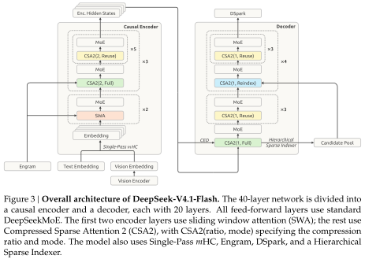

**原图 Figure 3（报告 p7）**：保留原有布局、英文标注、配色及图注，仅裁去外围正文与页边距。[原始技术报告][report] 下方另附中文补充图，方便对照层号与前代差异。

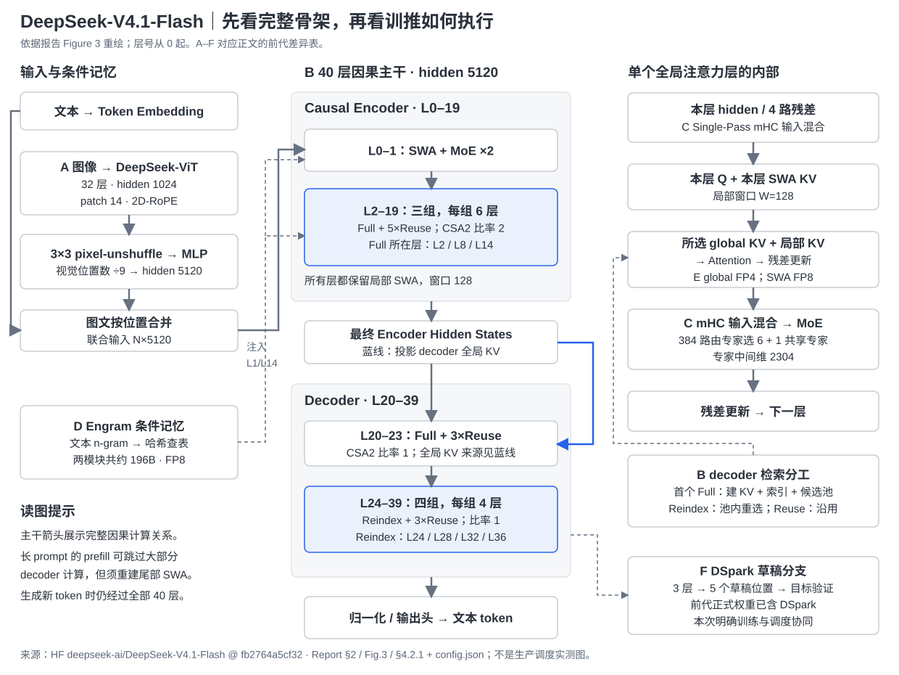

补充图 1 依据[技术报告 Figure 3（p7）][report]重绘，并补上发布配置的层号、单层放大图和 A–F 改动位置。实线串起完整主干，蓝线表示 decoder 全局 KV 的来源，虚线表示条件记忆、检索或草稿分支。图中展示的是模型连接；长 prompt 的执行裁剪见 §2.1。所有主干层都含 MoE，前两层只有 SWA，其余层有全局与局部两类注意力。

### 1.2 相对前代，改了哪里、为什么改

比较对象是 **V4 Flash 正式 checkpoint（0731）及 V4 报告**，不是只与更早的 V3 比。旧版规格与已发布 DSpark 由 [[31_deepseek_v4_released_checkpoints_analysis|V4 正式权重对账]]负责；本次增量依据 V4.1 报告 §2–§3。

| 图中位置 | 前代 → V4.1 Flash | 解决的问题与实现方向 |
|---|---|---|
| A 图文入口 | 文本主干 → 从主干预训练开始联合图文；ViT + 3×3 降采样 + MLP | Agent 要读截图和图表；减少视觉 token，同时按模态分别平衡专家负载（§2.7） |
| B 主干与注意力 | 43 层、hidden 4096 → 40 层、hidden 5120；CSA/HCA 交错 → CED + CSA2 | 把容量、prefill 计算和缓存成本拆开优化：encoder 生成共享 KV，decoder 分组重检索（§2.1–§2.3） |
| C 残差连接 | mHC → Single-Pass mHC | 用前一子块的混合系数解除等待全维归约的依赖，允许推理 kernel 一次读写残差（§2.5） |
| D 条件记忆 | 本次主干加入约 196B Engram | 用稀疏查表增加记忆容量；位置与精度配合流水线均衡和预取；相对原 Engram 论文删掉短卷积（§2.6） |
| E 缓存精度 | main KV FP8 → FP4；SWA 仍为 FP8 | main KV 减少 HBM/SSD 占用，用后训练 QAT 适配；不盲目压低敏感的局部状态精度（§2.4） |
| F 草稿分支 | 正式 V4 已有 DSpark → 本报告明确分阶段训练与置信度调度 | 同时加速线上生成和 RL/OPD rollout；不能算作 V4.1 首次发明（§2.8） |
| 推理缓存策略 | 长期保存 SWA 或昂贵精确重算 → 短 TTL + bounded replay | 以近似状态恢复换取更小持久缓存，也是 CED 降低 prefill 成本的配套条件（§3.4） |

主干变宽、专家数从旧 Flash 的 256 增到 384，是容量配置的改变；**报告没有逐项证明 40 层、5120 hidden 或当前共享间隔分别为全局最优**。能确认的是：它不靠单纯缩小参数降成本，而是让长输入少过层、缓存少复制、生成少串行；能力收益还叠加数据与后训练，不能由结构表单独归因。

### 1.3 发布规格与参数口径

[官方更新日志][release]确认 **2026-09-10 正式发布**。冻结的 [官方发布仓][repo]同时提供权重、MIT 许可说明、技术报告、推理参考代码和 DeepSWE 复现说明，已经超出此前临时内测的材料范围。

| 项目 | V4.1 Flash 发布值 | 证据 |
|---|---|---|
| 主干参数量 | 552B backbone | 报告 §2.1、§4.2.1 |
| Engram 参数 | 另列约 196B | 报告 §2.1、§2.4.2 |
| 每 token 激活参数 | prefill 8B / decode 16B，报告口径 | 报告 §2.2、§4.2.1 |
| 语言主干 | 40 层，hidden 5120；20 encoder + 20 decoder | `config.json::text_config`；报告 §4.2.1 |
| MoE | 每层 384 个路由专家，选 6 个；另有 1 个共享专家，专家中间维 2304 | `n_routed_experts`、`num_experts_per_tok`、`n_shared_experts`、`moe_intermediate_size` |
| 注意力 | 64 个 query 头，头维 512，RoPE 64 维；Q 低秩维 1280 | `num_attention_heads`、`head_dim`、`qk_rope_head_dim`、`q_lora_rank` |
| 索引器 | 32 头、头维 128、Top-512；decoder 候选上限 2048 块 × 8 位置 | `index_*`、`candidate_*` |
| SWA / mHC | 窗口 128；4 路残差、20 次 Sinkhorn 迭代 | `sliding_window`、`hc_mult`、`hc_sinkhorn_iters` |
| 图像编码器 | 32 层 ViT，hidden 1024，16 头，patch 14；3×3 降采样 | `config.json::vision_config` |
| 长度 | 权重配置 1,048,576；API 标称上下文 1M、最大输出 384K | `max_position_embeddings`；[模型与价格][pricing] |

**552B 不应解释为已经包含 196B Engram 的总量。** 报告将两者分别列出。还可作配置交叉检查：全部 MoE 的三张专家矩阵共计 `40 × 385 × 3 × 5120 × 2304 = 544,997,376,000` 个参数，仅这一部分就约 545B；若从 552B 扣掉 196B，只剩 356B，连这些矩阵都装不下。两张 Engram 表由 `engram_num_embeddings` 与 `engram_head_dim` 算得 `196,613,849,600` 个 embedding 参数。这里是**按配置推算的矩阵元素数**，不是下载全部权重后的逐 tensor 审计，亦不是量化文件字节数。[配置][config]；`inference/model.py::Expert`、`ParallelEngramEmbedding`

因此，“Flash”表示系列定位，不能等同于总权重很小或单卡可部署；8B/16B 是激活计算口径，也不能拿来直接估算全部权重显存。

## 2. 结构改动：实现、选型与实验证据

### 2.1 CED：改变 decoder KV 来源，减少长输入的完整前向

普通逐层结构要先算出每层 hidden state，才能得到那一层的 KV。CED 改变了 **decoder 全局 KV 的来源**：它由最后一个 encoder 层的 hidden state 投影得到，而非依赖各 decoder 层自己的 hidden state。于是 prompt 全序列先走 encoder，再一次形成 decoder 所需的全局上下文；这部分无需让全部 prompt token 跑完整个 decoder。[报告 §2.2，Eq.1][report]

但 CED 保留了每层自己的 SWA，以保有较深的局部计算。decoder 仍需为 prompt 尾部生成 SWA 状态，这正是 bounded replay 必须介入的原因。两半网络都保持语言序列的因果约束，不能将“encoder”理解成允许读未来文本的双向编码器。

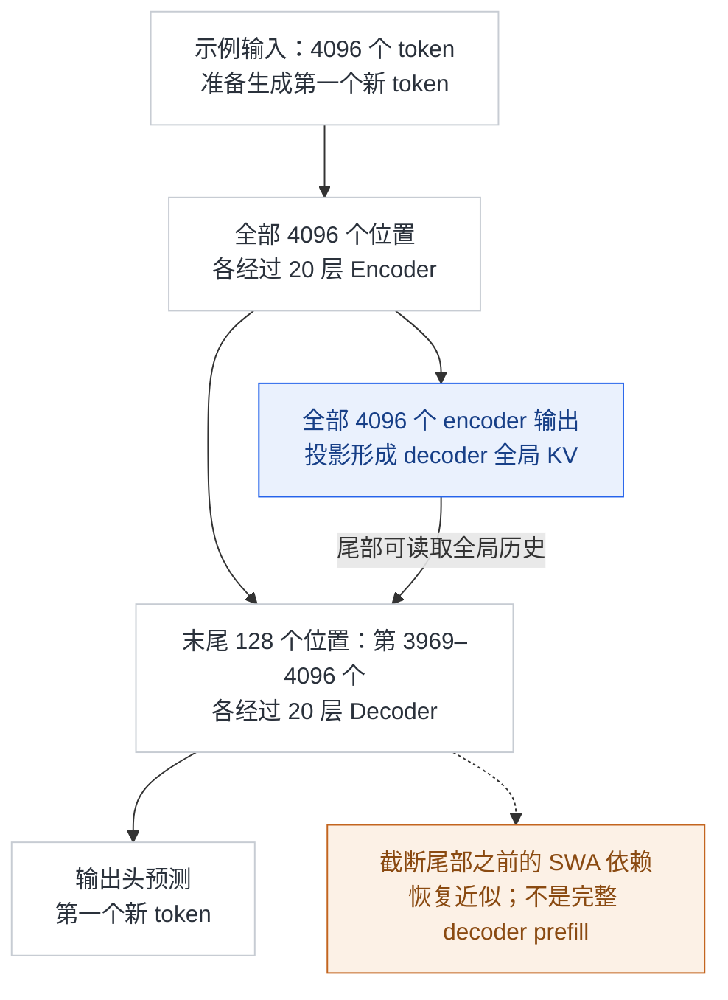

补充图 2 展开补充图 1 的 **prefill 计算去向**：先读入一段已有文本，再准备生成第一个新 token。图中的 **4096 是本例假设的输入长度**；**20+20 是模型的 encoder/decoder 层数**；**128 是 decoder 尾部 replay 使用的窗口长度**。输入位置从 1 编号，因此末尾 128 个是第 3969–4096 个。前面的 3968 个位置仍通过 encoder 并参与全局 KV，只省去它们在 decoder 中的完整层计算，没有把这段历史丢掉。生产路径的公开实现边界见 §3.5。

**怎样读原图中的 81920、2560 等数字？** 本文把“一个 token 位置经过一个主干层”记作 **1 个 token-layer（位置×层计数）**。例如 3 个位置各过 2 层，就记 6；这只是粗略工作量计数，位置可以批量并行计算，不能当成 6 次串行 GPU 调用，也不是 6 个输出 token。一个主干层包含 Attention、MoE 等操作，不是一个算子。

| 要数的工作 | 多少个位置 × 每个经过几层 | 位置×层计数 |
|---|---|---:|
| 本例 encoder 前向 | 全部 4096 个 × 20 层 | 81,920 |
| 本例 decoder 尾部前向 | 最后 128 个 × 20 层 | 2,560 |
| CED 合计 | 上述两部分相加 | 84,480 |
| 对照：同一个 40 层主干全部完整前向 | 全部 4096 个 × 40 层 | 163,840 |

所以 `84,480 ÷ 163,840 ≈ 51.6%`，表示本例粗略计数剩下约一半。对照采用**同一个 40 层主干**，不是直接拿旧 V4 的 43 层做计数。global KV 的投影仍需执行，但未单列进这个简化账本；不同层和位置的实际计算成本也不相等，因此这不是精确 FLOPs 或延迟测量。

令 prompt 长度为 $N$、层数为 $L$、窗口为 $W$。报告给出的主干层计算量近似为：

$$
O(NL)\quad\longrightarrow\quad O(NL/2+WL/2).
$$

例如 $N=4096$、$L=40$、$W=128$，按这个简化模型，完整前向是 163,840 个 token-layer，CED 是 84,480，约为 51.6%。**这是层计算量示例，忽略轻量 KV 投影、视觉编码和系统调度，不能解释成端到端延迟保证降低 48.4%。** 当新增输入很短时，replay 等固定开销相对更明显；“近乎减半”的适用条件是长输入主导。[报告 §2.2、§3.2.2][report]

**训推取舍**：相比直接让上半部完全共用下半部状态，CED 保留每层 SWA 来增加局部 KV 的计算深度；代价是必须恢复 decoder 局部状态。训练并非自动省掉上半部反向计算，报告的“近乎减半”针对推理 prefill。报告 §2.2 称能力与基线相当，§3.2.2 称 replay 影响很小，但没有提供对应 checkpoint、分任务误差及完整开关表；这是作者结论加复杂度分析，不是本页复现的定量消融。

#### 因果 encoder 与 causal decoder layer 到底差在哪里

**从单层的因果性看，没有“encoder 能读未来、decoder 不能”的区别。** L0–19 同样逐位置执行因果注意力、MoE 和残差更新；称它为 encoder，是因为它负责先形成供上半部读取的全局上下文。真正改变的是整网的数据依赖：L20–39 的 global KV 统一来自 encoder 末端，而其 SWA、query 和后续 hidden 仍由各自层计算。它也不是传统翻译模型中独立读完源句的双向 encoder。[报告 §2.2–§2.3][report]

最后一个 encoder 层的输出有**两条用途**：作为普通主干激活进入 decoder，以及经投影形成 decoder 共享的 global KV。不能将后者说成“投影 KV 就是 decoder 的全部输入”，也不能说 encoder 是靠投影前面各层缓存的 hidden 直接算出的。参考实现沿 `Transformer.forward → Block.forward → Attention.forward` 逐层前向，到 L20 的 Full 分支再生成共享 KV；mHC 的残差混合与归一化仍保留（§2.5）。

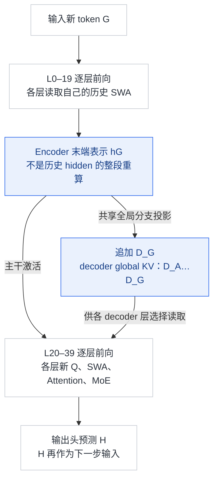

补充图 2a 只跟踪 G 这一个新位置。**正常 decode 时，G 仍要经过全部 40 层**；缓存省下的是 A…F 这些旧位置的重复计算。encoder 的压缩比 2 只缩短 global KV 序列，不会把主干 token/hidden 序列减半。图中 hG 是对末端表示的逻辑简称，详细残差混合见补充图 1；这张图不代表另设一套 decoder 输入 embedding。

### 2.2 CSA2：共享缓存，保留不同深度重新选择的自由

只复用 Top-K 索引，仍要保存每层自己的 KV，省不到主要存储；让所有层固定同一套检索结果，又会限制不同深度的选择能力。CSA2 把“共享什么内容”和“是否重新选择内容”分离，三种模式在建模时按层静态安排，并非按单个请求动态切换。[报告 §2.3–§2.3.1][report]

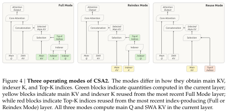

**原图 Figure 4（报告 p10）**：绿色表示当前层计算，黄色表示从最近 Full 层复用的 KV，红色表示复用的 Top-K；三个模式均保留本层 Q 与 SWA。原图及英文图注保持不变。[原始技术报告][report]

| 模式 | main KV 与 indexer K | Top-K 选择 | 当前层仍做什么 |
|---|---|---|---|
| Full | 生成并提供给后续层 | 新计算 | 自己的主 query、SWA KV 与注意力 |
| Reindex | 复用最近 Full 的缓存 | 用本层 indexer query 重新打分 | 自己的主 query、SWA KV 与注意力 |
| Reuse | 复用最近 Full 的缓存 | 复用最近 Full/Reindex 的选择 | 自己的主 query、SWA KV 与注意力 |

**Reuse 复用的是缓存与选择，不是上一层的注意力输出。** 本层 query、局部信息与 residual 不同，仍会生成新的表示。配置中 `kv_source_layer_ids=[2,8,14,20]` 对应四个 Full 层；`index_source_layer_ids` 另加 `[24,28,32,36]`，对应四个 Reindex 层，其余有全局分支的层都是 Reuse。[配置][config]；参考实现 `Attention.__init__`、`_compress_kv`、`_compress_topk_idxs`

相对 V4 的 CSA，CSA2 还移除了压缩块的重叠及压缩器绝对位置 embedding；indexer K 改由 main KV latent 投影，不再单独从 hidden state 走另一条压缩路径。decoder 压缩比为 1，说明 **稀疏选择、跨层共享和序列压缩是独立维度**，不能把所有 CSA2 entry 都称为多 token 合并块。[报告 §2.3][report]

**训推取舍**：推理减少存储与重复索引，训练则新增跨流水线 stage 的共享参数和中间状态协调。报告的 shadow indexer、P2P payload 与 micro-batch 生命周期正是这种结构的配套成本（§3.2），并非把同一个 Python 模块引用多次就能完成分布式训练。报告没有单独给出共享间隔、压缩比 2/1 与效果的系统消融。[报告 §3.1.2][report]

#### 完整例子：读入 A…F，生成 G，再将 G、H 依次送入模型

为便于追踪，以下把 SWA 窗口缩为 2、Top-K 缩为 2；正式配置是 128/512。保留实际层号与 encoder/decoder 压缩比 2/1，所有检索排名都是教学设定。`AB@2` 表示 L2 的压缩器将 A、B 两个位置合成的 entry，`D_A` 表示由 A 的 encoder 末端表示生成的 decoder entry；它们都是上下文化表示，不是字面字符串。

**第 0 步：prefill A…F，得到下一个 token G。** encoder 的三个 Full 源分别保存 `AB@2, CD@2, EF@2`、`AB@8, CD@8, EF@8`、`AB@14, CD@14, EF@14`。分组位置相同，但三个源层的表示与投影不同，数值不共享。decoder 的 Full 源 L20 保存 `D_A…D_F`，供 L20–39 共享。生产 CED 路径让全部输入走 encoder，再以尾部 E/F 重建 decoder SWA 并预测 G；这是假设窗口为 2 的示意，恢复仍是 §3.4 的近似 replay。HF 可读实现则对全部位置跑完整主干。两条路径此时各层的逻辑 SWA 尾部位置都是 E/F，不能据此断言缓存数值相等。

**第 1 步：将 G 送回模型，预测 H。** G 先顺序通过 L0–19。到 L2 时，本层算 G 的新 Q 和局部 KV，SWA 变为 F/G；压缩器暂存 G，但没有第二个位置，已完成的 global KV 仍是 AB/CD/EF。假设本步选中 `AB@2, EF@2`，L3–7 复用这些 entry 和这次选择，却各算各的 Q、SWA、attention 输出及 MoE。L8、L14 对自己的缓存和消费组重复上述过程；不是让 L8 去读取 `AB@2`。

G 走完 encoder 后，L20 的共享全局分支立即追加 `D_G`，因为这里压缩比是 1。假设 L20 对 G 选择 `D_B,D_E`，L21–23 沿用；L24 可用新的 indexer query 改选 `D_F,D_G`，L25–27 再沿用，L28/32/36 同理。这一示例要求 L20 给后续层的候选池包含 B/E/F/G；正式小序列可全部入池，长序列则受 §2.3 的候选限制。各 decoder 层仍计算 G 的本层状态，最后输出头预测 H。

**第 2 步：将 H 送回模型。** H 到 L2/L8/L14 时，分别与各自暂存的 G 凑成一组，新增 `GH@2`、`GH@8`、`GH@14`；旧 AB/CD/EF 不重算。各层 SWA 尾部变为 G/H，decoder 全局分支新增 `D_H`。本步重新计算 H 的 Q 和源层 Top-K，再产生下一 token；不会因为 GH 刚发布，就回头修改已经算完的 G 的输出。

| 对象 | 跨生成时间步是否复用 | 同一步跨层是否共享 / 重算 |
|---|---|---|
| 已完成的 main KV 与 indexer K | 旧 entry 保留，新位置按压缩规则追加 | 同一 Full 消费组共享；L2/L8/L14/L20 四个源之间独立 |
| 每层 SWA KV | 保留窗口内旧位置，写入新位置，覆盖过期槽 | 每层独立；即使都表示 F/G，值也不相同 |
| 未完成压缩组 | G 的投影及 gate 分数保留到 H 到来 | L2/L8/L14 各维护自己的暂存；Reuse 不再压缩 |
| 主 Q、attention 输出、MoE 与当前 hidden | 新 token 重新计算；正常 decode 不重算旧 token 输出 | 每层重新计算，不共享前层输出作为本层计算结果 |
| Top-K 与 decoder 候选池 | 为当前 token 的选择，下一 token 要重新选择 | Full/Reindex 算本层选择；Reuse 沿用本步最近一次选择 |

表中“跨时间复用”指一次连续 decode；前缀缓存命中与丢失后的恢复另见 §3.4。尤其不能将 Reuse 理解成“G 沿用 F 的 Top-K”：它沿用的是**其他层已经为 G 算好的 Top-K**。[配置][config]；`SharedAttentionRuntime`、`Attention._compress_topk_idxs`

#### G 还不够形成一个 entry，为什么仍能继续生成

`Compressor.forward` 为压缩比 2 的源层保留 `kv_state` 与 `score_state`：G 到来先分别计算 `wkv(G)` 与 `wgate(G)`，写入槽 0；没有凑齐时返回 `None`，只表示“本步没有新 global entry”。与此同时，`Attention._window_kv` 已把 G 的局部 KV 写入本层环形窗口，G 可以立刻参与 SWA；全局分支仍能读之前完成的 AB/CD/EF。因此模型继续往后算，并不等待未来的 H。[同提交参考实现][inference]

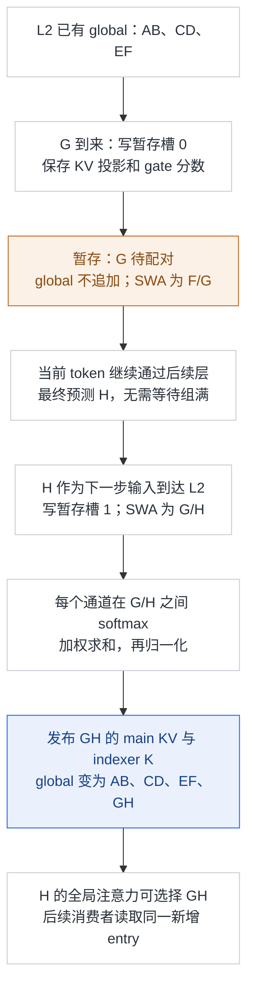

补充图 3a 展开同一 L2 源层的状态变化；L8/L14 各有独立的一套。池化是**逐通道的学习加权**，不是两个 token 简单求平均，也不是只保存 G、丢掉 H。G 的零基位置为 6，`(6+1)%2 != 0`，不发布；H 的位置为 7，`(7+1)%2 == 0`，发布第四个 entry。`Attention._compress_kv` 以完整组数限定可见长度：G 后为 3，H 后为 4；indexer 从新 latent 派生 K，main KV 再做 RoPE 与量化。

prefill 长度若为奇数，末尾同样存入暂存区，留给后续 decode 补齐；若总共还不足两个 token，全局分支为空，SWA 仍能执行。decoder 的压缩比为 1，直接做投影与归一化，不需要这套二位置等待。暂存是运行时状态；代码的 `persistent=False` 仅表示不写进 PyTorch `state_dict`，不表示不能跨 decode 步保存。公开实现展示的是初始 prefill 加逐 token decode，不能据此声称任意 chunked-prefill 或跨请求迁移的半组恢复协议已实现。

### 2.3 分层索引：只缩小后续层的搜索范围

decoder 首个 Full 层仍扫描全部因果可见位置，同时选出自身的 Top-512，以及供后续 Reindex 使用的候选池。池的构造是以每块最高分作为块分数，保留至多 2048 块、每块 8 位置，即至多 16,384 个候选。后续 Reindex 只在这个池中重新选择 Top-512；Reuse 不再打分。[报告 §2.3.2，Figure 5][report]

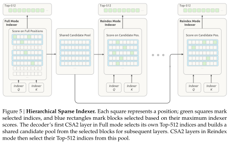

**原图 Figure 5（报告 p11）**：第一层从完整范围构造共享候选池，后续层只在池内重选；原图及英文图注保持不变。[原始技术报告][report]

下面使用缩小的教学例子：6 个可见位置，块大小 2，保留 2 块，最终 Top-2。设首层 `a…f` 分数为 `4,9,1,2,8,3`，块最高分为 `9,2,8`，因此 `ab`、`ef` 入选，自身注意力选择 `b,e`。后续层将池内 `a,b,e,f` 打分为 `9,2,3,8`，便改选 `a,f`。

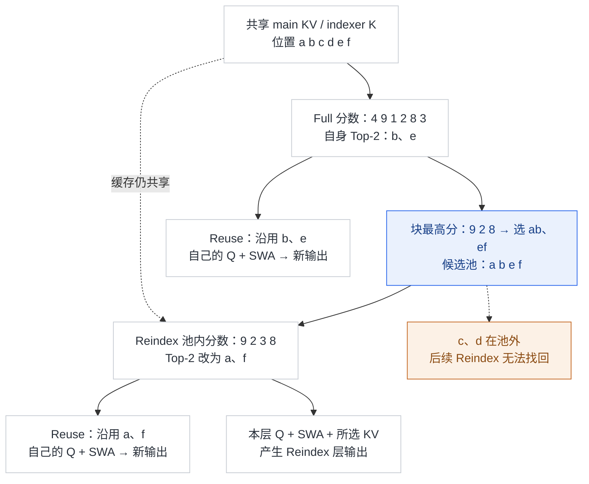

补充图 3 的位置身份从共享缓存一直跟到各层选择；排名是为说明规则设定的例子，不是模型实测。Full 层同样用自己的 Q、SWA 与 `b,e` 产生输出。**候选池可以让后续索引的搜索量不随上下文增长，但不能消除首层全扫描；一旦某信息被候选筛选漏掉，后续 Reindex 也无法恢复。** 该限制在后训练中同步施加；报告 §6 将极端长上下文检索列为仍需压力测试的边界。

**训推取舍**：相对另建一层独立粗粒度索引，复用浅层已有分数不增加新的候选状态来源；更深层则失去候选池外的纠错机会。因此该约束在后训练引入，并与推理使用相同候选域。报告给出算法和成本边界，没有候选池大小扫描表；参考实现先全域评分再 mask，也未兑现“只算池内”的生产计算节省（§3.5）。[报告 §2.3.2][report]

### 2.4 FP4 main KV：格式选择服务于存储与硬件兼容

报告给出的全局 KV 是 **main KV + indexer K**，不是全部运行内存。main KV 使用 E2M1，每 16 通道配一个 E4M3 scale；indexer 使用 MXFP4，32 通道一个 E8M0 scale。主 latent 为 512 通道、索引 latent 为 128 通道。[报告 §2.4.4、§4.2.1][report]；`kernel.py::fp4_act_quant`

据此可复算稳定长序列的有效载荷：

$$
\begin{aligned}
B_{\mathrm{main}} &= 512\times 4/8+512/16=288\ \mathrm{bytes}, \\
B_{\mathrm{index}} &= 128\times 4/8+128/32=68\ \mathrm{bytes}, \\
B_{\mathrm{global}} &= (3/2+1)\times(288+68)=890\ \mathrm{bytes/token}.
\end{aligned}
$$

其中三个 encoder Full 层各保存半长序列，一个 decoder Full 层保存全长序列，故等效缓存份数是 `3/2+1`，无需为全部 38 个全局注意力层分别保存缓存。这是**本文根据配置与量化格式的推导**，与报告给出的 890 bytes/token 相符；忽略尾块、分配器、对齐、额外工作区和分布式复制。

100 万 token 的这部分数据约 890 MB（十进制），不能据此得出“整个百万上下文模型只要 890 MB 显存”。权重、SWA、激活、临时候选及服务框架仍占内存。main KV 在 RoPE 之后量化，attention 前反量化，因此其 scale 格式不依赖硬件原生 FP4 矩阵乘支持，可以选择精度更好的 E4M3/16 通道方案；SWA 因精度敏感保留 FP8。**FP4 main KV 首先是存储优化，不等于注意力矩阵乘法全部使用 FP4。**[报告 §2.4.4][report]

**为什么不是所有分支统一一种 FP4？** indexer 要加速矩阵乘，沿用硬件兼容面更广的 OCP MXFP4；main KV 在 attention 前反量化，选型可以优先精度。作者比较约 4-bit 格式后采用 E2M1 + E4M3/16，去掉 NVFP4 的第二级 global scale：其可表范围达到 2688，而报告给出的归一化后 512 维 latent 范数界约 22.6，训练观测幅度约 10，额外全局 scale 收益不足。这里的范数界依赖报告中已训练 RMSNorm 权重约为 1 的条件，不能无条件外推到其他模型。[报告 §2.4.4][report]

**训推取舍与消融**：main KV QAT 在后训练加入；选择 RoPE 后量化，是因为 RoPE 前量化仅有边际精度收益，却增加 decode 开销。作者还报告去掉 global scale 无可测精度下降、SWA 对量化敏感，但没有公开逐项任务分数和误差条。不能把这些定性比较改写成全模型“无损 FP4”。

### 2.5 Single-Pass mHC：改系数依赖，让推理融合成为可能

**应用范围是语言主干的每一层、每个 Attention/MoE 残差子块。** 40 层（20 encoder + 20 decoder）每层两处，共 80 个这样的子块；不因注意力处于 Full/Reindex/Reuse 或只有 SWA 而跳过。这里不是说 ViT、Engram 注入和所有辅助模块的每一条残差都采用同一种连接。前文只解释了访存收益，下面补全一层到底算了什么。[发布配置][config]；`inference/model.py::Block.__init__` / `Block.forward`

#### 四路残差不是让 Attention 和 MoE 各跑四遍

普通残差可写成“保留输入，加上子块输出”。mHC 则让每个 token 在子块间保留 **4 路、每路 5120 维**的残差表示；进入 Attention 或 MoE 前，将四路混合成一个 5120 维输入，子块只计算一次，再把输出按不同权重注入四路，同时混合原来的四路残差。四路最初是 embedding 的复制，此后因混合与注入而分化；它们不是四个 token，也不是四份 KV cache。

用 $s$ 编号 Attention/MoE **子块**，而不是整层或 token 时间步。对一个 token，令 $X_s\in\mathbb{R}^{4\times5120}$ 为四路残差，$F_s$ 包括本子块的 pre-norm 与 Attention/MoE 计算。三套系数分别负责：

| 系数 | 每个 token 的形状 | 用途 | 参考代码名 |
|---|---|---|---|
| $A_s$ | $1\times4$ | 将四路压成一路，**交给下一子块使用** | `attn_pre` / `ffn_pre` |
| $B_s$ | $4\times4$ | 本子块更新时，混合保留的四路残差 | `attn_comb` / `ffn_comb` 按输入路、输出路存储；公式中的左乘矩阵 $B_s$ 对应其转置 |
| $C_s$ | $4\times1$ | 本子块更新时，将一个输出分别注入四路 | `attn_post` / `ffn_post` |

报告 Eq.6 的完整规则是：

$$
\begin{aligned}
(A_s,B_s,C_s)&=\mathcal{H}_s(X_s), \\
u_s&=A_{s-1}X_s, \\
Y_s&=F_s(u_s), \\
X_{s+1}&=B_sX_s+C_sY_s.
\end{aligned}
$$

**只有 $A$ 的消费错后一个子块；$B_s,C_s$ 仍用于当前子块的残差更新。** 旧 mHC 的输入是 $A_sX_s$，新版变为 $A_{s-1}X_s$，其余职责不变。“上一子块”仍属于同一个 token 的本次前向；生成下一 token 时重新计算各处动态系数，不复用上一 token 的 $A$。不同子块的预测器参数也各自独立，这和 CSA2 的 KV 共享是两种机制。[报告 §2.4.1，Eq.2/6][report]

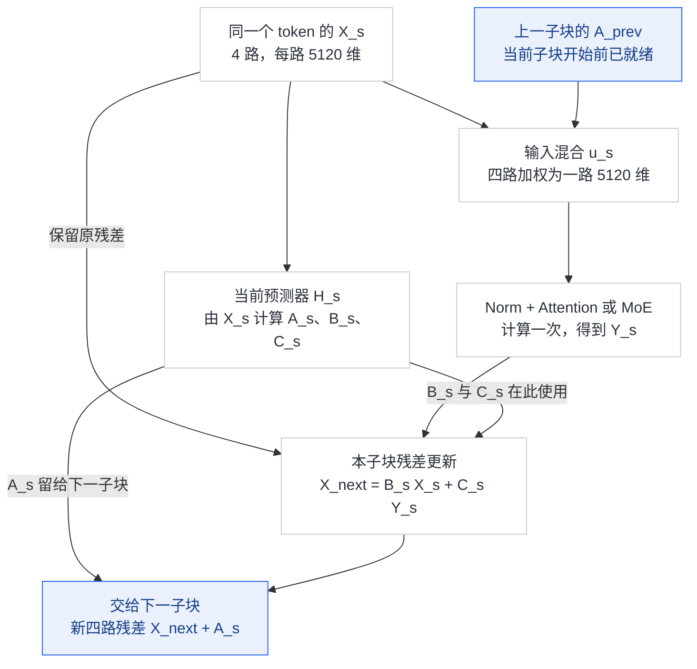

补充图 4a 同时跟踪残差数据与系数的去向：下一子块的输入，是“当前新残差”乘“已经生成的 $A_s$”。预测器可以与输入混合共用对残差的遍历；图中分支表示依赖，不代表 HF 代码已并行执行或已经融合成一个 kernel。

#### 顺着 L7 的 Attention → MoE → L8 看一次

| 当前执行位置 | 输入混合用谁的系数 | 此处新预测的三套系数怎样用 |
|---|---|---|
| L7 Attention | L6 MoE 传来的 `ffn_pre` | `attn_post/attn_comb` 更新 Attention 后的四路残差；`attn_pre` 留给 L7 MoE |
| L7 MoE | L7 Attention 刚生成的 `attn_pre` | `ffn_post/ffn_comb` 更新 MoE 后的四路残差；`ffn_pre` 留给 L8 Attention |
| L8 Attention | L7 MoE 传来的 `ffn_pre` | 新生成自己的 `attn_post/attn_comb` 和供 L8 MoE 使用的 `attn_pre` |

例如只展示同一 token 的一个 hidden 通道，四路值取 `1,2,3,4`，上一个子块传来的输入权重取 `0.1,0.2,0.3,0.4`：本子块混合输入为 `0.1×1 + 0.2×2 + 0.3×3 + 0.4×4 = 3`。假设子块在这个通道的输出为 10，当前残差混合取理想化单位矩阵、四路输出注入权重都为 1，则新残差为 `11,12,13,14`。若本子块新预测的 $A_s$ 为 `0.4,0.3,0.2,0.1`，它在**下一个**子块将这四个新值混为 `0.4×11 + 0.3×12 + 0.2×13 + 0.1×14 = 12`。

这组数字只演示系数使用顺序，不是实际权重；子块输出 10 是设定值，不是在一个通道上完整计算 Attention。实际 $A$ 用 sigmoid 而非 softmax，不要求四项和为 1；实际 $B$ 来自带数值稳定项的有限次 Sinkhorn，例中单位矩阵只是便于手算的理想残差保留情况。

#### 系数怎么计算，首尾又怎么接上

`Block.hc_mixes` 把一个 token 的四路残差展平为 20,480 维，求全维 RMS，并线性投影到 `4+4+16=24` 个值；`hc_split_sinkhorn` 再按三组 scale/base 处理。4 个 pre 值用 sigmoid 加 epsilon，4 个 post 值用两倍 sigmoid，16 个 comb 值重排成 4×4 并做 20 次 Sinkhorn 迭代，使残差混合接近双随机约束。这些系数按 token 动态生成，并沿 hidden 通道使用；不是每个通道单独生成一套 4×4 矩阵。

入口没有上一子块，`make_identity_pre_mix` 初始化为 `1,0,0,0`，首个 Attention 先选第一路；初始四路都来自同一个 embedding。末尾 L39 MoE 返回的 `ffn_pre` 不会丢掉，`Transformer.forward` 用它将最终四路混为一路，再送最终 norm 和输出头。Engram 层在进入 `Block.forward` 前注入四路残差，不会因此额外生成一套替代传入 `pre_mix` 的系数。[同提交参考实现][inference]

源码路线为 `Transformer.forward` → `make_identity_pre_mix` → 逐层 `Block.forward` → `hc_mixes` / `kernel.py::hc_split_sinkhorn` → `hc_pre` → `attn_norm/attn` 或 `ffn_norm/ffn` → `hc_post` → 下一子块；最后 `hc_pre → norm → head`。`Block` 的概括性注释容易让人以为三组系数都传给下一子块，实际调用清楚表明只有 `pre` 如此，`post/comb` 当场用于残差更新。

#### 为什么这个改动能变成 Single-Pass

旧 mHC 必须先更新当前 4 路残差，再从全部 hidden 通道归约生成当前输入混合系数，最后重新读取残差完成输入混合。即便融合前两步，输入混合仍要等待归约结束。新版让当前子块使用**前一子块已经算好的输入混合系数 A**，于是每个 hidden tile 到手就能一边混合当前输入，一边积累下一子块的系数预测。[报告 §2.4.1，Eq.2–6][report]

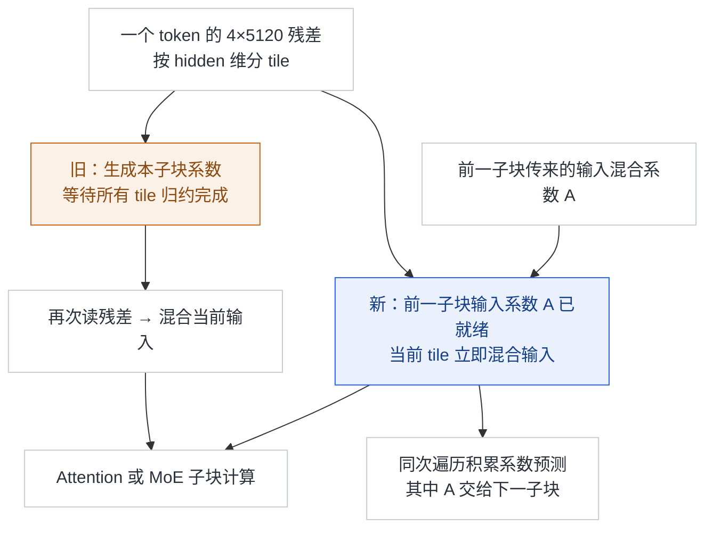

补充图 4 对同一个残差 token 比较系数的依赖关系，省掉的是等待后再次读取残差的路径，不是省掉系数预测。`inference/model.py::Block.forward` 中 attention 消费传入的 `pre_mix`，FFN 消费 attention 产生的 `attn_pre`，最后将 `ffn_pre` 交给下一层，能核实这个错位关系；一般 mHC 机制见 [[25_mhc_analysis|mHC]]。

**训推取舍与证据**：预训练仍用已有多 kernel 实现，只改变系数归属；部署才用 Mega-mHC 融合残差更新、输入混合、系数预测、pre-norm 和 FP8 转换。报告按读写量推导旧实现为 $(4n+4)d$、新版为 $(2n+2)d$，在 $n=4$ 时由 $20d$ 降至 $10d$。这是该残差操作的 activation memory traffic 减半，不是整模型速度翻倍；能力损失仅定性描述为可忽略，没有单项 benchmark 消融表。[报告 §2.4.1][report]

#### 20d → 14d → 10d：逐项读写账本

这里统计**一个 token、一次 Attention/MoE 子块之间的残差过渡**，把下一子块的 pre-norm 单列进来，Attention/MoE 的主体计算不计。令残差路数为 $n$、每路 hidden 维度为 $d$，本模型 $n=4,d=5120$。下文的 $d$ 是**元素个数**，不是字节数、FLOPs 或延迟；“读一次”指一次大张量遍历，不是一个 GPU load 指令。[报告 §2.4.1，Eq.3–6][report]

| 需要跟踪的数据 | 含义 | 每个 token 的元素数 |
|---|---|---:|
| $X_{s-1}$ | 上一子块保留的多路残差 | $nd$ |
| $Y_{s-1}$ | 上一 Attention/MoE 已算出的单路输出 | $d$ |
| $X_s$ | 更新后的多路残差，后续残差连接仍需要它 | $nd$ |
| $u_s$ | 混成一路、尚未做 pre-norm 的输入 | $d$ |
| $z_s$ | pre-norm 后，供下一 Attention/MoE 使用的输入 | $d$ |

残差更新为 $X_s=B_{s-1}X_{s-1}+C_{s-1}Y_{s-1}$；旧版输入混合为 $u_s=A_sX_s$，Single-Pass 改为 $u_s=A_{s-1}X_s$；两者都还要形成 $z_s=\operatorname{RMSNorm}(u_s)$。系数预测为 $(A_s,B_s,C_s)=\mathcal{H}_s(X_s)$。计算依赖见补充图 4/4a，下面只改变中间数据是否需要写出、再次读取。

**第一档：原来的多 kernel 实现，为什么是 20d？**

| 阶段 | 从全局内存读什么 | 写什么大激活 | 本阶段读 + 写 |
|---|---|---|---:|
| ① 更新多路残差 | 旧残差 $nd$ + 上一子块输出 $d$ | 新残差 $nd$ | $(2n+1)d$；四路时 $9d$ |
| ② 预测系数 | 刚写出的新残差 $nd$ | 系数小张量，本大激活账本略去 | $nd$；四路时 $4d$ |
| ③ 用新系数混合输入 | 再读新残差 $nd$ | 单路混合输入 $d$ | $(n+1)d$；四路时 $5d$ |
| ④ pre-norm | 单路混合输入 $d$ | 归一化后输入 $d$ | $2d$ |

所以：

$$
\begin{aligned}
R_{\mathrm{old}}&=(n+1)d+nd+nd+d=(3n+2)d, \\
W_{\mathrm{old}}&=nd+d+d=(n+2)d, \\
V_{\mathrm{old}}&=R_{\mathrm{old}}+W_{\mathrm{old}}=(4n+4)d.
\end{aligned}
$$

$n=4$ 时，读 $14d$、写 $6d$，合计 $20d$。主要重复是：**新残差写出后，被系数预测和输入混合各重读一次；单路混合输入写出后，又被 norm 重读一次。**

**第二档：保持旧 mHC 的系数依赖，但做融合，为什么降到 14d？**

残差更新只在 $n$ 路之间混合，对某个 hidden tile 的更新不必等待其他 hidden tile。新残差 tile 算出后，可立即参与系数投影及平方和累积，于是①②合并，不必为预测器重新遍历一次新残差。但 $A_s$ 仍要等所有 tile 的归约完成，因此输入混合还不能在这一遍完成。[报告 p12–13][report]

| 融合后的阶段 | 读 | 写大激活 | 读 + 写 |
|---|---:|---:|---:|
| ①② 残差更新 + 系数预测 | 旧残差和上一输出：$(n+1)d$ | 新残差：$nd$ | $(2n+1)d$ |
| ③④ 输入混合 + pre-norm | 新残差：$nd$ | 最终单路输入：$d$ | $(n+1)d$ |
| 合计 | $(2n+1)d$ | $(n+1)d$ | $(3n+2)d$ |

四路时是 `9d + 5d = 14d`。相对 $20d$，省掉 **系数预测重读新残差的 $4d$**，以及 **输入混合与 norm 之间单路中间态的写 $d$ + 读 $d$**，共 $6d$。本表沿用报告把③④看作一段的主项抽象，实际 Norm/Cast 中间态的工作区问题见下文，不应据此声称所有实现都消除了这 $2d$ 的物理流量。

**第三档：Single-Pass 解除输入系数等待，为什么是 10d？**

$A_{s-1}$ 在这次过渡开始前已经就绪。因此每个新残差 tile 算出来，可以同时用于系数预测和当前输入混合：不必写完全部 $X_s$、等新 $A_s$ 归约出来后，再读一次 $X_s$。最终仍要保存新的多路残差 $X_s$，因为后面的残差更新继续使用它；这不是把四路永久压成一路。

| 融合过渡的必要输入 / 输出 | 读 | 写 |
|---|---:|---:|
| 旧多路残差 $X_{s-1}$ | $nd$ | — |
| 上一子块输出 $Y_{s-1}$ | $d$ | — |
| 新多路残差 $X_s$ | 无需为本次系数预测/输入混合再读 | $nd$ |
| 下一子块单路输入 $z_s$ | — | $d$ |
| 合计 | $(n+1)d$ | $(n+1)d$ |

所以报告的必要大激活输入/输出主项为：

$$
V_{\mathrm{single}}=(n+1)d+(n+1)d=(2n+2)d.
$$

四路时，读 $5d$、写 $5d$，合计 $10d$。相对第二档，**Single-Pass 本身进一步省掉的是输入混合对新残差的一整次 $nd=4d$ 重读**。由旧多 kernel 到 Single-Pass 的完整差额可以逐项核对：

$$
\begin{aligned}
20d-14d&=4d+2d=6d, \\
14d-10d&=4d, \\
20d-10d&=4d+2d+4d=10d.
\end{aligned}
$$

因此，整个“融合 + 系数错位”方案的主项减少 50%；以已经融合的普通 mHC 为基准，系数错位进一步减少 $4/14\approx28.6\%$。不能把这两个不同基准都写成 Single-Pass 单独减少 50%。

**换成一组能直观看的容量数字。** 若为了比较统一假设上述大激活每个元素都为 BF16、占 2 bytes，则本模型 $d=5120$ 时，一路是 10 KiB、四路是 40 KiB：

| 主项方案 | 读 | 写 | 合计 |
|---|---:|---:|---:|
| 原多 kernel：$20d$ | 140 KiB | 60 KiB | 200 KiB |
| 旧 mHC 融合：$14d$ | 90 KiB | 50 KiB | 140 KiB |
| Single-Pass：$10d$ | 50 KiB | 50 KiB | 100 KiB |

这是**同精度教学换算**，不是生产 FP8 输出及 scale 布局的准确字节账本；也只对应一个 token 的一次过渡，不能当作整个请求的流量。

**这个账本的边界尤其重要。** 报告统计的是大激活读写主项，不包含系数预测器权重、A/B/C 小张量、归约 partials、同步状态、额外工作区、Attention/MoE 主计算或 KV cache。预测器权重被排除是因为这里统计 activation traffic，不是因为权重很小。全局内存逻辑读写还可能命中 L2，不能直接等同于实测 HBM 字节数。

另外，**融合成一个 kernel，不保证没有 kernel 内部的全局内存中间态**。已核查的 DeepGEMM 测试显式按 `2 * count_bytes(y_bf16)` 另计 Norm/Cast 中间态的一写一读；normal 模式再加 `count_bytes(new_residual)` 的残差重读。它说明 `10d` 应作为报告的主项/理想过渡口径理解，不能拿来宣称当前公开 kernel 的全部访存严格等于 `10d`，也不能断言 pre-norm 无需归约或额外暂存。[测试中的 `intermediate_io_bytes`][mega-test] 后文分别列报告推导、发布收益和可运行测试，避免将三者混为一次实测。

#### Mega-mHC 融合了什么，有哪些实际性能证据

**Mega-mHC 融合的是两个 Attention/MoE 子块之间的残差处理，不包含 Attention 的 QK/AV 或 FFN 的专家矩阵乘。** 报告 §2.4.1 列出的融合范围为残差更新、输入混合、系数预测，并加入 pre-norm 和 FP8 转换；§3.2 将 attention kernel、Mega-mHC、Mega-Gate、Mega-MoE 分别列出。DeepGEMM 的 `csrc/apis/mega_mhc.hpp::mega_mhc` 接收上一子块输出 `x`、旧 residual 和混合系数，产出新 residual、系数及供下一子块使用的 BF16/FP8 输入，没有接收 Attention/MoE 的主干权重。[报告 §2.4.1、§3.2][report]；[Mega-mHC API][mega-api]

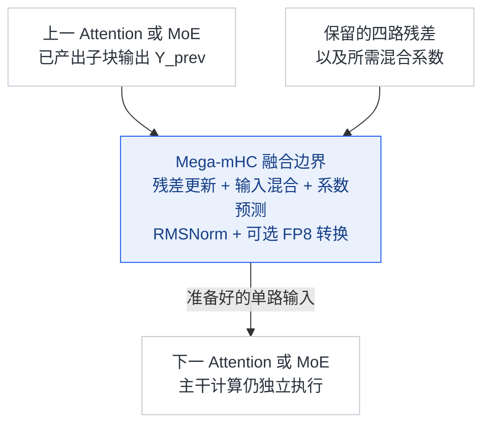

补充图 4b 标的是数据依赖与融合边界，不是 GPU 时间轴。从 Eq.6 看，给下一子块使用的 A_s 由本子块输入 X_s 预测，不依赖本子块 F_s 的输出，因而与 F_s 在计算图上具备并行条件；但这不证明部署用两个并发 kernel 将其耗时隐藏。站在图示两个子块之间的边界，当前系数预测需要更新后的残差，而残差更新依赖上一子块输出；不能仅凭 A 的错位，就推出系数计算已与上一 Attention/FFN 全程并行。报告强调的是**同一份残差 tile 同时用于混合与系数预测，避免等全维归约后再读一次残差**。公开实现内部确有 warp-group 分工：TMA/MMA、残差 Post、workspace epilogue、Mix、Norm 分别承担不同角色；其中 MMA 服务 mHC 自己的系数投影，不是把主干专家 GEMM 搬进来了。没有 profile 时间线，就不能把内部流水化解释成已验证的跨 Attention/FFN 隐藏时延。[`sm100_mega_mhc_impl`][mega-impl]

**新增证据改变了“只有理论访存数字”的阅读范围，但还不是完整端到端消融。** 9 月 10 日 DeepGEMM 官方发布 [PR #432][mega-release] 报告 Mega-mHC 有 **45%–85% speedup**；正文保留它的原始口径，不改写成耗时下降 45%–85%，也不归因为 Single-Pass 这一项的独立贡献。公开材料可分成三层：

| 证据 | 实际提供了什么 | 能说明什么 / 缺什么 |
|---|---|---|
| 技术报告 §2.4.1 | 原多 kernel 为 `20d`；普通 mHC 经融合为 `14d`；Single-Pass 为 `10d` | 残差激活读写量分析；`20d→10d` 是 50% 减少，`14d→10d` 是约 28.6%，不是延迟实测 |
| DeepGEMM PR #432 发布说明 | Mega-mHC 的 45%–85% speedup 汇总声明 | 有官方性能收益声明，但该说明未给每个点的 GPU 型号、shape、微秒数及对应基线，不能作为整模型吞吐增幅 |
| `tests/test_mega_mhc.py::test_mega_mhc` | `bench_kineto` 比较融合 kernel 与多 kernel 基线的时间之和，打印微秒、带宽估算、`baseline_t/kernel_t` 和误差 | 有可执行的正确性与性能测试；本次未运行，不能提供脚本没有附带的实测结果表 |

该冻结测试覆盖 normal/shifted 两种模式、hidden 为 **4096/7168**、token 数为 **1/64/65/200/1025/4096/32768**、两种 FP8 scale 布局；只在 compute capability major 10 上运行。测试输入用 4 路、10 次 Sinkhorn，与本模型 **hidden 5120、20 次 Sinkhorn** 不完全一致。每种模式比较的是“该模式的融合实现 vs 该模式的多 kernel 实现”，不是保持同一模型、只切换 A 错位的模型消融。[测试脚本][mega-test]

`third-party/tilelang_ops/ref_mhc.py` 的 normal 基线使用 `mhc_post`、旧融合 pre 路径和 norm；shifted 基线拆出 input-mix、系数 GEMM/归约、系数拆分/Sinkhorn 和 norm。脚本依赖这些基线可用，缺依赖会跳过；其带宽还单列 Norm/Cast 中间态、normal 模式额外残差重读的估算。**这些是逻辑字节核算，不是 Nsight 测得的 HBM 流量，不能据 GB/s 打印值直接断定已触及硬件 roofline。**[参考基线路线][mega-ref]

**怎样从 roofline 理解收益？** “低于 roofline”本身不能判定是哪种瓶颈；应区分算术强度低、接近带宽上限，与启动/归约/同步或小 batch 并行度不足导致的未充分利用。融合减少重复读写和中间态，并减少 kernel 边界；这些可以在不融合主干大 GEMM 的情况下加速。单个小 kernel 的利用率改善、mHC 段的延迟缩短、整模型 tokens/s 提升是三层不同指标。报告没有提供足够的 SM/Tensor Core 利用率、HBM/L2 实测流量和端到端开关对照来量化全部链路；Attention/FFN 也不能一概假定为 compute-bound，尤其 decode 的实际瓶颈取决于 batch 与上下文。[NVIDIA Roofline 指南][roofline]

### 2.6 Engram：增加可预取的记忆容量，而非每次都做大规模稠密计算

两个 Engram 模块使用 2/3/4-gram、多头哈希和上下文门控：由输入文本确定查表地址，取出的记忆投影为 key/value，再由当前残差与 key 的匹配决定注入多少 value。比如某位置的文本 2/3/4-gram 可在到达 L14 前就确定地址，但最终门控仍需等待 L14 的 hidden state；**能提前的是查表，不是完整模块输出**。`Engram.forward` 将同一 value 经各残差分支 gate 注入；图像位置被 `Transformer.forward` 的 mask 排除在文本 n-gram 贡献外。完整查表机制见 [[29_engram_analysis|Engram]]。

**选型直接受 infra 影响**：L1/L14 的位置为了平衡训练 pipeline 的内存；embedding 与投影用 FP8。相对原 Engram 方案去掉短因果卷积，是因收益不足以抵消推理栈复杂度。线上可从主机内存通过后台 RDMA 预取，首模块预取与第一层计算重叠；但 RL rollout 反而让表常驻 GPU，减少主机内存碎片导致的 OOM。两种放置服务不同负载，不能合写成“Engram 永远 offload CPU”。[报告 §2.4.2、§3.1.3][report]

**训练与消融**：新增大表使 Adam 优化器状态过大，故改用只保留 momentum 的 Sinkhorn-balanced update，并按行分片表、跨副本分片优化器状态。作者定性称优于 Adam，未列出本模型去掉 Engram、改变层位置或保留短卷积的完整对照成绩；196B 是容量配置，不能直接折算为能力增幅。

### 2.7 原生图文与 MoE：把视觉成本和路由均衡一起设计

ViT 用 2D-RoPE 接受可变分辨率，patch embedding 从卷积换为线性投影以适配 Muon，并采用 RMSNorm/SwiGLU。3×3 pixel-unshuffle 把 9 个邻近位置移到通道维，再由两层 MLP 投影到语言 hidden：例如 6×6 视觉网格变为 2×2 网格，每位置暂有 9 倍通道，因此传入语言主干的视觉位置数减少九分之八；这不是删掉九分之八的像素。该链路可从 `vision.py::Aligner.forward` 核实。[报告 §2.1.1][report]

**训推取舍**：减少视觉 token 同时降低主干训练和推理成本，但更粗的空间表示需细粒度视觉任务训练弥补，不能推出所有小字或定位任务无损。MoE 延续共享专家与细粒度路由，新增图像/文本各自的专家 correction bias：它只改专家选择，输出加权仍用原始路由分数。这样避免“总体均衡”掩盖某一模态的专家拥挤。[报告 §2.1.1；`model.py::Gate.forward`][report]

视觉预训练还比较了早期高分辨率方案：对比学习阶段提高分辨率虽有阶段收益，对最终模型帮助有限，故先限制到 224×224，后续生成式阶段再学高分辨率。报告明确说明了这个成本取舍，但未给 3×3 降采样、模态 bias 各自的定量消融表。[报告 §4.2.2][report]

### 2.8 DSpark：用调度目标选择验证长度

DSpark 三层草稿器一次准备五个位置的 base logits，轻量 Markov head 表达草稿间依赖，confidence head 预测条件接受率。调度器再结合这些概率与已测的引擎吞吐曲线，按当前负载选择验证前缀长度；目标是系统总吞吐，并非每个请求固定验证五个位置。草稿仍须主模型验证；算法细节归 [[dspark_analysis|DSpark]]。[报告 §2.4.3][report]

**训推取舍与证据**：主干预训练期间省去联合 MTP；预训练结束后冻结主干单训 DSpark，后训练期间再同步更新，草稿损失不回传主干。这使草稿器跟上变化中的 RL/OPD 策略，同时用于 rollout 加速。本报告没有按硬件、batch、上下文和负载给出完整 DSpark 开关吞吐表，不能把通用 DSpark 论文的速度数值直接套到本 checkpoint。

### 2.9 消融证据汇总：哪些能归因，哪些只能确认方向

| 改动 | 本报告可用证据 | 尚不能得出的结论 |
|---|---|---|
| CED / CSA2 / 分层索引 | 复杂度、缓存布局、配置与机制；CED 能力相当的定性陈述 | 每项独立贡献了多少正确率、最优层分组或候选池大小 |
| FP4 / Single-Pass mHC | 数值范围、读写量推导与定性精度比较 | 全任务无损、固定端到端提速比例 |
| Engram / 视觉 / 优化器 | 明确替代方案与选型理由，部分定性实验结论 | 容量、位置、卷积、降采样或优化器各自的因果增益 |
| Bounded Replay / DSpark | 恢复与调度设计；replay 影响小的作者结论 | 所有缓存命中位置等价、任意负载的固定加速 |
| RL 规模 / reasoning effort | Figure 7–9 的曲线、Table 4 的框架对照 | 用这些整体验证替代架构组件的独立消融 |

因此，本文把“配置/源码确认结构”“理论与读写成本推导”“作者生产报告值”“定性实验陈述”分别使用。**公开报告没有一套覆盖全部组件的量化消融矩阵**，新增结构与训练数据同时变化，不能由最终 benchmark 倒推出各模块贡献。

**从 AI infra 看，哪些结构改动直接改变成本？** 下表归纳各节已有证据，区别“少做什么”与兑现收益所需的训练条件；它不是额外的消融结论。[报告 §2–§3][report]

| 结构选择 | 直接减少的资源 / 工作 | 训练适配与不能省掉的部分 |
|---|---|---|
| CED + 局部 replay | 长 prompt 通过 decoder 的位置数 | 后训练模拟 decoder replay；不自动省掉训练上半部反向，也不跳过新生成 token 的 encoder |
| CSA2 + 简化压缩器 | 重复 KV、重复索引；去重叠及独立 indexer 压缩路径 | 跨 stage 状态与梯度协调；每层 Q/SWA/MoE 保留 |
| 分层候选池 | 后续 Reindex 的打分范围 | 后训练施加相同候选限制；首 Full 仍扫全部可见位置 |
| FP4 global KV | 缓存容量与搬运字节 | QAT、格式与硬件匹配；SWA 保留 FP8，不等于所有 GEMM 都改成 FP4 |
| Single-Pass mHC | 残差重复读取及推理 kernel 启动 | 系数依赖在训练中改变；预训练仍可用多 kernel |
| Engram 去短卷积、选 L1/L14 | 推理栈复杂度、训练 stage 内存不均 | 大表需分片、预取与专用更新；增加容量仍有查表通信成本 |
| 视觉 3×3 降采样 | 进入主干的视觉 token 数 | 后续高分辨率训练弥补细粒度表示；视觉编码器自身仍要运行 |
| DSpark 置信度调度 | 自回归串行验证轮次，按负载选择验证长度 | 草稿需跟随 RL/OPD 策略更新；接受率和批量影响收益，前代已具备 DSpark |

Muon 的分头更新主要服务优化质量，不能仅凭名称将其列为推理 kernel 提速；更宽主干、更多专家也是容量选择，不能统称为降低计算量的结构改动。

## 3. 训推工程：Pretrain、Posttrain 与 Inference 如何配合

### 3.1 Pretrain：先准备视觉编码器，再联合训练主干

| 阶段 | 设计 | 工程目的与边界 |
|---|---|---|
| ViT 对比预训练 | 约 47B 图文对，SigLIP 目标，最大 224×224 | 大规模学习视觉表示，避免在最终收益有限的早期高分辨率上过度计算 |
| ViT 生成式微调 | 接 4B MoE LLM，236B token；分辨率 544×544–1344×1344 | 学细粒度视觉，结束后丢弃这个辅助 LLM，只保留 ViT |
| 主干预训练 | 45T token；纯文本:多模态=7:1；从 64K 直接训练稀疏注意力 | 无 dense attention 热身，图文从主干训练起联合进入网络 |
| 学习率与长度 | 2000 step warmup；峰值 2.6e-4 到 28T；28T–40T cosine 降至 2.6e-5，保持到 45T；34T 扩到 1M | 不可仅凭配置中 YaRN 判定百万上下文只靠推理外推 |
| 视觉解冻 | 主干前期冻结 ViT，但末层 norm 与 projector 可训练；学习率衰减开始后以较低学习率解冻 | 联合适配视觉表征，同时控制大部分预训练的计算负担 |

以上为[报告 §4.1–§4.2][report]。训练 batch 固定为约 100.6M token；文本与多模态重叠样本以多模态版本替换，避免把同一内容重复算入混合语料。超长文档确定性预切分，best-fit packing 把 padding 率控制在至多 `1e-4`。数据侧过滤低信息量模型生成内容、更新代码语料，并对图文先做低成本筛选再做昂贵图像处理，减少 CPU/I/O 浪费。

优化器按参数性质分工：主干线性矩阵、Engram 投影和视觉 projector 用 Muon，Q/K 用 head-wise Muon 以适配头间异质性；Engram/词嵌入/输出头用 momentum + Sinkhorn balancing，逐行/列平衡更新 RMS 并节省 Adam 二阶状态；norm 等非矩阵参数保留 AdamW。报告 Algorithm 1 的近零行屏蔽、学习率校正等细节属于优化过程，不能把这里的 Sinkhorn 与 mHC 的残差约束当成同一用途。[报告 §2.5、§4.2.2][report]

### 3.2 训练基础设施：结构省下的计算需要协调成本来兑现

**图文并行与数据路径。** ViT 从语言参数树中分离并复制，训练 step 分为视觉 forward → LLM forward/backward → 视觉 backward，避免图像数量不均把 LLM 流水线拖慢。独立 ViT 对比学习时，视觉特征 all-gather 与文本 forward 重叠，文本特征 all-gather 与文本 backward 重叠。长图文序列的图片按 context-parallel rank 均衡分片且每张只加载一次；rollout 增量传输新增图片，CPU 解码/预处理结果在分布式文件系统复用。[报告 §3.1.1][report]

**CSA2 跨 stage 共享。** 若源层和消费层分属不同 pipeline stage，下游放轻量 shadow indexer，但参数优化/checkpoint 仍只有一个逻辑 owner；副本做参数同步与梯度汇总。共享 hidden/KV/索引等所需状态随已有 P2P 载荷传输，并按 context parallel 分片。运行时按 micro-batch 区分状态，贯穿前向、重算和反向，等最后消费者结束再释放，避免不同 micro-batch 串用缓存。这些是报告披露的训练设计，HF 推理代码不包含其分布式训练实现。[报告 §3.1.2][report]

**Engram 与优化器状态。** 查表地址先于流水线计算就已知，因此在 stage 处理 micro-batch 前，对整个 local batch 预取；反向先缓冲 embedding 梯度，主干 backward 完成后送回所属 rank。预取/回传分别与视觉 forward/backward 重叠，FP8 数据和 scale 直接交给后续 GEMM。Sinkhorn 更新保留行列 scale 向量，避免每次归一化都重写整张巨表，并融合行归一化与部分列统计。增加 Engram parallel size 会降低每卡表存储，却扩大通信范围，是实质性的容量/通信取舍。[报告 §3.1.3][report]

#### 并行应该如何安排亲和

**官方披露了“共享状态如何跨 stage 训练”，没有给出可直接套用的最优 PP/TP/CP/EP 度数或完整机器拓扑。** 以下“亲和”指生产者与消费者放在哪里、哪些数据必须一起分片；除前述报告已披露的机制外，表中的布置建议是本文按依赖关系推导的工程判断，需要按硬件、batch 和上下文实测。

| 并行维度 | 宜一起考虑的对象 / 建议 | 代价与边界 |
|---|---|---|
| PP：按层做流水线并行 | 内存和负载允许时，让 Full 源与其 Reuse 消费层靠近；切开时显式传共享状态 | 按层数平均不一定均衡，Full/Reindex/Reuse、Engram 的成本不同；不能只传普通层间 hidden |
| CP：按序列做上下文并行 | 源与消费者使用一致的位置分片；压缩比 2 的分组边界尽量对齐，跨界则传递所需半组状态 | global 位置、候选 ID 与所在 rank 必须一致；稀疏 attention 不自动消除跨 rank 通信 |
| TP：张量并行 | Query 头可分片，但共享的 512 维 KV latent 需另选复制、分片或通信方案 | 不是 64 套独立 KV 头可按头平均切分；复制省通信但增加显存，分片可能增加 attention 通信 |
| EP：专家并行 | 尽量让频繁的专家分发/回收落在高带宽域，并与 attention 的设备组协同 | KV 节省不会消除 MoE all-to-all；模态路由均衡不保证实际链路或专家时间均衡 |
| Engram 专用并行 | 报告按专用进程组切表的行，进一步分片优化器；部署时单独衡量查表链路 | 不应直接等同于主干 TP 组；训练预取、线上 host/RDMA、rollout GPU 常驻是不同路径 |

例如沿 §2.2 的同一 L2 消费组，**假设** PP 边界放在 L5/L6 之间，micro-batch m0 会多出一条共享状态路径：

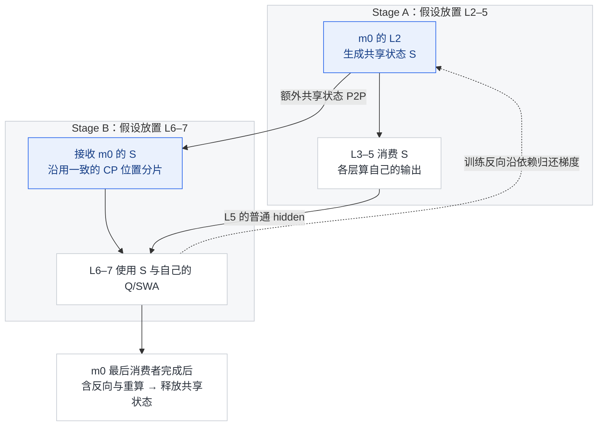

补充图 5a 的 stage 切点是教学假设，跨 stage payload、梯度与 micro-batch 生命周期依据报告 §3.1.2。S 概括下游需要的中间表示及稀疏选择状态，不是声称生产系统逐字节发送某个固定缓存对象；反向箭头表示依赖关系，不是独立直连网络协议。若 Reindex 跨 stage 涉及共享 indexer 参数，还要配合前文的 shadow、副本同步及唯一优化 owner。

**逻辑共享不等于物理上只放一份。** 尤其 L20 的 KV 被全部 20 个 decoder 层使用：若这些层跨多个 PP stage 或 TP rank，每处完整复制都会侵蚀 §2.4 的 890 bytes/token 优势。实际需在本地副本加增量同步、分片访问和远程读取间权衡；报告未公开完整 serving 协议，本文不指定其中某一种为官方方案。普通隐藏状态、共享 KV/索引和专家通信必须分别计入放置与带宽预算。

### 3.3 Posttrain：环境与数据扩展，异步 rollout 保持吞吐

路线仍是 **SFT → RL → 最终全词表 OPD**。作者明确说主要变化在数据和环境生产，不是一种全新的 RL 算法：一个任务由问题、环境与验证系统组成，持续生成可验证任务，审查难度/正确性，并用失败轨迹修复环境和回流训练。最终 OPD 汇合超过 40 个、可来自不同阶段和架构的教师；Figure 7/8 展示 RL 规模扩展趋势，部分曲线断点包含 OPD 聚合后再继续 RL，不能读成一次完全同配方的连续消融。[报告 §5.1、§5.2.4][report]

| 异步工程问题 | 采用的方法 | 换来的代价 / 必须处理的偏差 |
|---|---|---|
| 整批补发使并发振荡；等整组完成又被长尾卡住 | 按已完成样本数补发：够下个 prompt 的组大小就发，不要求来自同组 | 提高稳态并发，仍须限制各数据源的并发占比 |
| training 与 rollout 资源比例难预设 | 同设备分时，样本足够后训练抢占生成 | 支持 token 边界停止、保存 KV/路由，升级策略后续跑 |
| 短样本先返回，旧策略 token 混入 | 数据源并发控制，可丢弃早返短样本；限制 off-policy 程度并 mask 过旧 token | 提升吞吐不等于消除了长度偏差和策略陈旧性 |
| 一条轨迹跨多个 checkpoint | 拼接各段 rollout 的 expert routing 做 routing-replay；按样本完成回收状态 | 直接续用旧状态省去重新 prefill，但不能解释为整条样本来自同一策略 |
| 异步途中调整数据/教师配置 | 跟踪运行中的不同配置并保持一致过渡 | 不能把“配置已切换”等同于旧样本已全部清空 |

[报告 §5.2.1–§5.2.4][report]。另有三项结构适配嵌入后训练：decoder 分层候选限制、main KV FP4 QAT、decoder bounded replay 模拟；DSpark 同步训练但梯度不回流主干。公开推理仓不能验证这些训练调度和损失实现。

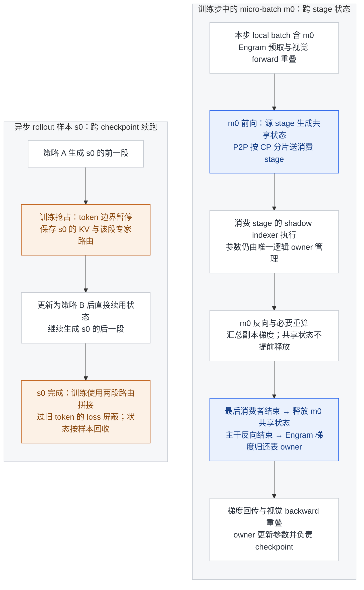

补充图 5 用 m0 和 s0 分别跟踪训练与 rollout 的状态。训练部分强调唯一参数 owner 与最后消费者释放；Engram 预取按整个 local batch 发起，不是每个 m0 单独发起。rollout 部分说明复用旧 KV 能省去 prefill，但样本跨策略，仍须处理陈旧性。箭头表示因果/完成条件，不是按比例的并行时间线；以上均为报告 §3.1/§5.2 披露的设计，HF 推理代码未提供这些训练调度的实现。

Reasoning effort 也经过训练：同 prompt、同 effort 的响应形成奖励比较子组，不把不同预算直接混组；较高 effort 使用更弱的长度惩罚，让模型学会成本/正确率取舍。它不是简单放宽 `max_tokens`。Figure 9 报告 effort 25→100 时，8 项推理平均 Pass@1 从 67.1→76.3、DeepSWE 66.0→74.2、Terminal-Bench 2.1 82.4→90.6，代价约 2.5 倍输出 token；这些是预算对照，不是架构消融。[报告 §5.1.4、§5.3.3][report]

### 3.4 Inference：分离服务阶段，按复用时间尺度管理 KV

部署采用 **EPD（视觉编码 / prefill / decode 分离）**，使三个阶段独立扩缩容并重叠执行；这里的第一个 E 是视觉编码服务，不是再把 CED 的 20 层 encoder 单独算成一个同义阶段。报告的 FlashMLA、DeepGEMM、TileKernels、DeepSelect 融合路径，将多数 **Reuse 模式层**压到 prefill 15 个、decode 11 个 kernel。该数字不适用于全部层，更不等于已在 HF readable 实现中复现了吞吐。[报告 §3.2][report]

SWA 每层只看最近 128 token，不代表丢失全部层状态后重算 128 token 就能精确恢复：层间依赖会叠加。报告按 $L\times W$ 描述完整精确重建所需的范围；V4 的持久化 SWA 与精确重算都代价较高。V4.1 改为只重放最近 $W$ 个 token，并截断 replay 段之前的局部依赖。[报告 §3.2.1–§3.2.2][report]

这里有两条不同路径：

| 路径 | 触发 / 执行内容 | 哪些数据必须保留 |
|---|---|---|
| Encoder SWA Bounded Replay | 全局前缀命中、encoder SWA 丢失时，重放缓存前缀尾部并处理新增后缀 | replay 的旧前缀只重建 SWA，不重算或覆盖已缓存 global KV；新后缀产出两类 KV |
| Decoder SWA Bounded Replay | 每次 prefill 用最后 128 个位置的 encoder 输出跑 decoder | decoder global KV 仍来自 encoder；重建的 decoder SWA 只服务后续 decode，不做 prefix 持久缓存 |

例如已缓存前缀 `p0…p7`，新增 `u0,u1`，教学窗口取 $W=2$：

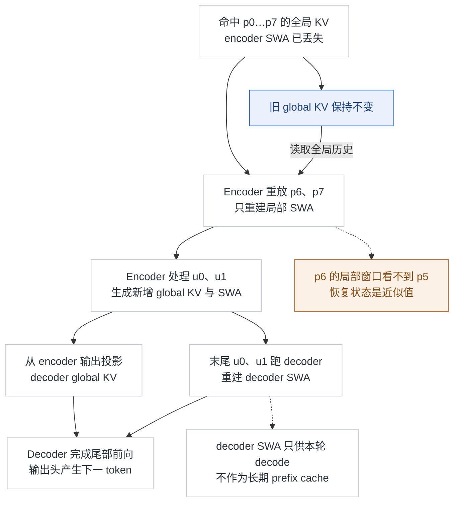

补充图 6 同时标出“旧缓存不覆盖”和“局部依赖被截断”。正式窗口是 128。即使新增后缀相同，不同前缀命中位置也可能产生不完全相同的后续状态；这不是可宣称逐位相等的恢复算法。报告称质量影响很小，并对 decoder replay 做后训练适配，但不能推成所有输入无损。[报告 §3.2.2、§6][report]

**两个缩减比例不能混用**：相同长度下，CSA2 与量化让 global KV 约为旧 V4 Flash 的 **1/4**；在报告的相同工作负载中，再移除长期 SWA 持久化，persistent KV 约为旧版的 **1/8**。原来 SWA 在该持久缓存工作负载中占近一半，所以又获得约二分之一的缩减。encoder SWA 仍可留在短 TTL 的主机 DRAM 池，global KV 才走长期缓存。比例依赖旧基线的缓存构成，不是任意序列的数学常数。[报告 §3.2.1][report]

生产策略具体把约 10% 主机 DRAM 组成分布式 SWA 短 TTL 池，分钟级回收；global KV 在持久缓存保留至少 72 小时。这个配置利用了会话局部状态复用短、全局前缀复用长的差异，是作者服务负载下的工程方案，不是模型要求所有部署必须采用的比例。[报告 §3.2.1][report]

#### 一次正在生成的请求，实际要保存哪些状态

| 状态 | 归属与更新 | 生命周期 / 是否属于 890 bytes/token |
|---|---|---|
| Encoder global main KV + indexer K | L2/L8/L14 各一组，每完成两个位置追加 | 长序列持久全局载荷的一部分；三组不是同值副本 |
| Decoder global main KV + indexer K | L20 生成，各 decoder 层共享；每个新位置追加 | 长序列持久全局载荷的一部分；物理复制额外算 |
| 每层 SWA KV | 40 层各自的最近 128 位置，逐 token 写环形槽 | 不在 890 中；运行时保留，encoder 可用短 TTL 池，decoder 不长期持久化 |
| Encoder 压缩半组 | L2/L8/L14 各自的 KV 投影和 gate 分数 | 不在 890 中；跨当前请求的生成步保留，凑齐后槽位可复用 |
| 当前 token 的 Q、Top-K、候选池及中间激活 | 按本层或共享消费组产生，用完后可释放/复用工作区 | 不在 890 中；不应按完整历史再存一套每步检索结果 |

这份表只列主干 attention 的相关状态，不是包括权重、Engram 和 DSpark 在内的服务总内存清单。正常 decode 复用旧 KV，不需要长期保存所有旧 token 的每层 hidden；prefill、replay 与训练重算需要的激活另有生命周期。**缓存命中只有 global、没有 SWA 时必须执行前文 replay，不能直接把 global entry 当成本层 hidden 继续算。** 未满压缩组也属于恢复所需的状态边界；报告未公开生产前缀缓存如何序列化/恢复半组，参考代码只能证明连续 decode 的暂存逻辑，不能补写成已验证的跨请求恢复协议。

### 3.5 HF 参考代码核对：结构逻辑与生产优化分开

冻结仓的 `inference/README.md` 明确定位为可读的参考实现。以下锚点均已打开核查；[同提交源码目录][inference]可以沿符号继续读。

| 论文机制 | 参考代码锚点 | 核查结论 |
|---|---|---|
| CSA2 缓存和选择跨层共享 | `inference/model.py::Attention.__init__` → `_compress_kv` / `_compress_topk_idxs` → `SharedAttentionRuntime` | 缓存由 source 层写入；后续层读取同一份缓存或 Top-K，仍单独计算 Q、SWA、attention |
| 未完成压缩组与局部可见性 | `inference/model.py::Compressor.forward` → `Attention._compress_kv` / `_compress_topk_idxs`；`Attention.forward` → `_window_kv` | 未组满时保留投影/gate 并返回 `None`，不追加 global；SWA 仍写入当前 token，完成组后新增 main KV 与 indexer K；只核实初始 prefill 与逐 token decode |
| 分层候选选择 | `inference/model.py::select_candidate_blocks` → `Indexer.forward` | 按块最高分建池；代码还强制保留最新可见位置所在块。**先全范围 einsum，再 mask 候选**，不能用它证明后续 indexer 的实际计算量恒定 |
| FP4 KV 的数值规则 | `inference/model.py::Attention._compress_kv` → `inference/kernel.py::fp4_act_quant` | RoPE 后按 16 通道/E4M3 scale 量化；`inplace=True` 写回反量化后的值。**不是物理打包的 890 bytes/token 缓存实现** |
| Single-Pass mHC 的系数错位 | `inference/model.py::Block.forward` → `hc_pre` / `hc_mixes` | attention 消费传入的上一子块系数，FFN 消费 attention 生成的系数，再交给下一块；没有据此验证 Mega-mHC 生产融合性能 |
| 图像进入语言序列 | `Transformer.encode_image` → `inference/vision.py::ViT` / `Aligner.forward` → `Transformer.merge_image_embeddings` | ViT 特征经 3×3 重排与两层 MLP 后写入图像位置，与文本共同前向 |

**最重要的未闭合部分是 CED 的生产 prefill 路径。** `Transformer.forward` 对所有主干层顺序执行，没有本页补充图 2 的 encoder 截止、decoder 尾部 replay 调度；也没有补充图 6 的 prefix 持久缓存恢复路径。参考代码在 L20 产生共享全局 KV 的连接不能替代完整 CED/replay 的部署证据。`inference/README.md` 还说明普通 generation 为自回归采样；存在 DSpark forward 模块不代表包含生产验证调度器。[参考实现说明][inference-readme]

因此，本页把 **CED prefill 减半、bounded replay、固定候选稀疏计算与 890 bytes/token 的物理缓存**归为报告设计/生产系统报告值，把符号能确认的逻辑归为参考实现证据。未经 GPU 执行验证，不能宣称已复现其速度、吞吐、精度或显存。

### 3.6 API 接入与成本快照

截至本次查询，推荐模型名为 **`deepseek-flash`**，不是按产品名称猜写 `deepseek-v4.1-flash`。OpenAI 格式 base URL 为 `https://api.deepseek.com`；Anthropic 格式为 `https://api.deepseek.com/anthropic`。支持 Chat Completions、Responses 与 Anthropic 兼容接口。[首次调用说明][first]

| 请求模型名 | 当前/计划服务行为 |
|---|---|
| `deepseek-flash` | 当前正式版 V4.1 Flash |
| `deepseek-v4-flash`、`deepseek-v4-flash-vision-exp` | 旧模型已下线；保留名称，当前由 V4.1 Flash 承接并按 Flash 计费 |
| `deepseek-v4-pro` | **2026-09-14 12:00 北京时间之后**，至 V4.1 Pro 上线前，计划全部转到 V4.1 Flash 并按 Flash 计费 |

旧别名还能请求，不意味着还能得到旧权重行为。需要可复现实验时，应记录调用时间、实际端点和模型版本；不能把未来 Pro 路由切换写成 9 月 10 日已完成。[首次调用说明][first]

**人民币/百万 token，2026-09-10 价格快照**：[官方价格表][pricing]

| 项目 | Flash 空闲 | Flash 高峰 | V4 Pro 空闲，迁移前 |
|---|---:|---:|---:|
| 输入：缓存命中 | 0.02 元 | 0.04 元 | 0.15 元 |
| 输入：缓存未命中 | 1 元 | 2 元 | 4.5 元 |
| 输出 | 4 元 | 8 元 | 13.5 元 |

高峰为北京时间周一至周五 09:00–12:00、14:00–18:00，其余为空闲。价格表列出 Flash 并发限制 2500，这不等于单请求吞吐保证。举例，空闲时段输入 100 万 token，其中 90% 命中缓存，输出 10 万 token：费用为 `0.9×0.02 + 0.1×1 + 0.1×4 = 0.518 元`；同量全在高峰则 1.036 元。**这是固定用量的估算，不能保证任务只消耗这些 token。**

思考强度在训练中是 1–100 的标量，公开 API 预设 `low/high/max` 对应 **50/75/100**（报告 Table 2），默认思考开启且 `high`。论文曲线表明更高 effort 通常消耗更多输出；Figure 9 的局部点也有波动，不能保证每一档都严格提高正确率。[报告 §5.1.4、§5.3.3][report]；[思考模式文档][thinking]

接入时还有两个容易影响结果的契约：

- 思考模式下设置 `temperature` 不会生效；携带 `tools` 时后续请求必须完整回传 `reasoning_content`，即使该轮没有实际调用工具，否则文档声明会返回 400。[思考模式文档][thinking]
- 图像支持 JPEG/PNG/GIF/WebP，可用内联数据、公开 URL 或 Files API。当前图像指南给出每张最多 1024 token，不能继续沿用旧 Vision Exp 发布时的 384 token 上限；识图能力不等于传入文件就无损保留全部细节。[图像理解文档][vision]

## 4. 模型效果：与主流模型相比，强在哪里、弱在哪里

下表统一采用 **报告 Table 3（p33）**，所有列为该表的 Max 档。数值是官方报告结果，本次未独立复现；同名测试集也需结合版本、harness 和工具条件理解。

| 基准 / 指标 | V4 Flash | V4 Pro | V4.1 Flash | 能支持什么结论 |
|---|---:|---:|---:|---|
| GPQA Diamond / Pass@1 | 89.9 | 92.4 | 90.9 | 比旧 Flash 高 1.0 个百分点，仍低于 Pro |
| HLE 纯文本子集 / Pass@1 | 37.8 | 42.7 | 39.1 | 不能把新版全量 36.8 混入本行 |
| Terminal-Bench 2.1 / Pass@1 | 82.7 | 87.9 | 90.6 | 较旧 Flash 高 7.9 个百分点 |
| Terminal-Bench 3.0 / Pass@1 | 7.6 | 11.8 | 30.0 | 更难版本也有提升，但不是 2.1 的同一量尺 |
| Terminal-Bench 4.0 / Pass@1 | 7.0 | 12.4 | 31.2 | 仍低于表内 Opus-5 的 51.8、GPT-5.6 Sol 的 39.9 |
| DeepSWE v1.1 / Resolved | 54.4 | 62.7 | 74.2 | 此最高分对应 mini-SWE，不能贴给任意 Agent 框架 |
| NL2Repo-Bench / Score | 54.2 | 61.5 | 65.4 | 模型卡存在冲突，见下文 |
| Automation-Bench / Pass@1 | 37.7 | 43.2 | 54.8 | 本表为 v1.0.6 口径，别拼接旧发布中的 25.1/31.8 |
| HLE with tools / Pass@1 | 51.5 | 60.0 | 63.9 | 有工具测评，不是裸模型 HLE |

视觉 Agent 结果在同一 Table 3 中为 Chartography **78.9**、BabyVision **89.6**（均 with tools、Pass@1），ZeroBench-main **49.0**（with tools、**Pass@5**）。报告使用 Claude Code 与 512K 上下文；三项都不能表述成无工具的原生视觉准确率。另外，**Table 1 比较的是 Base 预训练模型，不是本节的 Instruct/API 模型**：V4.1 Flash Base 的 LongBench-V2 为 **45.2 vs V4 Pro Base 51.5**，SimpleQA-Verified 为 **42.3 vs 55.2**，基座知识与长上下文也非全面领先。[报告 §4.3、§5.3.1][report]

### 4.1 同一报告中的主流模型横向比较

为避免拼接不同榜单，下面仍只取报告 Table 3 的 Max 档；这代表**发布方报告中的比较**，不是独立统一 harness 重测。省略 HLE 是因为部分模型列为纯文本子集，直接横排会混淆口径。

| 指标 | V4.1 Flash | Opus-5 | GPT-5.6 Sol | Kimi-K3 | GLM-5.3 |
|---|---:|---:|---:|---:|---:|
| GPQA Diamond / Pass@1 | 90.9 | 93.4 | 94.1 | 92.9 | 88.1 |
| Terminal-Bench 2.1 / Pass@1 | 90.6 | 89.1 | 88.8 | 88.3 | 88.2 |
| Terminal-Bench 4.0 / Pass@1 | 31.2 | 51.8 | 39.9 | 12.6 | 37.9 |
| DeepSWE v1.1 / Resolved | 74.2 | 74.0 | 73.0 | 67.5 | 66.9 |
| ProgramBench / Almost@1 | 20.3 | 37.0 | 23.0 | 17.5 | 19.0 |
| Automation-Bench / Pass@1 | 54.8 | 50.3 | 45.8 | 46.7 | 48.8 |
| Chartography with tools / Pass@1 | 78.9 | 84.0 | 79.9 | 68.1 | — |

**判断**：常规终端编程、修复与办公 Agent 已在表内第一梯队，DeepSWE 对 Opus-5 的 0.2 个百分点差值缺少置信区间，宜解读为接近；更难的终端任务仍有明显差距，如 Terminal-Bench 4.0 比 Opus-5 低 20.6 个百分点。图表工具任务接近 GPT-5.6 Sol 但仍低于 Opus-5；GPQA 也没有领跑。它的突出价值是把多项强 Agent 能力与更低上下文成本组合起来，而非每条能力轴都达到最高。

### 4.2 同一模型，harness 足以改变结果

Table 4 固定 checkpoint、任务集、采样配置和 1M 上下文，替换外围工具/系统提示/交互协议：

| Harness | DeepSWE v1.1 / Resolved | Terminal-Bench 2.1 / Pass@1 |
|---|---:|---:|
| mini-SWE | 74.2 | 90.3 |
| DSH Minimal | 72.6 | 90.6 |
| Claude Code v2.1.251 | 69.8 | 88.0 |
| Codex v0.147.0 | 65.6 | 84.1 |
| OpenCode | 65.5 | 85.0 |

条件是 effort 100、temperature 1.0、top-p 0.95、最多 500 个模型生成轮次；DeepSWE 每题 8 次、Terminal-Bench 每题 3 次，后者禁用网络。报告附录 B.1 的 Codex 配置还适配了 tool schemas，不能将其结果视为任意当前 Codex 客户端的原生表现。**多次采样估计平均表现不等于把 Resolved/Pass@1 改成 Pass@8/Pass@3。** 单纯更换外围框架，DeepSWE 可从 74.2 变为 65.5；因此接入应用后的成功率需要按实际框架测量。[报告 §5.3.4、Table 4、附录 B.1][report]

### 4.3 官方材料之间的冲突

> [!contradiction] NL2Repo 与采样参数存在来源差异
> 冻结模型卡的 NL2Repo-Bench 是 **64.0**，同一提交的报告 Table 3 及当天 API 更新日志是 **65.4**。正文采用报告表值，不能声称三方完全一致。另，模型卡笼统写 instruct 评测 top-p=0.95，报告 §5.3.1 对 reasoning 明确写 temperature/top-p 都为 1.0，agent 测试则为 1.0/0.95。复现时应按具体任务设置，而非统一抄模型卡一句话。[模型卡][card]、[报告][report]、[更新日志][release]

> [!contradiction] “全面超越 V4 Pro”需要限定
> 官方 API 迁移说明采用整体优于 V4 Pro 的表述；但同为 Instruct 的报告 Table 3 中，GPQA、HLE 纯文本子集仍低于 V4 Pro。可写“整体效率与多项 Agent 成绩更强”，不能写“每个任务都更强”。[首次调用说明][first]、[报告][report]

报告 §5.3.5 还给出初步多 Agent 实验，使用筛选后的 172 个 ProgramBench 任务与墙钟期限比较；这不是对全测试集、相同 token 预算的控制实验。本页不把多 Agent 增益计入单模型 Table 3 的结论。§6 也明确承认极难任务、稀疏漏选和近似状态恢复的能力边界。[报告][report]

### 4.4 落地时如何看这组结果

它适合作为编码、办公和图文 Agent 的低成本候选，但落地评价应固定实际 harness，分别测成功率、完整任务用时、总 token 与缓存命中，而不只比较模型单价或即时 token/s。对于复杂知识推理和极长检索，应保留报告已显示的能力边界；部署旧 V4 的经验也不能直接保证新版组件均受框架支持。

报告没有提供足以复算所有主流模型在同硬件、同精度、同负载下端到端吞吐与任务总成本的表，因此“性价比”的判断应限定为公开单价、结构成本证据与上述能力组合。价格低不自动等于完成任务便宜；更多失败重试、更长思考或不同缓存命中率都可能改变排名。

## 5. 总结

V4.1 Flash 的核心不是某个孤立模块，而是 **先扩大可用容量，再让不同阶段只支付必要的成本**：图文入口提供视觉信息，CED 减少长 prompt 的完整 decoder 计算，CSA2/FP4 降低缓存，mHC 和 DSpark 减少访存与生成开销，Engram 用可预取记忆补容量。训练侧再用跨 stage 状态管理、分布式查表、量化/候选/replay 适配及异步 rollout，让这些选择可以一起工作。

能力上，它在多项日常编程和办公 Agent 任务中接近或达到报告内领先水平，在高难知识、科学任务与部分视觉指标上仍落后于最大模型。证据上，结构与配置已结合 HF 源码核查，但组件消融、生产调度和端到端性能仍有公开材料边界。**更准确的定位是：针对长任务成本重新设计、具有强 Agent 能力的原生图文模型，而非全面领先或已被完整复现的“小模型”。**

### 来源与可复核边界

来源索引与文件校验值记录在 `raw/01_theory/01_models/deepseek/DeepSeek_V4_1_Flash_20260910.md`；Mega-mHC 发布说明的新增来源索引见 `raw/01_theory/01_models/deepseek/DeepGEMM_Mega_mHC_20260911.md`。完整论文仍使用冻结的官方 PDF 链接；本页按用户要求保留 Figure 3/4/5 原图（含原始英文图注），与中文补充图分开标注，未给报告编造 arXiv 编号。原图来自同一 PDF，矢量提取只裁切外围正文，不改写原图内容。

- [技术报告，冻结版本][report]：§2 结构；§3.2 缓存与 replay；§4 训练；Table 1/2/3/4；§5.3 评测；§6 限制。
- [模型卡][card]与[配置][config]：规模、层分组、量化字段、开放材料与许可；NL2Repo 差异保留在 §4.3。
- [参考实现][inference]：§3.5 的稳定符号路线；仅交叉验证列明机制，无生产实现完整性保证。
- [DeepSWE 复现说明][evaluation]：固定 Pier / DeepSWE revision，提供 mini-SWE 与 DSH Minimal 路线；“有复现说明”不等于本次已复现。
- [发布日志][release]、[价格][pricing]、[思考模式][thinking]、[视觉接口][vision]：API 服务契约，随时间可能变化。

## Related Pages

- [[13_deepseek_v4_analysis|DeepSeek-V4]] — 对照上一代 CSA/HCA、mHC 与 KV 管理，理解新版改变了哪些假设。
- [[31_deepseek_v4_released_checkpoints_analysis|V4 正式权重对账]] — 保留 Flash-0731/Pro-0813 的历史发布基线，不能用来解释 V4.1 参数。
- [[29_engram_analysis|Engram 条件记忆]] — 查阅查表记忆的通用机制，新版采用位置及删减项由本页负责。
- [[25_mhc_analysis|mHC]] — 理解残差混合与稳定性，再对照本页 Single-Pass 的系数错位。
- [[dspark_analysis|DSpark]] — 深入草稿依赖建模与置信度调度，不把投机解码等同于模型能力提升。
- [[25_on_policy_off_policy_staleness_analysis|异步训练与策略陈旧性]] — 理解报告中异步 rollout 需要处理的分布偏差与旧策略 token。

[repo]: https://huggingface.co/deepseek-ai/DeepSeek-V4.1-Flash/tree/fb2764a5cf321eaa5070ca8f9e892818f477c16d
[report]: https://huggingface.co/deepseek-ai/DeepSeek-V4.1-Flash/resolve/fb2764a5cf321eaa5070ca8f9e892818f477c16d/DeepSeek_V41_Tech_Report.pdf
[card]: https://huggingface.co/deepseek-ai/DeepSeek-V4.1-Flash/blob/fb2764a5cf321eaa5070ca8f9e892818f477c16d/README.md
[config]: https://huggingface.co/deepseek-ai/DeepSeek-V4.1-Flash/blob/fb2764a5cf321eaa5070ca8f9e892818f477c16d/config.json
[inference]: https://huggingface.co/deepseek-ai/DeepSeek-V4.1-Flash/tree/fb2764a5cf321eaa5070ca8f9e892818f477c16d/inference
[inference-readme]: https://huggingface.co/deepseek-ai/DeepSeek-V4.1-Flash/blob/fb2764a5cf321eaa5070ca8f9e892818f477c16d/inference/README.md
[evaluation]: https://huggingface.co/deepseek-ai/DeepSeek-V4.1-Flash/blob/fb2764a5cf321eaa5070ca8f9e892818f477c16d/evaluation/README.md
[release]: https://api-docs.deepseek.com/zh-cn/updates/
[first]: https://api-docs.deepseek.com/zh-cn/
[pricing]: https://api-docs.deepseek.com/zh-cn/quick_start/pricing/
[thinking]: https://api-docs.deepseek.com/zh-cn/guides/thinking_mode/
[vision]: https://api-docs.deepseek.com/zh-cn/guides/vision/

[mega-release]: https://github.com/deepseek-ai/DeepGEMM/pull/432
[mega-api]: https://github.com/deepseek-ai/DeepGEMM/blob/39d8c4cacc2c07c1fa9921c6c29c6a8a2da75359/csrc/apis/mega_mhc.hpp
[mega-impl]: https://github.com/deepseek-ai/DeepGEMM/blob/39d8c4cacc2c07c1fa9921c6c29c6a8a2da75359/deep_gemm/include/deep_gemm/impls/sm100_mega_mhc.cuh
[mega-test]: https://github.com/deepseek-ai/DeepGEMM/blob/39d8c4cacc2c07c1fa9921c6c29c6a8a2da75359/tests/test_mega_mhc.py
[mega-ref]: https://github.com/deepseek-ai/DeepGEMM/blob/39d8c4cacc2c07c1fa9921c6c29c6a8a2da75359/third-party/tilelang_ops/ref_mhc.py
[roofline]: https://docs.nvidia.com/nsight-compute/ProfilingGuide/index.html
