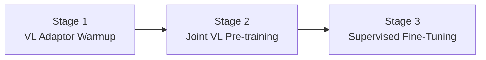

# DeepSeek-VL Analysis

**Source:** `raw/01_theory/01_models/deepseek/DeepSeek_VL-2403.05525.md`  
**Date Ingested:** 2026-04-21  
**Authors:** DeepSeek-AI  
**Published:** March 2024

---

## Overview

DeepSeek-VL is an open-source vision-language (VL) model designed for **real-world vision-language understanding**. Available in 1.3B and 7B sizes, it emphasizes practical applicability through three pillars: diverse and scalable data construction, efficient high-resolution architecture, and a training strategy that preserves language capabilities during multimodal development.

---

## Architecture

### Hybrid Vision Encoder

To balance high-resolution processing with token economy, DeepSeek-VL employs a **dual-encoder design**:

| Component | Resolution | Purpose | Output |
|-----------|-----------|---------|--------|
| **SigLIP-L** | 384 x 384 | High-level semantic features | 576 x 1024 |
| **SAM-B (ViTDet)** | 1024 x 1024 | Low-level detailed features | 64 x 64 x 256 |

**Fusion process**:
1. SAM-B output (64x64x256) is interpolated to 96x96x256
2. Two convolutional layers (stride=2) compress to 24x24x1024 → reshaped to 576x1024
3. Concatenated with SigLIP-L output: **576 visual tokens x 2048 dimensions**
4. GeLU activation + embedding projection to LLM input space

This compresses a 1024x1024 image into just **576 tokens**, enabling both rich visual representation and multi-turn inference efficiency.

### Vision-Language Adaptor

A two-layer hybrid MLP bridges vision encoders to the LLM:
- Layer 1: Separate single-layer MLPs for high-res and low-res features
- Layer 2: Concatenated features projected to LLM embedding space

### Language Model

Built on **DeepSeek LLM** (1B or 7B checkpoint):
- Pre-Norm with RMSNorm
- SwiGLU activation
- RoPE positional encoding
- Shared tokenizer with DeepSeek-LLM

---

## Data Construction

### Pre-Training Data

| Category | Datasets | Ratio |
|----------|----------|-------|
| Interleaved image-text | MMC4, Wikipedia, Wikihow, in-house textbooks | 13.1% |
| Image caption | Capsfusion, TaiSu, Detailed Caption | 11.1% |
| Table and chart | Chart2text, Geo170K, Unichart, ScienceQA, etc. | 2.1% |
| Web Code | Websight, Python plots from GitHub | 0.4% |
| Scene text OCR | ArT, MLT-17, LSVT, TextOCR, etc. | 1.2% |
| Document OCR | arXiv rendered markdown, e-books | 2.1% |
| **Text-only corpus** | **DeepSeek-LLM 2T corpus** | **70.0%** |

### Supervised Fine-Tuning Data

| Category | Sources | Ratio |
|----------|---------|-------|
| In-house taxonomy-based SFT | Real-world use cases | 10.5% |
| General multi-modality | ShareGPT4V, LAION-GPTV, LVIS-Instruct4V, etc. | 35.5% |
| Table and chart | Ureader, Geo170K, ScienceQA | 4.1% |
| Web Code | Screen-to-code, ScreenQA | 2.0% |
| **Text-only SFT** | **DeepSeek-LLM instruction data** | **47.9%** |

**Use case taxonomy** covers: Recognition, Conversion, Analysis, Commonsense Reasoning, Logical Reasoning, Evaluation, Multi-graph, and Safety.

---

## Training Pipelines

### Three-Stage Training

**Stage 1: VL Adaptor Warmup**
- Vision encoder and LLM **frozen**
- Only VL adaptor trained
- Data: 1.25M image-text captions (ShareGPT4V) + 2.5M Document OCR pairs
- Key finding: Scaling data beyond this at Stage 1 provides no benefit due to adaptor capacity limitations

**Stage 2: Joint Vision-Language Pre-training**
- Vision encoder **frozen**, LLM and adaptor **trainable**
- Critical challenge: Direct multimodal training causes catastrophic forgetting of language capabilities

**Modality warm-up strategy**:
- Start with heavy text emphasis
- Gradually increase vision-language data ratio
- Maintain **at least 70% text data** throughout to preserve language knowledge

This achieves balanced multimodal capability without language degradation.

**Stage 3: Supervised Fine-Tuning**
- SigLIP-L (low-res encoder), VL adaptor, and LLM are trainable
- SAM-B (high-res encoder) remains frozen
- Mixed VL chat data + pure language chat data

---

## Key Findings

### Language Preservation

Without language data mixing, multimodal metrics improve but language metrics decline sharply. With 70%+ text data:
- Language capability is preserved
- Multimodal performance is not significantly harmed

### Small-Scale Evaluation

For 1B model experiments (which cannot perform well on standard benchmarks):
- Switch evaluation from multiple-choice to **perplexity comparison of options**
- Mix small proportion of instruction data during pretraining
- This enables meaningful iteration before scaling to 7B

---

## Evaluation Highlights

DeepSeek-VL achieves state-of-the-art or competitive performance across vision-language benchmarks at comparable model sizes, while maintaining robust language-centric performance.

**Real-world capabilities demonstrated**:
- Web screenshot understanding
- PDF and document OCR
- Chart and table analysis
- Mathematical formula recognition
- Multi-turn visual dialogue
- Embodied intelligence (visual navigation)

---

## Related Pages

- [[10_deepseek_llm_analysis]] — Base language model (DeepSeek-LLM) architecture and training
- [[11_deepseek_v2_analysis]] — Successor language model with MLA and MoE
- [[15_deepseek_coder_analysis]] — Code model sharing training infrastructure

> [!note]
> The file `raw/01_theory/01_models/deepseek/DeepSeek_VL2-2412.10322.md` does not contain DeepSeek-VL2 content. It is an unrelated physics paper (arXiv:2412.10322v1, hep-lat) about SU(3) lattice gauge theory. A genuine DeepSeek-VL2 source was not found in the raw directory.

