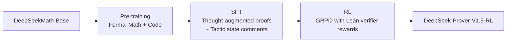

# DeepSeek-Prover-V1.5 Analysis

**Source:** `raw/01_theory/01_models/deepseek/DeepSeek_Prover-2408.08152.md`  
**Date Ingested:** 2026-04-21  
**Authors:** DeepSeek-AI  
**Published:** August 2024

---

## Overview

DeepSeek-Prover-V1.5 is an open-source language model for **formal theorem proving in Lean 4**, achieving new state-of-the-art results on miniF2F-test (**63.5%**) and ProofNet-test (**25.3%**). It introduces two key innovations:

1. **Truncate-and-resume mechanism**: Seamlessly integrates whole-proof generation with proof-step verification
2. **RMaxTS**: A Monte-Carlo tree search variant with intrinsic-reward-driven exploration for sparse-reward proof search

The model builds on DeepSeekMath-Base via pre-training, supervised fine-tuning with augmented formal data, and reinforcement learning from proof assistant feedback (RLPAF).

---

## Model Training Pipeline



### Stage 1: Pre-training

Further pre-train DeepSeekMath-Base on high-quality mathematics and code data, with emphasis on formal languages (Lean, Isabelle, Metamath).

**Result**: DeepSeek-Prover-V1.5-Base achieves 29.7% on miniF2F-test with 3-shot prompting.

### Stage 2: Supervised Fine-Tuning

**Data curation** (9,645K sequences):
- Sources: Mathlib4, DeepSeek-Prover-V1 synthetic theorems, Lean Workbook, miniF2F, ProofNet
- Expert iteration: generate → verify → retrain → regenerate

**Two data augmentation techniques**:

1. **Thought-augmented proof generation**: DeepSeek-Coder-V2 236B annotates natural language chain-of-thought comments before each Lean tactic, aligning formal proving with natural language reasoning.

2. **Tactic state prompt augmentation**: For each valid proof tactic, insert the Lean prover's tactic state as a comment:
```lean
/- tactic state: ... -/
```
During training, tokens after `/- tactic state:` are responses; preceding tokens are prompts.

**Training**: 9B tokens, batch size 2,048, LR $1 \times 10^{-4}$, 100 warm-up steps, max context 4,096.

**Result**: SFT model reaches 50.4% on miniF2F-test.

### Stage 3: Reinforcement Learning

**GRPO** with binary rewards from Lean 4 prover:
- Reward = 1 if proof verifies correctly
- Reward = 0 otherwise

**Prompt selection**: ~4.5K theorem statements where SFT model has moderate success rate (ensures both positive and negative examples in group sampling).

**Training**: LR $5 \times 10^{-6}$, KL penalty 0.02, group size 32, max length 2,048, batch size 512.

**Result**: RL model reaches 51.6% on miniF2F-test (single-pass, CoT mode).

---

## Truncate-and-Resume Mechanism

A unified approach bridging whole-proof generation and proof-step generation:

1. Model generates complete proof code following theorem statement
2. Lean prover verifies the proof
3. If error detected: **truncate** at first error, discard subsequent code
4. Append latest tactic state as comment to the successful prefix
5. **Resume** generation from truncated point

This mechanism enables:
- Intermediate tactic state feedback without sacrificing whole-generation efficiency
- Integration with tree search (truncation points scheduled by search policy)

---

## RMaxTS: Exploration-Oriented MCTS

### Tactic-Level Tree Abstraction

The proof search tree is constructed at **tactic granularity**:
- Each edge = single tactic state transition
- Whole proof decomposed into tactic sequence via Lean parser
- Truncation at earliest verification error creates tree nodes

### RMaxTS Algorithm

Addresses reward sparsity in proof search through **intrinsic motivation** (curiosity-driven exploration):

1. **RMax strategy**: Assigns intrinsic rewards to under-explored tactic states
2. Encourages diverse proof path generation
3. Balances exploitation of promising branches with exploration of novel states

Unlike standard MCTS that relies on rollout rewards, RMaxTS leverages the structure of formal verification to guide search.

---

## Evaluation

### miniF2F (High School Level)

| Model | Pass@1 | Pass@128 |
|-------|--------|----------|
| DeepSeek-Prover-V1 | 50.0% | — |
| DeepSeek-Prover-V1.5-SFT | 50.4% | — |
| DeepSeek-Prover-V1.5-RL | **51.6%** | **60.2%** |
| + RMaxTS Tree Search | — | **63.5%** |

### ProofNet (Undergraduate Level)

| Model | Pass@1 | Pass@128 |
|-------|--------|----------|
| DeepSeek-Prover-V1.5-RL | 18.2% | 23.7% |
| + RMaxTS Tree Search | — | **25.3%** |

### CoT vs Non-CoT

Chain-of-thought mode (with natural language reasoning comments) consistently outperforms non-CoT mode across all settings, demonstrating that structured mathematical thinking enhances formal proof generation.

---

## Key Insights

1. **RL genuinely enhances fundamental capabilities** in formal theorem proving (unlike natural language math where RL mainly boosts top-K selection)
2. **Natural language CoT alignment** significantly improves formal proof planning
3. **Sparse binary rewards** from formal verifiers are sufficient for effective RL when combined with GRPO
4. **Whole-proof + truncate-and-resume** offers computational efficiency of whole-generation with feedback precision of step-generation

---

## Related Pages

- [[17_deepseek_math_analysis]] — Base model (DeepSeekMath-Base) and GRPO algorithm origin
- [[16_deepseek_coder_v2_analysis]] — DeepSeek-Coder-V2 236B used for thought augmentation
- [[14_deepseek_r1_analysis]] — GRPO extensively used in DeepSeek-R1 pipeline
- [[11_deepseek_v2_analysis]] — GRPO adopted for general RL alignment

