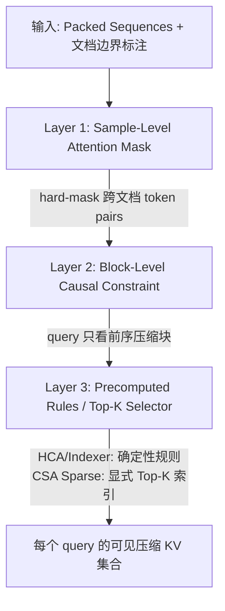

# DeepSeek-V4 Context Parallelism (CP) 深度分析

> **核对基线**: arXiv:**2606.19348v1** (DeepSeek-AI, **2026-04-26**) **§3.4.3**「Contextual Parallelism」  
> **作者**: DeepSeek-AI　**创建**: 2026-04-28（预发布稿）　**对正式版核对/订正**: 2026-06-25  
>
> [!note] 本页内容与正式版一致（引文如「retained in a buffer / sample-level attention masking / state-space model」均已核验）。
> **已订正章节号位移**：原稿沿用预发布编号（CP=§3.5.3、推理框架=§3.6.x），正式版因 FP4-QAT 移入后训练，§3 其后整体下移一位
> ——CP 现为 **§3.4.3**、推理框架 **§3.5/§3.5.1/§3.5.2**、Muon **§3.4.1**、mHC **§3.4.2**。详见 [[30_deepseek_v4_audit_analysis]]。

---

## 概述

DeepSeek-V4 的 Context Parallelism (CP) 在 §3.4.3 中提出，其核心挑战源于 **压缩注意力（CSA/HCA）与标准 CP 的不兼容性**。标准 CP 沿序列维度等分切分，每个 rank 持有连续的 $S/P$ 个 token。但 V4 的 CSA/HCA 对序列进行压缩，且训练数据使用 **packed sequences**（多文档拼接 + 独立压缩），导致压缩块边界与 CP 切分边界错位，以及各 rank 的压缩输出长度不可预测。

论文设计了两阶段通信方案来解决：Stage 1 用常数级 P2P 通信解决跨边界压缩问题，Stage 2 用 All-Gather 在压缩空间中完成全局收集，从而利用压缩率 $c$ 将主要通信量线性缩减 $1/c$ 倍。

---

## 1. 训练数据格式：Packed Sequences

### 1.1 数据构造方式

论文 §4.1 描述：

> "we pack documents from different sources into appropriate sequences to minimize sample truncation"
>
> "we employ **sample-level attention masking** during pre-training"

```
Packed input sequence (1M tokens):
┌──────────────┬────────┬──────────────────┬───────────┬──────┐
│  Doc A (论文) │ Doc B  │   Doc C (代码)    │  Doc D    │ ...  │
│   230K tokens │ 15K    │   500K tokens     │  180K     │      │
└──────────────┴────────┴──────────────────┴───────────┴──────┘
                    ↑ 每条文档独立压缩
```

### 1.2 独立压缩规则

§3.4.3 明确压缩规则：

> "each sequence is compressed independently by a factor of $c_s$ (or $c_h$), with any **trailing tokens fewer than $c_s$ being discarded**"

即每条文档独立压缩：
- CSA ($c_s=4$, 重叠窗口)：每 4 个 token → 1 个 compressed entry，尾部不足 4 个丢弃
- HCA ($c_h=128$, 无重叠)：每 128 个 token → 1 个 compressed entry，尾部不足 128 个丢弃

**训练时的尾部策略是直接丢弃**，与推理时不同（见 §5.3 对比）。

### 1.3 压缩窗口的跨文档隔离

关键约束：压缩操作**不会跨文档**。Doc A 的最后一个压缩块只使用 Doc A 内的 KV entries，不会混入 Doc B 的 token。这由 sample-level mask 在 attention 层面保证（见 §4）。

---

## 2. 标准 CP 面临的三个矛盾

CP 沿 sequence 维度等分切割，切割点无视文档边界和压缩块边界。

```
CP 等分切割 (P=2):
          CP Rank 0          │         CP Rank 1
  ───────────────────────────┼──────────────────────────
  [DocA][DocB前半]            │  [DocB后半][DocC][DocD...]
                             │
  问题① DocB跨两个rank        │  ② 压缩窗口可能跨CP边界
                             │  ③ 各rank压缩输出长度不同
```

### 矛盾 1：跨 rank 的文档被切断

Doc B 的 token 分布在不同 rank 上，但压缩要求 Doc B 的连续 KV entries 一起参与 softmax 归一化（公式 11/22）。任何一个 rank 都没有 Doc B 的全部 KV entries。

### 矛盾 2：压缩窗口跨 CP 边界

CSA 使用**重叠窗口**——公式 (11) 显示每个 compressed entry $\text{Comp}_k$ 需要来自 2 个连续位置的 KV entries。当压缩窗口跨越 CP 边界时：

```
Rank 0 末:  ... KV[k-2] KV[k-1] KV[k]
                                    │ CP boundary
Rank 1 首:  KV[k+1] KV[k+2] KV[k+3] ...

CSA 压缩 Comp_k 需要: KV[k-1], KV[k] ← Rank 0
                      KV[k+1], KV[k+2] ← Rank 1
                      ↑ 窗口跨越 CP 边界！
```

HCA 虽然无重叠窗口，但当 $c_h=128$ 的压缩块起始位置与 CP 切分边界不对齐时，同样需要跨 rank 收集。

### 矛盾 3：各 rank 压缩输出长度不一致

结合"独立压缩 + 尾部丢弃 + CP 切分不齐"三重效应，每个 rank 上的本地压缩 KV 长度是**不确定且不可预测的**，无法直接做 all-gather。

---

## 3. 两阶段通信方案

### 3.1 Stage 1：P2P 邻接交换（解决跨边界压缩）

**形式化描述**：

设 $c$ 为压缩率（CSA 中 $c=c_s=4$，HCA 中 $c=c_h=128$），$P$ 为 cp_size。

对于 rank $i \in \{0, 1, ..., P-1\}$：

```
Step 1 (Send):  rank_i 将其最后 c 个未压缩 KV entries 发送给 rank_{i+1}
                (环形拓扑: rank_{P-1} → rank_0)

Step 2 (Recv):  rank_i 从 rank_{i-1} 接收 c 个未压缩 KV entries

Step 3 (Compress): rank_i 将收到的 c 个 entries 与自己本地的前 c 个 entries
                   合并压缩，产生 1（CSA 重叠窗口）或 2（HCA 无重叠）个
                   boundary compressed entries
```

**关键性质**：
- 通信量为 $O(c \cdot n_{kv} \cdot d_h \cdot B)$，**与序列长度 $S$ 完全无关**，是常数级
- CSA 层 ($c=4$)：约 36 KB/rank（64 KV heads × 128 dim × 1.125B mixed precision）
- HCA 层 ($c=128$)：约 72 KB/rank（1 KV head × 512 dim × 1.125B mixed precision）

### 3.2 Stage 2：All-Gather 收集压缩 KV

**形式化描述**：

每个 rank 在 Stage 1 后拥有约 $\frac{S}{P \cdot c}$ 个本地压缩 KV entries。All-Gather 将所有 rank 的压缩 KV 收集到每个 rank：

```
All-Gather 输入:  每个 rank 的本地压缩 KV entries (~S/(P·c) 个)
All-Gather 输出:  每个 rank 获得完整压缩 KV (总长度 ≈ S/c，即 P × S/(P·c))

Fused Select-and-Pad 算子:
  - Select: 按 precomputed rules / sparse indices 筛选每个 query 的可见 entries
  - Pad: 将无效 padding entries 统一放到序列尾部
```

**通信量公式**（Ring All-Gather）：

$$
V_{\text{stage2}} = \frac{P-1}{P} \cdot \frac{S}{P \cdot c} \cdot n_{kv} \cdot d_h \cdot B
                  = \frac{(P-1) \cdot S \cdot n_{kv} \cdot d_h \cdot B}{P^2 \cdot c}
$$

### 3.3 总通信量与标准 CP 的对比

**标准 CP**（无压缩，直接 all-gather 全部 KV）：

$$
V_{\text{standard}} = \frac{P-1}{P} \cdot S \cdot n_{kv} \cdot d_h \cdot B
$$

**DeepSeek-V4 CP 的通信节省比**：

$$
\frac{V_{\text{V4}}}{V_{\text{standard}}} \approx \frac{1}{P \cdot c}
$$

**定量对比**（$S=1\text{M}, P=8, \text{BF16}$）：

| 层类型 | 压缩率 $c$ | All-Gather 通信量 (per rank) | vs 标准 CP |
|--------|-----------|----------------------------|-----------|
| 标准 CP | 1 | ~1.01 GB | 1× |
| CSA | 4 | ~19.7 MB | **~51× 减少** |
| HCA | 128 | ~493 KB | **~2048× 减少** |

> [!note]
> CSA 仅有 4× 压缩率，但后续的 Top-K 稀疏选择（Flash: $k=512$, Pro: $k=1024$）进一步减少了实际参与 core attention 的 KV 数量。CSA 的定位是「轻度压缩 + 稀疏选择」组合。

**总通信量公式**：

$$
V_{\text{total}} \approx \underbrace{c \cdot n_{kv} \cdot d_h \cdot B}_{\text{Stage 1 (常数)}} + \underbrace{\frac{(P-1) \cdot S \cdot n_{kv} \cdot d_h \cdot B}{P^2 \cdot c}}_{\text{Stage 2 (主导项)}}
$$

当 $S \gg P \cdot c^2$ 时，Stage 2 主导总通信量，压缩率 $c$ 以线性因子直接缩减。

---

## 4. 训练时 Sample 可见范围控制（三层机制）

§3.4.3 和 §4.1 共同描述了 query token 对 compressed KV 的可见性控制，从粗到细分为三层：

### 第一层：Sample-Level Attention Mask（§4.1）

在 attention logits 层面进行 hard-mask，**跨文档的 token 对直接设为 $-\infty$**：

```
Packed tokens:  [Doc A: pos 0-7] [Doc B: pos 8-12] [Doc C: pos 13-19]

Attention Mask (✓ = visible, ✗ = masked):
         Doc A (0-7)    Doc B (8-12)    Doc C (13-19)
Doc A  [  ✓ causal   │     ✗ all     │     ✗ all     ]
Doc B  [    ✗ all    │  ✓ causal    │     ✗ all     ]
Doc C  [    ✗ all    │    ✗ all     │  ✓ causal    ]
```

该 mask 对所有 attention 分支生效（Core CSA、Lightning Indexer、HCA、SWA）。

### 第二层：Block-Level 因果压缩约束（§2.3.3）

压缩后 attention 以**压缩块为原子单位**：

> "each query attends to only **preceding** compressed KV blocks"
>
> "a query **cannot access information from other tokens within its own compressed block**"

这意味着 query token 对其所在压缩块内的其他 token 也不可见（由 SWA 分支单独补偿本地依赖）。block 的文档归属是唯一且确定的——不会出现一个压缩块包含两个文档的 token。

### 第三层：Precomputed Rules + Top-K Selector（§3.4.3）

> **For HCA and the indexer in CSA**: "the visible range of compressed KV entries for each query token can be **precomputed by rules**"

预计算规则综合了：
- 文档边界位置（来自 sample-level mask）
- 压缩映射函数 $\text{block\_index} = \lfloor \text{token\_pos} / c \rfloor$
- 因果约束（block_index < query_block_index）

这是一个**纯确定性的映射**，不需要任何运行时计算或通信。

> **For the sparse attention in CSA**: "the **top-k selector explicitly specifies** the indices of visible compressed KV entries for each query"

Lightning Indexer 产生的 Top-K 选择索引天然受 sample-level mask 约束——indexer 计算 attention score 时同样被 mask，选出的 Top-K 索引不会跨越文档边界。

### 三层控制的数据流



**关键点**：文档边界、压缩映射、因果规则全部是输入序列的**静态属性**。每个 rank 可以独立、确定性地计算每个 query 的可见范围，**零额外通信**。

---

## 5. 完整示例：Packed Sequences × CP × 压缩

### 5.1 示例设定

```
输入: 20 tokens, 3 条文档
  Doc A: 8 tokens (pos 0-7)
  Doc B: 5 tokens (pos 8-12)
  Doc C: 7 tokens (pos 13-19)

CP: P=2 (2个rank)
CSA: c_s=4 (每4个token压缩为1个block, 重叠窗口)
```

### 5.2 压缩过程

```
Doc A (8 tokens):  floor(8/4) = 2 blocks → Comp[0], Comp[1], 无丢弃
Doc B (5 tokens):  floor(5/4) = 1 block  → Comp[2], tail 1 token 丢弃(pos 12)
Doc C (7 tokens):  floor(7/4) = 1 block  → Comp[3], tail 3 tokens 丢弃(pos 17-19)

压缩后总计: 4 个 compressed blocks, 覆盖原始 16 个 token
```

### 5.3 CP 切分与冲突

```
CP 等分 (20/2=10 tokens per rank):
  Rank 0: pos [0, 9]   → Doc A 完整 (0-7) + Doc B 前半 (8-9)
  Rank 1: pos [10, 19] → Doc B 后半 (10-12) + Doc C (13-19)

冲突: Doc B 的 5 个 token 被切成两半
  Rank 0 有 2 个 (8-9), Rank 1 有 3 个 (10-12)
  任何一边都凑不齐 c_s=4, 无法独立完成压缩！
```

### 5.4 两阶段解决

**Stage 1**: Rank 0 → Rank 1: 发送 tokens {8,9}（Doc B 的前半部分）

Rank 1 现在拥有 Doc B 的完整 5 个 tokens，可以压缩：
- Doc B tokens {8,9,10,11,12} → Comp[2]（1 个完整块，丢弃 1 个尾部）
- Doc C tokens {13,14,15,16} → Comp[3]

**Stage 2**: All-Gather 收集所有 Comp[0..3]，每个 rank 获得完整压缩 KV。

**可见性**（以 Comp[1] 的 query 为例，属于 Doc A）：

```
可见: Comp[0] (同 Doc A, 前序 block)
屏蔽: Comp[2] (Doc B, sample-level mask ✗)
屏蔽: Comp[3] (Doc C, sample-level mask ✗)
屏蔽: Comp[1] 自身 (因果约束)
```

---

## 6. 推理侧尾部 Token 处理（三种策略）

§3.4.3 描述的是**训练时的 CP**。推理侧（§3.5）对尾部不完整压缩块的 token 采用了不同策略。

### 6.1 策略对比

| 场景 | 尾部不足 $c$ 个 token 的处理 | 依据 |
|------|--------------------------|------|
| **训练 CP（§3.4.3）** | **丢弃（Discard）**——batch 内多条序列，尾部丢弃对训练影响可忽略 | "any trailing tokens ... being **discarded**" |
| **推理在线 State Cache（§3.5.1）** | **缓存（Buffer）**——保留为未压缩 KV state，等凑够 $c$ 个再压缩，移入 Classical KV Cache | "pending tokens ... must be **retained in a buffer**" |
| **推理磁盘前缀复用（§3.5.2）** | **重计算（Recompute）**——落盘只存完整压缩块；尾部不完整块命中时重算 | "we still need to **recompute** them to restore the uncompressed KV entries" |

### 6.2 State Cache 机制（§3.5.1）

推理在线服务时，KV Cache 分为两个物理区域（Figure 6）：

```
┌──────────────────────────────────────────────────┐
│               State Cache                        │
│  ┌────────────┬──────────────────────────────┐   │
│  │  SWA KV    │  Uncompressed KV State        │   │
│  │ (最近win个) │ (CSA/HCA 尾部未就绪 token)     │   │
│  └────────────┴──────────────────────────────┘   │
└──────────────────────────────────────────────────┘
┌──────────────────────────────────────────────────┐
│            Classical KV Cache                    │
│  ┌─────────────────┬────────────────────────┐    │
│  │    CSA KV       │       HCA KV            │    │
│  │  (已压缩 block)  │     (已压缩 block)       │    │
│  └─────────────────┴────────────────────────┘    │
│  Block size = lcm(c_s, c_h) 的原生 token          │
└──────────────────────────────────────────────────┘
```

论文将 State Cache 中的未压缩尾部 token 视为一种 **SSM (State-Space Model)** 状态：

> "it is reasonable to treat it, along with the uncompressed tail tokens from the compression branch, as a **state-space model**. The corresponding KV cache can thus be regarded as a **sequence-specific state** that depends solely on the current position."

**核心区别**：这不是 padding——它是存储**有意义的未压缩 KV**，等待累积够 $c$ 个 token 后执行压缩并移入 Classical KV Cache。与训练时"直接丢弃"有本质不同。

---

## 7. CSA 重叠窗口对 CP 边界的额外影响

### 7.1 重叠压缩公式

CSA 的压缩使用重叠窗口（公式 11）：每个 compressed entry $\text{Comp}_k$ 由位置 $[m(k-1), m(k+1)-1]$ 的 2 个 KV entries 组合而成，via softmax normalization across $2m$ elements：

$$
[S_a; S_b] = \text{Softmax}_{\text{row}}([Z_a + B_a; Z_b + B_b])
$$

$$
C_k^{\text{Comp}} = \sum_{j=mk}^{m(k+1)-1} S_j^a \odot C_j^a + \sum_{j=m(k-1)}^{mk-1} S_j^b \odot C_j^b
$$

### 7.2 对 CP 边界的影响

重叠窗口意味着压缩块 $\text{Comp}_k$ 需要来自**两个相邻压缩窗口**的 KV entries。当 $k$ 恰好是 CP 边界上的第一个压缩块时：

- 需要 Rank $i-1$ 的末段 KV（位置 $m(k-1)$ 到 $mk-1$）
- 需要 Rank $i$ 的前段 KV（位置 $mk$ 到 $m(k+1)-1$）

Stage 1 的 P2P 发送 $c_s=4$ 个未压缩 KV 恰好覆盖这个重叠窗口的需求。对于 HCA（无重叠），Stage 1 同样发送 $c_h=128$ 个未压缩 KV 来补全跨边界的压缩块。

注意：Stage 1 发送的是**未压缩 KV**（不是压缩后的 entry），因为压缩操作需要原始 KV entries 来计算 softmax 权重和加权和。

---

## 8. 通信-计算重叠

虽然 §3.4.3 本身未详细讨论重叠，但结合 §3.4.1（EP 细粒度重叠）和 §3.4.2（mHC DualPipe 调度）可以推断 CP 通信的重叠策略：

- Stage 1 的 P2P 可与本地压缩计算的开始部分重叠
- Stage 2 的 All-Gather 可与后续层的计算形成 DualPipe 流水线
- mHC 的 6.7% wall-time 开销验证了框架的重叠能力

---

## 9. 实现细节

### 9.1 Fused Select-and-Pad 算子

Stage 2 All-Gather 后，每个 rank 收到 $(s/m + 1) \times P$ 个压缩条目（含每个 rank 的 1 个 padding）。Select-and-Pad 算子：

1. **Select**：从每个 rank 贡献的条目中取前 $s/m$ 个有效条目
2. **Concat**：将所有 rank 的有效条目拼接为完整压缩 KV
3. **Pad**：将剩余 padding 条目统一放到尾部

```
All-Gather 输入 (P=4, s/m=2):
  Rank0: [KV_0^0, KV_0^1, pad_0]  (s/m+1=3)
  Rank1: [KV_1^0, KV_1^1, pad_1]
  Rank2: [KV_2^0, KV_2^1, pad_2]
  Rank3: [KV_3^0, KV_3^1, pad_3]

Select-and-Pad 输出:
  [KV_0^0, KV_0^1, KV_1^0, KV_1^1, KV_2^0, KV_2^1, KV_3^0, KV_3^1, pad_0, pad_1, pad_2, pad_3]
  ├───── 有效 compressed KV (P·s/m = 8) ─────┤├──── padding (4) ────┤
```

Fused 实现将选择、拼接、padding 合并为一个 kernel，避免中间数据拷贝，保证确定性。

### 9.2 Top-K Selector 的索引指定

CSA Sparse Attention 中，Top-K Selector 为每个 query 显式指定可见压缩 KV 索引：

```
Input:
  compressed KV: [KV_comp_0, KV_comp_1, ..., KV_comp_{N-1}]
  
Output (per query):
  top-k indices: [idx_0, idx_1, ..., idx_{k-1}]  # 全局索引,可跨 rank
  
Example (query at global position 20, k=8):
  visible: [0, 1, 2, 3, 4, 5, 6, 7]  # 前序压缩块
```

选择结果天然受 sample-level mask 约束——indexer 计算 attention score 时同样被 mask，不会选出跨文档边界的索引。

### 9.3 与传统 CP 对比

| 特性 | 传统 CP | DeepSeek-V4 CP |
|------|---------|---------------|
| 序列分区 | 连续 token | 连续 token |
| 压缩支持 | 不支持 | CSA/HCA |
| 通信量 | 全量 KV All-Gather | $O(c)$ P2P + 压缩后 All-Gather |
| 长度一致性 | 天然一致 | 通过 padding 保证 |
| 跨边界处理 | 不需要 | Stage 1 尾部 token 转发 |
| 可见范围 | 简单因果 | 三层预计算规则 + 显式索引 |

> 完整伪代码与数据流追踪见 `raw/01_theory/01_models/deepseek/DeepSeek_V4_Contextual_Parallelism.md（AI 辅助补充笔记，非论文）`。

---

## 核心结论

1. **CP 适配 packed sequences 的本质**：通过 Stage 1 的 $O(c)$ 常数 P2P 解决压缩窗口跨 CP 边界问题，使压缩后的 all-gather 成为可能
2. **通信节省**：压缩率 $c$ 直接线性缩减 all-gather 通信量（CSA: 4×，HCA: 128×）
3. **可见性控制**：三层机制（sample mask → block causal → precomputed rules/Top-K），全部静态可计算，零通信
4. **训练 vs 推理**：尾部 token 处理策略不同（丢弃 vs State Cache vs 重计算），反映不同场景的 trade-off

---

## 相关页面

- [[13_deepseek_v4_analysis]] — DeepSeek-V4 整体架构分析
- [[24_deepseek_v4_fp4_qat_analysis]] — FP4 量化感知训练分析
- [[12_deepseek_v3_analysis]] — V3 的 MLA、FP8 训练、DualPipe
- [[11_deepseek_v2_analysis]] — MLA 起源（低秩 KV 压缩）、DeepSeekMoE
- [[25_mhc_analysis]] — 流形约束超连接深度解析
- [[14_deepseek_r1_analysis]] — GRPO 推理训练

**框架实现（Megatron-LM 源码级，与本页论文算法对照）**：
- [[35_deepseek_v4_context_parallel_analysis]] — **V4 CP 的 Megatron 实现**：进程组拓扑、四种通信类型、Native/TE CP、以及本页论文设计在代码中的 gap（如压缩 KV all-gather 尚未实现）
- [[34_deepseek_v4_tensor_parallel_analysis]] — V4 TP=1 切分实现（CSA/HCA/mHC/MoE 的切分约束）
- [[02_engineering/02_train_frameworks/megatron-lm/17_megatron_parallelism_orchestration_analysis]] — Megatron-LM 5D 并行编排与进程组构造（含标准 CP）
- [[02_engineering/02_train_frameworks/megatron-lm/20_megatron_comm_overlap_analysis]] — 通信重叠分析
