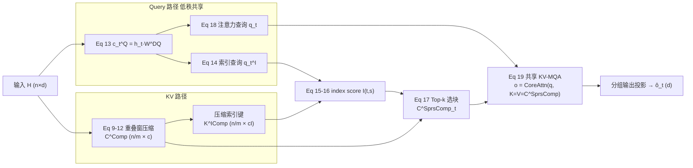

# DeepSeek-V4 注意力深潜：CSA vs HCA vs DSA vs MLA

> **核对基线**: arXiv:**2606.19348v1**「DeepSeek-V4: Towards Highly Efficient Million-Token Context Intelligence」, DeepSeek-AI, 提交 **2026-04-26**　＝ `raw/01_theory/01_models/deepseek/DeepSeek_V4.pdf`
> **维度**: Deep Dive（注意力机制纵向对比）　**对正式版核对 / 整页重写**: 2026-06-25
>
> 本页是 [[13_deepseek_v4_analysis|V4 总体架构]] 注意力章节的**专题深潜**：把 V4 的两条注意力分支 **CSA**（压缩 + 稀疏）与 **HCA**（重度压缩、不稀疏）逐方程拆开，并与 **DSA（V3.2 起源的稀疏选择）**、**MLA（V2 起源的低秩潜在 KV）** 做"动机→机制→证据→为何不选替代"的横向对比。核心论点：**V4 的范式从 MLA 的"压缩每 token 的 KV 通道维"转向"在序列维合并 token"（CSA `1/m` / HCA `1/m′`），CSA 再在已压缩的块上套 DSA top-k**；正是这一序列维压缩让百万 token 上下文在工程上可行（§2.3, p9）。
>
> 本页对预发布期 AI 臆造旧稿的**整页重写**（旧稿裁决见 [[30_deepseek_v4_audit_analysis]]）。已剔除旧稿全部臆造内容（"DSA=CSA+HCA"倒置、"Highly"误名、HCA"10%"、分层压缩调度、MoE 任务路由、DualPath、O(n log n) 等均不见于论文）。

---

## 1. 概述

**主线**：长上下文里注意力是 FLOPs 与 KV-cache 的双重瓶颈（§2.3 开篇，p9）。V4 不再走 MLA 的单条"低秩潜在 KV"路线，而是设计**两种序列维压缩的注意力并交错堆叠（hybrid）**：

- **CSA（Compressed Sparse Attention，§2.3.1, Fig 3, p9–11）**：先把每 `m` 个 token 的 KV 压成 1 个 entry（重叠窗，`1/m`），再用 **DSA lightning indexer** 在压缩块上选 top-k —— 压缩 + 稀疏双管齐下。
- **HCA（**Heavily** Compressed Attention，§2.3.2, Fig 4, p11–12）**：以更大的 `m′ (≫m)` 做**更重**的压缩（`1/m′`，**无重叠窗**），**不做稀疏**，对所有前序压缩块做 dense MQA。

> [!important] 三条 V4 论文事实，旧稿全错，本页据正式版订正：
> ① **hybrid = CSA + HCA 交错**（§2.3, p9）；**DSA 不是与 CSA/HCA 并列的机制**，而是 **CSA 内部的 top-k 选择步骤**（§2.3.1 Eq 16–17）；**HCA 不含任何稀疏选择**（§2.3.2, p11："does not employ sparse attention"）。
> ② HCA 全称是 "**Heavily** Compressed Attention"（§2.3.2 标题，p11），不是 "Highly"。
> ③ HCA 压缩率是 `1/m′` 且 **m′=128**（§4.2.1, p24–25），不是"保留 10%"。
> ④ **MLA 由 DeepSeek-V2 引入**（[[11_deepseek_v2_analysis]] §MLA），**V4 不使用 MLA**——它是 V4 要替换的基线。
> ⑤ 论文**无**按层深的压缩调度表、**无** MoE 任务类型动态路由、**无** "DualPath"/"O(n log n)"——这些均为旧稿臆造。

**四机制速览**（详表见 §7）：

| 机制 | 出处 | 一句话 |
|------|------|--------|
| **MLA** | V2 引入（[[11_deepseek_v2_analysis]]）；V3/V3.2 沿用 | 把每 token 的 KV 压到一个低秩潜在向量 `c_t^{KV}`（通道维压缩），仍对**全部** token 做 dense attention。V4 不用。 |
| **DSA** | V3.2 引入（V4 §2.3.1 引 DeepSeek-AI, 2025） | lightning indexer 给每个 query 算 index score，对**未压缩 token** 选 top-k。 |
| **CSA** | V4 §2.3.1 | 序列维重叠压缩 `1/m` → 在压缩块上跑 DSA top-k → 共享 KV-MQA + 分组输出投影。 |
| **HCA** | V4 §2.3.2 | 序列维**重压** `1/m′`（无重叠、无 top-k）→ 共享 KV-MQA + 分组输出投影。 |

数据流（不含跨页链接，仅示意）：

```
                 ┌──────────────── V4 Hybrid Attention（逐层交错） ────────────────┐
 hidden H ──┬──► CSA 层 :  压缩 1/m(重叠2m) ─► Lightning Indexer top-k ─► 共享KV-MQA ─► 分组输出投影 ─► ô
            │                                   (DSA：仅在 CSA 内部)
            └──► HCA 层 :  压缩 1/m'(无重叠) ─────────(无稀疏)──────────► 共享KV-MQA ─► 分组输出投影 ─► ô
   两条分支都额外挂： Q/KV RMSNorm · Partial RoPE(末64维, 输出位置 -i) · SWA(n_win=128) · Attention Sink
```

---

## 2. 为什么要混合注意力（动机）

**论文给出（§2.3, p9）**："As the context length reaches extreme scales, the attention mechanism emerges as the dominant computational bottleneck in a model." 在百万 token 量级，注意力同时撑爆两个预算：

- **KV-cache 内存** —— 标准注意力按 `O(序列长度)` 线性囤 KV；1M token 时 cache 体量是部署的硬约束。
- **注意力 FLOPs** —— 每个新 token 都要对历史做点积，长上下文下成为单 token 推理的主导项。

**为何不靠 MLA 单条路线（why-not-the-alternative）**：MLA（V2 引入）只压**通道维**（把每 token 的 KV 投到低秩潜在 `c_t^{KV}`），序列维仍是满的——KV 条目数随上下文线性增长，1M token 下依旧偏大。论文给出的对照基线即说明问题：以 **BF16 GQA8（head-dim 128）** 为基线，V4 的 KV cache 在 1M 上下文下可降到约 **2%**（§2.3.4, p13）——这种量级的削减只能来自**序列维**的合并（`1/m`、`1/m′`），而非通道维压缩。

**为何要"两种"而不是一种**：CSA 保精度（轻压 `1/m=1/4` + top-k 选关键块）、HCA 保极致省（重压 `1/m′=1/128`）。把二者**交错**（§2.3, p9）让模型在"信息保真"与"长程效率"之间分层取舍；论文以二者的混合配置作为"使百万 token 上下文在实践中可行"的关键（§2.3 开篇，Fig 3 caption p9）。具体交错策略见 [[13_deepseek_v4_analysis]]（Flash 前 2 层纯 SWA、Pro 前 2 层 HCA，其余 CSA/HCA 交错，§4.2.1）。

> 头条收益（§1 / Figure 1, p5，相对 V3.2 @1M）：**V4-Pro = 27% 单 token FLOPs、10% KV cache**；**V4-Flash = 10% FLOPs、7% KV cache**。

---

## 3. CSA 完整机制（§2.3.1, Figure 3, p9–11）

CSA = **重叠窗序列压缩** → **DSA 稀疏选择** → **共享 KV-MQA** → **分组输出投影**，四步串联。



### 3.1 重叠窗 KV 压缩（Eq 9–12）

设输入隐状态 $H\in\mathbb{R}^{n\times d}$。CSA 先算两路 KV 与两路压缩权重（$c$ 为头维）：

$$
C_a = H W_a^{KV},\quad C_b = H W_b^{KV}\tag{Eq 9}
$$
$$
Z_a = H W_a^{Z},\quad Z_b = H W_b^{Z},\qquad W_a^{KV},W_b^{KV},W_a^{Z},W_b^{Z}\in\mathbb{R}^{d\times c}\tag{Eq 10}
$$

每 `m` 个 entry 压成 1 个，softmax 跨 **2m** 个元素归一（两路各 `m` 个），并加可学习位置偏置 $B_a,B_b\in\mathbb{R}^{m\times c}$：

$$
[\,S^a_{mi:m(i+1)-1};\,S^b_{m(i-1):mi-1}\,]=\mathrm{Softmax_{row}}\big([\,Z^a_{mi:m(i+1)-1}+B_a;\,Z^b_{m(i-1):mi-1}+B_b\,]\big)\tag{Eq 11}
$$
$$
C^{Comp}_i=\sum_{j=mi}^{m(i+1)-1} S^a_j\odot C^a_j \;+\; \sum_{j=m(i-1)}^{mi-1} S^b_j\odot C^b_j,\qquad C^{Comp}\in\mathbb{R}^{\frac{n}{m}\times c}\tag{Eq 12}
$$

**论文给出（p10）**：$\odot$ 是 Hadamard 积；$i=0$ 时 $Z^b_{m(i-1):mi-1}$ 用 $-\infty$ 填充、$C^b$ 用 0 填充。每个 $C^{Comp}_i$ 看似来自 **2m** 个原始 entry，但 $C^{Comp}_i$ 用到的 $C^b$ 索引区间与 $C^{Comp}_{i-1}$ 用到的 $C^a$ 索引区间**重叠**——所以净压缩率**恰好是 `1/m`**，而非 `1/2m`（p10 末句明示）。

```
原始 token:  0  1  2  3 | 4  5  6  7 | 8  9 10 11 | 12 13 14 15      (m=4)
C^Comp[0] ◄── C_a:0..3
C^Comp[1] ◄── C_a:4..7   + C_b:0..3   ← 这段 C_b 与 Comp[0] 的 C_a 同窗(重叠)
C^Comp[2] ◄── C_a:8..11  + C_b:4..7
C^Comp[3] ◄── C_a:12..15 + C_b:8..11
净效果: 16 token → 4 个压缩 entry = 1/m, 每 entry 跨窗融入相邻块以软化块边界
```

**为何重叠窗（why-not 硬切块）**：硬切块会在块边界产生信息断裂；重叠窗让每个压缩 entry 携带相邻块信息，缓解边界损失，同时靠"索引重叠"把真实压缩率压回 `1/m`（p10）。

### 3.2 Lightning Indexer：DSA 稀疏选择（Eq 13–17）

压缩完，CSA 对压缩块套 **DSA**（§2.3.1 引 DeepSeek-AI, 2025）。先用与 $C^{Comp}$ 相同的压缩算子得到压缩索引键 $K^{IComp}\in\mathbb{R}^{\frac{n}{m}\times c_I}$（$c_I$ 为 indexer 头维）。indexer 查询走**低秩**路径：

$$
c^Q_t = h_t W^{DQ}\tag{Eq 13}
$$
$$
[\,q^I_{t,1};\dots;q^I_{t,n^I_h}\,]=q^I_t = c^Q_t W^{IUQ},\qquad W^{DQ}\in\mathbb{R}^{d\times d_c},\ W^{IUQ}\in\mathbb{R}^{d_c\times c_I n^I_h}\tag{Eq 14}
$$

index score（因果约束 $s<\lfloor t/m\rfloor$，即只看前序压缩块）：

$$
[\,w^I_{t,1};\dots;w^I_{t,n^I_h}\,]=w^I_t = h_t W^{w},\qquad W^{w}\in\mathbb{R}^{d\times n^I_h}\tag{Eq 15}
$$
$$
I_{t,s}=\sum_{h=1}^{n^I_h} w^I_{t,h}\cdot \mathrm{ReLU}\!\big(q^I_{t,h}\cdot K^{IComp}_s\big)\tag{Eq 16}
$$

top-k 选出参与 core attention 的压缩块子集：

$$
C^{SprsComp}_t=\big\{\,C^{Comp}_s \;\big|\; I_{t,s}\in\mathrm{Top\text{-}k}(I_{t,:})\,\big\}\tag{Eq 17}
$$

**配置（§4.2.1, p24–25）**：$n^I_h=64$、$c_I=128$（Flash/Pro 相同）；top-k 取 **512（Flash）/ 1024（Pro）** 个压缩 entry。

**与 V3.2 DSA 的关键差别**：V3.2 的 DSA 对**未压缩 token**选 top-k；V4 的 DSA 跑在 **CSA 已压缩的 `n/m` 个块**上（Eq 17 的候选是 $C^{Comp}_s$），选择空间小了 `m` 倍，故 top-k 也可比 V3.2 更小（§2.3.4, p13："a smaller attention top-k is chosen"）。

### 3.3 共享 KV-MQA（Eq 18–19）

被选中的压缩 entry 以 **MQA**（Shazeer, 2019）方式**同时充当 key 和 value**。注意 query 走的低秩潜在 $c^Q_t$ **与 indexer 查询共享**（§2.3.1, p11）：

$$
[\,q_{t,1};\dots;q_{t,n_h}\,]=q_t = c^Q_t W^{UQ},\qquad W^{UQ}\in\mathbb{R}^{d_c\times c\,n_h}\tag{Eq 18}
$$
$$
o_{t,i}=\mathrm{CoreAttn}\big(\text{query}=q_{t,i},\ \text{key}=C^{SprsComp}_t,\ \text{value}=C^{SprsComp}_t\big)\tag{Eq 19}
$$

> [!note] 这里的低秩潜在 $c^Q_t$ 只压缩 **query**，且被 indexer 与主注意力两处复用——和 MLA 压缩 **KV** 是两回事。V4 把"低秩"用在 query 上，"序列压缩"用在 KV 上。

### 3.4 分组输出投影

**论文给出（p11）**：V4 配置里 $c\,n_h$ 很大，直接把 $o_t\in\mathbb{R}^{c\,n_h}$ 投回 $d$ 维开销过大。于是把 $n_h$ 个头输出切成 $g$ 组，每组 $o^G_{t,i}\in\mathbb{R}^{c\,n_h/g}$ 先投到中间维 $d_g\ (<c\,n_h/g)$，再把 $g$ 组拼接 $[\,o^{G'}_{t,1};\dots;o^{G'}_{t,g}\,]\in\mathbb{R}^{d_g g}$ 投到最终输出 $\hat o_t\in\mathbb{R}^d$。

**配置（§4.2.1）**：$n_h=64$（Flash）/ 128（Pro）；$c=512$；$d_c=1024/1536$；$g=8/16$；$d_g=1024$。

### 3.5 维度走查（V4-Pro，1M token）

下表把 §4.2.1 的 Pro 配置代入 Eq 9–19 的维度，体感 CSA 各步张量形状（**形状取自方程定义；条目数/块数为据此推断的算术**，$m{=}4$、top-k${=}1024$、$n{=}10^6$）：

| 步骤 | 张量 / 含义 | 形状（Pro） | 条目数 @ 1M |
|------|------|------|------|
| 输入 | $H$ | $\mathbb{R}^{n\times d},\ d{=}7168$ | $10^6$ token |
| Eq 9–12 | 压缩 KV $C^{Comp}$ | $\mathbb{R}^{(n/m)\times c},\ c{=}512$ | $\approx 2.5\times10^5$ 块（`1/4`） |
| Eq 13–16 | 索引键 $K^{IComp}$ / 查询 $q^I_t$ | $c_I{=}128,\ n^I_h{=}64$ | 对 $2.5\times10^5$ 块算 score |
| Eq 17 | 选中块 $C^{SprsComp}_t$ | top-k 子集 | **1024 块/query** |
| Eq 18 | 注意力查询 $q_t$ | $n_h{=}128$ 头 $\times\ c{=}512$ | 共享 $c^Q_t\in\mathbb{R}^{d_c},\ d_c{=}1536$ |
| Eq 19 | 头输出 $o_{t,i}$ | $\mathbb{R}^{c}=\mathbb{R}^{512}$ | + SWA 128 + sink |
| 分组投影 | $\hat o_t$ | $\mathbb{R}^{d}=\mathbb{R}^{7168}$ | $g{=}16,\ d_g{=}1024$ |

要点：每个 query 的 core attention 实际只面对 **top-k(=1024) 压缩块 + SWA(=128) 未压缩 entry**，而非全部 $10^6$ token——这是 FLOPs 与 KV 双降的来源。（HCA 对照：$m'{=}128$ → $10^6$ token 仅 $\approx 7.8\times10^3$ 块，且**全部**参与 dense MQA，无 top-k。）

---

## 4. HCA（§2.3.2, Figure 4, p11–12）

**论文给出（p11）**："compresses the KV cache in a heavier manner, but **does not employ sparse attention**." 压缩策略大体同 CSA，但 **`m′ (≫m)` 更大、且不做重叠压缩**：

$$
C = H W^{KV},\qquad Z = H W^{Z},\qquad W^{KV},W^{Z}\in\mathbb{R}^{d\times c}\tag{Eq 20–21}
$$
$$
S_{m'i:m'(i+1)-1}=\mathrm{Softmax_{row}}\big(Z_{m'i:m'(i+1)-1}+B\big),\qquad B\in\mathbb{R}^{m'\times c}\tag{Eq 22}
$$
$$
C^{Comp}_i=\sum_{j=m'i}^{m'(i+1)-1} S_j\odot C_j,\qquad C^{Comp}\in\mathbb{R}^{\frac{n}{m'}\times c}\tag{Eq 23}
$$

序列长度被压到 `1/m′`。随后同样是**共享 KV-MQA + 分组输出投影**，但因为**没有 indexer、没有 top-k**，每个 query 对**所有**前序压缩块做 dense MQA：

$$
c^Q_t = h_t W^{DQ},\qquad q_t = c^Q_t W^{UQ}\tag{Eq 24–25}
$$
$$
o_{t,i}=\mathrm{CoreAttn}\big(\text{query}=q_{t,i},\ \text{key}=C^{Comp},\ \text{value}=C^{Comp}\big)\tag{Eq 26}
$$

**配置（§4.2.1）**：**m′=128**（Flash/Pro 相同）。

**为何 HCA 不再叠 DSA（why-not）**：HCA 已把序列压到 `1/128`，压缩块总数本就极少（1M token → ~7.8K 块），再对这么短的序列选 top-k 收益甚微、还引入 indexer 开销；论文的设计取舍是"重压到 dense 直接可承受就别再稀疏"（§2.3.2, p11）。CSA 反过来——轻压 `1/4` 后块数仍多（1M → 250K 块），所以才需要 top-k 把它压到 `512/1024` 个块（§2.3.1）。

---

## 5. 其他细节（§2.3.3, p12–13）

这四项 **CSA 与 HCA 都用**（§2.3.3 开篇明确二者共享）。

**(a) Query / KV 归一化（p12）**：core attention 前，对 query 的每个头、压缩 KV 的那一个头各做一次 **RMSNorm**。作用：避免 attention logits 爆炸、提升训练稳定性。（也是 Muon 里**不需要 QK-Clip** 的原因，§2.4, p14。）

**(b) 部分 RoPE（Partial RoPE，p13）**：对 query / KV entry 各自的**最后 64 维**施加 RoPE。由于压缩 KV 同时充当 key 与 value，naive 输出 $\{o_{t,i}\}$ 会携带**绝对**位置；作为对策，对每个 $o_{t,i}$ 的最后 64 维再施加**位置 $-i$** 的 RoPE，使输出携带**相对**位置——每个 KV entry 对输出的贡献与"query 到该 entry 的距离"挂钩。

**(c) 滑窗注意力分支（SWA，p13）**：因严格因果性，query 看不到**自己所在压缩块内**的 token，而近邻 token 往往最相关。于是每个 query 额外产生 $n_{win}$ 个**未压缩**的近邻 KV entry，与压缩 KV 一起进 core attention。**$n_{win}=128$**（§4.2.1，Flash/Pro 相同）。

**(d) Attention sink（Eq 27, p13）**：每头设可学习 sink logit $z'_h$，把 $\mathrm{Exp}(z'_h)$ 加到注意力分母：

$$
s_{h,i,j}=\frac{\mathrm{Exp}(z_{h,i,j})}{\sum_k \mathrm{Exp}(z_{h,i,k})+\mathrm{Exp}(z'_h)}\tag{Eq 27}
$$

效果：每头的注意力总分**不必等于 1**，甚至可接近 0——让头能"选择不关注"，缓解超长上下文下的注意力分配问题。

---

## 6. 效率（§2.3.4, p13）

混合 CSA/HCA 之外，V4 再叠低精度存储与计算，把注意力 FLOPs 与 KV-cache 一起压下来：

1. **混合精度 KV 存储**：RoPE 维用 **BF16**，其余维用 **FP8** → KV cache 比纯 BF16 **减半（~½）**（p13）。
2. **FP4 indexer**：lightning indexer 的注意力计算用 **FP4** 精度，加速超长上下文下的注意力算子（p13）。（FP4 QAT 的完整框架——MoE 权重 + CSA indexer QK 路径走 FP4、索引分数另走 FP32→BF16——属后训练 §5.2.1，详见 [[24_deepseek_v4_fp4_qat_analysis]]。）
3. **更小的 top-k**：相对 V3.2 取**更小的 attention top-k**（512/1024），改善中短文本上的效率（p13）。
4. **压缩本身**：CSA/HCA 的序列压缩是 KV 与 FLOPs 削减的主因（p13 "most importantly"）。

**量级证据（p13）**：以 **BF16 GQA8（head-dim 128）** 为基线，V4 在 **1M 上下文**下 KV cache 可降到约 **2%**。
**头条（§1 / Fig 1, p5，相对 V3.2 @1M）**：V4-Pro **27% FLOPs / 10% KV**；V4-Flash **10% FLOPs / 7% KV**。

> [!note] 「2%」是相对 **GQA8 基线**；「10%/7% KV、27%/10% FLOPs」是相对 **V3.2** ——两组数字基线不同，勿混用。

---

## 7. 四机制对比表（CSA / HCA / DSA / MLA）

| 维度 | **CSA**（V4 §2.3.1） | **HCA**（V4 §2.3.2） | **DSA**（V3.2 起源；V4 内嵌于 CSA） | **MLA**（V2 起源；V4 不用） |
|------|------|------|------|------|
| **压缩维度** | 序列维：每 `m` token→1 entry，**重叠窗 2m** | 序列维：每 `m′` token→1 entry，**无重叠** | 不压缩（对原始/未压缩 token 做选择） | **通道维**：每 token 的 KV 压成低秩潜在 `c_t^{KV}` |
| **是否稀疏** | **是**（DSA top-k，Eq 16–17） | **否**（对所有压缩块 dense MQA，Eq 26） | **是**（lightning indexer top-k） | **否**（full dense attention） |
| **压缩率** | `1/m`，**m=4**（§4.2.1） | `1/m′`，**m′=128**（§4.2.1） | 1（不压序列，只选 top-k） | 序列维 1；KV≈`9·d_h·l`（[[11_deepseek_v2_analysis]]） |
| **是否用 indexer** | **是**（共享低秩 query `c_t^Q`，Eq 13–16） | **否** | **是**（lightning indexer，原始 token 粒度） | 否 |
| **适用层** | 与 HCA 交错的常规层（§2.3） | 与 CSA 交错；**Pro 前 2 层**（§4.2.1） | V3.2 全模型；V4 作为 CSA 内部步骤 | V2/V3/V3.2 全模型；**V4 不使用** |

逐列要点（区分"论文给出"与"据此推断"）：

- **压缩维度** —— 论文给出：CSA/HCA 压**序列维**（Eq 12 / Eq 23），MLA 压**通道维**（[[11_deepseek_v2_analysis]] §MLA）。据此推断：在 1M token 量级，序列维压缩（条目数随上下文亚线性增长）的 KV 收益远超通道维压缩，这正是 V4 弃用 MLA 的根因（呼应 §2.3.4 的 2% 基线对照）。
- **是否稀疏** —— CSA 是稀疏（Eq 17）、HCA 是 dense（§2.3.2 原句"does not employ sparse attention"）、DSA 是稀疏、MLA 是 dense。
- **压缩率** —— 数字均来自 §4.2.1（m=4、m′=128）。MLA 的 `9·d_h·l` 来自 [[11_deepseek_v2_analysis]]，作 KV 量级对照，非 V4 论文数字。
- **是否用 indexer** —— CSA 的 indexer query 与主注意力 query **共享**同一低秩 `c_t^Q`（Eq 13/14 与 Eq 18，p11）；HCA 无 indexer（§2.3.2）。
- **适用层** —— Flash 前 2 层纯 SWA、Pro 前 2 层 HCA，其余 CSA/HCA 交错（§4.2.1，详见 [[13_deepseek_v4_analysis]]）。

**一句话收束**：MLA → 压每 token 的 KV 通道维、不稀疏；DSA(V3.2) → 不压、对 token 选 top-k；V4 CSA → 先压序列 `1/m` **再**对块选 top-k；V4 HCA → 把序列重压 `1/m′`、不再 top-k。V4 = **CSA + HCA** 交错（**不是** "DSA = CSA+HCA"）。

---

## Related / Cross-references

- [[13_deepseek_v4_analysis]] — V4 总体架构（本页是其注意力章节的专题深潜）
- [[30_deepseek_v4_audit_analysis]] — 旧稿裁决与正式版核对（本页据此整页重写）
- [[23_deepseek_v4_cp_analysis]] — CSA/HCA 的上下文并行（packed sequences、压缩 KV 通信量）
- [[24_deepseek_v4_fp4_qat_analysis]] — FP4 QAT（indexer QK 路径 + MoE 权重，后训练 §5.2.1）
- [[28_deepseek_v4_architecture_analysis]] — V4 架构结构图（补充参考）
- [[27_deepseek_v4_implementation_deepdive]] — V4 实现要点（补充参考）
- [[25_mhc_analysis]] — 流形约束超连接（残差层，与注意力并列的另一架构升级）
- [[11_muon_analysis]] — Muon 优化器（Q/KV RMSNorm 取代 QK-Clip 的依据）
- [[11_deepseek_v2_analysis]] — MLA 起源、KV cache `≈9·d_h·l` 对照
- [[12_deepseek_v3_analysis]] — 前代（V3/V3.2 沿用 MLA + V3.2 引入 DSA）
- [[20_deepseek_moe_analysis]] — MoE 路由与负载均衡（V4 affinity 改 `√Softplus`、前 3 层 Hash 路由）
