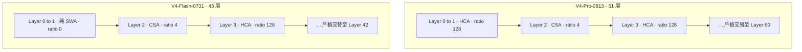

# DeepSeek-V4 正式版 checkpoint 对账：论文超参逐字段坐实，唯一结构增量是 DSpark

> **核对基线（双侧）**：
> - **论文侧**：arXiv:**2606.19348v1**「DeepSeek-V4: Towards Highly Efficient Million-Token Context Intelligence」，DeepSeek-AI，2026-04-26 —— 即 [[13_deepseek_v4_analysis]] 与 [[30_deepseek_v4_audit_analysis]] 所用基线。
> - **权重侧**：
>   - `raw/01_theory/01_models/deepseek/DeepSeek_V4_Pro_0813_model_card_72e1d323.md` + `DeepSeek_V4_Pro_0813_config_72e1d323.json`，对应 [deepseek-ai/DeepSeek-V4-Pro-0813 `72e1d323`](https://huggingface.co/deepseek-ai/DeepSeek-V4-Pro-0813/tree/72e1d323)（HF 仓库创建于 2026-08-13）。
>   - `raw/01_theory/01_models/deepseek/DeepSeek_V4_Flash_0731_model_card_7872f01b.md` + `DeepSeek_V4_Flash_0731_config_7872f01b.json`，对应 [deepseek-ai/DeepSeek-V4-Flash-0731 `7872f01b`](https://huggingface.co/deepseek-ai/DeepSeek-V4-Flash-0731/tree/7872f01b)（HF 仓库创建于 2026-07-31）。
>   - 参数量取自 HuggingFace safetensors 索引（2026-08-27 读取）。
>
> **维度**：对账 / 核对（Reconciliation）—— 论文基线 × 发布权重。
> **更新**：2026-08-27。
>
> 本页回答一个此前无法回答的问题：**[[30_deepseek_v4_audit_analysis|V4 审计]] 是拿论文核对 wiki，本页则是拿"真正发出来的权重"核对论文。**

---

## 0. 一句话结论

**正式版 checkpoint 的 `config.json` 与论文 §4.2.1 的超参逐字段吻合，一处未偏。** 库内既有的 V4 分析页（尤其 [[26_deepseek_v4_technical_deepdive]] 的 CSA/HCA 机制与 [[13_deepseek_v4_analysis]] 的规模表）**经得起权重层面的复核**。

三处**新增于论文之外**的事实：

1. **DSpark 投机解码模块已内嵌进权重**（论文里没有），配置暴露了它的 4 个超参；
2. **专家以 FP4 发布**（`expert_dtype: fp4`），把 [[24_deepseek_v4_fp4_qat_analysis|FP4 QAT]] 从"训练方法"落成了"发布形态"；
3. **V4-Flash 的实际参数量是 304.2B，比论文写的 284B 多约 20B** —— 与 DSpark 模块被算进 checkpoint 的口径一致。

同时，正式版相对 Preview 的基准提升**是数量级的**（DeepSWE 12.8 → 62.7），这一跃迁**完全没有公开解释**。

---

## 1. 命名与代际：0813 / 0731 到底是什么

先把口径钉死，否则很容易把四个东西混成两个。

| 名称 | 是什么 | 证据 |
|---|---|---|
| **DeepSeek-V4-Pro (Preview)** | 论文 arXiv:2606.19348v1 描述的模型；库内 8 篇 V4 页的基线 | [[30_deepseek_v4_audit_analysis]] |
| **DeepSeek-V4-Pro-0813** | **正式版**，"superseding the preview version"；在 Preview 结构上**挂了 DSpark 投机解码模块** | `Pro 模型卡 :43` |
| **DeepSeek-V4-Flash (Preview)** | 论文中的小号版本 | 同上 |
| **DeepSeek-V4-Flash-0731** | **正式版**；结构等同于 `DeepSeek-V4-Flash-DSpark`，即"带投机解码模块" | `Flash 模型卡 :43` |

> [!note]
> 两份模型卡的 `Technical Report` 链接都仍然指向 **arXiv:2606.19348**（`Pro :39`、`Flash :39`）。也就是说，**正式版没有自己的论文**——0813/0731 相对 Preview 做了什么后训练，公开材料里一个字都没有。本页凡涉及能力提升的部分，只能报告"发生了"，不能报告"为什么"。

---

## 2. 论文 §4.2.1 超参 × 发布配置：逐字段对账

这是本页的核心证据。左列取自库内既有页面对论文 §4.2.1 的记录（[[26_deepseek_v4_technical_deepdive]] `:157,181`、[[13_deepseek_v4_analysis]] `:28-40`），右列取自两份 `config.json` 快照。

| 论文 §4.2.1 记录 | 论文值（Flash / Pro） | 配置字段 | 配置值（Flash / Pro） | 对账 |
|---|---|---|---|:---:|
| CSA 压缩率 `1/m` | m = 4 | `compress_ratios` 中的 `4` | 4 / 4 | ✅ |
| HCA 压缩率 `1/m′` | m′ = 128 | `compress_ratios` 中的 `128` | 128 / 128 | ✅ |
| indexer 头数 `n^I_h` | 64（两者相同） | `index_n_heads` | 64 / 64 | ✅ |
| indexer 头维 `c_I` | 128（两者相同） | `index_head_dim` | 128 / 128 | ✅ |
| DSA top-k | 512 / 1024 | `index_topk` | 512 / 1024 | ✅ |
| 注意力头数 `n_h` | 64 / 128 | `num_attention_heads` | 64 / 128 | ✅ |
| 注意力头维 `c` | 512（两者相同） | `head_dim` | 512 / 512 | ✅ |
| Q 低秩 `d_c` | 1024 / 1536 | `q_lora_rank` | 1024 / 1536 | ✅ |
| 输出投影分组 `g` | 8 / 16 | `o_groups` | 8 / 16 | ✅ |
| 输出投影低秩 `d_g` | 1024（两者相同） | `o_lora_rank` | 1024 / 1024 | ✅ |
| SWA 窗口 `n_win` | 128 | `sliding_window` | 128 / 128 | ✅ |
| 路由打分函数 | `√Softplus`（V3 的 Sigmoid 之后） | `scoring_func` | `sqrtsoftplus` | ✅ |
| 每 token 激活专家 | 6 / 6 | `num_experts_per_tok` | 6 / 6 | ✅ |
| 层数 | 43 / 61 | `num_hidden_layers` | 43 / 61 | ✅ |

**十四项全中，零偏差。** 这是对 [[30_deepseek_v4_audit_analysis]] 结论的一次独立加固：审计当时只能拿论文核对 wiki，现在拿发布权重核对论文，同样成立。

### 2.1 CSA/HCA 交错策略也被逐层坐实

`compress_ratios` 是一个逐层数组，直接把论文 §4.2.1 的交错策略写在了权重配置里。库内 [[26_deepseek_v4_technical_deepdive]] `:56` 记录的是"**Flash 前 2 层纯 SWA、Pro 前 2 层 HCA，其余 CSA/HCA 交错**"。配置的统计结果：

| 模型 | 数组前两项 | 第 2 层起的模式 | ratio=4（CSA）层数 | ratio=128（HCA）层数 |
|---|---|---|---:|---:|
| **Pro-0813** | `[128, 128]` → **HCA** | `4, 128, 4, 128, …` 严格交替 | 30 | 31 |
| **Flash-0731** | `[0, 0]` → **无压缩（纯 SWA）** | `4, 128, 4, 128, …` 严格交替 | 21 | 20 |

**两条都与论文记录精确吻合**，包括"Pro 前 2 层是 HCA 而 Flash 前 2 层是 SWA"这个此前只在论文文本里出现、看起来颇为随意的不对称细节。

---

## 3. 论文之外的第一项增量：DSpark 已内嵌进权重

模型卡把它说得很直接：Pro-0813 是"built on the DeepSeek-V4-Pro (Preview) model structure, **with a DSpark speculative decoding module attached**"（`Pro 模型卡 :43`）；Flash-0731 则"comes with a speculative decoding module attached"（`Flash 模型卡 :43`）。

配置侧给出了这个模块的具体参数——**这是 [[dspark_analysis|DSpark 论文]] 与 [[deepspec_codebase_analysis|DeepSpec 源码]] 之外的第三份证据**：

| 字段 | Pro-0813 | Flash-0731 | 与 DSpark 论文的对应 |
|---|---:|---:|---|
| `dspark_block_size` | 5 | 5 | 草稿块长 γ |
| `dspark_markov_rank` | 512 | **256** | Markov 头低秩 `r`；论文默认 **256**（[[dspark_analysis]] `:122`） |
| `dspark_target_layer_ids` | `[58, 59, 60]` | `[40, 41, 42]` | DFlash 式"目标上下文 KV 注入"所取的目标层 $\{l_1,\dots,l_m\}$ |
| `dspark_noise_token_id` | 128799 | 128799 | 论文未在库内页面记录 |

三点值得记：

1. **`dspark_markov_rank` 与论文默认值精确吻合**：Flash 用 256（即 [[dspark_analysis]] 记录的默认 `r=256`），Pro 放大到 512。这坐实了配置里的 `dspark_*` 确实就是那篇 DSpark 论文的模块，而非同名的其他东西。
2. **目标层都是最后 3 层**（Pro 61 层取 58–60，Flash 43 层取 40–42），与 DFlash"取目标若干层隐状态拼接投影成上下文特征"的做法一致。
3. **`compress_ratios` 数组比 `num_hidden_layers` 多 3 项**（Pro 64 vs 61，Flash 46 vs 43），多出的 3 项取值全为 0，且紧接在 `dspark_target_layer_ids` 之后。
   - **【推断】**：这 3 项对应草稿器自身的层，它们不参与 CSA/HCA 压缩故记 0。
   - **边界**：配置没有字段说明这一点，也可能是数组预留长度。未核对 checkpoint 的 tensor key，故只能作推断。

vLLM 侧的启用方式也印证了模块是随权重发布的：`--speculative-config` 加 `method: dspark` 即可（`Pro 模型卡 :97`），不需要另外下载草稿模型。

---

## 4. 论文之外的第二项增量：专家以 FP4 发布

`expert_dtype: fp4`（两个模型均是），同时 `quantization_config` 为 FP8-E4M3、`weight_block_size: [128, 128]`、`scale_fmt: ue8m0`、动态激活量化。

- **意义**：库内 [[24_deepseek_v4_fp4_qat_analysis]] 分析的是论文 §5.2.1 的 **FP4 量化感知训练方法**。现在配置证明，**正式发布的权重本身就是 FP4 专家**——方法落成了产品形态，而不只是训练期的一个阶段。
- **边界**：论文里 FP4 的归属曾是审计订正项之一（[[30_deepseek_v4_audit_analysis]] 已订正"FP4 归属"）。本页只增加"发布形态确为 FP4 专家"这一条事实，不改动既有的方法归属结论。

另外 `rope_scaling` 显示 1M 上下文是 **YaRN 外推**得到的：`type: yarn`、`factor: 16`、`original_max_position_embeddings: 65536` → 65536 × 16 = 1048576。**即原生训练长度是 64K，1M 是外推。** 这一点在库内 V4 页面中此前没有明确记录。

---

## 5. 参数量对账：Pro 吻合，Flash 多出约 20B

| 模型 | 论文/既有页记录 | safetensors 索引实测 | 差 | 磁盘 |
|---|---:|---:|---:|---:|
| V4-Pro-0813 | 1.6T | **1650.5B** | 吻合（1.65T ≈ 1.6T） | 831.4 GiB |
| V4-Flash-0731 | **284B** | **304.2B** | **+20.2B** | 155.4 GiB |

- **事实**：Flash 的发布 checkpoint 比 [[13_deepseek_v4_analysis]] `:28` 记录的论文值多 20.2B 参数。
- **【推断】**：差额来自被 attach 进 checkpoint 的 DSpark 模块（模型卡明说 Flash-0731 的结构等同于 `DeepSeek-V4-Flash-DSpark`）。Pro 侧因为总量本身是"1.6T"这样的粗口径，20B 量级的增量看不出来。
- **边界**：未逐 tensor 统计 DSpark 相关权重，故不能坐实 20.2B 全部归于 DSpark。

dtype 分布（Pro）：`I8 = 1623.5B`、`F8_E4M3 = 24.0B`、`BF16 = 3.0B`、`F32 = 0.1B`。绝大部分权重以 int8 容器承载（与 FP4 打包发布一致）；**本页不据此反推打包倍率**，因为 HF 索引未说明其参数计数是打包前还是打包后口径。

---

## 6. 正式版 vs Preview：数量级的跃迁，零解释

`Pro 模型卡 :51-59` 给出了四方对比（Pro-0813 / Flash-0731 / Pro-Preview / Flash-Preview 同表）。

| 基准 | Pro-0813 | Flash-0731 | **Pro (Preview)** | **Flash (Preview)** | Pro-0813 相对 Preview |
|---|---:|---:|---:|---:|---:|
| DeepSWE | **62.7** | 54.4 | 12.8 | 7.3 | **×4.9** |
| Cybergym | **83.3** | 76.7 | 52.7 | 38.7 | +30.6 |
| NL2Repo | **61.5** | 54.2 | 38.5 | 39.4 | +23.0 |
| AutomationBench (Public) | **31.8** | 25.1 | 12.8 | 10.8 | ×2.5 |
| DSBench-Hard † | **67.2** | 59.6 | 31.1 | 25.8 | ×2.2 |
| Terminal Bench 2.1 | **87.9** | 82.7 | 72.1 | 61.8 | +15.8 |
| Toolathlon-Verified | **74.1** | 70.3 | 55.9 | 49.7 | +18.2 |
| HLE (wo / w tools) | 42.7 / 60.0 | 37.8 / 51.5 | 37.7 / 48.2 | 34.8 / 45.1 | +5.0 / +11.8 |

† 内部测试集（`Pro 模型卡 :62`）。

> [!contradiction]
> **这些跃迁不能归因于本页记录的任何结构改动。** 骨架与 Preview 逐字段相同（§2），唯一的结构增量 DSpark 是**投机解码**——它只影响生成**速度**，在数学上是无偏的，不改变输出分布，因此**不可能**把 DeepSWE 从 12.8 抬到 62.7。提升只能来自未披露的后训练。模型卡对此只给了一句"greatly enhanced agentic capabilities"（`:43`），没有任何配方、数据或消融。**引用这些数字时必须同时说明其成因不明。**

还有一条口径必须注意：**这些评测使用的是 DeepSeek 自家的 agent harness**（"minimal mode of DeepSeek Harness"，`max` reasoning effort，`temperature=1.0, top_p=0.95`；`Pro 模型卡 :61`、`Flash 模型卡 :61`），且 Flash 卡片注明该 harness **尚未发布**（"to be released"）。表中 GLM-5.2 / Kimi K3 / Opus-4.8 等列跑在各自不同的 harness 上，**跨列不构成公平对比**。

其中一条厂商自己点出的结论值得记：**Flash-0731 在上表几乎所有项上都超过 Pro (Preview)，尽管激活参数远小于后者**（`Flash 模型卡 :45`）——把"后训练收益 > 规模收益"这件事摆在了同一张表里。

---

## 7. 遗留问题

- `num_hash_layers: 3` 出现在两份配置中，库内既有 V4 页面**从未记录过这个字段**，论文侧也无对应。是否与 [[29_engram_analysis|Engram]] 的 n-gram 哈希查表有关，**本页无法判定**，不做推测。
- 0813/0731 的后训练配方完全未披露（见 §6 反驳栏）。
- 未逐 tensor 核对 checkpoint，故 §3.3 与 §5 的两条推断尚未坐实。
- 1M 由 64K YaRN 外推（§4），但论文与模型卡都没有给外推后的长上下文质量对照。
- DeepSeek Harness 未发布，上述基准无法第三方复现。

---

## 关联页面

- [[30_deepseek_v4_audit_analysis]] — **先读这页**：以论文核对 wiki 的审计；本页是它的权重侧续篇。
- [[13_deepseek_v4_analysis]] — V4 总体架构与规模表（本页 §5 对其 Flash 参数量提出增量）。
- [[26_deepseek_v4_technical_deepdive]] — CSA/HCA/DSA/MLA 机制深潜；本页 §2 是对它的权重级验证。
- [[24_deepseek_v4_fp4_qat_analysis]] — FP4 QAT 方法；本页 §4 给出其发布形态证据。
- [[dspark_analysis]] · [[deepspec_codebase_analysis]] — DSpark 机制与源码；本页 §3 给出其配置级证据。
- [[25_mhc_analysis]] — mHC；其 `hc_mult=4 / hc_sinkhorn_iters=20` 与 [[12_glm_5_3_flash_analysis|GLM-5.3-Flash]] 完全一致。
- [[01_theory/01_models/index|模型架构与模型家族总索引]]
