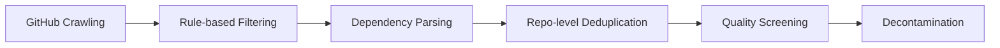

# DeepSeek-Coder Analysis

**Source:** `raw/05_model_families/deepseek/DeepSeek_Coder-2401.14196.pdf`  
**Date Ingested:** 2026-04-21  
**Authors:** DeepSeek-AI, Peking University  
**Published:** January 2024

---

## Overview

DeepSeek-Coder is a family of open-source code language models ranging from 1.3B to 33B parameters, trained from scratch on **2 trillion tokens** across **87 programming languages**. It introduces two key innovations for code pre-training: (1) **repository-level data construction** with dependency-aware file ordering, and (2) systematic analysis of **Fill-in-the-Middle (FIM)** training strategies. DeepSeek-Coder-Base 33B achieves state-of-the-art among open-source code models, while DeepSeek-Coder-Instruct 33B surpasses GPT-3.5 Turbo on most code benchmarks.

---

## Model Family

| Model | Parameters | Attention | Hidden Size | Layers | Context Length |
|-------|-----------|-----------|-------------|--------|----------------|
| DeepSeek-Coder 1.3B | 1.3B | Multi-head | 2048 | 24 | 16K (up to 64K) |
| DeepSeek-Coder 6.7B | 6.7B | Multi-head | 4096 | 32 | 16K (up to 64K) |
| DeepSeek-Coder 33B | 33B | Grouped-query (GQA, group=8) | 7168 | 62 | 16K (up to 64K) |

All models use SwiGLU activation, RoPE positional embedding, and FlashAttention v2.

---

## Data Construction

### Composition

- **87%** source code (87 programming languages)
- **10%** English code-related natural language (GitHub Markdown, StackExchange)
- **3%** Chinese natural language corpus

Total cleaned data: **798 GB**, **603 million files**.

### Pipeline



**Repository-Level Dependency Parsing**: Unlike prior work that trains on file-level code, DeepSeek-Coder parses inter-file dependencies within repositories and arranges files using **topological sort**. This ensures context files appear before dependent files in the training sequence, enhancing cross-file code completion capabilities.

**Quality Screening**: Combines compiler validation, a quality model, and heuristic rules to filter out code with syntax errors, poor readability, and low modularity.

**Decontamination**: Removes n-gram matches (10-gram or exact match for shorter strings) from evaluation benchmarks including HumanEval, MBPP, GSM8K, and MATH.

---

## Training Strategy

### Next Token Prediction

Standard causal language modeling on concatenated files.

### Fill-in-the-Middle (FIM)

To enhance code completion and infilling capabilities, DeepSeek-Coder employs FIM with **PSM (Prefix-Suffix-Middle)** mode at a **50% rate**:

```
<｜fim_start｜> f_pre <｜fim_hole｜> f_suf <｜fim_end｜> f_middle <|eos_token|>
```

**Key finding**: 100% FIM rate maximizes infilling performance but degrades left-to-right code completion. 50% PSM achieves the best balance.

### Long Context Extension

- RoPE base frequency changed from 10,000 to **100,000**
- Scaling factor increased from 1 to **4**
- Additional 1,000 steps at 16K sequence length (batch size 512)
- Empirically reliable up to **16K tokens**; theoretically supports 64K

### Optimization

| Hyperparameter | 1.3B | 6.7B | 33B |
|----------------|------|------|-----|
| Batch Size | 1024 | 2304 | 3840 |
| Max LR | 5.3e-4 | 4.2e-4 | 3.5e-4 |
| LR Schedule | Multi-step (warmup → 31.6% at 80% → 10% at 90%) | | |
| Optimizer | AdamW ($\beta_1=0.9, \beta_2=0.95$, weight_decay=0.1) | | |

---

## Instruction Tuning

DeepSeek-Coder-Instruct is created via supervised fine-tuning on high-quality instruction data in **Alpaca format**, using a unique delimiter token `<|EOT|>` for multi-turn dialogue.

- Learning rate: $1 \times 10^{-5}$
- Batch size: 4M tokens
- Total tokens: 2B
- Warmup: 100 steps, cosine schedule

---

## Evaluation Highlights

### Code Generation (HumanEval / MBPP)

| Model | Python | Avg (8 languages) | MBPP |
|-------|--------|-------------------|------|
| DeepSeek-Coder-Base 33B | **48.8%** | **45.2%** | **56.2%** |
| CodeLlama-Base 34B | 45.1% | 41.0% | 52.7% |
| StarCoder 15B | 33.6% | 30.4% | 43.6% |

### Multi-Turn Dialogue

DeepSeek-Coder-Instruct 33B demonstrates strong multi-turn capability for iterative code refinement (e.g., building a snake game step-by-step).

---

## Related Pages

- [[deepseek_coder_v2_analysis]] — Successor MoE code model with 338 languages and 128K context
- [[deepseek_v2_analysis]] — Base architecture (DeepSeek-V2) used for Coder-V2
- [[deepseek_math_analysis]] — Math reasoning model trained with similar data pipeline
- [[deepseek_llm_analysis]] — Original DeepSeek LLM scaling laws and training framework
- [[deepseek_moe_analysis]] — MoE architecture later adopted in Coder-V2

