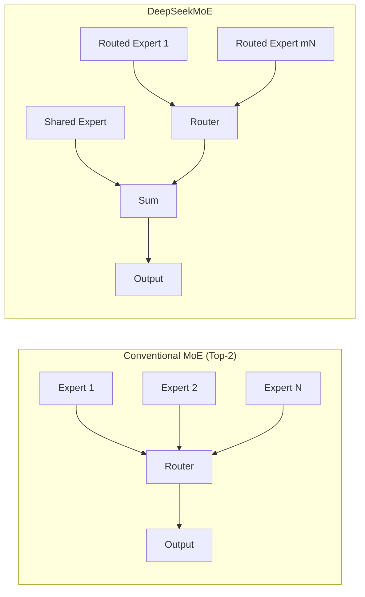

# DeepSeekMoE Analysis

**Source:** `raw/05_model_families/deepseek/DeepSeek_MoE-2401.06066.pdf`  
**Date Ingested:** 2026-04-21  
**Authors:** DeepSeek-AI, Peking University, Tsinghua University, Nanjing University  
**Published:** January 2024

---

## Overview

DeepSeekMoE is an architectural proposal for Mixture-of-Experts (MoE) language models targeting **ultimate expert specialization**. Conventional MoE architectures (e.g., GShard) suffer from two issues:
1. **Knowledge hybridity**: Limited number of experts forces each expert to learn diverse, overlapping knowledge
2. **Knowledge redundancy**: Multiple experts converge on common knowledge

DeepSeekMoE addresses these through two strategies: (1) **fine-grained expert segmentation** and (2) **shared expert isolation**.

---

## Architecture

### Fine-Grained Expert Segmentation

Instead of $N$ large experts with top-$K$ routing, DeepSeekMoE splits each expert into $m$ smaller experts and activates $mK$ of them:

$$
h^l_t = \sum_{i=1}^{mN} g_{i,t} \cdot \text{FFN}_i(u^l_t) + u^l_t
$$

where $g_{i,t} = s_{i,t}$ if $s_{i,t} \in \text{TopK}(\{s_{j,t}\}, mK)$, else 0.

**Combinatorial flexibility**: With $N=16$ and $m=4$:
- Conventional top-2: $\binom{16}{2} = 120$ combinations
- Fine-grained top-8: $\binom{64}{8} \approx 4.4 \times 10^9$ combinations

This enables more precise and targeted knowledge acquisition.

### Shared Expert Isolation

$K_s$ experts are designated as **shared experts** that are always activated, capturing common knowledge across all contexts:

$$
h^l_t = \sum_{i=1}^{K_s} \text{FFN}^{(s)}_i(u^l_t) + \sum_{i=K_s+1}^{mN} g_{i,t} \cdot \text{FFN}^{(r)}_i(u^l_t) + u^l_t
$$

The number of activated routed experts is reduced to $mK - K_s$ to maintain constant computation.

### Load Balancing

Two complementary balance losses:

**Expert-Level Balance Loss** (prevents routing collapse):

$$
\mathcal{L}_{\text{ExpBal}} = \alpha_1 \sum_{i=1}^{N'} f_i P_i
$$

**Device-Level Balance Loss** (ensures balanced computation across devices):

$$
\mathcal{L}_{\text{DevBal}} = \alpha_2 \sum_{i=1}^{D} f'_i P'_i
$$

where $f_i$ is the fraction of tokens routed to expert $i$, and $P_i$ is the mean routing probability.

---

## Validation Experiments

### 2B Parameter Scale

All models trained on 100B tokens:

| Model | Total Params | Active Params | Pile Loss | HellaSwag | HumanEval |
|-------|-------------|---------------|-----------|-----------|-----------|
| Dense | 0.2B | 0.2B | 2.060 | 38.8 | 0.0 |
| Hash Layer | 2.0B | 0.2B | 1.932 | 46.2 | 1.2 |
| Switch Transformer | 2.0B | 0.2B | 1.881 | 49.1 | 2.4 |
| GShard | 2.0B | 0.3B | 1.867 | 50.5 | 3.7 |
| **DeepSeekMoE** | **2.0B** | **0.3B** | **1.808** | **54.8** | **4.9** |

DeepSeekMoE 2B **nearly matches its dense counterpart** (upper bound for MoE) despite having 10x total parameters but only 1.5x active parameters vs GShard.

### 16B Parameter Scale

Trained on 2T tokens:

| Comparison | Result |
|------------|--------|
| DeepSeekMoE 16B vs DeepSeek 7B (dense) | Comparable performance with **~40% computation** |
| DeepSeekMoE 16B vs LLaMA2 7B | Comparable with **~40% computation** |
| DeepSeekMoE Chat 16B | Matches LLaMA2 SFT 7B and DeepSeek Chat 7B |

### 145B Parameter Scale (Preliminary)

- Performance comparable with **DeepSeek 67B dense**
- Using only **28.5%** (potentially 18.2%) of computations

---

## Model Configurations

| Scale | Layers | Hidden Dim | Heads | Shared Experts | Routed Experts | Active Routed | Expert Dim |
|-------|--------|------------|-------|---------------|----------------|---------------|------------|
| 2B | 9 | 1280 | 10 | 1 | 63 | 7 | 320 |
| 16B | — | — | — | 2 | — | — | — |
| 145B | — | — | — | — | — | — | — |

**Deployment**: DeepSeekMoE 16B fits on a **single 40GB GPU** without quantization.

---

## Expert Specialization Analysis

Empirical validation confirms that:
1. Fine-grained segmentation increases expert specialization (measured by expert output diversity)
2. Shared experts capture common syntactic/semantic patterns
3. Routed experts specialize in distinct knowledge domains
4. The combination mitigates both knowledge hybridity and redundancy

---

## Related Pages

- [[deepseek_v2_analysis]] — DeepSeek-V2 scales DeepSeekMoE to 236B with MLA attention
- [[deepseek_v3_analysis]] — DeepSeek-V3 further scales to 671B with auxiliary-loss-free load balancing
- [[deepseek_coder_v2_analysis]] — DeepSeek-Coder-V2 uses DeepSeek-V2 MoE architecture
- [[Megatron-LM_MoE_Zero_Redundancy_Analysis]] — Expert parallelism infrastructure for MoE training
- [[mHC]] — Manifold-Constrained Hyper-Connections (related DeepSeek architecture research)

