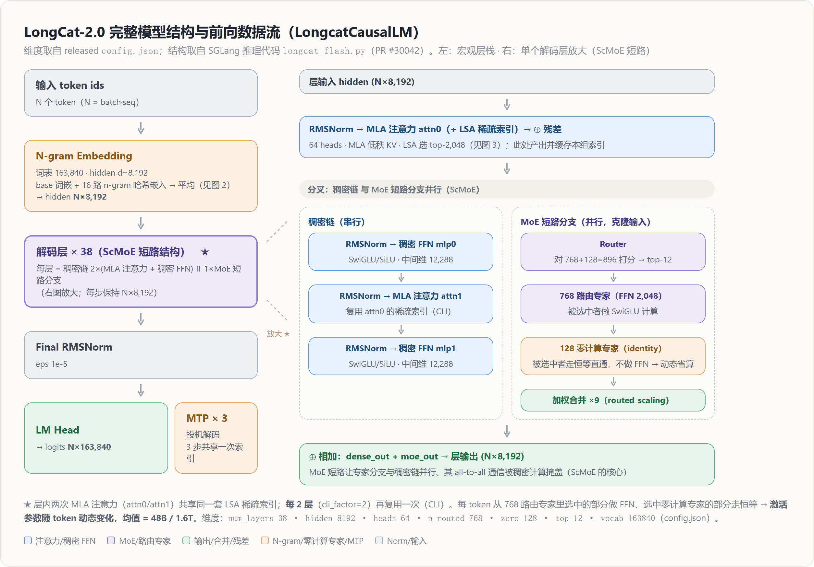
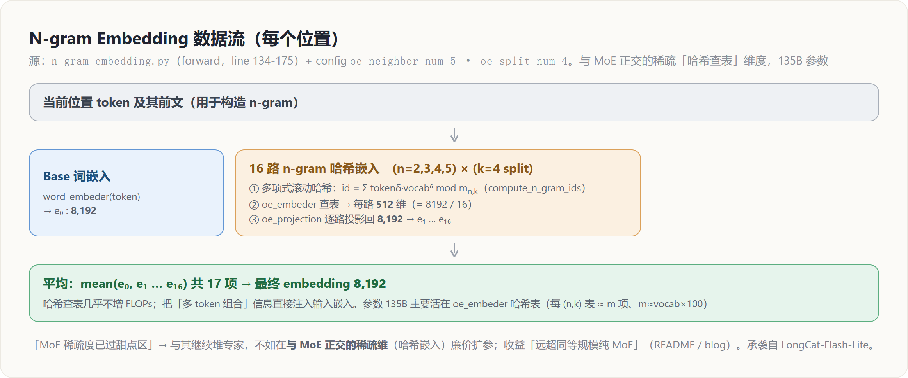
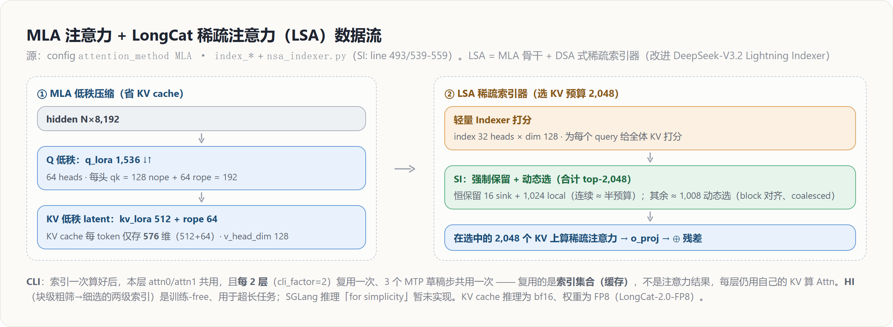
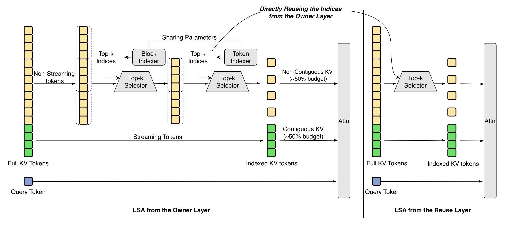
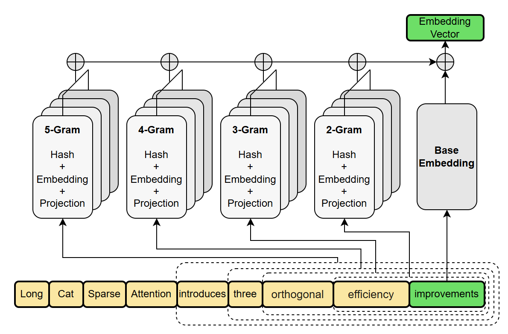
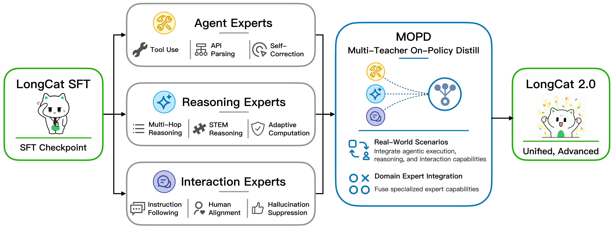

# LongCat-2.0：在国产 AI ASIC 上把 1.6T MoE 推到近前沿 Agentic Coding

> **来源**: 官方 Tech Blog + **已开源的推理代码 / 权重**（2026-07 陆续放出）
> **URL**: 博客 https://longcat.chat/blog/longcat-2.0 · 模型 https://huggingface.co/meituan-longcat/LongCat-2.0（含 `config.json` + 194 分片权重）· GPU 推理 SGLang PR https://github.com/sgl-project/sglang/pull/30042
> **License**: MIT（权重已放出；另有 `LongCat-2.0-FP8`）
> **Baseline**: `config.json` @ HF main（2026-07-06 clone）+ SGLang PR #30042 @ `HarryWu99/sglang@c6c36d9`（分支 `feature/longcat_dsa`）；博客访问 2026-07-02
> **维度**: Overview + 机制级深挖（架构 / 预训练 / 后训练 / AI Infra（含并行与 **ScMoE 计算-通信重叠调度** §5.5）/ 低精度与数值可靠性 / 稳定性 / 效果）

> [!note] 来源与保真度说明（务必先读）
> **2026-07 更新**：官方已开源**推理代码（SGLang PR #30042）+ `config.json` + 权重**。因此本页**架构部分**已从「博客二手描述」升级为**代码/配置一手核对**（每条硬参数带 `config.json` 行号或 `文件名:行` 定位），并据此**订正了博客未言明或二手误传之处**（见 §2、§9）——**注意力实为 MLA**、**零计算专家确有其事（128 个 identity）**、层内为 **ScMoE 短路结构**。
> 训练侧仍**未披露**（博客/代码均无）：学习率/batch/warmup、数据配比、MOPD 蒸馏损失、**训练精度**（推理已知 FP8）——在 §9.2 标注。

---

## 一、概览：一条主线

**一句话主线**：LongCat-2.0 的核心赌注不是「换更便宜的注意力去堆更大模型」这一条常规路线，而是**证明「前沿规模训练 + 近前沿 Agentic Coding 能力」可以完全建立在国产 AI ASIC superpod 上**——为此它在架构（LSA 稀疏注意力 + N-gram 稀疏扩参 + ScMoE）、训练（Muon 大规模 + 原生 1M 长上下文）、Infra（6D 并行 + PD 分离 + 确定性算子）三层同时做了「为异构硬件量身」的工程，最终在 >35T tokens 预训练中**零回滚、无不可恢复 loss spike**。

### 1.1 核心参数（据 released `config.json`，行号可核）

| 参数 | 值 | 定位 |
|------|-----|------|
| 架构类名 | `LongcatCausalLM` | config.json:2-3 |
| 总参数 / 每 token 激活 | **1.6 T / ~48 B**（动态，见下） | 博客 / README |
| 层数 num_layers | **38** | config.json:11 |
| 隐藏维 hidden_size | **8,192** | config.json:8 |
| 注意力 | **MLA**（Multi-head Latent Attention） | config.json:37,41 |
| 注意力头数 | **64** | config.json:12 |
| MLA 维度 | q_lora **1,536** · kv_lora **512** · qk_nope **128** + qk_rope **64**（=192）· v_head **128** | config.json:13-17 |
| 稠密 FFN 中间维 | **12,288**（SiLU/SwiGLU） | config.json:9 · longcat_flash.py:160 |
| 路由专家 / 零计算专家 | **768 routed** + **128 零计算(identity)** | config.json:21,38-39 |
| 每 token top-k | **12**（在 768+128=896 中选） | config.json:40 · longcat_flash.py:182 |
| 专家 FFN 中间维 / routed_scaling | **2,048** / **9** | config.json:10,20 |
| 词表 vocab_size | **163,840** | config.json:7 |
| 归一化 / 激活 | **RMSNorm**(eps 1e-5) / **SiLU** | config.json:23 · longcat_flash.py:160 |
| 位置编码 | **RoPE + YaRN**（deepseek_yarn, factor 120, θ=1e6, 原始 8192） | config.json:27-36 |
| max_position_embeddings | **262,144**（config 值；训练达 **1M**，靠 YaRN 外推） | config.json:22 |
| N-gram Embedding | **135 B**；n=5(oe_neighbor)×k=4(oe_split)=**16 路哈希**；空间≈100× | config.json:44-46 |
| LSA 索引器 | index_topk **2,048** · 32 heads×dim 128 · 恒保留 sink **16** + local **1,024** · cli_factor **2** | config.json:52-59 |
| MTP | **3-step**（nextn，投机解码） | config.json:48 |
| 预训练 tokens / 硬件 | **>35 T** / **50K+ 国产 AI ASIC** | 博客 / README |
| 对标模型 | Claude Opus 4.6/4.7/4.8 · GPT-5.5 · Gemini 3.1 Pro | 评测表（§8） |

> **激活参数为何「动态」**：每 token 从 768 路由 + 128 零计算专家里 top-12；命中零计算(identity)专家的部分**不做 FFN**，故实际激活的专家 FFN 数随 token 变化，~48B 是均值（zero-compute experts 机制，见 §2.3）。

### 1.2 完整结构与前向数据流（代码级，配图）

> 下三张图据 released `config.json` 的维度 + SGLang 推理代码（`longcat_flash.py` / `n_gram_embedding.py` / `nsa_indexer.py`，PR #30042）绘制，把每一步数据流画全。SVG 源见 `.html2md/figs/longcat2_architecture.html`。

**图 1 — 整体前向 + 单层 ScMoE 放大**（tokens → N-gram 嵌入 → 38× ScMoE 解码层 → RMSNorm → LM Head，旁挂 MTP×3）：



**图 2 — N-gram Embedding 数据流**：



**图 3 — MLA + LSA 稀疏注意力数据流**：



**一句话读结构**：`LongcatCausalLM` = **N-gram 嵌入 → 38 个 ScMoE 解码层 → RMSNorm → LM Head**（`longcat_flash.py`）。每个解码层**不是**「注意力→MoE」的常规块，而是 **LongCat-Flash 的 ScMoE 短路**：**MLA-attn0 先算**，其输出在 fork 点**克隆**成两支**并行**——一支是 **MoE 短路分支**（Router→dispatch→专家 GEMM→combine），另一支是**稠密链** `稠密FFN → MLA-attn1 → 稠密FFN`（`longcat_flash.py:449` 克隆、:456 稠密链、:460 `moe_out + dense_out` 相加）——让 MoE 的 all-to-all 通信被稠密链计算掩盖。**注意 fork 在 attn0 *之后***：所以可掩盖 MoE 通信的「重叠窗口」= **稠密FFN₁ + MLA-attn1 + 稠密FFN₂**（**不含 attn0**，attn0 是 fork 之前的共享前置）；窗口内部「谁盖 dispatch、谁盖 combine」的调度细节见 **§5.5**。注意力是 **MLA + LSA 稀疏索引器**（DeepSeek 血缘）。

---

## 二、模型架构

架构自陈**承袭 LongCat-Flash 并「进一步推参数效率」**（措辞为架构继承，隐含从头预训练）。**代码开源后可坐实**：LongCat-2.0 复用 SGLang 的 `longcat_flash.py` 模型类（PR「support LongCat2.0」在其上改），注意力走 `DeepseekV2AttentionMLA`——即 **DeepSeek(MLA+MoE) 血缘 + LongCat 特色（ScMoE 短路 / 零计算专家 / N-gram 嵌入 / LSA 稀疏索引）**。

> [!important] 代码开源后对架构描述的三处关键订正（源：`config.json` + SGLang `longcat_flash.py`）
> 1. **注意力是 MLA**（`attention_method:"MLA"`, config.json:37）——LSA 不是全新注意力，而是**在 MLA 骨干上叠 DSA 式稀疏索引器**（DeepSeek-V3.2 血缘），见 §2.1「代码补充」。
> 2. **层结构是 ScMoE 短路**（非「注意力→MoE」常规块）：每层 2×(MLA + 稠密 FFN) 稠密链 ∥ 1×MoE 短路分支并行相加（`longcat_flash.py:419-461`），见 §2.3、图 1。
> 3. **零计算专家确有其事**：`zero_expert_num:128, zero_expert_type:"identity"`（config.json:38-39）——768 路由 + 128 恒等零专家、top-12、激活参数随 token 动态。**订正**本页早期（博客只字未提时）对「动态激活/zero-compute」的保留意见，见 §9.1。

### 2.1 LongCat Sparse Attention (LSA)：三种正交索引压 1M 上下文



> **图源**：官方博客 LSA 总览图（`lsaimage-CCkXmBaN.svg`，原图注「Overview of the LongCat Sparse Attention design. Sink tokens omitted for clarity.」）。原始 SVG 存于 `assets/lsa_overview.svg`，本页 PNG 为 2× 渲染。

**读图（这张图把三种索引一次画全）**：Full KV Tokens 先分成两股——

- **Streaming Tokens（绿）**：**不进索引器**，直接作 **Contiguous KV（约 50% 预算）**。这就是「连续保留」的那一半——StreamingLLM 式的 **sink token + 近窗局部连续段**（图注注明 sink 已略去）；它天然顺序访存、coalesced。
- **Non-Streaming Tokens（黄）**：走 **Block Indexer →(top-k 选块)→ Token Indexer →(块内 top-k 选 token)** 两级筛，得 **Non-Contiguous KV（约 50% 预算）**；两个索引器 **Sharing Parameters**（共享参数）。

两股拼成 Indexed KV，与 Query 做 Attn。**右侧 "LSA from the Reuse Layer" 里没有任何索引器**，顶部标注 **"Directly Reusing the Indices from the Owner Layer"**——直接拿 Owner Layer 算好的索引，只保留 Top-k Selector + Attn。三种正交索引在图上的落点：**SI** = 「Streaming(连续) + Non-Streaming(动态)」这个约 50/50 拆分；**HI** = Non-Streaming 内的 Block→Token 两级；**CLI** = Owner Layer 与 Reuse Layer 之间的索引复用。

**动机（源忠实：LSA 是冲着 DSA 的短板设计的）**：博客把参照系明确指向 **DeepSeek Sparse Attention (DSA) 的 Lightning Indexer**，并点名其两处瓶颈——**输出不连续（output discontinuity）**（选出的 token 在显存里碎片化、随机访存）与**打分的二次方成本（quadratic scoring cost）**。LSA 用三种**相互正交**的索引策略，分别正面修复这两处、再叠一层跨层摊薄：

| 索引 | 机制 | 修复的 DSA 短板 | 训练方式 |
|------|------|----------|----------|
| **SI**（Streaming-aware Indexing） | 把 token 选择预算重塑为「硬件对齐的**连续访问** + 动态随机选择」结合——碎片化随机访存转成可预测**顺序读**，达成 **coalesced HBM 访问** | **输出不连续** | 训练中启用 |
| **CLI**（Cross-Layer Indexing） | 利用「**相邻层注意力显著性经验稳定**」——一次索引 pass 服务多个连续层，摊薄索引成本 | 索引的**逐层重复计算** | 需**跨层蒸馏**训练 |
| **HI**（Hierarchical Indexing） | 两段式 coarse-to-fine：先**块级近似打分粗召回**，再在候选内**细粒度 token 选择**——缩小 indexer 每 query 要处理的候选空间 | **二次方打分成本** | **training-free**，仅对选定的超长上下文任务启用 |

> **为什么不直接用 DSA 的 Lightning Indexer？（源明确点名）** DSA（DeepSeek / GLM-5 的可学习稀疏注意力，见 [[01_glm_5_analysis]]）用 Lightning Indexer 选 token，但它**输出不连续**会把访存打成随机碎片、**二次方打分**在 1M 下昂贵。LSA 不另起炉灶，而是**针对这两处逐一修复**：SI 管访存形态（→coalesced 访问）、HI 管打分成本（→分层粗筛降二次方）、CLI 再叠一层跨层摊薄。本质是把「稀疏注意力」从「省 FLOPs」重定义为「**省访存 + 省索引**」——这正是带宽受限的国产 ASIC 最吃紧的两处。

#### 读图问答（对着上图逐条澄清 LSA 的常见疑问）

**Q1. SI 的 "streaming token" 是不是就是固定窗口的 token？**
方向对，但要精确说是「**连续保留的那约一半 KV**」。图里 **Streaming Tokens（绿）不进索引器、直接作 Contiguous KV（~50% 预算）**——对应 **sink token + 近窗局部连续段**（StreamingLLM 式；图注专门说 sink 略去）。所以它确实是「固定/连续、总是保留」的部分，但两点补充：① 除局部窗口外还含 **sink**；② 它只占**约一半预算**，另一半（Non-Streaming）是**动态选**出来的。SI 的本质 = 把 KV 预算拆成「一半连续 + 一半动态」，让动态那半也尽量块对齐、可 coalesced。

**Q2. 层次化 indexer 是不是「连续做两次选择」来稀疏化？**
**完全正确**。图中 Non-Streaming 路径就是 **Block Indexer →(top-k 选块)→ Token Indexer →(块内 top-k 选 token)** 两级 top-k：先块级粗召回、再块内 token 级细选。这把索引打分从「对全序列每 token 打分（二次方）」降成「先对块打分、只在选中块里对 token 打分」。两级索引器还 **共享参数**。

**Q3. CLI 的 reuse 是不是「一个 indexer 对应多个 transformer layer、算一次后续复用」？**
**正确**。图右 "LSA from the **Reuse Layer**" **没有 Block/Token Indexer**，只剩一个 Top-k Selector，顶部箭头写明 **"Directly Reusing the Indices from the Owner Layer"**：**Owner Layer 跑一次完整索引得到 indices，后面连续若干 Reuse Layer 直接拿这套 indices，不再自己算**。一次算、多层复用（相邻层注意力显著性稳定是其经验前提）。

**Q4. 这个复用，实现上是缓存还是重算？**
**是缓存，不是重算**——而且从图上看是**结构性必然**：Reuse Layer **根本没有索引器**，它没有可「重算」的东西，只能接收 Owner Layer 传来的 index。所以实现上就是：**Owner Layer 算出的 top-k 索引集合（一个整型 index 张量：块索引 + token 索引）被缓存下来，喂给后续 Reuse Layer 的 Top-k Selector**。
- **关键区分**：被缓存/复用的是**「选哪些 KV」的索引**，**不是注意力结果**——每个 Reuse Layer 仍用**自己这一层的 K/V**、在这套共享索引上算**自己的 Attn**（图里每层都有独立 Attn 框）。省掉的是 indexer 的打分开销（最贵、二次方那块），不是省 attention 本身。
- **为什么不可能是重算**：若每层都重算 indexer，CLI 就没有意义（博客原话「amortize indexing cost」）；MTP 那段也明确用 **"reusing the index set generated in step 1"**——复用的就是**索引集合**。
- **代价/前提**：跨层直接复用索引，要求「相邻层注意力显著性稳定」成立，故训练时用 **cross-layer distillation** 把 reuse layer 对齐到「用 owner 的索引也不掉点」。这是它的代价——多一条训练约束，换推理时把索引成本摊到多层。

#### 代码补充：LSA = MLA 骨干 + DSA 式索引器（据 `config.json` + `nsa_indexer.py`）

上面的官方图讲「三索引」的**设计**；released 代码进一步坐实**实现与数字**：

- **骨干是 MLA**：`attention_method:"MLA"`（config.json:37），低秩压缩 q_lora 1,536 / kv_lora 512(+rope 64)，**KV cache 每 token 仅存 576 维**——与 DeepSeek MLA 同构（数据流见图 3）。
- **索引器规格**：`index_n_heads 32 × index_head_dim 128`，为每个 query 打分选 **index_topk = 2,048** 个 KV（config.json:52-54）。
- **SI 的「连续半」有确切数字**：`nsa_indexer.py` 的 `_mask_init_and_local_tokens`（:493, :539-559）**强制保留 `index_init_tokens=16`（sink）+ `index_local_tokens=1,024`（近窗）**，再 top-k 补满 2,048——**1,024 / 2,048 = 50%**，正好印证官方图「Contiguous KV ~50%」，另 ~1,008 为动态选。这把 §2.1 Q1 的「streaming token」坐实为「**16 sink + 1,024 local 的连续段**」。
- **CLI 的「每几层复用」有确切数字**：`cli_factor = 2`（config.json:56）——**每 2 层复用一次**索引；`dsa_mtp_cli:true`，3 个 MTP 草稿步共用一次。`longcat_flash.py` 把 `prev_topk_indices` 沿层线程传递（:426, :456）即此机制——**印证 Q4：复用的是索引集合（缓存），非重算**。
- **HI 未在推理实现**：README 明确「Hierarchical indexing is not supported for simplicity」（SGLang GPU 推理）——HI 是 training-free、仅用于超长任务的两级粗筛，推理暂略（故 §2.1 表中 HI 的「块级→token 级」仅在训练/超长任务生效）。

### 2.2 N-gram Embedding：135B 参数、与 MoE 正交的「稀疏维」扩参



> **图源**：官方博客 N-gram Embedding 总览图（`ngram-emb-new.drawio-DtU8Umnl.svg`）。原始 SVG 存于 `assets/ngram_embedding_overview.svg`。

**读图**：对当前位置（图中 "improvements"），分别取以它结尾的 **2/3/4/5-gram**（如 5-gram = "introduces three orthogonal efficiency improvements"）；每个 n-gram 各过一组 **Hash + Embedding + Projection**（图中叠放的多张卡 = 多张哈希表/桶），再把 5/4/3/2-gram 的向量与 **Base Embedding**（普通 token embedding）**逐一相加**，得最终 **Embedding Vector**。即：**用「哈希查表」而非计算，把多 token 组合（n-gram）的信息直接注入到输入 embedding**——这正是「几乎不增 FLOPs、参数长在稀疏查表维」的由来；135B 参数就活在这些哈希 embedding 表里。

**机制**：在 Token Embedding 之外并联一个 **n=5 的 N-gram Embedding 层**，参数量达 **135B**，把 embedding 表征空间约**扩大 100×**，同时**控制在总参数预算的 <10%**。

**为什么这么设计**（四拍）：
- **动机（源忠实：MoE 稀疏度已「过了甜点」）**：博客明确 MoE 的稀疏度**已越过甜点区（约 97% 稀疏）**——再堆专家边际收益递减、且继续推高 all-to-all 与路由负担；此时把 135B 参数**挪到 N-gram Embedding，其收益「远超标准专家」**。于是转向**另一个正交维度**廉价扩参。
- **机制**：N-gram embedding 在「**与 MoE 正交的稀疏维度**」扩参——n=5 的 n-gram 组合查表而非计算，几乎不增加 FLOPs，把 embedding 表征空间约扩 100×。
- **证据/收益**：博客称其**提升参数效率、并降低大 batch 解码时的 I/O**——把参数从专家挪到 N-gram Embedding，大 batch 解码的显存 I/O 下降、生成加速（查表命中率高、访存规整）。
- **代价/为什么不选替代**：不是简单加大 vocab embedding（会线性放大主 embedding 访存），而是 n-gram 组合稀疏查表；代价是需要额外的 N-gram 索引结构与**专门的并行维（EMBP，见 §5）** 来分片这 135B。

**代码补充（`n_gram_embedding.py:134-175`）**：坐实并微调上文——(1) 路数 = (n−1)×k = (5−1)×4 = **16 路**（n=2..5 每阶 4 个 hash split，config `oe_neighbor_num 5 / oe_split_num 4`）；(2) 每路先**多项式滚动哈希**成 id（`compute_n_gram_ids`，权重 = vocabᵟ mod m）→ 查 `oe_embeder`（每路 512 维）→ `oe_projection` 投回 8,192；(3) 与 base 词嵌入**取平均（mean，非「逐一相加」）** 得最终嵌入（:175）——官方图画的是求和汇聚，代码是 mean，等价于缩放后的和。135B 参数主要在 `oe_embeder` 哈希表（每 (n,k) 表 ≈ m 项，m≈vocab×100）。数据流见图 2。

### 2.3 ScMoE 短路结构 + 零计算专家（代码级）

**结构（`longcat_flash.py:306-461`）**：这是 LongCat-2.0 与常规 MoE Transformer 最不同的一处。每个解码层 = **2 个 MLA 注意力 + 2 个稠密 FFN + 1 个 MoE**，接成 **ScMoE 短路**（数据流见图 1 右）：

1. `attn0`（RMSNorm→MLA→⊕残差）产出中间态 h1（:429-443）；
2. **克隆** h1 → 送入 **MoE 短路分支**（:449-451），与稠密链**并行**；
3. **稠密链**：`mlp0 → attn1 → mlp1`（`forward_mlp`, :463-500）；
4. **相加** `hidden = moe_out + dense_out`（:460）。

> **为什么这么接（ScMoE 的本质）**：MoE 的 all-to-all（分发/回收 token）是长延迟通信。把 MoE 作为**短路分支**与稠密链（mlp0→attn1→mlp1）**并行**，其通信就被稠密计算**掩盖**——这就是博客「per-core 显式控制 → dense/MoE 全并行」的落地，也是 §5「+35% 吞吐」的架构侧来源。承袭 LongCat-Flash 的 Shortcut-connected MoE。（EP 的 all-to-all 原理见 [[14_expert_parallel_analysis]] / [[14_megatron_ep_analysis]]。）
>
> **可重叠窗口要说精确（易错点）**：`clone` 发生在 `attn0` **之后**（:449），故被掩盖 MoE 通信的窗口 = **稠密FFN₁(mlp0) + MLA-attn1(self_attn[1]) + 稠密FFN₂(mlp1)** 这三个模块，**attn0（MLA₁）不在窗口内**——它是 fork 之前算完、其输出同时喂给两支的**共享前置**。换言之 shortcut 只负责**建立数据依赖上的自由度**（MoE 输入在 attn0 后即就绪、输出到层尾才被消费）；窗口内部**怎么切、谁盖 dispatch、谁盖 combine**，是**调度层**的选择，且**训练与推理选了两套不同方案**——详见 **§5.5**。

**MoE 内部（`LongcatFlashMoE`, :201-293）**：
- **Router 对 768+128=896 个专家打分**（`n_routed_experts + zero_expert_num`, :182），取 **top-12**（:245-251）。
- 命中**真实路由专家**的做 FFN（中间维 2,048）；命中 **128 个 identity 零计算专家**的走 `zero_experts_compute_triton` **恒等直通、不做 FFN**（:274-281）——即 **zero-compute experts**：每 token 实际做 FFN 的专家数 = 12 − 命中零专家数，**动态**。
- 输出 `× routed_scaling_factor(9)` 再加零专家结果（:285-288）。

> 这解决了本页早期的悬案：博客只提「训练期 padding→zero-expert」时，我曾按源忠实保留「推理动态激活未证实」的态度；**代码证明 zero-compute experts 是常设机制**（config `zero_expert_num:128`），故 ~48B 激活是**动态均值**，二手报道的「33–56B 区间」方向可信（见 §9.1 订正）。

### 2.4 MTP（Multi-Token Prediction）：3-step + 复用 LSA 索引

- **深度**：3-step 模块，用于**投机解码（speculative decoding）** 加速。
- **与 LSA 的协同**：MTP 的第 2、3 步**复用第 1 步的注意力索引**（CLI 的延伸）——多预测的 token 不再重复做索引，进一步压低投机解码的开销。
- MTP 概念与 DeepSeek-V3 一脉相承（见 [[12_deepseek_v3_analysis]]）。

---

## 三、预训练

| 项 | 内容 |
|----|------|
| 规模 | **> 35T tokens**；数百万加速器·小时级；50K+ 国产 ASIC |
| 长上下文 | **数百亿 token 的 1M 上下文数据**；**all-gather 式 CP 可扩到 512+**，实现**原生 1M 长度训练**（而非纯外推） |
| 数据流水 | 训练数据在 **get-batch 阶段 reshuffle**，用**均衡 CP 策略**分片（配合 CP-512 的负载均衡） |
| 优化器 | **Muon**，大规模部署（详见 §3.1） |
| 基座关系 | 架构承袭 **LongCat-Flash**、推参数效率；措辞为架构继承（隐含从头训练，非续训） |
| 学习率/batch/warmup/课程阶段 | **未披露** |

### 3.1 Muon 优化器的大规模工程

博客明确「**在加速器上大规模部署 Muon**」，并做了三项针对性优化：

1. **TP 并行下的处理**——Muon 的正交化/Newton-Schulz 迭代涉及矩阵运算，需在张量并行切分下正确高效执行；
2. **DP 状态冗余消除**（DP state redundancy removal）——去掉数据并行副本间的优化器态冗余（类 ZeRO 思路，见 [[12_zero_fsdp_analysis]]）；
3. **高效对称矩阵乘 kernel**（symmetric matmul kernel）——为 Muon 的 $G G^\top$ 类运算定制。

> Muon 已成为 2026 年前沿国产/开源大模型的共同选择：Kimi K2 的 **MuonClip**（见 [[11_kimi_k2_analysis]]）、GLM-5 的 **Muon Split**（见 [[01_glm_5_analysis]]）、DeepSeek-V4（见 [[13_deepseek_v4_analysis]]）。LongCat-2.0 的贡献点在**异构 ASIC 上把 Muon 跑到 1.6T 规模并做 TP/DP/kernel 三处适配**。Muon 原理见 [[11_muon_analysis]]。

---

## 四、后训练：MOPD 多教师在线策略蒸馏

**主线**：不追求单一「全能」策略，而是**先训三组各有所长的 teacher 专家群，再用 MOPD 把三者的最强能力融进一个学生模型**。



> **图源**：官方博客 MOPD 架构图（`mopd-CIX9ZFo9.svg`）。原始 SVG 存于 `assets/mopd_overview.svg`。

**读图**：从 **LongCat SFT 检查点**出发，分头训练三组专精 teacher，再经 **MOPD** 融合蒸馏成 **LongCat 2.0（Unified, Advanced）**。图中 MOPD 副标题写作 **"Multi-Teacher On-Policy Distill"**，两条职责标注为 **Real-World Scenarios**（整合 agentic 执行 / 推理 / 交互能力）与 **Domain Expert Integration**（融合各专精专家能力）。

> [!contradiction] MOPD 的展开以官方图为准：Multi-Teacher On-Policy Distillation
> 二手摘要（DeepWiki 等）曾把 MOPD 解作「**Multi-Objective Policy Distribution**（多目标策略分布）」；但**官方博客架构图**副标题白纸黑字写的是 **"Multi-Teacher On-Policy Distill(ation)"（多教师在线策略蒸馏）**。以官方图为准——本页早期版本与首次 changelog 的「多目标策略分布」为二手误读，特此订正。

- **MOPD = Multi-Teacher On-Policy Distillation（多教师在线策略蒸馏）**：以三组 teacher 为多教师、对**学生自己生成的轨迹（on-policy）** 做蒸馏，把三者能力融进统一学生。**on-policy 是关键**——在学生自身分布上蒸馏（而非离线照抄 teacher 输出），能针对学生**真实会犯的错**纠偏、规避训练-推理分布错配（与 [[20_rl_training_inference_precision_analysis]] 同源问题）。
- **三组 teacher expert groups**（原子能力据官方图逐一列全）：

| 专家群 | 目标域 | 优化的「原子能力」（图中列举） |
|--------|--------|--------------------|
| **Agent Experts** | 细粒度垂域：**代码 / 工作 / 搜索** | Tool Use（工具调用）· API Parsing（参数解析）· Self-Correction（自纠正） |
| **Reasoning Experts** | **数学 / STEM / 多跳推理** | Multi-Hop Reasoning · STEM Reasoning · **Adaptive Computation（自适应算力）** |
| **Interaction Experts** | 交互 / 通用对话 | Instruction Following（指令遵循）· Human Alignment（人类对齐）· Hallucination Suppression（幻觉抑制） |

> **为什么不用单教师/单目标 RL？** Agentic coding、深推理、通用交互三者的**奖励信号与数据形态差异极大**，混在一个策略里互相拉扯（reward 冲突）。先分群把各自「原子能力」练到位、再蒸馏融合，是把「多目标对齐」从「一个策略硬扛」改成「分而治之 + 融合」。这与 GLM-5 的「分阶段 RL + 跨阶段蒸馏防遗忘」（见 [[01_glm_5_analysis]] §三）思路相通。
>
> **仍未披露**：on-policy 蒸馏的**具体损失形式**（KL / reverse-KL / 排序？）、是否含显式 RL（奖励模型 / GRPO 等）、各 teacher 群的训练细节与数据量——博客与图均未给。

---

## 五、AI Infra：为国产 ASIC 量身的 6D 并行 + PD 分离

**主线**：整套训练与大规模部署**完全建立在国产 AI ASIC superpod 上**（非 NVIDIA），Infra 的每一处都在补「异构硬件 + 超大稀疏模型 + 1M 上下文」的短板。

### 5.1 训练：6D 并行 + superpod 拓扑

```
物理底座：国产 AI ASIC superpod
  · 单个 superpod ≤ 48 机，机内 all-to-all 高带宽
  · superpod 间 RoCE 互联  →  额外约 +30% 预训练吞吐
  · 相对 naive 实现总体  →  +35% 训练吞吐

6D 并行 = 标准 5D (TP / CP / EP / DP / PP)  +  EMBP
  · TP/CP/EP：把高带宽通信域「加宽到数百设备」
  · CP（上下文并行）：扩到 512+  →  原生 1M 训练
  · EMBP（Embedding Parallelism）：专门并行 135B N-gram Embedding
```

- **EMBP 是本模型独有的第 6 维**：135B 的 N-gram Embedding 若挤在 TP/DP 里会破坏负载均衡，故单列一维专门分片。这是「架构创新（N-gram 扩参）倒逼 Infra 创新（新并行维）」的典型。
- 相关原理：TP/CP/SP 见 [[13_tensor_sequence_parallel_analysis]]，EP 见 [[14_expert_parallel_analysis]]，PP 见 [[15_pipeline_parallel_analysis]]，通信重叠工程参照 [[20_megatron_comm_overlap_analysis]]。

### 5.2 推理·模型专属优化（Model-Specific）

针对「1.6T 参数 × 1M 上下文 × HBM 受限」的解码，博客列了几招（多为吸收/流水线类的硬件友好改写）：

- **注意力吸收计算（absorb computation）**：把注意力里可合并的投影/缩放**吸收进相邻矩阵**，减少解码时的显存读写与算子数（*本页推断：类 MLA 家族的 absorb 技巧*）。
- **索引器流水线化（pipelining the indexer）**：把 LSA 的 indexer 与后续注意力**流水线重叠**，让「选哪些 KV」的开销藏进计算。
- **KV-cache 并行（KVP）**：把超长上下文 KV cache 切到多设备，缓解单卡 HBM 压力（与下方部署段 decode 侧呼应）。
- **ScMoE 调度（SBO 四阶段）**：把架构侧的 ScMoE（§2.3）在推理 decode 上落成 **SBO 单批重叠**——用稠密链的计算分段掩盖 MoE 的 dispatch/combine 通信、MoE GEMM 裸露靠 wide EP 压薄。这是本模型并行策略里最关键的一环，**独立成节展开见 §5.5**。

### 5.3 推理·部署：Prefill–Decode 分离

| 阶段 | 并行/技术 | 目标 |
|------|-----------|------|
| **Prefill 节点** | 多节点 **CPP**（chunked pipeline parallelism）+ **Attention SP**（sequence parallelism） | 压低 **TTFT** |
| **Decode 节点** | **KVP**（KV-cache parallelism）+ **EP128**（128 路专家并行） | 提高 **TPOT/吞吐** |
| P↔D 之间 | KV-cache 传输走**内置 200 Gbps 网卡** | 平衡 TTFT 与 TPOT |

> PD 分离是 2026 年大模型推理的主流范式（Kimi Mooncake 见 [[moonshot_kimi/index]]；vLLM 见 [[02_engineering/03_infer_frameworks/vllm/index]]）。LongCat-2.0 的特色是 **decode 侧 EP128 + KVP** 与**国产网卡 200Gbps 的 KV 搬运**。

### 5.4 推理·加速器导向优化（Kernel / 访存）

- **Super Kernels**：把多个小算子融进一个大 kernel，**降 kernel launch 开销**（国产 ASIC 上 launch 开销尤其敏感）。
- **权重预取（weight prefetch）/ L2 cache 预取**：把某算子的 **I/O（权重加载）延迟藏进前一个算子的计算**里，隐藏访存延迟。
- **EPLB**（Expert-Parallel Load Balancing）：部署期专家负载均衡。
- （P↔D 间 KV-cache 走内置 **200 Gbps 网卡**——见 §5.3 表。）

### 5.5 ScMoE 的计算-通信重叠调度：训练与推理两套方案

> **一句话主线**：ScMoE 的短路**本身只做一件事——建立数据依赖上的自由度**：MoE 分支的输入在 `attn0` 之后即克隆就绪（可提前算）、输出到层尾才被合并（可延后消费）。至于这个「可重叠窗口」内部**怎么切、谁盖谁**，是**调度层**的选择——而**训练与推理各选了一套不同方案**。这是本模型「并行策略设置」中最关键、也最容易被讲错的一处。

**可重叠窗口（code-confirmed）**：`forward` 里 `attn0`(MLA₁) 先跑（`longcat_flash.py:433`），其输出 `clone` 出 MoE 分支（:449）后，稠密链 `mlps[0]→self_attn[1]→mlps[1]`（= 稠密FFN₁→MLA₂→稠密FFN₂，`forward_mlp` :467-492）与 MoE 分支**并行**，最后 `moe_out + dense_out`（:460）。所以 MoE 的 **dispatch / combine 两段 all-to-all** 要藏进的，就是**稠密FFN₁ + MLA₂ + 稠密FFN₂** 这三个模块的计算（**不含 attn0**）。

#### 推理侧：SBO（Single Batch Overlap）四阶段

> **来源与保真度**：SBO 是 **LongCat-Flash 技术报告**（arXiv [2509.01322](https://arxiv.org/abs/2509.01322) §5，见 [[longcat_flash_analysis]] §五）首创的 decode 侧重叠调度；2.0 的推理**复用同一份 ScMoE 代码**（`longcat_flash.py`），故同样适用。2.0 博客（README）只讲部署形态（PD 分离 + EP128，§5.3）、**未再细述 SBO 阶段**——本节的**阶段级切分**据 Flash 报告 SBO 设计补全，窗口拓扑（fork 点、三模块）则由上述代码行坐实。

> [!important] 命名消歧（务必先读）：SBO 的「Attn 0 / Attn 1」≠ 层内两个 MLA 块
> 本页 §2.3 的 **attn0 / attn1** 指层内**两个独立的 MLA 块**（`self_attn[0]`=MLA₁、`self_attn[1]`=MLA₂）。而 SBO 图里的 **Attn 0 / Attn 1** 指**同一个 MLA 的两个计算 phase**——**Attn 0 = QKV 投影段**、**Attn 1 = 核心注意力 + 输出投影段**（MLA decode 的 absorb 式两段拆分）。SBO 拆的是**窗口内的 MLA₂**：把它切成「QKV 投影段」与「核心+输出段」，分别塞进 dispatch / combine 两个通信窗口。下图的 `MLA₂.QKV`、`MLA₂.核心+输出` 即这两个 phase。**两套「Attn0/Attn1」含义不同，切勿混为一谈。**

```
推理 decode 单层 SBO 四阶段（"Attn0/Attn1" = MLA₂ 的两个 phase，非两个注意力块）

Stage:    ①          ②                          ③              ④
计算流:  [MLA₁]   [稠密FFN₁ | MLA₂.QKV投影]   [ MoE GEMM ]   [MLA₂.核心+输出投影 | 稠密FFN₂]
通信流:            [===== all-to-all dispatch =====]                [===== all-to-all combine =====]
掩盖:              dispatch ← 稠密FFN₁ + MLA₂.QKV       GEMM 裸露        combine ← MLA₂.核心+输出 + 稠密FFN₂
                                                     (靠 wide EP 压薄)
```

- **Stage ①**：单独执行 **MLA₁**——它的输出是后续所有 stage 的输入（fork 源），必须先算、无从掩盖。
- **Stage ②**：**稠密FFN₁ + MLA₂ 的 QKV 投影段** 掩盖 **all-to-all dispatch**。正因 dispatch 太长、单靠稠密FFN₁ 盖不住，才**把 MLA₂ 拆开**、把 QKV 投影段也搭进这个窗口（把窗口拉宽到 QKV 为止）。
- **Stage ③**：**MoE 专家 GEMM 裸露**——没有任何计算掩它、它也不掩别人。其时延靠 **wide EP 部署**（2.0 用 **EP128**，§5.3）压缩：在进入 compute-bound 之前，**扩大 EP 规模与 batch size 会缩短单卡 MoE 计算时间**，所以 SBO 能从更宽的 EP 配置中**持续获益**——这正是 2.0 坚持 wide EP 的原因之一（GEMM 藏不掉，就把它切薄）。
- **Stage ④**：**MLA₂ 的核心注意力+输出投影段 + 稠密FFN₂** 掩盖 **all-to-all combine**。

> **相对「稠密FFN 掩 dispatch、MLA₂ 掩 combine」这一粗略说法的三处精确修正**：
> 1. 掩 dispatch 的**不只稠密FFN₁**，还搭上 **MLA₂ 的 QKV 投影段**（拆 attention 的动机正是 dispatch 太长）；
> 2. 掩 combine 的**不只 MLA₂**，是 **MLA₂ 的后半段（核心注意力 + 输出投影）+ 稠密FFN₂**；
> 3. **MoE GEMM 是裸露的**（Stage ③ 无人掩它、它也不掩人）。

#### 训练侧：token 维双 chunk 互掩

训练**不做** Attn0/Attn1 这种细粒度 phase 切分，而是把 **MoE 层沿 token 维切成两个 chunk**（Flash 报告 §2.2「token 维细粒度切分并发」，见 [[longcat_flash_analysis]] §2.2）：

```
MoE 层沿 token 维 → chunk A / chunk B
  chunk A: [dispatch] → [expert GEMM] → [combine]
  chunk B:              [dispatch] → [expert GEMM] → [combine]
  A 的 dispatch/combine 在飞  ⇄  B 在做专家 GEMM   （两 chunk 互相 overlap）
  两者整体再压在 dense FFN 计算上                     （chunk 与 dense 计算 overlap）
```

- 两个 sub-chunk **一方面与 dense FFN 计算 overlap、一方面互相 overlap**：chunk A 的 dispatch/combine 在飞时，chunk B 正在做专家 GEMM。
- **与推理的本质差异**：训练 token 数大、切 chunk「**有肉可分**」，于是**连 MoE GEMM 也部分参与掩盖**（拿一个 chunk 的 GEMM 去盖另一个 chunk 的通信）——这与推理 decode「GEMM 裸露」正相反（decode 每步 token 少，切不出能互掩的 chunk）。

> **本质回看**：shortcut 只建立「MoE 输入提前就绪、输出延后消费」的自由度；**窗口内部怎么切、谁盖谁，是调度层的选择**。推理（decode，token 少）选 **SBO 四阶段 + 把 MLA₂ 拆 QKV/核心两 phase**，让 GEMM 裸露靠 wide EP 压薄；训练（token 多）选 **token 维双 chunk 互掩**，连 GEMM 都拿来盖通信。**同一条 shortcut，两套调度。**

---

## 六、低精度与数值可靠性（重要的源忠实澄清）

> [!contradiction] 「低精度」在 LongCat-2.0 语境下 ≠ FP8/FP4 量化训练
> 用户常把「低精度」等同于 DeepSeek-V3 的 **FP8 训练**（见 [[13_low_precision_training_analysis]] / [[12_deepseek_v3_analysis]]）或 GLM-5 的 **INT4 QAT**（见 [[01_glm_5_analysis]]）。**官方博客**通篇未提 FP8/FP4/BF16 的训练或推理量化，其「精度」叙事落在**另一侧面：国产 ASIC 上的数值可靠性 / 可复现性**。
>
> **✅ 2026-07 代码开源后补正**：**推理确有 FP8**——官方另发 `LongCat-2.0-FP8` 权重、SGLang 以 FP8 权重 + `--kv-cache-dtype bfloat16` 部署（README），`longcat_flash.py` 内有成套 FP8（e4m3fn / block-quant / DeepGEMM）加载与反量化逻辑（:697-808）。但**训练是否用 FP8 仍未披露**——博客「精度」叙事依旧是下面这套数值可靠性，而非低比特训练。

在国产 ASIC 上「让数值可信」是本模型稳定训练的前提，具体手段（均归在 Determinism & Reliability）：

- **确定性算子套件**：自研确定性算子/模块，**覆盖 Embedding、FlashAttention、LSA、MoE** 层，保证**通信与计算双路径**的确定性（bitwise 可复现）。
- **二叉树分段累加**（binary-tree segmented accumulation）：所有 **reduction 类算子**用此策略**降低浮点误差累积**——大规模求和顺序敏感，分段树累加把误差控制住。
- **对齐高精度基线验证**：在**真实 LLM 负载**下，把 ASIC 的计算精度**对齐一个严格的高精度基线**做验证（确认国产芯片算得「对」）。

> 与 RL 训练里「训练-推理精度不一致」问题（见 [[20_rl_training_inference_precision_analysis]]）同源：都是「同一模型在不同执行路径上数值必须一致」。LongCat-2.0 把这条做到训练算子级的 bitwise 确定性。

---

## 七、训练稳定性：>35T tokens 零回滚

**成果陈述**：>35T tokens 预训练**无回滚、无不可恢复 loss spike**——在**非 NVIDIA 的异构硬件**上做到这点，是博客反复强调的核心可信度证据。

支撑手段：

1. **数值确定性**（§6）——bitwise 可复现是排障与稳定的基础（能复现才能定位 spike）。
2. **二叉树分段累加**——抑制大规模 reduction 的浮点误差累积（误差累积是慢性发散源）。
3. **Bit-flip 检测**：在**选定的计算密集算子**里引入 bit-flip 检测，**及时捕获硬件位翻转异常**（国产 ASIC 大集群下硬件比特翻转是真实风险）。
4. **端到端监控与自动恢复**：端到端监控驱动**故障识别 → 流量切换 → 恢复**，**无需人工介入**。

> **为什么在国产 ASIC 上稳定性是「硬骨头」**：成熟 NVIDIA 栈的确定性/容错工具链多年沉淀；换到国产 ASIC 需**自建**确定性算子、精度验证、bit-flip 检测与自动容错整链。LongCat-2.0 把这条整链做通，本身就是「前沿规模训练可迁移到替代硬件」的最强论据。

---

## 八、评测结果

**诚实框架**：LongCat-2.0 定位**开源、近前沿的 Agentic Coding 模型**。在多数 **code/agent** 项上打平或**超过 GPT-5.5、Gemini 3.1 Pro**，但**整体仍落后于最强的 Claude Opus 4.8**；其真正卖点是**在受限的国产算力上**做到了这一梯队。全部分数归一化到 0–100；带 `*` 为外部/报告口径，`†` FORTE 有 45 分钟超时限制。

| 类别 | Benchmark | **LongCat-2.0** | Gemini 3.1 Pro | GPT-5.5 | Claude Opus 4.6 | Claude Opus 4.7 | Claude Opus 4.8 |
|------|-----------|:---:|:---:|:---:|:---:|:---:|:---:|
| **Code Agent** | Terminal-Bench 2.1 | 70.8 | 70.7* | 73.8* | — | 71.7* | 78.9* |
| | **SWE-bench Pro** | **59.5** | 54.2* | 58.6* | 57.3* | 64.3* | 69.2* |
| | SWE-bench Multilingual | 77.3 | 76.9* | — | 77.8* | 80.5* | 84.8* |
| **General Agent** | FORTE † | 73.2 | 70.3 | 77.8 | 73.2 | 77.6 | 77.2 |
| | BrowseComp | 79.9 | 85.9* | 84.4* | 84.0* | 79.3* | 84.3* |
| | RWSearch | 78.8 | 76.3 | 85.3 | 81.3 | 79.3 | 77.3 |
| **Foundational** | IFEval | 90.0 | 96.1 | 95.0 | 92.2 | 88.7 | 86.0 |
| | Writing Bench | 83.8 | 83.7 | 84.7 | — | 85.3 | 85.2 |
| | IMO-AnswerBench | 81.8 | 90.0 | 79.5 | 75.3* | 81.8 | 75.3 |
| | GPQA-diamond | 88.9 | 94.3* | 93.6* | 91.3* | 94.2* | 92.4 |

**读表要点**：
- **代码/Agent 是长板**：SWE-bench Pro **59.5 > GPT-5.5 58.6**、> Gemini 3.1 Pro 54.2；Terminal-Bench 2.1 70.8 与 Gemini 持平、略低于 GPT-5.5；SWE-bench Multilingual 77.3 与 Gemini 持平。
- **对最强 Claude Opus 4.8 仍有系统性差距**：SWE-bench Pro 69.2、Multilingual 84.8、Terminal 78.9 全面领先。
- **基础项互有胜负**：IFEval（指令遵循）90.0 落后于 Gemini/GPT/Opus4.6/4.7；但 **IMO-AnswerBench 81.8 反超 GPT-5.5(79.5) 与 Opus4.8(75.3)**；GPQA-diamond 88.9 落后前沿闭源。
- 结论：**在开源阵营与「受限国产算力」这两个约束下，LongCat-2.0 达到近前沿**，尤其 agentic coding 最能打。

### 附：官方能力演示 showcase（3 个场景，定性非基准）

博客在评测前用三个场景做定性演示：

- **Codebase Migration（代码库迁移）**：读入**完整代码库 + 迁移文档**，映射整体架构，把插件**改写迁移到新 SDK**——一次演示「1M 长上下文 + agentic coding」的端到端闭环。
- **Agentic & Research（智能体与研究）**：多步工具调用 / 搜索的自主任务执行。
- **Content Generation（内容生成）**：通用写作类生成。

---

## 九、源忠实修正与未披露项

### 9.1 与二手「常识」冲突处（以官方源为准）

> [!contradiction] 「动态激活 33–56B / zero-compute experts」——博客未如此陈述
> 部分二手报道（如媒体解读）称 LongCat-2.0「**动态激活 33B–56B 参数 / 用 zero-compute experts 跳过计算**」。核对官方博客（当时）：**激活参数就是 ~48B**，博客**未披露任何推理期动态激活区间**。当时按源忠实存疑。
>
> **✅ 2026-07 代码定案（源升级：config > 博客沉默）**：released `config.json` 有 `zero_expert_num:128, zero_expert_type:"identity"`（:38-39），`longcat_flash.py` 的 MoE 用 `zero_experts_compute_triton` 走恒等直通（:274-281）——**zero-compute experts 是 LongCat-2.0 的常设机制**（768 路由 + 128 零专家、top-12）。故**激活参数确实随 token 动态**，~48B 是均值，二手报道的「33–56B 区间」**方向可信**。详见 §2.3。

> [!contradiction] 注意力实为 MLA（博客未言明，代码定案）
> 博客只讲「LSA 稀疏注意力」，从未点明骨干注意力类型，易让人误以为 LSA 是一种全新注意力。`config.json` 定案：`attention_method:"MLA", use_mla:1`（:37,41），MLA 低秩维度俱全（q_lora 1536 / kv_lora 512 / nope128+rope64 / v128）——**LSA = MLA 骨干 + DSA 式稀疏索引器**，DeepSeek-V3.2 血缘。见 §2.1 代码补充。

> [!contradiction] 训练算力单位：accelerator-hours vs accelerator-days
> HF/GitHub `README.md` 写「millions of **accelerator-hours**」；官方博客经渲染代理提取后被摘为「millions of **accelerator-days**」，二者差 24×。用 `6·N_act·D ≈ 6×48e9×35e12 ≈ 1e25` FLOPs、除以「50K ASIC × 合理有效算力」粗算，**「数百万加速器·小时」量级自洽**，「天」高约一个数量级。本页取 README 口径（**加速器·小时**），待技术报告确认。

### 9.2 已披露 / 仍未披露（2026-07 代码开源后更新）

> **✅ 2026-07 代码开源**：`config.json` + 权重（194 分片）+ SGLang 推理码放出后，**模型结构类的硬参数已全部可得**——层数 38 / 隐藏维 8192 / 头数 64 / MLA 维度 / 专家 768+128 / top-12 / 词表 163840 / 激活 SiLU / 归一化 RMSNorm / 位置编码 RoPE-YaRN / N-gram 与 LSA 索引器参数等，**均已回填 §1.1 表（带 config.json 行号）**。原「未披露」清单中的**结构项全部划除**。

**仍未披露**（训练侧，博客/代码/config 均无）：
- 训练超参：**学习率 / batch / warmup / 上下文扩展分阶段课程 / 预训练是否分 stage**；
- 数据：**配比（代码/数学/多语/网页占比）、清洗与配方**；
- **训练精度**：是否 FP8 训练（**推理已确认 FP8**，见 §6；训练侧未表态）；
- 后训练：MOPD 的**蒸馏损失形式、是否含显式 RL/奖励设计、各专家群训练数据量**；
- 推理：官方**吞吐（tokens/s）/ MFU / 成本**数字；
- 正式**技术报告 / arXiv**（截至 2026-07-06 未见；架构细节现由代码替代，训练细节待报告）。

> 按本库 Query Workflow：待 raw 源（权重/config/技术报告）到位后，回到源用 `file:line`/表号把上述项补成精确基线，并更新本页头 Baseline。

---

## Related Pages

**同域模型（对比阅读）**：
- [[meituan_longcat/index]] — 美团 LongCat 家族总览（本页所属家族入口）
- [[longcat_flash_analysis]] — **LongCat-Flash**（本模型的架构前身：ScMoE 短路 + 零计算专家在此首创；2.0 = Flash + LSA/N-gram + 国产 ASIC）
- [[01_glm_5_analysis]] — GLM-5：MoE + Muon Split + DSA 稀疏注意力 + INT4 QAT（最相近的对照）
- [[11_kimi_k2_analysis]] — Kimi K2：1T MoE + MuonClip + Agentic RL
- [[12_deepseek_v3_analysis]] — FP8 训练 · MTP · 671B MoE（低精度/MTP 对照）
- [[13_deepseek_v4_analysis]] — CSA/HCA 稀疏注意力 · Muon · 1.6T MoE
- [[20_deepseek_moe_analysis]] — MoE 路由与负载均衡原理

**技术原理（机制交叉链接）**：
- [[11_muon_analysis]] — Muon 优化器原理
- [[13_low_precision_training_analysis]] — FP8 低精度训练（与本模型「数值可靠性」路线对照）
- [[20_rl_training_inference_precision_analysis]] — 训练-推理精度一致性
- [[14_expert_parallel_analysis]] · [[13_tensor_sequence_parallel_analysis]] · [[15_pipeline_parallel_analysis]] — 6D 并行的原理层
- [[14_megatron_ep_analysis]] · [[20_megatron_comm_overlap_analysis]] — EP 与通信重叠工程
- [[02_engineering/03_infer_frameworks/vllm/index]] — PD 分离推理（工程对照）

**上级索引**：
- [[01_theory/01_models/index]] — 模型架构与家族总索引
- [[01_theory/index]] — 理论研究总览
