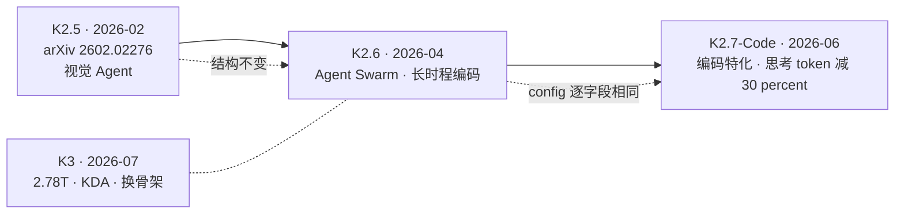

# Kimi K2.6 与 K2.7-Code：同一副 1T 骨架上的两次纯后训练发布

> **来源基线**：
> - 模型卡快照 `raw/01_theory/01_models/moonshot_kimi/Kimi_K2_6_model_card_7eb5002f.md`，对应 [moonshotai/Kimi-K2.6 `7eb5002f`](https://huggingface.co/moonshotai/Kimi-K2.6/tree/7eb5002f)（HF 仓库创建于 2026-04-14）。
> - 模型卡快照 `raw/01_theory/01_models/moonshot_kimi/Kimi_K2_7_Code_model_card_74797c9c.md`，对应 [moonshotai/Kimi-K2.7-Code `74797c9c`](https://huggingface.co/moonshotai/Kimi-K2.7-Code/tree/74797c9c)（HF 仓库创建于 2026-06-11）。
> - 结构数值取自同 revision 的 `config.json` 快照：`Kimi_K2_6_config_7eb5002f.json`、`Kimi_K2_7_Code_config_74797c9c.json`（同目录）。
> - 参数量取自 HuggingFace safetensors 索引（2026-08-27 读取）。
>
> **维度**：开放权重发布分析（模型卡 + 权重配置交叉核对）。
> **更新**：2026-08-27。

> [!note]
> 两个版本都**没有技术报告**——K2.6 只有一篇 [Tech Blog](https://www.kimi.com/blog/kimi-k2-6.html)（`K2.6 模型卡 :36`），K2.7-Code 连博客链接都没有。这与 [[13_kimi_k2_5_analysis|K2.5]]（arXiv:2602.02276）和 [[14_kimi_k3_analysis|K3]]（技术报告）不同。**本页只能覆盖"发了什么"，覆盖不了"怎么训的"。**

---

## 一、中央论点：Moonshot 在 K2 骨架上做了三连发，结构一次没动

把 K2.5 / K2.6 / K2.7-Code 三者的结构并排，会看到一条极其克制的产品线：

| | [[13_kimi_k2_5_analysis\|K2.5]] | **K2.6** | **K2.7-Code** |
|---|---|---|---|
| 发布 | 2026-02 | 2026-04-14 | 2026-06-11 |
| 总参数 | 1.04T | 1T（卡片）／**1026.9B**（实测） | 1T（卡片）／**1026.9B**（实测） |
| 激活参数 | 32B | 32B | 32B |
| 层数 / dense 层 | — | 61 / 1 | 61 / 1 |
| 专家 / 每 token 选 | 384 / 8 | 384 / 8 + 1 shared | 384 / 8 + 1 shared |
| 注意力 | MLA | MLA | MLA |
| 视觉编码器 | MoonViT-3D（SigLIP-SO-400M 初始化） | MoonViT / 400M | MoonViT / 400M |
| 上下文 | 256K | 256K | 256K |

厂商自己把这一点说得毫不含糊：**"Kimi-K2.6 has the same architecture as Kimi-K2.5"**（`K2.6 模型卡 :409`）、**"Kimi-K2.7-Code has the same architecture as Kimi-K2.5/Kimi-K2.6"**（`K2.7 模型卡 :158`）。

而 `config.json` 给出了比这更强的证据：

> [!note]
> **K2.6 与 K2.7-Code 的 `config.json` 逐字段完全相同**，safetensors 索引报告的参数量也**同为 1026.9B**（磁盘同为 554.3 GiB，dtype 分布同为 `I32 = 1014.7B` + `BF16 = 12.2B`）。两者是同一副权重骨架上的**两次不同后训练**，不是两个模型。

因此这条线的主线是：**能力增长全部来自后训练，而后训练配方全部未披露。** 这是本页所有结论的共同前提，也是它最大的局限。

---

## 二、结构核对：卡片摘要 vs `config.json`

K2.6 模型卡给了一张 Model Summary 表（`:56-71`）。逐条对配置核验：

| 卡片声称 | 值 | 配置字段（`text_config`） | 配置值 | 对账 |
|---|---|---|---|:---:|
| 层数（含 dense） | 61 | `num_hidden_layers` | 61 | ✅ |
| dense 层数 | 1 | `first_k_dense_replace` | 1 | ✅ |
| 注意力 hidden | 7168 | `hidden_size` | 7168 | ✅ |
| MoE 每专家 hidden | 2048 | `moe_intermediate_size` | 2048 | ✅ |
| 注意力头数 | 64 | `num_attention_heads` | 64 | ✅ |
| 专家数 | 384 | `n_routed_experts` | 384 | ✅ |
| 每 token 选专家 | 8 | `num_experts_per_tok` | 8 | ✅ |
| shared 专家 | 1 | `n_shared_experts` | 1 | ✅ |
| 词表 | 160K | `vocab_size` | 163840 | ✅（160K = 163840 的取整） |
| 上下文 | 256K | `max_position_embeddings` | 262144 | ✅ |
| 注意力机制 | MLA | `kv_lora_rank` / `q_lora_rank` | 512 / 1536 | ✅ |
| 总参数 | 1T | safetensors 索引 | 1026.9B | ✅ |

**十二项全中。** 另外配置里还有卡片没提的 `rope_theta = 50000.0`、`intermediate_size = 18432`（dense 层 FFN 宽度）。

`model_type` 是 `kimi_k25`（外层）/ `kimi_k2`（`text_config`）——**连模型类型标识都还叫 K2.5**，是"同骨架"最直白的注脚。

---

## 三、K2.6：把横向扩展（Agent Swarm）作为主要卖点

### 3.1 声称

模型卡把 K2.6 定位为"open-source, native multimodal agentic model"，四个关键能力里最具体的一条是 **Agent Swarm**（`:45`）：

> 横向扩展到 **300 个子 agent**、执行 **4,000 个协同步骤**，动态把任务拆成并行的、领域特化的子任务，在一次自主运行里交付从文档到网站到表格的端到端产物。

其余三条（长时程编码、编码驱动设计、7×24 主动编排）都是能力描述，没有可核验的量化指标。

### 3.2 证据：与 K2.5 同表对比

K2.6 卡片的评测表把 K2.5 放在最后一列（`:85`），这是本页唯一**同厂同表**的可比数据（`:93-231`）：

| 基准 | K2.6 | K2.5 | 差 |
|---|---:|---:|---:|
| MCPMark | 55.9 | 29.5 | **+26.4** |
| Toolathlon | 50.0 | 27.8 | **+22.2** |
| APEX-Agents | 27.9 | 11.5 | **+16.4** |
| Terminal-Bench 2.0 (Terminus-2) | 66.7 | 50.8 | +15.9 |
| BrowseComp | 83.2 | 74.9 | +8.3 |
| SWE-Bench Pro | 58.6 | 50.7 | +7.9 |
| WideSearch (item-f1) | 80.8 | 72.7 | +8.1 |
| OSWorld-Verified | 73.1 | 63.3 | +9.8 |
| DeepSearchQA (accuracy) | 83.0 | 77.1 | +5.9 |
| HLE-Full (w/ tools) | 54.0 | 50.2 | +3.8 |
| SWE-Bench Verified | 80.2 | 76.8 | +3.4 |
| SciCode | 52.2 | 48.7 | +3.5 |

**读法**：提升幅度呈现清晰的梯度——**工具使用类（MCPMark / Toolathlon / APEX-Agents）涨得最猛（+16 到 +26）**，软件工程类中等（+3 到 +8），而知识/科学推理类（HLE、SciCode）几乎只是噪声级。在结构完全不变的前提下，这个形状指向**后训练的重心压在工具调用与 agent 编排上**。

一个只有 K2.6 有、K2.5 没有的条目值得单列：**BrowseComp (Agent Swarm) = 86.3**，高于其常规 BrowseComp 的 83.2（`:109-111`）。这是 Agent Swarm 声称的唯一量化证据。

> [!contradiction]
> **"300 个子 agent / 4,000 步"不是被测出来的，是能力上限声明。** 卡片给出的 Agent Swarm 量化结果只有 BrowseComp 一项（86.3 vs 83.2，+3.1）。**没有**任何数据说明 300 / 4,000 这两个数字下的成功率、成本或失败模式，也没有 swarm 规模与效果的关系曲线。引用时应写成"厂商声称可横向扩展至 300 子 agent"，而不是"K2.6 能稳定协同 300 个 agent"。

---

## 四、K2.7-Code：编码特化，并且把思考 token 砍掉三成

### 4.1 声称

> Kimi K2.7 Code 是**基于 Kimi K2.6** 构建的编码特化 agentic 模型……在强化端到端任务完成能力的同时提升 token 效率，**相比 K2.6 减少约 30% 的思考 token**。（`K2.7 模型卡 :35`）

这条"减 30% 思考 token"是本页最值得记的一句：它把优化目标从**质量**明确挪到了**质量 ÷ 成本**。在长时程 agent 场景里，思考 token 直接决定单任务开销与延迟，这个方向比再涨几个点更有工程价值。

### 4.2 证据：与 K2.6 同表对比（`K2.7 模型卡 :63-145`）

| 基准 | K2.7-Code | K2.6 | 差 |
|---|---:|---:|---:|
| Kimi Code Bench v2 | **62.0** | 50.9 | +11.1 |
| MLS Bench Lite | **35.1** | 26.7 | +8.4 |
| MCPMark Verified | **81.1** | 72.8 | +8.3 |
| MCP Atlas | **76.0** | 69.4 | +6.6 |
| Program Bench | **53.6** | 48.3 | +5.3 |
| Kimi Claw 24/7 Bench | **46.9** | 42.9 | +4.0 |

**六项全涨，且编码类涨幅最大**——与"编码特化"的定位一致。

### 4.3 边界

- **30% 这个数字没有测量口径**：没说在哪些任务上测、怎么定义"思考 token"、是均值还是中位数、方差多大。
- **上表六项全部是编码/agent 类**，卡片**没有给任何通用能力基准**。因此**无法判断编码特化是否以通用能力退化为代价**——这是特化模型最需要回答、而这份卡片完全回避的问题。
- 评测条件：K2.7-Code 与 K2.6 均通过 Kimi Code CLI、开启 thinking、`temperature=1.0, top_p=0.95`、262,144 上下文（`:104`）。**同厂同 harness，两列之间可比性好**；但表中 GPT-5.5（Codex，xhigh）与 Opus 4.8（Claude Code，xhigh）跑在各自 harness 上，**跨列不可比**。

### 4.4 一个部署侧的硬约束

**K2.7-Code 强制 `thinking` 与 `preserve_thinking` 为 `True`**（`:168`），不可关闭。这与 K2.6 不同，也意味着它**不能用于需要低延迟无思考输出的场景**——在集成时是个硬性前提，而不是可调选项。

---

## 五、共同的工程属性

| 属性 | 说明 | 出处 |
|---|---|---|
| **原生 INT4 量化** | 两者都沿用 Kimi-K2-Thinking 的原生 INT4 方案 | `K2.6 :398`、`K2.7 :147` |
| 权重 dtype | `I32 = 1014.7B` + `BF16 = 12.2B`（INT4 打包进 int32 容器） | safetensors 索引 |
| 磁盘 | 554.3 GiB（两者相同） | 同上 |
| 推理引擎 | vLLM / SGLang / KTransformers | `K2.6 :404-407`、`K2.7 :153-156` |
| transformers 版本 | `>=4.57.1, <5.0.0` | `K2.6 :411`、`K2.7 :160` |
| 许可证 | Modified MIT | `K2.6 :28` |
| 部署复用 | 直接复用 K2.5 的部署方式 | `K2.6 :409`、`K2.7 :158` |

**1T 参数只占 554 GiB**，正是原生 INT4 的直接结果——作为对照，同量级的 [[11_glm_5_1_5_2_analysis|GLM-5.1]]（753.9B，BF16）占 1404 GiB。**参数量少 27%，磁盘却是 2.5 倍。** 这是 Moonshot 这条产品线最实在的部署优势。

---

## 六、未披露边界

- 两版均无技术报告；后训练配方、RL 算法、数据、训练算力全部未知，而**能力提升只能由它们解释**。
- K2.6 的 Agent Swarm 只有一项量化证据（§3.2 反驳栏）。
- K2.7-Code 的 −30% 思考 token 无测量口径；**通用能力是否退化无数据**（§4.3）。
- 两版都没有公布相对 K2.5 的预训练是否有变化（卡片只说"架构相同"，**架构相同不等于底座权重相同**——是否继续预训练过，未说明）。
- 无第三方独立复测。

---

## 关联页面

- [[13_kimi_k2_5_analysis]] — K2.5，本页两版的结构起点（arXiv:2602.02276）。
- [[11_kimi_k2_analysis]] — K2，1T MoE 与 Moonlight 架构的源头。
- [[14_kimi_k3_analysis]] — K3：**换了骨架**（2.78T、KDA、AttnRes），与本页这条"冻结骨架"路线形成对照。
- [[12_kimi_linear_analysis]] · [[20_gdn_kda_linear_attention_analysis]] — KDA；[[12_glm_5_3_flash_analysis|GLM-5.3-Flash]] 已把它用进自己的底座。
- [[01_theory/01_models/index|模型架构与模型家族总索引]]
