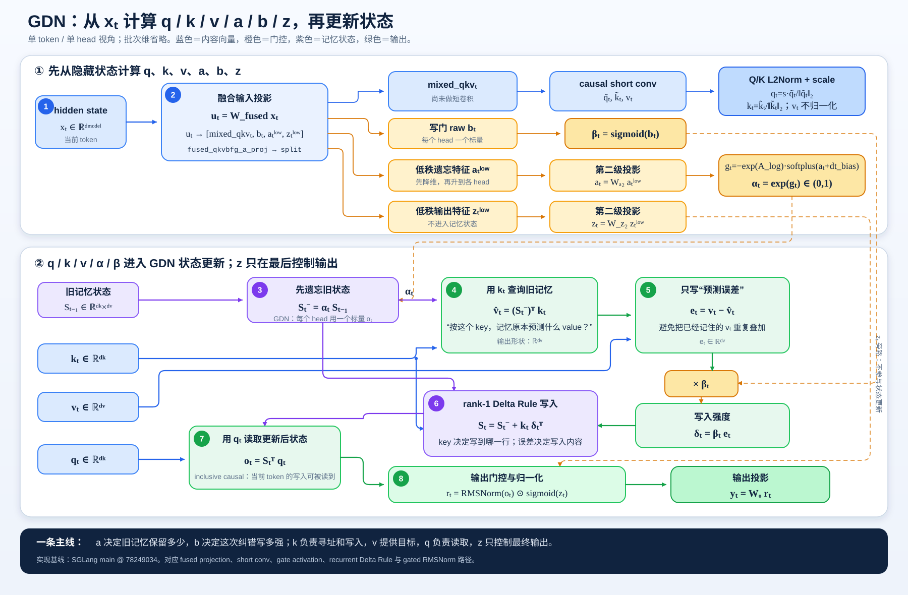

# GDN 与 KDA 线性注意力：从 QKVABZ、循环状态到 Chunkwise 等价性

> **核心来源**：Gated Delta Networks，arXiv 2412.06464v3；Kimi Linear，arXiv 2510.26692v2
> **更新日期**：2026-07-17
> **实现伴读**：[[21_gdn_kda_kernel_implementation_analysis]]
> **约定**：正文统一令状态 $S_t\in\mathbb{R}^{d_k\times d_v}$。部分论文或 kernel 以 $d_v\times d_k$ 存储，公式会整体转置，但算法不变。

---

## 一、先抓住本质：它是“带矩阵记忆的 RNN”，不是缩小版 Softmax

GDN（Gated DeltaNet）和 KDA（Kimi Delta Attention）的共同核心是：把截止当前 token 的历史压缩到固定形状的矩阵状态 $S_t$，每一步先更新状态，再用查询 $q_t$ 读取：

$$
S_t=F(S_{t-1},x_t),\qquad o_t=G(S_t,q_t).
$$

这里的 $t$ 是**序列中的全局因果 token 位置**，不是训练 step、物理时间或 chunk 编号。因而它们确实存在 RNN 循环：$S_t$ 依赖 $S_{t-1}$，Decode 时不能跨越未知的未来 token。

与 MHA 的核心区别不是“有没有 QKV”，而是**历史存在哪里、读取谁**：

| 机制 | 历史表示 | 第 $t$ 步读取 | 随上下文增长的缓存 | 并行方式 |
|---|---|---|---|---|
| MHA | 显式保存所有历史 $K_{\le t},V_{\le t}$ | $\operatorname{softmax}(q_tK_{\le t}^{\top})V_{\le t}$ | 线性增长 | 训练时构造 $T\times T$ 交互 |
| GDN | 固定矩阵状态 $S_t$ | $S_t^{\top}q_t$ | 常数形状 | 递推；训练时用 chunkwise 重排 |
| KDA | 固定矩阵状态 $S_t$ | $S_t^{\top}q_t$ | 常数形状 | 同上，但遗忘门更细粒度 |

所以，GDN/KDA 的线性复杂度来自“每个 token 只与固定大小状态交互”，代价是历史被压缩后不能像 MHA 那样逐 token 精确回看。GDN 论文将门控与 delta rule 视为互补：前者负责快速清理记忆，后者负责定向修改关联（GDN §3.1，p4，Eq. 10）；KDA 再把遗忘从每头一个标量细化为每个 key 通道一个值（Kimi Linear §2.2，p3–4，Eq. 1）。

---

## 二、从输入开始：$x_t\rightarrow q,k,v,a,b,z$

上图里的六路信号不是六种“注意力分数”，而是三个内容向量与三类控制信号：

| 信号 | 典型来源 | 作用位置 | 直觉 |
|---|---|---|---|
| $q_t$ | $x_tW_q$，再经因果短卷积、SiLU、L2Norm | 状态读取 | “我现在要找什么” |
| $k_t$ | $x_tW_k$，再经因果短卷积、SiLU、L2Norm | 状态寻址和误差预测 | “这条记忆写到哪个方向” |
| $v_t$ | $x_tW_v$，再经因果短卷积、SiLU | 写入目标 | “要记住什么内容” |
| $a_t$ | 遗忘门投影 | 先变成 $g_t=\log\alpha_t$，再作用于 $S_{t-1}$ | “旧记忆保留多少” |
| $b_t$ | 写门投影 | $\beta_t=\sigma(b_t)$ | “本次纠错写多大步” |
| $z_t$ | 输出门投影 | 状态读出后的 gated RMSNorm | “当前输出露出多少” |

> [!important] 原始 GDN 与 Kimi/KDA 实现不能混写
> - **原始 GDN**：$\alpha_t$ 是每个 head 一个标量；$a_t,b_t$ 直接线性投影；输出门在论文/FLA 基线中使用 SiLU。见 GDN §3.4，p6–7；FLA `fla/layers/gated_deltanet.py:145-149,195-200,307-359`。
> - **KDA**：$\alpha_t\in\mathbb{R}^{d_k}$ 是逐 key 通道向量；遗忘门与输出门采用低秩两级投影；输出门用 sigmoid。见 Kimi Linear §2.2，p4，Eq. 1；§2.3，p6，Eq. 10；FLA `fla/layers/kda.py:166-191,250-309`。
> - 因而“QKVABZ”适合表达共同数据流，但 $a,z$ 的维度、投影布局和激活必须按具体模型区分。

### 2.1 为什么 Q/K 有短卷积和 L2Norm，V 没有 L2Norm

GDN/KDA 没有用 Softmax 权重矩阵显式表达邻近位置关系，因果 short conv 为 Q/K/V 注入极短程局部模式；GDN 消融显示去掉 short conv 会明显恶化困惑度与平均准确率（GDN Appendix Table S.1，p22）。

Q/K 的范数若任意变化，会同时改变状态转移 $I-\beta kk^{\top}$ 的谱和查询读出尺度。令 $\lVert k_t\rVert_2=1$ 后，$k_t$ 主要表达“地址方向”，更新强度交给 $\beta_t$；V 表达内容幅度，因此不做同样归一化。论文实现描述见 GDN §3.4，p6；参考递推可直接对照 FLA `fla/ops/gated_delta_rule/naive.py:40-59` 与 `fla/ops/kda/naive.py:51-63`。

---

## 三、$a,b,z$ 为什么这样设计

### 3.1 $a_t$ 不是最终门值，而是生成“负的对数保留率”

当前常见实现采用 Mamba2 风格参数化：

$$
g_t=-\exp(A_{\log})\operatorname{softplus}(a_t+dt_{\text{bias}}),
\qquad \alpha_t=\exp(g_t).
$$

因为 $\exp(A_{\log})>0$ 且 $\operatorname{softplus}(\cdot)>0$，所以 $g_t<0$、$0<\alpha_t<1$。这带来三个直接好处：

1. **稳定约束内生化**：模型天然输出衰减而不是放大，不依赖训练后裁剪；
2. **可学习时间尺度**：$A_{\log}$ 控制每头的基准衰减速度，$a_t$ 让当前 token 动态调节；
3. **适合 chunk 并行**：乘积 $\prod_j\alpha_j$ 变成 $\exp(\sum_jg_j)$，可用 chunk-local prefix sum 计算。

原始 GDN 论文在 §3.4 脚注 4（p6）说明使用 Mamba2 参数化；当前 FLA GDN 层在 `fla/layers/gated_deltanet.py:151-168,315-324` 将 raw gate、$A_{\log}$、`dt_bias` 传入 kernel；KDA 同类参数见 `fla/layers/kda.py:174-185,260-277`。

### 3.2 $b_t\rightarrow\beta_t$ 是 Delta Rule 的自适应学习率

$$
\beta_t=\sigma(b_t)\in(0,1).
$$

设遗忘后的状态为 $S_t^-$，它在地址 $k_t$ 上预测的内容是

$$
\hat v_t=(S_t^-)^{\top}k_t.
$$

Delta Rule 不直接累加 $k_tv_t^{\top}$，而是只写预测误差：

$$
e_t=v_t-\hat v_t,\qquad
S_t=S_t^-+\beta_tk_te_t^{\top}.
$$

当 $\lVert k_t\rVert_2=1$ 时，更新后的同址读出满足

$$
S_t^{\top}k_t=(1-\beta_t)\hat v_t+\beta_tv_t.
$$

因此 $\beta_t=0$ 表示不改，$\beta_t=1$ 表示把这个地址的预测完全拉向新值，中间值是稳定插值；矩阵 $I-\beta_tk_tk_t^{\top}$ 沿 $k_t$ 方向的特征值为 $1-\beta_t\in[0,1]$，避免普通梯度步的过冲。GDN §3.2（p5）把该更新解释为在线重构损失上的 SGD，把 $\beta_t$ 解释为自适应学习率。

### 3.3 $z_t$ 是“输出可见性”，不参与记忆修改

KDA 的完整读出近似为：

$$
y_t=W_o\left[\operatorname{RMSNorm}(o_t)\odot
\sigma(z_t)\right],\qquad o_t=S_t^{\top}q_t.
$$

$z_t$ 只控制当前层输出是否露出，不修改 $S_t$。这与 $a_t$ 的职责完全不同：$a_t$ 决定未来还能否读到旧记忆，$z_t$ 只决定当前 token 是否使用已经读出的内容。Kimi Linear 采用低秩 sigmoid 输出门以控制参数量，并在消融中优于无门与 Swish 门（§2.3，p6，Eq. 10；§5.2，p8，Table 1）。原始 GDN 的同位置输出门是线性投影加 SiLU，见 GDN Fig. 1 与 §3.4（p6–7）。

三类门分离后，模型能表达：

| $\alpha$ | $\beta$ | 输出门 | 行为 |
|---|---|---|---|
| 接近 1 | 接近 0 | 任意 | 保留旧记忆，几乎不写 |
| 接近 1 | 较大 | 任意 | 在指定 key 方向做局部替换 |
| 接近 0 | 较大 | 任意 | 先大范围忘记，再写入新内容 |
| 任意 | 任意 | 接近 0 | 状态照常演化，但当前输出隐藏 |

---

## 四、单 token 到底怎么算：五步循环

对一个 batch、一个 head、一个 token，统一写成：

1. **遗忘旧状态**

   $$S_t^-=D_tS_{t-1}$$

2. **在当前 key 地址预测**

   $$\hat v_t=(S_t^-)^{\top}k_t$$

3. **求预测误差**

   $$e_t=v_t-\hat v_t$$

4. **按学习率做 rank-1 修正**

   $$S_t=S_t^-+\beta_tk_te_t^{\top}$$

5. **用 query 读取更新后的状态**

   $$o_t=S_t^{\top}q_t$$

其中：

$$
D_t=
\begin{cases}
\alpha_tI,&\text{GDN，逐 head 标量衰减},\\
\operatorname{Diag}(\boldsymbol\alpha_t),&\text{KDA，逐 key 通道衰减}.
\end{cases}
$$

这是 **inclusive causal read**：当前 token 先写入再读取，所以 $o_t$ 包含当前 token 的贡献。FLA 的逐 token 参考实现逐行对应上述步骤：GDN `fla/ops/gated_delta_rule/naive.py:50-59`，KDA `fla/ops/kda/naive.py:59-63`。

把误差项展开，可得统一仿射递推：

$$
S_t=A_tS_{t-1}+B_t,
$$

其中

$$
A_t=(I-\beta_tk_tk_t^{\top})D_t,
\qquad B_t=\beta_tk_tv_t^{\top}.
$$

于是：

$$
\boxed{S_t=\alpha_t(I-\beta_tk_tk_t^{\top})S_{t-1}+\beta_tk_tv_t^{\top}}
\quad\text{GDN}
$$

$$
\boxed{S_t=(I-\beta_tk_tk_t^{\top})\operatorname{Diag}(\boldsymbol\alpha_t)S_{t-1}+\beta_tk_tv_t^{\top}}
\quad\text{KDA}
$$

GDN 的 $\alpha_t$ 是标量，因此可与左侧矩阵交换；KDA 的对角矩阵一般**不能**与 $I-\beta kk^{\top}$ 交换，这正是 KDA 更强、实现也更复杂的来源。论文原式见 GDN §3.1，p4，Eq. 10；Kimi Linear §2.2，p4，Eq. 1。

---

## 五、Chunk size 与 $t$ 的关系

### 5.1 $C$ 只是计算分块，不是记忆长度

设 chunk size 为 $C$。对从 1 开始编号的全局 token $t$：

$$
n=\left\lfloor\frac{t-1}{C}\right\rfloor,
\qquad r=((t-1)\bmod C)+1,
\qquad t=nC+r.
$$

- $n$：token 属于第几个 chunk；
- $r$：token 在 chunk 内的位置；
- $C$：一次 kernel tile 处理多少个连续 token。

$C$ 不是 context window、batch size 或状态重置周期。chunk 末状态会成为下一 chunk 的初始状态，最后不足 $C$ 的部分只做 mask/padding 处理。Kimi Linear §2.1（p3）用 $\Box_{[n]}^r=\Box_{nC+r}$ 定义同一关系；当前 SGLang GDN/KDA prefill 固定使用 $C=64$，实现定位见 [[21_gdn_kda_kernel_implementation_analysis]]。

### 5.2 为什么分块后数学上仍等价

从仿射递推

$$S_t=A_tS_{t-1}+B_t$$

出发。若一个 chunk 从状态 $S_s$ 开始，则 chunk 内第 $r$ 步：

$$
S_{s+r}=\Phi_{r:1}S_s+
\sum_{i=1}^{r}\Phi_{r:i+1}B_{s+i},
$$

其中

$$
\Phi_{r:i}=A_{s+r}A_{s+r-1}\cdots A_{s+i},
\qquad \Phi_{r:r+1}=I.
$$

以 $C=3$ 为例：

$$
\begin{aligned}
S_1&=A_1S_0+B_1,\\
S_2&=A_2A_1S_0+A_2B_1+B_2,\\
S_3&=A_3A_2A_1S_0+A_3A_2B_1+A_3B_2+B_3.
\end{aligned}
$$

这与逐 token 循环完全是同一个多项式，只是重新组织了括号和批量矩阵乘法。chunk kernel 不仅算最终 $S_3$，还必须生成 $S_1,S_2$ 对应的所有输出 $o_1,o_2,o_3$。

### 5.3 每个 chunk 总结的是仿射变换，不是单独一个“可相乘状态”

一个 chunk 可概括为：

$$
S_{\text{out}}=P_{\text{chunk}}S_{\text{in}}+R_{\text{chunk}}.
$$

若前后两个 chunk 的摘要分别为 $(P_1,R_1)$、$(P_2,R_2)$，按时间顺序复合：

$$
(P_2,R_2)\circ(P_1,R_1)
=(P_2P_1,\;P_2R_1+R_2).
$$

所以更准确的说法是：**分块后按顺序复合仿射状态转移**。不是把 chunk 末尾的 $S$ 彼此相乘，也不只依赖矩阵乘法结合律；还用到了分配律来传播写入项 $R$。

### 5.4 是否必须按顺序

必须保持因果顺序，但不必保持串行括号：

$$
T_4\circ T_3\circ T_2\circ T_1
$$

一般不等于任意换序后的结果，因为矩阵乘法和仿射复合不满足交换律；但满足结合律，所以可以改成平衡树或 ordered prefix scan。训练/Prefill 已知整段 token，可以先并行构造各 chunk 摘要，再做**保序扫描**得到每块初态；Decode 的未来 token 未知，仍必须按 token 递推。

---

## 六、为什么真实 kernel 不显式构造所有 $A_t$

直接形成每个 $d_k\times d_k$ 的 $A_t$ 会抵消线性注意力的效率。GDN/KDA 利用两种结构：

### 6.1 衰减乘积变 prefix sum

$$
\gamma_{i\rightarrow r}
=\prod_{j=i+1}^{r}\alpha_j
=\exp\left(\sum_{j=i+1}^{r}g_j\right).
$$

因此 raw $a$ 的激活、$g=\log\alpha$ 与 chunk-local cumsum 可以融合；同一前缀和还可生成任意 chunk 内区间的衰减比值。

### 6.2 Rank-1 更新乘积变 compact WY

令 $H_t=I-\beta_tk_tk_t^{\top}$。连续 Householder-like rank-1 变换可写成 compact WY 形式：

$$
H_rH_{r-1}\cdots H_1=I-W^{\top}K.
$$

一种等价的三角系统写法是：

$$
T=\left[I+\operatorname{strictLower}
\left(\operatorname{Diag}(\beta)KK^{\top}\right)\right]^{-1}
\operatorname{Diag}(\beta),
$$

$$
W=TK,\qquad U=TV.
$$

GDN 在此基础上加入标量 decay ratio；KDA 的 $D_t=\operatorname{Diag}(\alpha_t)$ 与 rank-1 项不交换，因此论文把转移识别为受约束 DPLR，并推导专用 WY/UT 表示，避免落入通用 DPLR 的更多中间矩阵与 GEMM（Kimi Linear §2.2，p4–5，Eq. 2–8；GDN §3.3，p6）。真实训练/Prefill kernel 因而通常分成：门前缀和、chunk 内 KKT/三角解与 W/U、chunk 间状态扫描、chunk 内所有输出，而不是一个朴素 for-loop。

---

## 七、GDN 与 KDA 的设计取舍

| 维度 | GDN | KDA | 影响 |
|---|---|---|---|
| 遗忘门 | 每 head 标量 $\alpha_t$ | 每 key 通道向量 $\boldsymbol\alpha_t$ | KDA 能同时保留长时通道并快速清空短时通道 |
| 状态转移 | 标量 decay 与 rank-1 更新可交换 | 对角 decay 与 rank-1 更新一般不交换 | KDA 表达力更强，chunk 推导更复杂 |
| 遗忘投影 | 直接线性投影 | 低秩两级投影 | 控制逐通道门的参数量 |
| 输出门 | 原始基线为 SiLU | 低秩 sigmoid | KDA 与 forget gate 形成对称的有限范围控制 |
| 记忆大小 | $O(d_kd_v)$ | $O(d_kd_v)$ | 二者 Decode 状态均不随上下文增长 |
| 训练并行 | chunkwise WY | 专用 DPLR/WY/UT | 二者都保持逐 token 递推的数学语义 |

Kimi Linear 在合成 stack/recall 任务中报告 KDA 的逐通道 decay 优于 GDN，并把提升归因于有限状态内更细粒度的记忆分配（§5.2，p8，Table 1 与 Fig. 3）。但 KDA 仍是有限状态压缩，不能把“线性时间”理解为“无损保留任意长历史”。Kimi Linear 最终采用 KDA:MLA=3:1 的混合架构，正是用周期性全注意力补足显式 token-token 交互，详见 [[12_kimi_linear_analysis]]。

---

## 八、常见误解速查

1. **“$t$ 是 RNN 训练步吗？”** 不是，是当前序列的 token 位置。
2. **“chunk size 决定能记多少 token 吗？”** 不决定；它决定 kernel tile，状态跨 chunk 延续。
3. **“每块只算一个状态，最后把状态矩阵乘起来？”** 不准确；每块产生仿射摘要 $(P,R)$ 和块内所有 prefix 输出。
4. **“有结合律，所以 chunk 可任意调序？”** 不可以；只能改括号，不能改变因果顺序。
5. **“Prefill 分块以后就不是原 RNN 了？”** 数学上仍是同一递推的闭式展开；浮点舍入顺序可能造成小差异。
6. **“$z$ 小等于忘掉了状态？”** 不等于；$z$ 只隐藏当前输出，$S_t$ 仍可供未来 token 使用。
7. **“GDN 与 KDA 都是向量遗忘门？”** 原始 GDN 是标量，KDA 才是逐 key 通道向量。

---

## 九、来源与核验定位

| 来源 | 版本 | 关键定位 |
|---|---|---|
| [Gated Delta Networks](https://arxiv.org/abs/2412.06464v3) | 2412.06464v3，2025-03-06 | §3.1 p4 Eq. 10；§3.2 p5；§3.3–3.4 p6；Fig. 1 p7；Table S.1 p22 |
| [Kimi Linear](https://arxiv.org/abs/2510.26692v2) | 2510.26692v2，2025-11-01 | §2.1 p3；§2.2 p3–5 Eq. 1–8；§2.3 p6 Eq. 10；§5.2 p8 Table 1 |
| [FLA reference recurrence](https://github.com/fla-org/flash-linear-attention/tree/ccb0ff944cbff035fa59ac47a4cc8fd2e079bb17/fla/ops) | `ccb0ff944cbf`，核验于 2026-07-17 | `gated_delta_rule/naive.py:13-64`；`kda/naive.py:12-66` |
| 本库原始论文 | 本地快照 | `raw/01_theory/01_models/moonshot_kimi/Gated_Delta_Networks-2412.06464v3.pdf`；`Kimi_Linear_Attention-2510.26692.pdf` |

## Related Pages

- [[21_gdn_kda_kernel_implementation_analysis]] — 训练、Prefill、Decode 的当前融合 kernel
- [[12_kimi_linear_analysis]] — Kimi Linear 混合架构、实验与模型级结论
- [[22_kimi_k3_architecture_deepdive]] — QKVABZ 图在 Kimi K3 架构中的落地
- [[attention_is_all_you_need_analysis]] — MHA 与显式 token-token 注意力
- [[23_kimi_k3_infra_deepdive]] — KDA prefix cache 与推理基础设施
