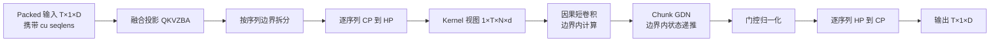

# GDN/KDA 融合 Kernel：训练、Prefill 与 Decode 的实现拆解

> **更新日期**：2026-07-17
> **原理前置**：[[20_gdn_kda_linear_attention_analysis]]
> **训练实现基线**：flash-linear-attention `main@ccb0ff944cbff035fa59ac47a4cc8fd2e079bb17`
> **推理实现基线**：SGLang `main@7824903417b7398ffaf9befe8a221080627e152f`
> **TND/THD 集成基线**：Megatron-LM `dev@232c478d43ce2f8b4c8db3507d3623fa82f55823`
> “当前”只指以上已核验 commit；后续 kernel 分解、backend 和 chunk size 都可能变化。

---

## 一、结论先行：训推不是同一个 kernel 形态

| 场景 | 已知 token 数 | 最合适计算形态 | 状态依赖如何处理 | 当前实现重点 |
|---|---|---|---|---|
| 训练 forward | 整段已知 | Chunkwise | chunk 内并行，chunk 间保序 scan | 保存或重算反向所需中间量 |
| 训练 backward | 整段梯度已知 | 反向 chunkwise | 反向状态传播加局部 GEMM | 融合梯度 kernel、重算换显存 |
| Prefill/Extend | 整段 prompt 已知 | Chunkwise forward | 同训练 forward，但不要 autograd | 变长批、状态池写回、减少 launch |
| Decode | 通常每请求 1 个新 token | Fused recurrent | 真正逐 token 更新 | 一次 kernel 内完成门、归一化、状态读写 |
| Speculative verify | 一次若干候选 token | Recurrent 加中间态缓存 | 保留候选父子状态 | 验证失败后选中正确状态 |

因此“融合 kernel”要分三层理解：

1. **投影融合**：把生成 Q/K/V/$\beta$/forget/output gate 的多个线性层合并；
2. **数学子阶段融合**：例如 gate activation+cumsum，或 KKT+三角解+W/U 重构；
3. **整步递推融合**：Decode 中把 decay、delta update、read、state cache 写回放进同一 Triton program。

Prefill/训练通常仍由数个大 kernel 组成，不是把整层塞进一个不可分割的 kernel；Decode 每步工作量小，才更适合单 kernel 贯穿。

---

## 二、训练：FLA 的 Autograd Chunk Pipeline

### 2.1 Layer 前端先生成 QKVABZ

当前 FLA GDN 层的 Q/K/V、raw forget gate $a$、raw write gate $b$ 是独立线性投影；Q/K/V 可接 causal short conv+SiLU，输出再过 gated RMSNorm（`fla/layers/gated_deltanet.py:145-200,300-363`）。KDA 把逐通道 forget gate 与输出 gate 都做成低秩两级投影，输出门为 sigmoid（`fla/layers/kda.py:142-192,246-311`）。

层代码把 raw gate 传入算子，并打开：

- `use_qk_l2norm_in_kernel=True`；
- `use_gate_in_kernel=True`；
- `use_beta_sigmoid_in_kernel=True`。

这意味着 L2Norm、$a\rightarrow g$ 和 $b\rightarrow\beta$ 不必在层外各自产生完整中间张量。GDN 调用见 `fla/layers/gated_deltanet.py:310-345`，KDA 调用见 `fla/layers/kda.py:258-297`。

### 2.2 Forward 不是 token for-loop，而是四段结构化计算

以 GDN 为例，`chunk_gated_delta_rule_fwd` 的调用链是：

1. **门激活与局部前缀和**：`gdn_gate_chunk_cumsum` 把 raw $a$ 变成 $g=\log\alpha$ 并同时计算 chunk-local cumsum；
2. **chunk 内 WY 准备**：融合 KKT、`solve_tril`、`recompute_w_u`，得到 compact WY 的 $W,U$ 和三角中间量；
3. **chunk 间状态扫描**：`chunk_gated_delta_rule_fwd_h` 由每块初态计算中间状态和末态；
4. **chunk 内所有输出**：`chunk_fwd_o` 用 $q$、块初态和局部修正生成每个 token 的 $o_t$。

源码顺序见 FLA `fla/ops/gated_delta_rule/chunk.py:33-123`。KDA 的对应 forward 在 `fla/ops/kda/chunk_fwd.py:20-126`：先 `kda_gate_chunk_cumsum`，再 `chunk_kda_fwd_intra` 生成 $W,U,q_g,k_g,A_{qk},A_{kk}$，然后复用状态扫描，最后用 `chunk_gla_fwd_o_gk` 产出全部 prefix 输出。

KDA 的“专用 DPLR”在实现层体现为两个不同的 chunk 内相关矩阵：

- $A_{kk}$：构造转移/WY；
- $A_{qk}$：构造当前 chunk 的所有查询输出。

这正对应论文 Eq. 2–8 中将状态转移和输出展开分开处理，而不是显式构造每个 $A_t=(I-\beta kk^\top)\operatorname{Diag}(\alpha)$。

### 2.3 Autograd wrapper 保存什么

KDA 的 `ChunkKDAFunction.forward` 在 `fla/ops/kda/chunk.py:24-119`：

- 可在 kernel 内做 Q/K L2Norm 与 $\beta$ sigmoid；
- 变长序列根据 `cu_seqlens` 一次生成 `chunk_indices`；
- forward 返回输出与可选 final state；
- 为 backward 保存 $q,k,v$、门前缀和、raw gate、$\beta$、$A_{qk},A_{kk}$、$W,U$ 以及状态相关中间量。

GDN 的 wrapper 结构相同，见 `fla/ops/gated_delta_rule/chunk.py:253-390`。两者都以 `torch.autograd.Function` 封装，而 SGLang 的推理副本只有 forward；这是判断“训练 kernel”与“推理 kernel”最直接的代码边界。

### 2.4 Backward 如何融合，以及为什么要重算

GDN backward 的主链在 `fla/ops/gated_delta_rule/chunk.py:126-250`：

1. 从 forward 保存的三角量重算 $W,U$；
2. 重算 chunk 状态 $h$ 与修正后的 $v_{new}$；
3. 计算输出局部梯度；
4. 反向扫描状态梯度；
5. 融合计算 $dq,dk,dw,dg$；
6. 反传 WY 表示得到额外 $dk,dv,d\beta,dg$；
7. 对 $g$ 做 reverse chunk-local cumsum，再反传 gate activation 得到 $da,dA_{\log},d(dt\_bias)$。

KDA backward 在 `fla/ops/kda/chunk_bwd.py:419-590`：默认 `disable_recompute=False` 时重算 gate 前缀、$W,U,q_g,k_g$ 与 chunk 状态；随后把 $dA_{qk}$/$dv$、反向状态 scan、WY+$dq/dk/dg/d\beta$ 融合和 KDA intra 反向拆成大粒度 kernel。`disable_recompute=True` 可保留更多 forward 中间量，换取更少计算但更多显存。

重算的原因不是数学必须，而是工程权衡：长序列下保存每个 chunk 的全部 $W,U,h,v_{new}$ 会增加激活显存；这些量可由 $q,k,v,g,\beta$ 和少量三角量重建，通常值得用额外 FLOPs 换 HBM 容量与带宽。

### 2.5 当前训练 chunk size

在基线 commit 上：

| 算子 | 默认 $C$ | 允许值 | 源码 |
|---|---:|---|---|
| GDN chunk | 64 | 16、32、64 | `fla/ops/gated_delta_rule/chunk.py:278,534-536` |
| KDA chunk | 64 | 32、64 | `fla/ops/kda/chunk.py:49,390-392` |

$C$ 是 tile/autotune 选择，不改变 [[20_gdn_kda_linear_attention_analysis#五、Chunk size 与 t 的关系|逐 token 递推语义]]。不同 GPU、head dim、序列长度与 backend 可能选择不同 $C$；不能把论文伪代码的 64 当作模型超参数写死。

---

## 三、Prefill/Extend：SGLang 如何把模型前端和 Chunk Kernel 接起来

### 3.1 Kimi Linear 的 QKVABZ 投影融合

SGLang 的 KDA 层在无量化时启用两级投影融合（`sglang/srt/models/kimi_linear.py:191-223,331-366`）：

1. `fused_qkvbfg_a_proj` 一次 merged linear 生成：
   - Q/K/V；
   - raw $b$，即 $\beta$ 的输入；
   - forget gate 与 output gate 的两个低秩第一阶段结果 $f_a,g_a$；
2. `fused_fg_b_proj` 用 batched linear 同时完成 forget/output gate 的第二阶段投影；
3. Q/K/V 的 causal conv 由后续 linear-attention backend 处理；
4. attention 核心输出后，`FusedRMSNormGated` 的 sigmoid 模式融合 RMSNorm 与 $z$ 输出门，再做 $W_o$。

这一步减少的是 GEMM/投影 launch 和中间张量，不等于把投影 GEMM、causal conv、状态递推全部合成一个 kernel。量化配置下当前代码回退到独立 `qkv_proj`、`f_a/f_b`、`b_proj`、`g_a/g_b` 路径（`kimi_linear.py:224-277`），因为源码仍标有“support fusion with quant”的 TODO（`:196-197`）。

### 3.2 Prefill 的门处理为何与 Decode 不同

`kimi_linear.py:384-405` 明确区分：

- Prefill：raw forget gate reshape 为逐 head、逐 key 通道张量；$\beta$ 在层侧先做 sigmoid；raw forget gate 传入 `chunk_kda_fwd`，在 `kda_gate_chunk_cumsum` 中融合激活与 cumsum；
- Decode：raw $a,b$ 直接交给 fused recurrent kernel，由它内部完成 softplus/exp 和 sigmoid。

原因是 Prefill 后续本来就需要整块的 $g$ 前缀和，适合把 gate activation 与 scan 合并；Decode 通常只有一个 token，不需要物化 prefix 张量，直接在状态更新 kernel 的寄存器里算门最省流量。

### 3.3 GDN/KDA Prefill pipeline

SGLang GDN `extend` 调 `chunk_gated_delta_rule`（`linear/kernels/gdn_triton.py:125-154`），KDA `extend` 调 `chunk_kda`（`linear/kernels/kda_triton.py:52-81`）。当前服务侧固定 $C=64$：

- GDN：`fla/chunk.py:24,27-71` 依次做 cumsum、融合 KKT+三角解+W/U、状态 scan、输出；
- KDA：`fla/kda.py:1024-1103` 预先只生成一次 `chunk_indices`，融合 gate activation+cumsum，融合 scaled KKT+三角解+W/U，再做状态 scan 与输出。

`cu_seqlens` 描述同一 packed batch 中每条请求的边界，`prepare_chunk_indices` 用 ceil division 为各序列生成独立 chunk；因此状态不会跨请求串扰，最后的 partial chunk 也按边界 mask。状态池通过 `cache_indices` 将每条请求映射到自己的 recurrent-state slot。

---

## 四、Decode：一个 Triton program 内完成完整递推

### 4.1 通用 GDN/KDA recurrent kernel

SGLang 的 `fused_sigmoid_gating_delta_rule_update` 以 `is_kda` 模板常量复用同一程序。其主循环 `fla/fused_sigmoid_gating_recurrent.py:146-226` 与数学逐行对应：

| kernel 行 | 实现 | 数学 |
|---|---|---|
| 146–150 | load Q/K/V/$b$ | 当前 token 输入 |
| 152–174 | $g=-e^{A_{\log}}\operatorname{softplus}(a+dt_{bias})$，$\beta=\sigma(b)$ | 生成 $\alpha=e^g$ 与写步长 |
| 176–181 | Q/K L2Norm，Q 乘 scale | 稳定寻址与读出尺度 |
| 183–187 | GDN 标量或 KDA 逐行 $S\leftarrow e^gS$ | 遗忘旧状态 |
| 189–193 | $v\leftarrow\beta(v-S^\top k)$ | 预测误差乘写门 |
| 195–196 | $S\leftarrow S+kv^\top$ | rank-1 delta 写入 |
| 198–200 | $o=S^\top q$ | 读取更新后状态 |
| 202–226 | 可选中间态与最终态写回 | cache / speculative verify |

KDA decode 只需在调用处设置 `is_kda=True`（`linear/kernels/kda_triton.py:20-50`）；GDN 设置 false（`gdn_triton.py:94-123,175-189`）。编译期常量使标量 gate 与逐通道 gate 走不同地址/广播路径，而不在 token 循环中做动态 Python 分派。

### 4.2 Decode 真正融合了什么

一个 recurrent kernel 内融合：

- raw $a,b$ 激活；
- Q/K L2Norm 与 query scale；
- recurrent state 从状态池加载；
- decay、预测误差、$\beta$、rank-1 update；
- 当前输出；
- final/intermediate state 写回。

它没有融合前面的投影 GEMM、causal conv、后面的 gated RMSNorm 和 $W_o$。因此“融合完整 attention 递推”是准确的，“整层只有一个 kernel”则不准确。

### 4.3 GDN 的 packed-decode 进一步消除 QKV 拆分

SGLang GDN 还有 `packed_decode` 快路：输入是 conv 后的 packed `mixed_qkv`，kernel 内直接提取 Q/K/V、处理门与递推，避免显式 Q/K/V 中间张量和额外 launch（`linear/kernels/gdn_triton.py:39-92`）。当前基线里 KDA Triton backend 没有同名 packed-decode 方法；KDA 虽已融合前端 QKVABZ 投影，但 attention recurrent 调用仍接收拆分后的 q/k/v/a/b。不要把 GDN 的这项快路泛化为所有 KDA backend 都已经具备。

### 4.4 为什么 Decode 不用 chunk scan

若每轮只有一个新 token，$C=64$ 会得到 63 个空位，构造 KKT、三角矩阵和 WY 的固定成本远大于一次 $d_k\times d_v$ 状态更新。fused recurrent 直接在寄存器/片上缓存中保持状态 tile，顺序执行极短循环。只有 speculative target verify 一次有多个候选 token 时，它才在同一 recurrent kernel 内循环并缓存中间状态，而不是退回训练式 chunk WY（`gdn_triton.py:156-193`）。

---

## 五、Chunk 与 Recurrent 为什么能共用同一个真值

SGLang 的回归测试把 token-by-token `fused_recurrent_gated_delta_rule` 当参考，再与 chunk kernel 的输出和 final state 比较：

- 参考逐 token 路径：`test/registered/attention/test_chunk_gated_delta_rule.py:16-48`；
- chunk 路径：`:50-65`；
- 输出与状态分别 `allclose`：`:99-121`；
- 测试覆盖短于 64 和多 chunk 序列：`:185-203`。

这验证的是实现应满足的工程等价性：相同初态、Q/K/V、门与因果边界下，两条路径产生同一语义的所有输出和末态。由于浮点运算重排，bitwise 完全一致不是目标；测试容差为 `ATOL=2e-2, RTOL=1e-2`（`:18-19`）。数学证明见 [[20_gdn_kda_linear_attention_analysis#5.2 为什么分块后数学上仍等价]]。

---

## 六、实现选择清单：写自己的融合 kernel 时怎么分层

### 6.1 先做正确性 reference

先实现单 token、FP32 state 的五步循环：decay、predict、error、rank-1 update、read。用它作为训练 chunk、Prefill、Decode 的共同 oracle；同时覆盖：

- GDN 标量 $g$ 与 KDA 向量 $g$；
- $T<C$、$T=C$、$T>C$、最后 partial chunk；
- 变长 `cu_seqlens`；
- 非零 initial state；
- 输出与 final state；
- 状态布局 $K\times V$ 与物理存储 $V\times K$ 的转置。

### 6.2 再按场景做三条 kernel 路径

| 路径 | 建议融合边界 | 主要瓶颈 |
|---|---|---|
| Training chunk | gate+cumsum；KKT+tril+W/U；state scan；output；配套 bwd | GEMM 利用率、激活显存、反向重算 |
| Prefill chunk | 同 forward，但直接读写请求状态池 | 变长调度、HBM 流量、kernel launch |
| Decode recurrent | gate+norm+state update+read+cache write | 状态矩阵读写带宽与低 occupancy |

### 6.3 数值与性能上的关键点

1. 门激活和 state accumulation 用 FP32，输出可 cast 回 BF16/FP16；
2. 对 $g$ 做前缀和后用 exp ratio，避免直接长链乘 $\alpha$；
3. Q/K L2Norm 的 epsilon 与 reference 保持一致；
4. $\beta$ sigmoid 只做一次，防止层侧和 kernel 双激活；
5. chunk state 必须保序 scan，不能把非交换的转移乱序 reduction；
6. 变长 batch 的 chunk index 只生成一次并向下游传递；
7. Decode state layout 应围绕连续 load/store 设计，数学公式可通过转置适配；
8. 最后用 recurrent oracle 同时验输出和 final state，不能只验 loss。

---

## 七、源码导航与基线

| 实现 | 文件与定位 | 作用 |
|---|---|---|
| FLA GDN layer | `fla/layers/gated_deltanet.py:145-200,300-363` | QKVABZ、short conv、chunk/recurrent 分派、输出门 |
| FLA KDA layer | `fla/layers/kda.py:142-192,246-311` | 低秩逐通道 forget/output gate |
| FLA GDN train op | `fla/ops/gated_delta_rule/chunk.py:33-390` | forward、backward、autograd wrapper |
| FLA KDA train op | `fla/ops/kda/chunk.py:24-160`；`chunk_fwd.py:20-126`；`chunk_bwd.py:419-590` | 专用 KDA forward/backward |
| SGLang KDA model | `python/sglang/srt/models/kimi_linear.py:191-408` | 投影融合、prefill/decode 门边界、输出 gate |
| SGLang recurrent | `python/sglang/srt/layers/attention/fla/fused_sigmoid_gating_recurrent.py:146-226` | GDN/KDA Decode 五步递推 |
| SGLang GDN runtime | `.../linear/kernels/gdn_triton.py:39-193` | packed decode、decode、extend、verify |
| SGLang KDA runtime | `.../linear/kernels/kda_triton.py:20-81` | KDA decode 与 extend |
| SGLang chunk | `.../fla/chunk.py:24-120`；`.../fla/kda.py:1024-1103` | 固定 $C=64$ 的 Prefill pipeline |

永久链接：

- [FLA `ccb0ff944cbf`](https://github.com/fla-org/flash-linear-attention/tree/ccb0ff944cbff035fa59ac47a4cc8fd2e079bb17)
- [SGLang `7824903417b7`](https://github.com/sgl-project/sglang/tree/7824903417b7398ffaf9befe8a221080627e152f)
- [Megatron-LM `232c478d43ce`](https://github.com/NVIDIA/Megatron-LM/tree/232c478d43ce2f8b4c8db3507d3623fa82f55823)
- [FLA v0.5.0 release notes](https://github.com/fla-org/flash-linear-attention/releases/tag/v0.5.0) — 当前多 backend、GDN/KDA gate/recurrent fusion 的版本背景

---

## 八、TND/THD Packed 输入：展平 token，但不能展平序列状态

### 8.1 这里的 TND 与 THD 是同一类布局

一些接口写 `TND`，Transformer Engine、Megatron 与 FLA 代码多写 `THD`：$T$ 是一个 pack 内所有序列的 token 总数，$N/H$ 是 head 数，$D$ 是 head dim。Megatron 层入口仍保持三维 hidden layout：

$$
X_{packed}\in\mathbb{R}^{T\times 1\times d_{model}},
$$

即把原来的 batch 轴压成 1，把多个变长序列首尾拼在 token 轴。`PackedSeqParams` 用 `qkv_format='thd'` 和 `cu_seqlens` 保存边界（`megatron/core/packed_seq_params.py:9-25`）；Megatron 单测也明确从 SBHD 构造 `[sequence_length * batch_size, 1, hidden_size]` 的 THD 输入（`tests/unit_tests/ssm/test_gated_delta_net.py:269-304`）。

例如三条长度为 3、2、4 的序列：

$$
X_{packed}=[A_0,A_1,A_2,B_0,B_1,C_0,C_1,C_2,C_3],
\qquad cu=[0,3,5,9].
$$

物理存储相邻不代表逻辑上是一条长度 9 的序列。GDN 必须按 $cu$ 为每条序列建立独立状态：

$$
S_0^{(i)}=0,\qquad
S_r^{(i)}=F\left(S_{r-1}^{(i)},x_r^{(i)}\right).
$$

所以 $B_0$ 从零状态开始，而不是继承 $A_2$ 的状态；short conv 也不能让 $B_0$ 看到 $A_1,A_2$。这两处任何一处漏传边界，都会产生跨样本信息泄漏。

### 8.2 Megatron 实际数据流



逐步对应源码：

1. **入口检查边界。** Packed 模式要求外层 batch 为 1、非 deterministic；优先选择 padded `cu_seqlens`，要求 Q/KV 边界相同且至少有一条序列（`megatron/core/ssm/gated_delta_net.py:329-369`）。
2. **先做融合投影。** `in_proj` 产生 packed `qkvzba`，其中 z 是输出 gate、b 是 $\beta$ raw gate、a 是 decay raw gate（`:407-410,453-466`）。
3. **CP 时逐序列做 CP→HP。** 代码先用 `cu_seqlens // cp_size` 把本 rank 的 packed token 拆回各子序列，再对每条序列分别 all-to-all，最后拼回 token 轴（`:412-447`）。完成后，每个 rank 不再只持有一段时间切片，而是持有该序列完整时间轴上的一部分 heads/channels。
4. **转成 FLA 接口。** Megatron 把 `[T,1,X]` 转成 batch-first `[1,T,X]`，再得到 Q/K/V 的 `[1,T,N,d]` 和 gate 的 `[1,T,N]`（`:449-466,597-632`）。TND 只是外部 packed 存储，当前 FLA chunk API 的实际入口仍是 BTHD，且 $B=1$。
5. **short conv 也消费同一边界。** `causal_conv1d` 接收 `cu_seqlens`，对齐 padding 时只扩展最后一个 segment 的末端，计算后裁掉 padding tail（`:468-526`）。因此卷积历史不会跨序列。
6. **GDN chunk kernel 再消费边界。** 调用把 `cu_seqlens_q` 传入 `chunk_gated_delta_rule`，初态为 None、无需返回末态（`:535-553`）。FLA 要求变长输入 $B=1$，并检查 initial-state 数量应等于序列数（FLA `fla/ops/gated_delta_rule/chunk.py:495-503,546-556`）。
7. **输出恢复。** gated RMSNorm 后先回到 `[T,1,D]`；CP 模式再次按全局 `cu_seqlens` 拆序列，逐条做 HP→CP，再拼回本 rank 的 packed token 顺序（Megatron `gated_delta_net.py:556-579`）。

### 8.3 Chunk 在 packed 序列上如何编号

若第 $i$ 条序列长度为 $L_i$、chunk size 为 $C$，它独立产生

$$
n_i=\left\lceil\frac{L_i}{C}\right\rceil
$$

个 chunk，总 chunk 数为 $\sum_i n_i$，而不是 $\lceil(\sum_iL_i)/C\rceil$。FLA `prepare_chunk_indices` 先对 `diff(cu_seqlens)` 分别做 ceil division，再生成 `(segment_id, intra_chunk_id)`（`fla/ops/utils/index.py:156-164`）。状态 kernel 根据 segment 的 `bos/eos` 重新确定长度、chunk 偏移和独立状态槽（`fla/ops/common/chunk_delta_h.py:77-87,106-117,623-643`）。

例如 $L_A=3,L_B=2,C=4$，虽然物理 token 总长为 5，但正确结果是 A、B 各一个 partial chunk；不能组成一个跨边界的 4-token chunk 再接 1 token。

### 8.4 为什么 CP 要先转成 HP

GDN 的 $S_t$ 依赖完整前缀。如果每个 CP rank 只拿连续或 zigzag token 子集直接递推，就必须在 rank 间频繁传递状态，且 zigzag 次序很难直接形成单向流水。Megatron 选择一次 all-to-all：

- **CP 布局**：每个 rank 持有部分 token、较完整的 head/channel；
- **HP 布局**：每个 rank 持有完整因果时间轴、部分 head/channel；
- 每个 head 的 GDN 状态相互独立，所以 HP rank 可以在本地完成整条递推；
- 算完后再 HP→CP 恢复外部布局。

Packed 模式必须逐序列执行这次转换，否则通用的整块 all-to-all 与 attention 的 load-balancing 还原可能把不同长度序列的边界混在一起。Megatron 的 per-sequence `_unpack_sequence → tensor_a2a_cp2hp → cat` 正是在保护这一不变量（`:413-432`）；逆变换同理（`:567-573`）。

### 8.5 当前实现限制

| 限制 | 当前行为 | 定位 |
|---|---|---|
| 外层 batch | Packed 模式必须为 1 | `gated_delta_net.py:340-342` |
| Q/KV 边界 | 必须完全相同 | `:354-364` |
| CP 对齐 | 每条 padded 序列长度必须能被 CP size 整除 | `:644-668` |
| deterministic | Packed GDN 禁用 | `:342-344` |
| attention mask | Packed 数据侧设为 None，隔离完全依赖 `cu_seqlens` | `megatron/core/datasets/data_schedule.py:672-688` |
| fallback | Megatron 的 torch-native chunk fallback 不支持 `cu_seqlens`，packed 路径需要 FLA | `gated_delta_net.py:1021-1043` |
| inference | 此 Megatron 基线的 GDN inference 仍直接报未实现 | `gated_delta_net.py:332-338` |

Megatron 的并行正确性测试覆盖 sequence packing 开关以及 TP、SP、CP 组合（`tests/unit_tests/ssm/test_gated_delta_net.py:409-463`）；THD 与 SBHD 的直接输出对照见同文件 `:263-304`。这说明当前 TND/THD 支持是**训练路径的变长 packed 支持**，不能外推为该 Megatron 模块已支持 packed Decode。

### 8.6 代码实现：边界最终如何落到 kernel 地址计算

下面是 Megatron 层侧的最小等价伪代码；真实实现见 `megatron/core/ssm/gated_delta_net.py:329-579`：

```python
# hidden_states: local_T × 1 × d_model
cu = resolve_cu_seqlens(packed_seq_params)       # [0, L0, L0+L1, ...]
qkvzba = in_proj(hidden_states)

if cp_size > 1:
    # 当前 CP rank 对每条序列只持有 Li / cp_size 个 token
    local_sequences = unpack(qkvzba, cu // cp_size)
    hp_sequences = [cp2hp(x_i) for x_i in local_sequences]
    qkvzba = cat(hp_sequences, dim=0)

qkvzba = qkvzba.transpose(0, 1)                  # 1 × T × projected_dim
q, k, v, z, beta_raw, alpha_raw = split_and_view(qkvzba)
qkv = causal_conv1d(qkv, cu_seqlens=cu)
g, beta = make_decay_and_update_gate(alpha_raw, beta_raw)
o, _ = chunk_gated_delta_rule(q, k, v, g, beta, cu_seqlens=cu)
y = gated_norm(o, z)

if cp_size > 1:
    y = cat([hp2cp(y_i) for y_i in unpack(y, cu)], dim=0)
return out_proj(y)
```

实现上的关键不是 `view`，而是以下三层边界保护：

1. **Megatron Python 层先保护通信边界。** `_unpack_sequence` 根据累积长度逐段 slice（`:768-777`）。Packed+CP 前向使用 `cu_seqlens // cp_size` 拆当前 rank 的局部段，再逐序列调用 CP→HP（`:413-432`）。底层 all-to-all 将每段从 $L_i/CP\times1\times H_{local}$ 变成 $L_i\times1\times H_{local}/CP$（`megatron/core/ssm/mamba_context_parallel.py:313-337`）。`split_sections` 让 Q、K、V、Z、B、A 六段各自切 hidden 维后通信，避免把不同宽度的投影段当成一块平均切分（GDN `:422-429,931-950`）。
2. **因果卷积 kernel 用 segment-relative 地址。** FLA 先由 `cu_seqlens` 生成 `(sequence_id, chunk_id)`，grid 的时间维等于所有序列的 chunk 总数（`fla/modules/conv/triton/ops.py:58-67`）。Triton program 读取该序列的 `bos/eos`，设置 $T_i=eos-bos$ 和 `p_x=x+bos`；后续 block pointer 的 `boundary_check` 只允许访问 $[0,T_i)$（`fla/modules/conv/triton/kernels.py:64-90`）。所以序列开头窗口越界时读零或独立 initial state，而不会退到前一个 packed 序列。
3. **GDN 状态 kernel 按序列启动 program。** `prepare_chunk_indices` 先计算每条序列的 $\lceil L_i/C\rceil$，生成 `(segment_id, intra_chunk_id)`；`prepare_chunk_offsets` 给每条序列分配连续的 chunk-state 槽（`fla/ops/utils/index.py:156-172`）。状态 wrapper 设置 $N=len(cu)-1$、$NT=len(chunk\_indices)$，并分配 `h` 的全 pack chunk 槽和可选的每序列 final state（`fla/ops/common/chunk_delta_h.py:623-643`）。kernel grid 的第二维是 $N\times H_V$；每个 program 先由 `i_n` 读取自己的 `bos/eos`，寄存器状态默认清零，然后只在该序列的 $NT_i$ 个 chunk 上顺序循环（`:77-117,145-170`）。这就是代码中真正的“序列开始时重置 $S$”。

以 `cu=[0,3,5]`、$C=4$ 为例，FLA 生成：

```text
chunk_counts  = [1, 1]
chunk_indices = [[0, 0], [1, 0]]
chunk_offsets = [0, 1, 2]
```

卷积 program 0 使用 `bos=0,eos=3`，program 1 使用 `bos=3,eos=5`；GDN 状态 program 也分别持有两套从零开始的寄存器状态。物理地址连续，但地址基准与合法长度已经切换，因此不会跨序列读取或继承状态。

## Related Pages

- [[20_gdn_kda_linear_attention_analysis]] — 公式、QKVABZ、RNN 与 chunk 数学等价性
- [[12_kimi_linear_analysis]] — Kimi Linear 模型与实验
- [[22_kimi_k3_architecture_deepdive]] — KDA 在 Kimi K3 中的结构位置
- [[23_kimi_k3_infra_deepdive]] — prefix cache、Mooncake 与服务侧瓶颈
- [[gpu_kernel_guide]] — 通用 GPU kernel 工程方法
- [[triton_knowledge_map]] — Triton 编程与优化导航
