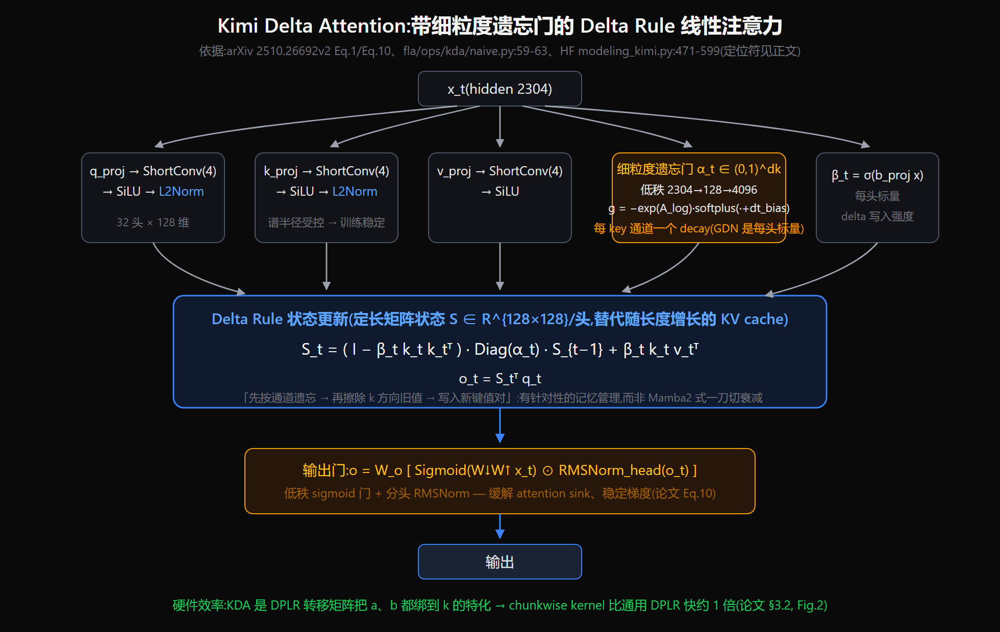
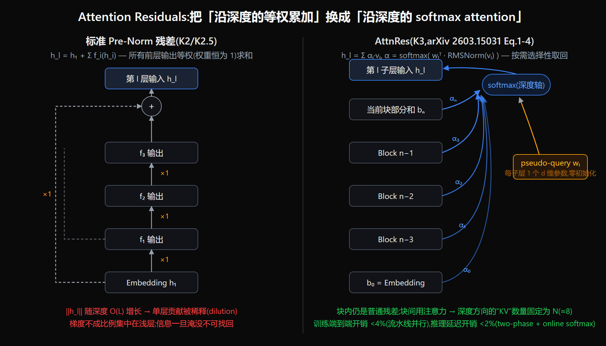
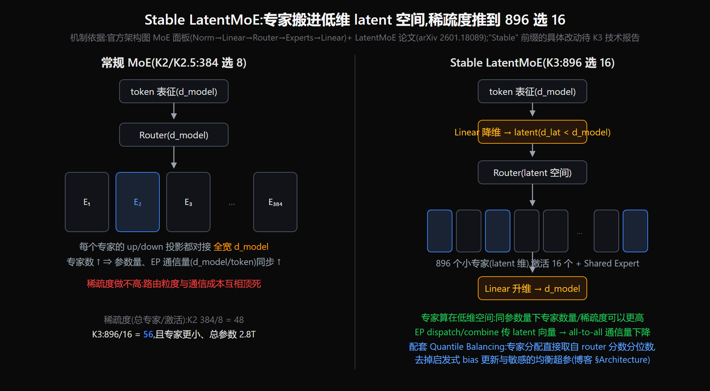

# Kimi K3 结构变化深析：同时优化序列轴与深度轴的信息流

> **来源基线**（所有 `file:line` 与论文页码均已打开核对）：
> - K3 官方 Tech Blog 快照 `raw/01_theory/01_models/moonshot_kimi/Kimi_K3_blog_2026-07-16.txt`（下称“博客”）；[Kimi K3 Technical Report `0797decb`](https://github.com/MoonshotAI/Kimi-K3/commit/0797decb18ab079de86f991b87a64b81ec15a3c2) 与本地 `raw/01_theory/01_models/moonshot_kimi/Kimi_K3_Technical_Report_2026-07-28.md`；官方内嵌架构图原件 `assets/kimi_k3_official_arch.svg`。
> - KDA：arXiv **2510.26692v2**（本库 `raw/01_theory/01_models/moonshot_kimi/Kimi_Linear_Attention-2510.26692.md`）；`MoonshotAI/Kimi-Linear@8c1d85e`；kernel 来自 `fla-org/flash-linear-attention@b328e7c` 的 `fla/ops/kda/*`；发布模型为 `moonshotai/Kimi-Linear-48B-A3B-Instruct@e1df551a`（`modeling_kimi.py`、`config.json`）。
> - AttnRes：arXiv **2603.15031v1**（2026-03-16）；`MoonshotAI/Attention-Residuals@85e2231`。仓库只有 README 和论文 PDF，**没有 `.py` 实现**；`README.md:52-91` 的伪代码对应论文 Fig. 2。
> - FlashKDA：`MoonshotAI/FlashKDA@d2ff19a`；LatentMoE：NVIDIA arXiv **2601.18089v1**。
> **事实边界**：K3 技术报告与权重均已发布，但官方仓库仍未公开 K3 backbone、训练器或 RL 源码。结构事实以报告和权重配置为准；独立组件实现只证明其对应机制，不等于 K3 本体调用链。
> **更新**：2026-07-28，已用正式报告替换 NoPE、Stable LatentMoE、Quantile Balancing、SiTU 和 MoonViT-V2 的预发布推断；后训练见 [[24_kimi_k3_posttraining_case_study_analysis]]。

> [!deprecated]
> 2026-07-17 初版的“完整技术报告待发布”事实边界已过期；报告仍未披露或未开源的项目改写为“2026-07-28 报告未披露/仓库未开源”。

---

## 一、总览：六处变化如何汇成一条主线

| # | 部件 | K2 / K2.5(基线) | K3 | 一句话动机 | 出处 |
|---|---|---|---|---|---|
| 1 | 注意力主干 | 纯 MLA(61 层) | **KDA : Gated MLA = 3:1 混合** | 1M 上下文的 KV cache 与解码吞吐 | 博客架构图 3×/1×;Kimi Linear §4 |
| 2 | 全局注意力层 | MLA + RoPE | **Gated MLA + NoPE** | 注意力选择性、长度外推 | 报告 §2.1.2，pp.5–6 |
| 3 | 跨层连接 | 标准 pre-norm 残差 | **AttnRes**(深度方向 softmax 注意力) | 深层贡献稀释、梯度失衡 | 博客 §Architecture;AttnRes 论文 |
| 4 | MoE | 384 选 8 + 1 共享(专家全宽) | **Stable LatentMoE 896 选 16** + Quantile Balancing | 同算力更高稀疏度、更低 EP 通信 | 博客 §Architecture;LatentMoE 论文 |
| 5 | 激活函数 | SwiGLU 系（**两个乘性因子都无界**） | **SiTU（Sigmoid Tanh Unit）**，输出值域 $\mathbb{R}\to(-100,100)$ | 平滑限制 LatentMoE routed path 的内部激活爆炸 | 报告 §2.3.2、Appendix B，pp.7–8、43 |
| 6 | 规模/上下文/模态 | 1.04T-A32B / 256K / 视觉 | **2.8T / 1M / +视频** | 结构效率红利再投入规模 | 博客开篇 |

Moonshot 的推进节奏是“先验证组件，再合入旗舰”：KDA 于 2025 年 10 月在 48B 模型上验证；AttnRes 于 2026 年 3 月继续使用同一套 Kimi-Linear 48B 骨架，并训练 1.4T tokens；到 2026 年 7 月，K3 才把两条路线合并并扩展到 2.8T 参数。KDA 和 AttnRes 的独立论文与开源实现，使得本文能够分析其机制；但这些组件实现仍不能替代未公开的 K3 本体代码。

正式报告用 Figure 7 给出 K2/K3 拟合 scaling curves，并继续只给出结构改动与训练/数据配方共同带来的 **约 2.5× overall scaling efficiency** 合并口径（报告 §3.2、Fig. 7、Table 1，p.11）。组件论文分别报告 KDA 混合架构约 1.16×、AttnRes 约 1.25× 的计算效率；两者简单相乘约为 `1.16 × 1.25 ≈ 1.45`。剩余差额不能在没有隔离消融的情况下归因给 LatentMoE、数据或其他配方。

---

## 二、变化点 1：注意力主干从纯 MLA 转向 KDA:MLA = 3:1

### 2.1 动机

K2.5 使用 61 层纯 MLA，原生上下文为 256K。若直接扩展到 1M，KV cache 会随序列长度线性增长，解码时每一步都要扫描更长的 KV。Kimi Linear 的实验显示，在 1M 上下文下，纯 MLA 的 TPOT 为 11.48 ms，而 3:1 混合架构只需 1.84 ms，相差约 6.3×（论文 Fig. 1b）。与此同时，agent 和 RL 负载越来越依赖长轨迹；在相同 Math RLVR 配方下，Kimi Linear 的训练与测试精度始终高于 MLA，且差距随训练扩大（§5.5 Fig. 6）。

### 2.2 机制

**状态更新**（论文 Eq. 1；参考实现 `fla/ops/kda/naive.py:59-63` 与之逐行对应）：

$$
\begin{aligned}
\widetilde{S}_{t-1} &= \operatorname{Diag}(\alpha_t) S_{t-1}, \\
S_t &= \left(I - \beta_t k_t k_t^{\top}\right)\widetilde{S}_{t-1}
      + \beta_t k_t v_t^{\top}, \\
o_t &= S_t^{\top}q_t.
\end{aligned}
$$

其中，`S_t` 是每个注意力头维护的 **128 × 128 定长状态矩阵**；`α_t` 控制按通道遗忘，`β_t` 控制当前键值对的写入强度。状态大小不随历史长度增长，因此解码阶段的状态访问成本与序列长度无关。

四个关键设计分别解决遗忘粒度、定向写入、输出稳定性和输入谱控制：

1. **细粒度遗忘门 `α_t`。** GDN 为每个头使用一个标量门，整个状态统一衰减（`fla/ops/gated_delta_rule/naive.py:31,54`）；KDA 则为每个 key 通道生成独立衰减率（`fla/ops/kda/naive.py:30-31`），把 GLA 式细粒度门引入 delta rule。其参数化采用低秩投影 2304→128→4096（`modeling_kimi.py:490-491`），门值计算见 `fla/ops/kda/gate.py:35,53`。
2. **写入强度门 `β_t`。** 它是每个头一个 sigmoid 标量（`modeling_kimi.py:496,561`），控制“先擦除 `k_t` 方向的旧信息，再写入当前键值对”的力度。与只做整体衰减的状态模型相比，这是定向的记忆更新。
3. **低秩 sigmoid 输出门与分头 RMSNorm。** 两者共同缓解 attention sink，并稳定梯度（论文 Eq. 10；`modeling_kimi.py:498-502,596-598`）。
4. **卷积和归一化预处理。** `q/k/v` 先经过核大小为 4 的 ShortConv 与 SiLU，`q/k` 再做 L2 归一化（`modeling_kimi.py:471-485,568-577`），用于约束状态更新的数值尺度。

**硬件效率来自对广义 DPLR 转移的特化。** KDA 把 DPLR 中的两个向量都绑定到 `k`，使二级 chunk 计算由 4 次减为 2 次，并进一步消去 3 个矩阵乘。论文报告其 chunkwise kernel 相比通用 DPLR 快约 100%（§3.2、Fig. 2）。训练和 prefill 的生产入口是 `chunk_kda`（`fla/ops/kda/chunk.py:178`）；短序列解码切到 `fused_recurrent_kda`（`fla/ops/kda/fused_recurrent.py:336`，`q_len ≤ 64` 的选择逻辑见 `modeling_kimi.py:523-525`）。

### 2.3 单 token 数据流：q / k / v / a / b / z 六路信号如何各司其职

§2.2 的矩阵公式回答“状态怎么变”；本节换成**单 token、单 head 的数据流视角**，回答“每一路投影信号从哪里来、到哪里去”。下图以 GDN（Gated DeltaNet，KDA 的直接前身）为基线绘制——GDN 与 KDA 共享同一套 delta rule 骨架与门参数化，六路信号的分工完全一致，差异集中在门的粒度与投影布局（本节末尾逐条标出）。

![GDN 单 token 数据流全图：第一段从隐藏状态 x_t 经融合投影一次 GEMM 切出六路信号——mixed_qkv 走 causal short conv 后做 Q/K L2Norm+scale（v 不归一化）；b_t 每 head 一个标量经 sigmoid 得写门 β_t；低秩遗忘特征 a_t^low 经第二级投影与 g_t=−exp(A_log)·softplus(a_t+dt_bias) 得 α_t=exp(g_t)∈(0,1)；低秩输出特征 z_t^low 经第二级投影得 z_t，全程不进入记忆状态。第二段为状态更新五步：先按 α_t 遗忘旧状态 S⁻=α_t·S_{t−1}（GDN 每 head 一个标量）；用 k_t 查询旧记忆 v̂_t=(S⁻)ᵀk_t；只写预测误差 e_t=v_t−v̂_t；以写入强度 δ_t=β_t·e_t 做 rank-1 Delta Rule 写入 S_t=S⁻+k_t·δ_tᵀ；最后用 q_t 读取 o_t=S_tᵀq_t（inclusive causal，当前 token 的写入可被读到），输出经 RMSNorm(o_t)⊙sigmoid(z_t) 与 W_o 投影。图底主线：a 决定旧记忆保留多少，b 决定纠错写入多强，k 负责寻址和写入，v 提供目标，q 负责读取，z 只控制最终输出。](assets/kimi_k3_fig_gdn_qkvabz_dataflow.png)

> **图源**：本库自绘收录（2026-07-17），SVG 原件 `assets/kimi_k3_fig_gdn_qkvabz_dataflow.svg`；图内标注的实现基线为 SGLang `main@78249034` 的 GDN 路径（fused projection、short conv、gate activation、recurrent Delta Rule、gated RMSNorm），该 commit 对应关系以图内标注为准，本库未逐行复核 SGLang 侧。

**第一段：一次融合投影切出六路信号。** GDN 的工程实现把 `u_t = W_fused · x_t` 一次 GEMM 算出，再切成四份：`mixed_qkv_t`、`b_t`、`a_t^low`、`z_t^low`。六路信号随后各走各路：

| 信号 | 形状（每 head） | 后续处理 | 作用 |
|---|---|---|---|
| `q_t` | `d_k` 维 | short conv → L2Norm + scale | **读取**：从更新后的状态中取出输出 |
| `k_t` | `d_k` 维 | short conv → L2Norm | **寻址与写入**：决定查询/擦除/写入状态的哪个方向 |
| `v_t` | `d_v` 维 | short conv（不归一化） | **写入目标**：本 token 希望记忆记住的内容 |
| `a_t^low` | 低秩 → 二级投影 | `g_t = −exp(A_log)·softplus(a_t + dt_bias)`，`α_t = exp(g_t) ∈ (0,1)` | **遗忘门**：旧记忆保留多少 |
| `b_t` | 标量 | `β_t = sigmoid(b_t)` | **写门**：这次纠错写入多强 |
| `z_t^low` | 低秩 → 二级投影 | 旁路直达输出门 | **输出门**：只调制最终输出，**不进入状态更新** |

两个值得注意的设计：**causal short conv** 在投影后给 q/k/v 补一小段（核宽 4）的因果局部感受野——线性注意力没有 RoPE，超短程的位置/局部模式主要靠它；**Q/K 做 L2 归一而 v 不做**——q/k 只负责“方向”（寻址），范数交给门控管理，这是状态转移谱半径受控、长序列不爆的前提。遗忘门用的是 Mamba 式 Δt 参数化（低秩两级投影 + `softplus` + 可学习 `A_log`/`dt_bias`），fla 中 KDA 的同款实现见 `fla/ops/kda/gate.py:35,53`。

**第二段：状态更新的五步拆解（delta rule 的"误差修正"读法）。**

1. **先遗忘**：`S⁻ = α_t ⊙ S_{t−1}`——旧记忆按遗忘门整体（GDN）或逐通道（KDA）衰减；
2. **查询旧记忆**：`v̂_t = (S⁻)ᵀ k_t`——“按这个 key，记忆原本会预测什么 value？”
3. **只写预测误差**：`e_t = v_t − v̂_t`——已经记住的内容不重复叠加，这是 delta rule 与普通线性注意力（`S += k vᵀ` 无脑累加）的本质区别；
4. **rank-1 写入**：`S_t = S⁻ + k_t (β_t e_t)ᵀ`——`k` 决定写到哪个方向，误差决定写什么，`β` 决定写多强；
5. **读取与输出**：`o_t = S_tᵀ q_t`（inclusive causal：当前 token 刚写入的内容立即可读），再经 `RMSNorm(o_t) ⊙ sigmoid(z_t)` 与 `W_o` 得到 `y_t`。

这五步与 §2.2 的闭式公式是同一件事的两种写法——把步骤 1–4 代入展开：`S⁻ + k(β(v − (S⁻)ᵀk))ᵀ = (I − β_t k_t k_tᵀ)·S⁻ + β_t k_t v_tᵀ`，即"误差修正"视角等价于"定向擦除 + 写入"视角。还要注意：此图是**逐 token 递推（decode）视角**，对应 `fused_recurrent_kda` 路径；训练与 prefill 实际走 chunkwise 并行形式（`chunk_kda`），数学等价、调度不同。

**从 GDN 到 KDA：读这张图时要改三处。**

1. **遗忘门粒度（最关键的一处）**：图中第 3 步“GDN：每个 head 用一个标量 `α_t`”（`fla/ops/gated_delta_rule/naive.py:31,54`，整个 `d_k×d_v` 状态乘同一标量）；KDA 换成 `d_k` 维向量 `Diag(α_t)`（`fla/ops/kda/naive.py:30-31`），即状态矩阵的**每一行（每个 key 通道）可以按不同速率遗忘**。直观效果是记忆管理从“一刀切保留/丢弃”细化为“分通道的差异化保留”——这正是 Kimi Linear 消融中 KDA 长文本反超 GDN-H 的机制来源（RULER@128K 84.3 vs 80.5，论文 Table 5）。
2. **投影与卷积布局**：图基于 SGLang 的融合投影实现（一次 GEMM 切六路）；Kimi-Linear 的 HF 参考实现是 q/k/v 各自独立投影、各自 ShortConv(4)+SiLU（`modeling_kimi.py:471-485`），q/k 的 L2 归一在 kernel 内完成（`use_qk_l2norm_in_kernel=True`，`modeling_kimi.py:568-577`）；FlashKDA 进一步把 `β` 的 sigmoid 和 `g` 的激活也融进 kernel（其 README Kernel API 注明输入为 pre-activation logits）。布局差异只是工程折衷，数学不变。
3. **输出门定位**：图中 `z` 旁路与 KDA 的低秩 sigmoid 输出门（`g_a/g_b proj`，2304→128→4096，`modeling_kimi.py:498-499`）同构；KDA 论文把它的作用明确定位为缓解 attention sink 并稳定梯度（Eq. 10），且消融显示换成 swish 会显著恶化（Val PPL 5.65 → 5.81，Table 1）。

### 2.4 混合排布：只有四分之一的层保留完整 KV

Kimi-Linear-48B 的 `config.json:20-52` 给出了实际排布：27 层中，`full_attn_layers=[4,8,12,16,20,24,27]`，即 20 个 KDA 层和 7 个 MLA 层，比例约为 2.86:1。论文称其为 uniform 3:1；前 24 层确实严格重复六次“3 个 KDA + 1 个 MLA”。

KV cache 只存在于 MLA 层。`KimiDynamicCache` 为 KDA 层保存 convolution state 和定长 recurrent state，而不保存逐 token KV（`modeling_kimi.py:118-150`）。因此，相比所有层均使用 MLA，3:1 混合架构可直接减少约 75% 的 KV cache。K3 官方架构图继续使用 3× KDA、1× Gated MLA 的标注。

### 2.5 证据：1.4T tokens、相同配方下的对照

论文 Table 1 的层比消融如下：

| 配置 | Train PPL | Val PPL |
|---|---|---|
| 0:1(纯 MLA) | 9.45 | 5.77 |
| 1:1 | 9.29 | 5.66 |
| **3:1(采用)** | **9.23** | **5.65** |
| 7:1 | 9.23 | 5.70 |
| 15:1 | 9.34 | 5.82 |
| 3:1 去输出门 | 9.25 | 5.67 |
| 3:1 输出门换 swish | 9.43 | 5.81 |

在 MLA、GDN-H 与 Kimi Linear 的三方对比中，Kimi Linear 在四类任务上均领先（§5.4）：MMLU-Pro base 分别为 47.2、47.9、**51.0**；SFT 后的 GPQA-Diamond 为 57.1、58.6、**62.1**；RULER@128K 为 81.3、80.5、**84.3**；MRCR@128K 为 22.6、23.9、**29.6**。

**为什么不选择其他方案。** 纯 MLA 的质量略低，在 1M 上下文下 TPOT 又高出约 6.3×；Mamba2 没有 delta rule，在 Palindrome、MQAR 和 Stack 等合成任务上全面落后（Fig. 4）；GDN 的粗粒度标量门在短文本上略优于 MLA，但到长文本时反而落后，只有 KDA 的细粒度门在两端都占优（p.12）。Scaling law 拟合进一步给出：KDA 混合架构相对 MLA 约有 1.16× 的计算效率（Table 2）。

> 更完整的 Kimi Linear 模型分析见 [[12_kimi_linear_analysis]]；GDN/KDA 的 QKVABZ、逐 token 递推、chunk 仿射等价性与当前训推 kernel 见 [[20_gdn_kda_linear_attention_analysis]]、[[21_gdn_kda_kernel_implementation_analysis]]。本节聚焦 K3 采用视角与源码定位。

---

## 三、变化点 2：全局层由 MLA 升级为 Gated MLA

- **官方确认的变化。** K3 为四分之一的全局 MLA 层增加输出门；博客将其作用概括为提升 attention selectivity（博客 `:207-209`）。
- **为什么要加门。** Kimi Linear 为了与标准 MLA 做严格对照，实验模型中的 MLA 层刻意没有门控，并把“未来补门”列为后续方向。KDA 侧的消融已经显示 sigmoid 输出门有效：去掉输出门时 Val PPL 从 5.65 升至 5.67，换成 swish 门则恶化到 5.81（Table 1）。K3 的 Gated MLA 可以看作这项遗留设计的产品化。
- **NoPE 已由 K3 报告确认。** K3 对所有 MLA 层使用 NoPE，由 KDA 提供 position-sensitive、recency-aware mixing，MLA 保留无约束全局内容交互；长上下文扩展不需要 RoPE rescaling 或 interpolation（报告 §2.1.2，p.5；§3.4，p.12）。Kimi-Linear 发布模型的 `"mla_use_nope": true`（`config.json:56`）因此从先行证据升级为 K3 路线的一致实现依据。
- **512 维 MLA 只能作为旁证。** 博客的 Kernel Optimization 案例包含“512-head-dimension MLA kernel”（博客 `:164-166`），与 Kimi-Linear 的 `kv_lora_rank=512`（`config.json:19`）一致；据此推测 K3 沿用 512 维压缩态是合理的，但仍属于 **[推断]**。

---

## 四、变化点 3：用 Attention Residuals 重写深度方向的信息聚合

### 4.1 动机：标准残差会无差别累加所有历史层

标准 Pre-Norm 残差可以展开为：

$$
h_l = h_1 + \sum_{i<l} f_i(h_i).
$$

这意味着第 `l` 层接收到的是所有历史子层输出的等权累加（AttnRes §2.1，p.3），会带来三个问题：

1. 隐状态范数随深度近似按 `O(L)` 增长，单个子层的相对贡献被持续稀释；
2. attention 与 MLP 只能读取同一个聚合态，无法按需选择早期表征；
3. 一旦某层信息被后续累加淹没，标准残差没有显式机制把它重新取回。

在 48B、1T tokens 的实验中，baseline 的输出幅值随深度单调增长，梯度也不成比例地集中在浅层（Fig. 5，p.10）。AttnRes 将标准残差视为“深度轴上的固定全 1 混合”，再把它替换成深度轴上的 softmax attention。**K3 在 2.8T 规模采用这套机制，很可能正是因为上述问题会随深度放大；这是基于组件论文的 [推断]，不是博客原文。**

### 4.2 机制

**Full AttnRes**（论文 Eq. 1–4）对所有历史子层做深度注意力：

$$
\begin{aligned}
e_{i \rightarrow l} &= w_l^{\top}\operatorname{RMSNorm}(v_i), \\
\alpha_{i \rightarrow l} &=
\operatorname{softmax}_{i<l}\!\left(e_{i \rightarrow l}\right), \\
h_l &= \sum_{i=0}^{l-1}\alpha_{i \rightarrow l}v_i.
\end{aligned}
$$

- `v_0` 是 embedding，`v_i` 是第 `i` 个子层的原始输出；
- `w_l` 是第 `l` 个子层独有的 `d` 维 pseudo-query，与当前 token 内容无关，并且必须零初始化（§5，p.8）；
- RMSNorm 只作用于被检索的历史表示，避免大幅值层仅凭范数占据过高权重。

**Block AttnRes 是工程化版本，也是 K3 官方图展示的形态。** 它把 `L` 层划分为 `N` 个块：块内继续使用普通残差，只在块间执行 softmax attention（Eq. 5–6）。残差状态因此从单个 `hidden_states` 变成 `(blocks, partial_block)`：前者保存已完成块的表示，后者保存当前块内的普通残差。

官方仓库没有完整 Python 实现，唯一可执行描述是 `README.md:52-91` 的伪代码，与论文 Fig. 2 相同。每个子层增加 `attn_res_proj`（即 `w_l`）和 `attn_res_norm`，在 attention 前和 MLP 前各聚合一次，并在块边界封存当前块。K3 官方图中的 `(α, w)`、`Block n−1/n−2/n−3` 和 `Embedding` 正是这套记号；SVG 的 aria-label 也明确写着 “Block Attention Residuals architecture diagram”。

**K3 的实际分块配置（报告 §2.2，p.6）。** 报告给出的经验值是 `N≈8` 即可在各规模上取回大部分收益；**K3 把层划分为 8 个块、每块 12 层，因此最后一块不完整，计入 embedding 层后共 9 个块**。93 层按 12 层一块正好是 7 整块 + 1 残块 = 8 块，加 embedding 得 9——与官方架构图上 `Block n−3/n−2/n−1` 加 `Embedding` 的记号完全对上。Block 化的收益是双重的：内存与通信开销从 `O(Ld)` 降到 `O(Nd)`，并且**给推理期状态定了界**，使块间并行结果能经 online softmax 与块内串行部分和更好地合并。

**额外开销受控。** 每个子层只新增一个 `d` 维向量和一个 RMSNorm。论文报告：在 pipeline parallel 训练下，端到端开销低于 4%；推理通过 two-phase 计算与 online softmax，把每 token、每层的残差 I/O 从 `3d` 提高到约 `5.5d`，仍远低于 mHC 的 `34d`，端到端延迟增幅低于 2%（Table 1、§4.2）。由于块数 `N` 固定，深度方向的“KV”规模也是有界的。

### 4.3 证据

论文使用五种规模的 MoE 做 scaling 对照，并刻意把超参数设置得更有利于 baseline（Table 2）。其中三组代表性结果如下：

| 激活参数/tokens | Baseline | Block AttnRes(N=8) | Full AttnRes |
|---|---|---|---|
| 194M / 38.7B | 1.931 | 1.909 | 1.899 |
| 436M / 87.9B | 1.766 | 1.746 | 1.737 |
| 528M / 119B | 1.719 | 1.693 | 1.692 |

拟合曲线的截距整体下移而斜率基本不变，对应 **约 1.25× 的等效计算效率**（§5.1）。在 Kimi Linear 48B、1.4T tokens 的下游实验中，AttnRes 将 GPQA-Diamond 从 36.9 提高到 44.4，Math 从 53.5 提高到 57.1，HumanEval 从 59.1 提高到 62.2（Table 3）。这组实验直接证明 AttnRes 可以装入 Kimi-Linear 骨架；把它称为 K3 主干的前身是基于发布时间与结构对应关系的 **[推断]**。

### 4.4 为什么不采用其他替代方案（Table 4，436M）

| 方案 | Val loss | 结论 |
|---|---|---|
| baseline | 1.766 | — |
| DenseFormer(静态标量) | 1.767 | 无效 ⇒ **输入依赖的权重才是关键** |
| mHC / Hyper-Connections | 1.747 | 弱于 softmax 版,且推理 I/O 34d |
| sigmoid 代 softmax | 1.741 | softmax 竞争归一化更优 |
| 滑窗只看近 8 层 | 1.764 | **访问远层比多看近层重要** |
| **Full AttnRes** | **1.737** | 采用(Block 版为工程形态) |
| input-dependent query | 1.731 | 更好 0.006,但每层多 d×d 投影+解码顺序访存 ⇒ **被弃用** |

可视化结果显示，AttnRes 学到的混合矩阵整体对角占优，说明局部层仍是主通路；与此同时，embedding 持续获得非零权重，模型也会主动学习跨层 skip，并在深度方向形成 attention sink（Fig. 8、§6.2）。

> 这与 [[13_deepseek_v4_analysis]] 中 DeepSeek V4 采用的 mHC（Hyper-Connections 系）形成路线对照。AttnRes 论文直接消融了 mHC：验证损失为 1.747，对比 Full AttnRes 的 1.737；推理 I/O 则分别为 `34d` 与约 `5.5d`。

---

## 五、变化点 4：从全宽 MoE 转向 Stable LatentMoE 896 选 16

- **官方披露的变化。** K3 使用 Stable LatentMoE，每个 token 从 896 个专家中激活 16 个；总专家数与激活专家数之比为 56，高于 K2.5 的 48。博客同时强调，在这一稀疏度下，路由和优化已经成为一等问题（博客 `:207-209`）。
- **LatentMoE 的机制已确认。** shared experts 保留全宽路径；routed path 先由 $W^\downarrow$ 投到 3,584 维 latent space，在其中执行 896 选 16，再由 $W^\uparrow$ 升回 7,168 维。K3 每层还有两个 full-width shared experts。“Stable” 来自 routed aggregate 后、up projection 前的 RMSNorm，以及 SiTU-GLU 和 Quantile Balancing 三项稳定化组件（报告 §2.3、Eq. 10–12，pp.6–8；Table 1，p.11）。
- **Quantile Balancing 的更新规则已确认。** K3 使用 auxiliary-loss-free routing；router bias 只影响 Top-k dispatch，不进入 mixture weights。QB 先做 Top-$k+1$ 得到每 token cutoff，再对每个专家选取能匹配目标负载 $q=mk/n$ 的 score margin quantile，一次 forward 即得到下一 bias，取代固定步长的 sign update（报告 §2.3.3、Eq. 13–14、Fig. 5，pp.8–9；Appendix C，pp.43–45）。
- **为何继续提高稀疏度。** 增加总专家数、保持每 token 激活量相对有限，可以提高参数容量而不同比例增加计算量；真正的约束转移到路由稳定性、专家并行通信和负载均衡。K3 将 LatentMoE、Quantile Balancing 与全平衡 EP 训练并列介绍，表明它试图从结构、算法和系统三个层面同时解除这些约束；三者之间的精确耦合仍属于 **[推断]**。

---

## 六、变化点 5：SiTU（Sigmoid Tanh Unit）——把"两个无界因子相乘"改成"两个有界因子相乘"

### 6.1 它解决的是哪个具体问题

SiTU 不是一次通用的激活函数改良，而是**为高稀疏 LatentMoE 的 routed path 定制的**。报告的因果链是两段：

1. **结构层面的病因（§2.3，p.6）。** 极端稀疏（896 选 16，稀疏度 56）放大了 vanilla 设计的失效模式之一：routed path 把 $W^\downarrow$、一个门控多分支专家 FFN、$W^\uparrow$ 串成**"几乎四个连续矩阵乘"**的链条；这种**病态条件（ill-conditioned）结构叠加 2.8T 规模，在 routed 分支产生内部激活爆炸**。
2. **激活函数层面的病因（§2.3.2，p.7）。** SwiGLU 的**两个乘性因子都是无界的**（门支 $a\sigma(a)$ 在正向 $\sim a$，up 支就是 $u$ 本身），因此**同时出现大坐标就会产生激活离群值，并抬高低精度算术中的溢出风险**。原始 GLU 的 sigmoid 门虽然避免了门的无界增长，却丢掉了 Swish 正半轴那段近似线性的响应。

所以要找的是这样一个激活：**限制大值增长，同时保住 SwiGLU 的局部形状与正向响应特征**。Appendix B 开篇把设计目标写得更精确——bound the SwiGLU product **without discarding the characteristic shape of Swish**，具体是两条形状必须保住：**① 原点附近近似线性；② 消失的负尾**（p.43）。

### 6.2 机制：只 cap 线性因子，保留 sigmoid

记 smooth cap 为 $\operatorname{softcap}(z,\beta)=\beta\tanh(z/\beta)$，则

$$
\operatorname{SiTU\text{-}GLU}(x)=
\underbrace{\left[
\beta_1\tanh\!\left(\frac{W_gx}{\beta_1}\right)
\odot \operatorname{Sigmoid}(W_gx)
\right]}_{\text{门支：只换掉 Swish 的线性因子}}
\odot
\underbrace{\beta_2\tanh\!\left(\frac{W_ux}{\beta_2}\right)}_{\text{up 支：同款 cap}},
\qquad \beta_1=4,\ \beta_2=25 .
$$

两处设计意图报告都写明了（Appendix B，p.43）：

- **门支只 cap Swish 的线性因子，`Sigmoid` 因子原样保留。** 理由是"**sigmoid 本来就把负向门响应压向零**，因此这一改动主要控制大正激活，**而不移除负尾**"。
- **up 支施加同款 cap，目的是"不让任何一支独大（preventing either branch from dominating the product）"。** 这是理解 SiTU 的关键——问题出在**乘积**上，只治一支没用。

**它是 SwiGLU 的单参数族推广，不是另一个函数。** 由 Eq. 18，$\beta\tanh(z/\beta)=z+O\!\left(z^3/\beta^2\right)$，故 SiTU-GLU 在原点**与 SwiGLU 一阶重合**；且当 $\beta_1,\beta_2\to\infty$ 时**逐点还原 SwiGLU**。

### 6.3 值域怎么变（本节主结果）

![SiTU-GLU 值域四联图。A 门支：横轴为门支预激活 a=W_g·x，红线是 SwiGLU 门支 a·sigmoid(a)（上界正无穷、持续线性上升），蓝线是 SiTU 门支 beta1·tanh(a/beta1)·sigmoid(a)，在 beta1=4 处水平饱和；两条曲线的负向极小值几乎重合，标注为 −0.2785 → −0.2698，说明 cap 只压正向、负尾原样保留。B up 支：红线是恒等映射 u（双向无界的直线），蓝线是 beta2·tanh(u/beta2)，双向对称饱和于正负 25；标注 u=beta2 处只剩线性值的 76.2%。C 标量响应（两支同一输入，对应报告 Fig. 4 口径）：红线 SwiGLU 按 x 平方无界增长，在 x=10 处已达 100 并继续上升；蓝线 SiTU-GLU 单调趋近水平虚线 100，即 Eq. 19 的界 beta1·beta2；右上插图放大原点附近，两条曲线一阶重合。D 值域阶梯（横轴 symlog，箭头表示无界）：自上而下四行分别为预激活、门支、up 支、输出；每行上方红条为 SwiGLU、下方蓝条为 SiTU-GLU。预激活两者都是全实轴不变；门支 SwiGLU 从约 −0.28 延伸到正无穷，SiTU 收到 −0.27 至 4；up 支 SwiGLU 全实轴，SiTU 收到正负 25；输出 SwiGLU 全实轴，SiTU 收到正负 100。](assets/kimi_k3_fig_situ_range.png)

> **图源**：本库自绘（2026-07-28），按报告 §2.3.2 与 Appendix B 的公式直接数值绘制，非复制报告 Fig. 4。SVG 原件 `assets/kimi_k3_fig_situ_range.svg`，生成脚本参数 $\beta_1=4,\beta_2=25$。

**逐级值域对照**（"报告"列为 Eq. 19 的原文结论，其余为本库据同一公式的数值推算）：

| 量 | SwiGLU | SiTU-GLU | 变化 |
|---|---|---|---|
| 预激活 $a=W_gx,\ u=W_ux$ | $\mathbb{R}$ | $\mathbb{R}$ | **不变**——cap 作用在其后，不动权重与预激活 |
| 门支 | $(-0.2785,\ +\infty)$ | $(-0.2698,\ \beta_1=4)$ | **上界从 $+\infty$ 收到 4；下界几乎不动** |
| up 支 | $\mathbb{R}$ | $(-\beta_2,\ \beta_2)=(-25,25)$ | 双向对称收紧 |
| 输出 $f(x)$ | $\mathbb{R}$，量级 $\sim a\cdot u$（**二次**） | $(-100,\ 100)$ | $\lvert f(x)\rvert\le\beta_1\beta_2=100$（**报告 Eq. 19**） |

报告给出的界很简洁：因为 $\lvert\tanh(z)\rvert<1$ 且 $0<\operatorname{Sigmoid}(z)<1$，每个输出坐标都满足 $\lvert\operatorname{SiTU\text{-}GLU}(x)\rvert\le\beta_1\beta_2$。在这个界之上，还有三点值得单独记（以下数值为本库按公式计算）：

**① 负尾"不被移除"是可以量化的。** 门支下确界从 Swish 的 **−0.2785**（在 $a\approx-1.278$）只变到 **−0.2698**（在 $a\approx-1.219$），相对变化约 3%。也就是说 cap 在负半轴几乎不起作用——sigmoid 早已把那边压没了，tanh 再压也无处可压。**cap 真正改变的只有正半轴：上界 $+\infty \to 4$。**

**② 输出的 ±100 两端都由"门支饱和到 4"驱动，与门支的负半轴几乎无关。** 四个角点乘积：

| | up 支取上界 $+25$ | up 支取下界 $-25$ |
|---|---|---|
| 门支取上确界 $+4$ | **+100** | **−100** |
| 门支取下确界 $-0.2698$ | −6.74 | +6.74 |

门支负半轴对输出量级的贡献上限只有 **6.74**，不到 100 的 7%。因此"输出值域 $(-100,100)$ 是对称的"这件事，**并不意味着门支对称**——负输出靠的是 up 支为负、而不是门为负。

**③ cap 的形状在 $z/\beta$ 下是通用的，$\beta$ 只决定膝点位置。** 保留的线性值比例 $\beta\tanh(z/\beta)/z$ 只依赖 $z/\beta$：

| $z/\beta$ | 0.25 | 0.5 | 1 | 2 | 4 |
|---|---|---|---|---|---|
| 保留线性值 | 98.0% | 92.4% | 76.2% | 48.2% | 25.0% |

于是 $\beta_1=4$ 与 $\beta_2=25$ 的**不对称取值**含义就清楚了：门支在 $\lvert a\rvert\approx1$ 就开始被明显压制（$1=0.25\beta_1$），而 up 支要到 $\lvert u\rvert\approx6$ 才受到同等程度的压制——**门被管得比 up 严约 6 倍**。一个自然的解释是：门只负责调制/选择，其有用动态范围本就窄，压它代价小；up 支携带真正的值信号，压太狠会直接损失信息。**这个解释是 [推断]——报告给出了 $\beta_1,\beta_2$ 的取值与由此得到的界，但没有解释为什么取这一对数，也没有给 $\beta$ 的选取方法或敏感性分析。**

**标量响应对照**（报告 Fig. 4 口径：两支喂同一标量输入，即上图 C）：

| $x$ | 2 | 4 | 8 | 16 | 32 | 64 |
|---|---|---|---|---|---|---|
| SwiGLU | 3.5 | 15.7 | 64.0 | 256 | 1024 | 4096 |
| SiTU-GLU | 3.25 | 11.9 | 29.8 | 56.5 | 85.6 | 98.8 |

SwiGLU 在 **$x=10$ 就已经达到 100**，此后按 $x^2$ 继续涨；SiTU 单调趋近 100 而不越过。偏离是渐进的：相对 SwiGLU 下压 1% 发生在 $x\approx0.69$，5% 在 $x\approx1.58$，20% 在 $x\approx3.49$，50% 在 $x\approx7.40$。负方向 $x\to-\infty$ 时 SiTU 的标量响应趋于 $0^+$——**负尾照旧消失，与 Swish 同形**。

### 6.4 为什么不用 hard clamp，以及与低精度的关系

**hard clamp 被明确否决（Appendix B 末句，p.43）：** "与对 gate 预激活做硬截断不同，**smooth cap 在饱和边界之外保留非零梯度**，我们发现这带来更好的训练行为。" 硬截断在阈值外梯度直接归零，被截住的坐标会失去学习信号；$\tanh$ 则处处可导、梯度只是逐渐衰减。

**与 MXFP4/MXFP8 的关系需要分清报告说了什么、什么是推理。** 报告说的是：无界乘积"**抬高低精度算术中的溢出风险**"（§2.3.2，p.7）——这是它给出的两个风险之一，因此把 SiTU 说成"纯量化技巧"是错的，把低精度因素完全剔除同样偏离原文。

具体到 K3 的量化配置，本库的补充理解是 **[推断]**：OCP MX 的元素格式里 E2M1（MXFP4）最大可表示值只有 6、E4M3（MXFP8）为 448，而 MX 是**每 32 个元素共享一个 2 的幂次 scale**。真正致命的往往不是绝对溢出，而是**块内一个离群值把共享 scale 顶高，从而把同块内的小值精度碾平**。把输出钉在 $\pm100$ 等于给块内动态范围设了上界，这与 §4.1.4 "QAT 从 SFT 起贯穿整个后训练"的路线是自洽的。稳定性视角的横切见 [[25_kimi_k3_stability_analysis]] §2.1、§2.7。

### 6.5 代价与证据边界

- **两个新超参 $\beta_1,\beta_2$。** 报告给了取值和由此推出的界，**没有给选取方法、敏感性或消融**。
- **饱和区梯度衰减。** $\lvert a\rvert=2\beta_1=8$ 时门支只剩线性值的 48%，梯度同步减小。smooth cap 只是比 hard clamp 好，不是没有代价。
- **报告没有 SiTU 的隔离消融。** Fig. 4 是函数曲线图，不是训练对照实验；"SiTU 贡献了多少 loss/稳定性"在报告中无法单独归因——RMSNorm、SiTU、QB 三个组件只有合并叙述（§2.3）。

---

## 七、变化点 6：1M 原生上下文与原生视觉、视频

- **1M 是原生规格，不是事后外推。** Kimi-Linear 发布模型已设置 `model_max_length: 1048576`（`config.json:57`），长上下文本就是 3:1 混合与 NoPE 的设计目标；K3 延续为官方原生规格。BrowseComp 脚注进一步显示：使用完整 1M 窗口且不做 context management 时，模型仍能取得 90.4 分（博客 `:538-539`）。
- **多模态范围从图文扩展到视频。** K3 的 MoonViT-V2 是约 401M 参数、27 层的 vision transformer，从零开始用 next-token prediction 与 LLM 联合训练；图像和视频完全共享参数，attention 分为空间/时间两段，并用 temporal pooling 与 2×2 pixel shuffle 压缩 token（报告 §2.4、Fig. 6，pp.9–10；Table 1，p.11）。

---

## 八、汇总：每处改动解决了什么问题

| 变化点 | 解决什么 | 拒绝了什么(证据) | 代价 |
|---|---|---|---|
| KDA 3:1 | 1M KV cache/解码带宽;RL 长轨迹 | 纯 MLA(6.3× TPOT);Mamba2(合成任务全败);GDN(长文反转) | 全局层只剩 1/4;线性层状态管理复杂化(prefix cache 重做,见 infra 页) |
| Gated MLA | attention sink、选择性 | 无门(+0.02 PPL);swish 门(+0.16) | 低秩门投影(可忽略) |
| AttnRes | 深度轴信息稀释/梯度失衡 | DenseFormer(无效);mHC(弱且 I/O 6×);input-dependent query(好 0.006 但推理不友好) | 训 <4%、推 <2%;残差流变二元状态(PP/重计算要适配) |
| Stable LatentMoE + 896/16 | 同算力更高稀疏度;EP 通信 | 全宽专家继续堆;bias 启发式均衡(敏感超参) | 路由/优化难度上升("first-order challenges") |
| SiTU | 把「两个无界因子相乘」改成「两个有界因子相乘」：输出 $\mathbb{R}\to(-\beta_1\beta_2,\beta_1\beta_2)=(-100,100)$，同时一阶保持 SwiGLU 局部形状与消失负尾 | hard clamp（饱和边界外梯度归零）；无界 SwiGLU（近四次连乘下内部激活爆炸）；原始 GLU（丢掉 Swish 正半轴响应） | 两个 soft-cap 超参数（选取方法未公开）；饱和区梯度衰减；报告无隔离消融 |
| 2.8T/1M/视频 | 效率红利变现 | — | 部署门槛 64+ 卡超节点(infra 页) |

## Related Pages

- [[14_kimi_k3_analysis]] — K3 发布总结、完整基准、限制与官方定位
- [[23_kimi_k3_infra_deepdive]] — 本页各项结构选择在训练与推理系统中的配套实现
- [[25_kimi_k3_stability_analysis]] — 七条失稳轴的横切：本页各结构组件的稳定性动机与被拒绝的替代方案
- [[26_kimi_k3_open_source_stack_analysis]] — 哪些结构有开源 kernel、哪些没有
- [[27_moonep_analysis]] — Stable LatentMoE 在执行侧的均衡保障(Quantile Balancing 的系统侧搭档)
- [[24_kimi_k3_posttraining_case_study_analysis]] — K3 后训练算法、环境、Infra 与部署闭环
- [[12_kimi_linear_analysis]] — KDA/3:1 混合的原始论文分析
- [[13_kimi_k2_5_analysis]] / [[11_kimi_k2_analysis]] — 直接前代与 2.5× 效率基线
- [[10_moba_analysis]] — Moonshot 前一代长上下文注意力(块稀疏路线)
- [[13_deepseek_v4_analysis]] — mHC(Hyper-Connections)路线对照
- [[01_theory/06_distributed_parallelism/index]] — EP/PP 并行背景
