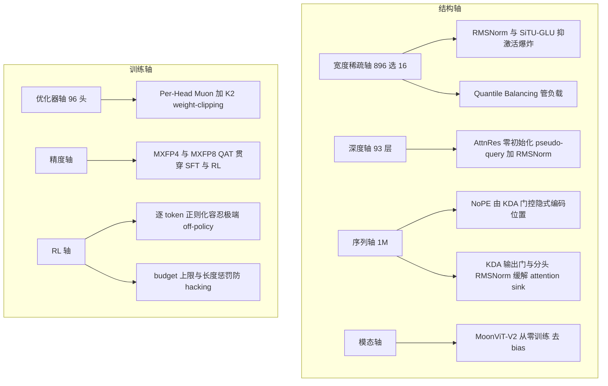

# Kimi K3 稳定性栈：从 K2 的一个事后补丁，到每条失稳轴各有一个内建机制

> **来源基线**（每条断言均已在报告原文定位并逐句核对，未从他页转引）：[Kimi K3 Technical Report `0797decb`](https://github.com/MoonshotAI/Kimi-K3/commit/0797decb18ab079de86f991b87a64b81ec15a3c2)（2026-07-28，47 页），本地快照 `raw/01_theory/01_models/moonshot_kimi/Kimi_K3_Technical_Report_2026-07-28.pdf`；K2 基线为 arXiv 2507.20534。
> **维度**：Deep Dive（专题横切）。K3 的稳定性机制在报告里分散于 §2.2、§2.3、§2.4、§2.5、§3.2、§3.3、§3.4、§4.1.2、§4.1.4 与 Appendix C，本页把它们按"哪条轴会失稳"重新组织，回答"K3 到底做了哪些稳定性研究、各自解决什么失效模式、拒绝了什么替代方案"。
> **与其它页的分工**：结构机制本身见 [[22_kimi_k3_architecture_deepdive]]，系统实现见 [[23_kimi_k3_infra_deepdive]]，后训练闭环见 [[24_kimi_k3_posttraining_case_study_analysis|D12]]。本页不重复机制推导，只做稳定性视角的横切与证据边界。
> **更新**：2026-07-28 建页。

---

## 一、主线：K3 只接受"不拿质量换稳定"的稳定化

**K2 时代的稳定性主要是一个事后补丁。** MuonClip 的工作方式是：每次参数更新之后，按注意力头检查最大 logit，若第 `h` 个头超过阈值 `τ`，就用 `γ_h = min(1, τ/S_max^(h))` 同时缩放该头的 Q/K 投影。它有效——K2 报告称 15.5T tokens 训练零 loss spike——但形态上是**监控 + 越界后修正**。

**K3 换成了另一种形态：先指认每条会失稳的轴，再在轴上放一个内建机制。** 报告在 §2.3 里把这个思路写得最清楚——它不是笼统说"我们提升了稳定性"，而是先点名两个**失效模式**，再逐一给出对应组件（报告 §2.3，pp.6–7）。

读完全部七条轴之后，会浮现出一条更强的判断，也是本页真正的主线：

> **K3 拒绝的每一个替代方案，都是"用质量换稳定"或"用超参换稳定"的方案；被采纳的机制几乎都被报告同时声称能提升质量或降低开销。**

证据是七处相互独立的取舍，全部指向同一方向：

| 被拒绝的方案 | 拒绝理由（报告原意） | 出处 |
|---|---|---|
| auxiliary-loss 均衡 | K3 走 auxiliary-loss-free 路线；aux loss 直接以质量换均衡 | §2.3.3 |
| sign-based bias 更新（loss-free 现有做法） | 只保留负载误差的**方向**；近 10³ 专家已超出其良态区间 | §2.3，p.6；App. C |
| BIP 式带不等式约束求解 | 非负约束引入 `max(0,·)`，**只能压制过选专家、不能提携欠选专家**，实验中显著拖慢均衡 | App. C |
| hard clamp（硬截断激活） | 梯度边界差（SiTU 用 smooth cap 保住原点附近的一阶行为） | §2.3.2 |
| 无界 SwiGLU | 两个乘性因子都无界，同时出现大坐标即产生激活离群值，并**抬高低精度算术的溢出风险** | §2.3.2，p.7 |
| SigLIP 初始化视觉编码器 | 联合优化不稳定：梯度范数持续偏高且频繁 spike | §2.4，p.9，Fig. 6 |
| WSD 学习率调度 | 各自独立搜超参后，cosine decay 的最终 loss 一致更低 | §3.2，p.10 |

**换句话说：凡是需要牺牲质量、引入敏感超参、或只能单向修正的稳定化手段，K3 都不要。** 这条主线解释了为什么它的稳定性机制读起来更像"结构设计"而不是"安全带"。

---

## 二、七条轴

### 2.1 宽度/稀疏轴——报告唯一明写"失效模式"的地方

K3 把稀疏度推到 **56**（896 专家选 16）。报告直言这种极端稀疏**放大了 vanilla 设计的两个失效模式**（§2.3，p.6）：

1. **routed path 变成近四次连乘。** 该路径把 `W↓`、一个门控多分支专家 FFN、`W↑` 串成"几乎四个连续矩阵乘"的链条；这种**病态条件（ill-conditioned）结构叠加 2.8T 规模，在 routed 分支产生内部激活爆炸**。
2. **近 10³ 个专家的负载均衡超出了现有 auxiliary-loss-free bias 更新保持良态的区间。**

对应三个组件（§2.3，p.7）：

| 组件 | 打的是哪个失效模式 | 机制要点 |
|---|---|---|
| **up-projection 前的 RMSNorm** | ① | 原始 LatentMoE 直接把 `W↑` 作用在聚合后的 routed 表示 `u` 上，而 `u` 的尺度**随所选专家与路由权重变化**；插入 RMSNorm 降低 routed 分支在与全宽 shared 分支合并前对尺度变化的敏感度（§2.3.1，p.7） |
| **SiTU-GLU** | ① | 对 Swish 门的线性因子与 up 分支**各自独立**施加 smooth cap `softcap(x,β)=β·tanh(x/β)`；`β₁=4, β₂=25` ⇒ `‖f(x)‖_∞ ≤ 100`（§2.3.2，pp.7–8；Fig. 4）。逐级值域推导、四角点分析与 `β` 不对称取值的含义见 [[22_kimi_k3_architecture_deepdive]] §6.3 |
| **Quantile Balancing** | ② | 直接跳到对偶目标的**精确坐标最小值**，而非只取负载误差方向（App. C） |

> [!important] 两处容易读偏的细节
> **① RMSNorm 不只是安全带。** 报告明说："Beyond stabilizing training, the additional RMSNorm consistently improves validation loss and downstream benchmarks."（§2.3.1，p.7）
> **② SiTU 的动机是双重的，不要二选一。** 报告给出的理由是"两个乘性因子都无界 ⇒ 同时出现大坐标会产生激活离群值，**并抬高低精度算术中的溢出风险**"（§2.3.2，p.7）。因此把 SiTU 说成"纯量化技巧"是错的，但把低精度因素完全剔除同样偏离原文——**低精度溢出是报告点名的两个风险之一**，这与 §4.1.4 全程 MXFP4/MXFP8 QAT 的路线是自洽的。报告还引用了同期的 PowLU（参考文献 [52]，arXiv 2605.25704）作为同一权衡的其它参数化尝试。

**QB 为什么不需要学习率式超参。** Appendix C 给出的解释是：对同一个对偶目标做 SignSGD 恰好还原 auxiliary-loss-free 的定步长 sign 更新（差一个符号约定），**sign 更新只保留负载误差的方向，而 QB 直接跳到该对偶目标的精确坐标最小值**。这同时解释了两件事——为什么 QB 没有 learning-rate 类超参，以及为什么它在接近 10³ 个专家时仍能在几步内平衡。

### 2.2 优化器轴——并且，K2 的 clip 并没有被丢掉

**Per-Head Muon**（§2.5，p.10）：对 Q/K/V 投影，不再对完整 momentum 矩阵做 Newton–Schulz 正交化，而是沿 head 维切分后逐 head block 独立正交化。报告给出的直觉是：整矩阵正交化把所有 head 当成一个耦合块，**梯度或 momentum 尺度较大的 head 会主导共享的更新方向，而小尺度 head 得到的归一化不足**；按头正交化令各 head 的更新尺度均衡。声称收益有三：跨 head 学习动态更均衡、**大规模下训练稳定性提升**、以及 optimizer overhead 略降（高瘦的 per-head block 上做 NS 迭代比整个投影矩阵便宜）。

> [!note] 这条更正了本库先前的一处"未知"
> [[23_kimi_k3_infra_deepdive]] §2.1 曾记："报告没有给出 Per-Head Muon 与 QK-Clip 的联合消融……它如何与 K2 的 MuonClip 组合仍未知。"
> **报告 §3.3（p.11）其实明确写了组合方式**："We optimize the model using the Per-Head Muon optimizer (§2.5) **together with the weight-clipping mechanism introduced in Kimi K2**, while adopting QB (§2.3.3) for MoE load balancing."
> 即：**K3 = Per-Head Muon + K2 的 weight-clipping + QB 三者并用**，clip 机制被保留而非被替代（K2 的 weight-clipping 机制即 QK-Clip，见 [[11_kimi_k2_analysis]]）。仍然未公开的是**联合消融、阈值 `τ` 与实现**——"未知"应收窄到这一层，不再是"是否组合"。

同段还给出了此前缺失的基础超参（§3.3，p.11）：**cosine 学习率调度 + 1% 线性 warmup，weight decay 全程 0.1**；预训练从 8k 上下文起步，随后阶段扩到 64k。

### 2.3 调度轴——一条方法论价值高于结论的发现

报告的 scaling-law 研究**一致偏好 cosine decay 而非 WSD**（§3.2，p.10）。但真正值得记的是它给出的理由：

> 尽管既有工作报告 WSD 可以匹敌甚至超过 cosine decay，我们观察到两种调度的**最优超参数差异显著**——即便在相同模型规模与 token 预算下，最优峰值学习率与 batch size 也大不相同。因此用**共享的一套超参**比较两种调度，可能仅仅因为那套超参更贴合其中一方而不公平地偏袒它。为保证公平，我们**对每种调度分别做了独立的 scaling-law 搜索**；在各自最优设置下，cosine decay 的最终 loss 一致更低。

这是一条可迁移的评测纪律：**调度/优化器类的对比，共享超参就等于没做对比。** 它对本库其它优化器与调度页同样适用。

### 2.4 深度轴：93 层的信息稀释与梯度失衡

标准 pre-norm 残差把第 `l` 层收到的信号写成所有历史子层输出的**等权累加**，隐状态范数随深度近似按 `O(L)` 增长，单层相对贡献被持续稀释；AttnRes 论文的 48B 实验显示 baseline 的输出幅值随深度单调增长、梯度不成比例地集中在浅层。

K3 的稳定性相关设计点有三：**pseudo-query `w_l` 必须零初始化**（保证训练起点等价于原有残差）、**RMSNorm 只作用于被检索的历史表示**（避免大幅值层仅凭范数占据高权重）、以及采用 **Block AttnRes** 把层分块。

报告在这里给出了一个精确配置（§2.2，p.6）：

> 经验上 `N≈8` 即可在各模型规模上取回大部分收益；**对 Kimi K3，我们把层划分为 8 个块、每块 12 层，因此最后一块是不完整的，把 embedding 层计入时共 9 个块。**

93 层按 12 层一块正好是 7 个整块 + 1 个残块 = 8 块，加 embedding 得 9——这与官方架构图上 `Block n−3/n−2/n−1` 加 `Embedding` 的记号完全对上。Block 化本身也是稳定性/开销的双重收益：内存与通信开销从 `O(Ld)` 降到 `O(Nd)`，且块结构**给推理期状态定了界**。机制推导与消融见 [[22_kimi_k3_architecture_deepdive]] §4，本页不重复。

### 2.5 序列轴：1M 的稳定性靠"不外推"而不是"会外推"

**NoPE**（§3.4，p.12）：K3 不使用任何显式位置编码，位置信息由 **KDA 的递归门控与衰减机制隐式编码**。其后果被报告写成一句强断言：

> 模型因此**直接外推到 1M-token 上下文，无需任何位置编码改造**，例如 RoPE rescaling 或插值。

这在稳定性视角下的意义是：长上下文扩展这个环节里**最常见的一类不稳定源（位置编码重标定/插值带来的分布突变）被结构性地移除了**，而不是被调参压住。

KDA 自身还带两项稳定化：**低秩 sigmoid 输出门 + 分头 RMSNorm**，KDA 论文把作用明确定位为缓解 attention sink 并稳定梯度，消融显示把输出门换成 swish 会显著恶化（Val PPL 5.65 → 5.81）；以及 **q/k 的 L2 归一化**（v 不归一），把 q/k 的作用限定为"方向/寻址"、范数交给门控管理——这是状态转移谱半径受控、长序列不爆的前提。见 [[22_kimi_k3_architecture_deepdive]] §2。

### 2.6 模态轴：一个纯粹为稳定性做出的路线反转

这是报告里**最明确地以稳定性为首要理由**做出的决定。

K2.5 及既往实践都从 SigLIP 一类对比预训练模型初始化视觉编码器，前提是"预训练视觉知识给模型一个先发优势"。**K3 反过来，把 MoonViT-V2 完全从零用 next-token prediction 训练**（§2.4，p.9）：

> 我们偏离这一实践**主要是为了训练稳定性**。当一个预训练编码器被接到 LLM 上时，联合优化会变得不稳定：**SigLIP 初始化的 MoonViT-3D 表现出持续偏高的梯度范数与频繁的 spike，而 MoonViT-V2 全程保持稳定**（Fig. 6）。

报告给出的另外两点：用 next-token prediction 训练让编码器表示**直接由语言建模目标塑形**，而不是由偏好全局语义、忽略细粒度文本与结构线索的对比损失塑形；并且——这是关键的一击——**MoonViT-V2 在视觉评测上与 SigLIP 初始化基线持平**，说明"对比预训练作为多模态语言模型的初始化，在规模上并非必需"。

配套的结构选择同样是稳定性导向（§2.4 Architecture，p.10）：MoonViT-V2 采用 **RMSNorm 并移除线性与注意力投影中的全部 bias 项**，报告称这一设计"进一步稳定了上述从零优化"。

> 这条恰好是"不拿质量换稳定"主线的最强例证：换掉初始化换来了稳定，而视觉质量**没有下降**。

### 2.7 精度轴与 RL 轴

**精度轴**（§4.1.4，p.14）：MoE routed-expert 权重用 MXFP4、其输入激活用 MXFP8，attention 投影、latent-MoE 投影、shared experts 与 router 保持更高精度；**QAT 从 SFT 开始贯穿整个后训练，且 RL 的 rollout 与 training 使用同一量化方案**。报告据此称消除了 train–inference mismatch——严格讲，这只覆盖**量化方案不一致**这一条因果路径，并未证明 batch 相关 kernel、并行布局或 sampling backend 造成的 TIM 也为零（这一限定在 [[24_kimi_k3_posttraining_case_study_analysis|D12]] §7.1 已写明）。SiTU 的 soft cap 与这条轴直接耦合：把激活钉在 `‖f(x)‖_∞ ≤ 100` 正是低精度算术不溢出的前提。

**RL 轴**（§4.1.2，p.13）：partial rollout 让一条长轨迹跨多个 iteration，**引入威胁训练稳定性的数据陈旧**。报告的处理是——

> 我们的 policy optimization 算法通过**逐 token 正则化**天然容忍这种极端 off-policy 情形。通过**把 policy 更新约束在一个局部邻域内**，该正则化使算法能稳健处理高度陈旧的数据并维持训练稳定性。

同轴上还有三项防"奖励侧失稳"的机制：reasoning budget 超过 `τ·b₀(x)` 直接把 reward 覆盖为 `-1`，且 max 档仍设绝对上限以**抑制过度思考**；Agentic GRM 对超过 `σ·ℓ₀` 的候选自动判负，防止靠堆篇幅赢过 judge；kernel 任务持续增加 anti-hacking detector（CUDA Graph replay、input caching、降精度均被惩罚）。

> 报告**没有**给出该正则化的公式、阈值或实现，只回引 Kimi K2.5。因此"逐 token 正则化把更新约束在局部邻域"是 [官方] 说法，**其偏差与稳定区间无法独立判断**。

---

## 三、汇总表

| 轴 | 失稳机理 | K3 的机制 | 报告是否给了独立证据 | 出处 |
|---|---|---|---|---|
| 宽度/稀疏 | routed path 近四次连乘 + 2.8T 规模 ⇒ 内部激活爆炸 | up-proj 前 RMSNorm；SiTU-GLU soft cap | 部分：RMSNorm 称改善 val loss 与下游；SiTU 有 Fig. 4 曲线，**无隔离消融表** | §2.3–2.3.2，pp.6–8 |
| 宽度/稀疏 | 近 10³ 专家超出 loss-free bias 更新良态区 | Quantile Balancing | 有机制推导与 Fig. 5；**无与 sign 更新的端到端消融数值** | §2.3.3，pp.8–9；App. C |
| 优化器 | 大尺度 head 主导共享更新方向 | Per-Head Muon **+ K2 weight-clipping + QB** | 定性："改善稳定性、略降 overhead"；**无消融** | §2.5，p.10；§3.3，p.11 |
| 调度 | — | cosine decay（各自独立搜超参后胜出）；1% warmup；wd 0.1 | **有方法论级证据**（独立 scaling-law 搜索） | §3.2，p.10；§3.3，p.11 |
| 深度 | 等权累加致范数随深度增长、梯度集中浅层 | Block AttnRes（8 块 × 12 层）+ 零初始化 pseudo-query + 检索侧 RMSNorm | 证据在 AttnRes 论文（48B/1.4T），**非 K3 本体** | §2.2，p.6；[[22_kimi_k3_architecture_deepdive]] §4 |
| 序列 | 位置编码重标定/插值带来分布突变 | NoPE，位置由 KDA 门控隐式编码 | 断言"直接外推 1M 无需改造"；**无外推曲线** | §3.4，p.12 |
| 模态 | 预训练编码器接入 LLM 后联合优化不稳 | MoonViT-V2 从零 NTP 训练 + RMSNorm + 去 bias | **有直接证据：Fig. 6 梯度范数对比** | §2.4，pp.9–10 |
| 精度 | 低精度算术溢出 | MXFP4/MXFP8 QAT 贯穿 SFT+RL；SiTU 上界 100 | 无端到端 QAT 消融 | §4.1.4，p.14 |
| RL | partial rollout 跨 iteration ⇒ 极端 off-policy 陈旧 | 逐 token 正则化约束到局部邻域 | **公式与阈值未公开**，回引 K2.5 | §4.1.2，p.13 |

---

## 四、证据边界：一处显眼的缺席

> [!warning] K3 没有给出 K2 那样的头条稳定性证据
> K2 报告的招牌是"15.5T tokens 训练**零 loss spike**"。**K3 报告没有给出等价陈述**——没有训练 loss 曲线、没有 spike 计数、没有中断/回滚统计，也没有训练系统的容错章节。全文唯一的 spike 级实测证据是 **Fig. 6 的 MoonViT 梯度范数对比**（§2.4）。
>
> 因此："K3 的稳定性机制比 K2 更系统"是可以说的（机制清单在报告里）；**"K3 训练比 K2 更稳定"是不能说的**——没有可比口径的数据支撑这个比较。

其余未披露项：各稳定性组件的**隔离消融**（RMSNorm / SiTU / QB / Per-Head Muon 各自贡献多少）；weight-clipping 的阈值与触发频率；QB 的超参与 histogram 分位估计的实际误差；RL 逐 token 正则化的完整公式；训练集群规模、卡型与中断率。这些与 [[23_kimi_k3_infra_deepdive]] §5 的事实边界表一致，本页不重复展开。

---

## 五、与 K2 谱系的对照

| | Kimi K2 | Kimi K3 |
|---|---|---|
| 形态 | **事后监控 + 越界修正**（MuonClip：更新后查最大 logit，超阈缩 Q/K） | **按轴内建**：七条轴各有机制，多数同时提升质量 |
| 优化器 | Muon + QK-Clip | Per-Head Muon + **保留** K2 weight-clipping + QB |
| MoE 均衡 | 384 选 8 + 1 共享，loss-free bias | 896 选 16 + 2 共享，**Quantile Balancing** |
| 激活 | SwiGLU（无界） | **SiTU-GLU**（`‖f‖_∞ ≤ 100`） |
| 视觉 | （K2.5）SigLIP 初始化 | **从零 NTP 训练**，主因是稳定性 |
| 位置编码 | RoPE | **NoPE**，位置由 KDA 隐式编码 |
| 量化 | （K2 Thinking）后训练阶段 INT4 weight-only QAT | MXFP4 + MXFP8，**QAT 贯穿 SFT 与 RL** |
| 头条证据 | 15.5T tokens **零 loss spike** | **无等价陈述**（仅 Fig. 6 梯度范数对比） |

---

## Related Pages

- [[22_kimi_k3_architecture_deepdive]] — KDA / Gated MLA / AttnRes / Stable LatentMoE / SiTU 的机制推导与消融
- [[23_kimi_k3_infra_deepdive]] — Per-Head Muon、QAT、全平衡 EP 的系统侧落地；§5 事实边界表
- [[24_kimi_k3_posttraining_case_study_analysis]] — D12：RL 轴的完整闭环（partial rollout、MOPD、anti-hacking）
- [[14_kimi_k3_analysis]] — K3 发布总览
- [[26_kimi_k3_open_source_stack_analysis]] — 本次开源的仓库全景与证据等级
- [[11_kimi_k2_analysis]] — MuonClip / QK-Clip 与"零 loss spike"基线
- [[11_muon_analysis]] — Muon 优化器原理（Per-Head Muon 的基座）
- [[27_moonep_analysis]] — 执行侧的负载均衡硬保证（QB 的系统侧搭档）
- [[01_theory/02_pretraining/13_low_precision_training_analysis]] — 低精度训练与溢出风险的一般背景
