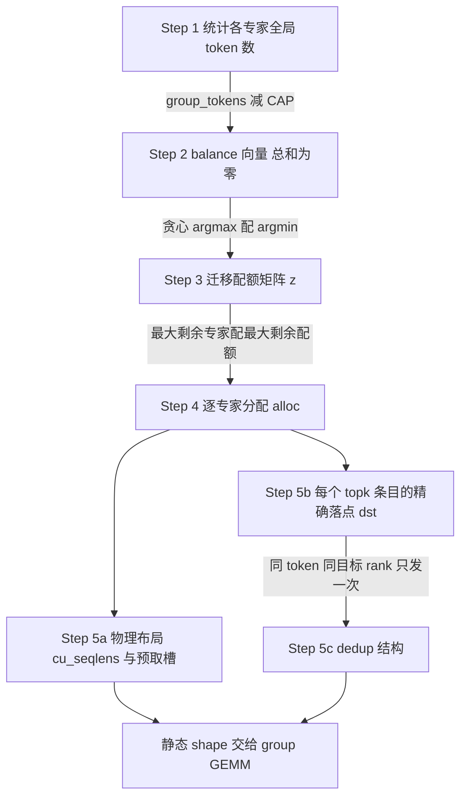

# MoonEP 源码级分析：用"动态冗余专家"把 MoE 负载均衡从软约束变成硬保证

> **来源基线**（所有 `file:line` 均已打开核对）：`MoonshotAI/MoonEP@0f385f038fc33bec22e3bcf5a07a8a22693e754c`（2026-07-28 09:37 +0800，"Add AcclEP into Acknowledgments"），MIT License。仓库共 12,723 行，本地审计快照为 clone 后的工作副本。
> **维度**：Deep Dive（机制级 + 源码级）。本页回答"MoonEP 到底做了什么、算法怎么跑、为什么这样设计、代价是什么"。
> **上游语境**：Kimi K3 技术报告 §5.2.1 只给出项目级描述（每 rank 恰收 `S×K`、最多 `E/R` 冗余槽、GPU planning、zero-copy、静态 shape、无逐层 host 同步）。本页把这些描述**逐条落到源码**，是 [[23_kimi_k3_infra_deepdive]] §5 "仍待源码或运行证据确认"表中 MoonEP 一行的兑现。
> **标记**：`[源码]` 已在上述 commit 中核对；`[README]` 项目方自述但本页未独立复现；`[推断]` 基于已核实事实的推理。
> **更新**：2026-07-28 建页。

---

## 一、主线

**MoonEP 换掉了 EP 通信库的一个隐含前提。**

DeepEP 一类库的世界观是：*router 的输出是给定的，通信层的任务是尽力而为地把 token 送到它该去的卡*。这个前提下，一步的耗时由**最热的那张卡**决定——负载不均直接变成延迟，而且各卡收到的 token 数每步都在变，于是激活 shape 动态、GEMM 形状要回读 host 才能确定、显存反复碎片化。

MoonEP 的主线是：**既然专家权重是可以复制的，那么"token 落在哪张卡"就不必等于"它路由到的专家住在哪张卡"。** 于是它在线把热门 home group 的溢出 token 迁移到空闲 rank，并把对应专家的权重**预取**过去（dynamic redundant experts）。结果是一个很强的不变量：

> 无论路由多偏，**每个 rank 恰好收到 `S×K` 个 token**（`README.md:7`）。

均衡因此从"训练期的软约束"（aux loss、bias 启发式，只能在**统计意义上**拉平）变成"执行期的硬保证"（对**任意一步的任意路由结果**都成立）。这个不变量一旦成立，四件事同时被解锁——它们才是 MoonEP 真正的收益：

| 不变量的推论 | 解决什么 | 源码/出处 |
|---|---|---|
| 通信量与 maxvio 解耦 | 延迟不再由最热 rank 决定 | `README.md:24` |
| 每步 shape 完全静态 | **消除逐层 MoE 的 host 同步**（不必回读 `tokens_per_expert` 才能定 GEMM 形状） | `README.md:9` |
| 显存布局静态 | 不再因激活 shape 抖动而碎片化，高不均衡下不 OOM | `README.md:31-32` |
| 每个 token 的落点在 planning 阶段就精确算出 | **zero-copy**：直写远端最终位置，省掉 permute in / permute out 与 comm-buffer→user-buffer 拷贝 | `README.md:9,23`；`planning_reference.py:237` |

第三条和第四条容易被忽略，但从工程角度看往往比"通信快了多少"更值钱：**静态 shape 消除的是关键路径上的 device→host 往返**，而那正是 MoE 训练里最难藏的一类停顿。

---

## 二、算法：五步把偏斜的路由改写成完全均衡的分配

仓库同时提供生产 kernel（`moonep/planning.py`，1,316 行，CUTLASS Python DSL）和一份**可读的 torch 参考实现**（`tests/planning_reference.py`，312 行）。两者语义等价（`tests/test_planning.py` 即以后者为 oracle），因此下面用参考实现讲算法、用生产 kernel 给定位符。

记号（`README.md:5,43`）：`S` = 每 rank 输入 token 数，`K` = 每 token 路由的专家数，`E` = EP 组内路由专家总数，`R` = EP rank 数，`epn = E/R` = 每 rank 拥有的专家数（home group），`B` = 每 rank 的权重预取槽数。



### Step 1 — 全局直方图与"谁超载"

`expert_count[e]` 是专家 `e` 在**所有 source rank 上的**全局 token 数；把 home group `h` 拥有的 `epn` 个专家加起来得到 `group_tokens[h]`（`planning_reference.py:61-67`；生产侧的 atomic 累加在 `planning.py:660`）。

容量 `CAP` 就是 `S×K`。定义

$$\mathrm{balance}[h] = \mathrm{group\_tokens}[h] - \mathrm{CAP}.$$

因为每个 source rank 恰好产生 `S×K` 个路由条目，全局条目数 `= R·S·K = R·CAP`，所以 **`sum(balance) = 0` 恒成立**（`planning_reference.py:68-72`）。正数是超载的 home group，负数是有空位的 rank。这条守恒是整个算法可行性的基础。

### Step 2 — 贪心配对：一次把最空的接收方填满

```python
# tests/planning_reference.py:86-97
while True:
    h = balance.argmax()      # 最超载的 home group
    u = balance.argmin()      # 最空的 dest rank
    if balance[h] <= 0: break
    move = -balance[u]        # 一次性把 u 填回 CAP
    z[h, u] = move
    balance[h] -= move
    balance[u] = 0
```

生产 kernel 的同一段跑在 **`pid==0` 的单个 warp** 上，`balance` 全程留在寄存器里，用 warp-scan 的 argmax/argmin 实现（`planning.py:671-701`，其中 `reg_scan_argmax_min_idx`/`reg_scan_argmin_min_idx` 定义于 `planning.py:258-281`）。

**这里有一个被 README 单独拎出来、但只有读算法才知道为什么成立的结论。** 注意每轮循环都把 `balance[u]` 直接置 0——也就是说**每个接收 rank 只会被选中一次**，它接收的迁移 token 全部来自**同一个** home group。由此：

> 训练时必须取 **`B = E/R`**，因为 planner 至多从一个远端 home group 复制专家（≤ `E/R` 个），此时 group GEMM 触及的每个专家都在本地（`README.md:58`）。

推理侧不需要梯度，允许 `B < E/R`，官方推荐 `B = 3–4`；若某 rank 需要的远端专家数超过 `B`，group GEMM 就通过 symmetric mapping 直接读 home rank 的权重——**慢一点，但不影响正确性**（`README.md:59`）。这是一个干净的 graceful degradation 设计：预取是优化，不是正确性前提。

### Step 3 — 把 rank 级配额摊到具体专家

对每个 home group，反复"取剩余 token 最多的本地专家，去填剩余配额最大的远端 rank"，直到配额清零（`planning_reference.py:101-122`；生产侧 `planning.py:730-768`）。产物是 `alloc[e, d]`——专家 `e` 有多少 token 落在 dest rank `d`。

参考实现随后断言两条不变量（`planning_reference.py:124-127`）：每专家 token 守恒、且**没有任何 rank 超过 `CAP`**。

### Step 4 — 物理布局：`cu_seqlens` 与预取槽的选择

对每个 dest rank `d`，把"`alloc>0` 且不属于 `d` 自己 home range"的专家按 token 数降序排，**取前 `B` 个**放进预取槽 `experts_to_copy[d,b]`（`planning_reference.py:153-164`）。

物理 token 顺序按 **VM group id** 排：`0..E-1` 是全局专家组，`E..E+B-1` 是预取槽（`planning_reference.py:169-171`）。每组按 `token_padding` 向上对齐，`cu_seqlens[d,g]` 记录对齐后的结束偏移，padding 行由 dispatch 的 zero warp 清零（`planning_reference.py:186-202`）。

这就是 MoonEP 与框架的全部契约（`README.md:45`）：

> **每个专家投影一份连续的 symmetric-memory 权重张量 `[E+B, H, H']`，加上 planner 产出的 `cu_seqlens[E+B]`。** group GEMM 纯按行号寻址专家，因此连续性是硬要求（`README.md:51`）。

权重张量的 `[0,E)` 行**物理上就是各 home rank 的参数显存**，经 symmetric memory 映射到所有 rank；`[E,E+B)` 行是预取槽，其物理内存来自**进程级共享池**，所以额外成本是"每个投影 `B` 份专家权重"**总量**，而不是每层各一份（`README.md:53-54`）。

### Step 5 — 每个条目的精确落点，以及 dedup

对本 rank 的第 `i` 个路由条目（token, k）：先算它在专家 `e` 内的全局序号，再二分查找 `alloc_cumsum[e]` 定位 dest rank，最后

```python
# tests/planning_reference.py:237
dst[i] = dest * NvS + base_off + seg_pos
```

高位是目标 rank、低位是它在该 rank **VM 物理布局中的偏移**。**这一行就是 zero-copy 的全部含义**：token 在发出之前就已经知道自己在远端 expert-grouped 布局里的最终行号，于是可以经 NVLink 直写过去，两端都不需要 permute。

`Part 3` 再做一次 dedup（`planning_reference.py:239-296`）：一个 token 的 `K` 个条目可能落在**同一个** dest rank，此时只有首次出现保留正的 `dst`，其余编码成 `-raw_dst-1`。负编码保证可逆——因为每个 topk 条目有自己的 route weight，权重的 scatter/gather 仍需还原出原始 `dst`（`planning_reference.py:245-251`）。**收益是每个 token 到每个目标 rank 的 hidden 向量只过一次 NVLink**，重复落点由目标 rank 本地展开（`moonep/dispatch_epilogue.py`，见 `dispatch.py:6-12` 的模块说明）。

---

## 三、工程形态：几乎整个库都是 Python 写的 GPU kernel

这是读源码才会注意到的一点，也是 MoonEP 与 DeepEP 最直观的差别。

| 层 | MoonEP 的实现 | 行数 |
|---|---|---|
| 通信/计划/归约 kernel | **CUTLASS Python DSL（CuTe DSL）** | `planning.py` 1316、`dispatch.py` 984、`combine.py` 654、`combine_prologue.py` 600、`grad_reduce.py` 539、`dispatch_epilogue.py` 416、`prefetch.py` 385 |
| C++/CUDA | 仅 NVLink 对称内存的分配与映射 | `csrc/bindings.cu` 60、`csrc/nvl_shared_buffer.cuh` 418 |

`csrc/bindings.cu` 暴露的全部接口只有 VMM 粒度查询、POSIX fd 形式的 IPC 导出/映射，以及 NVSwitch SHARP multicast 的创建/导入/绑定（`bindings.cu:26-58`）。**换句话说，C++ 只负责"把 R 张卡的显存拼成一段连续虚拟地址"，此后所有数据面逻辑都在 Python DSL 里。**

几个值得记的实现选择：

- **planner 是单个 cooperative kernel。** `grid=(num_sms,1,1)`、`cooperative=True`（`planning.py:390-393`），阶段之间用 grid 级 barrier（`grid_sync`）串联。全局贪心（Step 2/3）虽是串行逻辑，但跑在单 warp 的寄存器里，**计划全程不下 GPU**——这正是"消除逐层 host 同步"的实现前提。
- **dispatch**：warp-specialized G2S/S2G 环形缓冲 + 逐行 `cp.async.bulk` TMA；warp 2 专门按 `plan.zero_fill_ranges` 清 padding 行；dedup 结构由 builder warp 现场构造，复用 plan 的路径则完全跳过（`dispatch.py:1-13`）。builder warp 取 4 个，模块注释解释了原因：单 warp 的 chunk 扫描是**延迟受限**（每 SM 一条依赖加载链），拆成几个 warp 才能把结构构造藏进 NVLink 传输时间里，而超过几个之后收益趋平（`constants.py:12-17`）。
- **combine**：3 段 warp-specialized G2S / fp32 累加 / S2G；重复条目在**目标 rank 侧**由 prologue 预先归约进 primary 槽，因此 combine 只回拉去重后的行（`combine.py:1-13`）。
- **prefetch**：持久化 warp-specialized 2D TMA 流水，固定 128×128 bf16 tile，因此当前实现要求 `H`、`H'` 均为 128 的倍数（`prefetch.py:1-13`）。
- **inter_rank_sync**：在 planning 前做一次跨 rank 对齐，避免 CPU 侧或上游 stream 的偏斜污染计时（`inter_rank_sync.py:1-8`）。

### 一个写进注释的"为什么不选显而易见的做法"

`grad_reduce` 在累加完成后需要清空自己被消费过的 reduce 槽。直觉做法是让**远端写**去清——反正读的方向正忙、写的方向"空闲"。源码明确记录这条路被试过并否决：

> 远端读与远端写共享**每 GPU 单一的 NVLink 预算**（每个方向大约各占一半），骑"空闲的写方向"把 phase 1 拉长的程度，远超本地清零本身的成本（`grad_reduce.py:24-30`）。

所以最终方案是：跨 rank barrier 栅栏所有 peer 之后，**每个 rank 用 grid-strided 16B 向量存储在本地清自己的槽**。同一段注释还记录了另一条数值/编译层面的坑：累加器的 seed/store 必须走**静态 stride** 视图上的 `autovec_copy`，否则 128 寄存器的累加器会被降级到 stack alloca 或退化成标量 LDG/STG（`grad_reduce.py:11-16`）。

---

## 四、训练闭环：冗余专家的梯度怎么回家

冗余专家是**临时**的：它们在某一步被复制到别的 rank 上参与计算，产生的梯度必须回到 home rank，而且**绝不能被框架自己的梯度归约看到**。仓库的处理是（`README.md:65-69`）：

- fp32 梯度缓冲镜像权重布局，同样是 `[E+B, H, H']`；
- `[0,E)` 行是各 owner rank 的参数梯度；
- `[E,E+B)` 行**不由参数梯度支撑，而是单独的 reduce buffer**——这正是"对框架不可见"的实现方式；
- 每个 rank 把全部 `R` 份 reduce buffer 映射成一个 `[R, B, H, H']` 视图；`reduce_grad` 让每个 rank 经 NVLink **远端读**取回属于自己专家的那些槽，累加进本地参数梯度，再清空自己已消费的槽以备下一个 microbatch。

前向/反向的四次调用因此是这样对应的（`README.md:83-152`）：

| 阶段 | 调用 | 要点 |
|---|---|---|
| dispatch fwd | `buffer.dispatch(...)` → `hidden_nvsh, route_weights_nvs, cu_seqlens, plan` | `plan` 必须保存，供 prefetch/combine 与两个 backward 复用 |
| dispatch fwd | `buffer.prefetch_weight(plan, ...)` | 把 `[E,E+B)` 槽填满 |
| combine fwd | `buffer.combine(plan, hidden_nvsh)` | 回到 token-major |
| combine bwd | `buffer.dispatch(grad_output_sh, plan=plan)` | **复用 plan，跳过 planning，也不需要 prefetch** |
| dispatch bwd | `buffer.combine(plan, grad_hidden_nvsh)` + `buffer.reduce_grad(...)` | 把每 token 的 K 份梯度求和回 token-major；冗余专家权重梯度回 home |

`zero_copy=True` 时 `dispatch` 返回的是**通信缓冲区的视图**，expert FFN 必须原地读写；代价是这些视图会被下一次 `dispatch`/`combine` 覆盖，因此**不能跨通信调用持有，autograd 也不能 save 它们做 backward**——需要那样做就得用 `zero_copy=False`（`README.md:173`）。这是一条真实的使用约束，不是可选建议。

---

## 五、证据与口径（务必按原样读）

README 给出两组 H20、EP=8 的曲线，横轴是路由不均衡度

$$\mathrm{maxvio} = \max_e\left(\frac{T_e}{\bar T}\right) - 1 .$$

**基准设置**（`benchmarks/bench_vs_deepep.py:344-361`、`604-605`）：`S = 8192`/rank、`E = 384`、`H = 7168`、`K = 8`、`num_sms = 32`、maxvio 扫描 `{0.2, 1, 10, 20}`；路由用 lognormal 采样并以对数二分求解目标 maxvio 的 σ（`bench_vs_deepep.py:84-116`），种子固定 1234；三个库共用同一套 CUDA event 计时（warmup 20、iters 50、跨 rank 取均值，`bench_vs_deepep.py:59-77`），且共用同一路由矩阵与同一输入张量（`bench_vs_deepep.py:11-13`）。

README 的三条结论**是对图的定性描述，仓库没有给出数字表**（图为 PNG，本页未从像素反读数值）：

1. zero-copy 使**原始通信本身**更快——MoonEP 的通信时间在**每一个**不均衡档位都低于 DeepEP v2（`README.md:23`）；
2. 完全均衡使它**对不均衡免疫**——MoonEP 通信时间随 maxvio 增长几乎持平，而 DeepEP v2 的延迟由最热 rank 决定、持续劣化（`README.md:24`）；
3. **对比已经把 MoonEP 额外的 planning 与 prefetch kernel 计入柱状图**：即便把整条关键路径算进去，总 dispatch 时间与 DeepEP v2 的 dispatch **单项**持平，并在不均衡下反超；combine 则在每个档位都显著更快（`README.md:25`）。

端到端训练侧：DeepEP 的迭代时间随 maxvio 稳步上升，且不断变化的激活 shape 造成显存碎片，**高不均衡时训练 OOM**；MoonEP 每层每 rank 恒定计算 `S×K` 个 token，迭代时间在所有档位持平，静态显存布局不碎片、不 OOM（`README.md:31-32`）。

> [!important] 三条读表限制
> ① 基准是 **`E=384, K=8`**——这是 K2 档的 MoE 形状（`H=7168` 与 K3 一致），**不是 K3 的 896 选 16**；不能把曲线直接当作 K3 生产配置下的收益。
> ② 硬件只有 **H20**、EP 只有 **8**；跨节点、更大 EP 域、非 NVLink 互联均未给出数据。README 的 Supported Devices 写的是 NVIDIA GPU 与"Zhenwu PPU（审核中）"（`README.md:34-37`）。
> ③ 全部数字来自项目方仓库，本页**未独立复现**（复现需要 8 卡 NVLink 机器，见 `README.md:182-191` 的 `torchrun --nproc_per_node=8` 测试指令）。

**致谢栏本身也是证据**：MoonEP 自述受 DeepEP、Echo（arXiv 2603.07685）、UltraEP 与阿里 AcclEP 启发（`README.md:194-201`）——"动态冗余专家"是这一路线上的**收敛设计**，不是孤立发明。作者署名 Yutian Chen、Cong Li、Yucheng Wang、Ming Wei（`README.md:205-213`）。

---

## 六、和 Kimi K3 报告的逐条对应

K3 技术报告 §5.2.1（pp.19–20）的项目级描述，在本 commit 中全部找得到对应实现：

| 报告说法 | 源码对应 | 状态 |
|---|---|---|
| 每个 EP rank 恰好接收 `S×K` 个 token | `CAP = S×K`，Step 2/3 的守恒与容量断言 | `planning_reference.py:68-72,124-127` ✅ |
| 每 rank 最多预留 `E/R` 个冗余专家槽即可保证可行 | 贪心一次填满接收方 ⇒ 至多来自一个 home group | `planning_reference.py:86-97`；`README.md:58` ✅ |
| 在线规划、GPU planner | 单个 cooperative kernel，计划不下 GPU | `planning.py:390-393` ✅ |
| zero-copy permute/unpermute，直写远端 expert-grouped 位置 | `dst = dest*NvS + base_off + seg_pos` | `planning_reference.py:237` ✅ |
| 固定 `S×K` 通信缓冲、静态 computation shape | `cu_seqlens[E+B]` + `token_padding` 对齐 | `planning_reference.py:186-202` ✅ |
| 移除逐层 host synchronization | 静态 shape ⇒ 无需回读 `tokens_per_expert` 定形 | `README.md:9` ✅（机制成立；**端到端 host-sync 计数未给**） |
| 冗余专家梯度 reduce 回 home rank | 独立 reduce buffer + `[R,B,H,H']` 远端读 | `README.md:65-69`；`grad_reduce.py` ✅ |

**仍然不能从这个仓库得到的**：K3 生产配置（896 选 16、实际 EP 度、卡型、跨节点拓扑）下的端到端数据；MoonEP 与 K3 trainer 的接线代码；报告 Fig. 11 所述 a2a 与计算重叠的具体调度。仓库是**通用库**，不是 K3 训练栈的切片。

> 仓库层面还有一个观察：MoonEP 只有 **2 个 commit**（`51e64aa` init commit @2026-07-24 → `0f385f03` @2026-07-28）。这是一次性代码投放，没有开发历史，因此**无法从 commit 演进反推设计取舍**——所有"为什么"只能来自代码注释与 README，好在这两处写得相当详细。

---

## 七、它与 Quantile Balancing 是两层防御，不是同一件事

K3 在算法侧用 Quantile Balancing（QB）让 router 本身更均衡，在系统侧用 MoonEP 保证执行均衡。二者容易被混为一谈，但分工是清晰的：

| | Quantile Balancing | MoonEP |
|---|---|---|
| 作用对象 | **router 的 assignment**（改 expert bias） | **既定 router 输出的执行计划** |
| 保证强度 | 统计意义上趋于均衡；单步仍可能偏斜 | 对**任意**单步路由结果，硬保证每 rank `S×K` |
| 失效后果 | 专家利用率与质量受损 | 若无此层：straggler + 动态 shape + host 同步 + 碎片化 |
| 出处 | 报告 §2.3.3、Appendix C | 报告 §5.2.1；本页源码 |

换个角度说：**QB 让偏斜变小，MoonEP 让偏斜不再要紧。** 报告把两者放在不同章节，也没有声称 MoonEP 的完全均衡由 QB 保证——这一点在 [[23_kimi_k3_infra_deepdive]] §2.2 已经强调过，源码进一步佐证：planner 完全不假设路由分布，benchmark 反而**故意**在 maxvio 高到 20 的极端偏斜下测试。

这也解释了 [[01_theory/06_distributed_parallelism/expert_parallel_analysis|EP 原理页]]里"EP 最大的敌人是负载不均"这一判断在 2026 年的新答案：既往路线是**减小**不均（aux loss、bias 启发式、EPLB 静态冗余），MoonEP 则是**吸收**不均——代价是多搬 `B` 份专家权重和一次反向梯度回收。

---

## 八、代价清单（不要只记收益）

1. **权重预取流量与显存**：每个投影多 `B` 份专家权重。进程级共享池摊薄了显存（不是每层各一份，`README.md:54`），但**预取 kernel 在关键路径上**——README 明确说这部分已计入对比柱状图（`README.md:25`）。
2. **反向多一次跨卡归约**：`reduce_grad` 的远端读 + 本地清零，仅训练需要。
3. **对框架的侵入性契约**：要求"每投影一份连续 `[E+B,H,H']` symmetric-memory 权重张量"，且 group GEMM 按行号寻址（`README.md:45,51`）。这不是 drop-in 替换——现有 MoE 实现的权重必须按这个布局重排。
4. **实现期约束**：prefetch 的 128×128 tile 要求 `H`、`H'` 是 128 的倍数（`prefetch.py:9-11`）；`RANK_BITS = 7` 意味着打包编码当前最多支持 128 个 rank（`constants.py:6-7`）。
5. **zero-copy 的生命周期陷阱**：返回的视图不能跨通信调用持有，autograd 不能 save（`README.md:173`）。
6. **训练时 `B = E/R` 是硬约束**，不能为省显存调小（`README.md:58`）。

---

## Related Pages

- [[01_theory/06_distributed_parallelism/expert_parallel_analysis]] — EP 原理与"负载不均是命脉"的基础判断（本页是该问题的 2026 年新解法）
- [[01_theory/06_distributed_parallelism/collectives_analysis]] — all-to-all 的代价结构
- [[23_kimi_k3_infra_deepdive]] — K3 报告 §5.2.1 的项目级描述与本页的源码兑现
- [[22_kimi_k3_architecture_deepdive]] — Stable LatentMoE 与 Quantile Balancing（MoonEP 的算法侧搭档）
- [[26_kimi_k3_open_source_stack_analysis]] — K3 随发布开源的 kernel/工具链全景（MoonEP 在其中的位置）
- [[14_kimi_k3_analysis]] — K3 发布总览
- [[02_engineering/02_train_frameworks/megatron-lm/megatron_ep_analysis]] — Megatron 的 EP token dispatcher 实现对照
- [[02_engineering/02_train_frameworks/comm_compute_overlap_analysis]] — 通信-计算重叠的一般机制
