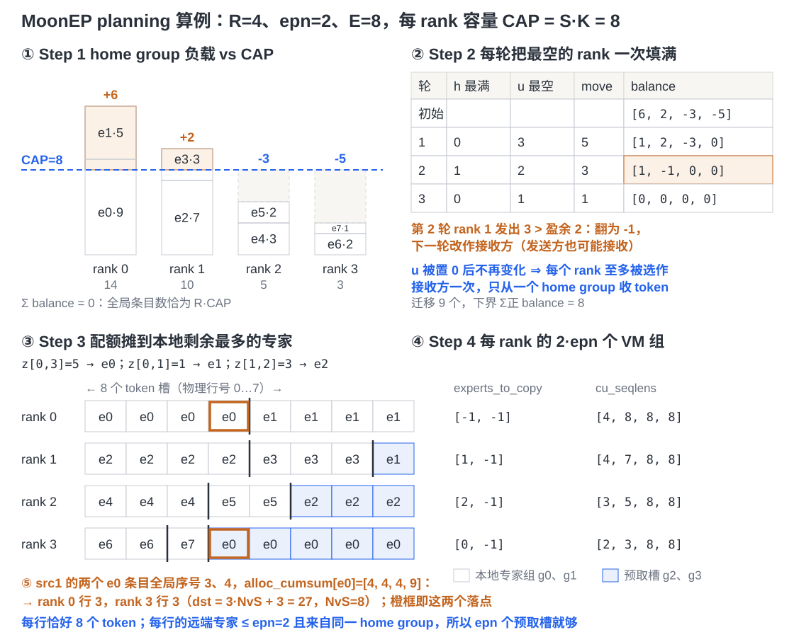
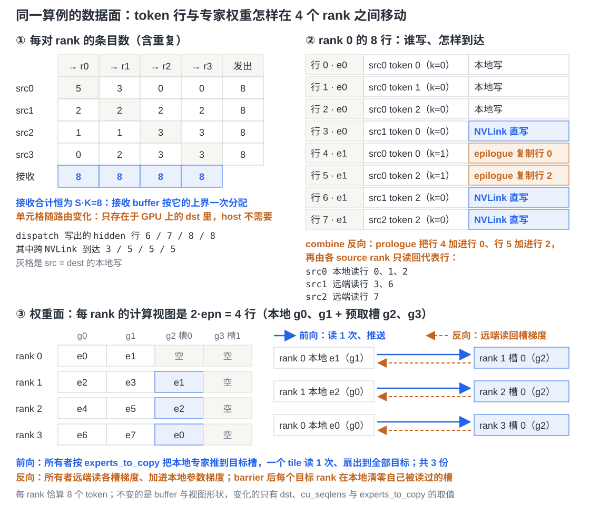
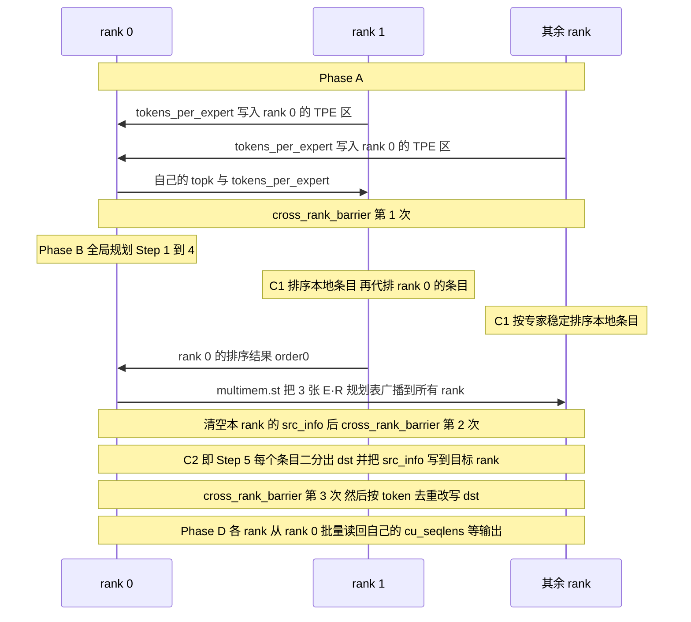
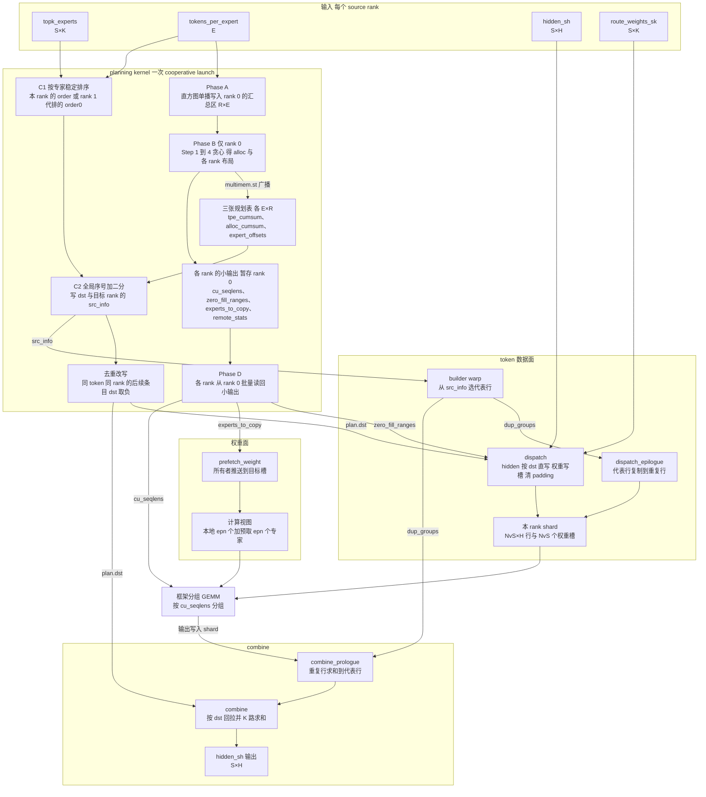
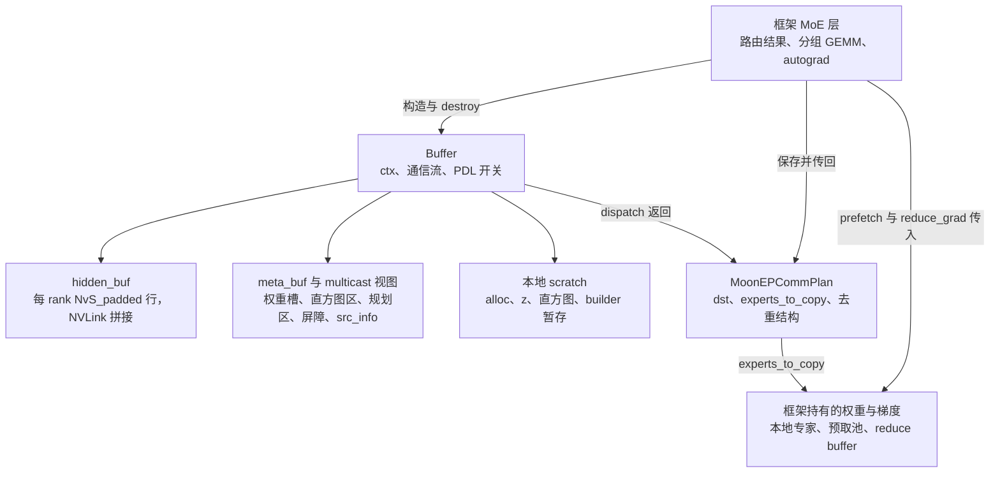

# MoonEP 源码级分析：用"动态冗余专家"把 MoE 负载均衡从软约束变成硬保证

> **源码基线**：`MoonshotAI/MoonEP@33327eb9c4a8`（`main`，2026-09-20）
> **主题**：MoonEP 让每个 EP rank 无论路由多偏都恰好计算 `S×K` 个 token。本页先用一个 R=4 的最小实例走完一步 MoE 层：planning 五步把偏斜路由改写成均衡分配，token 数据面用固定形状的单边直写与去重完成 dispatch/combine，权重面用预取推送与梯度回收让迁走的 token 找到专家；再逐个组件讲契约、设计理由与代价，最后是变体、整体开销、对象与调用流程、与 Kimi K3 的对应、证据口径、约束与配置契约。核心代码在 `moonep/planning.py`、`dispatch.py`、`combine.py`、`prefetch.py`、`grad_reduce.py` 与 `api.py`。
> **适用范围**：MoonEP 库本身（NVLink 域内的 EP 通信、权重预取与梯度回收）；K3 报告的项目级描述见 [[23_kimi_k3_infra_deepdive|Kimi K3 训推基础设施]]，EP 的一般原理与 Megatron 的 token dispatcher 分别见 [[01_theory/06_distributed_parallelism/14_expert_parallel_analysis|EP 原理]] 与 [[14_megatron_ep_analysis|Megatron EP]]。
> **最近更新**：2026-09-24。按特性页结构重组全页，补齐固定形状通信、直方图交换、去重全链路、权重面与训练闭环，并新增数据面原理图。

标注约定：未加标注的机制陈述都已在上述 commit 的源码中核对；「README」表示项目方自述、本页未独立复现；「推断」表示基于已核实事实的推理；「估算」表示本页按形状或假设算出的量级。本地快照（非图片文件共 13,973 行）只做了静态阅读，没有在 GPU 上运行。

---

## 1. 特性概览

### 1.1 问题背景

EP 把一层的 `E` 个路由专家按连续块分给 `R` 个 rank，每个 token 的 `K` 个路由条目要送到所选专家所在的 rank 去算。路由每一步都在变，而且可能很偏，这带来三个问题。第一，一步的耗时由收到最多 token 的 rank 决定。第二，各 rank 收到的 token 数是运行期数据，接收 buffer 的大小、all-to-all 的 split 和 GEMM 的形状都要先把计数从 GPU 拷回 host 才能确定——Megatron 为此专门排了一条"同步点阶梯"（见 [[14_megatron_ep_analysis|Megatron EP]]）。第三，激活形状每步抖动，显存反复碎片化。aux loss 和 bias 调整（如 K3 的 Quantile Balancing）只能在统计意义上拉平负载，任何单步仍可能偏斜。

### 1.2 解决方法

MoonEP 的出发点是：**专家权重可以复制，所以"token 落在哪张卡"不必等于"它的专家住在哪张卡"。** 每一步它在 GPU 上根据当前路由做一次规划，把超载 home group 溢出的 token 迁到有空位的 rank，再把相应专家的权重临时复制过去（dynamic redundant experts），使每个 rank 恰好计算 `S×K` 个 token。整个功能分三条面：

- **规划（控制面）**：`Buffer.dispatch` 里的一个 cooperative kernel。各 rank 只交换专家直方图，rank 0 集中做五步贪心并用 NVLink multicast 广播结果，各 rank 再在本地算出自己每个条目的最终落点 `dst`。
- **token 数据面**：dispatch 按 `dst` 把 hidden 行单边直写到远端 buffer 的最终行号；同一 token 落到同一 rank 的几个条目只发一次，到了对端再复制。combine 反向回拉并求和。buffer 在构造时一次分配好，形状不随路由变化。
- **权重面**：`prefetch_weight` 让专家所有者把被迁移专家的权重推进目标 rank 的预取槽；训练反向时，`reduce_grad` 把这些槽上的梯度读回所有者。

它替换的是框架 MoE 层里的 EP 通信。K3 报告 §5.2.1 称 K3 在执行侧用它保证负载完全一致；仓库本身是通用库，没有与 K3 trainer 的接线代码。

### 1.3 收益、开销和约束

| 维度 | 直接收益 | 必付成本或边界 |
|---|---|---|
| 负载 | 对任意单步路由，每个 rank 恰好计算 `S×K` 个 token（README「Perfect balance」），延迟不再由最热 rank 决定 | 要复制专家权重；迁移量不是最少（§2.1.4） |
| 形状与同步 | buffer、视图、kernel grid 的形状都固定，没有逐层 D2H，也没有 split list（README「Zero copy and static shapes」） | 形状按上界 `NvS` 分配，含 padding 冗余 |
| 通信 | 单边直写到最终行号，省掉 permute 与 comm-buffer→user-buffer 拷贝；同 token 同 rank 的 hidden 只传一次 | 每对 rank 之间的流量仍随路由变化；只能在 NVLink 域内工作（对称内存 + multicast） |
| 显存 | 静态布局，不碎片、高不均衡下不 OOM（README「End-to-end training」） | 每个投影多一个 `epn` 个专家大小的预取池；训练还要一份 fp32 reduce buffer；两者常驻，但全模型只有一份，不随层数增长 |
| 训练 | 冗余专家的梯度自动回到所有者，框架自己的参数梯度归约感知不到 | 反向多一次 `reduce_grad`（远端读加本地清零） |
| 集成 | 交给框架的是 `[NvS, H]` 行加 `cu_seqlens`，直接喂分组 GEMM | 框架要按本地 `[epn, H, H']` 加预取池 `[R, epn, H, H']` 组织权重；zero-copy 视图有生命周期约束 |
| 规划 | 全程在 GPU 上，直方图流量只有几十 KB | 全局规划集中在 rank 0；设备必须支持 NVLink multicast |

### 1.4 术语与记号

记号沿用 README「Integration」：

| 记号 | 含义 |
|---|---|
| `S` / `K` | 每 rank 输入 token 数 / 每个 token 路由的专家数 |
| `E` / `R` | EP 组内路由专家总数 / EP rank 数 |
| `epn = E/R` | 每 rank 的本地专家数，同时也是它的预取槽数和 reduce 槽数 |
| `CAP = S×K` | 每 rank 的真实接收容量，代码里叫 `NvS_capacity` |
| `NvS` | 每 rank 的 dispatch 槽数：`S×K` 个真实 token 加每组 padding |
| `H` / `H'` | hidden size / 专家 FFN 中间维度 |

其中 `E`、`R`、`epn` 与常见配置名的对应如下：

| MoonEP 记号 | MoonEP 中的来源 | Megatron 配置 | 常用叫法 |
|---|---|---|---|
| `E` | `Buffer(E=...)` | `num_moe_experts`（`--num-experts`） | experts num：每个 MoE 层的路由专家总数 |
| `R` | `Buffer(num_ep_ranks=...)` | `expert_model_parallel_size` | ep：EP 并行度 |
| `epn` | 内部按 `E // num_ep_ranks` 计算 | `num_local_experts` | local experts num：每张卡常驻的专家数 |

两边都要求整除：`api.py::_create_context` 断言 `E % R == 0`，Megatron 在 `BaseMoELayer.__init__` 断言 `num_moe_experts % ep_size == 0`（见 [[14_megatron_ep_analysis|Megatron EP]]）。两边也都按连续块分配专家：rank `h` 持有专家 `h·epn` 到 `h·epn+epn−1`，这组专家称为 rank `h` 的 **home group**。读这三个定义时要注意四点：

- **路由专家**：`E` 不含 shared expert。shared expert 在本地计算，不经 EP 通信，MoonEP 全仓也没有处理它的代码。K3 的"896 选 16"对应 `E=896, K=16`。
- **EP 组内**：`R` 是一个 EP 组的大小，不是全局卡数。DP=8 × EP=8 的 64 卡上有 8 个 EP 组，每组都持有全部 `E` 个专家，此时 `R=8`；`_create_context` 断言 `num_ep_ranks` 等于传入进程组的大小。
- **按层**：`E` 是单个 MoE 层的专家数，每层每步各做一次 planning。
- **`epn` 身兼三职**：它同时是每 rank 的预取槽数和 reduce 槽数。Megatron 的一张卡每步只算自己的 `num_local_experts` 个专家；MoonEP 的一张卡最多要算 `2·epn` 个（本地 `epn` 个，加至多 `epn` 个预取来的），计算视图因此是 `[2·epn, H, H']`。另外，MoonEP 的权重接口是每个专家的完整矩阵 `[epn, H, H']`，全仓没有 expert tensor parallel 相关参数，所以 Megatron 开启 `expert_tensor_parallel_size > 1` 时不能直接套用这张对照（推断）。

示例：README 的 `E=256, R=8` 得 `epn=32`；基准的 `E=384, EP=8` 得 `epn=48`；§2.1 算例的 `E=8, R=4` 得 `epn=2`。

其余术语：

| 术语 | 含义 |
|---|---|
| source rank（src） | token 原本所在、跑完 router 的 rank；它负责发出和回收自己的 `S×K` 个条目 |
| dest rank | 实际计算某个条目的 rank；未迁移时就是专家的 home rank |
| VM 组 | dest rank 上的一段连续行，对应一个专家；前 `epn` 组是本地专家，后 `epn` 组是预取槽 |
| 预取槽 | dest rank 上临时存放远端专家权重的位置，`experts_to_copy[d, b]` 记录 rank `d` 第 `b` 个槽放的是哪个专家 |
| `dst` | 条目的全局落点，编码为 `dest·NvS + 行号`；重复条目取 `−dst−1` |
| `src_info` | 发送方写到 dest rank 每一行的来源，编码为 `src_rank·NvS + 条目号` |
| 代表行 / 重复组 | 同一 token 落到同一 rank 的几个条目里，真正收到 hidden 的那一行是代表行，其余行与它组成重复组 |

---

## 2. 特性详细方案

### 2.1 最小实例：R=4、epn=2 的一步 MoE 层

取 `R=4`、`epn=2`（`E=8`）、`S=4`、`K=2`，于是 `CAP=8`，`token_padding=1` 时 `NvS=8`。四个 source rank 的 `topk` 如下（按 token 展平，每两个数是一个 token 的两个条目）：

| source rank | topk 展平 |
|---|---|
| src0 | `[0, 1, 0, 2, 0, 1, 2, 3]` |
| src1 | `[0, 2, 0, 4, 1, 5, 2, 6]` |
| src2 | `[0, 2, 0, 3, 1, 4, 2, 7]` |
| src3 | `[0, 1, 0, 2, 3, 4, 5, 6]` |

这个输入刻意包含三种情形：有 rank 发出的比盈余多、之后又变成接收方；同一专家的条目被拆到两个 rank；同一 token 的两个条目落在同一 rank。两张图与本节的全部数字，都由 `tools/figs/svg/moonep_planning_figures.mjs` 按参考实现 `tests/planning_reference.py` 与各 kernel 的规则逐步重放得出，同目录的测试把它们与本页正文对拍。第一张图是规划，第二张图是数据面与权重面。

#### 2.1.1 规划：五步把偏斜路由改写成每 rank 8 个 token



| 步 | 本例输入 | 决定性规则 | 本例输出与不变量 |
|---|---|---|---|
| 1 全局直方图 | 各 rank 的 `tokens_per_expert` | `balance[h] = group_tokens[h] − CAP` | `balance` 四项和为 0 |
| 2 贪心配对 | `balance` | 每轮取最满的 `h` 与最空的 `u`，`move = −balance[u]`，把 `u` 一次填满 | 3 轮；每个 rank 至多当一次接收方 |
| 3 摊到专家 | `z` 与 home group 内各专家计数 | 用剩余最多的本地专家填剩余最大的配额 | `alloc[e, d]`；每 rank 恰好 8 |
| 4 物理布局 | `alloc` | 前 `epn` 组放本地专家，后 `epn` 组按全局专家号放远端专家，每组对齐 `token_padding` | `experts_to_copy`、`cu_seqlens`；远端专家不超过 `epn` |
| 5 条目落点 | 本 rank 的 `(token, k)` | 由持有 token 的 rank 各自计算：专家内全局序号 → 在 `alloc` 前缀和上二分出 dest → 行号；同 token 同 dest 的后续条目取负 | `dst`，发送前就知道远端最终行号 |

**Step 1.** 汇总后 `expert_count = [9, 5, 7, 3, 3, 2, 2, 1]`，四个 home group 的负载是 `group_tokens = [14, 10, 5, 3]`，减去 CAP 得 `balance = [6, 2, -3, -5]`，和为 0。

**Step 2.** 三轮贪心：

| 轮 | h（最满） | u（最空） | move | 该轮后 balance |
|---|---|---|---|---|
| 1 | 0 | 3 | 5 | `[1, 2, -3, 0]` |
| 2 | 1 | 2 | 3 | `[1, -1, 0, 0]` |
| 3 | 0 | 1 | 1 | `[0, 0, 0, 0]` |

第 2 轮值得停一下：rank 1 只有 2 的盈余，却因为要"一次填满 rank 2"发出了 3，自己翻成 −1；第 3 轮它作为接收方，从 home group 0 收回 1 个。**同一个 rank 可以既发送又接收**，但作为接收方，它仍只对接一个 home group。代价是总迁移量 9，比下界 `Σ 正 balance = 8` 多 1。

**Step 3.** `z[0,3]=5` 由 home group 0 中剩余最多的 e0（9 个）承担；接着处理 `z[0,1]=1`，此时 e0 剩 4、e1 剩 5，于是改由 e1 承担；`z[1,2]=3` 由 e2 承担。

**Step 4.** 每个 rank 的 4 个 VM 组（每组是一个**专家**的 token，来源可以是多个 source rank）：

| dest rank | 本地组 g0、g1 | 预取槽 g2、g3 | `experts_to_copy` | `cu_seqlens` |
|---|---|---|---|---|
| rank 0 | e0×4、e1×4 | 空、空 | `[-1, -1]` | `[4, 8, 8, 8]` |
| rank 1 | e2×4、e3×3 | e1×1、空 | `[1, -1]` | `[4, 7, 8, 8]` |
| rank 2 | e4×3、e5×2 | e2×3、空 | `[2, -1]` | `[3, 5, 8, 8]` |
| rank 3 | e6×2、e7×1 | e0×5、空 | `[0, -1]` | `[2, 3, 8, 8]` |

每行恰好 8 个 token。`cu_seqlens` 是各组对齐后的结束偏移；`remote_stats` 是规划顺带输出的两个统计数，第二项记本 rank 的专家被别处复制了几份——rank 0 的专家 e0、e1 分别被复制到 rank 3 和 rank 1，所以 rank 0 的 `remote_stats` 第二项为 2。

若把 `token_padding` 改成 4，分配不变，只有布局变化：`NvS = align_up(8 + 3·2·2, 4) = 20`，rank 3 的 `cu_seqlens = [4, 8, 16, 16]`，三段 padding 的起点与行数由规划的另一个输出 `zero_fill_ranges` 标出，由 dispatch 的 zero warp 清零。

**Step 5：持有 token 的卡自己决定每个条目发给谁。** 前四步由 rank 0 算出来的只是**数量与版面**：e0 的 9 个条目里，前 4 个留在 rank 0、后 5 个去 rank 3，以及 e0 在这两个 rank 上各占哪几行。它没有、也不需要说明是**哪几个**条目。这一步由真正持有 token 的各 source rank 各自完成：每张卡按同一条分配规则，判断自己的每个条目该发去哪个 rank、落在哪一行，得到它的**槽位号** `dst = dest·NvS + 行号`。整个过程不交换任何 token 级信息。

以专家 e0 为例。先看这 9 个条目分别在哪（每个 token 选 2 个专家）：

| | token 0 | token 1 | token 2 | token 3 | 含 e0 的 token |
|---|---|---|---|---|---|
| src0 | (0, 1) | (0, 2) | (0, 1) | (2, 3) | t0、t1、t2，共 3 个 |
| src1 | (0, 2) | (0, 4) | (1, 5) | (2, 6) | t0、t1，共 2 个 |
| src2 | (0, 2) | (0, 3) | (1, 4) | (2, 7) | t0、t1，共 2 个 |
| src3 | (0, 1) | (0, 2) | (3, 4) | (5, 6) | t0、t1，共 2 个 |

每张卡再分三小步：

1. **排队领号：确定自己的条目在全组排第几。** 要让各卡各自判断"我的条目属于前 4 个还是后 5 个"，大家必须对"谁排第几"有同一个答案。约定是把全组的 e0 条目排成一队：先按 source rank 排，同一 rank 内再按条目在 topk 展平数组里出现的先后排。于是 src0 的 3 个是 0–2，src1 的 2 个是 3、4，src2 的是 5、6，src3 的是 7、8。每张卡不必看到别人的 token 就能算出自己的号：

    `号码 = 排在前面的所有 rank 的 e0 条目总数 + 本条目在本 rank 的 e0 条目里排第几（从 0 数）`

    "前面的总数"只依赖各卡上报的直方图：e0 这一列是 `[3, 2, 2, 2]`，前缀和 `[0, 3, 5, 7]` 就是四张卡各自的起始号码。rank 0 广播下来的 `tpe_cumsum` 存的是含本 rank 在内的累计值，`tpe_cumsum` 在 e0 这一列是 `[3, 5, 7, 9]`，rank r 取第 r−1 项作为起始号码（rank 0 取 0）。src1 前面只有 src0 的 3 个，所以它的 t0 拿 3 号、t1 拿 4 号。
2. **按数量切段：确定目标 rank。** `alloc_cumsum[e0] = [4, 4, 4, 9]` 是 e0 分给 rank 0–3 的累计条目数，它把号码轴切成首尾相接的四段：0–3 号归 rank 0，4–8 号归 rank 3，rank 1、rank 2 的段长为 0。号码落在哪一段，条目就去哪个 rank；kernel 里这是一次二分查找。
3. **段起点加段内位置：确定目标行。** rank 0 的 e0 段从第 0 行开始；rank 3 的布局是 e6×2、e7×1、e0×5，e0 段从第 3 行开始，4 号是这一段里的第 0 个。

| e0 的全局序号 | 0 | 1 | 2 | 3 | 4 | 5 | 6 | 7 | 8 |
|---|---|---|---|---|---|---|---|---|---|
| 来自 | src0 t0 | src0 t1 | src0 t2 | src1 t0 | src1 t1 | src2 t0 | src2 t1 | src3 t0 | src3 t1 |
| 目标 rank | 0 | 0 | 0 | 0 | 3 | 3 | 3 | 3 | 3 |
| 目标行 | 0 | 1 | 2 | 3 | 3 | 4 | 5 | 6 | 7 |
| `dst` | 0 | 1 | 2 | 3 | 27 | 28 | 29 | 30 | 31 |

于是 src1 的第一个 e0 条目落在 rank 0 第 3 行（`dst = 3`）；第二个落在 rank 3 第 3 行，`dst = 3·8 + 3 = 27`。**同一个 source rank 发往同一专家的两个条目可以落在不同 rank 上**：切分发生在号码轴上，迁移是 token 级的，而不是整个专家搬家。号码全局唯一，各 rank 的段又互不重叠，所以每个槽位恰好由一个条目写入，四张卡可以不经协调地并发直写。`dst` 就是这个槽位在整个 EP 组里的编号，dispatch 按它把 hidden 行直接写到目标卡的对应行，换算方式见 §2.2.3。

#### 2.1.2 token 数据面：固定形状的直写、去重与回拉



规划只产出 `dst`，真正搬数据的是 dispatch。把全部 32 个条目按 source rank 与 dest rank 汇总：

| | → rank 0 | → rank 1 | → rank 2 | → rank 3 | 发出合计 |
|---|---|---|---|---|---|
| src0 | 5 | 3 | 0 | 0 | 8 |
| src1 | 2 | 2 | 2 | 2 | 8 |
| src2 | 1 | 1 | 3 | 3 | 8 |
| src3 | 0 | 2 | 3 | 3 | 8 |
| 接收合计 | 8 | 8 | 8 | 8 | |

**固定的**是每列之和，即每个 rank 接收的条目数恰好是 `S·K`。buffer 形状由它定死；kernel 的 grid（`num_sms` 个 CTA）与循环边界（`S`、`K`）本来就是常量。**不固定的**是单元格：每对 rank 之间发多少随路由变化，但它只存在于 GPU 上的 `dst` 里，host 从头到尾不需要知道。这就是 MoonEP 没有 all-to-all split list 的原因（§2.2.3）。

以 rank 0 为例，它的 8 行分别来自：

| 行 | 专家 | 来自 | 到达方式 |
|---|---|---|---|
| 0 | e0 | src0 token 0，k=0 | 本地写 |
| 1 | e0 | src0 token 1，k=0 | 本地写 |
| 2 | e0 | src0 token 2，k=0 | 本地写 |
| 3 | e0 | src1 token 0，k=0 | NVLink 直写 |
| 4 | e1 | src0 token 0，k=1 | epilogue 复制行 0 |
| 5 | e1 | src0 token 2，k=1 | epilogue 复制行 2 |
| 6 | e1 | src1 token 2，k=0 | NVLink 直写 |
| 7 | e1 | src2 token 2，k=0 | NVLink 直写 |

src2 的数据会到 rank 0，是因为 src2 的 token 2 选了 e1，而 e1 的 home 就是 rank 0：这是普通的 EP 流量，与迁移无关。迁移只改变少数条目的去向——e1 的 5 个条目里，只有全局序号 4（src3 的那一条）被迁去了 rank 1。

行 4、5 分别与行 0、2 是同一个 token：src0 的 token 0 与 token 2 都选了 (e0, e1)，两个条目落在同一个 rank。规划的最后一步会把同一 token 落到同一 rank 的后续条目的 `dst` 改写成负数：token 0 的 `[0, 4]` 变成 `[0, −5]`（`−4−1`）；token 3 选了 (e2, e3)，都落在 rank 1 的第 1 行和第 4 行，第二个改写成 `−(1·8+4)−1 = −13`。src0 最终的 `dst = [0, -5, 1, 8, 2, -6, 9, -13]`。取负的条目不再发 hidden，由 `dispatch_epilogue` 在目标 rank 本地复制，机制见 §2.2.4。四个 rank 上 dispatch 写出的 hidden 行依次是 6、7、8、8；扣掉 src 与 dest 相同的本地写，跨 NVLink 到达的依次是 3、5、5、5。

反方向由 combine 完成：rank 0 上，`combine_prologue` 先把行 4 加进行 0、行 5 加进行 2（fp32），然后各 source rank 只读回代表行——src0 本地读行 0、1、2，src1 远端读行 3、6，src2 远端读行 7。每个 `(token, dest rank)` 只读回一行，这一行已经是该 token 在这个 rank 上的部分和。

#### 2.1.3 权重面：预取推送与梯度回收

迁移后的 token 需要专家权重在场。按 `experts_to_copy` 共有 3 份复制：rank 0 把 e1 推到 rank 1 的槽 0，rank 1 把 e2 推到 rank 2 的槽 0，rank 0 把 e0 推到 rank 3 的槽 0。每个 rank 的计算视图是 4 行：前两行是本地专家，后两行是预取槽，例如 rank 1 的视图是 `[e2, e3, e1, 空]`，正好对应它 `cu_seqlens` 的 4 个组。

训练反向时方向相反：专家所有者远端读回各槽上的权重梯度，加进本地参数梯度——rank 0 读 rank 1 与 rank 3 的槽 0，rank 1 读 rank 2 的槽 0。跨 rank 屏障之后，rank 1、2、3 各自在本地把被读过的槽 0 清零，为下一个 microbatch 做准备。

#### 2.1.4 为什么成立：守恒、单一来源与槽位上界

**1. 守恒。** 每个 source rank 恰好产生 `S×K` 个路由条目。记 $T_e$ 为专家 $e$ 的全局 token 数，则

$$
\sum_{h=0}^{R-1}\mathrm{balance}_h=\sum_{e=0}^{E-1}T_e-R\cdot\mathrm{CAP}=R\,SK-R\,SK=0 .
$$

正项之和等于负项绝对值之和，所以贪心一定能把所有 rank 配平。

**2. 每个 rank 至多当一次接收方，Step 2 至多 `R−1` 轮。** 被选作 `u` 的 rank 当轮置 0，此后它既不可能成为正的 argmax，也不会再被 argmin 选中——如果最小值已经是 0，由和为 0 可知全体为 0，循环已经结束。所以每轮至少永久"退役"一个 rank，最后一轮同时退役两个，总轮数不超过 `R−1`。于是每个接收 rank 在 `z` 的列上只有一个非零项：它迁入的 token 全部来自同一个 home group。

**3. Step 3 的配额总能兑现。** home group `h` 每次发送前都满足 `balance[h] > 0`，也就是此前已发出的量小于 `group_tokens[h] − CAP`；而任一次 `move = −balance[u]` 都不超过 CAP（因为 `balance[u] ≥ −CAP`）。两者相加，`h` 的总发出量严格小于 `group_tokens[h]`，本组专家的 token 一定够填满全部配额。参考实现在 Step 3 之后用两个断言固化结果：每专家守恒、没有 rank 超过 CAP。kernel 在 Step 3 循环里多一道 `max_remaining <= 0` 的退出判断，按上面的论证它不会被触发（推断）。

**4. 槽位与行数上界。** 由第 2 条，一个 rank 迁入的远端专家都属于同一个 home group，最多 `epn` 个，所以 `epn` 个预取槽一定够——参考实现在超出时抛 `AssertionError`，kernel 则直接按 `epn` 分配 `experts_to_copy`、不做任何取舍。同理，一个 rank 至多有 `epn` 个本地段加 `epn` 个远端段，每个非空段对齐时最多浪费 `token_padding − 1` 行，于是 `_create_context` 把 `NvS` 定为 `align_up(S·K + (token_padding−1)·2·epn, token_padding)`，注释写明这个上界正是由"每个接收 rank 至多来自一个远端 home group"推出的。

**5. 它不追求最少迁移。** 算例里的迁移量 9 大于下界 8，多出的 1 来自"一次填满接收方"造成的过冲。README 称 planner "near-optimal"，但仓库没有定义它优化的目标。一个显而易见的替代是按最少迁移量求解分配（例如运输问题），但那样一个接收方可能同时对接多个 home group，远端专家数就不再以 `epn` 为界，槽位与 `NvS` 都要放大。这个贪心换来的是两件对系统更要紧的事：每个接收方只对接一个 home group，槽位因此有界；每轮只需一次 argmax 和一次 argmin，能放在一个 warp 的寄存器里跑完（推断）。

**复杂度。** Step 2 至多 `R−1` 轮，每轮是长度 `R` 的一次 argmax 和一次 argmin。Step 3 对每个 home group，每轮至少清零一个配额或一个专家的剩余，轮数不超过"接收方个数 + epn"。Step 4 对每个 dest rank 扫一遍 `E` 个专家。Step 5 每个 rank 对 `S·K` 个条目各做一次长度 `R` 的二分，即 `O(SK·log R)`。前四步的规模只和 `R`、`E` 有关，与 token 数无关。

### 2.2 从最小实例到整个系统

下面按一次训练步中出场的顺序，逐个讲各组件的契约、为什么需要它、怎样做到，以及它引入的代价与边界。想先看整条数据流、以及每份规划元数据由谁产生、放在哪、被谁消费，可以先读 §3.1 的全景图与元数据台账。

#### 2.2.1 Buffer：一次分配的对称内存与静态形状

**契约。** `Buffer(S, H, K, E, num_ep_ranks, ...)` 在构造时调用 `_create_context`，一次性分配此后所有调用共用的状态，直到 `destroy()`：每 rank 一块 `hidden_buf [NvS_padded, H]` bf16；一块 int32 的 `meta_buf`，依次放路由权重槽 `[0, NvS)`、直方图汇总区、规划输出区、排序暂存区、屏障槽与 `src_info`；以及若干本地 scratch 和一个高优先级通信流。

**为什么。** 替代做法是每步按实际计数分配接收张量，但那要先把计数拷回 host。MoonEP 的规划保证每个 rank 的接收量不超过由 `S`、`K`、`epn`、`token_padding` 决定的上界 `NvS`（推导见 §2.1.4 第 4 条），而这几个量在构造时就已知，所以可以按上界一次分配，此后再也不需要 host 知道本步的计数，也不会因形状变化而碎片化。

**怎样做到。** `buffer.py` 用 CUDA VMM 分配每 rank 的块，把它导出成共享句柄（POSIX fd 或 64 字节 fabric handle），交换后再把所有 rank 的块映射成**一段连续的虚拟地址**：任何 rank 都能用普通的 load/store 或 TMA 读写别人的块，地址就是 `基址 + rank × 块长 + 偏移`。用哪种句柄由 `buffer.py::_use_fabric_for_group` 决定：默认的 `auto` 模式先在组内 `all_gather` 各 rank 的 fabric 探测结果，只要全部支持就用 fabric handle——不看是否跨节点，单节点也一样；否则用 fd。模块注释写的是"组跨多个节点时用 fabric"，与代码不一致，以代码为准。fd 只能在同节点内传递，fabric handle 能在同一 NVLink 域的多节点间使用（`39859eb`，#23）。`meta_buf` 另外绑定一个 NVSwitch SHARP multicast 对象，得到一个 multicast 地址；按 CUDA multicast 对象的语义，对它的一次写会复制到每个绑定 rank 的同一偏移处（`_create_nvl_multicast_view`）。这些分配、导出、映射与 multicast 绑定由 `csrc/nvl_shared_buffer.cuh` 实现，`csrc/bindings.cu` 只是 pybind 接口；数据面逻辑都在 CuTe DSL 写的 kernel 里。

**代价与边界。** 按基准配置（`S=8192, K=8, E=384, R=8, H=7168, token_padding=128`）估算：`NvS = 77824`，比 `S·K = 65536` 多 18.75% 的行；`hidden_buf` 每 rank 约 1.04 GiB。构造时断言 `E % R == 0`、`num_ep_ranks` 等于进程组大小、各种跨 rank 下标不溢出 int32，并断言设备支持 multicast；`R ≤ 128`、`K ≤ 32`、`NvS ≤ 2^24−1` 这几条去重编码的上限要到第一次 fresh dispatch 才由 `launch_planning` 检查。

#### 2.2.2 planning kernel：只交换直方图，rank 0 集中规划

**契约。** 输入是本 rank 的 `topk_experts [S,K]` 和 `tokens_per_expert [E]`；输出全部留在 GPU 上，另有一个副作用：在各 dest rank 上发布 `src_info`。

| 输出 | 形状 | 含义 |
|---|---|---|
| `plan.dst` | `[S·K]` int32 | 本 rank 每个条目的全局落点；同 token 的重复目标编码为负数 |
| `cu_seqlens` | `[2·epn]` int32 | 本 rank 各 VM 组按 `token_padding` 对齐后的结束偏移 |
| `plan.experts_to_copy` | `[R, epn]` int32 | **全部** rank 的预取槽表，`-1` 为空槽；预取 kernel 按它推送权重 |
| `plan.zero_fill_ranges` | `[2·epn, 2]` int32 | 各组 padding 行的起点与行数，由 dispatch 的 zero warp 清零 |
| `plan.remote_stats` | `[2]` int32 | 本 rank 预取的远端专家数、本 rank 专家被别处预取的份数；当前库内没有 kernel 消费它，只随 plan 保存并在测试中对拍 |

`tokens_per_expert` 必须与 `topk_experts` 一致。`api.py` 只检查了它的 dtype 与长度，没有检查它是否等于 `topk` 的直方图；不一致时的行为本页没有验证。

**为什么只交换直方图。** rank 0 定下的只是数量（每个专家有几个条目去哪个 rank）与版面；具体哪个条目发给谁，由持有它的 rank 按 §2.1.1 Step 5 的排队规则在本地推出，只需要直方图沿 source rank 的前缀和，所以逐 token 的路由信息从不跨 rank 交换。显而易见的替代是先交换逐条目路由（例如 all-gather 各 rank 的 `topk`）再统一指派，按基准配置每 rank 要广播 256 KiB，而直方图只有 1.5 KiB（推断）。参考实现走的是中间路线：用 `dist.all_gather` 让每个 rank 拿到完整直方图，再各自把整份计划重复算一遍。

**为什么集中在 rank 0。** Step 1–4 的规模只和 `R`、`E` 有关，Step 2 又是本质串行的贪心。kernel 让 rank 0 一处算完，再用一次 multicast 写把表送到所有 rank。源码没有解释为什么不让各 rank 冗余计算；能看到的效果是规划只有一个写者，各 rank 读到的表按构造就相同，所需通信只是 R→1 的计数汇聚加一次广播（推断）。

**怎样做到。** `PlanningKernel.__call__` 以 `grid=(num_sms,1,1)`、每 CTA 512 线程、`cooperative=True` 启动一次：


```mermaid
sequenceDiagram
    participant R0 as rank 0
    participant R1 as rank 1
    participant RK as 其余 rank
    Note over R0,RK: Phase A
    R1->>R0: tokens_per_expert 写入 rank 0 的 TPE 区
    RK->>R0: tokens_per_expert 写入 rank 0 的 TPE 区
    R0->>R1: 自己的 topk 与 tokens_per_expert
    Note over R0,RK: cross_rank_barrier 第 1 次
    Note over R0: Phase B 全局规划 Step 1 到 4
    Note over R1: C1 排序本地条目 再代排 rank 0 的条目
    Note over RK: C1 按专家稳定排序本地条目
    R1->>R0: rank 0 的排序结果 order0
    R0->>RK: multimem.st 把 3 张 E·R 规划表广播到所有 rank
    Note over R0,RK: 清空本 rank 的 src_info 后 cross_rank_barrier 第 2 次
    Note over R0,RK: C2 即 Step 5 每个条目二分出 dst 并把 src_info 写到目标 rank
    Note over R0,RK: cross_rank_barrier 第 3 次 然后按 token 去重改写 dst
    Note over R0,RK: Phase D 各 rank 从 rank 0 批量读回自己的 cu_seqlens 等输出
```

- **Phase A，汇总直方图。** rank `r` 调用 `copy_v4_remote`，把自己的 `E` 个计数写进 rank 0 块里直方图汇总区的第 `r` 行：先补齐 16 字节对齐，中间用 128 位的 `st.global.v4.s32` 向量写，所有 CTA 分摊。这是一次 R→1 的单边 gather，没有走 NCCL。rank 0 同时把自己的 `topk` 和计数推给 rank 1。
- **跨 rank 屏障。** `cross_rank_barrier`（`_common.py`）先做一次 `grid_sync`，再由 block 0 的前 R 个线程分别向每个 peer 的信号槽做 `red.add.release.sys ±1`，然后用 `ld.acquire.sys` 轮询自己的槽直到计数等于 R；前后各有一道 proxy fence，保证 multicast 写与之后的 TMA 读都能看到对方的写入。符号交替使它自复位，超过 `BARRIER_TIMEOUT_CYCLES`（`100 × 2_000_000_000` 个时钟周期，按 2 GHz 换算约 100 秒）则打印并 trap。
- **Phase B，rank 0 做 Step 1–4。** CTA 按专家列切分，列内沿 rank 求前缀和得到 `tpe_cumsum`，`group_tokens` 用 GPU 级 atomic 累加。Step 2 由 CTA 0 的 warp 0 完成：`balance` 整段放在寄存器里，`reg_scan_argmax_min_idx` / `reg_scan_argmin_min_idx` 用两次 `warp_redux_sync` 分别求极值与最小下标，并列取小下标，与 torch 取首个极值一致。Step 3 由各 CTA 轮流认领 home group，每组一个 warp，配额与剩余都在寄存器里。Step 4 由各 CTA 轮流认领 dest rank：warp 0 用 `vote_ballot_sync` 加 `popc` 把远端专家按全局号压缩进槽，全 CTA 再做一次 block 级 exclusive scan，得到 `cu_seqlens`、`expert_offsets`、`zero_fill_ranges`。
- **广播。** rank 0 用 `multimem.st.v4` 把 `alloc_cumsum`、`tpe_cumsum`、`expert_offsets` 三张 `E·R` 表写到 multicast 地址，NVSwitch 把这次写复制到每个 rank 的规划区。
- **C1，本地排序。** `run_c1` 是稳定计数排序：每 2048 个条目为一个 vblock，先做 CTA 内直方图，再跨 vblock 求前缀，最后用 `match.any.sync` 加 `popc` 求出 warp 内同专家的名次并散射，得到按专家排好的条目下标。rank 0 忙于 Phase B，它的排序由 rank 1 代做后写回；`R = 1` 时本 rank 自己排。排序必须稳定，kernel 的 `dst` 才能与参考实现逐元素相等。
- **C2，条目落点。** 所有 rank 并行：按 §2.1.1 Step 5 的规则求全局序号（起始号码取自 `tpe_cumsum`，名次取自 C1 的排序结果），在 `alloc_cumsum[e, :]` 上做固定 `⌈log2(R+1)⌉` 步的二分，写出 `dst`，同时把 `src_rank·NvS + 条目号` 写进 dest rank 块里对应行的 `src_info`。
- **去重改写与 Phase D。** 第三次屏障之后，每个 token 用两个 64 位掩码记录已见的 dest rank，重复者改写成 `−dst−1`（§2.2.4）。各 rank 在 C2 开始前就用 `cp.async.bulk` 从 rank 0 发起读取自己的 `cu_seqlens`、`zero_fill_ranges` 与整张 `experts_to_copy`，用 mbarrier 等到去重结束后再落盘；`remote_stats` 只有两个数，等待之后直接读。

**完成边界。** 结果原地写进 plan 与 `cu_seqlens`，没有 host 同步；同一 stream 上紧接着的 dispatch 读取 `dst` 与 `src_info`。

**代价。** 按基准配置估算的 planning 流量：

| 数据 | 方向 | 大小 |
|---|---|---|
| 直方图汇总 | 每个 rank → rank 0 | 每 rank 1.5 KiB，rank 0 共收 12 KiB |
| 三张规划表 | rank 0 → 所有 rank（multicast） | 36 KiB |
| 各 rank 的 `cu_seqlens` 等小输出 | 每个 rank 从 rank 0 读 | 约 2.6 KiB |
| rank 0 的 `topk` 与排序结果 | rank 0 ↔ rank 1 | 各 256 KiB |
| `src_info` | 每个 rank → 各 dest rank | 每 rank 共 256 KiB（每条目 4 字节） |

真正的直方图通信只有几十 KiB，最大的两块反而是排序外包与 `src_info`。全局规划只在 rank 0 上跑，其中 Step 2 的至多 `R−1` 轮 warp 归约是串行的；基准单独给了 `plan` 计时项，仓库没有公布数值。

**验证。** `tests/test_planning.py::test_planning_matches_reference_and_invariants` 在 18 个用例上把 kernel 与参考实现的 `dst`、`cu_seqlens`、`experts_to_copy`、`zero_fill_ranges`、`remote_stats` **逐元素**比对。用例覆盖 `S=K=1` 的最小情形、均衡与偏斜路由（`bias_ratio` 0.5–5.0）、`epn` 从 1 到 1025、全本地 / 全远端 / 同 token 重复专家 / 全部选同一专家等极端路由；`test_planning_step1_case_coverage` 断言用例集覆盖 `E > 2048`、单 CTA 多个列块、home group 跨 CTA 等分块边界。`tests/kernel_test_utils.py::planning_invariant_errors` 另外检查 `NvS` 公式、meta 区各段偏移、`dst` 的 rank 与偏移范围、`cu_seqlens` 单调且每段是 `token_padding` 的倍数、总长不超过 `NvS`。用例按卡数启用：`epn=1025` 的用例限定 `R ≤ 2`，README 给出的 8 卡命令会跳过它；`test_planning_step1_case_coverage` 是在 R 取 2 和 4 时对用例参数做的静态检查，不启动 kernel。这些测试需要多卡 NVLink（`torchrun --nproc_per_node=8`），本页没有运行。

#### 2.2.3 dispatch：固定形状的单边直写

**契约。** 输入 `hidden_sh [S, H]` bf16、可选的 `route_weights_sk [S, K]` fp32 与 plan；输出 `hidden_nvsh [NvS, H]`（按 VM 组排好的行）、`route_weights_nvs [NvS]`、`cu_seqlens` 与 plan。

**为什么不用 all-to-all。** 以 Megatron 的 `MoEAlltoAllTokenDispatcher` 为例，alltoallv 的 `input_splits` / `output_splits` 是 host 端参数，接收张量的大小也要在 host 上确定，所以必须先把计数拷回 CPU（见 [[14_megatron_ep_analysis|Megatron EP]]）；token 到达后还要按专家重排一次。MoonEP 不做"按 split 切 send/recv buffer"这一步：每一行 token 自带目的地址 `dst`，这个地址在 GPU 上算好；kernel 的循环边界只有编译期常量 `S` 与 `K`；接收 buffer 已按上界分配。所以 host 不需要知道"这一步要给 rank j 发几行"，行也直接落在最终的专家分组位置上，省掉 permute（README「Performance」第 1 条）。

**怎样做到。** `dispatch.py::DispatchKernel` 的 grid 固定为 `num_sms` 个 CTA，每个 CTA 处理本 rank `S` 个 token 中固定的一段，按 warp 分工：

- warp 0（G2S 生产者）把每个 token 的 hidden 行用 `cp.async.bulk` 读进 shared memory，一个 token 只读一次；
- warp 1（S2G 消费者）对该 token 的 K 个条目逐个读 `dst`：`dst ≥ 0` 时解出 `drank = dst // NvS`、`loff = dst % NvS`，发一条 `cp.async.bulk`，把行写到 `hidden_buf` 的第 `drank·NvS_padded + loff` 行，即地址 `基址 + (drank·NvS_padded + loff)·H·2 字节`——目标是本卡就是本地写，是别的卡就经 NVLink 直写。`dst` 用逻辑步长 `NvS` 编码，换算地址时用物理步长 `NvS_padded`（后者为 VMM 对齐可能更大），这样 `dst` 用一个 int32 就装得下，也方便解出目标 rank；无论 `dst` 正负，都把该条目的路由权重写进 dest rank 的权重槽；
- warp 2 按 `plan.zero_fill_ranges` 把本 rank 的 padding 行清零；
- 其余 4 个 builder warp 只在 fresh planning 时工作，构造去重结构（§2.2.4）。

kernel 退出前做一次 `cross_rank_barrier`，把所有远端写入发布出去。随后同一 stream 上的 `dispatch_epilogue` 在本地展开重复行；`zero_copy=False` 时再把整个 shard 拷进一个新张量交给调用方。

**完成边界与失败。** epilogue 结束后，本 rank 的 `[NvS, H]` 与"K 个条目全都发过来"的结果完全一样，同一 stream 上的分组 GEMM 可以直接读。`async_finish=True` 时这些 kernel 放在通信流上，返回一个 CUDA event。屏障超时（约 100 秒，§2.2.2）会 trap，此时部分远端写入可能已经发生，没有重试或回滚；参数形状与 dtype 的问题在 host 端断言中失败，发生在任何 kernel 启动之前。

#### 2.2.4 去重：同 token 同 rank 只发一次

**为什么。** 一行 hidden 在 `H=7168`、bf16 下约 14 KiB，一个路由权重只有 4 字节。同一 token 的几个条目落在同一 rank 很常见，因为同一 home group 的专家住在同一张卡上。按基准配置、均衡路由且不考虑迁移粗估，一个 token 的 8 个专家平均只覆盖约 5.3 个 rank，约 1/3 的条目是重复的（估算）。显而易见的替代是每个条目各发一份，代价就是这 1/3 的 NVLink 流量。另一个替代是由发送方把"哪些行是重复的"整理成分组元数据发给接收方；MoonEP 的做法是让发送方在规划的 C2 里顺手为每个条目远端写一份 `src_info`，接收方据此自己推出分组（推断：这样分组的构造可以放进接收方的 dispatch，与 hidden 传输重叠）。

**怎样做到。** 以 src0 token 0 为例，它选了 (e0, e1)，两条都落在 rank 0，分别在第 0 行和第 4 行：

1. **发送方标记（planning 去重改写）。** 对每个 token，按 k 从小到大扫描，每个 dest rank 第一次出现的条目保留原 `dst`，之后再落到同一 rank 的条目改写成 `−dst−1`（§2.1.2 的 src0 token 0 就是 `[0, 4]` 变成 `[0, −5]`）。多减 1 是因为 `dst` 可能等于 0，取负后仍是 0，分不出来。
2. **dispatch 只发代表行。** `dst < 0` 的条目跳过 hidden，但照样把自己的路由权重写到解码后的原始槽位——每个 top-k 条目的权重都不一样，必须逐条传。
3. **接收方推出重复组（builder warp）。** planning 的 C2 已经为每个条目（包括重复的）在 dest rank 的对应行写下 `src_info`：rank 0 的第 0 行记的是 src0 的条目 0，第 4 行记的是 src0 的条目 1。builder 按 `(src_rank, token)` 归组，对 `(k << 24) | 行号` 做 atomic min 选出代表行。最小的 k 恰好就是发送方保留下来的那一条，两边没有通信，是靠"都取最小 k"这个约定对上的。再用 `kmask` 记下这个 token 在本 rank 上的全部 k，输出 `dup_groups = (代表行, 起点, 个数)` 与 `dup_loffs`。rank 0 最终有两组：行 0 → 行 4，行 2 → 行 5。组的输出顺序由 atomic 的到达先后决定，每次运行不一定相同，测试比较的是集合。builder 用 4 个 warp，`constants.py::DEDUP_BUILDER_WARPS` 的注释解释了原因：单 warp 的扫描是延迟受限的，拆成几个 warp 才能把构造时间藏进 dispatch 的 NVLink 传输里，超过几个之后收益趋平。
4. **本地展开（`dispatch_epilogue`）。** 对每个重复组，把代表行经 shared memory 读一次、写到组里每个重复行，只在本地 shard 上进行。expert GEMM 完全感知不到去重。

**反方向。** combine 之前由 `combine_prologue` 在 dest rank 本地把重复行加回代表行，combine 只回拉代表行（§2.2.5）。前向与反向四个方向都复用这一份去重结构，builder 只在 fresh dispatch 时运行一次；调用对应关系见 §2.2.8。

**代价与边界。** 去重不是免费的：`src_info` 每个条目 4 字节，基准配置下每 rank 共 256 KiB（§2.2.2 的流量表）；规划的第三次跨 rank 屏障只为发布它而存在（源码注释：让所有 peer 的 `src_info` 写入在任何 rank 的 builder 读取前可见）；builder 还要 `primary_packed`、`kmask` 各 `R·S` 个 int32 与 `kidx_to_loff` 共 `R·S·K` 个 int32 的暂存（基准配置下分别 256 KiB、256 KiB、2 MiB），以及每 CTA 4 个 warp。数值上，`combine_prologue` 在 fp32 里求和后把部分和写回 bf16 的代表行，重复条目因此多一次 bf16 舍入，`tests/test_combine.py` 的比对允许 1 ULP 的误差。编码上，发送方的两个 64 位掩码要求 `R ≤ 128`；接收方的 `kmask` 是 32 位，要求 `K ≤ 32`；代表行选举把 k 与行号打包进一个 int32，要求 `NvS ≤ 2^24−1`。这些都在 `planning.py::_check_dedup_encoding_bounds` 里断言。

#### 2.2.5 combine：回拉并求和

**契约。** 输入 `hidden_nvsh [NvS, H]`（expert FFN 的输出）与可选的 `route_weights_nvs [NvS]`；输出 `hidden_sh [S, H]` 与可选的 `route_weights_sk [S, K]`。combine 做的是 K 路求和，不乘路由权重：权重以 `[NvS]` 的形式随 dispatch 送到每一行，怎样使用由框架在 expert FFN 里决定；README 的 API 只给出这两个张量。

**为什么由 source rank 回拉。** 知道每个条目在哪一行的是它的 source rank（`dst` 只在本 rank 上），输出 `[S, H]` 也归它所有，所以由它按 `dst` 去读，是 dispatch 的镜像。仓库没有写出这条理由（推断）。

**怎样做到。** 默认先跑一次 `inter_rank_sync`；`zero_copy=False` 时把输入拷进本 rank 的 shard；`combine_prologue` 本地归约重复行；`combine.py` 在入口做跨 rank 发布屏障，确保各 rank 的 shard 已经就绪，然后每 CTA 6 个 warp 分工：1 个 G2S 生产者按 `dst ≥ 0` 从远端（或本地）读行，4 个 warp 在 fp32 里累加每个 token 的各行，1 个 S2G 写出 `[S, H]`。给了 `route_weights_nvs` 时再加第 7 个 warp，把每个条目的权重按原始 `dst`（重复条目先解码）聚回 `[S, K]`；源码注释标明这条路只在反向使用，即在 dispatch 的反向里回收路由权重的梯度；但 README 与 `api.py` 顶部的用法示例在 combine 前向也传入了 `route_weights_nvs`，两处说法不一致，前向聚回权重有什么用途仓库没有说明。

**完成边界与失败。** combine 只有入口屏障，没有出口屏障：kernel 在本 rank 的流上结束时 `[S, H]` 已写好，但别的 rank 可能还在读本 rank 的 shard，所以下一次 dispatch 覆盖 shard 之前需要新的跨 rank 同步（fresh dispatch 有规划的屏障；复用 plan 时只有 `inter_rank_sync`，见 §2.3）。入口屏障与所有跨 rank 屏障一样，超时后 trap。

#### 2.2.6 prefetch：所有者推送，一次读取扇出

**契约。** 输入 plan 的 `experts_to_copy [R, epn]`、本地权重 `local_{gate,up,down}_weight [epn, H, H']` 与全 rank 预取池 `*_prefetch_buffer [R, epn, H, H']`；结果是每个 dest rank 的预取槽里放好了它需要的远端专家。结束时有一次跨 rank 屏障，把远端写入发布出去。

**为什么需要它。** 迁到别处的 token 必须在那里找到专家权重，所以预取不是可选优化，而是负载均衡成立的前提：没有它，Step 2–5 的分配就无法执行。它的方向在 `33327eb9` 从"目标 rank 拉取"改为"所有者推送"（§5.4）。推送时所有者从本地读一次 tile，就可以写到所有需要它的目标槽；源码注释写的是"一个 G2S tile 复用给每个目标槽"（`prefetch.py::PrefetchKernel`）。改动的动机仓库没有说明（推断）。

**怎样做到。** 先协作预扫描整张 `experts_to_copy`，把槽位按本地专家分桶；然后一个持久化、warp 分工的 2D TMA 流水同时处理三个投影：warp 0 做 G2S 读，warp 1–6 给每个投影配两个 S2G 写 warp，每个 tile 由一个写 warp 负责全部扇出。tile 默认 128×128 元素，没有 scale 且 `H'` 是 256 的倍数时加宽到 128×256；MXFP4 权重（uint8）连同三份 scale 一起推送（`2bd860b`，#29）。

**代价与边界。** 每复制一个专家，三个投影在基准形状下共 84 MiB（bf16）；一个 dest rank 最多要收 `epn=48` 个，即最坏约 3.94 GiB（估算）。实际份数随路由偏斜而变，算例中只有 3 份。预取在关键路径上，基准已把它计入 dispatch 柱。每 rank 的预取池每个投影约 1.31 GiB，全模型只有一份（见下）。要求 `H`、`H'` 是 128 的倍数（`prefetch.py::_validate_prefetch_pair`）。

**为什么常驻，又为什么能跨层共享。** 预取池在训练开始前一次分配，此后每步每层都复用同一块物理显存，原因有三：

- **它是跨 rank 可见、又要与本层参数地址相接的特殊显存。** 所有者要把权重推进别人的池，所以池必须映射到所有 rank：`buffer.py::create_nvl_dist_tensor` 先用 `cuMemCreate` 分配，导出共享句柄，再经 UNIX socket 传 fd（这条路径结束时还有一次 `dist.barrier`）或用 `all_gather` 交换 fabric handle，最后各 rank 导入并 `cuMemMap`。这是一次 host 端的集体操作；每步做一次，就等于把 MoonEP 要消除的 host 同步请了回来（推断）。README 的 buffer 布局图（`figure/generate_buffer_figures.py` 生成）还给出了计算视图的拼法：每层的本地专家放在自己 VMM 块的末尾，预取池的物理块紧接着映射在下一个块边界上，GEMM 因此看到一段连续的 `[2·epn, H, H']`，不需要拷贝。这种虚拟地址层面的拼接也只能在分配时建立。
- **大小有与路由无关的上界。** 由单一来源性质（§2.1.4 第 4 条），任何一步每个 rank 最多需要 `epn` 个远端专家，所以按 `epn` 一次分配就永远够用，这与 `NvS` 按上界分配是同一个思路；按本步实际需要分配，会重新引入动态形状与碎片（推断）。
- **层是依次计算的。** 预取来的权重只在本层计算期间有用，所以同一块物理池可以映射进每一层的计算视图（布局图里一块物理池同时连到 layer ℓ 与 layer ℓ+1），额外显存是整个模型每投影 `epn` 个专家，而不是每层一份（README「Weight buffer」）。

共享的代价是池里的内容只属于"最近一次预取"的那一层：到反向时，它已被后续层的前向覆盖。§2.2.8 讨论这对反向的影响。

#### 2.2.7 reduce_grad：梯度读回所有者

**契约。** 输入本地参数梯度 `local_*_grad [epn, H, H']` fp32 与全 rank reduce buffer `*_reduce_buffer [R, epn, H, H']` fp32；结果是所有者的本地梯度加上了其专家在各槽上的梯度，被读过的槽清零。

**为什么。** 冗余专家是临时的，它们上面产生的梯度必须回到 home rank，而且不能被框架自己的梯度归约看到。所以计算用的梯度视图 `[2·epn, H, H']` 是本地梯度后接本 rank 的 reduce buffer 切片：前 `epn` 行是真正的参数梯度，后 `epn` 行只是临时槽（README「Gradient buffers」）。清零方式上，模块说明记录了一次被否决的尝试：让远端写去清槽，理由是读方向正忙、写方向"空闲"；但远端读与远端写共享每 GPU 单一的 NVLink 预算（每个方向大约各占一半），骑"空闲的写方向"把累加阶段拉长的程度远超本地清零本身的成本（`grad_reduce.py` 模块说明）。

**怎样做到。** `api.py::_launch_grad_reduces` 对 gate、up、down 三个投影各启动一次 kernel，每次都有自己的屏障与清零。每 CTA 5 个 warp：1 个 TMA 读 warp 与 4 个 fp32 累加 warp。工作按 128×128 tile 切分，只遍历预扫描压缩出的"有远端槽的本地专家"。第一阶段只读 reduce buffer、不写；跨 rank 屏障之后，第二阶段每个 rank 用 grid-strided 16 字节向量存储，在本地清零自己被读过的槽（`experts_to_copy[rank, b] ≥ 0` 的那些）。累加器的 seed 与 store 必须走静态 stride 视图上的 `autovec_copy`，否则 128 个寄存器的累加器会被降级到 stack，或退化成标量读写。

**代价与边界。** 只在训练时需要；reduce buffer 每 rank 每个投影约 2.6 GiB（fp32，估算）。它和预取池一样常驻、全模型一份，理由与布局同 §2.2.6（README 的梯度布局图同样是在每层本地梯度之后映射同一块 reduce 区）。基准没有把它计入对比，理由是它可以与后续计算重叠。调用方必须保证各 rank 的 reduce buffer 写入已经可见、上一轮的清零已经完成，才能复用 buffer（`api.py::Buffer.reduce_grad` 说明）。由于 reduce 区跨层共享，下一层的权重梯度写进槽之前，上一层的 `reduce_grad` 必须已经读完并清零；能与它重叠的只是不写这些槽的计算（推断；一般的重叠机制见 [[02_engineering/02_train_frameworks/30_comm_compute_overlap_analysis|通信与计算重叠]]）。

#### 2.2.8 训练闭环：前向 → 损失 → 反向 → 梯度就绪

五次调用的对应关系（README「API walkthrough」）：

| 阶段 | 调用 | 搬什么 | 去重与规划 |
|---|---|---|---|
| dispatch 前向 | `buffer.dispatch(hidden, weights, topk, tpe)` | token 行与路由权重 → 各 dest rank | fresh planning；builder 构造去重结构 |
| dispatch 前向（权重） | `buffer.prefetch_weight(plan, ...)` | 所有者的专家权重 → 目标槽 | 按 `experts_to_copy` |
| combine 前向 | `buffer.combine(plan, expert_out)` | 各行 → source rank，K 路求和 | prologue 归约重复行 |
| combine 反向 | `buffer.dispatch(grad_output, plan=plan)`，按需加 `buffer.prefetch_weight(plan, ...)` | 输出梯度 → 各 dest rank；必要时重新把复制的专家权重送到位 | 复用 plan，跳过 planning 与 builder；是否再预取见下方 |
| dispatch 反向 | `buffer.combine(plan, grad_hidden, 各槽的路由权重梯度)` 加 `buffer.reduce_grad(...)` | 输入梯度 → source rank；路由权重梯度 → `[S, K]`；槽上的专家权重梯度 → 所有者 | prologue 归约；combine 的第 7 个 warp 聚回路由权重梯度；`reduce_grad` 远端读加本地清零 |

> [!contradiction] 反向是否要再预取
> README「combine bwd」写的是复用 plan 时"不需要预取"，`api.py::Buffer.prefetch_weight` 的说明也说把它与 dispatch 分开，是为了让 plan 复用路径"可以跳过重新预取"。但基准脚本 `benchmarks/bench_vs_deepep.py` 的 `dispatch_bwd` 在复用 plan 之后显式再调一次预取，注释写明反向 expert GEMM 需要同样的权重，所以要再预取；它的 `d_b` 计时也因此包含 `prefetch_weight`。两者的分歧与预取池跨层共享（§2.2.6）一致：只要本层前向与反向之间有别的层做过预取，池里就不再是本层的专家，反向 GEMM 之前必须按同一份 `experts_to_copy` 再推送一次；只有中间没有其他层预取时，才能像 README 说的那样跳过（推断）。仓库没有给出集成框架的代码，由调用方判断。

一步训练的完整链路：前向 dispatch 做规划并把 token 送到 dest rank → 预取把复制的专家送到位 → 框架在 `[NvS, H]` 上用 `[2·epn, H, H']` 权重视图与 `cu_seqlens` 跑分组 GEMM → combine 回到 token-major → 损失 → combine 的反向把输出梯度用同一份 plan 再送到 dest rank，预取池已被其他层覆盖时先重新预取 → 分组 GEMM 反向，输入梯度写回 `[NvS, H]`，权重梯度写进 `[2·epn, H, H']` 梯度视图（本地行进参数梯度，槽行进 reduce buffer）→ dispatch 的反向把输入梯度 K 路求和回 source rank，同时把每个槽上算出的路由权重梯度按原始 `dst` 聚回 `[S, K]`，交给 router 的反向 → `reduce_grad` 把槽上的梯度加回所有者。此时每个 rank 的本地专家梯度已经完整，交给框架照常做数据并行归约与优化器更新。

正向与反向不是简单镜像：dispatch 的"一行扇出成 K 行"在反向变成 combine 的"K 行求和"；去重的"本地复制"在反向变成"本地求和"；权重面的"所有者推送"在反向变成"所有者远端读回并累加"。`zero_copy=True` 返回的是通信缓冲区的视图，会被下一次 dispatch/combine 覆盖，所以不能跨通信调用持有，autograd 也不能保存它们；需要保存时必须用 `zero_copy=False`（README「zero_copy」）。

### 2.3 变体：同一实例在九条选择轴上

枚举依据是公开 API（`Buffer` 构造参数与 `dispatch`、`combine`、`prefetch_weight`、`reduce_grad` 的参数分支）、`prefetch.py` 的 dtype 分派、`buffer.py` 的句柄选择、`planning.py` 的 rank 数分支，以及 `MOONEP_` 前缀的环境变量。

| 选择轴 | 枚举依据 | 变体 | 本例的表现 | 压力与上限 |
|---|---|---|---|---|
| 是否规划 | `Buffer.dispatch` 的 `plan is None` 分支 | fresh（规划 + builder）/ 复用 plan（两者都跳过） | 前向算出 §2.1 的全部表；combine 反向复用它，rank 0 仍收到同样 8 行 | 复用要求 plan 与本步路由一致，调用方负责 |
| 边界拷贝 | `dispatch` / `combine` 的 `zero_copy` 与 `router_weights_zero_copy` | 视图 / 拷贝，hidden 与权重分别控制 | — | 视图的生命周期约束见 §2.2.8；权重视图默认关闭，因为这个小张量常被存进 autograd（`b5a0e7f`，#31） |
| 路由权重 | `route_weights_sk is None`；`combine` 的 `route_weights_nvs` 可选 | 带权重 / 只搬 hidden | 每条目 4 字节 | — |
| 执行流 | `async_finish` | 当前流 / 通信流加 event | — | 通信流优先级默认 −1，高于主流 |
| 前置同步 | `dispatch` / `combine` 的 `inter_rank_sync`（默认 True） | 有 / 无 | — | 模块说明的目的是减少计时偏斜；但在复用 plan 的 dispatch 上，规划被跳过，它是写远端 shard 之前唯一的跨 rank 屏障，关掉是否安全仓库没有说明（推断） |
| 启动方式 | `Buffer(enable_pdl=True)` | programmatic dependent launch / 普通串行启动 | — | — |
| 预取数据类型 | `prefetch.py::_ELEM_TYPES` 与 scale 参数 | bf16 / int8 / uint8；给出 scale 时须为 uint8 打包的 MXFP4，三份 scale 一起推送；tile 的 N 维 128 或 256 | 3 份复制 × 3 个投影 | `H`、`H'` 为 128 的倍数 |
| 显存句柄 | `buffer.py::_use_fabric_for_group`，`MOONEP_MEM_HANDLE_TYPE=auto/fabric/fd` | fd（只能同节点）/ fabric（同一 NVLink 域内可跨节点）；`auto` 在全组支持时就选 fabric，与节点数无关 | 单节点 | 必须 NVLink 可达；模块注释与代码对 `auto` 的描述不一致 |
| rank 数 | `PlanningKernel.kernel` 的 `R > 1` 分支 | 多 rank（rank 1 代排）/ 单 rank（本地排序） | 多 rank | — |

另有一个调参用的环境变量 `MOONEP_NUM_SMS_DEDUP`，控制 epilogue 与 prologue 使用的 SM 数，模块注释说明它刻意不放进公开 API，方便基准扫描。

同一关注点的兄弟轴：训练与推理——`reduce_grad` 只在训练时调用，`router_weights_zero_copy` 适合推理这类用完即弃的场景；EP 通信库本身的选择（DeepEP、Megatron 的各类 dispatcher）是另一条轴，归 [[14_megatron_ep_analysis|Megatron EP]]。仓库内没有 MoonEP 与 Megatron 或 K3 trainer 的接线。

### 2.4 整体开销

按基准配置（`S=8192, K=8, E=384, R=8, H=7168, H'=2048, token_padding=128`，`epn=48`）估算：

| 维度 | 来源 | 量级 | 评估状态 |
|---|---|---|---|
| 规划计算 | rank 0 串行贪心（≤ `R−1` 轮 warp 归约）；各 rank 的稳定排序与 `O(SK·log R)` 二分 | 与 token 数无关的部分只和 `R`、`E` 有关 | 源码可见，未测量；基准有 `plan` 单独计时项 |
| 规划通信 | 直方图汇总、multicast 广播、排序外包、`src_info` | 12 KiB + 36 KiB + 2×256 KiB + 每 rank 256 KiB | 形状推算 |
| token 通信 | dispatch 与 combine 各一次，去重后更少 | 每 rank 每次至多 `S·K·H·2` 字节 ≈ 0.875 GiB | 形状推算；去重约省 1/3（估算） |
| 权重通信 | 预取推送（训练时反向前通常再推送一次）；训练时 `reduce_grad` 的 fp32 远端读 | 每复制一个专家 84 MiB，最坏每 rank 约 3.94 GiB | 形状推算；随偏斜变化 |
| 显存 | `hidden_buf`；预取池；训练时的 reduce buffer | 约 1.04 GiB；每投影约 1.31 GiB；每投影约 2.6 GiB | 形状推算；池由所有层共享 |
| 同步 | 规划内 3 次、dispatch 出口、combine 入口、预取 1 次、`reduce_grad` 每个投影 1 次共 3 次，加默认的 `inter_rank_sync` | 训练时每层每步十余次 | 源码可见 |
| host | 没有 D2H；只有启动前的形状与 dtype 断言 | — | 源码可见 |
| 兼容性 | NVLink multicast；`R ≤ 128`、`K ≤ 32`；`H`、`H'` 为 128 的倍数；框架权重布局 | — | 源码可见 |

**总体代价与运行包络。** MoonEP 用"复制专家权重"换"每个 rank 的计算量与接收量恒定"。token 面的通信量有固定上界，还因去重变小；新增的成本主要在权重面：预取流量随偏斜增长，最坏时每 rank 每层要收 `epn` 个专家，在基准形状下已超过 token 面本身。README 的对比把规划与预取都算进了 dispatch 柱，结论是总 dispatch 时间与 DeepEP v2 的 dispatch 单项持平、在不均衡下反超（§5.1），但仓库没有给出数字。运行包络限定在 NVLink 域内：单节点，或通过 fabric handle 连成同一 NVLink 域的多节点；全仓没有 RDMA/IB 路径。失败边界见 §5.2。

---

## 3. 代码实现分析

### 3.1 数据流全景：一层 MoE 的 kernel 与规划元数据

下图是一层 MoE 前向在一个 rank 上经过的全部 kernel，以及它们之间传递的数据与元数据。实线框里写的是 kernel 或阶段，边上标的是它们交接的张量；跨 rank 的交接写在框内（"写入 rank 0""写目标 rank 的 src_info""回拉"等）。规划的元数据分三层：rank 0 汇总与计算用的中间量、multicast 到每个 rank 的三张规划表、最后留在本 rank plan 里的输出。

<!-- Figure spec: forward data-flow graph for one MoE layer on one rank. Inputs feed the planning kernel (Phase A gather to rank 0, Phase B on rank 0, multicast tables, C1 sort, C2 placement plus src_info, dedup rewrite, Phase D read-back); planning outputs drive dispatch, builder, epilogue, prefetch and the framework GEMM; combine_prologue and combine consume dup_groups and dst to produce the token-major output. Edge labels name the handed-over tensor. -->

```mermaid
flowchart TB
    subgraph IN["输入 每个 source rank"]
        TOPK["topk_experts<br/>S×K"]
        TPE["tokens_per_expert<br/>E"]
        HID["hidden_sh<br/>S×H"]
        RW["route_weights_sk<br/>S×K"]
    end
    subgraph PLAN["planning kernel 一次 cooperative launch"]
        GA["Phase A<br/>直方图单播写入 rank 0 的汇总区 R×E"]
        PB["Phase B 仅 rank 0<br/>Step 1 到 4 贪心 得 alloc 与各 rank 布局"]
        TBL["三张规划表 各 E×R<br/>tpe_cumsum、alloc_cumsum、expert_offsets"]
        SM["各 rank 的小输出 暂存 rank 0<br/>cu_seqlens、zero_fill_ranges、experts_to_copy、remote_stats"]
        C1["C1 按专家稳定排序<br/>本 rank 的 order 或 rank 1 代排的 order0"]
        C2["C2 全局序号加二分<br/>写 dst 与目标 rank 的 src_info"]
        DD["去重改写<br/>同 token 同 rank 的后续条目 dst 取负"]
        PD["Phase D<br/>各 rank 从 rank 0 批量读回小输出"]
    end
    subgraph DATA["token 数据面"]
        DSP["dispatch<br/>hidden 按 dst 直写 权重写槽 清 padding"]
        BLD["builder warp<br/>从 src_info 选代表行"]
        EPI["dispatch_epilogue<br/>代表行复制到重复行"]
        SHD["本 rank shard<br/>NvS×H 行与 NvS 个权重槽"]
    end
    subgraph WGT["权重面"]
        PF["prefetch_weight<br/>所有者推送到目标槽"]
        VIEW["计算视图<br/>本地 epn 个加预取 epn 个专家"]
    end
    GEMM["框架分组 GEMM<br/>按 cu_seqlens 分组"]
    subgraph COMB["combine"]
        PRO["combine_prologue<br/>重复行求和到代表行"]
        CMB["combine<br/>按 dst 回拉并 K 路求和"]
        OUT["hidden_sh 输出<br/>S×H"]
    end
    TPE --> GA --> PB
    PB -->|multimem.st 广播| TBL
    PB --> SM
    TOPK --> C1
    TPE --> C1
    C1 --> C2
    TBL --> C2
    C2 --> DD
    SM --> PD
    DD -->|plan.dst| DSP
    C2 -->|src_info| BLD
    PD -->|zero_fill_ranges| DSP
    PD -->|experts_to_copy| PF
    PD -->|cu_seqlens| GEMM
    HID --> DSP
    RW --> DSP
    DSP --> SHD
    BLD -->|dup_groups| EPI
    EPI --> SHD
    PF --> VIEW
    SHD --> GEMM
    VIEW --> GEMM
    GEMM -->|输出写入 shard| PRO
    BLD -->|dup_groups| PRO
    PRO --> CMB
    DD -->|plan.dst| CMB
    CMB --> OUT
```

反向不再经过 planning：combine 的反向是 `dispatch(grad, plan=plan)`，沿图中 `plan.dst → dispatch → epilogue` 这条线把输出梯度送回各 shard（前向里 GEMM 输出进入 shard 的方式：`zero_copy=True` 时由 FFN 原地写，否则由 combine 先拷入），builder 不运行，直接复用已有的 `dup_groups`；预取池跨层共享，若本层前向之后有别的层预取过，反向 GEMM 之前还要按同一份 `experts_to_copy` 再跑一次 `prefetch_weight`（§2.2.8）；dispatch 的反向是 `combine(grad_hidden)`，沿 `prologue → combine` 把输入梯度 K 路求和回 source rank；权重梯度由 `reduce_grad` 按同一份 `experts_to_copy` 读回所有者（§2.2.8）。

元数据台账（形状以本 rank 视角给出）：

| 元数据 | 形状 | 由谁产生 | 放在哪 | 谁消费 | 有效期 |
|---|---|---|---|---|---|
| 直方图汇总 | `R×E` int32 | 各 rank 在 Phase A 单播写入 | rank 0 的 meta 汇总区 | rank 0 的 Phase B | 本次 planning |
| `alloc` | `R×E` int32 | rank 0 的 Step 3 | rank 0 的本地 scratch | rank 0 的 Step 4 | 本次 planning |
| `tpe_cumsum`、`alloc_cumsum`、`expert_offsets` | 各 `E×R` int32 | rank 0 的 Phase B | rank 0 规划区，经 multicast 写到每个 rank 的规划区 | 每个 rank 的 C2 | 本次 planning |
| `order` / `order0` | `S·K` int32 | C1；rank 0 的那份由 rank 1 代排并写回 | 各 rank 的 meta 排序区 | C2 | 本次 planning |
| `dst` | `S·K` int32 | C2 与去重改写 | `plan.dst` | dispatch、combine，前后向都用 | 随 plan，直到本层反向结束 |
| `src_info` | `NvS` int32 | 各 source rank 在 C2 远端写入 | dest rank 的 meta `src_info` 区 | fresh dispatch 的 builder | 下一次 planning 在 C1 之后、第二次屏障之前清空 |
| `cu_seqlens` | `2·epn` int32 | rank 0 的 Step 4 | 经 Phase D 读回；dispatch 返回 | 框架分组 GEMM | 每次 fresh dispatch 新建 |
| `zero_fill_ranges` | `2·epn×2` int32 | 同上 | `plan` | dispatch 的 zero warp | 随 plan |
| `experts_to_copy` | `R×epn` int32 | 同上，每个 rank 读回整张表 | `plan` | `prefetch_weight`、`reduce_grad` | 随 plan |
| `remote_stats` | `2` int32 | 同上 | `plan` | 只在测试中对拍 | 随 plan |
| `dup_groups`、`dup_loffs`、`dup_counts` | `NvS×3`、`NvS`、`2` int32 | fresh dispatch 的 builder | `plan` | epilogue、prologue，前后向复用 | 随 plan |
| 路由权重槽 | `NvS` fp32 | dispatch 按原始 `dst` 写入 | dest rank 的 meta `[0, NvS)` | 框架 FFN（`route_weights_nvs`）、combine 聚回 | 下一次 dispatch/combine 覆盖 |

### 3.2 对象与所有权视图

<!-- Figure spec: ownership graph. Framework layer owns weights, prefetch pools, grad and reduce buffers, and the saved plan; Buffer owns NVLink hidden_buf, meta_buf with its multicast view, local scratch and the comm stream; kernels read and write these through the stitched virtual address. -->

```mermaid
flowchart TB
    FW["框架 MoE 层<br/>路由结果、分组 GEMM、autograd"]
    BUF["Buffer<br/>ctx、通信流、PDL 开关"]
    HB["hidden_buf<br/>每 rank NvS_padded 行，NVLink 拼接"]
    MB["meta_buf 与 multicast 视图<br/>权重槽、直方图区、规划区、屏障、src_info"]
    SC["本地 scratch<br/>alloc、z、直方图、builder 暂存"]
    PL["MoonEPCommPlan<br/>dst、experts_to_copy、去重结构"]
    WP["框架持有的权重与梯度<br/>本地专家、预取池、reduce buffer"]
    FW -->|构造与 destroy| BUF
    BUF --> HB
    BUF --> MB
    BUF --> SC
    BUF -->|dispatch 返回| PL
    FW -->|保存并传回| PL
    FW -->|prefetch 与 reduce_grad 传入| WP
    PL -->|experts_to_copy| WP
```

| 对象 | 所在位置 | 拥有的状态 | 生命周期 |
|---|---|---|---|
| `Buffer` | 每 rank 一个 Python 对象 | `_ctx` 里的全部通信 buffer、scratch 与通信流 | 构造到 `destroy()`；须在销毁进程组之前释放 |
| `hidden_buf` | 各 rank 显存，映射成一段连续地址 | 本 rank 的 `[NvS, H]` shard | 同 `Buffer`；`zero_copy` 视图直接指向它 |
| `meta_buf` 与 multicast 视图 | 同上 | 路由权重槽、直方图汇总区（rank 0 的用于汇总；rank 1 的还接收 rank 0 推来的计数）、规划区、排序暂存、屏障槽、`src_info` | 同 `Buffer`；屏障槽自复位，不需要每步清零 |
| `MoonEPCommPlan` | 本 rank 显存 | `dst`、`experts_to_copy`、`zero_fill_ranges`、`remote_stats`、`dup_groups`、`dup_loffs`、`dup_counts` | 每次 fresh dispatch 新建；由框架保存到本层反向结束 |
| 本地权重、预取池、梯度与 reduce buffer | 框架分配 | 专家参数与梯度；预取池与 reduce buffer 须能被所有 rank 访问 | 进程级；预取池与 reduce buffer 各只有一份物理块，映射进每一层的计算视图 |

公开 API 只导出 `Buffer` 与 `MoonEPCommPlan`。仓库测试用内部的 `moonep/buffer.py::create_nvl_dist_tensor` 分配预取池与 reduce buffer，所以框架要么复用这个内部函数，要么自己实现同样的跨 rank 映射。

### 3.3 调用流程

#### 3.3.1 前向：dispatch 与预取

```text
Buffer.dispatch(hidden_sh, route_weights_sk, topk_experts_sk, tokens_per_expert)
|-- [plan is None] allocate_planning_outputs(ctx) → (plan, cu_seqlens)
|-- [zero_copy] hidden_nvsh = ctx.hidden_buf_local，否则新张量
`-- [async_finish] 通信流 + record_stream，否则当前流：_run_dispatch_on_current_stream
    |-- [inter_rank_sync] launch_inter_rank_sync → InterRankSyncKernel（单 CTA 跨 rank 屏障）
    |-- [fresh] launch_planning → _check_planning_outputs、_check_dedup_encoding_bounds
    |   `-- PlanningKernel.kernel（cooperative，num_sms 个 CTA）
    |       |-- Phase A：copy_v4_remote(tpe → rank 0)；[rank 0] topk、tpe → rank 1 → cross_rank_barrier
    |       |-- [rank 0] Phase B：tpe_cumsum、group_tokens → Step 2（warp 0）→ Step 3（每 home group 一个 warp）
    |       |   → Step 4（ballot 压缩、block scan）→ multimem_st_v4 广播三张表
    |       |-- [rank ≠ 0] run_c1 本地稳定排序；[rank 1] 另排 rank 0 并写回 order0
    |       |-- 清空本 rank src_info → cross_rank_barrier
    |       |-- 发起 Phase D 的 cp.async.bulk → C2：全局序号、二分、写 dst 与远端 src_info
    |       `-- cross_rank_barrier → 去重改写 dst → 等 mbarrier → 写 cu_seqlens 等输出
    |-- launch_dispatch → DispatchKernel（warp 0 读行、warp 1 直写与写权重、warp 2 清 padding、builder 建去重结构）
    |   `-- 出口 cross_rank_barrier：发布远端写
    |-- launch_dispatch_epilogue：本地把代表行复制到重复行
    `-- [¬zero_copy] hidden_nvsh.copy_(hidden_buf_local)；[权重非 zero-copy] route_weights_nvs.copy_(...)
Buffer.prefetch_weight(plan, local_*_weight, *_prefetch_buffer)
`-- launch_prefetch → PrefetchKernel：预扫描 experts_to_copy → warp 0 读 tile → warp 1–6 扇出写目标槽 → 等写完 → 跨 rank 屏障
```

完成边界是 dispatch epilogue（以及预取）在所在流上完成：此后本 rank 的 `[NvS, H]`、`cu_seqlens` 与 `[2·epn, H, H']` 权重视图都已就绪，分组 GEMM 可以在同一流上直接使用。

#### 3.3.2 combine、反向与梯度回收

```text
Buffer.combine(plan, hidden_nvsh, route_weights_nvs)          # combine 前向，也用于 dispatch 反向
`-- _run_combine_on_current_stream
    |-- [inter_rank_sync] launch_inter_rank_sync
    |-- [¬zero_copy] hidden_buf_local.copy_(hidden_nvsh)；权重同理
    |-- launch_combine_prologue：本地把重复行 fp32 加进代表行
    `-- launch_combine → CombineKernel：入口 cross_rank_barrier → 按 dst ≥ 0 读行 → fp32 K 路求和 → 写 [S, H]；聚回 [S, K] 权重
Buffer.dispatch(grad_output_sh, plan=plan)                     # combine 反向
`-- 跳过 planning；launch_dispatch(build_dedup_map=False) → epilogue → 边界拷贝
Buffer.prefetch_weight(plan, ...)                              # 调用方另行调用：预取池已被其他层覆盖时
`-- launch_prefetch：按同一份 experts_to_copy 再推送一次
Buffer.reduce_grad(plan, local_*_grad, *_reduce_buffer)        # dispatch 反向的权重侧
`-- _launch_grad_reduces：对 gate、up、down 各一次：预扫描活跃本地专家 → 远端读槽梯度并在 fp32 累加到本地梯度 → 跨 rank 屏障 → 本地清零被读过的槽
```

完成边界是 `reduce_grad` 在所在流上结束：每个 rank 的本地专家梯度已包含各槽上的贡献，reduce buffer 已清零，可以交给框架的梯度归约。

### 3.4 源码阅读路线

路径相对 `MoonshotAI/MoonEP@33327eb9` 仓库根。kernel 都用 CUTLASS Python DSL（CuTe DSL）写成：`planning.py` 1280 行、`dispatch.py` 983、`prefetch.py` 738、`combine.py` 654、`combine_prologue.py` 599、`grad_reduce.py` 543、`dispatch_epilogue.py` 415；C++/CUDA 只有 `csrc/bindings.cu` 53 行与 `csrc/nvl_shared_buffer.cuh` 544 行。

1. 入口与契约：`moonep/api.py::Buffer.__init__` → `_create_context`（`NvS` 上界、meta 区布局、各断言）→ `Buffer.dispatch` / `Buffer._run_dispatch_on_current_stream` → `moonep/planning.py::launch_planning` / `allocate_planning_outputs` / `MoonEPCommPlan` / `_check_dedup_encoding_bounds`。
2. 对称内存：`moonep/buffer.py::create_nvl_dist_multicast_tensor` / `_create_nvl_multicast_view` / `create_nvl_dist_tensor` / `_use_fabric_for_group` → `csrc/nvl_shared_buffer.cuh`（VMM 与 multicast 的实现）→ `csrc/bindings.cu`（pybind 接口）。
3. 规划算法参照：`tests/planning_reference.py::launch_planning_torch_reference`（Step 1–5 与去重结构）。
4. 规划 kernel：`planning.py::PlanningKernel.kernel`（Phase A/B、广播、C2、去重改写、Phase D）→ `PlanningKernel.run_c1` → `reg_scan_argmax_min_idx` / `reg_scan_argmin_min_idx` → `copy_v4_remote` / `multimem_st_v4`。
5. 同步原语：`moonep/_common.py::grid_sync` / `cross_rank_barrier` → `moonep/inter_rank_sync.py::InterRankSyncKernel`。
6. token 数据面：`moonep/dispatch.py::DispatchKernel` / `launch_dispatch`（builder warp 读 `src_info`）→ `moonep/dispatch_epilogue.py::DispatchEpilogueKernel` → `moonep/combine_prologue.py::CombinePrologueKernel` → `moonep/combine.py::CombineKernel` → `moonep/constants.py::DEDUP_BUILDER_WARPS` / `KIDX_BITS`。
7. 权重面：`moonep/prefetch.py::PrefetchKernel` / `launch_prefetch` / `_validate_prefetch_pair` → `moonep/grad_reduce.py`（模块说明与累加、清零两阶段）→ `api.py::Buffer.prefetch_weight` / `Buffer.reduce_grad`。
8. 验证：`tests/test_planning.py::test_planning_matches_reference_and_invariants` / `test_planning_step1_case_coverage` → `tests/kernel_test_utils.py::planning_invariant_errors` / `dedup_plan_semantic_errors` → `tests/test_e2e.py`（plan 复用路径逐字段比对）→ `tests/test_prefetch.py`、`tests/test_grad_reduce.py`。
9. 基准：`benchmarks/bench_vs_deepep.py`（模块说明中的计时拆项与命令行默认值）。

---

## 4. 与 Kimi K3 的关系

### 4.1 与报告的逐条对应

K3 技术报告 §5.2.1（pp.19–20）的项目级描述，在本基线中都找得到对应实现：

| 报告说法 | 源码对应 | 出处与状态 |
|---|---|---|
| 每个 EP rank 恰好接收 `S×K` 个 token | `CAP = S×K`；Step 1 的守恒与 Step 3 之后的容量断言 | `tests/planning_reference.py`；§2.1.4 第 1、3 条 ✅ |
| 每 rank 最多预留 `E/R` 个冗余专家槽即可保证可行 | 贪心一次填满接收方，因而至多来自一个 home group；当前基线把槽数直接固定为 `epn = E/R` | README「Weight buffer」末句；§2.1.4 第 2、4 条 ✅ |
| 在线规划、GPU planner | 单个 cooperative kernel，规划不下 GPU | `planning.py::PlanningKernel` ✅ |
| zero-copy permute/unpermute，直写远端 expert-grouped 位置 | `dst = dest·NvS + expert_off + seg_pos`，dispatch 按它单边直写 | 参考实现 Step 5；kernel 的 C2；`DispatchKernel` ✅ |
| 固定 `S×K` 通信缓冲、静态 computation shape | `NvS` 上界、`cu_seqlens[2·epn]` 与 `token_padding` 对齐 | `api.py::_create_context` ✅ |
| 移除逐层 host synchronization | 静态 shape 加 GPU 上的 `dst`，无需回读计数 | README「Zero copy and static shapes」；§2.2.3 ✅（机制成立；**端到端 host-sync 计数未给**） |
| 冗余专家梯度 reduce 回 home rank | 独立 reduce buffer `[R, epn, H, H']` 加远端读 | README「Gradient buffers」；`grad_reduce.py` ✅ |

**仍然不能从这个仓库得到的**：K3 生产配置（896 选 16、实际 EP 度、卡型、跨节点拓扑）下的端到端数据；MoonEP 与 K3 trainer 的接线代码；报告 Fig. 11 所述 a2a 与计算重叠的具体调度。仓库是**通用库**，不是 K3 训练栈的切片。

### 4.2 它与 Quantile Balancing 是两层防御

K3 在算法侧用 Quantile Balancing（QB）让 router 本身更均衡，在系统侧用 MoonEP 保证执行均衡。二者容易被混为一谈，但分工是清晰的：

| | Quantile Balancing | MoonEP |
|---|---|---|
| 作用对象 | **router 的 assignment**（改 expert bias） | **既定 router 输出的执行计划** |
| 保证强度 | 统计意义上趋于均衡；单步仍可能偏斜 | 对**任意**单步路由结果，硬保证每 rank `S×K` |
| 失效后果 | 专家利用率与质量受损 | 若无此层：straggler + 动态 shape + host 同步 + 碎片化 |
| 出处 | 报告 §2.3.3、Appendix C | 报告 §5.2.1；本页源码 |

换个角度说：**QB 让偏斜变小，MoonEP 让偏斜不再要紧。** 报告把两者放在不同章节，也没有声称 MoonEP 的完全均衡由 QB 保证——这一点在 [[23_kimi_k3_infra_deepdive|Kimi K3 训推基础设施]] §2.2 已经强调过，源码进一步佐证：planner 完全不假设路由分布，benchmark 反而**故意**在 maxvio 高到 20 的极端偏斜下测试。两层也互相减负：QB 把偏斜压小，MoonEP 需要复制的专家与预取流量就少（推断）。

这也给了 [[01_theory/06_distributed_parallelism/14_expert_parallel_analysis|EP 原理页]]里"EP 最大的敌人是负载不均"这一判断一个 2026 年的新答案：既往路线是**减小**不均（aux loss、bias 启发式、EPLB 静态冗余），MoonEP 则是**吸收**不均——代价是每步最多为每个 rank 预取 `epn` 份专家权重，再加一次反向梯度回收。

---

## 5. 证据、约束与演进

### 5.1 性能证据与读法

README 给出两组 H20、EP=8 的曲线，横轴是路由不均衡度

$$
\mathrm{maxvio} = \max_e\left(\frac{T_e}{\bar T}\right) - 1 .
$$

**基准设置**（`benchmarks/bench_vs_deepep.py` 的模块说明与命令行默认值）：`S = 8192`/rank、`E = 384`、`H = 7168`、`K = 8`、`H' = 2048`、`num_sms = 32`、`token_padding = 128`，maxvio 扫描 `{0.2, 1, 10, 20}`；路由用 lognormal 采样，并以对数二分求解达到目标 maxvio 的 σ（`solve_sigma_for_maxvio`），专家热度种子固定为 1234；两个库共用同一路由矩阵、同一输入张量和同一套 CUDA event 计时（warmup 20、iters 50、跨 rank 取均值）。脚本断言 `R == 8`，模块说明写明只测单节点。

计时拆项同样写在模块说明里：`plan` 是单独计时的 planning；`d_f` 是 `inter_rank_sync + planning + dispatch + epilogue`，再加 `prefetch_weight`；`d_b`（复用 plan 的 dispatch，用于 combine 的反向）同样包含一次 `prefetch_weight`，注释写明反向 expert GEMM 需要同样的权重（§2.2.8）；`c_b` 是带路由权重梯度聚回的 combine；`grad_reduce` **不计入**，理由是它可以与后续计算重叠、不在 MoE 关键路径上。

README 的三条结论**是对图的定性描述，仓库没有给出数字表**（图为 PNG，本页未从像素反读数值）：

1. zero-copy 使**原始通信本身**更快——MoonEP 的通信时间在**每一个**不均衡档位都低于 DeepEP v2；
2. 完全均衡使它**对不均衡免疫**——MoonEP 通信时间随 maxvio 增长几乎持平，而 DeepEP v2 的延迟由最热 rank 决定、持续劣化；
3. **对比已经把 MoonEP 额外的 planning 与 prefetch kernel 计入柱状图**：即便把整条关键路径算进去，总 dispatch 时间也与 DeepEP v2 的 dispatch **单项**持平，并在不均衡下反超；combine 则在每个档位都显著更快。

端到端训练侧：DeepEP 的迭代时间随 maxvio 稳步上升，且不断变化的激活 shape 造成显存碎片，**高不均衡时训练 OOM**；MoonEP 每层每 rank 恒定计算 `S×K` 个 token，迭代时间在所有档位持平，静态显存布局不碎片、不 OOM（README「End-to-end training」）。

> [!important] 三条读表限制
> ① 基准是 **`E=384, K=8`**——这是 K2 档的 MoE 形状（`H=7168` 与 K3 一致），**不是 K3 的 896 选 16**；不能把曲线直接当作 K3 生产配置下的收益。
> ② 硬件只有 **H20**，EP 只有 **8**，且只测单节点。代码已经支持多节点 NVLink 域（fabric handle，§2.2.1），但仓库没有给出这类数据；全仓也没有 RDMA/IB 路径，NVLink 域之外无法使用。README 的 Supported Devices 写的是 NVIDIA GPU 与"Zhenwu PPU（审核中）"。
> ③ 全部数字来自项目方仓库，本页**未独立复现**（复现需要 8 卡 NVLink 机器，见 README「Build & Test」的 `torchrun --nproc_per_node=8` 测试指令）。

**致谢栏本身也是证据**：MoonEP 自述受 DeepEP、Echo（arXiv 2603.07685）、UltraEP 与阿里 AcclEP 启发（README「Acknowledgments」）——"动态冗余专家"是这一路线上的**收敛设计**，不是孤立发明。作者署名 Yutian Chen、Cong Li、Yucheng Wang、Ming Wei（README「Citation」）。

### 5.2 硬约束与失败边界

| 前提 | 源码边界 | 违反时 |
|---|---|---|
| `E` 能被 `R` 整除；`num_ep_ranks` 等于进程组大小 | `api.py::_create_context` 断言 | 构造 `Buffer` 时 `AssertionError` |
| `0 < S·K < 2^31−1`，`R·NvS ≤ 2^31−1`，meta 区与 hidden 的跨 rank 下标不溢出 int32 | `_create_context` 与 `planning.py::_check_dedup_encoding_bounds` 断言 | `AssertionError` |
| `R ≤ 128` | `_check_dedup_encoding_bounds`（去重位掩码）；`constants.py::RANK_BITS = 7` 与之呼应，但全仓没有引用它 | 首次 fresh dispatch 时 `AssertionError` |
| `K ≤ 32` | `_check_dedup_encoding_bounds`（`kmask` 为 32 位） | 首次 fresh dispatch 时 `AssertionError` |
| `NvS ≤ 2^24−1` | `_check_dedup_encoding_bounds`（`primary_packed` 编码，`KIDX_BITS = 7`） | 首次 fresh dispatch 时 `AssertionError` |
| 设备支持 NVLink multicast（NVSwitch SHARP） | `buffer.py::_create_nvl_multicast_view` 断言 `nvl_multicast_supported()` | 构造 `Buffer` 时失败；规划的广播没有替代路径 |
| `H`、`H'` 是 128 的倍数 | `prefetch.py::_validate_prefetch_pair` | `AssertionError` |
| 每个 rank 的远端专家不超过 `epn` | 参考实现抛 `AssertionError`；kernel 没有运行时检查 | 由 §2.1.4 第 2 条保证，不会发生 |
| `tokens_per_expert` 等于 `topk` 的直方图 | `api.py::Buffer.dispatch` 只查 dtype 与长度 | 无守卫；不一致时的行为本页未验证 |
| 各 rank 在规定时间内到达跨 rank 屏障 | `_common.py::cross_rank_barrier` 的超时计数（`2×10^11` 个时钟周期，按 2 GHz 约 100 秒） | 打印后 trap，kernel 中止；已发生的远端写不会回滚 |
| zero-copy 视图不跨通信调用持有 | README「zero_copy」；`combine(zero_copy=True)` 断言输入就是 dispatch 返回的视图 | 被下一次 dispatch/combine 覆盖，没有断言能发现，结果静默错误（推断） |
| 复用 buffer 前，上一轮的 reduce buffer 写入可见、清零完成 | `api.py::Buffer.reduce_grad` 说明 | 由调用方保证；违反时累加读到旧值（推断） |
| 反向 GEMM 使用时，预取池里是本层的专家 | 无守卫；池跨层共享，由调用方决定是否再调 `prefetch_weight` | 用错别层的专家权重计算反向，结果静默错误（推断） |
| 与 expert tensor parallel 组合 | 权重接口是完整 `[epn, H, H']`，全仓无相关参数 | 不支持（推断，§1.4） |

### 5.3 常见误读

| 误读 | 固定基线的实际行为 |
|---|---|
| MoonEP 把 all-to-all 做成了固定 shape | 它根本不用 all-to-all；每行按 GPU 上的 `dst` 单边直写，固定的是每 rank 的接收量与 buffer 形状 |
| 每对 rank 之间的通信量也固定了 | 单元格随路由变化（算例中 src0 是 5/3/0/0，src1 是 2/2/2/2）；只是 host 不需要知道 |
| Step 4 表里的"e0×4、e1×4"是 src0、src1 各给 4 个 | e0、e1 是专家编号；每个专家组的 token 来自多个 source rank（§2.1.2 的 rank 0 八行表） |
| rank 0 收到 src2 的数据说明发生了迁移 | 那是 e1 的普通 EP 流量，e1 的 home 就是 rank 0 |
| 去重连路由权重也省了 | 只省 hidden；每个条目的权重仍单独传 |
| planning 要交换每个 token 的路由 | 只交换直方图；逐条目落点由前缀和加本地排序算出 |
| 直方图是用 multicast 汇总到 rank 0 的 | 汇总是各 rank 的普通单播远端写（`copy_v4_remote`）；multicast 只用在反方向，由 rank 0 广播三张规划表 |
| rank 0 决定每个 token 发到哪 | rank 0 只决定"每个专家有多少条目去哪个 rank"（`alloc`）；具体是哪几个条目、落在哪一行，由各 source rank 在 C2 本地算出 |
| token 收发用的是 NVSHMEM | 全仓没有 NVSHMEM；对称地址由 CUDA driver 的 VMM 接口（`cuMemCreate`、共享句柄导出导入、`cuMemMap`）拼成，kernel 用 TMA 与普通 store/load 直接访问 |
| 预取池是临时的峰值开销 | 预取池与 reduce buffer 常驻、进程级、所有层共享；每一步变化的只是推送了哪些专家（§2.2.6） |
| 复用 plan 的反向一定不需要再预取 | README 这样写；但预取池跨层共享，基准脚本在反向显式再预取，注释写明反向 GEMM 需要同样的权重（§2.2.8） |
| combine 用路由权重对各专家输出加权求和 | combine 只做 K 路求和；传入 `route_weights_nvs` 时另把各槽的权重值聚回 `[S, K]`，基准在反向用它回收路由权重的梯度 |
| 每个 rank 都把规划完整算一遍 | 参考实现如此；生产 kernel 由 rank 0 集中计算、multicast 广播 |
| 贪心使迁移量最少 | 不是；算例迁移 9，下界 8 |
| 冗余槽数 `B` 可以调小以省显存 | `33327eb9` 已删除 `B`，槽数固定为 `epn`（§5.4） |
| 预取是目标 rank 去拉取 | 当前是所有者推送、一次读取扇出 |
| 可以跨 IB 使用 | 只支持 NVLink 域（同节点或 fabric 连成的多节点） |

### 5.4 版本演进

本页 2026-07-28 版按 `0f385f03` 写成。`33327eb9`（"Public Release 26/09"）改变了规划与权重面的契约，下列旧描述已不再成立：

| 方面 | `0f385f03` | `33327eb9`（当前） |
|---|---|---|
| 预取槽数 | 构造参数 `B`；README 要求训练取 `B = E/R`，推理允许 `B < E/R` 并推荐 3–4 | 删除 `B`，槽数固定为 `epn = E/R`；`MoonEPCommPlan` 不再有 `B` 字段 |
| 哪些远端专家进槽 | 按 token 数降序取前 `B` 个 | 远端专家不会超过 `epn`，全部入槽，按全局专家号顺序压缩 |
| VM 组顺序 | `0..E−1` 是全局专家组，`E..E+B−1` 是预取槽；`cu_seqlens[E+B]` | `0..epn−1` 是本地专家，`epn..2·epn−1` 是预取槽；`cu_seqlens[2·epn]` |
| 权重契约 | 每个投影一份 `[E+B, H, H']` symmetric-memory 张量，`[0,E)` 行直接映射各 home rank 的参数 | 本地 `[epn, H, H']` 加全 rank 预取池 `[R, epn, H, H']`；框架拼成 `[2·epn, H, H']` 计算视图，不再映射其他 rank 的参数 |
| 预取未覆盖时 | group GEMM 经 symmetric mapping 直读 home rank 权重（推理的降级路径） | 不会出现未覆盖，降级路径随之消失 |
| 预取方向 | 各 rank 把选中的远端专家拉进自己的 `[B, H, H']` 槽 | 专家所有者按 `experts_to_copy` 推送，每个 tile 读一次、扇出到全部目标槽 |
| `NvS` | `S·K + (token_padding−1)·2·epn`，不对齐 | 再向上对齐到 `token_padding` 的倍数，便于调用方按固定分块启动算子 |
| 去重 kernel 的启动方式 | epilogue 等以 cooperative launch 启动 | 取消 cooperative launch；提交正文说是为了修正通信重叠的性能 |

旧版"推理可调小 `B`"的讨论只适用于 `0f385f03`。

仓库历史：`0f385f03` 时只有 2 个 commit（`51e64aa` init @2026-07-24 → `0f385f03` @2026-07-28）。此后又有 7 个：修正 proxy fence（`5eaff99`，由 `86f3574` 合入）、多节点 NVLink fabric（`39859eb`，#23；`7745ffa`，#28 修探测）、拆出 `router_weights_zero_copy`（`b5a0e7f`，#31）、预取支持 MXFP4 权重（`2bd860b`，#29），以及改动规划输出契约的批量提交 `33327eb9`（"Public Release 26/09"，24 个文件）。上表的布局变化全部来自最后这一个批量提交，没有对应的 PR 讨论，所以"为什么"仍然只能从代码注释与 README 读出。

> [!note] 推断
> 这些改动方向一致：**让"每个接收方只对接一个 home group"这条不变量直接决定契约**。槽数由它定为 `epn` 后，就不再需要"取前 `B` 个"的取舍、映射全部 rank 参数的大张量和未覆盖时的降级路径；预取改为推送、加上 MXFP4 与多节点 fabric，扩的是权重面的效率与部署范围。提交正文只列了五条要点（简化集成与接口、预取改为所有者推送并融合三个投影、去重 kernel 取消 cooperative launch、返回的 token 总数对齐 `token_padding`、升级 CuTe DSL 4.6.2），没有解释设计取舍；这层归纳由本页承担，不代表项目路线图。

---

## 6. 配置契约

MoonEP 没有配置 coverage ledger；下表按公开 API 与环境变量列出本页路径直接读取的参数，默认值取自 `moonep/api.py` 与 `moonep/buffer.py`。

### `Buffer` 构造参数

| 参数 | 默认 | 契约 |
|---|---|---|
| `S`、`H`、`K`、`E` | — | 决定 `CAP`、`NvS` 与 buffer 形状；`E` 须被 `num_ep_ranks` 整除（构造时检查）；`K ≤ 32`（首次 fresh dispatch 时检查） |
| `num_ep_ranks` | — | EP 组大小 `R`，须等于进程组大小（构造时检查）且不超过 128（首次 fresh dispatch 时检查） |
| `num_sms` | None（即 32） | 通信 kernel 使用的 SM 数，也是规划 kernel 的 CTA 数 |
| `token_padding` | 128 | 每个非空 VM 组对齐到它的倍数；进入 `NvS` 上界 |
| `group` | None（默认进程组） | EP 进程组；须在 `init_process_group` 之后构造 |
| `comm_stream_priority` | −1 | 通信流优先级，默认高于主流 |
| `enable_pdl` | True | 用 programmatic dependent launch 串起相邻 kernel；False 时普通串行启动 |
| `explicitly_destroy` | False | True 时被回收而未 `destroy()` 只告警，不自动释放 |

### 调用参数

| 参数 | 所在调用 | 默认 | 契约 |
|---|---|---|---|
| `plan` | `dispatch` | None | None 时做规划并构造去重结构；传入时复用（combine 反向） |
| `zero_copy` | `dispatch`、`combine` | False | 返回或要求通信缓冲区视图；不能跨通信调用持有 |
| `router_weights_zero_copy` | `dispatch`、`combine` | False | 路由权重视图单独控制，常被 autograd 保存，默认关闭 |
| `inter_rank_sync` | `dispatch`、`combine` | True | 先跑一次跨 rank 屏障；模块说明的目的是减少计时偏斜，但在复用 plan 的 dispatch 上它是写远端 shard 之前唯一的跨 rank 屏障（§2.3，推断） |
| `async_finish` | 四个调用 | False | 在通信流上运行并返回 CUDA event |
| `local_*_scale`、`*_scale_prefetch_buffer` | `prefetch_weight` | None | 给出时权重须为 uint8（MXFP4），三份 scale 随权重一起推送 |

### 环境变量

| 变量 | 默认 | 契约 |
|---|---|---|
| `MOONEP_MEM_HANDLE_TYPE` | `auto` | `auto` 在组内 `all_gather` 各 rank 的 fabric 探测结果，全部支持就用 fabric handle（单节点也一样），否则用 fd；`fabric` 在有 rank 不支持时断言失败；`fd` 强制 fd。模块注释说 `auto` 只在跨节点时选 fabric，与代码不一致 |
| `MOONEP_NUM_SMS_DEDUP` | 设备全部 SM | epilogue 与 prologue 的 SM 数，取值 `[1, 设备 SM 数]`；为基准扫描保留，不在公开 API 中 |

---

## Related Pages

- [[01_theory/06_distributed_parallelism/14_expert_parallel_analysis]] — EP 原理与"负载不均是命脉"的基础判断，本页是该问题的 2026 年新解法。
- [[14_megatron_ep_analysis]] — Megatron 的 token dispatcher 与 alltoallv 同步点阶梯，是 §2.2.3 固定形状直写的对照面。
- [[01_theory/06_distributed_parallelism/10_collectives_analysis]] — all-to-all 等集合通信的代价结构，可对照 MoonEP 用单边直写替代打包与重排。
- [[23_kimi_k3_infra_deepdive]] — K3 报告 §5.2.1 的项目级描述，本页给出源码兑现。
- [[22_kimi_k3_architecture_deepdive]] — Stable LatentMoE 与 Quantile Balancing，MoonEP 的算法侧搭档。
- [[26_kimi_k3_open_source_stack_analysis]] — K3 随发布开源的仓库全景，以及 MoonEP 在其中的位置。
- [[14_kimi_k3_analysis]] — Kimi K3 发布总览，MoonEP 所服务的模型与报告整体结构。
