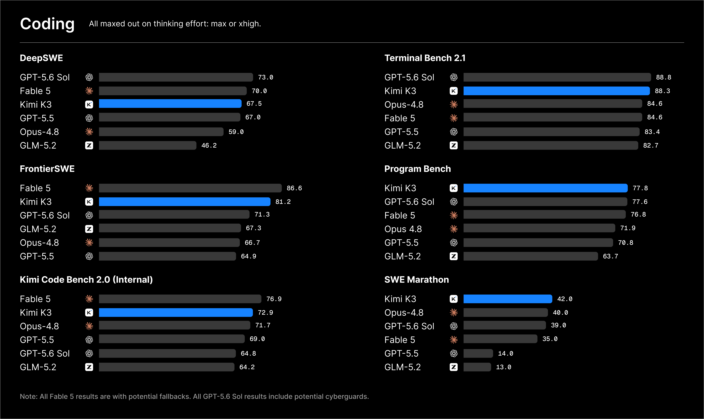
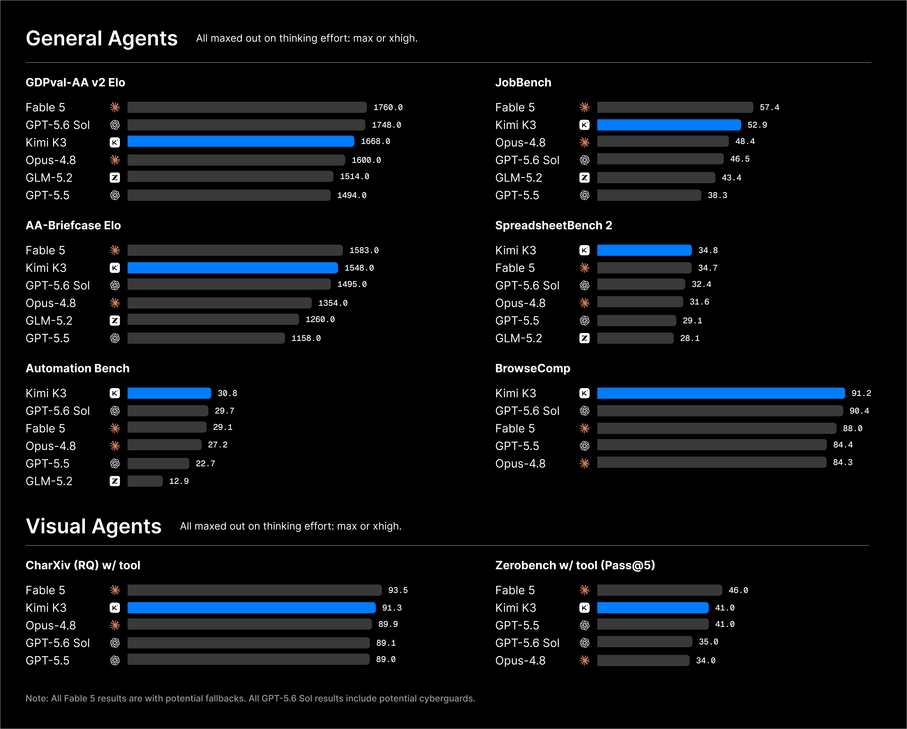

# Kimi K3：以约 2.5× 的整体扩展效率迈向 3T 级开放模型

> **来源基线**：官方 Kimi K3 Tech Blog 发布于 2026-07-16；**完整技术报告与模型权重尚未发布**。官方承诺最迟于 2026-07-27 发布权重，并表示架构、训练与评测细节将在技术报告中披露，但没有给出报告的明确发布日期（博客 `:94-105`、`:210`）。
> - 一手来源：[kimi.com/blog/kimi-k3](https://www.kimi.com/blog/kimi-k3)，本地逐字快照为 `raw/01_theory/01_models/moonshot_kimi/Kimi_K3_blog_2026-07-16.txt`（下称“博客”）；官方内嵌架构图原件为 `assets/kimi_k3_official_arch.svg`。
> - 结构组件的论文与源码证据：见 [[kimi_k3_architecture_deepdive]]。
> - 训练与推理基础设施：见 [[kimi_k3_infra_deepdive]]。
> **维度**：模型发布总览。本页回答“K3 是什么、表现如何、官方如何定位”；机制层面的“为什么”由两篇 deep dive 展开。
> **更新**：2026-07-17，依据官方 Tech Blog 优化中文叙述与公式展示；完整技术报告发布后仍需回填激活参数、层数和训练配方。

---

## 一、主线

**K3 的主线不只是“把模型做大”，而是提高单位算力所能换取的能力。** 官方将 KDA、AttnRes、高稀疏 Stable LatentMoE，以及训练和数据配方的共同收益，概括为相对 Kimi K2 **约 2.5× 的整体 scaling efficiency**（博客 `:104-105`）。

这里的“2.5×”不是某一项 benchmark 的提升，也不是单纯的训练吞吐倍率。官方给出的含义是：同等计算投入能够转化为更多模型能力。公开材料尚未披露该指标的精确定义，因此本文只把它作为官方总体口径，不进一步推导为 loss-matched compute 或成本倍率。

2.8T 总参数可以理解为这套效率改造进一步规模化后的结果。官方也没有回避差距：K3 的整体表现仍落后于 Claude Fable 5 和 GPT 5.6 Sol，但在其评测套件中持续领先其他被测模型（博客 `:76-77`）；Limitations 又进一步承认，实际用户体验与这两款闭源模型之间仍有可感知差距（博客 `:552-559`）。

## 二、关键规格（对比直接前代 K2.5）

| 维度 | Kimi K3 | Kimi K2.5(对照) | 出处 |
|---|---|---|---|
| 总参数 | **2.8T**(首个开源 3T 级) | 1.04T | 博客开篇;[[kimi_k2.5_analysis]] §1.1 |
| 激活参数 | **未披露**(待技术报告) | 32B | 博客(无此数) |
| MoE | **Stable LatentMoE,896 专家选 16**(稀疏度 56) | 384 选 8 + 1 共享(稀疏度 48) | 博客 §Architecture;K2.5 README |
| 注意力 | **KDA : Gated MLA = 3:1 混合** | 纯 MLA(61 层) | 博客架构图 3×/1× 标注 |
| 跨层连接 | **AttnRes**(深度方向 softmax 注意力) | 标准残差 | 博客 §Architecture |
| 上下文 | **1M 原生** | 256K | 博客开篇 |
| 模态 | 原生文本/图像/**视频**同模型 | 原生视觉(MoonViT 400M) | 博客 §Video Editing |
| 量化 | **MXFP4 权重 + MXFP8 激活,SFT 起 QAT** | 原生 INT4(post-training QAT) | 博客 §Architecture |
| 训练稳定性组件 | Per-Head Muon、Quantile Balancing、SiTU | MuonClip | 博客 §Architecture;[[kimi_k2_analysis]] |
| 思考模式 | 默认 max effort;**preserved thinking history 模式训练** | thinking + instant 双模式 | 博客开篇、§Limitations |
| API 定价 | 输入 3.00 USD/MTok；缓存命中输入 0.30 USD/MTok；输出 15.00 USD/MTok | — | 博客 §Availability（`:223-227`） |

**整体结构图**（官方博客内嵌架构图**原图**：SVG 原件 + 官方页面 CSS 按暗色主题渲染，渲染 wrapper 存于 `assets/kimi_k3_official_arch_render.html`，可复现）：

> 官方内嵌 SVG 的 aria-label 直接写着 **"Block Attention Residuals architecture diagram"**——AttnRes 在官方叙事中的地位可见一斑。

## 三、基准结果

K3 的所有结果都使用 `reasoning effort=max`、`temperature=1.0`、`top-p=1.0`。不同 benchmark 分别运行在 KimiCode、Claude Code 或 Codex harness 下，因此分数不仅反映基础模型，也包含 agent harness 的影响（博客 §Footnotes，`:495-539`）。主要对手包括 Claude Fable 5（max，可能 fallback）、GPT 5.6 Sol（max）、Claude Opus 4.8（max）、GPT 5.5（xhigh）和 GLM-5.2（max）。

在博客给出的 33 项完整评测中，K3 的第一名项目包括：SWE Marathon 42.0、Program Bench 77.8、BrowseComp 91.2、DeepSearchQA 95.0（F1）、Automation Bench 30.8、SpreadsheetBench 2 34.8、OmniDocBench 91.1，以及与 Fable 5 并列的 ZeroBench 23.0。

**分域画像**：

- **长程任务是最突出的优势。** SWE Marathon 得分 42.0，明显高于 Fable 5 的 35.0；FrontierSWE 得分 81.2，仅次于 Fable 5 的 86.6，并高于 GPT 5.6 Sol 的 71.3。这与官方“训练特别强调长程高难任务”的说明一致。
- **检索与浏览能力进入第一梯队。** BrowseComp 得分 91.2。脚注还披露：使用 1M 上下文且完全不做 context management 时，K3 仍能得到 90.4；采用 300K token 触发的上下文压缩策略后为 91.2（博客 `:538-539`）。这说明 1M 原生窗口至少让“无需压缩直接浏览”成为可行基线。
- **经典编码仍略逊于最强闭源模型。** DeepSWE 为 67.5，低于 GPT 5.6 Sol 的 73.0 和 Fable 5 的 70.0。
- **知识推理强弱并存。** GPQA-Diamond 达到 93.5，但 HLE-Full 为 43.5，与 Fable 5 的 53.3 仍有明显差距。
- **视觉任务整体较强。** OmniDocBench 以 91.1 排名第一；MathVision 在不使用和使用 Python 时分别为 94.3、97.8，接近第一梯队。

**读表时需要保留四项口径限制。** Fable 5 的结果来自第三方评测，且可能包含 fallback；在 PostTrain Bench 中，如果 Fable 5 拒答，评测会回退到 Opus 4.8；GLM-5.2 以及部分 Claude/GPT 分数引用自各家官方页面或 Artificial Analysis，并非 Moonshot 自测；DeepSWE 官方榜单使用 mini-SWE-agent harness 时，K3 得分为 67.3，而不是上图中的 67.5（博客 §Footnotes）。

## 四、能力案例（官方自报，尚未经第三方复现）

1. **Kernel 优化。** 官方设置了四项任务，覆盖 AttnRes、KDA 和 512 head-dimension MLA kernel，并分别在 H200 与“另一厂商 GPGPU”上运行；每个模型获得独立沙箱和 24 小时时间。K3 与 Fable 5 表现接近，并明显优于 Opus 4.8 和 GPT 5.6 Sol。博客还称，K3 开发后期的大部分 kernel 优化由早期版 K3 自己完成。任务本身也从侧面揭示了 K3 kernel 栈的关键组成（博客 §Kernel Optimization，`:164-169`）。
2. **GPU 编译器。** K3 从零构建 MiniTriton：以 MLIR 为基础设计 tile-level IR，并实现 PTX code generation。官方报告其 roofline 微基准可达到或超过 Triton、`torch.compile`，且能够端到端训练 nanoGPT 并正常收敛（§GPU Compiler Development）。
3. **芯片设计。** 在 48 小时自主运行中，K3 使用开源 EDA 与 Nangate 45 nm 工艺库，为运行自家架构的 nano 模型设计芯片。官方给出的结果包括 4 mm² 面积、100 MHz 时序收敛、146 万个标准单元、0.277 MB SRAM，以及带融合反量化的 INT4 MAC；仿真解码吞吐为 8,700 token/s（§Chip Design）。
4. **科研复现。** 在天体物理 I–Love–Q 关系任务中，K3 交叉核验 20 多篇论文和 300 多个物态方程，产出 3,000 多行代码。官方称约两小时完成了资深研究员通常需要一至两周的工作（§Coding for Research）。
5. **知识工作与视频编辑。** K3 生成了一份覆盖 42 年 ASIC 行业史的交互式报告，经历 120 多轮递归改进和 2,800 多次检索；另一个案例把 56 份素材自动剪成 teaser，官方估计相当于熟练剪辑师一至两个工作日的工作量（§Knowledge Work、§Video Editing）。

## 五、使用限制（官方 Limitations）

1. **对 thinking history 敏感。** K3 使用 preserved thinking history 模式训练。如果 harness 没有完整回传历史思考内容，或者会话中途从其他模型切换到 K3，生成质量可能变得高度不稳定。官方建议使用经过验证的 harness（如 Kimi Code），并避免中途切换模型。
2. **可能过度主动。** 面对小问题或含糊意图时，K3 可能替用户做出超出预期的决定。部署方需要在 system prompt 或 `AGENTS.md` 中明确权限与行为边界。
3. **用户体验仍有差距。** 官方承认，K3 与 Fable 5、GPT 5.6 Sol 之间仍存在可感知的 UX 差距（博客 `:552-559`）。

## 六、发布与获取

- 渠道：kimi.com、Kimi Work（3.1.0 及以上）、Kimi Code（通过 `/model` 选择 `kimi-k3`）和 Kimi API（模型名 `kimi-k3`）。
- 价格：缓存命中输入为 0.30 USD/MTok，未命中输入为 3.00 USD/MTok，输出为 15.00 USD/MTok。官方 API 由 Mooncake 的分离式推理架构支撑，coding 负载的缓存命中率超过 90%（博客 `:223-227`）。若按恰好 90% 命中估算，平均输入成本上界约为 `0.9 × 0.30 + 0.1 × 3.00 = 0.57 USD/MTok`；机制见 [[kimi_k3_infra_deepdive]] §3。
- 时间线：模型权重最迟于 2026-07-27 发布；完整技术报告尚无明确日期。低、高 thinking effort 档位将在后续更新中提供。

## 七、待技术报告回填的缺口

激活参数量、总层数、隐藏维度、视觉塔细节、预训练 token 数、Per-Head Muon/Quantile Balancing/SiTU/Stable LatentMoE 的精确定义与消融、RL 配方。**本页与两个 deepdive 页中所有标注 [推断] 的内容都应在报告发布后核对。**

## Related Pages

- [[kimi_k3_architecture_deepdive]] — 按“动机 → 机制 → 证据 → 替代方案”分析 KDA、Gated MLA、AttnRes、Stable LatentMoE、SiTU 与规模变化
- [[kimi_k3_infra_deepdive]] — Per-Head Muon、MXFP4/MXFP8 QAT、全平衡 EP、Mooncake、KDA prefix cache 进 vLLM、64+ 卡超节点
- [[kimi_linear_analysis]] — KDA 与 3:1 混合架构的原始论文(K3 注意力主干的前身)
- [[kimi_k2.5_analysis]] — 直接前代(1.04T MoE + MoonViT 原生视觉)
- [[kimi_k2_analysis]] — 2.5× scaling 效率宣称的对照基线(MuonClip、15.5T tokens)
- [[moba_analysis]] — Moonshot 更早的长上下文注意力路线(MoBA,已被 KDA 路线接替)
- [[moonshot_kimi/index]] — Kimi/Moonshot 技术路线总览
