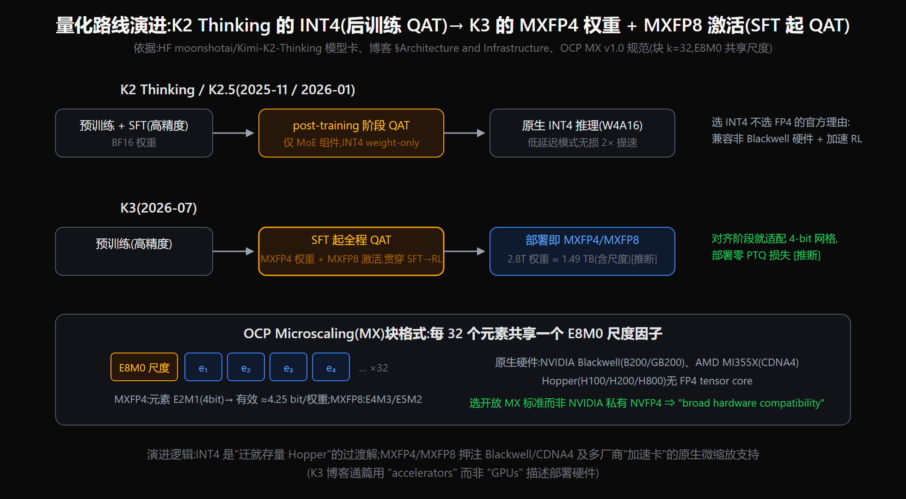
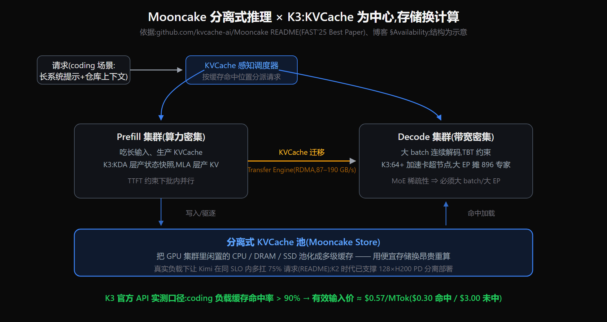
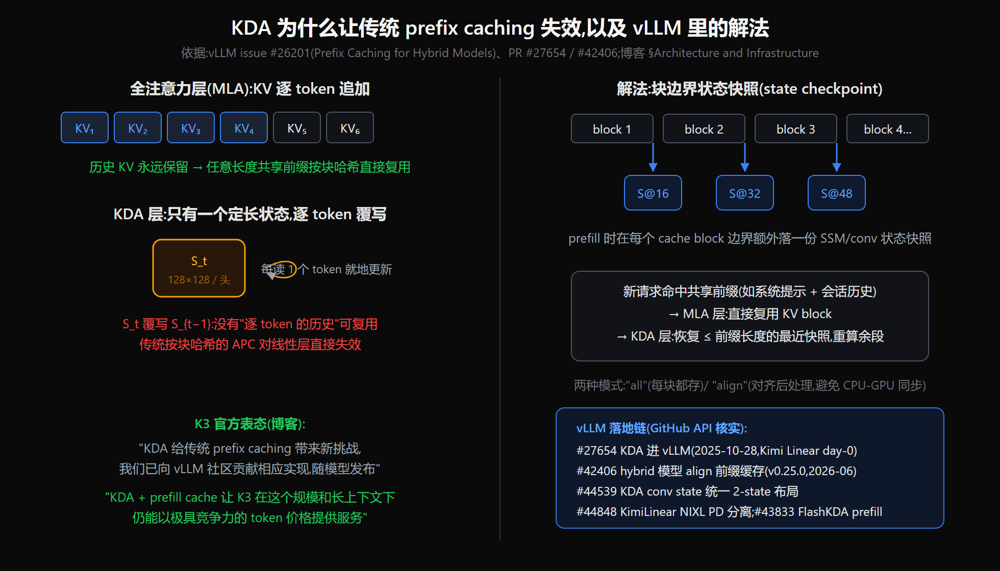

# Kimi K3 训推基础设施深析：结构、训练与推理如何共同支撑 2.8T + 1M 上下文

> **来源基线**：
> - K3 官方 Tech Blog 快照 `raw/01_theory/01_models/moonshot_kimi/Kimi_K3_blog_2026-07-16.txt`（下称“博客”）。基础设施相关原文集中在 §Architecture and Infrastructure 与 §Availability，即本地快照 `:207-227`。
> - K2 训练基础设施基线：arXiv 2507.20534（本库 `raw/.../Kimi_K2-2507.20534.pdf`，见 [[kimi_k2_analysis]]）；K2 Thinking INT4：Hugging Face 上的 `moonshotai/Kimi-K2-Thinking` 模型卡。
> - Mooncake：`kvcache-ai/Mooncake` README（FAST'25 Best Paper，见 [[mooncake_analysis]]）；vLLM：issue #26201 与 PR #27654、#42406、#44539、#44848、#43833（通过 GitHub API 核实合入状态）；FlashKDA：`MoonshotAI/FlashKDA@d2ff19a` 与 MarkTechPost 2026-04-30 报道。
> - OCP MX 格式：OCP Microscaling Formats v1.0 规范（经解读页逐条核对）。
> **标记**：`[官方]` 表示第一手材料，`[三方]` 表示第三方来源，`[推断]` 表示基于已核实事实的推理。K3 完整技术报告尚未发布，所有推断均需后续回填核对。
> **更新**：2026-07-17，依据官方 Tech Blog 优化中文叙述与公式排版。

---

## 一、主线

K3 的核心基础设施逻辑是：**每一项结构选择都会产生一项新的系统约束。** KDA 使 1M 上下文具备服务可行性，却迫使 prefix cache 从“缓存逐 token KV”升级为“缓存线性状态快照”；高稀疏 MoE 提高了参数效率，却需要静态 shape 的全平衡专家并行和更大的高速互联域；MXFP4 权重降低了 2.8T 模型的驻留成本，却要求从 SFT 阶段开始进行 QAT。官方博客在同一段中依次给出了这些“结构选择 → 系统配套”的关系（博客 `:207-210`）。

## 二、训练侧

### 2.1 Per-Head Muon：从按头修补升级为按头优化

- **K2 基线。** MuonClip 将 Muon 与 QK-Clip 结合：每次参数更新后，按注意力头检查最大 logit；若第 `h` 个头超过阈值 `τ`，就用系数 `γ_h` 同时缩放该头的 Q/K 投影（[[kimi_k2_analysis]]；arXiv 2507.20534）：

$$
\gamma_h = \min\!\left(1, \frac{\tau}{S_{\max}^{(h)}}\right).
$$

K2 报告称，这套机制在 15.5T tokens 训练中实现了零 loss spike。此时 per-head 粒度主要用于**事后稳定性修补**。

- **K3 的官方变化。** 博客称 Per-Head Muon “通过独立优化每个注意力头，使大规模训练更具适应性”（博客 `:207-209`）。这意味着 per-head 粒度从 clip 阶段前移到了优化器更新本身。
- **机制边界。** Muon 的 Newton–Schulz 正交化以矩阵为单位，因此一种自然实现是把 Q/K 投影按头切分后分别更新，而不是把整个投影矩阵视为一个整体。这样可以适应不同头的谱结构和更新尺度，但 K3 报告尚未披露切分维度、学习率共享方式及其与 QK-Clip 的关系；这些都仍是 **[推断]**。

### 2.2 高稀疏 MoE 的训练配套：Quantile Balancing + 全平衡 EP

官方明确给出的目标是：避免大规模专家并行中的负载不均拖低吞吐。为此，K3 引入了“静态 shape、关键路径无 host synchronization”的全平衡专家并行训练方法（博客 `:208-209`）。

- **算法侧：Quantile Balancing。** 博客称它直接依据 router score 的分位数确定专家分配，从而去掉启发式更新和敏感的均衡超参数。当前公开材料没有公式，详见 [[kimi_k3_architecture_deepdive]] §5。
- **系统侧：全平衡 EP。** “静态 shape”意味着 kernel 不需要在每一步应对变化的专家 batch；“关键路径无 host synchronization”意味着容量统计或溢出判断不能通过 device→host 回读阻断 all-to-all 流水。把这两点合起来，可以把 MoE 训练变成更适合静态编译和流水执行的确定性负载。
- **两者是否严格耦合仍待确认。** 分位数分配可能天然导出固定专家配额，从而与静态 shape 相互配合；但博客没有说明是否做到“每个专家恰好接收固定数量 token”，也没有说明这是否就是 “Stable” 的来源，因此这里只标为 **[推断]**。

### 2.3 量化：从 INT4 weight-only 转向 MXFP4 权重 + MXFP8 激活

- **K2 Thinking 的做法。** HF 模型卡披露的是 INT4 weight-only，只量化 MoE 组件，并在 post-training 阶段进行 QAT；官方宣称低延迟模式可获得“无损 2× 加速”。工程师 AMA 的第三方转述称，选择 INT4 而不是 FP4 是为了兼容非 Blackwell 硬件，并改善 thinking 模型长解码的低利用率。
- **K3 的升级。** 博客明确写道：K3 从 SFT 阶段开始进行 QAT，采用 MXFP4 权重和 MXFP8 激活，以获得更广泛的硬件兼容性（博客 `:208-209`）。相较 K2，这包含三项变化：QAT 时间点提前到整个后训练链路；格式切换到 OCP MX 开放标准；激活也进入低精度。至于 RL 是否全程保持相同伪量化配置、训练本身是否使用 MX GEMM，官方尚未披露。

仅按 4 bit 权重计算，2.8T 参数的理论下限为：

$$
\frac{2.8 \times 10^{12} \times 4\ \mathrm{bit}}{8}
= 1.4 \times 10^{12}\ \mathrm{bytes}
\approx 1.4\ \mathrm{TB}.
$$

再计入每 32 个元素共享的尺度等元数据，本文估算约为 **1.49 TB**。这是容量账，不是官方公布的模型文件大小；它解释了 §3.4 为何建议 64 卡以上超节点部署。

### 2.4 对照：K2 是“约 2.5× 效率”口径的基线

K2 报告（arXiv 2507.20534）披露的训练系统是：H800 集群，每节点 8 卡和 2 TB RAM，节点间使用 8 × 400 Gbps RoCE；并行策略为 16-way PP（含虚拟 stage）+ 16-way EP + ZeRO-1 DP，不使用 TP。显存优化包括选择性重计算、FP8-E4M3 激活压缩和与计算重叠的 CPU offload；官方报告称 15.5T tokens 训练期间没有 loss spike。

K3 的“约 2.5×”指 overall scaling efficiency，即计算投入到模型能力的总体转化效率，不是上述训练系统吞吐的直接倍率。组件论文可核验的数字只有 KDA 约 1.16× 与 AttnRes 约 1.25×，简单相乘约为 `1.45×`。其余收益归因于 LatentMoE 或数据配方只是 **[推断]**。K3 的训练集群规模、卡型和成本均未披露；TechCrunch 发布稿也没有可靠成本数字。

## 三、推理侧

### 3.1 Mooncake：K3 官方 API 的分离式推理底座

- **定位。** Mooncake 官方将其定义为“以 KVCache 为中心的分离式 LLM Serving 架构”，并明确说明 Mooncake 是 Kimi 的 serving platform。相关论文获得 FAST'25 Best Paper，机制详见 [[mooncake_analysis]]。
- **机制。** Prefill 与 Decode 使用不同集群；闲置 CPU、DRAM 和 SSD 被池化为分离式 KVCache；Transfer Engine 负责跨层级、跨节点迁移缓存。Mooncake README 报告，真实负载下在相同 SLO 约束内可多承载 75% 请求，并曾支持 128 × H200 的 Prefill/Decode 分离部署。
- **K3 的落点。** 官方博客称，Mooncake 支撑的 Kimi API 在 coding 负载下缓存命中率超过 90%（博客 `:223-227`）。按恰好 90% 命中估算：

$$
\begin{aligned}
C_{\text{input}}
&= 0.9 \times 0.30 + 0.1 \times 3.00 \\
&= 0.57\ \mathrm{USD/MTok}.
\end{aligned}
$$

这是根据官方价格计算出的上界估算，不是官方直接公布的平均账单。OpenRouter 观测到的 77.7% 是不同流量构成下的第三方数字，与“官方 API + coding 负载”的限定口径不能直接比较。

### 3.2 KDA prefix caching：线性注意力带来的新缓存形态

- **为什么传统前缀缓存失效。** 全注意力的 KV 按 token 追加，因此可以对缓存块做哈希并直接复用共享前缀。KDA 只维护一个固定大小、随 token 持续覆写的递归状态，并不保留完整的逐 token 历史；传统 Automatic Prefix Caching（APC）因而不能原样套用。这一机制解释来自 vLLM issue #26201，映射到 K3 的判断为 **[推断]**。
- **如何恢复可复用性。** vLLM 的设计是在 prefill 过程中，于 cache block 边界保存 KDA 状态快照。新请求命中共享前缀后，系统先恢复“不超过前缀长度的最近快照”，再重算快照之后的短尾段。`all` 模式保存所有候选快照；`align` 模式只保留对齐位置，并用 GPU kernel 完成后处理，以免引入 CPU–GPU 同步。
- **社区落地链。** GitHub API 显示：PR #27654 于 2025-10-28 将 KDA 纳入 vLLM，支持 Kimi Linear day-0；#42406 为 hybrid 模型加入 `align` 前缀缓存并进入 v0.25.0；随后 #44539 统一 KDA convolution state 的双状态布局，#44848 打通 Kimi Linear 经 NIXL 的 Prefill/Decode 分离。FlashKDA prefill backend 对应 #43833，截至 2026-07-17 尚未合入。
- **K3 官方结论。** 博客指出，KDA 给传统 prefix caching 带来了新问题，Moonshot 已向 vLLM 社区贡献相应实现，并计划随模型发布；具备 prefill cache 后，K3 才能在 2.8T 规模和 1M 上下文下维持有竞争力的 token 价格（博客 `:208-210`）。博客没有点名具体 PR，因此与上述 PR 链的对应关系仍是 **[推断]**。
- **与 Mooncake 如何组合。** 在 hybrid 模型中，MLA 层复用的是 KV block，KDA 层复用的是状态快照；Mooncake 一类缓存系统需要统一调度这两种生命周期不同的工件。这解释了 K3 为何把 KDA prefix cache 视为服务成本的关键环节，但具体存储布局尚未公开，属于 **[推断]**。

### 3.3 FlashKDA：面向 prefill 的第二代 kernel

- **定位。** FlashKDA README 将它定义为基于 CUTLASS 手写的推理专用 forward kernel，要求 SM90+、CUDA 12.9+，并固定 `K=V=128`。安装后，FLA 0.5.0 及以上版本可在 `chunk_kda` 中自动分派到该后端（`fla/ops/kda/backends/flash_kda.py:35,115,139`）；训练反向仍由 FLA 的 Triton 实现承担。
- **为什么选择 `CHUNK=16`。** 仓库设计文档给出的组合条件是 gate 下界为 −5。该 chunk 大小使 `exp(cumsum(g))` 可落在 bf16 可表示范围内，不必再做第二级 rescale；同时，16 × 16 的逆矩阵可以直接展开为 Neumann 级数。
- **为什么拆成两个 kernel。** K1 沿 token 维并行，负责门激活、L2 归一化、矩阵构造和求逆；K2 沿 head 维并行，负责递推。官方文档报告，这一拆分相较单 kernel 方案带来至少 15% 的端到端提升。实现还组合了 bf16 片上状态与 fp32 FMA、fp16 的 16 × 16 求逆、近似 `tanh`/`ex2`，并用寄存器内转置减少 shared memory 往返。
- **服务侧适配。** `cu_seqlens` 将不等长序列打包为 varlen batch，使该 kernel 可以直接进入 continuous batching 的 prefill 路径，而不必把所有请求 padding 到同一长度。
- **性能口径。** 仓库 BENCHMARK 在 `T=8192、D=128` 下，相比 FLA Triton `chunk_kda` 报告 H20 上 **1.85×–2.31×**、GB200 上 **1.70×–3.27×**。H20 结果说明实现者至少把境内常见算力纳入了优化和验证范围；更强的产品路线判断则属于 **[推断]**。

### 3.4 部署门槛：64+ 加速卡超节点

官方博客没有指定机型，但明确建议在 **64 个或更多加速器组成的超节点**上部署 K3，因为更大的高带宽通信域也能提高推理效率（博客 `:208-210`）。这里使用的是 “accelerators” 而非 “GPUs”，不应把建议绑定到单一厂商。

这一门槛可以从三个系统约束理解，但以下因果拆解均为 **[推断]**：

1. **权重驻留。** MXFP4 下的权重容量估算约为 1.49 TB，已超过 8 × H200 单节点约 1.13 TB 的总显存；扩展到 64 卡后，才更容易同时为运行时缓冲区、缓存与 1M 上下文留出空间。
2. **专家并行通信。** 896 个专家、每 token 激活 16 个专家，会在每层引入两次 all-to-all。若以 64 卡承载专家，平均约为每卡 14 个专家；通信最好留在 NVLink 或 Unified Bus 一类 scale-up 域内，而不是频繁跨越节点间 RoCE。
3. **稀疏模型的摊销效率。** 更大的 batch 和 EP 域可以摊薄专家权重读取成本。作为旁证，LMSYS 对 K2 128 × H200 部署的第三方分析给出了约 224k token/s 的 prefill、288k token/s 的 decode，以及约 0.21 USD/MTok 的输出成本；这些数字不能直接外推为 K3 的实测性能。

现实中的超节点形态包括 NVIDIA GB200 NVL72（72 张 GPU 处于统一 NVLink 域，原生支持 FP4）和华为 CloudMatrix384（384 张 NPU 通过 Unified Bus 互联，并面向大规模 MoE 专家并行和分布式 KV cache 访问优化，见 arXiv 2506.12708）。K3 选择开放的 MXFP4 标准，并采用厂商中性的 “accelerators” 表述，说明它在接口层面没有排除这两类平台；但具体完成了哪些平台适配，仍需等待权重、部署文档和完整技术报告确认。

## 四、事实边界与待报告确认清单

| 项 | 现状 | 待确认 |
|---|---|---|
| Per-Head Muon 精确定义 | 博客一句 [官方] | 按头切分粒度、与 QK-Clip 的关系、消融 |
| Quantile Balancing 公式 | 博客一句 [官方] | 分位数如何定义/更新、与 aux-loss-free 的对比数据 |
| 全平衡 EP 训练 | 博客一句 [官方] | token drop 与否、静态配额的精度代价 |
| MXFP4/MXFP8 QAT 细节 | 博客一句 [官方] | 伪量化算子位置、RL 阶段是否同精度、训练硬件 |
| K3 训练集群/成本 | 无任何可靠数字(TechCrunch 亦无)| 卡型、规模、token 数 |
| vLLM 贡献的具体 PR | "随模型发布" [官方] | 权重发布时的配套 PR/分支 |
| 2.5× scaling 效率的度量 | "overall scaling efficiency" [官方] | 是 loss-matched compute 比还是别的口径 |

## Related Pages

- [[kimi_k3_analysis]] — K3 发布总结
- [[kimi_k3_architecture_deepdive]] — 结构变化点(本页多数 infra 选择的结构侧上半场)
- [[mooncake_analysis]] — Mooncake 论文级分析(FAST'25)
- [[kimi_k2_analysis]] — K2 的 MuonClip 与训练系统基线
- [[kimi_k2.5_analysis]] — K2.5(INT4 沿用、Agent Swarm)
- [[kimi_linear_analysis]] — KDA 的效率证据与 vLLM day-0 集成
- [[muon_analysis]] — Muon 优化器原理(Per-Head Muon 的基座)
- [[moonshot_kimi/index]] — Kimi/Moonshot 技术路线总览
