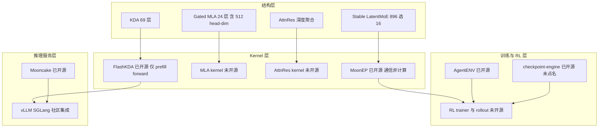

# Kimi K3 开源栈全景：哪些是生产组件、哪些是模型自己的作品、哪些根本不是新开的

> **来源基线**：GitHub REST API 于 2026-07-28 取数（`api.github.com/orgs/MoonshotAI/repos`，逐仓核对 `created_at` / `pushed_at` / `license`）；各仓 README 为其默认分支当日快照。逐仓固定 commit 见下表。
> **维度**：Overview（栈级地图）。本页回答"K3 发布同时到底开了什么、每个仓在 K3 栈里站哪个位置、能支撑到什么证据强度"。单仓机制级分析另开页：[[moonep_analysis]]。
> **标记**：`[官方]` 第一手仓库/报告；`[三方]` 媒体或社交转述；`[推断]` 基于已核实事实的推理。
> **更新**：2026-07-28 建页。

---

## 一、主线与一处必须先做的更正

K3 发布的官方口径是"开放的不止权重，还有背后的一部分栈：高性能注意力 kernel、MoE 通信库、以及大规模运行 agent 环境的基础设施"。这句话本身没错，但**按它去 GitHub 找会对不上号**，因为三件东西的开源时间差了三个月。

> [!contradiction] 更正一条流传口径
> 社交与媒体转述普遍写成"K3 随发布**新开源**了高性能注意力 kernel"`[三方]`。但 GitHub API 显示：**FlashKDA 创建于 2026-04-20，最新 commit 是 `d2ff19a`（2026-05-26，"Support more architectures"，含 GB200 benchmark）**——它在 K3 发布前三个月就已开源，且**没有为 K3 更新过**`[官方]`。真正落在 K3 发布窗口（07-23 ~ 07-28）里的新仓是 MoonEP、AgentENV、minitriton、nano-kpu、PerceptionBench。
> 这一点对读者是有实际后果的：想找"K3 那 24 个 Gated MLA 层的 512 head-dim kernel"或"AttnRes kernel"的人，在 FlashKDA 里是找不到的——它只覆盖 KDA 的 prefill forward。

**本页的主线判断：这批仓库必须分三类读，因为它们的证据等级完全不同。**

| 类别 | 含义 | 能支撑什么结论 | 仓库 |
|---|---|---|---|
| **A. 生产栈组件** | Moonshot 训练/服务 K3 时真实使用的基础设施 | 可作为报告项目级描述的**实现证据** | MoonEP、AgentENV、FlashKDA、checkpoint-engine、Mooncake、Attention-Residuals |
| **B. K3 的作品** | 由 K3 模型自己设计实现，官方明确声明**不是产品** | 只能作为**模型能力证据**，不能当基础设施引用 | minitriton、nano-kpu |
| **C. 评测与配套** | 评测集、供应商校验、agent 前端 | 口径与复现工具 | PerceptionBench、Kimi-Vendor-Verifier、kimi-code |

把 B 类当成"K3 的 infra"是最容易犯的错。minitriton 的 README 自己写着这是 capability demonstration、不是 Moonshot 产品或生产系统；nano-kpu 同样声明是 K3 demonstration、非官方项目`[官方]`。它们是 [[kimi_k3_analysis]] §四"能力案例"第 2、3 条的**可执行版本**，属于 benchmark 证物，不属于训练栈。

---

## 二、全表：时间线是关键信息

| 仓库 | 描述 | 语言 | 创建 | 最后推送 | License | 类别 |
|---|---|---|---|---|---|---|
| [MoonshotAI/Kimi-K3](https://github.com/MoonshotAI/Kimi-K3) | Open Frontier Intelligence（含 47 页技术报告 PDF） | — | 2026-07-27 | 2026-07-28 | Kimi K3 License | — |
| [MoonshotAI/MoonEP](https://github.com/MoonshotAI/MoonEP) | Perfectly Balanced Expert Parallelism Library via Dynamic Redundant Experts | Python | **2026-07-24** | 2026-07-28 | MIT | **A** |
| [kvcache-ai/AgentENV](https://github.com/kvcache-ai/AgentENV) | 大规模运行 agent 环境的分布式平台 | Rust | **2026-07-23** | 2026-07-28 | MIT | **A** |
| [MoonshotAI/minitriton](https://github.com/MoonshotAI/minitriton) | Python DSL → MLIR → PTX 的 tile 编译器 | Python | **2026-07-23** | 2026-07-27 | Apache-2.0 | **B** |
| [MoonshotAI/nano-kpu](https://github.com/MoonshotAI/nano-kpu) | 混合注意力 MoE transformer 推理芯片 RTL | Verilog | **2026-07-23** | 2026-07-23 | Apache-2.0 | **B** |
| [MoonshotAI/PerceptionBench](https://github.com/MoonshotAI/PerceptionBench) | 多模态原子视觉感知评测 | Python | 2026-07-23 | 2026-07-27 | Apache-2.0 | C |
| [MoonshotAI/FlashKDA](https://github.com/MoonshotAI/FlashKDA) | high-performance Kimi Delta Attention kernels | CUDA | **2026-04-20** | **2026-05-26** | — | A（**非本次新开**） |
| [MoonshotAI/Attention-Residuals](https://github.com/MoonshotAI/Attention-Residuals) | AttnRes 论文仓（**只有 README + PDF，无 `.py` 实现**） | — | 2026-03-15 | 2026-03-17 | — | A（同上） |
| [MoonshotAI/checkpoint-engine](https://github.com/MoonshotAI/checkpoint-engine) | 推理引擎权重更新中间件 | Python | 2025-09-08 | 2026-07-04 | — | A（同上） |
| [kvcache-ai/Mooncake](https://github.com/kvcache-ai/Mooncake) | KVCache 中心的分离式 serving（FAST'25 Best Paper） | — | — | — | — | A（同上） |
| [MoonshotAI/kimi-code](https://github.com/MoonshotAI/kimi-code) | Kimi Code agent CLI | TypeScript | 2026-05-22 | 2026-07-28 | MIT | C |

**读时间线能读出的一件事**：MoonEP、AgentENV、minitriton、nano-kpu、PerceptionBench 全部创建于 **07-23 ~ 07-24**，比 Kimi-K3 主仓（07-27）早三四天——这是典型的"发布前把配套仓准备好、发布日一起放开"的节奏`[推断]`。

---

## 三、A 类：生产栈组件

### 3.1 MoonEP —— 唯一一个把报告的 infra 说法兑现到源码的仓

一句话：**它把 MoE 负载均衡从"训练期的软约束"改成"执行期的硬保证"——无论路由多偏，每个 rank 恰好收 `S×K` 个 token。** 做法是在线把热门 home group 的溢出 token 迁移到空闲 rank，并把对应专家权重预取过去（dynamic redundant experts）。

这是本次开源里**信息量最大**的一个仓：K3 报告 §5.2.1 的七条项目级说法，在 `0f385f03` 这个 commit 里逐条找得到实现，包括那个只有读算法才知道为什么成立的结论——贪心"一次填满最空的接收方"意味着每个 rank 至多从**一个**远端 home group 接收，因此训练时 `B = E/R` 的冗余槽就够。

完整的算法五步、CuTe DSL 工程形态、梯度回收闭环、基准口径与代价清单，见 **[[moonep_analysis]]**。

### 3.2 AgentENV —— D12 §9 那些自报数字背后的实现

`kvcache-ai/AgentENV`，Rust，1,169 stars，创建 2026-07-23、推送 2026-07-28，MIT`[官方]`。注意 owner 是 **kvcache-ai** 而不是 MoonshotAI——与 Mooncake 同一个组织。

K3 报告 §5.3.2 把它描述为支撑 agentic RL 的 microVM 沙箱层，并给出 Pause/Resume、Fork、Snapshot 三个语义，以及 133 ms / 49 ms 的最低 checkpoint/resume 延迟、最高 6.5× 内存超分、整个训练与评测创建了 51,219,741 个 sandbox / 1,505,678 个 image。仓库 README 给出的是同一套机制的另一组口径`[官方]`：

- **Firecracker microVM** 为虚拟化基座；快照支撑的环境**启动或恢复 < 50 ms、暂停 < 100 ms**；
- **增量内存与文件系统快照 < 100 ms**，即使磁盘被大量修改；
- **overlaybd** 做按需镜像加载，因此镜像总量可以超过磁盘容量而仍保持全集群快速启动；
- **memory ballooning** 把可回收的 guest 内存还给 host，环境跑得越久越能维持高超分比；
- 快照持久化到 S3 兼容存储或共享分布式文件系统；运行中的环境可 **fork 成多个独立 sandbox**（这正是报告里"reward judging 无副作用"的实现基础）；
- 对外暴露 **E2B 兼容的 HTTP API**，因此现有 E2B Python/TS SDK 不改代码即可用；
- 要求 Linux kernel 6.8+ 与 `/dev/kvm`。

> [!important] 两组数字口径不同，不要混用
> 报告给的是"最低 133 ms / 49 ms"，README 给的是"< 100 ms / < 50 ms"，且 README 明确把 <50 ms 限定为 **snapshot-backed** 的启动或恢复。二者不矛盾但统计口径不同（报告是训练期实测最小值，README 是产品指标），**都没有给出分位数、硬件与 sandbox 内存规格**，因此仍不能用于外部容量规划——这条限制在 [[03_posttraining/12_kimi_k3_posttraining_case_study_analysis|D12]] §9 已经写明，本页只是补上了源码侧口径。
>
> 另外：**overlaybd 与 memory ballooning 是报告里没有提到的两个机制**，属于仓库独有信息。前者解释了"1,505,678 个 image"为何在工程上可行——按需加载而非全量落盘；后者是 6.5× 超分的实现基础。

### 3.3 FlashKDA —— 覆盖面比名字听起来窄

`d2ff19a`（2026-05-26），CUDA，776 stars。定位是**基于 CUTLASS 手写的推理专用 forward kernel**，要求 SM90+、CUDA 12.9+，固定 `K=V=128`；安装后 FLA ≥0.5.0 可在 `chunk_kda` 中自动分派到该后端，**训练反向仍由 FLA 的 Triton 实现承担**。机制细节（`CHUNK=16` 与 bf16 数值域的关系、K1/K2 双 kernel 拆分带来的 ≥15% 端到端提升、varlen `cu_seqlens` 适配 continuous batching）已在 [[kimi_k3_infra_deepdive]] §3.3 展开，此处不重复。

**本页要补的是覆盖面边界**：FlashKDA 只解决 K3 那 69 个 KDA 层的 prefill forward。K3 结构里另外两块 kernel——24 个 Gated MLA 层（含 512 head-dimension MLA）与 AttnRes 的深度方向聚合——**在任何已开源仓库里都没有对应实现**。有意思的是，这两块恰恰是 K3 博客 §Kernel Optimization 用来考模型的四项任务的内容（AttnRes、KDA、512 head-dim MLA），也就是说：**官方拿来当 benchmark 的 kernel，正是它没有开源的那几个。** 这个对应关系是 [推断]，但两处清单确实吻合。

### 3.4 Attention-Residuals / checkpoint-engine / Mooncake

- **Attention-Residuals**（3,412 stars）：论文仓，**只有 README 和 PDF，没有 `.py` 实现**；唯一可执行描述是 `README.md:52-91` 的伪代码。想复现 AttnRes 必须自己写。见 [[kimi_k3_architecture_deepdive]] §4。
- **checkpoint-engine**（984 stars，最后推送 2026-07-04）：推理引擎权重更新中间件，对应 RL 闭环里的 weight-sync 环节。K3 报告没有点名它，把它绑到 K3 的 RL trainer 属于 [推断]。
- **Mooncake**：K3 官方 API 的分离式推理底座，机制见 [[mooncake_analysis]]，K3 落点见 [[kimi_k3_infra_deepdive]] §3.1。

---

## 四、B 类：K3 自己写的两个仓——怎么读才不越界

这两个仓的正确读法是：**它们不是 K3 的基础设施，而是 K3 能力的可执行证据。** 官方在两处都写了免责声明。

### 4.1 minitriton —— "教学级 GPU 编译器"

Python DSL → AST → tile builder → MLIR passes → PTX → CUDA binary，配一个支持 tile 级与 kernel 编译的 eager 张量库；纯 DSL 写的算子库覆盖 matmul、attention、normalization`[官方]`。README 自述：

> 整个栈——DSL 前端、MLIR 编译器、CUDA kernel、autograd/nn、benchmark、图表与文档——由 Moonshot AI 的 K3 模型设计、实现、测量并撰写。

技术上值得记的两点：**IR 是 MLIR 之上的 tile 级 IR，采用手工调度的 tile→MLIR lowering，而不是一个做优化的中间层**；builder 与 passes 里有 23 处内联 PTX 热点。基准用 roofline 方法对比 PyTorch eager、`torch.compile` 与 Triton，50M 参数 GPT 的训练收敛曲线与 PyTorch fp32 路径重合。README 还特意说明**低于对手的点也照样公布**——这个自我披露姿态本身就是可信度信号。Apache-2.0。

这为博客 §GPU Compiler Development 那条"K3 从零构建 MiniTriton、roofline 微基准可达到或超过 Triton/`torch.compile`、能端到端训练 nanoGPT 并收敛"的说法提供了**可下载、可复跑的证物**——从"官方自报"升级为"可复现声明"，但注意本库**尚未实际复跑**。

### 4.2 nano-kpu —— 跑 K3 自家架构的推理芯片 RTL

Verilog，Apache-2.0，由 Kimi-K3 设计。实现的是一个 **hybrid-attention MoE transformer** 推理处理器：KDA 线性注意力 + NoPE MLA + sigmoid 路由 MoE（top-2 + shared expert）+ INT4 group-128 量化权重，面向逐 token 解码（teacher forcing）。仓库分 `rtl/`（含 Python 定点仿真辅助）、`harness/`（Verilator 验证与性能评估）、`reference/`（浮点 golden model）、`docs/`。工具链是 Verilator 5.x + yosys + Nangate45 标准单元库`[官方]`。

> [!warning] 一处关键口径
> README 明确说明：**面积与时序数字来自综合估算，而非完整 place-and-route**，自称是"保守、可复现的基线"。因此 [[kimi_k3_analysis]] §四第 3 条转述的博客数字（4 mm²、100 MHz、146 万标准单元、0.277 MB SRAM、8,700 token/s 仿真解码）应当按**综合级估算**理解，不是流片级结论。

顺带一提：nano-kpu 实现的架构（KDA + NoPE MLA + sigmoid MoE + INT4）本身就是 K3 结构的一个**缩微自证**——它从侧面确认了 NoPE 与 sigmoid 路由这两项结构选择，与报告 §2.1.2、§2.3.3 一致。

---

## 五、拼起来看：K3 栈的公开度地图

**这张图的信息在"未开源"那几个框上**：K3 公开了**通信**（MoonEP）、**环境**（AgentENV）、**服务**（Mooncake）和**一个注意力 kernel 的 prefill 路径**（FlashKDA），但没有公开 **backbone 实现、trainer、rollout、weight-sync 接线，以及 MLA/AttnRes 两类 kernel**。所以 [[kimi_k3_infra_deepdive]] §5 与 [[03_posttraining/12_kimi_k3_posttraining_case_study_analysis|D12]] §10.2 的"仍待源码确认"清单，在本次开源后**只被划掉了 MoonEP 与 AgentENV 两行**，其余原样保留。

---

## 六、给本库的证据等级结论

| 断言 | 本次开源后的等级 | 依据 |
|---|---|---|
| "每 rank 恰收 `S×K`、`E/R` 冗余槽、GPU planning、zero-copy、静态 shape" | **从项目级升级为源码级** | [[moonep_analysis]]，`MoonEP@0f385f03` |
| "AgentENV 提供 Pause/Fork/Snapshot 与 microVM 隔离" | **从报告自报升级为可下载实现**（性能数字仍为自报） | `kvcache-ai/AgentENV` README |
| "K3 能从零写 GPU 编译器 / 设计芯片" | **从博客自报升级为可复跑证物**（本库未复跑） | minitriton、nano-kpu |
| "K3 随发布新开源了高性能注意力 kernel" | **更正为不成立**：FlashKDA 早于 K3 三个月，且未为 K3 更新 | GitHub API `created_at` / 最新 commit `d2ff19a` |
| "K3 的 MLA / AttnRes kernel 可查" | **仍不成立**：无任何开源实现 | 全仓扫描 |
| "MoonEP 在 K3 生产配置下的收益" | **仍不成立**：基准是 `E=384,K=8` 的 K2 档、单机 H20、EP=8 | `bench_vs_deepep.py:344-361` |

---

## Related Pages

- [[moonep_analysis]] — MoonEP 的算法五步、CuTe DSL 形态与代价清单（本页 A 类的深挖）
- [[kimi_k3_analysis]] — K3 发布总览与能力案例（本页 B 类是其中第 2、3 条的证物）
- [[kimi_k3_architecture_deepdive]] — 结构层：KDA / Gated MLA / AttnRes / LatentMoE / SiTU
- [[kimi_k3_infra_deepdive]] — 训推基础设施；§3.3 FlashKDA 机制、§5 事实边界表
- [[kimi_k3_stability_analysis]] — K3 的训练稳定性栈
- [[03_posttraining/12_kimi_k3_posttraining_case_study_analysis]] — D12：后训练与 1M Agentic RL 闭环（AgentENV 的上游语境）
- [[mooncake_analysis]] — Mooncake 分离式推理
- [[gdn_kda_kernel_implementation_analysis]] — GDN/KDA 训推 kernel 的实现拆解
- [[moonshot_kimi/index]] — Kimi/Moonshot 技术路线总览
