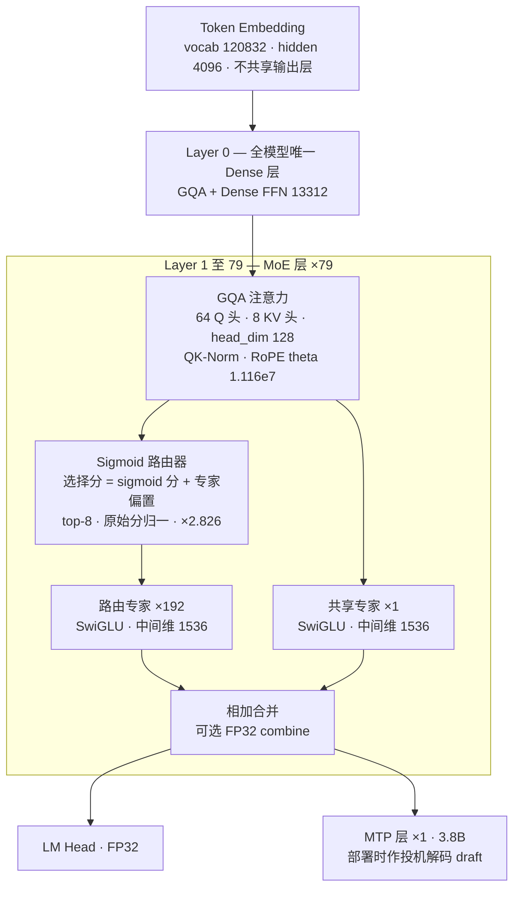

# Hy3 (腾讯混元 3) — 架构冻结、全靠后训练的 295B-A21B 性价比 Agent 模型

> **来源基线**（截至 2026-07-14,**无 arXiv 正式论文**,"technical report" 由开源工件 + 官方发布物构成):
> - 模型卡: `raw/01_theory/01_models/tencent_hunyuan/Hy3_GitHub_README.md`(GitHub `Tencent-Hunyuan/Hy3` @ `8a12d9af87c6`, 2026-07-06,与 HF `tencent/Hy3` 模型卡同源)
> - 架构 ground truth: `Hy3_config.json`(HF `tencent/Hy3`, lastModified 2026-07-06)+ `Hy3_transformers_modeling_hy_v3.py`(transformers 主干 `hy_v3` 建模代码 @ `295cee3e1d00`, 2026-05-28)
> - 推理模式机制: `Hy3_chat_template.jinja`(HF `tencent/Hy3`)
> - 基准数字: `hy3_assets/benchmark.png` / `benchmark-appendix.png`(官方榜图,README 引用)
> - 辅助(二手,单独标注): HF 官方博客 Hy3-preview(Leco Li, 2026-04-23)、腾讯官方新闻稿(2026-07-06)
> **维度**: Entity 深析(机制级)。发布时间线: preview 2026-04 下旬 → 正式版 2026-07-06(Apache 2.0)。

---

## 一、主线

**Hy3 的一条主线:把总参数堆到 295B、把激活压到 21B(7.1% 激活率),用"产品反馈驱动的后训练"而非架构升级去追 2–5 倍激活规模的旗舰。** 两个硬证据:

1. **架构冻结**: 实测 diff `tencent/Hy3-preview` 与 `tencent/Hy3` 的 `config.json`,**逐字段完全一致**(2026-07-14 本库核验)。preview → 正式版三个月的全部提升来自后训练——README 自述"gathered feedback from 50+ products and scaled up post-training with higher quality data"(README L52)。
2. **提升幅度反常识**: 同一架构同一预训练底座上,DeepSWE 0.9→28.0、USAMO 2026 37.3→72.0、MathArena Apex 12.6→38.7、SkillsBench 29.1→55.3(benchmark-appendix.png)——后训练(数据质量 + RL 扩量)吃掉了通常归功于"换架构"的涨幅。

工程上它是一台**标准配方的组装机**: DeepSeek-V3 式 sigmoid+bias 免辅助损失路由、GQA+QK-Norm(不用 MLA)、1 层 MTP 做投机解码、三档可选推理深度(no_think/low/high)。没有一项部件是首创,卖点是**激活参数性价比**(官方口径"以 21B 激活对标 2–5 倍参数旗舰",README L52)和 Apache 2.0 无限制商用。

---

## 二、模型架构(ground truth = 开源 config + 建模代码)

### 2.1 精确超参表(全部出自 `Hy3_config.json`,行号为该文件行)

| 超参 | 值 | 出处(config 行) |
|------|-----|------|
| 总参数 / 激活参数 / MTP 参数 | 295B / 21B / 3.8B | README L58-60(config 无总量字段) |
| 层数(不含 MTP) / MTP 层数 | 80 / 1 | L26 / L45 `num_nextn_predict_layers` |
| hidden_size / dense FFN 中间维 | 4096 / 13312 | L16 / L18 |
| Dense 层数(仅第 0 层) | `first_k_dense_replace: 1` | L13 |
| 注意力 | GQA: 64 Q 头 / 8 KV 头 / head_dim 128 | L23 / L27 / L14 |
| QK-Norm | `qk_norm: true`(逐 head_dim RMSNorm) | L31;modeling L248-249 |
| 路由专家 / 激活 / 共享专家 | 192 / top-8 / 1 | L24 / L25 / L28 |
| 专家中间维(路由=共享,均匀) | 1536 | L11-12;modeling L371-372 |
| 路由函数 | sigmoid + 专家偏置 | L22 `moe_router_use_sigmoid` / L21 `moe_router_enable_expert_bias` |
| 路由缩放因子 | 2.826 | L38 `router_scaling_factor` |
| 上下文 / RoPE θ | 262144 (256K) / 11,158,840 | L19 / L34 |
| 词表 / 词嵌入共享 | 120832 / 不共享 | L44 / L40 `tie_word_embeddings: false` |
| LM Head 精度 | FP32(`enable_lm_head_fp32: true`) | L7 |
| 初始化幅度 | 0.006 | L17 |

**参数账核算**(本库推断,验证 README 口径): 路由专家 192×79 层×(3×4096×1536)≈286.2B,注意力 80×75.5M≈6.0B,双词嵌入≈0.99B,共享专家≈1.49B,合计≈295.0B ✓;激活侧路由专家只算 top-8(≈11.9B),合计≈20.7B ✓ 与"295B/21B"吻合。稀疏度 192/8=24。

### 2.2 结构图



### 2.3 路由机制: DeepSeek-V3 免辅助损失配方 + 一个非标缩放因子

`HYV3TopKRouter.forward`(modeling L306-318)的完整链条:

```python
routing_weights = torch.sigmoid(router_logits)                    # L310 sigmoid 而非 softmax
scores_for_choice = routing_weights + e_score_correction_bias     # L312 偏置只参与"选谁"
_, top_k_index = torch.topk(scores_for_choice, self.top_k, ...)   # L313
top_k_weights = routing_weights.gather(1, top_k_index)            # 加权用无偏置的原始分
top_k_weights = top_k_weights / (top_k_weights.sum(...) + 1e-20)  # L316 top-k 内归一化
top_k_weights = top_k_weights * self.router_scaling_factor        # L318 ×2.826
```

- **机制与为什么**: `e_score_correction_bias` 是逐专家标量 buffer(modeling L369,强制 FP32 保存,L453),训练中按负载动态调整——**只改变专家被选中的概率,不污染加权权重**。这正是 [[12_deepseek_v3_analysis]] 的 aux-loss-free 负载均衡:淘汰辅助损失是因为它给梯度注入与语言建模目标冲突的噪声。Hy3 原样采用,证明该配方已成 2026 年开源 MoE 的事实标准(GLM-5、Kimi K2 同款思路)。
- **非标细节**: `router_scaling_factor = 2.826`(config L38)。sigmoid 分数归一化后总和为 1,比 softmax 路由的期望权重更小,×2.826 把 MoE 分支输出幅度拉回与残差流匹配的量级(作用同 DeepSeek-V3 的 `routed_scaling_factor: 2.5`,数值不同——本条为推断,标度选择官方未解释)。

### 2.4 注意力: 选 GQA + QK-Norm,不选 MLA

64Q/8KV/dim128 的标准 GQA,q/k 各加逐 head_dim 的 RMSNorm(modeling L248-249、L265-266)。**为什么不是省 KV cache 的 MLA**(源无明说,本库推断): ① GQA 8 KV 头在 256K 上下文下 KV cache = 2×8×128×80×2B ≈ 320KB/token,尚可接受;② GQA 与 vLLM/SGLang 的成熟 kernel 生态零适配成本,与 Hy3"三个月快速迭代 + 产品落地优先"的路线一致;③ QK-Norm 抑制 logits 爆炸,是不引入 MLA 时更便宜的长上下文稳定手段。对照组: [[12_deepseek_v3_analysis]](MLA)、[[01_glm_5_analysis]](DSA)、[[longcat_flash_analysis]](MLA+ScMoE)都在注意力上做了改造,Hy3 是刻意的保守派。

> **注意力的推理侧优化在服务栈里,不在权重里**: 混元团队另发了免训练的 **Stem 稀疏注意力**(arXiv 2603.06274,TPD 位置衰减预算 + OAM 输出感知选块,25% 算力逼近稠密精度、128K prefill 3.7×),在腾讯内部集成进 Hy3 preview 的 vLLM 服务(搭配 HPC-BSA 算子)——开源权重与官方部署配方仍是纯稠密 GQA。机制详见 [[stem_sparse_attention_analysis]]。

### 2.5 三档推理模式: 用 chat template 硬编码,不是三个模型

`chat_template.jinja` 揭示 fast/slow thinking 融合的真实实现(行号为该文件行):

| 机制 | 实现 | 出处 |
|------|------|------|
| 模式枚举 | `reasoning_effort ∈ {no_think(默认), low, high}`,非法值直接抛异常 | L40-48 |
| 模式注入 | system prompt 末尾拼特殊 token `<｜reasoning_mode:opensource｜>reasoning_effort:X` | L86-88(无工具)/ L115-119(带工具) |
| **no_think 的实现** | 生成起点直接给出**预闭合**的 `<think></think>`,模型物理上无法输出思考 | L216-217 |
| high/low 的实现 | 生成起点给出未闭合的 `<think>`,强制先思考 | L214-215 |
| Agent 场景保留思考 | `preserved_thinking` 带工具时默认 true(跨轮保留 CoT),纯对话默认 false 且历史轮思考被剥掉 | L29-35 / L147 |
| 工具调用重试兜底 | `fallback_strategy == 'reasoning_toolcall_retry'` 时强制升到 high | L50-53 |
| 工具调用格式 | 非 JSON:`<tool_call>名字<tool_sep>` + 逐参数 `<arg_key>/<arg_value>` 特殊 token 对 | L106-119 |

**要点**: "融合快慢思考"不是路由或蒸馏魔法,而是**同一权重 + 模板级开关**——思考预算完全由 `<think>` 开/闭合的物理约束控制;`arg_key/arg_value` 键值对格式绕开 JSON 字符串转义这一工具调用错误大户(推断,与 README L87"工具调用稳定性修复"口径一致)。

> [!contradiction] **专家"差异化容量"之谜**
> HF 官方 preview 博客(Leco Li, 2026-04-23)称:"Unlike traditional MoE where all experts are the same size, Hunyuan introduces a **differentiated expert size design**…" 并提出 **P-Penalty Loss**("penalizes the model's tendency to favor large experts and encourages it to activate more small experts")。但**开源工件是均匀专家**: config `moe_intermediate_size: 1536` 单一值,建模代码 `HYV3Experts` 用单个 3D 张量存全部 192 个专家(modeling L324-333)、共享专家同为 1536(L371-372)。按"工件是 what 的 ground truth"原则,**发布版 Hy3 不存在异构专家**;博客说法可能描述内部实验版本或训练期设计,P-Penalty 在均匀专家下如何成立源头无解释。两说并存,以工件为准。

---

## 三、preview → 正式版: 一次纯后训练的对照实验

架构与预训练底座不变(config 逐字段一致),变化全在后训练。README 给出的三类产品级修复(L87-91,内部评测口径):

| 维度 | preview → 正式版 | 出处 |
|------|------|------|
| 幻觉率 | 12.5% → **5.4%** | README L89 |
| 常识错误率 | 25.4% → **12.7%** | README L89 |
| 多轮综合问题率 | 17.4% → **7.9%** | README L91 |
| 工具调用跨脚手架方差 | SWE-Bench Verified 在 CodeBuddy/Cline/KiloCode 间波动 ≤4% | README L87 |

反幻觉的训练指导思想值得记录(README L89 原则原文): "answer when grounded, state when evidence is missing, do not conflate sources or fabricate data"——落地为细粒度数据清洗 + 训练约束,而非 RAG 或解码期干预。

**证据(benchmark-appendix.png,同架构下后训练的涨幅)**: DeepSWE 0.9→28.0、Hy-CompanyBench 8.3→41.7、e-bench 10.9→50.2、USAMO 2026 37.3→72.0、Hy-Math 26.1→60.9。**这组数字是本页最有信息量的 ablation**: 它划出了"后训练可兑现"的能力上限——agentic 执行、竞赛数学这类强依赖 RL 与数据配方的维度可以翻数倍,而 GPQA Diamond(87.2→90.4)、CL-bench(22.8→23.8)这类底座知识/长上下文能力几乎不动。

---

## 四、基准表现(全部出自官方榜图,注意评测条件)

主榜 12 项(benchmark.png,对比 GLM-5.2 / DeepSeek-V4 pro / Seed-2.1 pro / Qwen-3.7 Max / Claude Opus 4.8 / GPT-5.5;带 * 为腾讯自测):

| 基准 | Hy3 | 同尺寸段最强对比 | 旗舰对比 |
|------|-----|------|------|
| SWE-bench Verified | 78.0 | GLM-5.2 84.2*, DeepSeek-V4 pro 80.6 | Opus 4.8 88.6 |
| SWE-bench Pro | 57.9 | GLM-5.2 62.1, Qwen-3.7 Max 60.6 | Opus 4.8 69.2 |
| Terminal-Bench 2.1 | 71.7 | GLM-5.2 81.0, Qwen 75.0 | Opus 4.8 85.0 |
| BrowseComp | **84.2** | Seed-2.1 pro 86.2, DeepSeek 83.4 | GPT-5.5 84.4(基本持平) |
| DeepSearchQA | **91.0** | DeepSeek 90.4*, Seed 90.8* | GPT-5.5 95.5* |
| ClawEval (pass^3) | **68.5** | Qwen 65.2, GLM-5.2 62.4 | Opus 4.8 72.1 |
| SkillsBench (79, text-only) | **55.3** | Seed 53.2, GLM-5.2 51.9* | Opus 4.8 64.6* |
| HLE (with tools, text-only) | 53.2 | Seed 55.7, GLM-5.2 54.7 | Opus 4.8 57.9 |
| FrontierScience-Olympiad | **74.8** | Qwen 74.3*, GLM-5.2 72.5* | GPT-5.5 73.8*(反超) |
| MathArena Apex | 38.7 | Qwen 44.5, DeepSeek 38.3 | GPT-5.5 85.4*(远逊) |
| AA-LCR | 73.4 | GLM-5.2 73.4*(持平) | GPT-5.5 76.4* |

**读法**(结合 benchmark-appendix.png 的评测说明): ① agentic 编码用 SWE-agent/Claude Code 等真实脚手架跑,非静态 pass@1,NL2Repo 还加了反 reward-hacking 约束——口径偏工程真实;② Hy3 的强项集中在 **agentic 搜索/工具使用/技能执行**(BrowseComp、ClawEval、SkillsBench 同尺寸段第一),编码硬实力(SWE 系列、Terminal-Bench)仍系统性落后 GLM-5.2 与旗舰;③ MathArena Apex 与 GPT-5.5 差 46.7 分,竞赛数学天花板受 21B 激活限制明显。④ README L81 的补充证据: 270 名专家盲评真实工作任务,Hy3 2.67/4 vs GLM-5.1 2.51/4,优势集中在前端、数据存储、CI/CD——与"产品可用性优先"的后训练路线自洽。

---

## 五、部署形态(README L140-210)

- **推荐栈**: vLLM(`--speculative-config.method mtp, num_speculative_tokens 2`)或 SGLang(以 EAGLE 模式挂 MTP: `--speculative-algorithm EAGLE --speculative-num-steps 2 --speculative-num-draft-tokens 3`)——MTP 层在两个引擎里都作为投机解码 draft 使用,与 [[12_deepseek_v3_analysis]] 的 MTP 用法一致。
- **硬件门槛**: BF16 全量 8×H20-3e 级别(README L142);FP8 版本(`Hy3-FP8`)另发,量化工具链开源 AngelSlim。
- **采样推荐**: `temperature=0.9, top_p=1.0`(README L134);`reasoning_effort` 经 `chat_template_kwargs` 透传(L129)。
- **许可**: Apache 2.0 无附加条款(preview 曾是限制性许可,正式版放开——腾讯官方新闻稿 2026-07-06)。

---

## 六、同代模型对位(以本库已有分析页为参照系)

| 模型 | 总参/激活 | 注意力 | 负载均衡 | 差异化要点 |
|------|------|------|------|------|
| **Hy3** | 295B/21B(激活率 7.1%) | GQA+QK-Norm | sigmoid+bias 免辅助损失 | 架构最保守,赌注全押后训练与产品反馈闭环 |
| [[12_deepseek_v3_analysis]] | 671B/37B | MLA | 同款(原创者) | FP8 训练、MTP 原创 |
| [[11_kimi_k2_analysis]] | 1.04T/32B | MLA | 同款思路 | MuonClip、agentic RL 数据合成 |
| [[01_glm_5_analysis]] | 744B/40B | DSA 稀疏注意力 | 同款思路 | Muon Split、压 KV 换长上下文 |
| [[longcat_flash_analysis]] | 560B/27B | MLA | PID 控制器调 bias | ScMoE 短路重叠、零计算专家 |

Hy3 激活参数是这一档里最小的(21B vs 27–40B),官方叙事"21B 激活对标 2–5 倍激活规模旗舰"在 agentic 维度基本成立、在编码/竞赛数学维度不成立(§四)。API 定价 ¥1/M 输入、¥4/M 输出、¥0.25/M 缓存(二手信息,tech360/Lushbinary 报道,未见官方英文源,存疑待核)。

---

## 附: 源文件清单(raw/01_theory/01_models/tencent_hunyuan/)

| 文件 | 内容 | 基线 |
|------|------|------|
| `Hy3_GitHub_README.md` / `_CN.md` | 模型卡(架构表、基准叙述、部署) | GitHub @ `8a12d9af87c6`, 2026-07-06 |
| `Hy3_config.json` | 架构 ground truth | HF `tencent/Hy3`, 2026-07-06 |
| `Hy3_chat_template.jinja` | 三档推理模式/工具调用格式 | 同上 |
| `Hy3_transformers_modeling_hy_v3.py` | 路由/注意力/MoE 实现 | transformers @ `295cee3e1d00` |
| `hy3_assets/benchmark.png` | 主榜 12 项 | README 引用资产 |
| `hy3_assets/benchmark-appendix.png` | 全量矩阵(~40 基准×11 模型)+ 评测条件 | 同上 |

## Related Pages

- [[01_theory/01_models/tencent_hunyuan/index|腾讯混元]] — 腾讯混元模型家族入口
- [[stem_sparse_attention_analysis]] — 混元自研免训练稀疏注意力,Hy3 preview 内部推理服务的 prefill 优化(不在开源权重内)
- [[12_deepseek_v3_analysis]] — sigmoid+bias 免辅助损失路由与 MTP 的原创出处,Hy3 的直接技术上游
- [[20_deepseek_moe_analysis]] — 共享专家 + 细粒度专家切分的源头
- [[13_deepseek_v4_analysis]] — 同期对比: 走架构激进路线(CSA/HCA/mHC)的反面参照
- [[11_kimi_k2_analysis]] — 同为 agentic 主打的开源 MoE,RL 配方对照
- [[13_kimi_k2_5_analysis]] — 主榜对比模型之一的多模态延伸
- [[01_glm_5_analysis]] — 主榜最强同段对手,DSA 注意力路线
- [[longcat_flash_analysis]] — 另一"小激活参数"路线: 用 ScMoE 调度而非纯后训练换性价比
- [[inkling_analysis]] — 反面对照: Hy3 架构最保守赌后训练,Inkling 赌架构差异化(抛 RoPE/MLA)
