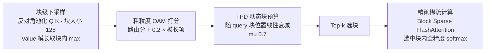

# Stem 稀疏注意力 — 把预算花在因果信息流的"主干"上的免训练 Prefill 加速

> **来源基线**: arXiv **2603.06274v1**(2026-03-06 提交,PDF 页眉 "Preprint. March 9, 2026"),Lin Niu*, Xin Luo* 等,腾讯 + 中科大。原文 PDF: `raw/01_theory/01_models/tencent_hunyuan/Stem_Sparse_Attention-2603.06274.md`
> **工程落地来源**(二手,官方公众号转载): 腾讯技术工程《混元 AI Infra 优化 Hy3 Preview》(2026-06-26,经 53AI/搜狐转载核对);"ICML-26 接收"为新闻报道口径(富途 2026-07),PDF 本体仍标 Preprint,两说并存。
> **维度**: Entity 深析(机制级)。定位: **推理服务栈里的免训练插件,不在 Hy3 开源权重内**——`modeling_hy_v3.py` 是纯稠密 GQA,README 部署配方也不含 Stem;它在腾讯内部作为 vLLM 框架内的 prefill 优化服务 Hy3 preview(W8A8-FP8)。

---

## 一、主线

**一句话: 因果注意力里,序列开头的 token 是全序列信息流的"主干"(stem)——第 1 个 Value 参与其后每一个位置的输出聚合,剪掉它的误差会逐层递归放大;而尾部 token 只影响局部。所以稀疏预算不该按位置均匀分配(现有方法的通病),而应该"头部多、尾部少"地衰减,并且选 token 时不能只看注意力分数、还要看 Value 模长。** 两个机制(TPD + OAM)组合,25% 计算预算达到接近稠密的精度,128K prefill 提速 3.7×(H20,Fig. 1 / §3.3)。

针对的痛点是 **prefill 阶段的 O(N²)**(§1): 长上下文首 token 延迟主要耗在这里。方法完全 **training-free、即插即用**,还能叠加在已训练稀疏的模型(DeepSeek-V3.2 DSA、MiniCPM-4.1 InfLLM v2)上再压 15–18% 预算(Table 3)。

---

## 二、机制一: TPD(Token Position-Decay)—— 预算随 query 位置线性衰减

**动机(§2.1 的理论论证,Eq. 1 / Fig. 2)**: 记第 l 层输出 $O^{(l)}_i=\sum_{j\le i}P^{(l)}_{i,j}V^{(l)}_j$,下一层 Value 由 $V^{(l+1)}_i=T(O^{(l)}_i)$ 递归生成。展开可见不对称性:

- 剪掉 **初始位置** $V^{(l)}_1$:$P_{i,1}V_1$ 项从**每一行**消失 → 下一层全部 N 个 token 的表示都被污染,且逐层复利放大("recursive anchors");
- 剪掉 **末位** $V^{(l)}_N$:误差只局限在 $V^{(l+1)}_N$ 一个位置。

实证(Fig. 3,Qwen3-8B,30 条 8K LongBench 样本): 对 [0,2k) 区间稀疏化的 head-logits MSE 比对 [6k,8k) 稀疏化高出一个数量级以上,固定/动态预算配置下均成立。

**机制(Eq. 3)**: 每个 query 位置 i 的 top-k 预算线性插值衰减

$$
\begin{aligned}
k(i)
&=\Big\lceil k_{\mathrm{start}}-\frac{k_{\mathrm{start}}(1-\mu)}{N}\cdot i\Big\rceil,\quad k_{\mathrm{end}}=\mu\cdot k_{\mathrm{start}},\ \mu\in(0,1]
\end{aligned}
$$

即**靠前的 query 行近乎稠密计算**(保住早期输出 → 下一层早期 Value 的保真度),越靠后剪得越狠。相对均匀 top-k 的算力节省有闭式(Eq. 4)。经验取 **μ=0.7**:消融(Fig. 5 左)显示 μ=0.7 与均匀预算(μ=1.0)精度几乎相同(31.64 vs 31.67, Qwen3)但算力显著更省;μ<0.6 开始伤尾部局部上下文。

**为什么不是均匀 top-k(所有现有方法的默认)**: 等预算对照消融(Table 5,uniform 取 $k_{\mathrm{uni}}=0.85k_{\mathrm{start}}$ 保证总算力相同)——Qwen3-8B 上 uniform 29.41 → +TPD **31.43**(+2.02),Llama-3.1-8B 上 37.48 → **40.85**(+3.37)。同样的钱,花在头部就是更值。

## 三、机制二: OAM(Output-Aware Metric)—— 选块不只看分数,还看 Value 模长

**动机(§2.2)**: 现有免训练方法(MInference / XAttention / FlexPrefill)全用 Score-Aware Metric——只近似 $Q_iK_j^T$ 路由分数。但输出是 $O_i=\sum_j P_{i,j}V_j$:**分数高 ≠ 贡献大**,若 $\|V_j\|\approx 0$ 则该 token 对输出几乎无贡献;反之中等分数 + 大模长的"高能量信号" token 被剪掉会引入大误差。

**推导(Eq. 5-6)**: 最小化稀疏-稠密输出重构误差 $\min_S\|\sum_{j\notin S}P_{i,j}V_j\|$ → 保留 $\exp(Q_iK_j^T/\sqrt d)\cdot\|V_j\|_2$ 最大的 token → 取对数保序化,得

$$
\begin{aligned}
M_{i,j}
&=\underbrace{Q_iK_j^T}_{\text{路由相关性}}+\ \beta\cdot\underbrace{\max(0,\log\|V_j\|_2)}_{\text{信号模长}}\qquad(\text{Eq. 7},\ \beta=0.2)
\end{aligned}
$$

max(0,·) 截断防止小模长项反噬路由语义;β 消融(Fig. 5 右)单峰,峰值 0.2,>0.3 后模长噪声开始压过语义。等预算下 OAM 相对 SAM 的逐层重构误差与 head-logits 损失均更低(Table 1: head logits 0.3126 vs 0.3368)。

## 四、整体算法与工程实现(§2.3 / Algorithm 1 / §3.1)

- **粗到细**: 先在 B=128 的块粒度上用下采样 Q̄K̄(沿用 XAttention 的反对角打分)+ max-pool 的 log‖V‖ 算 OAM,把度量开销压掉 B² 倍(复杂度分析 Eq. 8,度量项 ≈ 2N²d/B²,可忽略);再只对选中块做全精度 softmax。
- **稳定性护栏**: 恒保 4 个初始块 + 4 个局部窗口块,总预算下限 54 块;k_start 取块数的 0.2(8–16K)/0.1(>16K)(§3.1)。
- **kernel**: 论文用开源 Block Sparse Attention 库(MIT-BSA, Guo et al. 2024);腾讯内部部署换成自研 **HPC-BSA** 算子(开源于 `Tencent/hpc-ops`),公众号口径:全稀疏度范围相对 MIT-BSA 稳定 ~3× 加速、支持 FP8(二手,未见论文背书)。

## 五、证据(全部带基线)

**LongBench(Table 2,AVG% @ 预算)**:

| 方法 | Qwen3-8B | Llama-3.1-8B-Instruct |
|------|------|------|
| Dense | 32.01 @ 100% | 42.02 @ 100% |
| MInference | 30.27 @ 69% | 41.06 @ 81% |
| FlexPrefill | 28.55 @ 31% | 36.09 @ 34% |
| XAttention | 30.46 @ 28% | 37.91 @ 35% |
| **Stem** | **31.64 @ 25%** | **41.48 @ 31%** |

**RULER 4K–128K(Table 4)**: Stem 以**严格最低的 25% 预算**拿到稀疏方法中最高均分(Llama 88.47 vs Dense 88.86;Qwen3 87.15 vs 87.66)——MInference 精度接近但要 55–76% 预算。

**叠加已训练稀疏模型(Table 3)**: DeepSeek-V3.2 的 DSA(原生 top-2048 token 选择)套上 Stem 调度后预算再降 15%,LongBench AVG 反升(42.84→43.16);MiniCPM-4.1 InfLLM v2 预算再降 18% 精度持平——**说明"均匀预算 + 纯分数度量"的冗余在训练态稀疏模型里同样存在**。

**延迟(Fig. 1 / §3.3,H20,Llama-3.1-8B,BF16,bs=1)**: 128K 上下文总时延 Dense(FlashAttention-2)1540ms → Stem **420ms,3.7×**;16K 时 95→46ms 约 2×——序列越长收益越大(稀疏度上限随 N 提高)。注: 公众号/新闻稿口径为"首字延迟降低 3.6 倍",与论文 3.7× 略有出入,以论文 Fig. 1 为准。

## 六、边界与代价(源文口径 + 本库推断)

- **只管 prefill**: decode 阶段的 KV cache 体积与逐 token 注意力不受益(论文范围明确限定 pre-filling;推断: decode 需另配 KV 淘汰/量化类方案)。
- **免训练是双刃剑**: 无需改权重即可上线任意稠密模型(Hy3、Llama、Qwen 均适用),但精度上限受制于事后近似——与 GLM-5 的 DSA、LongCat-2.0 的 LSA 这类**训练态稀疏**路线相比,Stem 是"部署侧补丁"而非"模型能力";两条路线可叠加(Table 3 即证据)。
- **μ、β 是全局常数**: 未按层/头自适应(推断为工程简化;FlexPrefill 的按头校准正是其对照缺点之一,论文未讨论逐头衰减)。
- **与 Hy3 开源版的关系要分清**: 开源 Hy3 权重与 vLLM/SGLang 官方配方都是**稠密 GQA**;Stem+HPC-BSA 目前是腾讯内部服务栈的优化(公众号口径),社区复现需自行集成 `Tencent/hpc-ops` 或 MIT-BSA。

## Related Pages

- [[hy3_analysis]] — 宿主模型;其 §2.4 记录了开源权重为稠密 GQA,本页是其推理服务侧的注意力优化
- [[01_theory/01_models/tencent_hunyuan/index|腾讯混元]] — 腾讯混元家族入口
- [[01_glm_5_analysis]] — 对照: DSA 训练态稀疏注意力路线(Stem 在 DeepSeek-V3.2 的 DSA 上叠加实验见 Table 3)
- [[longcat_2_analysis]] — 对照: LSA 训练态稀疏注意力,另一条"改模型"而非"改部署"的路
- [[12_kimi_linear_analysis]] — 对照: 线性注意力路线,从算子复杂度层面消解同一瓶颈
