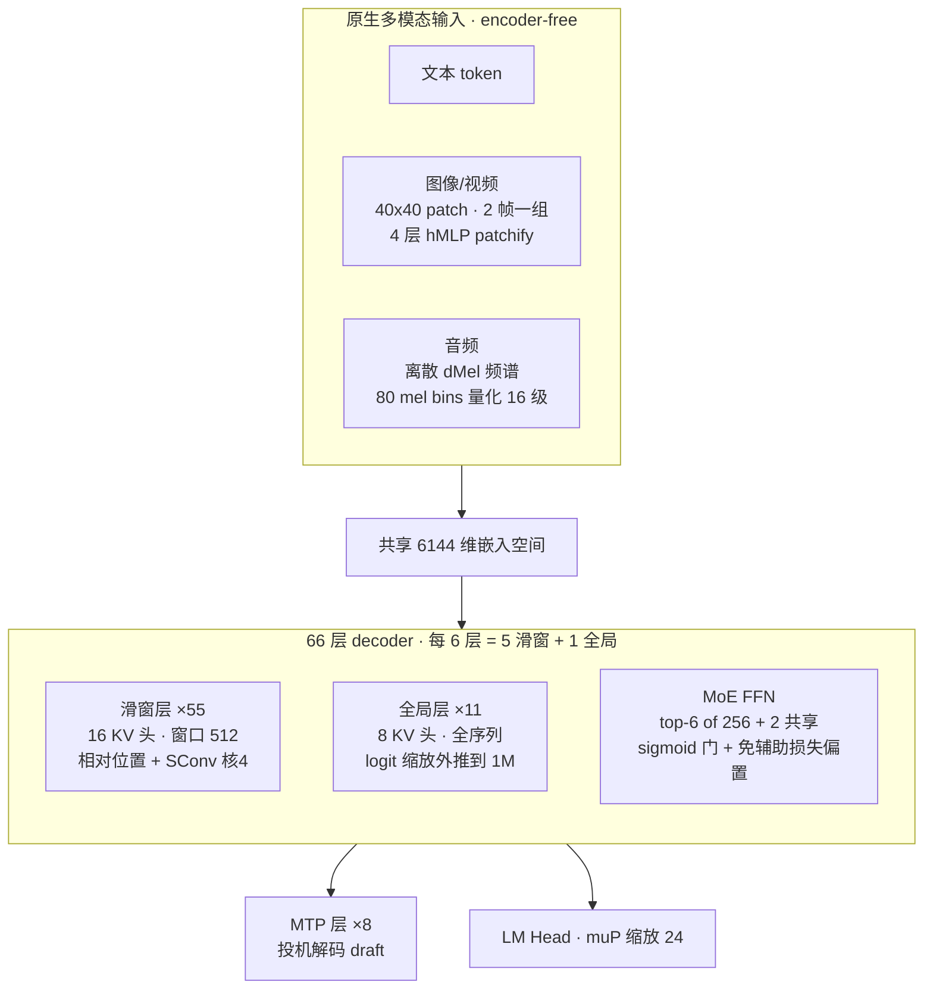

# Inkling (Thinking Machines) — 不抄 DeepSeek 作业的多模态开源 MoE,赌"可定制底座"而非榜首

> **来源基线**(2026-07-15 发布,**无正式技术报告/论文**,"technical report" 实体 = 官方公告 + HF 模型卡 + 开源工件):
> - 架构 ground truth: `raw/01_theory/01_models/thinking_machines/Inkling_config.json`(HF `thinkingmachines/Inkling`,行号即该文件行)
> - 叙述来源: `Inkling_official_announcement_2026-07-15.html`(thinkingmachines.ai 公告快照)+ `Inkling_HF_model_card.md`(HF 模型卡,含完整基准表 + 许可)
> - 训练配方口径来自官方公告(config 不含),已单独标注
> **维度**: Entity 深析(机制级)。发布方: Thinking Machines Lab(Mira Murati,前 OpenAI CTO)。许可: **Apache 2.0**;权重 BF16 + NVFP4 两 checkpoint。

---

## 一、主线

**Inkling 的一条主线: 在"MLA + RoPE + sigmoid 免辅助损失路由"已成 2026 年开源 MoE 事实标准的背景下,它在注意力、位置编码、多模态接入三处集体走了不同的路;而产品叙事上明确放弃争榜首,把模型定位成"可微调的开源底座",靠 Tinker 微调服务变现。** 三个硬证据:

1. **架构反共识**(§二,全部对 config 核验): 抛 RoPE 用学习式相对位置编码(`d_rel=16, rel_extent=1024`,L16-17);抛 MLA 用 Gemma 式滑窗/全局 5:1 交错注意力(`local_layer_ids` 55 层 + 11 全局,L24-80);塞入短卷积(`use_sconv=true, sconv_kernel_size=4`,L82-83);encoder-free 原生多模态(vision hMLP patchify + audio 离散 dMel,L103-121)。对照 [[hy3_analysis]] / [[deepseek_v3_analysis]] / [[glm_5_analysis]] 的"改一处注意力、其余照抄",Inkling 是系统性另起炉灶。
2. **官方自认非 SOTA**: 公告原话 "Inkling is not the strongest overall model available today",卖点是"multimodal + efficient thinking + Tinker 可微调"的组合价值,而非单点最强(模型卡基准表也印证,见 §四)。
3. **商业模式明牌**: 模型 Apache 2.0 免费开源,收入来自 **Tinker**(微调服务)——"customization, not leaderboard dominance"。这与"模型即产品"的闭源逻辑、以及中国开源模型"开源引流+API变现"都不同。

---

## 二、模型架构(ground truth = 开源 config.json)

### 2.1 精确超参表(行号 = `Inkling_config.json` 行)

| 超参 | 值 | 出处 |
|------|-----|------|
| 总参 / 激活参 | 975B / 41B | 模型卡 §Parameters(config 无总量字段) |
| 层数 | 66(decoder-only) | L11 `num_hidden_layers` |
| hidden_size | 6144 | L10 |
| 词表 | 201024(实际 200058) | L12 / L84 `unpadded_vocab_size` |
| 全局层注意力 | 64 Q 头 / 8 KV 头 / head_dim 128 | L13-15 |
| 滑窗层注意力 | 64 Q 头 / **16 KV 头** / 窗口 512 | L87-90 `swa_*` |
| 滑窗:全局 比例 | 55:11 = **5:1** | L24-80(见 §2.3) |
| 位置编码 | 学习式相对(非 RoPE) | L16-17 `d_rel/rel_extent` |
| 长度外推 | attention logit 缩放,>128K 生效 | L20-21 `log_scaling_*` |
| 短卷积 SConv | 核大小 4 | L82-83 |
| 路由专家 / 激活 / 共享 | 256 / top-6 / 2 | L91-93 |
| 专家中间维 / 稠密层中间维 | 3072 / 24576 | L96 / L95 |
| 稠密 MLP 位置 | 层 index 2 | L81 `dense_mlp_idx` |
| 路由 | sigmoid + 门偏置,top-k 后归一,route_scale 8.0 | L97-100 |
| muP logits 缩放 | 24.0 | L85 |
| MTP 层数 | **8** | L123 `num_nextn_predict_layers` |
| 上下文 | 1,048,576 (1M) | L8 |
| 精度 | BF16 / NVFP4 | 模型卡 |

**参数账**(本库推断,验证 41B 激活): 每 token 激活 6 路由 + 2 共享 = 8 专家,每专家 SwiGLU ≈ 3×6144×3072 ≈ 56.6M,8×56.6M ≈ 453M/层,×65 MoE 层 ≈ 29.4B,加注意力/嵌入/稠密层 ≈ 41B ✓;总参 256×65×56.6M ≈ 941B + 其余 ≈ 975B ✓。

### 2.2 结构图

### 2.3 注意力: 抛 MLA,用滑窗/全局 5:1 交错 + 非对称 KV 头

`local_layer_ids`(L24-80)列了 55 层滑窗层;补集是全局层 = 第 5/11/17/23/29/35/41/47/53/59/65 层,共 11 层——**每 6 层的最后一层是全局**,精确 5:1(公告口径 "5:1 ratio")。非对称设计是本库读 config 发现的要点:

- **全局层** 8 KV 头(L14),KV cache 省;靠 `log_scaling`(>128K 后按 log 比例放大 logits,L20-21)撑 1M 外推。
- **滑窗层** 反而 16 KV 头(L89)但只覆盖 512 窗口(L90)——局部信息密、KV 便宜(窗口小)。

**为什么不是 MLA**(源无明说,本库推断): DeepSeek 系用 MLA 压 KV cache;Inkling 改用"便宜全局(少 KV 头)+ 密集局部(小窗口)"的分工,达到类似的 KV 预算而无需 MLA 的低秩投影复杂度。这是与 [[glm_5_analysis]](DSA)、[[deepseek_v3_analysis]](MLA)、[[longcat_flash_analysis]](MLA)都不同的第三条路。

### 2.4 位置编码: 学习式相对,非 RoPE

config 无 rope_theta,取而代之 `d_rel=16, rel_extent=1024`(L16-17)——位置信息直接学进 attention logits(公告: "each attention layer learns position directly in the attention logits","performs better and extrapolates better than RoPE")。配合 §2.3 的 logit 缩放外推到 1M。**这是对"RoPE 是长上下文事实标准"的正面挑战**——2026 年主流开源全用 RoPE,Inkling 是显眼的例外。

### 2.5 短卷积 SConv: MoE 里的 Mamba/Griffin 味

`use_sconv=true, sconv_kernel_size=4`(L82-83)。公告说加在两处: K/V 投影之后、以及 attention 与 MLP 残差分支输出上。**机制**(推断): 核大小仅 4 的 1D 深度卷积,给注意力之外补一路极短程 token 混合——Mamba/Griffin 系手法出现在千亿 MoE 里少见,可能补偿滑窗注意力对相邻位置的建模。

### 2.6 MoE 路由: 大体沿用免辅助损失,但缩放因子异常大

sigmoid 门(L99)+ 门偏置免辅助损失负载均衡(L98,同 [[deepseek_v3_analysis]] 配方)+ top-k 后归一(L100)+ 2 共享专家(L93)+ `shared_expert_sink=true`(L94,共享专家兼作路由 sink,本库推断)。非标处: `route_scale=8.0`(L97),显著大于 Hy3 的 2.826 / DeepSeek 的 2.5——sigmoid 归一后需要更大标度把 MoE 输出拉回残差流量级(推断)。

### 2.7 多模态: encoder-free 原生四模态

- **图像/视频**: 40×40 像素 patch(L116)、视频 2 帧一组(L117 `temporal_patch_size`),经 4 层 hMLP(L119)直接投进 6144 维主干——**无独立 ViT**。
- **音频**: 离散 dMel 频谱(L111 `audio_mode=dmel`),80 mel bins 量化到 16 级(L105-106),与文本 token 联合处理——**无独立音频编码器**。
- 四模态在 45T token 预训练里原生联合,不是训完贴 adapter。**这是最大胆的一注**: 对照 [[kimi_k2.5_analysis]] 仍保留 MoonViT-3D 重型视觉编码器,Inkling 把多模态接入压到最薄。代价见 §五(细粒度视觉可能吃亏)。

### 2.8 激进的 8 层 MTP

`num_nextn_predict_layers=8`(L123)——8 个多 token 预测层,而 [[deepseek_v3_analysis]] / [[hy3_analysis]] 只有 1 个。为投机解码提供更长 draft,吞吐意图明确;MTP 子结构自身也用滑窗(L125-132)。

---

## 三、训练配方(官方公告口径,config 不含)

| 环节 | 内容 |
|------|------|
| 预训练规模 | 45T token(文/图/音/视四模态) |
| 优化器 | 混合: **Muon** 管大矩阵权重 + Adam 管其余;weight decay 强度耦合到学习率的平方 |
| 参数化 | muP(`logits_mup_width_multiplier=24.0`) |
| SFT | 用开源模型(**点名 Kimi K2.5**)生成的合成数据冷启动 |
| RL | 合成 + 人造环境上 **3000 万+ rollout**;推理能力 log-linear 提升,CoT 自发变简洁(未显式约束长度) |

Muon 路线与 [[kimi_k2_analysis]](MuonClip)、[[glm_5_analysis]](Muon Split)同源,佐证 Muon 已成 2026 年前沿开源训练的主流优化器选择。

---

## 四、性能(HF 模型卡完整表,effort=0.99,对比分 2026-07-14 生成)

开源对手 Nemotron 3 Ultra / Kimi K2.5·K2.6 / GLM 5.2 / DeepSeek V4 Pro;闭源 Gemini 3.1 Pro / Claude Fable 5 / GPT 5.6 Sol。摘录代表项(%):

| 任务 | Inkling | Nemotron 3 Ultra | Kimi K2.6 | GLM 5.2 | DeepSeek V4 Pro | Claude Fable 5 |
|------|------|------|------|------|------|------|
| AIME 2026 | 97.1 | 94.2 | 96.4 | 99.2 | 96.7 | – |
| GPQA Diamond | 87.2 | 86.7 | 91.1 | 89.5 | 88.8 | 92.6 |
| HLE(带工具) | 46.0 | 37.4 | 54.0 | 54.7 | 48.2 | 64.5 |
| SWEBench Verified | 77.6 | 70.7 | 80.2 | – | 80.6 | 95.0 |
| Terminal Bench 2.1 | 63.8 | 56.4 | 71.3 | 82.7 | 64 | 84.6 |
| MCP Atlas | 74.1 | 44.7 | 68.1 | 77.8 | 73.2 | 83.3 |
| SimpleQA Verified | 43.9 | 32.4 | 38.7 | 38.1 | 57.0 | 68.3 |
| MMMU Pro | 73.3 | – | 79.0 | – | – | 84.2 |
| FORTRESS(对抗) | 78.0 | 77.6 | 65.6 | 71.3 | 36.0 | 96.0 |

**读法**:
- **主要对标 Nemotron 3 Ultra 并全面领先**(官方唯一给全项对比的开源基线);对 Kimi K2.6 / GLM 5.2 互有胜负,系统性落后闭源旗舰(Fable 5 / GPT 5.6)。
- **强项**: MCP Atlas(通用 agent,74.1 远超 Nemotron 44.7)、SimpleQA(事实性,43.9 领先多数开源)、AIME/数学。**弱项**: 视觉(MMMU Pro 73.3 落后 Kimi/闭源)——**印证 §2.7 encoder-free 在细粒度视觉上的代价**(本库推断);Terminal Bench 落后 GLM 5.2 一档。
- **安全**: FORTRESS 对抗 78.0 领先多数开源(DeepSeek V4 Pro 仅 36.0),官方强调 calibration + resistance to censorship 的定位。

---

## 五、影响力评估(以下含本库判断,已与事实分离)

**1. 象征意义 > 单点强度**。前 OpenAI CTO 潜行 18 个月后的首个模型,直接 Apache 2.0 开源权重——"前 OpenAI CTO 做了 Altman 不做的事"是本次传播主线。在美国前沿实验室普遍闭源背景下的一次鲜明站队。

**2. 商业模式创新是真看点**。模型免费,收入来自 Tinker 微调服务(64K/256K 上下文档位,限时五折)。把"开源基座 + 定制变现"做成明牌,是区别于闭源"模型即产品"、也区别于中国开源"引流+API"的第三种范式。

**3. "抗审查 / 认知校准"是精准卡位**。官方为 calibration、forecasting(Brier)、resistance to censorship 训练——在内容受限的中国开源模型与对齐较重的闭源美国模型之间开辟差异化空间。

**4. 技术层面的潜在冲击**: 若 Inkling 的架构选择被验证有效,可能松动几个"事实标准"——RoPE(→ 学习相对 PE)、MLA(→ 滑窗/全局非对称 KV)、纯 Transformer MoE(→ 掺 SConv)、重型视觉编码器(→ encoder-free)。它给了社区一个**非 DeepSeek 血统的千亿级开源参照系**,对生态多样性本身有价值。

**5. 生态铺满(day-0)**: Together AI / Fireworks / Modal / Databricks / Baseten 首日可推理;SGLang / vLLM / llama.cpp / transformers 已适配;另发 12B 激活的 **Inkling-Small**(276B 总参,同后训练栈)预览,主打低延迟低成本。NVFP4 checkpoint 直接对接 Blackwell 部署(见 [[hw_friendly_llm_codesign_analysis]] 的 NVFP4 双层缩放)。

**需打折看待**: 官方自认非 SOTA;全项对比只放 Nemotron 3 Ultra 一个详细基线;encoder-free 多模态在视觉上已见落后(§四);8 MTP 层实际接受率、无 RoPE 在 1M 的真实外推质量,均无第三方复现;无正式技术报告,机制层"为什么"披露有限。

---

## 附: 源文件清单(raw/01_theory/01_models/thinking_machines/)

| 文件 | 内容 | 基线 |
|------|------|------|
| `Inkling_config.json` | 架构 ground truth | HF `thinkingmachines/Inkling` |
| `Inkling_HF_model_card.md` | 模型卡(架构叙述、完整基准表、许可、安全) | 同上 |
| `Inkling_official_announcement_2026-07-15.html` | 官方公告(训练配方、设计哲学) | thinkingmachines.ai |

## Related Pages

- [[index]] — Thinking Machines 家族入口
- [[hy3_analysis]] — 反面对照: 架构最保守(全程 GQA+RoPE)、赌后训练;Inkling 赌架构差异化
- [[deepseek_v3_analysis]] — 被 Inkling 部分沿用(免辅助损失路由)、部分抛弃(MLA/RoPE/单 MTP)的技术上游
- [[kimi_k2.5_analysis]] — 多模态对照: 保留 MoonViT-3D 重编码器 vs Inkling encoder-free;且 Inkling SFT 用 Kimi K2.5 合成数据冷启动
- [[kimi_k2_analysis]] — Muon 训练路线同源(MuonClip)
- [[glm_5_analysis]] — Muon + 稀疏注意力路线对照(DSA vs 滑窗交错)
- [[longcat_flash_analysis]] — 另一"小激活参数"工业实践对照
- [[hw_friendly_llm_codesign_analysis]] — Inkling NVFP4 checkpoint 对应的 Blackwell 部署侧原理
