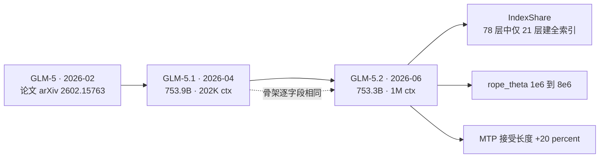
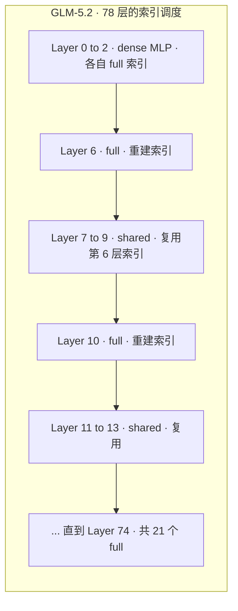

# GLM-5.1 与 GLM-5.2：骨架一字未改，把预算全押在「索引复用」换 1M 上下文

> **来源基线**：
> - 模型卡快照 `raw/01_theory/01_models/zhipu_glm/GLM_5_1_model_card_26e1bd6e.md`，对应 [zai-org/GLM-5.1 `26e1bd6e`](https://huggingface.co/zai-org/GLM-5.1/tree/26e1bd6e)（HF 仓库创建于 2026-04-03）。
> - 模型卡快照 `raw/01_theory/01_models/zhipu_glm/GLM_5_2_model_card_b4734de4.md`，对应 [zai-org/GLM-5.2 `b4734de4`](https://huggingface.co/zai-org/GLM-5.2/tree/b4734de4)（HF 仓库创建于 2026-06-16）。
> - 结构数值一律取自同 revision 的 `config.json` 快照：`GLM_5_1_config_26e1bd6e.json`、`GLM_5_2_config_b4734de4.json`（同目录）。
> - 参数量取自 HuggingFace safetensors 索引（`/api/models/<id>?blobs=true`，2026-08-27 读取）。
>
> **维度**：开放权重发布分析（模型卡 + 权重配置交叉核对）。
> **更新**：2026-08-27。

> [!note]
> 两个版本都**没有各自的技术报告**：模型卡的 `Citation` 段落引用的仍是 GLM-5 的 arXiv:2602.15763（`GLM_5_1_model_card :78-86`、`GLM_5_2_model_card :99-107`）。因此本页的"报告"基线是**模型卡 + 开放权重配置**，训练数据、优化器、后训练配方均**未披露**，不要把 GLM-5 论文的训练细节顺延到这两个版本上。GLM-5 论文本身的逐章深挖见 [[01_glm_5_analysis]] 及其 7 篇深潜页。

---

## 一、中央论点：这是一条「冻结骨架、只动长上下文成本」的迭代线

把两版的 `config.json` 逐字段对齐后，结论比模型卡的叙事更干脆：**从 GLM-5.1 到 GLM-5.2，模型骨架一个字段都没动**。78 层、hidden 6144、256 routed + 1 shared 专家、每 token 选 8 个、MLA 的 `q_lora_rank=2048` / `kv_lora_rank=512`、`qk_head_dim=256`（192 nope + 64 rope）、`v_head_dim=256`、DSA 的 `index_topk=2048` / `index_n_heads=32` / `index_head_dim=128`、`routed_scaling_factor=2.5`、`noaux_tc` 路由——全部逐字节相同。

真正变化的只有三件事，且三件都指向同一个目标——**让 1M 上下文在服务侧算得起**：

1. `max_position_embeddings`：202752 → **1048576**；
2. `rope_theta`：1,000,000 → **8,000,000**（真正支撑更长外推的那个旋钮）；
3. 新增一整组 indexer 复用字段，即模型卡命名的 **IndexShare**。

这条主线的代价也很明确：GLM-5.2 在**推理与编码基准上普遍领先 5.1**，但架构上没有引入任何新的表达能力——性能提升只能归因于未披露的训练/后训练改动，而不是结构。

---

## 二、两版配置的完整差异（穷举，非抽样）

下表是对两份 `config.json` 做**全键集合比对**的结果，不是挑出来的样本。

| 字段 | GLM-5.1 | GLM-5.2 | 读法 |
|---|---|---|---|
| `max_position_embeddings` | 202752 | **1048576** | 上下文窗口 5.17× |
| `rope_theta` | 1000000 | **8000000** | 8×；长度外推的实际承载者 |
| `indexer_types` | *（无此字段）* | 78 项 `full`/`shared` | **IndexShare 的落地形态** |
| `index_topk_freq` | *（无）* | 4 | 每 4 层重建一次索引 |
| `index_skip_topk_offset` | *（无）* | 3 | 前 3 层（即 dense 层）不参与跳过 |
| `index_share_for_mtp_iteration` | *（无）* | `true` | MTP 迭代间也复用索引 |
| `index_topk_pattern` | *（无）* | `null` | 预留位，本 checkpoint 未启用 |
| `moe_router_dtype` | *（无）* | `float32` | 路由打分显式提升到 FP32 |
| `mlp_layer_types` | *（无）* | 78 项 `dense`/`sparse` | 与 `first_k_dense_replace=3` 完全等价，属显式化而非变更 |
| `head_dim` | 64 | 192 | **见下方反驳栏：这不是结构变化** |
| `transformers_version` | 5.4.0 | 5.12.0 | 导出工具链版本 |

> [!contradiction]
> **`head_dim` 从 64 变成 192 不代表注意力头变大了。** 两版的真实头几何完全一致：`qk_head_dim=256`、`qk_nope_head_dim=192`、`qk_rope_head_dim=64`、`v_head_dim=256`，逐字节相同。顶层 `head_dim` 在这套 MLA 配置里是个冗余字段，5.1（transformers 5.4.0 导出）把它填成了 rope 分量 64，5.2（5.12.0 导出）填成了 nope 分量 192——**两个值都不等于实际头维 256**。仅比对 `head_dim` 会得出"5.2 把头维放大了 3×"的错误结论。

---

## 三、IndexShare：把 DSA 索引的成本按层摊薄

### 3.1 动机

DSA（DeepSeek 稀疏注意力，GLM-5 已采用，见 [[20_glm5_architecture_deepdive]]）的代价结构是：先用一个轻量 indexer 给全部历史 token 打分，再取 top-`k` 做真正的注意力。当上下文推到 1M 时，**注意力本身被 `index_topk=2048` 卡住了，但 indexer 仍然要对全部 1M 个 token 打分**，于是索引这一步反而变成随序列长度线性增长的主导开销。这正是 GLM-5.2 要解决的瓶颈。

### 3.2 机制：78 层里只有 21 层真正建索引

模型卡的原话是"reuses the same indexer across every four sparse attention layers, reducing per-token FLOPs by 2.9× at a 1M context length"（`GLM_5_2_model_card :35`），并挂了独立论文 [arXiv:2603.12201](https://arxiv.org/abs/2603.12201)。

> [!note] 命名订正：同一篇论文有两个名字
> arXiv:2603.12201 的**实际标题是 "IndexCache: Accelerating sparse attention via cross-layer index reuse"**（Bai et al., 2026；作者为智谱 + 清华团队）。GLM-5.2 模型卡称之为 **IndexShare**，Qwen 的技术报告引用时也用 IndexShare 这个方法名。**检索文献时两个名字都要试。**（核实自 Qwen3.8-Flash-Next 技术报告参考文献页 p24–28，见 `raw/01_theory/01_models/alibaba_qwen/Qwen3_8_Flash_Next_tech_report.md`。）

配置给出了它的精确形态。对 `indexer_types` 数组做统计：

| 观测量 | 值 | 来源 |
|---|---:|---|
| 层数 | 78 | `num_hidden_layers` |
| 取值集合 | `{full, shared}` | `indexer_types` |
| `full`（自行建索引）层号 | 0, 1, 2, 6, 10, 14, …, 74 | `indexer_types` |
| `full` 层数 | **21 / 78 = 26.9%** | 本页统计 |
| 相邻 `full` 层间隔 | 前 3 层连续，其后严格为 4 | 本页统计 |

前 3 层连续为 `full`，恰好对应 `first_k_dense_replace=3` 标出的 3 个 dense 层，也与 `index_skip_topk_offset=3` 吻合；从第 6 层起严格每 4 层一次，与 `index_topk_freq=4` 吻合。**即：一层算出索引，随后三层直接复用，不重算。**

### 3.3 证据：权重总量反而变小了

一个独立于模型卡的旁证。读 safetensors 索引：

| 模型 | 参数量 | 磁盘占用 | dtype |
|---|---:|---:|---|
| GLM-5.1 | **753.9B** | 1404.2 GiB | BF16 |
| GLM-5.2 | **753.3B** | 1403.2 GiB | BF16 |

GLM-5.2 比 5.1 **少 0.6B 参数**。在骨架完全相同、上下文反而变长的前提下，参数减少只可能来自被去掉的那部分权重。

- **【推断】**：这 0.6B 的缺口与"57 个 `shared` 层不再持有自己的 indexer 投影权重"方向一致——IndexShare 不只复用**计算结果**，也复用**权重**。
- **边界**：模型卡只说 "reuses the same indexer"，没有区分是共享权重还是仅共享 top-k 结果；本页没有逐 tensor 核对 checkpoint 的 key 列表，因此这条只能作为推断，不能写成事实。要坐实，需要拉两版的 `model.safetensors.index.json` 比对 indexer 相关 tensor 名。

### 3.4 2.9× 这个数字该怎么读

- **事实**：模型卡声称在 **1M 上下文**下，per-token FLOPs 降低 **2.9×**（`:35`）。
- **边界**：这是**厂商自报**，且严格绑定在 1M 这个长度上。索引开销随长度线性增长而注意力被 top-k 钳住，所以上下文越短、这个倍率越低；在几万 token 的常规长度上不应期待接近 2.9×。模型卡没有给出任何长度—加速曲线、显存对比或质量损失消融。
- **注意口径差异**：2.9× 是**整模型 per-token FLOPs**，而本页从配置算出的 26.9% 是**建索引层的比例**，两者不是同一个量，不能互相换算或互相印证。

### 3.5 一份来自竞争对手的第三方对比

Qwen 在 Qwen3.8-Flash-Next 技术报告里把 **training-aware IndexShare 作为基线**，与自家的 QSA 在同一张"RULER 分数 vs indexer 相对延迟"图上比较（Fig. 5a）。结果是：**QSA 在相对 indexer 延迟 0.25 处即持平全注意力基线，而 IndexShare 在 0.5 处仍低于基线**。Qwen 给的解释是"跨层索引共享会被较低的层间相似度所限制"。

> [!contradiction] 这条不利结论有三重限定，缺一不可
> ① **这是 Qwen 在自己架构里的复现，不是智谱的官方结果。** Qwen 的架构是 **3 层 GDN 隔开 1 层注意力**，其 IndexShare 基线的 0.5 意味着"在被三层 GDN 隔开的两个注意力层之间共享索引"；而 **GLM-5.2 是 78 层全 DSA，相邻稀疏层紧挨着**。既然结论恰恰是"跨层共享吃层间相似度"，**这个对比在结构上先天不利于 IndexShare**——Qwen 也确实把结论限定在 in hybrid architectures。
> ② **两者度量的量不同。** GLM-5.2 声称的是 1M 下 per-token FLOPs 降 2.9×（**成本**），Qwen 测的是 RULER 质量 vs indexer 延迟（**质量–成本权衡**）。两者不冲突，也不能互证。
> ③ **智谱侧没有可比数据。** GLM-5.2 模型卡没有给 IndexShare 的质量消融（见 §3.4），因此无法判断它在 GLM 自己的全 DSA 架构下表现如何。

尽管有这三重限定，这仍是目前**唯一一份对 IndexShare 的公开第三方评测**，值得记录。机制侧的详细对照见 [[20_qwen3_8_flash_next_architecture_deepdive]] §3.5。

### 3.6 顺带的第二项改动：MTP

模型卡同一行还写了"improve GLM-5.2's MTP layer for speculative decoding, increasing the acceptance length by up to 20%"（`:35`）。配置侧两版的 `num_nextn_predict_layers` 都是 1，看不出差异；5.2 新增的 `index_share_for_mtp_iteration=true` 表明 MTP 的多次迭代之间同样复用索引。**"最多 20%"是上界表述，没有给基线设置、草稿长度或实测接受率分布。**

---

## 四、GLM-5.1：它解决的是「后劲」而不是「首答」

GLM-5.1 的模型卡把自己的定位讲得很清楚，而且这个定位值得单独记一笔（`:36-38`）：

> 以往模型（包括 GLM-5）倾向于**过早耗尽自己的招式**——先用熟悉的技巧拿到快速收益，然后进入平台期，再给更多时间也没用。

GLM-5.1 声称的改变是在**长时程**上保持有效：能拆解复杂问题、跑实验、读结果、定位阻塞点，并通过反复修订策略在**数百轮、数千次工具调用**的尺度上持续优化。

这个叙事在它自己的基准表里能找到对应形状（`GLM_5_1_model_card :51-55`，基线列为 GLM-5）：

| 基准 | GLM-5.1 | GLM-5 | 差 |
|---|---:|---:|---:|
| CyberGym | **68.7** | 48.3 | +20.4 |
| NL2Repo | 42.7 | 35.9 | +6.8 |
| Terminal-Bench 2.0 (Terminus-2) | 63.5 | 56.2 | +7.3 |
| SWE-Bench Pro | **58.4** | 55.1 | +3.3 |
| AIME 2026 | 95.3 | 95.4 | −0.1 |
| HMMT Nov. 2025 | 94.0 | **96.9** | −2.9 |

**读法**：提升高度集中在**长时程 / 智能体 / 安全工程**类任务上，而纯数学竞赛类持平甚至略降。这与"针对长时程优化"的说法自洽，也说明这一版**不是一次全面能力升级**。

> [!note]
> 这张表里 GLM-5.1 与 GLM-5 是同厂自测同表对比，可比性相对好；但表中其他列（Claude / Gemini / GPT）为厂商自行汇编，评测 harness 与 effort 档位未统一，**跨厂列不构成公平对比**。GLM-5.2 的卡片为此补了一整节 `Footnote`（`GLM_5_2_model_card :68-77`）说明各基准的 harness、上下文与采样参数——这是 5.1 卡片所没有的，引用时应优先用 5.2 那份口径说明。

---

## 五、GLM-5.2 的能力位置

同表对比 GLM-5.1（`GLM_5_2_model_card :45-62`）：

| 基准 | GLM-5.2 | GLM-5.1 | 差 |
|---|---:|---:|---:|
| DeepSWE | **46.2** | 18.0 | +28.2 |
| FrontierSWE (Dominance) | **74.4** | 30.5 | +43.9 |
| Terminal Bench 2.1 (Terminus-2) | **81.0** | 63.5 | +17.5 |
| CritPt | 20.9 | 4.6 | +16.3 |
| SWE-Marathon | 13.0 | 1.0 | +12.0 |
| HMMT Feb. 2026 | 92.5 | 82.6 | +9.9 |
| HLE | 40.5 | 31.0 | +9.5 |
| SWE-bench Pro | 62.1 | 58.4 | +3.7 |

跨度极大的几项（DeepSWE、FrontierSWE、SWE-Marathon）都是**长时程软件工程**基准，且脚注明确写了它们在 **1M 上下文 + max effort** 下评测（`:75-77`）。这里存在一个必须点破的耦合：

> [!contradiction]
> **不能把这些提升归因于 IndexShare。** IndexShare 是**成本**侧的改动（同样质量下更省 FLOPs），不提供任何新的表达能力。而 FrontierSWE / PostTrainBench / SWE-Marathon 三项的脚注写明是在 **1M 上下文**下评测的——GLM-5.1 原生只有 202K，根本进不了同一评测设置。因此这三行更接近"**5.2 能吃下 1M 而 5.1 不能**"的能力边界差，而非同条件下的模型强弱差。模型卡没有提供 5.1/5.2 在**相同上下文长度**下的对照，这个混淆无法从公开材料中拆开。

许可证方面，5.2 卡片强调 **MIT、无地域限制**（`:36`），与 5.1 的 `license: mit` 一致（两份卡片 frontmatter `:5`）。

---

## 六、未披露边界（引用本页时必须一并带上）

两份模型卡加起来**没有**给出：

- 预训练/中训练的 token 数、数据构成、是否复用 GLM-5 的 28.5T 语料；
- 从 5.1 到 5.2 的后训练配方差异——而基准提升**主要只能由它解释**；
- IndexShare 的质量代价：没有 with/without 消融，没有长上下文召回（如 needle-in-haystack）对照；
- 1M 上下文的实测吞吐、显存、TTFT 曲线；
- MTP 接受长度 20% 的测量设置与基线；
- 5.1 的参数量口径（模型卡未写；本页 753.9B 来自 safetensors 索引，与目录索引历史记录的 "754B" 吻合）。

---

## 关联页面

- [[01_glm_5_analysis]] — GLM-5 论文概要，本页两版的共同起点。
- [[20_glm5_architecture_deepdive]] — GLM-5 §2.1 结构深挖，含 DSA 从 dense continued-pretraining 转换的机制；IndexShare 是对该 DSA 的成本优化。
- [[12_glm_5_3_flash_analysis]] — GLM-5.3-Flash：**不再**沿用本页这条骨架，改为稀疏×线性混合的全新底座。
- [[10_glm_5v_turbo_analysis]] — GLM-5V-Turbo，同期多模态支线。
- [[13_deepseek_v4_analysis]] — DSA 的源头厂商，V4 同样把索引成本作为主要优化对象。
- [[20_qwen3_8_flash_next_architecture_deepdive]] — QSA：同一问题（indexer 成本）的另一条解法，并含对 IndexShare 的第三方对比。
- [[01_theory/01_models/index|模型架构与模型家族总索引]]
