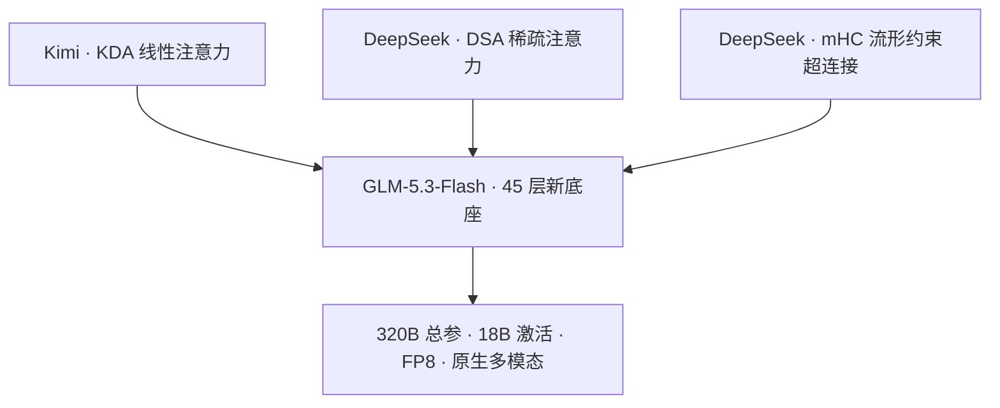
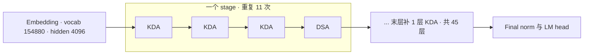

# GLM-5.3-Flash：一个把 KDA、DSA、mHC 装进同一副骨架的新底座

> **来源基线**：
> - 模型卡快照 `raw/01_theory/01_models/zhipu_glm/GLM_5_3_Flash_model_card_3f1971b7.md`，对应 [zai-org/GLM-5.3-Flash `3f1971b7`](https://huggingface.co/zai-org/GLM-5.3-Flash/tree/3f1971b7)（HF 仓库创建于 2026-08-25）。
> - 结构数值一律取自同 revision 的 `config.json` 快照 `GLM_5_3_Flash_config_3f1971b7.json`（同目录）。
> - 参数量取自 HuggingFace safetensors 索引（2026-08-27 读取）。
>
> **维度**：开放权重发布分析（模型卡 + 权重配置交叉核对）。
> **更新**：2026-08-27。

> [!note]
> 与 [[11_glm_5_1_5_2_analysis|GLM-5.1/5.2]] 一样，GLM-5.3-Flash **没有独立技术报告**，`Citation` 段引用的仍是 GLM-5 的 arXiv:2602.15763（`模型卡 :60-68`）。模型卡正文只有两段（`:25-27`），**本页的绝大部分结构结论来自 `config.json` 而非卡片**——凡属配置推出的，下文均标明字段名。

---

## 一、中央论点：GLM 第一次换底座，而新底座是三家机制的合流

模型卡把它讲成"GLM-5 系列首个原生多模态模型"，320B 总参数 / 18B 激活，价格是 GLM-5.2 的十分之一（`:25`）。但真正值得记的一句在下一段：**"starts from a newly trained base model"**（`:27`）——这不是 [[11_glm_5_1_5_2_analysis|5.1→5.2]] 那种冻结骨架的迭代，而是**换了底座**。

打开 `config.json`，这副新底座的成分表非常直白：

| 成分 | 配置证据 | 出处厂商 | 库内已有分析 |
|---|---|---|---|
| **KDA** 线性注意力 | `linear_attn_config.kda_layers`（34 层） | Moonshot（Kimi Linear） | [[12_kimi_linear_analysis]] · [[20_gdn_kda_linear_attention_analysis]] |
| **DSA** 稀疏注意力 | `layer_types` 中 11 项字面写作 `deepseek_sparse_attention` | DeepSeek | [[26_deepseek_v4_technical_deepdive]] |
| **mHC** 流形约束超连接 | `mhc: true`、`hc_mult: 4`、`hc_sinkhorn_iters: 20`、`hc_eps: 1e-06` | DeepSeek | [[25_mhc_analysis]] |

**这三项此前分别属于三家厂商的旗舰特性，现在同时出现在一个 checkpoint 里。** 模型卡只承认了其中两项——"hybrid architecture combining sparse and linear attention" 和 "adopts Manifold-Constrained Hyper-Connections (mHC)"（`:27`）——**没有提 KDA**，是配置里的 `kda_layers` 字段暴露了线性注意力的具体形态。

> [!contradiction]
> **不要把 GLM-5.3-Flash 读成 GLM-5.2 的小型化蒸馏版。** 二者的 `model_type` 就不同（`glm_moe_dsa` → `glm5_next`），层数 78→45、hidden 6144→4096、专家 256→288、注意力从纯 DSA 改为 KDA/DSA 3:1 混合、并新增 mHC 与视觉塔。模型卡也明说是"newly trained base model"。**唯一延续下来的是词表（`vocab_size` 均为 154880）与 DSA 的 `index_topk=2048`。**

---

## 二、结构：45 层，34 层 KDA + 11 层 DSA，严格 3:1

`layer_types` 数组的统计结果（本页对配置的统计，非卡片声称）：

| 观测量 | 值 |
|---|---|
| 层数 | 45 |
| `linear_attention`（KDA） | **34** |
| `deepseek_sparse_attention`（DSA） | **11** |
| DSA 层号 | 3, 7, 11, 15, 19, 23, 27, 31, 35, 39, 43 |

DSA 精确落在每 4 层的第 4 层上（层号 ≡ 3 mod 4），其余全部是 KDA——即 `3 × KDA → 1 × DSA` 重复 11 次，尾部补 1 层 KDA。`linear_attn_config` 里的 `kda_layers` 与 `full_attn_layers` 两个数组与上述划分完全一致，互为交叉验证。

### 2.1 精确超参（全部来自 `config.json`）

| 组件 | 字段 | 值 |
|---|---|---:|
| 层数 / hidden | `num_hidden_layers` / `hidden_size` | 45 / 4096 |
| KDA | `linear_attn_config.num_heads` / `head_dim` | 64 / 128 |
| KDA 短卷积 | `short_conv_kernel_size` | 4 |
| KDA 门控下界 | `gate_lower_bound` | −5.0 |
| DSA（MLA 侧） | `q_lora_rank` / `kv_lora_rank` | 1536 / 512 |
| DSA 头几何 | `qk_nope_head_dim` / `qk_rope_head_dim` / `v_head_dim` | 256 / **0** / 256 |
| DSA indexer | `index_n_heads` / `index_head_dim` / `index_topk` | 32 / 128 / 2048 |
| DSA indexer 池化 | `index_kpool` / `index_kpool_compress` | 4 / `true` |
| MoE | `n_routed_experts` / `n_shared_experts` / `num_experts_per_tok` | 288 / 1 / 8 |
| MoE 专家宽度 | `moe_intermediate_size` | 2048 |
| dense 层 | `first_k_dense_replace` | 3 |
| mHC | `hc_mult` / `hc_sinkhorn_iters` | 4 / 20 |
| MTP | `num_nextn_predict_layers` | 1 |
| 上下文 | `max_position_embeddings` | 1048576 |
| 视觉塔 | `vision_config.depth` / `hidden_size` / `patch_size` / `image_size` | 24 / 1024 / 14 / 448 |

### 2.2 一个容易漏掉的细节：注意力层里没有 RoPE

`qk_rope_head_dim = 0` 且 `mla_use_nope = true`。

- **事实**：DSA 层的 query/key 不再拆出旋转位置分量，头维全部（256）是 nope 部分。作为对照，[[11_glm_5_1_5_2_analysis|GLM-5.1/5.2]] 是 `qk_nope=192 + qk_rope=64`。
- **【推断】**：位置信息由 34 层 KDA 承担——线性注意力的短卷积（`short_conv_kernel_size=4`）与递归状态本身带有顺序性，因此混合架构里全注意力层可以完全去掉 RoPE。这是混合线性/全注意力模型里常见的取舍。
- **边界**：模型卡对此**只字未提**，没有消融、没有长度外推曲线。1M 上下文在没有 RoPE 的情况下如何保持精度，公开材料无法回答。

> [!contradiction] 另一家厂商实测后**拒绝**了这个选择
> Qwen 在 Qwen3.8-Flash-Next 技术报告里，对同样是"线性 + 全局混合"的架构测过 NoPE，结论是（§2.1.1, p4）：**RoPE 与 NoPE 变体在预训练期几乎没有差别，但 NoPE 变体在后训练之后出现明显更高的"不停止生成（endless generation）"比例**，因而更容易无法终止。Qwen 因此**在全注意力层保留了 RoPE**。
>
> 这直接影响上面那条【推断】的可信度："位置信息由线性层承担、故可去掉 RoPE"**在预训练指标上成立，但可能在后训练后失效**——而失效模式恰恰是预训练 loss 看不见的。
>
> **这不意味着 GLM 做错了**：Qwen 测的是自己的 GDN 混合与自己的后训练配方，GLM-5.3-Flash 用的是 KDA 且未公开任何相关数据。但它把"NoPE 在混合架构里是安全的"从一个看似合理的推断，降级为**一个已被至少一家厂商实测推翻的假设**。详见 [[20_qwen3_8_flash_next_architecture_deepdive]] §2.4。

### 2.3 参数量核对

| 口径 | 值 | 来源 |
|---|---:|---|
| 卡片声称总参数 | 320B | `模型卡 :25` |
| safetensors 索引实测 | **321.3B** | HF API，2026-08-27 |
| 其中 FP8（E4M3） | 314.4B | 同上 |
| 其中 BF16 | 6.9B | 同上 |
| 磁盘占用 | 305.8 GiB | 同上 |
| 卡片声称激活参数 | 18B | `模型卡 :25` |

总参数吻合。**激活参数 18B 无法从配置独立复核**——mHC 的超连接开销、视觉塔是否计入、MTP 层是否计入均未说明，本页不做反推。

权重以 FP8 发布（`quantization_config.fmt = "e4m3"`，动态激活量化），且 `modules_to_not_convert` 明确把 `hyper_connection`、`attn_mha`、`attn_mqa`、`lm_head`、`model.embed_tokens` 排除在量化之外——**mHC 的超连接矩阵保持高精度**，与 [[25_mhc_analysis]] 中双随机矩阵投影对数值敏感的分析一致。

---

## 三、mHC：与 DeepSeek-V4 的超参逐个相同

这是本页最值得单独拎出来的一条观测。

| 字段 | GLM-5.3-Flash | DeepSeek-V4-Pro-0813 |
|---|---:|---:|
| `hc_mult`（扩展率） | 4 | 4 |
| `hc_sinkhorn_iters` | 20 | 20 |
| `hc_eps` | 1e-06 | 1e-06 |

（DeepSeek 侧取自 `raw/01_theory/01_models/deepseek/DeepSeek_V4_Pro_0813_config_72e1d323.json`，详见 [[31_deepseek_v4_released_checkpoints_analysis]]。）

- **事实**：三个 mHC 超参在两家厂商的旗舰 checkpoint 上取值完全一致。mHC 原始论文来自 DeepSeek-AI（arXiv:2512.24880v2，见 [[25_mhc_analysis]]），其中扩展率 4 与 Sinkhorn 迭代 20 正是论文推荐配置。
- **【推断】**：GLM 直接采用了论文的推荐配置，未做重新搜参。
- **边界**：也可能是两家独立搜到同一组值，或都沿用了同一份参考实现。**没有任何公开材料能区分这两种可能**，本页不作断言。

无论成因如何，**这条观测本身说明 mHC 已经从"某一家的论文方法"变成了跨厂商复用的标准组件**——这是 [[25_mhc_analysis]] 成稿时还看不到的事实。

---

## 四、模型卡声称、但配置无法验证的部分

严格区分开来，避免把营销口径写成结论：

| 声称 | 出处 | 可核验性 |
|---|---|---|
| 首个原生多模态 GLM-5 系列模型 | `:25` | **部分可验**：`vision_config` 存在，24 层 ViT / patch 14 / 448px；但"原生"（联合预训练而非后接）无法从配置区分 |
| 320B 总参 / 18B 激活 | `:25` | 总参已验（321.3B）；激活参数无法复核 |
| 全面超过 GLM-5.2，价格为其 1/10 | `:25` | **不可验**：卡片内**没有基准表**，只有一张外链 PNG（`:29`）；价格是 API 定价，非模型属性 |
| 接近 Claude Opus 4.8 的编码/智能体表现 | `:25` | **不可验**：同上，无表格数据 |
| 30T token 多模态预训练语料 | `:27` | **不可验**：无数据构成、无配比、无来源说明 |
| 稀疏 + 线性混合大幅降低长上下文服务成本 | `:27` | **方向可验**（34/45 层为线性），**幅度不可验**：无吞吐/显存/TTFT 数据 |
| mHC 提升 scaling 效率 | `:27` | 配置已验其启用；**效率增益无消融** |

> [!contradiction]
> **GLM-5.3-Flash 的模型卡是本次摄入的 9 份卡片中唯一不含任何基准表格的。** 它的 `Footnotes` 段（`:41-49`）逐条列出了 HLE / NL2Repo / DeepSWE / Terminal-Bench 2.1 / AutomationBench / GDPval-AA v2 / BabyVision 等基准的评测设置，**却没有给出对应的分数**——分数只存在于外链图片 `bench_53.png` 中。因此凡是引用 GLM-5.3-Flash 具体分数的说法，都不能以本快照为依据；`Agent's Last Exam` 一条的脚注甚至是空的（`:46`）。

---

## 五、未披露边界

- 无技术报告；训练配方、优化器、数据构成、后训练方法全部未披露。
- 无任何**文本形式**的基准分数（见上方反驳栏）。
- KDA 在卡片中完全未提及，其 3:1 混合比例没有消融依据。
- 去 RoPE（`qk_rope_head_dim=0`）的动机与代价未说明。
- `index_kpool=4` 这一新增的 indexer 键池化压缩，相对 [[11_glm_5_1_5_2_analysis|5.2 的 IndexShare]] 是另一条降本路径，两者关系未说明。
- 18B 激活参数的计算口径未定义。

---

## 关联页面

- [[11_glm_5_1_5_2_analysis]] — 前一条骨架线（5.1→5.2），本页是它的**替换**而非延续。
- [[01_glm_5_analysis]] — GLM-5 论文概要与深挖入口。
- [[12_kimi_linear_analysis]] · [[20_gdn_kda_linear_attention_analysis]] — KDA 机制来源与实现深挖。
- [[25_mhc_analysis]] — mHC 原理；本页给出它被第二家厂商采用的证据。
- [[26_deepseek_v4_technical_deepdive]] — CSA/HCA/DSA/MLA 对比，理解 `deepseek_sparse_attention` 这一层类型。
- [[31_deepseek_v4_released_checkpoints_analysis]] — mHC 超参对照的另一侧。
- [[20_qwen3_8_flash_next_architecture_deepdive]] — 同为线性×稀疏混合架构，但**保留 RoPE**；含 NoPE 的实测反证。
- [[01_theory/01_models/index|模型架构与模型家族总索引]]
