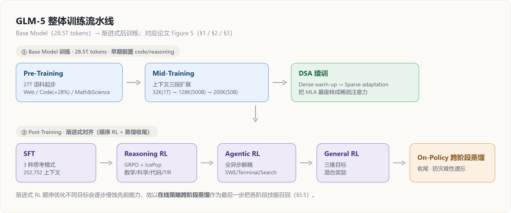
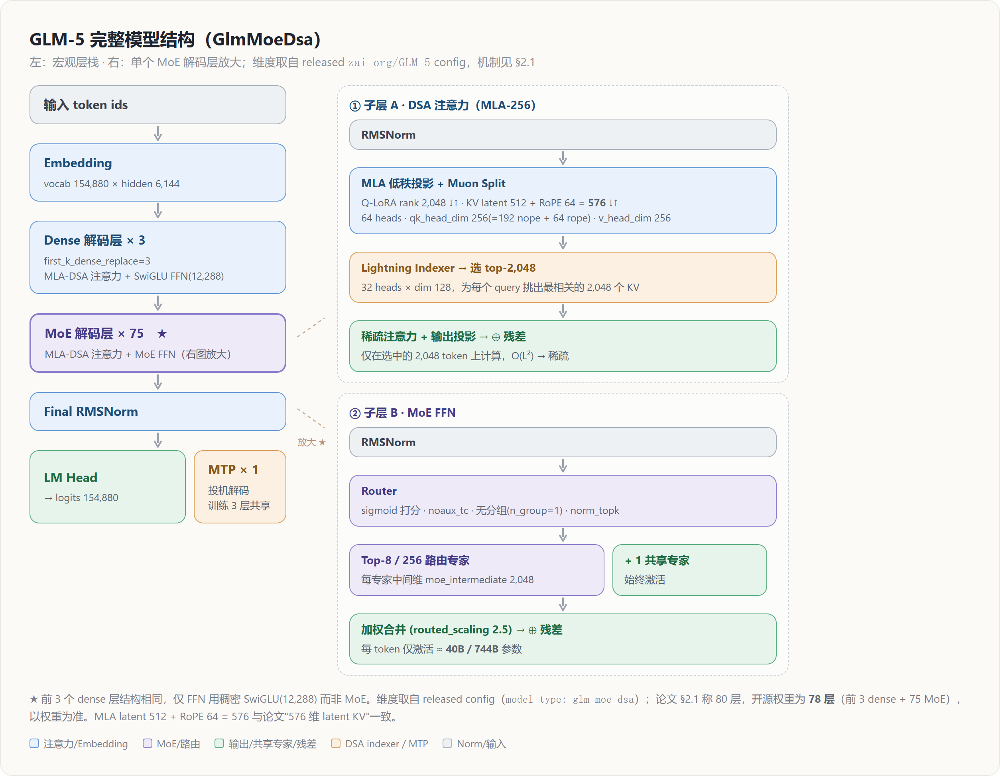
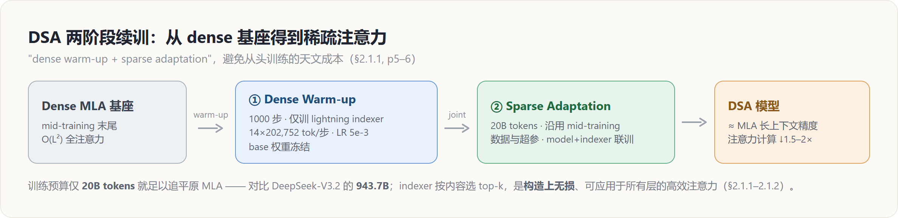

# GLM-5 架构深挖 — MLA·Muon Split·MTP·DSA 的"规模 × 长上下文成本"权衡

> **来源基线**: arXiv 2602.15763v2《GLM-5: from Vibe Coding to Agentic Engineering》(GLM-5 Team, Zhipu AI & 清华, 2026-02-24)
> **维度**: Deep Dive（机制级）
> 本页深挖论文 §2.1（pp.4–8）的架构设计：为什么是 744B/40B MoE、为什么 MLA 要配 Muon Split、为什么 MTP 要共享参数、以及为什么最终选 DSA 而非其他高效注意力。概要见 [[01_glm_5_analysis]]，数据/基础设施/后训练见同系列深挖页（见文末）。

---

## 1. 总览：一条主线——用"更省的注意力"换"更大的模型 + 更长的上下文"

GLM-5 的架构动机非常聚焦：在把模型从 355B 翻倍到 **744B** 的同时，避免长上下文把训练/推理成本拖垮。它的四个架构决策都服务于这条主线：

| 组件 | GLM-4.5 | GLM-5 | 核心目的 | 出处 |
|---|---|---|---|---|
| 规模 | 355B / 32B 激活 | **744B / 40B 激活** | 提升容量 | §2.1 p4 |
| MoE | 标准 MoE | **256 专家 / 80 层** | 减层降 EP 通信 | §2.1 p4 |
| 注意力 | MLA | **MLA + Muon Split + MLA-256** | 追平 GQA 且降解码成本 | §2.1 p4–5 |
| 投机解码 | MTP | **MTP 三层参数共享** | 提高接受率、控显存 | §2.1 p4–5 |
| 长上下文 | 全注意力 | **DSA 稀疏注意力（续训得到）** | 注意力计算 ↓1.5–2× | §2.1.1 p5–7 |

整体训练流水线（论文 Figure 5）如下，架构层面的 DSA 续训发生在 Base Model 的最后一环：

### 1.1 完整模型结构（GlmMoeDsa）

下图给出 GLM-5 的完整模型结构：左为宏观层栈，右为单个 MoE 解码层的内部放大。后文 §2–§6 逐一解释各组件的"原理/效果/为什么"；这里先把结构与**确切超参**对齐——维度取自官方权重 `zai-org/GLM-5` 的 `config.json`（`model_type: glm_moe_dsa`），与论文 §2.1 的机制描述相互印证。

| 项 | 值（released config） | 说明 / 与论文对照 |
|---|---|---|
| `hidden_size` | 6,144 | 隐藏维 |
| `num_hidden_layers` | **78** | 前 3 层 dense（`first_k_dense_replace=3`）+ 75 层 MoE |
| 注意力 | MLA-256 | 64 heads · `qk_head_dim` 256（=192 nope + 64 rope）· `v_head_dim` 256 |
| MLA 低秩 | `q_lora_rank` 2,048 / `kv_lora_rank` 512 | latent KV = 512 + 64(rope) = **576**，与论文"576 维 latent KV"（§2.1, p4）一致 |
| DSA indexer | 32 heads · dim 128 · `index_topk`=**2,048** | lightning indexer 按内容选 2,048 个 KV（§2.1.1） |
| 专家 | 256 路由 · `num_experts_per_tok`=**8** · `n_shared_experts`=**1** | `scoring_func=sigmoid`、`topk_method=noaux_tc`、无分组（`n_group=1`）、`routed_scaling_factor=2.5` |
| FFN 中间维 | dense 12,288 / MoE 2,048 | dense 层 SwiGLU；每专家 `moe_intermediate_size` 2,048 |
| MTP | `num_nextn_predict_layers`=1 | 单 MTP 模块；训练时 3 层参数共享、推理用于投机解码（§2.1, p5） |
| 词表 / 上下文 | 154,880 / 202,752 | `rope_theta`=1e6 |

> [!contradiction] 层数：论文 80 vs 开源权重 78
> 论文 §2.1（p4）称"reduces its layer count to **80**"，而开源权重 `config.json` 为 **78** 层（前 3 dense + 75 MoE）。本结构图以 released 权重为准；论文数值可能为约数或含 MTP/计数口径差异。

---

## 2. 模型尺度：为什么"扩专家、却减层"

GLM-5 扩到 **256 个专家**，但把层数**降到 80**，得到 744B 总参 / 40B 激活，总规模是 GLM-4.5（355B 总 / 32B 激活）的两倍（§2.1, p4）。

**为什么减层？** 论文明确写道减层是"to minimize expert parallelism communication overhead"（§2.1, p4）。原理：在大规模 MoE 上，专家并行（EP）的 all-to-all dispatch/combine 通信量随**层数**线性叠加；专家越多 EP 越宽、单层通信越重，此时压低层数能直接削减跨设备通信的总轮次。GLM-5 选择"宽而浅"（256 专家 × 80 层）而非"窄而深"，是一次明确的**通信-容量权衡**——把新增的参数预算更多投到专家维度（容量），而非深度（通信）。

---

## 3. 注意力主线：MLA → Muon Split → MLA-256

### 3.1 问题：Muon 优化器下，MLA 打不过 GQA-8

MLA（Multi-latent Attention）用压缩的 latent KV 向量换显存与长序列速度，理论上能匹配 GQA 而更省 KV-cache（§2.1, p4）。但 GLM-5 团队在 **Muon 优化器**下实测发现：576 维 latent KV 的 MLA **匹配不了** 8 个 query group 的 GQA-8（2048 维 KV）（§2.1, p4–5）。差距集中在 BBH/GSM8K/HumanEval 等推理任务（Table 1, p5）：

| | Hellaswag | MMLU | C-Eval | RACE | BBH | GSM8K | HumanEval |
|---|---|---|---|---|---|---|---|
| GQA-8 | 77.3 | 61.2 | 60.0 | 79.6 | **53.3** | **47.6** | **38.5** |
| MLA | 77.3 | 61.5 | 59.7 | 77.8 | 48.9 | 46.2 | 33.5 |
| **MLA + Muon Split** | 77.8 | **62.5** | **62.1** | **79.9** | 51.8 | 45.0 | 36.7 |
| MLA-256 + Muon Split | 77.4 | 62.0 | 59.9 | 79.6 | 51.3 | 47.5 | 36.6 |

### 3.2 Muon Split：按头独立正交化

**原理**：GLM-4.5 的 Muon recipe 对多头的上投影矩阵 $W^{UQ}, W^{UK}, W^{UV}$ 做**整体**矩阵正交化。Muon Split 改为把它们**按注意力头拆成小矩阵、各自独立正交化**（§2.1, p5）：

$$
W^{UQ},W^{UK},W^{UV} \;\longrightarrow\; \{W_h\}_{h=1}^{H}\;\text{（每头一块）}\;\xrightarrow{\text{逐块正交化}}\;\text{各头以不同尺度更新}
$$

**为什么有效**：整体正交化会把所有头绑定到同一更新尺度，而不同头其实需要不同的有效学习率；按头独立正交化解开了这个耦合，让每个头的投影权重以**适合自己的尺度**更新——这恰好补上了 MLA 相对 GQA 的劣势。

**效果（两个层面）**：
1. 精度上，MLA + Muon Split 追平甚至反超 GQA-8（Table 1）。
2. **稳定性红利**：论文报告，配合 Muon Split，GLM-5 的 attention logits 在整个预训练过程**保持稳定，无需任何 clipping 策略**（§2.1, p5）。这是个重要的工程收益——省掉了 logit 软上限这类常见的稳定性补丁。详见 [[25_glm5_training_stability_deepdive]] 与优化器原理 [[11_muon_analysis]]。

### 3.3 MLA-256：把"解码贵"这件事按硬件 roofline 重新设计

MLA 的另一个短板在**解码**：解码时它做 576 维点积，远高于 GQA 的 128 维（§2.1, p5）。论文一针见血地指出——DeepSeek-V3 的注意力头数是按 **H800 的 roofline** 选的，换到别的硬件并不合适（§2.1, p5）。

**MLA-256 的做法**：把 head dimension 从 192 提到 **256**，同时把注意力头数**减少 1/3**。由于训练/prefill 阶段 MLA 走的是 MHA 风格，这样改保持了**训练计算量与参数量不变**，却**降低了解码计算**（§2.1, p5）。Table 1 显示 MLA-256 + Muon Split 与 MLA 持平——即"免费"拿到解码加速。这是一个把架构超参与**部署硬件 roofline 解耦**的典型设计。

---

## 4. MTP 参数共享：用一份显存预算换更高的投机接受率

**背景矛盾**：Multi-Token Prediction（MTP）既能提升 base 模型，又能当投机解码的 draft 模型；但训练时要预测后 $n$ 个 token 就需要 $n$ 层 MTP，**MTP 参数与 KV-cache 的显存随投机步数线性增长**（§2.1, p5）。DeepSeek-V3 的折中是只训单层 MTP、推理预测后 2 个 token——代价是训练/推理不一致，**压低了第二个 token 的接受率**。

**GLM-5 的做法**：训练时**共享 3 层 MTP 的参数**（§2.1, p5）。这让 draft 模型的显存开销与 DeepSeek-V3（单 MTP 层）持平，却把更多投机步纳入训练、抬高接受率。

**效果**：在相同 4 个投机步、同一私有 prompt 集上，GLM-5 的接受长度 **2.76 > DeepSeek-V3.2 的 2.55**（Table 2, p5）。

> **为什么"共享"而非"堆叠"**：堆叠 $n$ 层让显存线性膨胀；共享让一组参数被多步复用——显存恒定，同时缩小训练-推理差异（训练就见过多步预测），从而提升接受率。本质是用"参数复用"换"训练-推理一致性"。

---

## 5. DSA：从 dense 基座续训得到、"构造上无损"的稀疏注意力（§2.1.1, p5–7）

**原理**：DSA（DeepSeek Sparse Attention）用一个 **lightning indexer** 按内容动态挑选 top-k（$k=2048$）个 token 做稀疏注意力，替代昂贵的 $O(L^2)$ 全注意力；与滑窗等**固定模式**不同，它"看内容"决定哪些 token 重要（§2.1.1, p5）。

**关键工程选择——续训而非从头训**：DSA 经由 **Continued Pre-Training** 从 dense 基座引入，避开了从头训练的"天文级"成本，遵循"dense warm-up + sparse adaptation"两阶段（§2.1.1, p5）。GLM-5 的具体配方：

- **① Dense Warm-up**：1000 步，每步 14 条 × 202,752 token，最大 LR **5e-3**（§2.1.1, p6）；按标准 DSA recipe，warm-up 阶段只训 indexer、冻结 base 权重（§2.1.2, p7）。
- **② Sparse Adaptation**：沿用 mid-training 的数据与超参，**仅 20B tokens**（§2.1.1, p6）。

**效果**：DSA 模型的长上下文性能逼近 MLA（Table 3, p5），且把长序列注意力计算**降低约 1.5–2×**，能以约一半 GPU 成本处理 128K 上下文（§2.1.1, p5）：

| 128K 基准 | MQ-NIAH | MV-NIAH | SQuAD | HotpotQA |
|---|---|---|---|---|
| MLA | 100.0 | 95.5 | 79.7 | **66.3** |
| DSA | 100.0 | **97.0** | **86.0** | 63.0 |

**为什么 20B 就够（对比 DeepSeek-V3.2 的 943.7B）**：论文给出的依据是——DeepSeek-V3.2-Exp 证明了**长上下文里约 90% 的注意力条目是冗余的**（§2.1.1, p5–6）。既然 dense 基座已学好语言/知识，indexer 只需在少量 token 上学会"挑出那 10% 重要项"，因此远小于从头训练的预算即可追平原 MLA。论文还用相同 SFT 数据微调 DSA 与 MLA，二者训练 loss 与评测打平，进一步验证无损（§2.1.1, p6；SFT loss 曲线见 Figure 6）。

---

## 6. 高效注意力消融：为什么最终是 DSA，而不是 SWA / 线性注意力（§2.1.2, p6–8）

GLM-5 团队在 GLM-9B 上系统横评了多种高效注意力，回答"为什么是 DSA"：

- **SWA Interleave**（全/窗注意力固定交替）：**灾难性**——RULER@128K 从 75.28 掉到 6.51（Table 4, p7）。
- **SWA Pattern（搜索式选层）**：受 PostNAS 启发，用 beam search（beam=8，每步定 2 层，16K 上下文上评 RULER）搜出最优 SWA 层模式 `SFSSFFSSSFFFFSSFSFFFFFFSFSFSSFSSFSFSSFSSS`（S=滑窗，F=全注意力），仅在 16K 搜一次即可泛化到各长度，显著优于固定交替（§2.1.2, p6–7）。
- **GDN / SimpleGDN**：线性注意力（gated linear recurrence）；SimpleGDN 去掉 Conv1d 与显式门控、直接复用预训练 QKV 权重，性价比最佳但仍有损（§2.1.2, p7）。

continual-train 190B token（64K 上下文、高效层:全注意力 = 1:1）后的长上下文表现（Table 5, p7，括号为相对全注意力基线的差值）：

| 方法 | RULER 64K/128K | MRCR 64K/128K | RepoQA 64K/128K |
|---|---|---|---|
| GLM-9B（全注意力） | 85.35 / 75.28 | 36.53 / 35.39 | 69.00 / 65.83 |
| SWA Interleave | 65.94 / 44.93 (↓30.4) | 30.03 / 28.83 | 50.33 / 39.33 (↓26.5) |
| SWA Pattern | 83.72 / 69.59 (↓5.7) | 35.02 / 33.58 | 62.33 / 51.17 (↓14.7) |
| GDN | 76.76 / 64.00 (↓11.3) | 31.72 / 30.22 | 65.50 / 56.17 |
| SimpleGDN | 81.76 / 67.03 (↓8.3) | 33.03 / 31.27 | 65.50 / 58.50 |

**结论与"为什么"**：上述所有方法在细粒度检索任务上都有**不可避免的精度损失**（即使一半层保留全注意力），根因是高效注意力在 continual 适配时**丢失信息**。而 **DSA 是"构造上无损"（lossless by construction）**——它的 lightning indexer 做的是 token 级稀疏、**不丢弃任何长程依赖**，因此可以应用到**所有层**而不掉点（§2.1.2, p7）。论文还在 GLM-4.7-Flash 上验证：仅 warmup（只训 indexer）就保住绝大部分性能，再经 150B token 联训后在 16K/32K/64K 反超基线、128K 仅差 0.35（Table 6, p7–8）。这就是 GLM-5 把全模型注意力都换成 DSA、而不采用 SWA/线性注意力的根本原因。

---

## Related / Cross-references

**同系列 GLM-5 深挖页**：
- [[01_glm_5_analysis]] — GLM-5 概要（总览）
- [[21_glm5_data_deepdive]] — 预训练/中训练数据与环境构造
- [[22_glm5_training_infra_deepdive]] — 训练基础设施（显存 5 件套 + 并行）
- [[23_glm5_posttraining_deepdive]] — SFT / Reasoning RL / General RL / 蒸馏
- [[24_glm5_agentic_rl_deepdive]] — slime + 全异步 RL 基础设施 + 环境扩展
- [[25_glm5_training_stability_deepdive]] — 训练稳定性主线（贯穿架构/RL）
- [[26_glm5_low_precision_chip_deepdive]] — INT4 QAT / FP8 / W4A8 / 国产芯片

**相邻主题**：
- [[11_muon_analysis]] — Muon 优化器原理（Muon Split 的基础）
- [[12_deepseek_v3_analysis]] — MLA / MTP 的来源
- [[20_deepseek_moe_analysis]] — MoE 与专家并行
- [[zhipu_glm/index]] — GLM 家族总览
