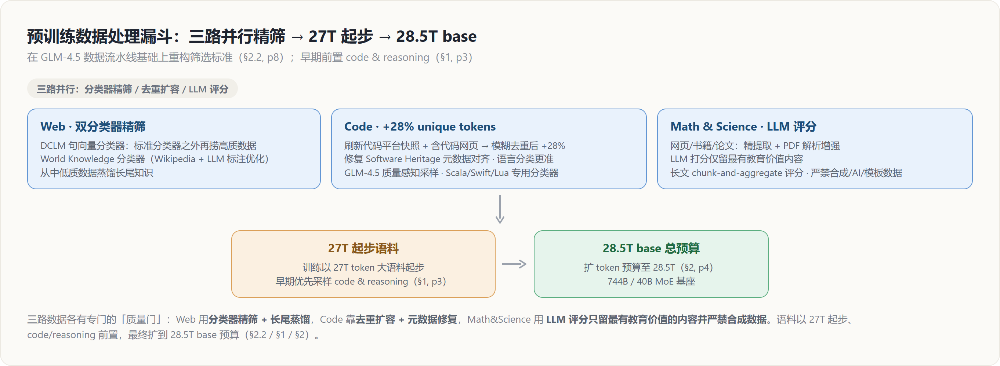

# GLM-5 数据深挖 — 预训练「质量门」筛语料 × 中训练「分段扩窗」喂长程

> **来源基线**: arXiv 2602.15763v2《GLM-5: from Vibe Coding to Agentic Engineering》(GLM-5 Team, Zhipu AI & 清华, 2026-02-24)
> **维度**: Deep Dive（机制级）
> 本页深挖论文 §2.2 预训练数据 与 §2.3 中训练（pp.8–9）：每一路数据如何用专门的「质量门」筛选、上下文窗口为什么要三段式逐步扩到 200K、以及软件工程/长上下文数据怎么构造长程依赖。概要见 [[01_glm_5_analysis]]；与之耦合的架构侧（DSA 稀疏注意力、200K 窗口）见 [[20_glm5_architecture_deepdive]]，RL 环境数据见 [[24_glm5_agentic_rl_deepdive]]。

---

## 1. 总览：先把「质量」筛干净，再把「长度」喂上去

GLM-5 的数据工程有两条相互独立又前后衔接的主线：

1. **预训练数据（§2.2）**——回答"喂什么"。在 GLM-4.5 数据流水线之上重构筛选标准，Web / Code / Math&Science 三路**各自架一道「质量门」**，把 base 语料的信噪比和知识密度顶上去（§2.2, p8）。
2. **中训练（§2.3）**——回答"怎么把上下文撑长"。在 GLM-4.5 中训练框架上同时放大训练量与最大上下文，**三段式逐步扩窗到 200K**，并专门构造软件工程数据与长上下文数据来培养长程依赖（§2.3, pp.8–9）。

两条线落在同一个 base 预算上：训练以 **27T token 的大语料起步、早期优先采样 code & reasoning**（§1, p3），最终把 token 预算扩到 **28.5T**（§2, p4）。下图是预训练侧的"数据漏斗"：

> 命名口径：本页把 §2.2 称为"预训练数据"、§2.3 称为"中训练（mid-training）"，与论文一致。中训练得到的 dense MLA 基座随后才进入 DSA 续训（见 [[20_glm5_architecture_deepdive]]），故本页的 200K 上下文是 DSA 长上下文能力的**数据前提**。

---

## 2. 预训练数据：三路各架一道「质量门」（§2.2, p8）

GLM-5 没有给三类数据用同一把"通用过滤器"，而是按数据特性各设一套筛选机制。核心洞察是：**Web 缺的是"高质 + 长尾覆盖"、Code 缺的是"干净的去重与正确的元数据"、Math&Science 缺的是"教育价值密度"**——所以三道门解决的是三个不同问题。

### 2.1 Web — 用两个分类器分别捞「高质」与「长尾」

**原理**：在标准质量分类器之外，GLM-5 叠加了两个互补的分类器（§2.2, p8）：
- **DCLM 分类器（基于句向量）**：用句子级 embedding 去识别并聚合"标准分类器之外"仍被漏掉的高质数据——即把质量信号从词面 n-gram 提升到语义层面，捞回那些写得好但不命中关键词规则的样本。
- **World Knowledge 分类器**：用 **Wikipedia 词条 + LLM 标注数据**优化训练，目标是从**中低质数据**里把有价值的长尾知识"蒸馏"出来。

**为什么需要两个**：这两个分类器对应两个正交的失败模式。DCLM 解决"高质样本被规则漏判"，World Knowledge 解决"低质来源里仍埋着稀有知识"。如果只做高质过滤，会把长尾知识连同噪声一起丢掉；World Knowledge 分类器正是为了在**不抬高整体噪声**的前提下,把长尾知识从原本要被丢弃的中低质池子里救回来（§2.2, p8）。

### 2.2 Code — 先扩量、再修脏，做到 +28% 干净唯一 token

**原理 / 效果**：Code 语料的提升是一套"扩量 + 清洗 + 精采样"组合拳（§2.2, p8）：
- **扩量**：刷新主流代码托管平台的快照，并纳入更大规模的"含代码网页"，使**模糊去重后的唯一 token 增加 28%**。
- **清洗**：修复 Software Heritage 代码文件的**元数据对齐问题**，并换用**更准确的语言分类流水线**——这两步直接降低噪声、提升语料完整性。
- **精采样**：沿用 GLM-4.5 的**质量感知采样（quality-aware sampling）**处理源码与代码相关网页；并为更广的**低资源编程语言**（如 Scala、Swift、Lua 等）训练**专用分类器**，提升这些语言的采样质量。

**为什么这么做**：代码数据的瓶颈不是"量不够"而是"脏 + 分布偏"。`+28%` 是在"模糊去重"口径下统计的——强调拿到的是**真正新增的唯一内容**而非重复膨胀。元数据对齐与语言分类是质量地基：分错语言或元数据错位会直接污染按语言采样的配比。低资源语言专用分类器则补的是**长尾语言的采样质量**短板——主流语言有充足信号，小众语言若用通用分类器极易被一刀切掉，故单独建模。这部分数据与 §2.3 的软件工程数据一起，构成了 GLM-5"Agentic Engineering"定位的语料底座。

### 2.3 Math & Science — 让 LLM 当「教育价值」评分器，并严禁合成

**原理**：数学与科学数据取自**网页、书籍、论文**，目标是增强推理能力（§2.2, p8）。其质量门有三个机制：
1. **精提取**：重构网页内容抽取流水线与书籍/论文的 **PDF 解析机制**，从源头提质。
2. **LLM 评分**：用大模型给候选文档打分，**只保留最有教育价值（most educational）的内容**。
3. **长文 chunk-and-aggregate 评分**：对长文档先分块评分、再聚合，专门提升**长文档的评分准确性**（避免长文被单一整体打分误判）。

**关键约束——严禁合成**：过滤流水线**严格避免使用合成、AI 生成或模板化数据**（§2.2, p8）。

**为什么**：数学/科学语料的价值密度高度不均——同一篇网页里可能只有几段是真正"可学"的推理材料。"教育价值"是个语义判断，规则过滤难以刻画，故交给 LLM 打分；而长文档若整体打一个分，会把局部高价值段落和大量铺垫混在一起，所以要 chunk-and-aggregate 做细粒度评分。"严禁合成"则是一条刻意的红线：推理数据一旦混入 AI 生成/模板内容，容易引入**自我循环的分布偏置与隐性错误**，污染最需要保真的推理信号——这与后训练阶段对可验证数据的偏好一脉相承（见 [[23_glm5_posttraining_deepdive]]）。

---

## 3. 中训练：三段式扩窗 + 长程依赖的数据构造（§2.3, pp.8–9）

中训练（mid-training）在 GLM-4.5 框架之上同时放大**训练量**与**最大上下文长度**，目标是同时强化推理、长上下文与 agentic 能力（§2.3, p8）。

### 3.1 三段式上下文扩展：32K → 128K → 200K

**原理 / 效果**：上下文窗口分**三个阶段渐进扩展**，每段配一个 token 预算（§2.3, p8）：

| 阶段 | 上下文长度 | token 预算 | 说明 |
|---|---|---|---|
| ① | 32K | 1T | 基础扩窗 |
| ② | 128K | 500B | GLM-4.5 的最大上下文 |
| ③ | **200K** | 50B | **超越 GLM-4.5 128K 上限** |

相比 GLM-4.5 的 128K 上限，新增的 **200K 阶段**显著提升了模型处理超长文档与复杂多文件代码库的能力（§2.3, p8）。后期阶段会按比例 **up-sample 长文档与合成 agent 轨迹**（§2.3, p8）。

**为什么是"分段 + 预算递减"**：三段的 token 预算是 1T → 500B → 50B，**越长的窗口投入越少**。原理在于扩窗的边际成本：长序列的注意力开销随长度超线性增长，且"学会用更长的窗口"主要是**适配位置外推与长程检索**、而非从头学语言——因此短窗阶段用大预算打牢底子，长窗阶段只需**少量 token 做适配**即可。后期 up-sample 长文档与合成 agent 轨迹，是因为只有长样本才能真正"撑满"扩展后的窗口、提供长程监督信号；agent 轨迹则把"长上下文"与"agentic 能力"这两个目标在数据层耦合起来。注意 200K 这一步使最大上下文**超过了 GLM-4.5 的 128K**，为后续 DSA 续训提供了长上下文数据前提（DSA 机制见 [[20_glm5_architecture_deepdive]]）。

### 3.2 软件工程数据：把 repo / commit / issue / PR 拼成统一序列

**原理**：GLM-5 沿用"把 **repo 级代码文件 + commit diff + GitHub issue + pull request + 相关源文件**拼接成统一训练序列"的范式（§2.3, p8）。在此之上做了三处调整：
- **放宽 repo 级过滤**：放宽仓库级筛选标准以扩大合格仓库池，得到**约 1000 万（10M）个 issue–PR 对**。
- **加强单 issue 级质量过滤**：在 issue 个体层面强化质量过滤以降噪。
- **检索更多相关文件**：为每个 issue–PR 对检索更大集合的相关文件，提供更丰富的开发上下文、更广地覆盖真实软件工程场景。

**效果**：过滤后，issue–PR 这部分数据约 **160B 唯一 token**（§2.3, p8）。

**为什么"放宽 repo 级、收紧 issue 级"**：这是一对刻意的反向操作。仓库级过滤太严会把大量有价值的中小仓库整体排除，故**放宽以扩召回**；但放宽后噪声上升，于是在**更细的 issue 粒度**上收紧质量门来保精度——召回与精度的取舍被拆到了两个不同的粒度上分别优化。把 issue/PR/diff/相关文件拼成**统一序列**，是为了让模型在一条样本里就看到"问题 → 改动 → 相关代码"的完整因果链，这正是 SWE-bench 这类任务所需的"从描述到实现"的推理结构（与 [[24_glm5_agentic_rl_deepdive]] 的 SWE 环境数据互补）。

### 3.3 长上下文数据：自然 + 合成，专治「中间迷失」

长上下文训练集由**自然数据**与**合成数据**两部分组成（§2.3, p9）。

**自然数据（natural）**：取自书籍、学术论文，以及通用预训练语料中的文档；经**多阶段过滤（PPL、去重、长度）**，并**up-sample 知识密集型领域**（§2.3, p9）。

**合成数据（synthetic）**：受 **NextLong** 与 **EntropyLong** 启发，用多种技术构造长程依赖（§2.3, p9）：
- **核心手法**：把**高度相似的文本**通过**交错打包（interleaved packing）**聚合成长序列，刻意制造长程依赖，从而**缓解"lost-in-the-middle"（中间迷失）现象**、提升各类长上下文任务表现。
- **200K 阶段补强**：额外加入一小部分 **MRCR-like 数据**（在 OpenAI 原范式上设计多个变体），用于**强化超长多轮对话中的召回能力**。

**关键发现——200K 阶段反向提升 128K 窗口内表现**：论文实证发现，**逐步增加数据多样性会持续提升模型的长上下文性能**；尤其值得注意的是，**在初始 128K 阶段之上再做一个 200K 中训练阶段，反过来连 128K 窗口内的表现都进一步提升了**（§2.3, p9）。

**为什么交错打包能治"中间迷失"**：朴素地把随机文档拼成长序列，序列内部往往没有真正的长程依赖——模型可以只看局部就预测下一个 token，于是"窗口很长但实际只用到附近"。把**高度相似**的文本交错打包，强行在序列首尾之间制造语义关联，模型**必须跨越长距离去检索**才能预测正确，长程注意力才被真正训练起来。MRCR-like 多变体则把这种长程检索压力延伸到**多轮对话**场景。而"200K 反提 128K"这一现象的含义很深：它说明长上下文能力**不是按窗口长度割裂的**——更长、更多样的训练分布让模型学到了更鲁棒的长程检索机制，这种能力会**回灌到更短的窗口**。这也解释了为什么 GLM-5 愿意为仅占 50B token 的 200K 阶段单独投入（性价比远超其名义 token 量）。

---

## Related / Cross-references

**同系列 GLM-5 深挖页**：
- [[01_glm_5_analysis]] — GLM-5 概要（总览）
- [[20_glm5_architecture_deepdive]] — 架构（MLA/Muon Split/MTP/DSA），本页 200K 数据是其长上下文/DSA 续训的前提
- [[22_glm5_training_infra_deepdive]] — 训练基础设施（显存 5 件套 + 并行），承接 §2.4
- [[23_glm5_posttraining_deepdive]] — SFT / Reasoning RL / General RL / 蒸馏，承接"严禁合成"的可验证数据偏好
- [[24_glm5_agentic_rl_deepdive]] — slime + 全异步 RL + 环境数据，与软件工程/agent 轨迹数据互补
- [[25_glm5_training_stability_deepdive]] — 训练稳定性主线
- [[26_glm5_low_precision_chip_deepdive]] — INT4 QAT / FP8 / W4A8 / 国产芯片

**相邻主题**：
- [[zhipu_glm/index]] — GLM 家族总览
