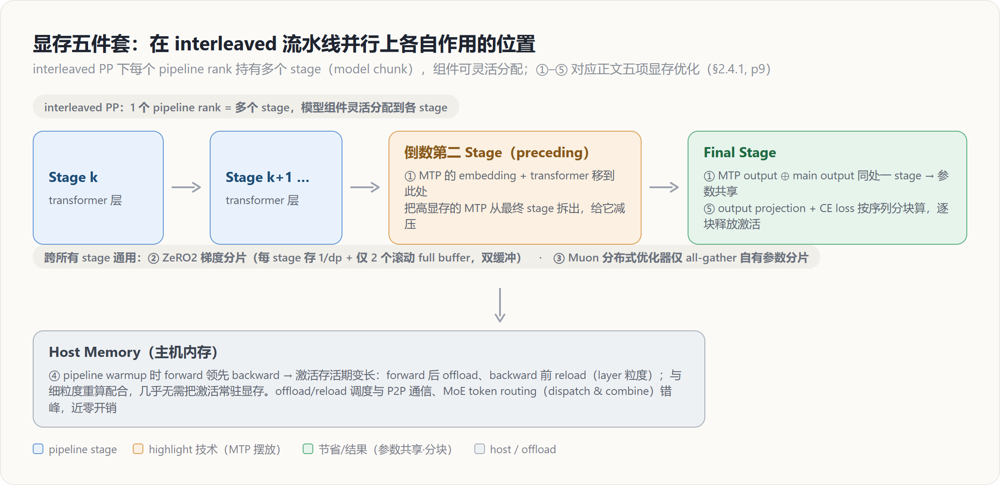
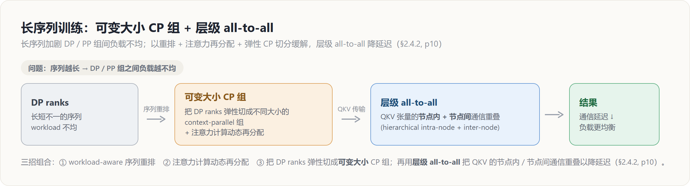
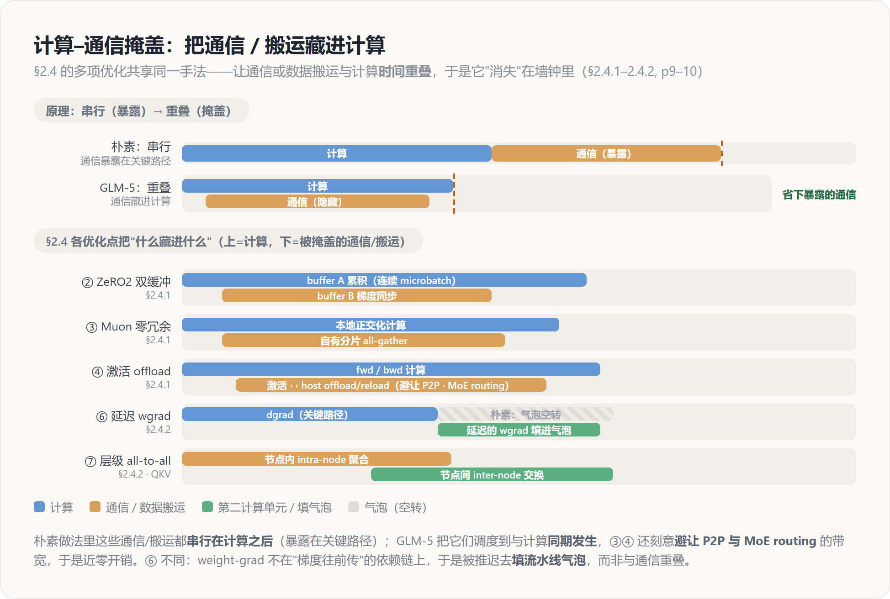

# GLM-5 训练基础设施深挖 — interleaved PP 上的「显存五件套 + 并行效率」

> **来源基线**: arXiv 2602.15763v2《GLM-5: from Vibe Coding to Agentic Engineering》(GLM-5 Team, Zhipu AI & 清华, 2026-02-24)
> **维度**: Deep Dive（机制级）
> 本页深挖论文 §2.4.1 显存效率（5 项）与 §2.4.2 并行效率（2 项）（pp.9–10）：744B/40B MoE 在 **interleaved 流水线并行**上怎么"省显存、削气泡、扛长序列"。架构主线见 [[20_glm5_architecture_deepdive]]，概要见 [[01_glm_5_analysis]]。INT4 QAT（§2.4.3）属低精度，单列于 [[26_glm5_low_precision_chip_deepdive]]。

---

## 1. 总览 — 一条主线：在 interleaved PP 上把每一处显存峰值压下去

GLM-5 的训练基础设施围绕一个现实约束：模型翻倍到 **744B 总参 / 40B 激活**（见 [[20_glm5_architecture_deepdive]]）后，必须在有限显存里把它训起来。论文 §2.4 给出两组手段——**§2.4.1 五项显存优化** + **§2.4.2 两项并行效率优化**——它们几乎全部建立在 **interleaved pipeline parallelism**（一个 pipeline rank 持有多个 stage / model chunk）这个底座上（§2.4.1, p9）。下图标出每一项作用在 PP 拓扑的什么位置：

| # | 优化项 | 针对的显存/开销来源 | 核心手段 | 出处 |
|---|---|---|---|---|
| ① | Flexible MTP placement | MTP 模块显存远高于其它模块 → stage 间不均 | output 与主 output 同放 final stage（共享参数），embed+transformer 放前一 stage | §2.4.1 p9 |
| ② | Pipeline ZeRO2 梯度分片 | 每 rank 多 stage，朴素实现每 stage 一份全梯度 buffer | 梯度跨 DP 分片（每 stage 存 1/dp）+ 仅留 2 个滚动 full buffer（双缓冲） | §2.4.1 p9 |
| ③ | Muon 优化器零冗余通信 | 朴素 Muon 每个 DP rank all-gather 全量参数 → 峰值尖刺+冗余通信 | all-gather 限于本 rank 自有分片 + 本地计算与分片通信 overlap | §2.4.1 p9 |
| ④ | Pipeline 激活 offload | warmup 阶段 fwd 领先 bwd，激活存活期长 | fwd 后 offload 到 host、bwd 前 reload（layer 粒度）+ 细粒度重算 | §2.4.1 p9 |
| ⑤ | 序列分块输出投影 | output projection + CE loss 存激活并升精度 → 瞬时峰值 | 按序列分块，逐块算 fwd/bwd 并提前释放激活 | §2.4.1 p9 |
| ⑥ | 延迟权重梯度计算 | 流水线气泡 | 把部分 weight-grad 计算从关键路径上 defer | §2.4.2 p9 |
| ⑦ | 高效长序列训练 | 长序列加剧 DP/PP 组间负载不均 | 重排 + 注意力再分配 + 可变大小 CP 组 + 层级 all-to-all | §2.4.2 p10 |

下面逐项给出 **原理 / 效果 / 为什么**。

---

## 2. 显存效率（§2.4.1, p9）

### 2.1 ① Flexible MTP placement —— 把"显存大户"拆到两个 stage

**原理**：在 interleaved pipeline parallelism 下，模型组件可以灵活地分配到各 stage（§2.4.1, p9）。问题在于 **MTP 模块横跨 embedding、transformer、output 三类组件**，它的显存占用**显著高于**其它模块，若整块压在同一 stage 上就会造成 **stage 级的显存不均**（§2.4.1, p9）。GLM-5 的做法是把 MTP 拆开摆放：

- **MTP 的 output 层**与**主模型 output 层**一起放在**最终 stage**——这样不仅同 stage，还能**共享参数**（enable parameter sharing）；
- **MTP 的 embedding + transformer** 组件放到**前一个 stage**（the preceding stage）。

**效果**：降低最终 stage 的显存压力，改善各 pipeline rank 之间的均衡（§2.4.1, p9）。

**为什么这样拆**：最终 stage 本就承载主 output（词表投影通常很大），再叠一个高显存的 MTP 就是雪上加霜。把 MTP 的 output 留在 final stage 是为了**复用主 output 的参数**（MTP 三层参数共享的设计见 [[20_glm5_architecture_deepdive]]），而把它的 embedding+transformer 推到上一 stage，则把"额外那块显存"转移到相对空闲的相邻 rank——本质是利用 interleaved PP"组件可灵活落位"的自由度，做了一次**针对 MTP 的显存再平衡**。

### 2.2 ② Pipeline ZeRO2 梯度分片 —— 每 stage 只存 1/dp，再用双缓冲压住累积

**原理**：interleaved PP 下每个 pipeline rank 持有**多个 stage**，朴素实现里**每个 stage 都要一份完整的梯度 buffer**用于累积与 optimizer 更新——多 stage × 全梯度，持久显存很重（§2.4.1, p9）。借鉴 **ZeRO2**，GLM-5 把梯度**跨数据并行（DP）ranks 分片**，使每个 stage 只持有全梯度的 **1/dp**（§2.4.1, p9）。更关键的是累积 buffer 的处理：**任意时刻只为两个 stage 保留完整的累积 buffer**，并用**双缓冲（double buffering）轮转复用**——当一个 stage 的 buffer 在连续 microbatch 上累积梯度时，**前一个 stage 的梯度同步并行进行**（§2.4.1, p9）。

**效果**：把持久梯度显存压到"每 stage 的分片 buffer + 仅 2 个用于滚动累积的 full buffer"，且**实测无额外同步开销**（without additional synchronization overhead in practice）（§2.4.1, p9）。

**为什么不会增加同步开销**：朴素思路下"先累积完再同步"会让通信串行在关键路径上；双缓冲把"buffer A 累积"与"buffer B 同步"在时间上**重叠**，于是梯度 all-reduce 的通信被藏在下一个 stage 的累积计算背后——既省下了"每 stage 一份 full buffer"的显存，又没把通信暴露出来。这与 Megatron 分布式优化器里"梯度 reduce-scatter 与反向计算 overlap"的思路同源，详见 [[14_megatron_ep_analysis]]。

### 2.3 ③ Muon 分布式优化器的零冗余通信 —— all-gather 只取自己那一份

**原理**：朴素的 Muon 实现会在**每个 DP rank 上 all-gather 全量模型参数**，带来两个问题——**瞬时显存尖刺**与**冗余通信**（§2.4.1, p9）。GLM-5 的改法是把 all-gather **限制到每个 rank 自己拥有的参数分片**，并让**本地计算与分片通信 overlap**（§2.4.1, p9）。

**效果**：消除冗余通信，并**显著降低 optimizer 相关的峰值显存**（§2.4.1, p9）。

**为什么 Muon 特别需要这件事**：Muon 的更新要对权重矩阵做正交化（Newton–Schulz 迭代），是**矩阵级**而非逐元素操作，因此朴素分布式实现倾向于"先把整块参数 all-gather 回来再算"，这正是峰值尖刺与冗余通信的根源。把 all-gather 收缩到自有分片、并用 overlap 把通信藏进本地计算，就把 Muon 的分布式代价压到与普通 ZeRO 优化器相当。Muon / Muon Split 的优化器原理见 [[11_muon_analysis]]，它在 GLM-5 架构里的作用见 [[20_glm5_architecture_deepdive]]。

### 2.4 ④ Pipeline 激活 offload —— 把 warmup 期的长寿命激活搬到 host

**原理**：在 pipeline **warmup** 阶段，forward 执行**领先于** backpropagation，导致中间**激活的存活期被拉长**（§2.4.1, p9）。GLM-5 在 **forward 之后把激活 offload 到 host memory，在 backward 之前再 reload** 回来；offload 以 **layer 粒度**进行以进一步压低峰值，并**与细粒度重算（fine-grained recomputation）配合**，从而几乎不需要把激活常驻 GPU 显存（§2.4.1, p9）。调度上，offload/reload 被安排**与计算 overlap**，同时**避免与 P2P 通信、MoE token routing（dispatch 与 combine）争抢带宽**（§2.4.1, p9）。

**效果**：大幅降低激活显存占用，且**近零开销**（near-zero overhead）（§2.4.1, p9）。

**为什么要"避让" P2P 与 MoE routing**：PCIe/NVLink 带宽是共享资源。pipeline 的 P2P send/recv 与 MoE 的 all-to-all（dispatch/combine，见 [[14_megatron_ep_analysis]]）本身就吃带宽，如果激活 offload/reload 与它们撞车，反而会拖慢关键路径。GLM-5 把搬运调度到这些通信的空档里，才换来"近零开销"——这是 offload 能不能落地的关键工程细节，而非简单地"放到 host 就行"。offload + 细粒度重算是互补的两种省激活手段：重算用算力换显存、offload 用带宽换显存，组合起来覆盖不同层。

### 2.5 ⑤ 序列分块输出投影 —— 用分块把输出层的瞬时峰值摊平

**原理**：output projection 与 cross-entropy loss 会带来**瞬时显存开销**，原因有二——要**为反向保存激活**，且在算 loss 时会把它们**升到更高精度**（promoting to higher precision）（§2.4.1, p9）。GLM-5 把**输入序列切成更小的 chunk**，**逐 chunk 独立**算投影与 loss，**在进入下一块前就完成该块的 fwd/bwd 并释放其激活**（§2.4.1, p9）。

**效果**：**峰值显存随 chunk 数增加而下降**；在合适的 chunk 数下，缓解输出层显存压力，同时性能与不分块执行相当（§2.4.1, p9）。

**为什么有效**：词表投影后的 logits 张量是 `[seq, vocab]` 量级，vocab 极大时它本身就是显存大户，再加上升精度（如转 fp32 算 loss）几乎翻倍。不分块时整条序列的 logits 同时在显存里达到峰值；分块后任一时刻只有 `1/chunk` 条序列的 logits 存活、算完即释放，于是峰值近似按 chunk 数缩小——这是一种典型的"用串行换峰值"的显存-时间权衡，且因为各 chunk 在数学上独立，精度无损。这与 [[20_glm5_architecture_deepdive]] 里 MLA-256、MTP 共享等"在不掉精度的前提下抠成本"的思路一脉相承。

---

## 3. 并行效率（§2.4.2, pp.9–10）

### 3.1 ⑥ 高效延迟权重梯度计算 —— 把 weight-grad 移出关键路径来削气泡

**原理**：为减少**流水线气泡（pipeline bubbles）**，GLM-5 把一部分**权重梯度（weight gradient）的计算从关键路径上 defer（延迟）**出去（§2.4.2, p9）。具体是**细粒度的延迟**，配合**优化过的存储与通信 overlap**，在保持显存开销有界的前提下提升吞吐（§2.4.2, p9）。

**效果**：吞吐提升，同时显存开销被控制在有界范围（§2.4.2, p9）。

**为什么能削气泡**：反向传播里每层有两类计算——**激活梯度（dgrad，决定能否继续往前传）**与**权重梯度（wgrad，只用于最后更新参数）**。wgrad 不在"把梯度往上一层传"的依赖链上，因此可以从关键路径剥离、推迟到流水线的空闲气泡里再算，从而把原本闲置的 bubble 时间利用起来。代价是被 defer 的 wgrad 需要暂存其输入，所以论文强调"优化过的存储 + 通信 overlap"和"显存有界"——即在削气泡与省显存之间取平衡。这类"wgrad 与 dgrad 解耦调度"的思想在 Megatron 系流水线里也有对应实现，参见 [[14_megatron_ep_analysis]]。

### 3.2 ⑦ 高效长序列训练 —— 可变大小 CP 组 + 层级 all-to-all

**原理**：序列越长，**DP 与 PP 组之间的负载不均（load imbalance）越严重**（§2.4.2, p10）。GLM-5 用三招组合来治：

1. **Workload-aware sequence reordering**：按工作量感知地**重排序列**；
2. **Dynamic redistribution of attention computation**：**动态再分配注意力计算**；
3. **Flexible partitioning of DP ranks into context-parallel groups of varying sizes**：把 DP ranks **弹性切分成"大小可变"的 context-parallel（CP）组**。

在通信层面，再用一个**层级 all-to-all（hierarchical all-to-all）**把 **QKV 张量的节点内（intra-node）与节点间（inter-node）通信 overlap**，以降低延迟（§2.4.2, p10）。

**效果**：缓解长序列下 DP/PP 组间的负载不均，并降低 QKV 通信延迟（§2.4.2, p10）。

**为什么需要"可变大小"的 CP 组**：长序列训练里，不同样本的有效长度天差地别，若用**固定大小**的 CP 组切分，短序列那一组会闲置、长序列那一组成为瓶颈——这就是 DP/PP 组间不均的来源。允许 CP 组**大小可变**，就能把"长序列分给更多 rank、短序列用更少 rank"，让每个 rank 的注意力计算量趋于一致；再叠加 workload-aware 重排与注意力再分配，把不均从源头摊平。而 CP 切分必然要在组内 all-to-all 交换 QKV，**层级 all-to-all** 把"先在节点内聚合、再跨节点交换"两层通信重叠起来，避免跨节点带宽成为新瓶颈——这与 MoE EP 里层级 all-to-all 的优化动机一致（见 [[14_megatron_ep_analysis]]）。

### 3.3 一图回顾：把 §2.4 的掩盖点放到一条时间线上

§2.4 的多项优化（②③④⑥⑦）共享同一手法——让通信或数据搬运与计算**时间重叠**，从而藏进墙钟。下图把它们并到一条时间线上，对比"串行（暴露）"与"重叠（掩盖）"：

> ⑥ 是特例：weight-grad 不在依赖链上，被推迟去**填流水线气泡**，而非与通信重叠。

---

## 4. 边界：INT4 QAT 不在本页（§2.4.3, p10）

§2.4.3 的 **INT4 量化感知训练（QAT）**虽同属 §2.4 训练基础设施，但属于**低精度**主题：它在 **SFT 阶段**施加 INT4 QAT，并自研了一个**训练/离线权重量化通用的量化 kernel**，确保**训练与推理 bitwise 一致**（§2.4.3, p10）。该项与 FP8 / W4A8 / 国产芯片适配一并深挖于 [[26_glm5_low_precision_chip_deepdive]]，本页不展开。

---

## Related / Cross-references

**同系列 GLM-5 深挖页**：
- [[01_glm_5_analysis]] — GLM-5 概要（总览）
- [[20_glm5_architecture_deepdive]] — 架构主线（MLA·Muon Split·MTP·DSA），本页的显存优化即服务于该架构
- [[21_glm5_data_deepdive]] — 预训练/中训练数据与长上下文数据构造
- [[23_glm5_posttraining_deepdive]] — SFT / Reasoning RL / General RL / 蒸馏
- [[24_glm5_agentic_rl_deepdive]] — slime + 全异步 RL 基础设施
- [[25_glm5_training_stability_deepdive]] — 训练稳定性主线
- [[26_glm5_low_precision_chip_deepdive]] — INT4 QAT / FP8 / W4A8 / 国产芯片（§2.4.3 归属此页）

**相邻主题**：
- [[11_muon_analysis]] — Muon 优化器原理（②③ 中 Muon 分布式优化器的基础）
- [[14_megatron_ep_analysis]] — 流水线并行 / 专家并行（梯度 overlap、wgrad 解耦、层级 all-to-all 的同源实现）
- [[zhipu_glm/index]] — GLM 家族总览
