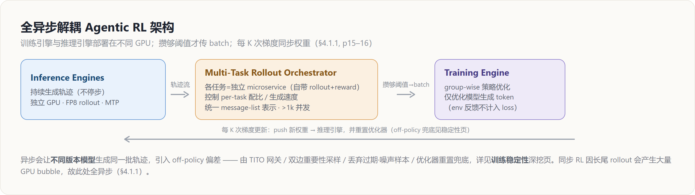
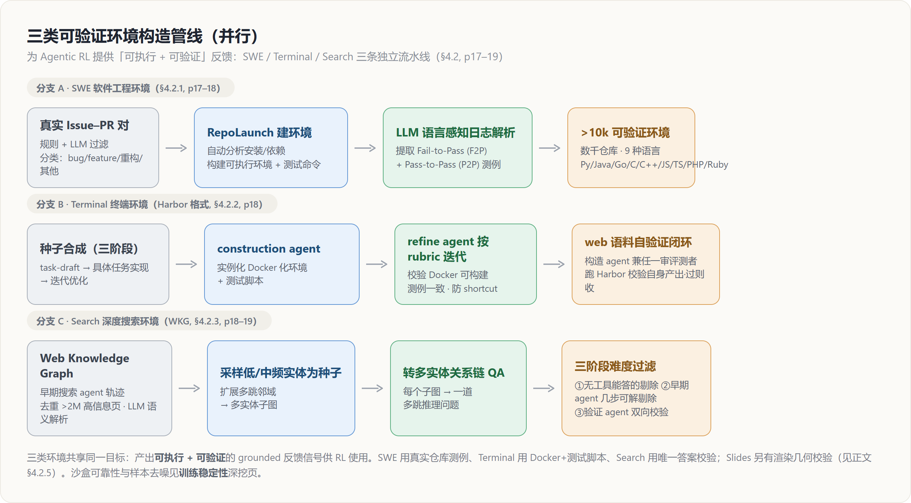

# GLM-5 Agentic RL 基础设施深挖 — slime · 全异步解耦 · 环境扩展的「长尾延迟 × 任务异构」工程

> **来源基线**: arXiv 2602.15763v2《GLM-5: from Vibe Coding to Agentic Engineering》(GLM-5 Team, Zhipu AI & 清华, 2026-02-24)
> **维度**: Deep Dive（机制级）
> 本页深挖论文 §3.6（slime RL 基础设施, pp.13–15）、§4.1（全异步解耦 RL + Multi-Task Rollout Orchestrator + DP-aware routing, pp.15–17）、§4.2（可验证环境扩展：SWE/Terminal/Search/Slides, pp.17–20）。**异步 RL 的稳定性机制**（TITO 网关、双边重要性采样、丢弃 off-policy/噪声样本、优化器重置、心跳容错）只在本页一句带过并指向 [[glm5_training_stability_deepdive]]，不在此深挖。概要见 [[glm_5_analysis]]，算法侧（GRPO/IcePop/蒸馏）见 [[glm5_posttraining_deepdive]]。

---

## 1. 主线：从「vibe coding」到「agentic engineering」，基础设施要解决的是长尾

GLM-5 把场景从「人提示模型写代码」（vibe coding）推进到「AI agent 自己规划、实现、迭代」（agentic engineering）（§4, p15）。这条路线对 RL 基础设施提出一个不同于以往的核心矛盾：**agentic rollout 是长尾的**——多轮交互、工具调用、超长上下文使得各样本的生成时间严重不均衡，少数 straggler 就能拖死整步（§3.6.2 / §4.1.1）。

GLM-5 的工程答卷由三块组成，本页逐块深挖：

| 层 | 组件 | 解决的问题 | 出处 |
|---|---|---|---|
| 基础设施底座 | **slime** 统一后训练框架 | 任务覆盖 / 吞吐 / 鲁棒性 | §3.6, p14 |
| 调度与执行 | **全异步解耦 + Multi-Task Rollout Orchestrator** | 长尾 rollout 造成的 GPU 空转 | §4.1.1, p15–16 |
| 推理路由 | **DP-aware routing** | 大 MoE 长上下文推理的 KV-cache 局部性 | §4.1.2, p17 |
| 数据供给 | **可验证环境扩展**（SWE/Terminal/Search/Slides） | RL 需要可执行、可验证的反馈 | §4.2, p17–20 |

---

## 2. slime：统一后训练基础设施（§3.6, p14）

**原理**：GLM-5 继续以 **slime** 作为统一的后训练基础设施做端到端、规模化的 RL；关键在于它**不新增系统组件**，而是充分复用 slime 已有能力，从三个杠杆发力（§3.6, p14）：

1. **拓宽任务覆盖**——靠 free-form rollout 定制 + server-based 执行模型；
2. **提升吞吐**——靠混合精度训练/rollout + MTP + Prefill–Decode（PD）解耦，尤其针对多轮 RL；
3. **增强鲁棒性**——靠心跳驱动的 rollout 容错 + router 级服务生命周期管理。

### 2.1 高度可定制的 rollout（Scaling Out, §3.6.1, p14）

**原理**：slime 提供一个灵活接口来实现**任务特定的 rollout 逻辑**——多轮交互循环、工具调用、环境反馈处理、verifier 引导的分支——而**无需改动底层基础设施**（§3.6.1, p14）。

**效果**：GLM-5 用同一套训练栈承载 reasoning RL、general RL、agentic RL、on-policy 蒸馏等差异极大的范式，**不需要为每类任务 fork** 专用代码（§3.6.1, p14）。

**为什么**：后训练目标谱系太宽，如果每个目标都改基础设施会让系统不可维护；把「可变的 rollout 逻辑」抽成接口、把「不变的优化后端」固定下来，是用**接口隔离**换可扩展性。

### 2.2 server-based rollout（HTTP API 解耦, §3.6.1, p14）

**原理**：slime 把 rollout 服务器与 inference router 暴露成**标准 HTTP API**，用法等同一个常规推理引擎；这把 rollout 逻辑与训练进程边界**解耦**——外部 agent 框架与环境可直接调用 server/router 端点，而优化后端对单轮短程与多轮长程训练保持不变（§3.6.1, p14）。

**为什么**：agentic 任务往往依附在外部 agent framework（带自己的工具与控制流）里。把 serving 层做成 HTTP 服务，外部框架像调推理 API 一样接入，训练-推理边界因此与具体 agent 实现无关——这正是「多框架、多任务」可插拔的前提，也是 §4.1.1 Orchestrator 的工程基础。

### 2.3 鲁棒性：心跳容错 + router 级生命周期（§3.6.3, p15）

slime 的 robustness 杠杆是**心跳驱动容错**：rollout 服务器周期性发心跳，编排层监控、主动终止不健康节点并从 router 注销，重试自动绕开故障/降级节点（§3.6.3, p15）。该机制属于稳定性主线，本页一句带过，机制细节见 **[[glm5_training_stability_deepdive]]**。

---

## 3. 尾延迟优化：为什么优化目标是「最慢的那条」（§3.6.2, p14–15）

**原理（先把目标摆正）**：对 RL rollout 而言，优化目标**不是聚合吞吐，而是端到端延迟，并由每步里最慢的（长尾）样本主导**（§3.6.2, p14）。实践中一条掉队轨迹就能卡死同步点（batch 完成、buffer 就绪、trainer 更新），直接决定 wall-clock 进度。因此 GLM-5 复用 slime 的延迟导向服务/调度，既压中位延迟、更重要的是压**尾延迟**（§3.6.2, p14）。围绕这一目标有三个机制：

### 3.1 No-queue serving：多节点推理 + MLA 的 DP-attention

**原理**：要避免排队延迟，即便突发流量也要即时服务，这需要充足 KV-cache 容量。GLM-5 用**多节点推理部署**（如 8 节点上 **EP64 + DP64**）来提供分布式 KV-cache；**DP-attention 的主要作用是避免在不同 rank 间复制 KV**（§3.6.2, p14）。

**为什么**：MLA 的 latent KV 若要跨 rank 共享会引入复制开销；DP-attention 让每个 DP rank 各自持有自己的 KV，从而把「KV 容量」用扩节点的方式做大、又不付跨 rank 拷贝的代价——这是「无排队」的容量前提。

### 3.2 FP8 rollout + MTP：专打小批解码的长尾

**原理**：GLM-5 用 **FP8 做 rollout 推理**降低 per-token 延迟、缩短长轨迹完成时间；并用 slime 对 **MTP（Multi-Token Prediction）**的支持——MTP 在 RL rollout 典型的**小批解码**场景下尤其有效（§3.6.2, p14–15）。

**效果 / 为什么**：尾延迟常由 small-BS straggler 驱动（罕见长上下文、复杂多轮推理、重工具调用的轨迹）；MTP 一次解码多 token，对这些**长尾样本的收益不成比例地大**，直接缩短最慢样本的完成时间、减少步级 stall（§3.6.2, p15）。FP8 rollout 的精度-性能权衡与 PD 解耦的低精度细节见 **[[glm5_low_precision_chip_deepdive]]**；MTP 架构（三层参数共享）见 [[glm5_architecture_deepdive]]。

### 3.3 PD 解耦：让重 prefill 不抢占进行中的 decode

**原理**：多轮设定里长前缀 prefill 很频繁（对话历史、工具轨迹、代码上下文）。在 DP-attention 下若把 prefill 与 decode 混在同一服务资源上，一个重 prefill 会**抢占或打断进行中的 decode**，让其他样本无法持续推进、尾延迟急剧恶化。GLM-5 因此用 slime 的 **Prefill–Decode（PD）解耦**：prefill 与 decode 跑在各自专属资源上，decode 稳定不被打断，长程样本可持续推进，显著改善多轮 agentic RL 的尾部表现（§3.6.2, p15）。

> 三机制的共同逻辑：**把「最慢样本的完成时间」当成第一优化量**。No-queue 解决「排不上队」，FP8+MTP 解决「单条太慢」，PD 解耦解决「被别人插队打断」——分别对应排队、服务时长、干扰三类尾延迟来源。

---

## 4. 全异步解耦 RL（§4.1.1, p15–16）

### 4.1 问题：同步 RL 在长尾 rollout 下产生大量 bubble

**原理**：由于 rollout 过程的长尾本质 + agentic 任务生成严重不均衡，朴素的**同步** RL 在 rollout 阶段会产生大量 bubble，造成巨大 GPU 空转（§4.1.1, p15）。

### 4.2 做法：训练/推理引擎解耦 + 阈值攒批 + 周期性权重同步

**原理**（对照图 1）：GLM-5 采用**完全异步**范式（§4.1.1, p15–16）：

- **解耦**：训练引擎与推理引擎部署在**不同 GPU 设备**上；推理引擎**持续不停地生成轨迹**（§4.1.1, p15）。
- **阈值攒批**：一旦已生成轨迹数达到**预设阈值**，就把该 batch 送给训练引擎更新模型（§4.1.1, p16）。
- **周期性权重同步**：为压低 policy lag、保持「近似 on-policy」，rollout 引擎用的权重**周期性**与训练引擎同步——训练引擎每 **K 次梯度更新**就把新权重 push 回推理引擎（§4.1.1, p16）。

**目标函数（group-wise 策略优化）**：对每个问题 $x$，从旧策略 $\pi_{\text{old}}$ 采 $K$ 条 agent 轨迹 $\{y_1,\dots,y_K\}$，优化（§4.1, p15）：

$$\mathcal{L}(\theta)=\mathbb{E}_{x\sim D}\!\left[\frac{1}{K}\sum_{i=1}^{K}\big(r(x,y_i)-\bar r(x)\big)\right],\qquad \bar r(x)=\frac{1}{K}\sum_{i=1}^{K} r(x,y_i)$$

优势 = 奖励减去 group 均值 $\bar r(x)$；**只有模型生成的 token 计入优化，环境反馈在 loss 中被忽略**（§4.1, p15）。

**off-policy 兜底（一句带过）**：异步意味着同一批轨迹可能由**不同版本模型**生成，带来严重 off-policy 问题；GLM-5 因此在每次推理引擎权重更新后**重置优化器**，并配套 TITO 网关 / 双边重要性采样 / 丢弃过期·噪声样本等机制——这些**稳定性机制本页不展开**，详见 **[[glm5_training_stability_deepdive]]**（§4.1.1–4.1.2, p16–17）。

**为什么解耦+异步**：长尾 rollout 下「同步等齐」=「按最慢样本计费」；把推理与训练放到不同设备并让推理不停产轨迹、训练攒够就更新，就把 GPU 空转换成了持续利用。代价是 off-policy 偏差——用「周期性同步 + 优化器重置 + 重要性采样」把这层代价限制在可控范围。与 verl 等异步 RL 框架的对照见 [[verl/index]]、[[rl_infra_efficiency_analysis]]。

### 4.3 Multi-Task Rollout Orchestrator：把任务异构隔离在训练环之外（§4.1.1, p16）

**原理**：多任务 RL 里不同任务依赖不同工具集与任务特定 rollout 逻辑（异构）。GLM-5 引入**server-based 的 Multi-Task Rollout Orchestrator**：一个中央 orchestrator + 多个注册的任务服务（§4.1.1, p16）。具体：

- **每个任务把自己的 rollout 与 reward 逻辑实现为一个独立 microservice**，注册到中央 orchestrator 供管理与调度；
- rollout 阶段，orchestrator **控制 per-task 的 rollout 配比与生成速度**，实现跨任务的**均衡数据采集**；
- **关键**：把所有 agentic 任务的轨迹**标准化成统一的 message-list 表示**，从而既能联训复杂 agent 框架（如 SWE 任务），又支持对异构 workload 的集中后处理与日志；
- 作为 GLM-5 训练基础设施的主干，它**支持 >1k 并发 rollout**，并支持**任务采样比的自动动态调整**与任务进度的细粒度监控（§4.1.1, p16）。

**效果 / 为什么**：这一设计把「任务特定逻辑」干净地从核心训练循环里隔离出来——训练环只见统一 message-list，不感知某个任务用了什么工具/控制流。于是新增一类 agentic 任务 = 注册一个 microservice，而非改训练代码；orchestrator 对配比与速度的控制又防止某个慢任务（如 SWE 长轨迹）饿死其他任务的数据采集。这是 §3.6.1「server-based + 可定制 rollout」在多任务场景的落地。

---

## 5. DP-aware routing：在 DP 下保住 KV-cache 局部性（§4.1.2, p17）

**原理**：GLM-5 提出 **DP-aware routing**，在数据并行（DP）下为大规模 MoE 推理**保住 KV-cache 局部性**。机制链条如下（§4.1.2, p17）：

1. **观察**：多轮 agentic workload 里，**来自同一 rollout 的连续请求共享同一前缀**；
2. **rollout 级亲和性**：强制把属于同一 agent 实例的所有请求路由到**同一 DP rank**；
3. **实现**：引入一个**有状态路由层**，用**一致性哈希（consistent hashing）**把每个 rollout ID 映射到固定 DP rank；该映射**跨轮稳定**，消除跨 rank 的 cache miss；
4. **防失衡**：在哈希空间上叠加**轻量动态负载再平衡**，避免长期倾斜。

**效果**：该设计在**不需要跨 DP rank 同步 KV** 的前提下避免了冗余 prefill 计算；随 rollout 变长，**prefill 成本与增量 token 成正比、而非与总上下文长度成正比**，从而改善端到端延迟、提升长上下文 agentic 推理的有效吞吐（§4.1.2, p17）。

**为什么**：多轮 agent 一次次回到同一前缀，如果路由不固定就会在新 rank 上重算整段前缀 prefill（O(总上下文)）。把 rollout ID 钉死到一个 rank 上、复用它本地的 KV，prefill 就只为「这一轮新增的 token」付费（O(增量)）。这是用「路由亲和」换「前缀计算复用」，且避免了跨 rank 拷 KV——和 §3.6.2 DP-attention「不跨 rank 复制 KV」是同一思想的路由层版本。

---

## 6. 环境扩展：给 RL 喂「可执行 + 可验证」的反馈（§4.2, p17–20）

**原理**：为支撑多样 agentic 任务的 RL，GLM-5 构造**可验证、可执行**的环境，为 code-centric 与内容生成 workflow 提供 grounded 反馈（§4.2, p17）。下分四类。

### 6.1 SWE 软件工程环境（§4.2.1, p17–18）

**做法**：先收集大规模真实 **Issue–Pull Request 对**，用规则 + LLM 双重过滤得到真实高质量 issue；按任务类型分类——**bug 修复 / 功能实现 / 重构 / 其他**——并附带任务要求，保证模型实现与 test patch 一致（§4.2.1, p17–18）。环境搭建走基于 **RepoLaunch** 的 pipeline：自动分析仓库的安装与依赖、构建可执行环境、生成测试命令，再用 **LLM 生成语言感知的日志解析函数**从测试输出里**提取 Fail-to-Pass（F2P）与 Pass-to-Pass（P2P）测例**（§4.2.1, p18）。

**效果**：构造出 **>10k 个可验证环境**，覆盖数千仓库、**9 种编程语言**（Python / Java / Go / C / C++ / JavaScript / TypeScript / PHP / Ruby）（§4.2.1, p18）。

**为什么**：F2P/P2P 把「补丁是否真的修好」变成可机器判定的二值信号——F2P 验证 issue 被解决、P2P 验证没引入回归。这正是 RL 需要的可验证 reward。

### 6.2 Terminal 终端环境（Harbor 格式, §4.2.2, p18）

GLM-5 用两条互补 pipeline 在规模上造终端 agent 环境，均产出 **Harbor 格式**（结构化任务描述 + Docker 化执行环境 + 测试脚本）：

- **(a) 种子合成**：三阶段——**task-draft 生成 / 具体任务实现 / 迭代任务优化**。从真实 SWE 与终端 computer-use 场景采的种子任务出发，用 LLM 头脑风暴出大量可验证终端任务草稿；由 **construction agent** 实例化成 Harbor 格式的具体任务（含 Docker 环境与测试脚本）；再由 **refine agent** 按人工定义的 rubric 反复检查、迭代，保证 Docker 镜像可可靠构建、测例与任务一致、环境不被 shortcut 钻空子。整条 pipeline 的 **Docker 构建准确率 >90%**（§4.2.2, p18）。
- **(b) web 语料自验证闭环**：一个**闭环**设计——**构造 agent 同时兼任自己产出的「一审评测者」**。先收集代码相关网页、用质量分类器过滤、分层采样保证多样性；再给一个 coding agent 喂 Harbor 任务构造规范 + 某个源网页，要求它 (i) 基于网页内容**合成完整终端任务**，(ii) **对自己的产出跑 Harbor 校验脚本**；校验失败就自行诊断修订、迭代直到通过——**只有通过这层自验证闭环的任务才进入最终数据集**（§4.2.2, p18）。

**为什么**：让构造者同时是首轮评测者，把「任务可不可验证」前移到了构造阶段——不通过校验的任务根本进不来，从源头压低了不可验证/有漏洞环境的比例。沙盒稳定性与噪声样本的剔除属于稳定性主线，见 **[[glm5_training_stability_deepdive]]**、[[rl_sandbox_design_analysis]]。

### 6.3 Search 深度搜索环境（WKG, §4.2.3, p18–19）

**做法（WKG 构造 + 出题）**：从早期搜索 agent 的轨迹出发，收集并去重所有访问过的 URL，保留 **>200 万**高信息网页；LLM 做**语义解析**（实体识别、噪声过滤、结构化抽取）建成 **Web Knowledge Graph（WKG）**；WKG 随新页持续更新、并用下游验证信号（实体对齐、属性归一、关系合并、语义一致性纠正）精炼。出题时**采样低-到-中频实体作为种子节点**、扩展其**多跳邻域**成子图（控制扩展以减重叠），用面向高难、多领域推理的 prompt 把**每个子图转成一道隐含多实体关系链的问题**（§4.2.3, p18–19）。

**三阶段难度过滤与验证**（§4.2.3, p19）：
1. 剔除「**无工具 reasoning 模型** 8 次独立尝试里至少答对 1 次」的问题（太易）；
2. 滤掉「早期 agent 用基础 search/browse/compute **几步就能解**」的问题；
3. 用**验证 agent 做双向校验**：从 stage 2 轨迹收候选答案，对候选与标注 ground truth 独立验证问答一致性，**拒绝非唯一答案 / 证据不一致 / 标签错误**的样本——得到高质量、高难度、可靠的多跳 QA。

**为什么**：搜索任务的难点在于既要够难（值得用 RL 训）又要答案唯一可判。前两阶段卡难度下界、第三阶段卡答案可验证性，三者叠加才能把「能查到、但不好查、且答案确定」的题留下来。

### 6.4 推理期上下文管理（专为搜索, §4.2.4, p19）

**原理**：BrowseComp 评测**对 judge 极敏感**，开源 judge 会引入系统性偏差；GLM-5 因此把所有 judge 组件**统一到 OpenAI 官方评测 prompt + 专有 o3-mini 作 judge**，与人工标注对齐最好（§4.2.4, p19）。在此基础上做上下文管理：

- **Keep-recent-k**：把比「最近 k 轮」更早的**工具观测（observation）折叠**省 token。设 $k=5$，把 GLM-5 从 **55.3% 提升到 62.0%**（§4.2.4, p19）。
- **Hierarchical Context Management（HCM）**：keep-recent 与 Discard-all 的混合——当总上下文超过阈值 **T=32k** 时，**丢弃整个 tool-call 历史、以全新上下文重启**，同时继续 keep-recent。最终 BrowseComp 达 **75.9**，超过所有装备上下文管理的开源模型（§4.2.4, p19）。

**为什么**：搜索 agent 极长上下文（>100k token）下精度会显著退化。Keep-recent 折叠旧观测控制长度；当折叠也压不住时，HCM 干脆「断舍离」整段历史重开，腾出上下文空间让模型在同一 compute 预算下走更多步——这就是两策略叠加在各预算下都涨点的原因。

### 6.5 Slides 幻灯片生成环境（§4.2.5, p20–21）

**原理（自我改进 pipeline）**：训练一个专门的幻灯片生成专家，链路为 **SFT 初始化 → 多级奖励 RL → 拒绝采样微调 → 掩码微调**，让 RL 习得的知识回注训练语料、与数据质量协同迭代（§4.2.5, p20）。核心是**多级奖励**，把 HTML 幻灯片的奖励信号分三层（§4.2.5, p20）：

| 层 | 评估对象 | 内容 |
|---|---|---|
| **L1 静态标记属性** | 声明式 HTML 属性 | 定位/间距/配色/字体/饱和度等；规则保证可解析 + 约束到表达力/清晰/和谐/可读子空间；含幻觉图、重复图检测 |
| **L2 运行时渲染几何** | 渲染时 DOM 节点 | 元素宽高、bounding box 等几何布局度量；分布式渲染服务高吞吐抽取 |
| **L3 视觉感知特征** | 渲染后图像 | 感知级评估，如异常留白检测，提升构图平衡与美感 |

**reward hacking（一句带过）**：L2 训练中出现过 reward hacking（硬截断超长内容、过度操纵间距，见论文 Figure 9）；GLM-5 通过细化 renderer、堵住可利用漏洞来让奖励真正激励美观布局而非表面达标——这属于稳定性主线，详见 **[[glm5_training_stability_deepdive]]**（§4.2.5, p20）。

**效果**：严格符合 **16:9** 宽高比的页面占比从 **40% → 92%**，page overflow 大幅减少；人评中相对 GLM-4.5，GLM-5 取得 win rate：内容质量 **60%** / 布局合理性 **57.5%** / 视觉美感 **65%** / 总体 **67.5%**（§4.2.5, p21）。

**为什么分三级**：单看静态 HTML 文本（L1）测不出实际渲染后的几何与观感，而 L2/L3 在真实渲染上取 grounded 属性值，使评估对「硬截断/灌间距」这类只改文本不改观感的 hack **天然鲁棒**（这也是 Figure 9 的论点）。三级从「能解析」到「几何对」再到「看着美」逐层加严。

---

## Related / Cross-references

**同系列 GLM-5 深挖页**：
- [[glm_5_analysis]] — GLM-5 概要（总览）
- [[glm5_architecture_deepdive]] — 架构（MLA/Muon Split/MTP/DSA），含本页引用的 MTP 三层共享
- [[glm5_data_deepdive]] — 预训练/中训练数据与环境构造
- [[glm5_training_infra_deepdive]] — 训练基础设施（显存/并行）
- [[glm5_posttraining_deepdive]] — SFT / Reasoning RL / General RL / 蒸馏（本页 RL 的算法侧）
- [[glm5_training_stability_deepdive]] — 训练稳定性主线（**本页所有「一句带过」的异步稳定性机制、reward hacking、心跳容错均在此深挖**）
- [[glm5_low_precision_chip_deepdive]] — FP8 rollout / PD 解耦低精度 / W4A8 / 国产芯片

**相邻主题**：
- [[verl/index]] — 异步 RL 框架对照
- [[rl_infra_efficiency_analysis]] — RL 基础设施效率（异步/解耦/吞吐）
- [[rl_sandbox_design_analysis]] — 可验证沙盒/环境设计
- [[zhipu_glm/index]] — GLM 家族总览
