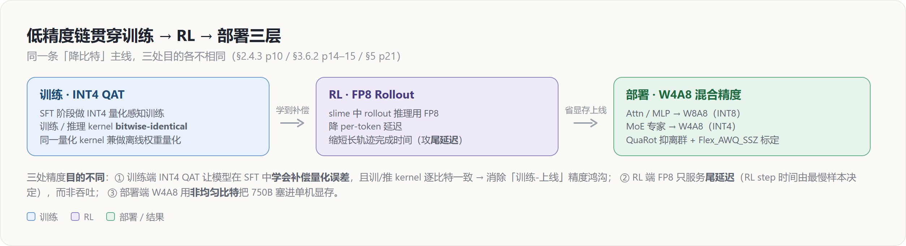
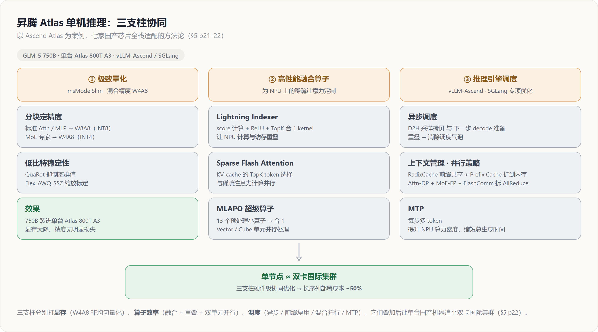
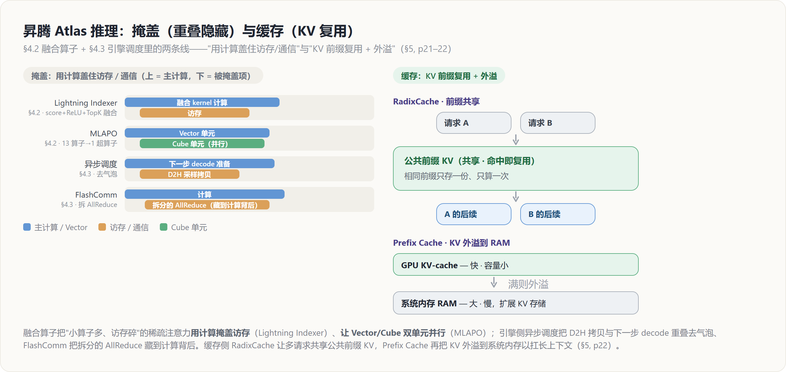

# GLM-5 低精度链与国产芯片适配 — INT4 QAT → FP8 Rollout → W4A8 部署

> **来源基线**: arXiv 2602.15763v2《GLM-5: from Vibe Coding to Agentic Engineering》(GLM-5 Team, Zhipu AI & 清华, 2026-02-24)
> **维度**: Deep Dive（机制级）
> 本页串起 GLM-5 的一条「降比特」主线：**训练**端 INT4 QAT（§2.4.3, p10）→ **RL** 端 FP8 rollout（§3.6.2, p14–15）→ **部署**端 W4A8 混合精度（§5, p21–22），并落到国产芯片（昇腾 Atlas）单机推理的全栈适配。架构总览见 [[glm5_architecture_deepdive]]，概要见 [[glm_5_analysis]]。

---

## 1. 总览：同一条低精度主线，三处目的各不相同

GLM-5 在三个训练/部署阶段都用了「降比特」，但**每一处低精度服务的目标完全不同**——理解这一点是看懂这条主线的关键：

| 阶段 | 精度 | 出处 | 解决的问题（≠ 单纯省算力） |
|---|---|---|---|
| 训练（SFT） | **INT4 QAT** | §2.4.3, p10 | 让模型**学会补偿量化误差**，并消除训/推精度鸿沟 |
| RL（rollout） | **FP8** | §3.6.2, p14–15 | 压**尾延迟**（RL step 由最慢样本决定），非吞吐 |
| 部署 | **W4A8 混合精度** | §5, p21 | 把 750B 塞进**单台**国产机器的显存 |

> 一句话主线：**训练端用 QAT 把「量化损失」提前内化进权重，部署端再用 W4A8 把这份红利兑现成单机可跑**；RL 端的 FP8 则是另一条独立支线，只为压缩长轨迹的尾延迟。

---

## 2. 训练端：INT4 QAT（§2.4.3, p10）

**原理**：为了在低精度下拿到更好的精度，GLM-5 在 **SFT 阶段**就引入 INT4 量化感知训练（Quantization-Aware Training, QAT）。更关键的工程决策是——团队开发了一个**同时适用于训练与离线权重量化的量化 kernel**，确保**训练与推理之间逐比特一致（bitwise-identical behavior）**（§2.4.3, p10）。论文原文：

> "To provide better accuracy at low-precision, we apply INT4 QAT in the SFT stage. Moreover ... a quantization kernel applicable to both training and offline weight quantization, which ensures bitwise-identical behavior between training and inference."（§2.4.3, p10）

**效果（两层）**：
1. **精度**：QAT 让模型在 SFT 期间就「见到」量化噪声，从而在权重里**学会补偿量化误差**——这是低精度部署不掉点的前提。
2. **零 train-serve gap**：常规量化部署最大的隐患是「训练用 FP、上线用 INT4」两套数值路径不一致，导致量化模型实际表现劣于训练时的评测。GLM-5 用**同一个 kernel** 既做训练前向、又做离线权重量化，二者**逐比特相同**，从根上删掉了这个差异源。

**为什么这样设计**：把「量化」从**事后压缩**变成**训练目标的一部分**。
- 若只在部署时离线量化（PTQ），模型从没在量化噪声下优化过，必然掉点；
- 若 QAT 用的伪量化 kernel 与最终部署 kernel 数值不同，QAT 学到的补偿就「对不上」真实部署路径，红利打折。
- GLM-5 同时满足「QAT」+「训推 kernel bitwise-identical」两个条件，才能把 INT4 的精度损失压到可接受。这条训练端的 QAT，正是 §5 部署端 W4A8 能「无明显精度损失」的前置铺垫（见 §4）。

> 相关对比：把量化提前进训练目标，是当前低精度训练的共识方向，参见 [[low_precision_training_analysis]] 与 [[deepseek_v4_fp4_qat_analysis]]（FP4 QAT 的同类思路）。

---

## 3. RL 端：FP8 Rollout —— 一条「尾延迟」支线（§3.6.2, p14–15）

这一段属于 RL 基础设施的 slime 框架，本页只点出其**低精度动机**，完整的 slime / 全异步 RL 见 [[glm5_agentic_rl_deepdive]]。

**原理**：在 slime 的 RL rollout 中，GLM-5 用 **FP8 做 rollout 推理**，以**降低 per-token 延迟、缩短长轨迹的完成时间**（§3.6.2, p14–15）。论文把这归入 slime 提升吞吐的几个杠杆之一——「mixed-precision training/rollouts together with MTP and Prefill-Decode (PD) disaggregation」（§3.6, p14）。

**为什么是「尾延迟」而非「吞吐」**：RL rollout 的优化目标与普通服务不同——
> "the optimization target is not aggregate throughput but **end-to-end latency**, dominated by the slowest (long-tail) sample in each step."（§3.6.2, p14）

一个掉队的长轨迹就会卡住整步的同步点（batch 完成、buffer 就绪、trainer 更新），直接决定墙钟进度（§3.6.2, p14）。因此 FP8 在这里的作用是**把最慢样本的逐 token 解码做快**，从而缩短 step 级的 stall——和 §2 训练端 QAT「为精度」的目的截然不同。FP8 rollout 还与 **MTP**（小 batch decode 下对长尾收益尤其大）、**PD 解耦**协同压尾延迟（§3.6.2, p14–15）。

**效果**：降低长轨迹的 time-to-completion，减少每个 RL step 因最慢样本造成的等待。

> 这条 FP8 支线是「推理加速」性质，**不进入最终权重**；与 §2 的 INT4 QAT（改变训练目标）、§4 的 W4A8（改变部署权重）是三件不同的事，只是共享「降比特」这一手段。

---

## 4. 部署端：W4A8 + 国产芯片三支柱（§5, p21–22）

GLM-5 从第一天起就**全栈适配七家国产芯片平台**：华为昇腾（Huawei Ascend）、摩尔线程（Moore Threads）、海光（Hygon）、寒武纪（Cambricon）、昆仑芯（Kunlunxin）、沐曦（MetaX）、燧原（Enflame）（§5, p21）。论文以 **Ascend Atlas 系列**为案例，方法论落在**三大支柱：极致量化、高性能算子融合、先进推理引擎调度**（§5, p21）。

### 4.1 支柱一 · 极致量化：Mixed-Precision W4A8（§5, p21）

**原理**：为把 **750B** 的 GLM-5 塞进**单台 Atlas 800T A3**，团队用 **msModelSlim** 工具实现 W4A8 混合精度量化，对不同组件施加不同精度（§5, p21）：

| 组件 | 量化精度 | 目的 |
|---|---|---|
| 标准 Attention / MLP 块 | **W8A8（INT8）** | 保精度 |
| MoE 专家 | **W4A8（INT4）** | 大幅削显存，且无明显精度损失 |

低比特部署的稳定性靠两个算法保障：**QuaRot** 做离群值抑制（outlier suppression）、**Flex_AWQ_SSZ** 做缩放标定（scaling calibration）（§5, p21）。

**为什么是「混合」而非全 W4A8**：MoE 专家参数量占大头但每个专家激活稀疏、对单权重的敏感度相对低，压到 INT4 收益最大、风险可控；而 Attention/MLP 是每 token 都过的密集主干，保持 INT8（W8A8）守住精度。**非均匀地分配比特预算**——把最激进的 INT4 只用在「省得最多、伤得最少」的 MoE 专家上——这正是 §2 训练端 INT4 QAT 红利能在此兑现的地方。

### 4.2 支柱二 · 高性能融合算子（§5, p21–22）

为攻克稀疏注意力在昇腾 NPU 上的计算瓶颈，团队定制了一套融合 kernel（§5, p21）：

- **Lightning Indexer**：把 **score 计算 + ReLU + TopK** 三步集成进**单个 kernel**，让 NPU 把**计算与访存重叠**（§5, p21–22）。（Lightning Indexer 是 DSA 稀疏注意力的内容选择器，架构语境见 [[glm5_architecture_deepdive]]。）
- **Sparse Flash Attention**：针对 GLM-5 的稀疏模式专门优化，把「从 KV-cache 选 TopK token」与「稀疏注意力计算」**并行**处理（§5, p22）。
- **MLAPO（Multi-head Latent Attention Pre-processing Optimization）**：把 **13 个预处理小算子**融成一个「**超级算子**」，利用昇腾 **Vector 与 Cube 单元之间的并行**提升端到端效率（§5, p22）。

**为什么融合**：稀疏注意力天然是「小算子多、访存碎」的工作负载，零散 kernel 会被 launch 开销和访存往返拖垮；把它们合并成大 kernel 后，既能**用计算掩盖访存**（Lightning Indexer），又能**让 NPU 的不同执行单元并行**（MLAPO 的 Vector/Cube），把稀疏带来的算力浪费补回来。

### 4.3 支柱三 · 推理引擎调度（vLLM-Ascend & SGLang）（§5, p22）

团队适配 **vLLM-Ascend** 与 **SGLang** 两大推理引擎，做了四项专项优化（§5, p22）：

| 优化 | 机制 | 收益 |
|---|---|---|
| **异步调度（Asynchronous Scheduling）** | 把 **D2H（Device-to-Host）采样拷贝**与**下一步 decode 的准备**重叠 | 消除调度「气泡（bubbles）」 |
| **上下文管理（Context Management）** | **RadixCache** 前缀共享 + **Prefix Cache** 把 KV 存储扩展到系统内存（RAM） | 高效复用 KV，长上下文关键 |
| **并行策略（Parallel Strategy）** | 混合 **Attention DP + MoE EP**，外加 **FlashComm** 拆分 AllReduce | 把通信延迟藏到计算背后 |
| **MTP（Multi-Token Prediction）** | 每个推理步生成多个 token | 提升 NPU 算力密度、缩短总生成时间 |

**为什么这四项**：分别打**调度**（异步重叠去气泡）、**显存/复用**（前缀共享 + KV 外溢到 RAM）、**通信**（混合并行 + FlashComm 拆 AllReduce 隐藏通信）、**算力密度**（MTP 一步多 token）。四者叠加，把单机推理的各类瓶颈逐一抹平。

下图把本节的**掩盖**（融合算子 + 异步调度 + FlashComm）与**缓存**（RadixCache + Prefix Cache）两条线并排呈现：

### 4.4 结果：单机追平双卡国际集群（§5, p22）

经上述硬件级协同优化，**GLM-5 在单个国产节点上达到可与双卡国际集群相当的性能，并在长序列场景下把部署成本降低 50%**（§5, p22）。

> 这条结果把整页主线闭合：**训练端 INT4 QAT 把量化损失内化** → **部署端 W4A8 把红利兑现成单机可跑** → **三支柱算子/调度把单机性能推到双卡国际集群水平**，最终在长序列上 −50% 成本。

---

## 5. 把三段串起来：一条主线的「为什么」

| 维度 | 训练 · INT4 QAT | RL · FP8 rollout | 部署 · W4A8 + 三支柱 |
|---|---|---|---|
| 目标 | 低精度下的**精度** | 长轨迹**尾延迟** | 单机**显存 + 成本** |
| 改变什么 | 训练目标（权重学会补偿） | rollout 推理路径（不进权重） | 部署权重 + kernel/调度 |
| 关键保障 | 训推 kernel **bitwise-identical** | MTP / PD 解耦协同 | QuaRot / Flex_AWQ_SSZ / msModelSlim |
| 出处 | §2.4.3, p10 | §3.6.2, p14–15 | §5, p21–22 |

**为什么这条链是有机的、而非三件孤立的事**：INT4 QAT（§2）让权重**提前适应低比特**，是部署端 W4A8（§4）「无明显精度损失」的根因；W4A8 把 750B 压进单机后，**融合算子 + 引擎调度**（§4.2/4.3）再把单机性能推满。FP8 rollout（§3）虽是一条独立的「尾延迟」支线，但同样体现了 GLM-5 「在每个阶段按各自瓶颈选最合适的精度」的统一工程哲学——**精度不是越高越好，而是按目标精确分配比特预算**。

---

## Related / Cross-references

**同系列 GLM-5 深挖页**：
- [[glm_5_analysis]] — GLM-5 概要（总览）
- [[glm5_architecture_deepdive]] — 架构（MLA·Muon Split·MTP·DSA；Lightning Indexer 的架构语境）
- [[glm5_data_deepdive]] — 预训练/中训练数据与环境构造
- [[glm5_training_infra_deepdive]] — 训练基础设施（显存 5 件套 + 并行）
- [[glm5_posttraining_deepdive]] — SFT / Reasoning RL / General RL / 蒸馏
- [[glm5_agentic_rl_deepdive]] — slime + 全异步 RL（FP8 rollout / PD 解耦 的完整语境）
- [[glm5_training_stability_deepdive]] — 训练稳定性主线
- [[zhipu_glm/index]] — GLM 家族总览

**相邻主题**：
- [[low_precision_training_analysis]] — 低精度训练总览（QAT/PTQ/FP8 谱系）
- [[deepseek_v4_fp4_qat_analysis]] — FP4 QAT（把量化提前进训练目标的同类思路）
- [[transformer_engine_analysis]] — FP8 训练/推理 kernel 基础设施
- [[mindspeed/index]] — 昇腾 NPU 加速特性（融合算子 / 并行 / 调度 的国产侧实现）
