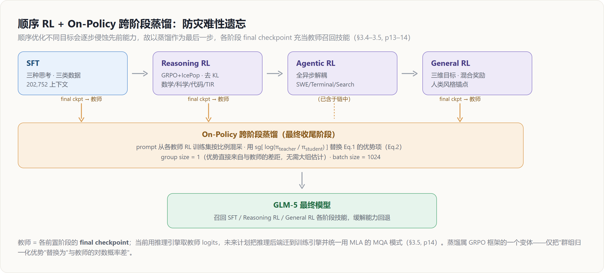
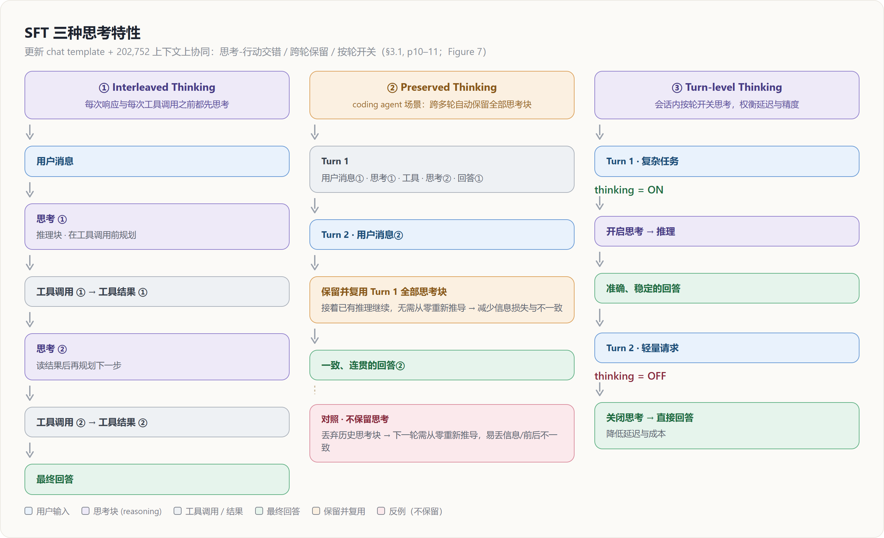

# GLM-5 后训练深挖 — 渐进式对齐：SFT 三种思考 · Reasoning/General RL · 跨阶段蒸馏防遗忘

> **来源基线**: arXiv 2602.15763v2《GLM-5: from Vibe Coding to Agentic Engineering》(GLM-5 Team, Zhipu AI & 清华, 2026-02-24)
> **维度**: Deep Dive（机制级）
> 本页深挖论文 §3.1–§3.5（pp.10–14）的后训练流水线：SFT 三种思考特性、Reasoning RL 的 GRPO+IcePop 损失、General RL 的混合奖励、以及作为收尾的 On-Policy 跨阶段蒸馏。Agentic RL（§3.3）只给一段概览，详见 [[glm5_agentic_rl_deepdive]]；DSA-RL 与异步 RL 的稳定性细节见 [[glm5_training_stability_deepdive]]。概要见 [[glm_5_analysis]]，架构/数据/基础设施见同系列深挖页（见文末）。

---

## 1. 总览：为什么"渐进式对齐"要以蒸馏收尾

GLM-5 的后训练目标是把 base model 变成"会推理、会写代码、会做 agent"的助手。流水线采用**渐进式对齐（progressive alignment）**（§3, p10）：先 SFT 引入交错思考模式，再做面向推理与 agent 的专门化 RL，最后做一轮通用 RL 做人类风格对齐，并以 **on-policy 跨阶段蒸馏**作为最终精修来对冲能力回退（§3, p10）。

**核心矛盾**：顺序优化不同目标会**累积侵蚀**先前已获得的能力（catastrophic regression）——后一阶段为新目标更新参数时，会冲掉前一阶段学到的技能（§3.5, p13）。GLM-5 的解法不是"少改"，而是"事后召回"：用各阶段的 final checkpoint 当教师，把被冲掉的技能蒸馏回来（§3.5, p13）。这条主线贯穿全页：

| 阶段 | 目标 | 算法骨干 | 出处 |
|---|---|---|---|
| SFT | 引入交错思考 + 扩 Agent/Coding | 监督微调 | §3.1 p10–11 |
| Reasoning RL | 数学/科学/代码/TIR 推理 | GRPO + IcePop（去 KL） | §3.2 p11–12 |
| Agentic RL | coding/search agent | 全异步解耦 RL | §3.3 p12–13 |
| General RL | 人类风格对齐（三维目标） | 混合奖励（rule+ORM+GRM） | §3.4 p13 |
| Cross-Stage Distillation | 召回各阶段技能、防遗忘 | On-policy 蒸馏（GRPO 变体） | §3.5 p13–14 |

---

## 2. SFT：三类数据 + 三种思考特性（§3.1, p10–11）

### 2.1 数据：相对 GLM-4.5 显著扩充 Agent 与 Coding

**原理**：相比 GLM-4.5，GLM-5 在 SFT 阶段**显著扩大了 Agent 与 Coding 数据规模**（§3.1, p10）。SFT 语料覆盖三大类（§3.1, p10）：

1. **General Chat**：问答、写作、角色扮演、翻译、多轮对话、长上下文交互；
2. **Reasoning**：数学、编程、科学推理；
3. **Coding & Agent**：前/后端工程代码、工具调用、coding agent、search agent、通用 agent。

此外，SFT 阶段把**最大上下文长度扩到 202,752 tokens**，并配合**更新后的 chat template**支持三种思考特性（§3.1, p11）。

### 2.2 三种思考特性（Figure 7）

**原理**：模型支持三种相互正交的思考特性（§3.1, p11；Figure 7）：

- **Interleaved Thinking（交错思考）**：模型在**每一次响应和每一次工具调用之前**都先思考，提升指令遵循与生成质量（§3.1, p11）。该特性最早由 Claude 的 extended thinking（interleaved thinking）引入（§3.1, p11 脚注 4）。
- **Preserved Thinking（保留思考）**：在 coding agent 场景下，模型**跨多轮对话自动保留全部思考块**，复用已有推理而不是从零重新推导；这**减少了信息损失与前后不一致**，适合长程、复杂任务（§3.1, p11）。论文注明该特性自 **Claude Opus 4.5** 起也被采用（§3.1, p11 脚注 5）。
- **Turn-level Thinking（按轮思考）**：会话内支持**按轮**控制是否推理——对轻量请求关闭思考以降低延迟/成本，对复杂任务开启思考以提升精度与稳定性（§3.1, p11）。

**为什么三者协同**：交错思考解决"单轮内思考-行动如何穿插"，保留思考解决"跨轮如何不丢上下文推理"，按轮思考解决"何时该花算力推理"。三者叠加让 GLM-5 在复杂任务上"更稳定、更可控"（§3.1, p11）。

### 2.3 三类数据各自的处理配方

| 类别 | 关键做法 | 出处 |
|---|---|---|
| **General Chat** | 相比 GLM-4.5 把响应风格优化得**更具逻辑性、更简洁**；角色扮演覆盖更多语言与角色配置，按指令遵循/语言表现力/创造力/逻辑连贯/长对话一致性等维度做自动+人工过滤 | §3.1 p11 |
| **Reasoning** | 逻辑推理构造**可验证问题** + **拒绝采样**合成高质量数据；数学/科学做**基于难度的过滤**，只保留对 **GLM-4.7 仍具挑战性**的问题 | §3.1 p11 |
| **Coding & Agent** | 构建大量**执行环境**获取高质量轨迹（侧重真实场景与长程任务）；用 **expert RL + 拒绝采样**进一步改进 SFT 数据 | §3.1 p11 |

**Coding & Agent 的关键技巧——错误段保留但 mask loss**：轨迹中的**错误片段被保留，但在损失函数中被屏蔽（masked out）**（§3.1, p11）。

**为什么**：直接删掉错误片段会让模型见不到"出错→纠错"的上下文；但若对错误片段照常计算 loss，又会**强化错误动作**。保留错误段进入上下文、但只在正确（纠错）部分回传梯度，使模型**学会纠错行为而不强化错误动作**（§3.1, p11）。这是"在轨迹层面区分上下文与监督信号"的典型手法。

---

## 3. Reasoning RL：GRPO + IcePop，显式区分训练/推理策略（§3.2, p11–12）

### 3.1 算法骨干：在 GRPO 上叠 IcePop 抑制训推不一致

**原理**：RL 算法以 **GRPO** 为骨干，并引入 **IcePop** 技术来缓解 **training-inference mismatch**——即 RL 优化时**推理分布与训练分布**之间的差异（§3.2, p11）。GLM-5 **显式区分**两个策略（§3.2, p11）：

- $\pi_{train}$：用于**梯度更新**的训练策略；
- $\pi_{infer}$：用于**采样轨迹**的推理策略。

相比原始 IcePop，GLM-5 **移除了 KL 正则项以加速 RL 提升**（§3.2, p11）。最终优化损失（Eq.1）为：

$$
\mathcal{L}(\theta) = -\,\mathbb{E}_{x\sim D,\,\{y_i\}_{i=1}^{G}\sim \pi^{infer}_{\theta_{old}}(\cdot\mid x)}
\left[\frac{1}{G}\sum_{i=1}^{G}\frac{1}{|y_i|}\sum_{t=1}^{|y_i|}
\mathrm{pop}(\rho_{i,t},\,1/\beta,\,\beta)\cdot
\min\!\big(r_{i,t}\hat{A}_{i,t},\ \mathrm{clip}(r_{i,t},1-\epsilon_{low},1+\epsilon_{high})\hat{A}_{i,t}\big)\right]
$$

其中**训练-推理失配比**定义为训练策略与推理策略在同一 token 上的概率之比：

$$
\rho_{i,t}=\frac{\pi^{train}_{\theta_{old}}(y_{i,t}\mid x,y_{i,<t})}{\pi^{infer}_{\theta_{old}}(y_{i,t}\mid x,y_{i,<t})}
$$

### 3.2 pop 算子：把"训推偏差过大"的 token 直接清零

**原理**：算子 $\mathrm{pop}(\cdot)$ **抑制失配比偏离过大的样本**（§3.2, p12）：

$$
\mathrm{pop}(\rho_{i,t},\,1/\beta,\,\beta)=
\begin{cases}
\rho_{i,t}, & 1/\beta\le \rho_{i,t}\le \beta\\[4pt]
0, & \text{otherwise.}
\end{cases}
$$

PPO 风格的重要性比与群组归一化优势沿用原始 GRPO 定义（§3.2, p12）：

$$
r_{i,t}=\frac{\pi^{train}_{\theta}(y_{i,t}\mid x,y_{i,<t})}{\pi^{train}_{\theta_{old}}(y_{i,t}\mid x,y_{i,<t})},
\qquad
\hat{A}_{i,t}=\frac{R_i-\mathrm{mean}(R_1,\dots,R_G)}{\mathrm{std}(R_1,\dots,R_G)}
$$

**为什么**：当某 token 上 $\rho_{i,t}$ 落在 $[1/\beta,\beta]$ 之外，说明该 token 在推理引擎与训练引擎下的概率差得太多（典型由实现差异/量化/算子不一致引起），此时其梯度不可信；pop 把该 token 的贡献**直接清零**，只在"训推一致"的 token 上回传梯度——这是在不引入 KL 软约束的前提下，用**硬门控**稳住 off-distribution 偏差。

**超参数**：$\beta=2$，$\epsilon_{low}=0.2$，$\epsilon_{high}=0.28$；训练**完全 on-policy**，**group size = 32**，**batch size = 32**（§3.2, p12）。注意 $\epsilon_{high}>\epsilon_{low}$ 的非对称裁剪鼓励上探。GRPO 本身的原理见 [[grpo_analysis]] 与 [[RL_PPO_Loss_and_GRPO_Analysis]]。

### 3.3 混域 Reasoning RL：四域均衡 + 难度过滤

**原理**：Reasoning RL 阶段在**四个域**上做混合 RL 训练——**数学、科学、代码、工具集成推理（TIR）**（§3.2, p12）。

- **数学 & 科学**：数据取自开源集与外部标注厂商共建集；进一步做**难度过滤**，聚焦于 **GLM-4.7 仅偶尔答对或一贯失败、但更强教师模型（如 GPT-5.2 xhigh、Gemini 3 Pro Preview）仍能解出**的问题（§3.2, p12）。
- **代码**：兼顾竞赛风格与科学计算两类；前者主要来自 **Codeforces** 及 **TACO**、**SYNTHETIC-2-RL** 等代表性数据集，后者由内部题池分解为"正确解所需的最小代码实现"构造（§3.2, p12）。
- **TIR**：复用数学/科学 RL 的更难子集，并与标注厂商共建"显式设计为需借助外部工具回答"的 STEM 问题（§3.2, p12）。

**奖励**：训练时为每个域/来源指派专属的 **judge 模型或评测系统**，产出**二值结果奖励（binary outcome rewards）**；整体四域混合大致**均衡**（§3.2, p12）。

**效果/为什么**：论文报告在混合 RL 设置下，**每个域都获得稳定且显著的增益**（§3.2, p12）。难度过滤的逻辑是"把算力投到学习信号最大的题上"——太易（GLM-4.7 已会）无梯度增益、太难（强教师也不会）无可靠正样本，只有"对当前模型难、对强教师可解"的题带来最有效的提升。

> **DSA-RL 的稳定性（仅一行 + 链接）**：在 DSA 架构上做大规模 RL 时，indexer 检索的 top-k 必须保持训推一致——GLM-5 用**确定性 `torch.topk`** 替代非确定性 CUDA 实现，并**默认冻结 indexer 参数**（§3.2, p12）。机制与 routing-replay 类比详见 [[glm5_training_stability_deepdive]]。

---

## 4. Agentic RL（§3.3, p12–13）— 概览

GLM-5 为 coding 与 search agent 任务构建了一套**全异步、解耦**的 RL 框架：通过中央 Multi-Task Rollout Orchestrator 解耦推理与训练引擎，消除长程 agent rollout 中的 GPU 空转；并以 **TITO 网关**（消除重 tokenize 失配）与 **Direct Double-sided Importance Sampling**（token 级裁剪控 off-policy 偏差）维持异步 off-policy 下的稳定，同时把可验证训练环境扩展到 10K+ 真实 SWE、终端任务与高难多跳检索三域（§3.3, p12–13）。该阶段是整页篇幅最大的子系统，完整深挖见 [[glm5_agentic_rl_deepdive]]；异步稳定性机制见 [[glm5_training_stability_deepdive]]。

---

## 5. General RL：三维目标 + 混合奖励 + 人类风格锚点（§3.4, p13）

### 5.1 三个互补的优化维度

**原理**：General RL 的目标被拆成三个互补维度（§3.4, p13）：

1. **Foundational correctness（基础正确性）**——响应质量的**基石/可用基线**。针对一大类破坏可用性的错误：指令遵循失败、逻辑不一致、事实错误、知识幻觉、语言不流畅；目标是把错误率压到让响应达到**可用（usable）**基线。论文强调这是所有后续优化的**前提**：一个含事实错误或误解用户意图的响应，无论措辞多漂亮都会误导用户（§3.4, p13）。
2. **Emotional intelligence（情感智能）**——在正确性之上优化体验，让响应**共情、有洞察、风格贴近自然人类交流**（§3.4, p13）。
3. **Task-specific quality（任务专属质量）**——在可用性之上做细粒度优化，把响应从"仅正确"提升到"真正高质量"，覆盖写作、文本处理、主/客观问答、角色扮演、翻译等；每类任务需要不同奖励信号，因此需要**混合奖励系统**（§3.4, p13）。

### 5.2 混合奖励系统：rule + ORM + GRM 的三方互补

**原理**：为监督上述多样目标，构建融合三类奖励信号的混合系统（§3.4, p13）：

| 信号 | 优点 | 缺点 | 出处 |
|---|---|---|---|
| **Rule-based（规则）** | 精确、可解释 | 仅限可用**确定性规则**表达的方面 | §3.4 p13 |
| **ORM（结果奖励模型）** | **低方差**、训练高效 | 易被 **reward hacking**（策略钻表面模式的空子） | §3.4 p13 |
| **GRM（生成式奖励模型）** | 对上述利用更**鲁棒** | **方差更高** | §3.4 p13 |

**为什么混合**：三者各有短板——规则覆盖窄、ORM 可被 hack、GRM 方差大。**三者融合**得到一个**兼顾精确性、效率与鲁棒性**的奖励系统，相互弥补单一组件的弱点（§3.4, p13）。

### 5.3 Human-in-the-loop 风格对齐：注入人类范文当锚点

**原理**：General RL 的一个独特设计是**显式引入高质量人类撰写的响应**——不只靠模型自生成响应，而是把**专家人类响应作为风格与质量锚点**注入（§3.4, p13）。

**为什么**：纯靠模型自生成做优化会**收敛到可辨识的"模型腔"**——往往冗长、套路化、缺乏熟练人类写作的细腻（§3.4, p13）。把人类范文暴露给模型，引导其采用更自然、更贴近人类的响应模式，避免在自我强化中漂向"机器味"的局部最优。

---

## 6. On-Policy 跨阶段蒸馏：作为收尾的防遗忘机制（§3.5, p13–14）

### 6.1 为什么放在最后

**原理**：在多阶段 RL 流水线中，**顺序优化不同目标会累积退化此前获得的能力**；为缓解此问题，GLM-5 把 **on-policy 跨阶段蒸馏作为最终阶段**，用 on-policy 蒸馏算法**快速召回**早期 SFT 与 RL 阶段（Reasoning RL、General RL）习得的技能（§3.5, p13）。

**教师与数据**：前置各训练阶段的 **final checkpoint** 充当**教师模型**；训练 prompt 从**对应教师的 RL 训练集中采样、按合适比例混合**（§3.5, p14）。

### 6.2 损失：把"群组优势"换成"与教师的对数概率差"

**原理**：蒸馏损失通过**把 Eq.1 的优势项替换为下式**得到（'sg' 为 stop-gradient，即 `.detach()`）（§3.5, p14）：

$$
\hat{A}_{i,t}=\mathrm{sg}\!\left[\log\frac{\pi^{infer}_{\theta_{teacher}}(y_{i,t}\mid x,y_{i,<t})}{\pi^{train}_{\theta}(y_{i,t}\mid x,y_{i,<t})}\right]
$$

即优势 = 教师与学生在该 token 上的**对数概率比**（教师更自信即正优势，反之负），并对教师项 stop-gradient（教师不更新）。其余损失结构（pop 门控、PPO 裁剪）沿用 Eq.1——所以蒸馏本质是 **GRPO 框架的一个变体**：唯独把"群组归一化优势"换成"对教师的差距"。

**实现现状与未来**：当前用**推理引擎**取教师 logits；未来计划把**推理后端迁移到训练引擎**，并统一采用 **MLA 的 MQA 模式**做推理（$\pi^{infer}_{\theta_{teacher}}\!\to\!\pi^{train}_{\theta_{teacher}}$）（§3.5, p14）。MLA/MQA 机制见 [[glm5_architecture_deepdive]]。

### 6.3 超参：group size 降到 1

**原理**：GRPO 的 **group size 配为 1** 以提升数据吞吐，**batch size 设为 1024**（§3.5, p14）。

**为什么 group=1 可行**：标准 GRPO 需要每个 prompt 维持一**大组**样本来估计群组归一化优势；但蒸馏阶段的优势**直接来自与教师的差距**（Eq.2），**不再需要大组来估计优势**，因此每 prompt 只采 1 条即可、把预算换成更大的 batch（§3.5, p14）。这与 §3.2 Reasoning RL 的 group=32 形成鲜明对照——优势来源不同，最优组大小也不同。

---

## Related / Cross-references

**同系列 GLM-5 深挖页**：
- [[glm_5_analysis]] — GLM-5 概要（总览）
- [[glm5_architecture_deepdive]] — MLA / Muon Split / MTP / DSA 架构主线
- [[glm5_data_deepdive]] — 预训练/中训练数据与环境构造
- [[glm5_training_infra_deepdive]] — 训练基础设施（显存/并行/长序列）
- [[glm5_agentic_rl_deepdive]] — §3.3 Agentic RL + slime 全异步 RL 基础设施
- [[glm5_training_stability_deepdive]] — 训练稳定性主线（DSA-RL `torch.topk`/冻结 indexer、异步 off-policy 机制）
- [[glm5_low_precision_chip_deepdive]] — INT4 QAT / FP8 rollout / W4A8 / 国产芯片

**相邻主题**：
- [[grpo_analysis]] — GRPO 原理（Reasoning RL 与蒸馏的算法骨干）
- [[RL_PPO_Loss_and_GRPO_Analysis]] — PPO/GRPO 损失与裁剪机制
- [[zhipu_glm/index]] — GLM 家族总览
