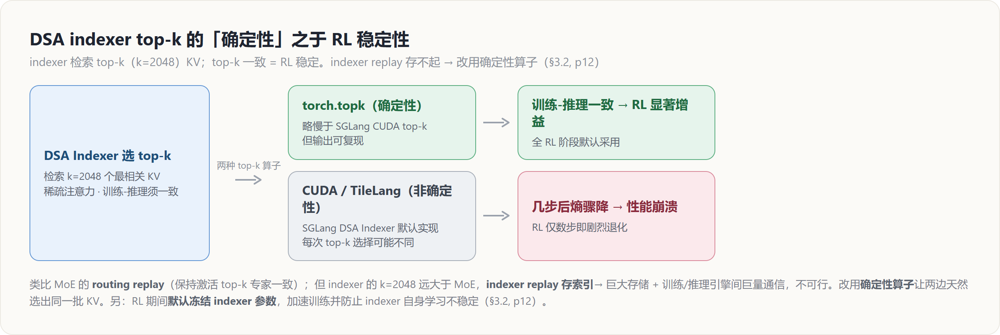
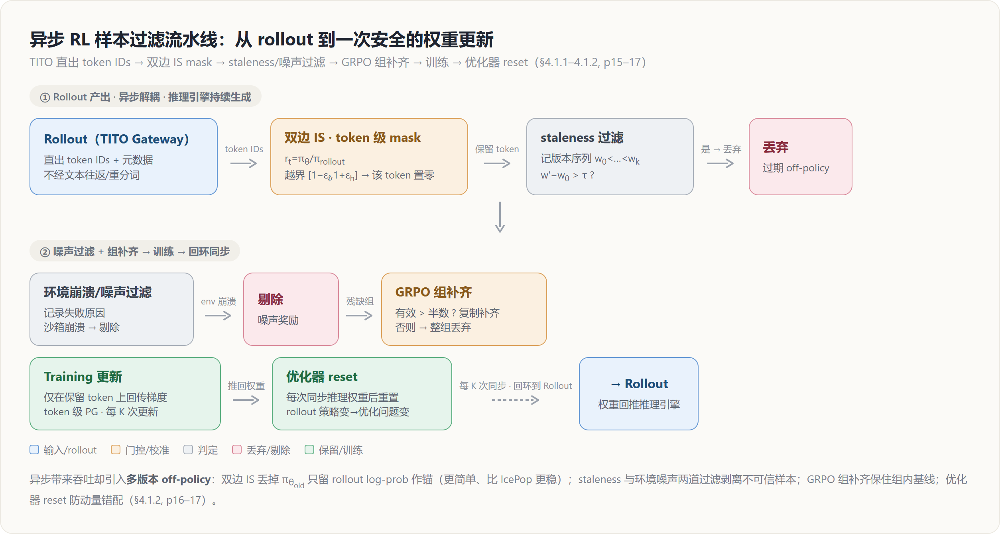

# GLM-5 训练稳定性深挖 — 从架构 logits 到异步 RL 的「失配 × 噪声 × 故障」三线防御

> **来源基线**: arXiv 2602.15763v2《GLM-5: from Vibe Coding to Agentic Engineering》(GLM-5 Team, Zhipu AI & 清华, 2026-02-24)
> **维度**: Deep Dive（机制级·跨章节主线）
> 本页把散落在论文架构（§2）、Reasoning RL（§3.2）、General RL（§3.4）、Agentic RL（§4.1–4.2）与基础设施（§3.6.3）各处的**训练稳定性**线索收拢成一条主线。GLM-5 的稳定性问题集中在三类失稳源——**训练-推理分布失配**、**奖励/样本噪声**、**大规模系统故障**；本页逐一给出机制（原理 / 效果 / 为什么）。概要见 [[glm_5_analysis]]，架构与后训练细节见 [[glm5_architecture_deepdive]]、[[glm5_posttraining_deepdive]]、[[glm5_agentic_rl_deepdive]]。

---

## 1. 总览：稳定性的三类失稳源

GLM-5 的稳定性工程不是单点补丁，而是按「失稳从哪里来」分层设防：

- **失配（mismatch）**——采样分布 ≠ 梯度分布。来源有三：优化器把不同注意力头绑到同一更新尺度（架构层）、RL 中 $\pi_{\text{infer}}\ne\pi_{\text{train}}$（IcePop）、异步 rollout 的多版本 off-policy 与重新分词错位（TITO / 双边 IS）。
- **噪声（noise）**——奖励信号不可信。来源有二：奖励模型被 reward hacking 钻空子（ORM/版式 hacking）、沙箱环境崩溃产生与模型能力无关的失败。
- **故障（fault）**——大规模长程 rollout 下单机崩溃、网络抖动。

下表是全页的导航地图：每个机制 → 它压住的那类不稳定 → 论文出处。

| 层 | 机制 | 解决的不稳定 | 出处 |
|---|---|---|---|
| 架构 | **Muon Split**（按头独立正交化） | attention logits 失稳 → 全程稳定、**无需任何 clipping** | §2.1 p5 |
| Reasoning RL | **IcePop** `pop(ρ,1/β,β)` + 去 KL | 训练-推理分布失配（采样 ≠ 梯度） | §3.2 p11–12 |
| Reasoning RL | **DSA 确定性 top-k**（`torch.topk`） | 非确定性 indexer top-k → 几步后熵骤降、性能崩溃 | §3.2 p12 |
| Reasoning RL | **冻结 indexer 参数** | indexer 自身学习不稳定 | §3.2 p12 |
| 异步 Agentic RL | **Token-in-Token-out**（TITO Gateway） | 重新分词造成 action↔reward 步对齐错位 | §4.1.2 p16 |
| 异步 Agentic RL | **直接双边重要性采样**（mask 越界 token） | 多版本 off-policy 偏差、无法追踪 $\pi_{\theta_{\text{old}}}$ | §4.1.2 p16–17 |
| 异步 Agentic RL | **丢弃过期样本**（$w'-w_0>\tau$） | 过长轨迹严重 off-policy | §4.1.2 p17 |
| 异步 Agentic RL | **丢弃噪声样本** + GRPO 组补齐 | 沙箱环境崩溃 → 噪声奖励 | §4.1.2 p17 |
| 异步 Agentic RL | **每次同步权重后 reset 优化器** | rollout 策略改变 → 优化问题改变 | §4.1.1 p16 |
| 奖励 | **rule + ORM + GRM 混合奖励** | ORM 易被 reward hacking | §3.4 p13 |
| 奖励 | **Slides 运行时渲染 grounded 取值** + token 级 PG + 跨 batch 分散 | 硬截断 / 堆空白等版式 hacking | §4.2.5 p20–21 |
| 系统 | **心跳驱动容错**（剔除 + 自动重路由） | 单机崩溃中断端到端 RL | §3.6.3 p15 |

---

## 2. 架构层：Muon Split 让 logits「天生稳定」

**原理**：GLM-4.5 的 Muon recipe 对多头上投影矩阵 $W^{UQ},W^{UK},W^{UV}$ 做**整体**正交化；Muon Split 改为**按注意力头拆成独立小矩阵、各自正交化**，从而让不同头的投影权重以**各自适合的尺度**更新（§2.1, p5）。

**效果（稳定性侧）**：论文明确报告——配合 Muon Split，GLM-5 的 **attention logits 在整个预训练过程保持稳定，无需任何 clipping 策略**（§2.1, p5）。这省掉了 logit 软上限（如 QK-Norm / logit clipping）这类常见的稳定性补丁。

**为什么**：整体正交化把所有头绑到**同一更新尺度**，尺度不匹配的头会被推向过大的内积，注意力 logits 因此随训练放大、易出现数值爆炸；按头独立正交化解开这层耦合，每个头都在「适合自己」的尺度上更新，从源头上避免了 logit blow-up——稳定性是它精度收益（MLA 追平 GQA-8）之外的**附带红利**。

> 完整的 Muon Split 机制（含 Table 1 消融、MLA-256 解码优化）见 [[glm5_architecture_deepdive]]；Muon 优化器本身的正交化原理见 [[muon_analysis]]。本页只取其「稳定性」一面。

---

## 3. Reasoning RL 层：失配的两个战场

同步 Reasoning RL 的稳定性问题来自两处「训练-推理失配」：**概率分布失配**（采样用 $\pi_{\text{infer}}$、更新用 $\pi_{\text{train}}$）与 **DSA indexer 的 top-k 选择失配**。GLM-5 分别用 IcePop 与确定性 top-k 应对。

### 3.1 IcePop：把失配过大的样本「弹出」梯度

**原理**：Reasoning RL 的骨干是 **GRPO + IcePop**（§3.2, p11）。论文显式区分采样用的**推理策略** $\pi^{\text{infer}}$ 与梯度更新用的**训练策略** $\pi^{\text{train}}$，并定义二者的**失配比**：

$$\rho_{i,t}=\frac{\pi^{\text{train}}_{\theta_{\text{old}}}(y_{i,t}\mid x,y_{i,<t})}{\pi^{\text{infer}}_{\theta_{\text{old}}}(y_{i,t}\mid x,y_{i,<t})}$$

`pop` 算子把失配比偏离 $[1/\beta,\beta]$ 的 token **整条置零**（即从损失中剔除）：

$$\text{pop}(\rho_{i,t},1/\beta,\beta)=\begin{cases}\rho_{i,t}, & 1/\beta\le\rho_{i,t}\le\beta\\[2pt] 0, & \text{otherwise}\end{cases}$$

最终损失在标准 GRPO 的 PPO-clip 之上再乘一层 `pop` 门，并**移除原 IcePop 的 KL 正则项**以加速 RL（§3.2, p11）：

$$\mathcal{L}(\theta)=-\mathbb{E}_{x\sim\mathcal{D},\,\{y_i\}_{i=1}^{G}\sim\pi^{\text{infer}}_{\theta_{\text{old}}}}\!\left[\frac{1}{G}\sum_{i=1}^{G}\frac{1}{|y_i|}\sum_{t=1}^{|y_i|}\text{pop}(\rho_{i,t},1/\beta,\beta)\cdot\min\!\big(r_{i,t}\hat{A}_{i,t},\,\text{clip}(r_{i,t},1-\epsilon_{\text{low}},1+\epsilon_{\text{high}})\hat{A}_{i,t}\big)\right]$$

其中重要性比与组归一化优势沿用原 GRPO 定义（§3.2, p12）：

$$r_{i,t}=\frac{\pi^{\text{train}}_{\theta}(y_{i,t}\mid x,y_{i,<t})}{\pi^{\text{train}}_{\theta_{\text{old}}}(y_{i,t}\mid x,y_{i,<t})},\qquad \hat{A}_{i,t}=\frac{R_i-\text{mean}(R_1,\dots,R_G)}{\text{std}(R_1,\dots,R_G)}$$

超参 $\beta=2,\ \epsilon_{\text{low}}=0.2,\ \epsilon_{\text{high}}=0.28$，**完全 on-policy**，group size 与 batch size 均为 32（§3.2, p12）。

**为什么有效**：推理引擎（如 SGLang）与训练引擎在数值实现上不可能逐 token 等价，$\rho$ 衡量「这个 token 在两套引擎下的概率差多大」。失配过大的 token 上，重要性比已不可信，强行回传梯度会放大数值噪声；`pop` 直接把它们清零，相当于**只在训练-推理一致的 token 上学习**。详见 [[20_grpo_analysis]] 与 [[RL_Training_Inference_Precision_Analysis]]。

### 3.2 DSA indexer：确定性 top-k 是 RL 稳定的关键

**背景**：相比 MLA，DSA 多了一个 **indexer**，检索 top-k（$k=2048$）个最相关 KV 项做稀疏注意力（§3.2, p12）。论文指出——**这个被检索出的 top-k 集合对 RL 稳定性至关重要**，其角色类比 MoE 用 **routing replay** 保持「训练/推理激活的 top-k 专家一致」。

**为什么不能照搬 routing replay**：把 routing replay 搬成 **indexer replay**（在每个 token 位置存下 indexer 的 top-k 索引）**不现实**——indexer 的 $k=2048$ 远大于 MoE 常用的 $k$，把所有索引存下来会带来**巨大的存储开销**，以及训练引擎与推理引擎之间**巨量的通信开销**（§3.2, p12）。

**解法——用确定性 top-k 算子**：GLM-5 发现，**采用一个确定性的 top-k 算子**就能消解 DSA indexer 的训练-推理失配。相比 SGLang DSA Indexer 用的**非确定性 CUDA top-k**，朴素的 `torch.topk` 略慢一点，但**确定性** → 输出一致 → 带来**显著的 RL 增益**（§3.2, p12）。反面证据很硬：其他**非确定性 top-k 算子（CUDA / TileLang 实现）在 RL 中仅几步后就引发剧烈性能退化，并伴随熵的骤降**（§3.2, p12）。因此 GLM-5 在所有 RL 阶段都把 `torch.topk` 作为 DSA Indexer 的默认 top-k 算子。

**额外一招——冻结 indexer**：RL 期间**默认冻结 indexer 参数**，既加速训练，又**防止 indexer 自身学习不稳定**（§3.2, p12）。

> **机制类比一句话**：MoE 怕的是「训练激活的专家 ≠ 推理激活的专家」，靠 routing replay 对齐；DSA 怕的是「训练选的 top-k KV ≠ 推理选的 top-k KV」，但 $k$ 太大存不起，于是改用**确定性算子**让两边**天然**选出同一批 KV——把「记录-回放」换成「可复现」。

---

## 4. 异步 Agentic RL 层：稳定性套件（本页重点）

Agentic RL 走的是**全异步、解耦**框架：推理引擎持续产轨迹，攒够阈值就送训练引擎更新，权重每 $K$ 次梯度更新回推一次（§4.1.1, p15–16）。异步换来吞吐，但也带来**最严重的 off-policy 问题**——不同轨迹由不同版本的模型生成。下面五个机制共同维持异步下的稳定，整体过滤流水线如图 1。

### 4.1 Token-in-Token-out（TITO）：消除重新分词的错位

**原理**：**TITO** 指训练流水线**直接消费推理引擎产出的精确分词与 decoded-token 流**，原样用于构造学习轨迹；对立面 **Text-in-Text-out** 把 rollout 引擎当黑盒、只拿回最终文本，训练侧再**重新分词**（并重推边界与截断）才能算损失（§4.1.2, p16）。

**为什么关键**：重新分词会在 **token 边界、空白/归一化处理、截断、特殊 token 位置**上引入细微失配，进而**破坏 action 与 reward/advantage 之间的步对齐**——尤其在轨迹被流式产出、截断、或在众多 actor 间交错时（§4.1.2, p16）。论文判定 **TITO 对异步 RL 至关重要**：它保持「采样的」与「被优化的」之间**精确的 action 级对应**，同时让 actor **立即吐出轨迹片段（token IDs + 元数据）**，无需有损的文本往返、也无需在 learner 侧事后重分词。

**工程实现**：**TITO Gateway** 拦截所有 rollout 任务的生成请求，记录每条轨迹的 token IDs 与元数据，把繁琐的 token-ID 处理**与下游 agent rollout 逻辑隔离**，从而在 RL 训练中避免重分词失配（§4.1.2, p16）。

### 4.2 直接双边重要性采样：丢掉 $\pi_{\theta_{\text{old}}}$，双边 mask

**问题**：异步下，rollout 引擎在**单条轨迹生成期间可能多次更新**，精确追踪行为概率 $\pi_{\theta_{\text{old}}}$ 在计算上不可承受——否则要维护一长串历史 checkpoint $\{\pi_{\theta^{(1)}_{\text{old}}},\dots,\pi_{\theta^{(N)}_{\text{old}}}\}$，实践中不可行（§4.1.2, p16）。

**解法（两步）**（§4.1.2, p16–17）：

1. **复用 rollout log-prob 作为行为代理**：直接把 rollout 时产生的 log-prob 当行为分布，重要性比按 $r_t(\theta)=\pi_\theta/\pi_{\text{rollout}}$ 计算，**丢弃传统的 $\pi_{\theta_{\text{old}}}$**，从而省掉一次单独的 old-policy 推理。
2. **双边校准的 token 级 mask**：不用 PPO 的非对称 clip，而把信任域限制在 $[1-\epsilon_\ell,\,1+\epsilon_h]$；**落在区间外的 token 直接从梯度计算中整条 mask 掉**，以阻断极端策略偏离带来的不稳定。

形式化目标（§4.1.2, p17, Eq.3–5）：

$$\mathcal{L}(\theta)=\mathbb{E}_t\!\left[f\big(r_t(\theta),\epsilon_\ell,\epsilon_h\big)\,\hat{A}_t\,\log\pi_\theta(a_t\mid s_t)\right]\tag{3}$$

$$r_t(\theta)=\exp\!\big(\log\pi_\theta(a_t\mid s_t)-\log\pi_{\text{rollout}}(a_t\mid s_t)\big)\tag{4}$$

$$f(x;\epsilon_\ell,\epsilon_h)=\begin{cases}x, & 1-\epsilon_\ell<x<1+\epsilon_h\\[2pt] 0, & \text{otherwise}\end{cases}\tag{5}$$

**为什么更稳**：论文称该策略**与 IcePop 相似，但更简单——进一步移除了 $\pi_{\theta_{\text{old}}}$，训练更稳定**（§4.1.2, p17）。代价是「接受了一个可控的 off-policy 偏差，以换取无需追踪历史策略」——一次明确的「**偏差换稳定**」权衡。对照同步 IcePop（§3.1）：IcePop 仍保留 $\pi_{\theta_{\text{old}}}$ 与 PPO-clip，异步版把它也丢掉，只留 rollout log-prob 作锚。

### 4.3 丢弃过期样本：staleness 阈值 τ

**原理**：异步下过长轨迹会变得高度 off-policy，威胁稳定。GLM-5 在生成时**记录 rollout 引擎所用的权重版本序列** $(w_0,\dots,w_k)$，$w_0<\dots<w_k$；设当前策略版本为 $w'$，若样本**最老的 rollout 版本太陈旧**，即 $w'-w_0>\tau$（$\tau$ 为预设阈值），则**丢弃该样本**（§4.1.2, p17）。

**为什么按「最老版本」判**：一条轨迹可能横跨多次权重更新，只要其**起点**已落后当前策略超过 $\tau$ 代，整条轨迹的早段都属于太旧的策略，留着只会注入过时梯度。

### 4.4 丢弃噪声样本 + GRPO 组补齐：把「环境崩溃」从奖励里剥离

**原理**：coding-agent 的沙箱本身不稳定，可能因**与模型无关的原因失败**（如环境崩溃）。这类失败反映的是**环境不稳定而非模型能力**，会注入噪声奖励。GLM-5 **记录每个样本的失败原因，剔除因环境崩溃而失败的样本**（§4.1.2, p17）。

**GRPO 组补齐**：对 GRPO 这类基于组的方法，剔除失败样本会留下**不完整的组**。处理规则（§4.1.2, p17）：

- 若**有效样本数 > 组大小的一半** → **复制有效样本补齐**该组；
- 否则 → **整组丢弃**。

**为什么**：GRPO 的优势 $\hat{A}$ 靠组内 reward 的 mean/std 归一化，组被环境噪声污染会让基线失真；按「半数」阈值在「保留可用监督」与「不被残缺组带偏」之间取折中。

### 4.5 优化器 reset：rollout 策略一变，优化问题就变了

**原理**：推理引擎**每次更新权重后**，GLM-5 都**重置优化器**（§4.1.1, p16）。

**为什么**：rollout 策略在变，对训练引擎而言「权重更新面对的是一个不同的优化问题」；继续沿用旧的动量/二阶矩（Adam 的 $m,v$）会把上一个策略分布下累积的统计量错误地施加到新分布上。reset 让优化器在新 rollout 分布下从干净状态重新累积，避免动量错配引起的发散。

---

## 5. 奖励层：把「reward hacking」按住

奖励信号本身是稳定性的隐患——策略会去钻奖励的空子（reward hacking）而非真正提升能力。GLM-5 在两个场景给出对策。

### 5.1 General RL：rule + ORM + GRM 混合奖励

**原理**：General RL 用**三类互补奖励**构成混合系统（§3.4, p13）：

| 奖励类型 | 优点 | 缺点 |
|---|---|---|
| **Rule-based** | 精确、可解释 | 仅限可用确定性规则表达的方面 |
| **ORM**（结果奖励模型） | 低方差、训练高效 | **更易被 reward hacking**（策略钻表面模式而非真升能力） |
| **GRM**（生成式奖励模型） | **对这类钻空子更鲁棒** | 方差偏高 |

**为什么混合**：三者各有死角，**单独用 ORM 易被 hacking、单独用 GRM 方差大**；把三类信号融合，可在**精度、效率、鲁棒性**间取得平衡，抵消任一单一组件的弱点（§3.4, p13）。本质是**用方差换抗 hacking**——再用 rule/ORM 把 GRM 的方差压回去。reward hacking 的通用防御谱系见 [[31_reward_hacking_defense_analysis]]。

### 5.2 Slides RL：用「运行时渲染的真实取值」对抗版式 hacking

**观察到的 hack**（§4.2.5, p20, Figure 9）：在 slides 生成 RL 中出现两类 reward hacking——**① 硬截断超长内容**（把溢出内容藏掉以骗过几何指标）、**② 过度操纵空白/版式**（堆空白凑布局）。

**对策**（§4.2.5–4.2.6, p20–21）：

- **运行时渲染取 grounded 属性值**：Level-2 在渲染时直接测 DOM 节点的真实宽高/包围盒等几何量，论文称这使评估**对上述 hacking 鲁棒**（Figure 9 caption）；同时**精修 renderer 实现、堵掉可利用的漏洞**，让奖励真正激励美观布局而非表面合规。
- **token 级 policy-gradient 损失**：用 token 级 PG loss 稳定优化（§4.2.6, p21）。
- **跨 batch 分散同一样本的不同 rollout 结果**：把同一样本的不同 rollout 结果**分散到多个训练 batch**，以**减少优化偏差、提升训练稳定性**（§4.2.6, p21）。
- 配套还有 dynamic sampling（概率性丢弃结构平凡样本，聚焦难页）。

更多 Slides/Agentic 环境构造见 [[glm5_agentic_rl_deepdive]]。

---

## 6. 系统层：心跳驱动容错

**原理**：大规模长程 rollout 下，瞬时故障（单机崩溃、网络问题、性能退化）不可避免。GLM-5 借 slime 的**心跳驱动容错**保证训练连续性（§3.6.3, p15）：

1. rollout 服务器**周期性发心跳**，由编排层监控；
2. **不健康的服务器被主动终止、并从推理路由中注销**；
3. 重试请求被**自动从故障/退化节点重路由到健康节点**；
4. 由此**单机事故不会中断 rollout**，保住端到端 RL 的连续性。

**为什么算「稳定性」**：异步 RL 的吞吐建立在数百~上千并发 rollout 上（编排器支持 1k+ 并发，§4.1.1, p16），任一节点静默故障若不被剔除，会让一批 rollout 卡死、拖垮 step 级进度。心跳把「故障检测—剔除—重路由」做成闭环，使训练对单点故障**容错而非中断**。相关 PD 解耦、MTP 长尾加速等吞吐侧设计见 [[glm5_training_infra_deepdive]] 与 [[glm5_agentic_rl_deepdive]]。

---

## Related / Cross-references

**同系列 GLM-5 深挖页**：
- [[glm_5_analysis]] — GLM-5 概要（总览）
- [[glm5_architecture_deepdive]] — 架构主线（Muon Split 完整机制、MLA/DSA/MTP）
- [[glm5_data_deepdive]] — 预训练/中训练数据与环境构造
- [[glm5_training_infra_deepdive]] — 训练基础设施（显存 5 件套 + 并行 + PD 解耦）
- [[glm5_posttraining_deepdive]] — SFT / Reasoning RL / General RL / 蒸馏
- [[glm5_agentic_rl_deepdive]] — slime + 全异步 RL 基础设施 + 环境扩展
- [[glm5_low_precision_chip_deepdive]] — INT4 QAT / FP8 / W4A8 / 国产芯片
- [[zhipu_glm/index]] — GLM 家族总览

**相邻主题**：
- [[muon_analysis]] — Muon 优化器与正交化原理（Muon Split 的基础）
- [[20_grpo_analysis]] — GRPO 损失与组归一化优势（IcePop / 双边 IS 的骨干）
- [[RL_Training_Inference_Precision_Analysis]] — 训练-推理精度失配的成因与对策
- [[31_reward_hacking_defense_analysis]] — reward hacking 防御谱系（混合奖励 / grounded 取值）
