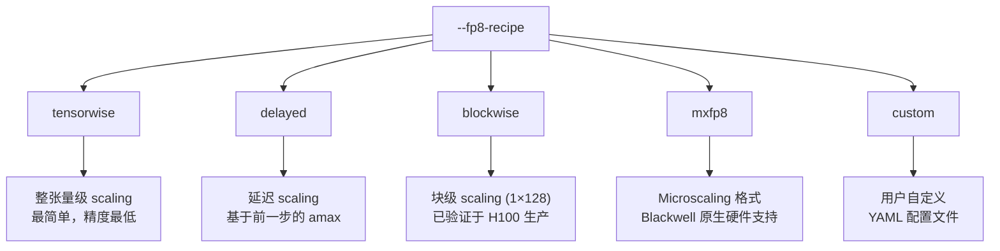
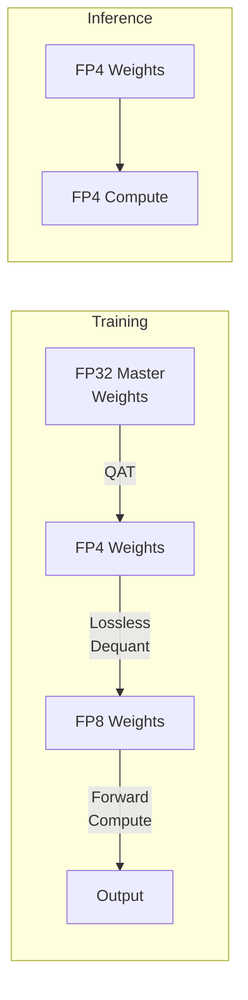

# Megatron-LM 低精度训练：从 BF16 到 FP4 的完整技术栈

> 基于 Megatron-LM dev 分支、Transformer Engine、DeepSeek-V3/V4 实践的综合分析
> 创建日期: 2026-05-06

---

## 1. 精度格式总览

Megatron-LM 通过 Transformer Engine 支持从传统 BF16/FP16 到前沿 FP4 的完整精度梯度：

| 格式 | 指数位 | 尾数位 | 动态范围 | 硬件要求 | Megatron 参数 |
|------|--------|--------|---------|---------|-------------|
| **FP32** | 8 | 23 | 完整 | 所有 GPU | 主权重存储（默认） |
| **BF16** | 8 | 7 | 与 FP32 相同 | Ampere+ | `--bf16` |
| **FP16** | 5 | 10 | 较小 | Volta+ | `--fp16` |
| **FP8 E4M3** | 4 | 3 | ±448 | Hopper/Ada/Blackwell | `--fp8-format e4m3` |
| **FP8 E5M2** | 5 | 2 | ±57344 | Hopper/Ada/Blackwell | `--fp8-format e5m2` |
| **FP8 HYBRID** | — | — | 前向 E4M3 + 反向 E5M2 | Hopper/Ada/Blackwell | `--fp8-format hybrid` |
| **MXFP8** | 8 (共享) | 微缩放 | 逐块可调 | Blackwell/GB200 | `--fp8-recipe mxfp8` |
| **FP4 (E2M1)** | 2 | 1 | 较小 | Blackwell(B200) | 后训练 QAT（DeepSeek-V4 方案） |

---

## 2. FP8 混合精度训练体系

### 2.1 五种 FP8 Recipe

Megatron 通过 `--fp8-recipe` 提供五种策略，定义在 `model_parallel_config.py:196-276`：



#### 各 Recipe 对比

| Recipe | Scaling 粒度 | amax 计算时机 | 精度保持 | 性能开销 |
|--------|------------|-------------|---------|---------|
| `tensorwise` | 单张量 | 实时 | 最低 | 最小 |
| `delayed` | 单张量 | 上一步 | 中等 | 小 |
| `blockwise` | 1×128 / 128×128 | 实时，分块 | 较高 | 中等 |
| `mxfp8` | 硬件块 (32) | 硬件自动 | 高 | 硬件卸载 |
| `custom` | 用户定义 | 用户定义 | 灵活 | 灵活 |

#### Blockwise vs MXFP8（从 Q15 Exam）

- **Blockwise FP8**：软件在子块（1×128 或 128×128）级别做 scale，已在 Hopper (H100) 上生产验证——DeepSeek-V3、Minimax-M2 均使用此方案
- **MXFP8**：基于 Microscaling 格式，Blackwell/GB200 原生硬件支持，无需软件模拟 block scaling，硬件直接处理

### 2.2 FP8 Primary Weights（`fp8_param_gather`）

传统混合精度的显存占用：

$$
M_{\text{traditional}} = \underbrace{4N}_{\text{FP32 master}} + \underbrace{2N}_{\text{BF16 copy}} = 6N \text{ bytes}
$$

FP8 Primary Weights 直接将主权重以 FP8 格式保存：

$$
\begin{aligned}
M_{\text{fp8\_primary}}
&= \underbrace{4N}_{\text{FP32 optimizer states}} + \underbrace{N}_{\text{FP8 weight}} = 5N \text{ bytes}
\end{aligned}
$$

**节省约 17% 的模型参数显存**。前向时直接使用 FP8 weight（或配合更高精度 buffer），省去 BF16 副本。

代码路径：
- 配置：`model_parallel_config.py` 中的 `fp8_param_gather` 参数
- 实现：TE 底层 `quantized_model_init` 上下文管理器，`preserve_high_precision_init_val=True` 时在 CPU 保存高精度初始值

### 2.3 首末层 BF16 保护（`first_last_layers_bf16`）

将模型的前 N 层和后 N 层强制保留为 BF16，原因是：
- **首层**（嵌入层）：处理原始输入分布，FP8 量化误差会放大
- **末层**（logits + loss）：决定训练目标和梯度方向，精度要求最高
- 在精度和效率之间取得平衡

### 2.4 TP 通信与 FP8 的协同

机制 owner 见 [[12_megatron_tp_analysis]] §4.2：

- TE 预分配静态 **User Buffer**，在训练初始化时注册
- `initialize_ub(use_fp8=(args.fp8 is not None))` 根据精度配置调整 buffer
- Pipelined Overlap：将 AllGather/ReduceScatter 拆分为多步 ring-exchange，GEMM 流式消费已到达数据
- Bulk Overlap：利用反向传播中 dgrad/wgrad 与通信无数据依赖的特性，将通信从关键路径剥离

---

## 3. FP4 量化感知训练（DeepSeek-V4 方案）

### 3.1 量化对象



三个量化组件：

| 组件 | 精度 | 加速比 | 关键特性 |
|------|------|--------|---------|
| **MoE Expert Weights** | FP4 (E2M1) | ~2× | FP4→FP8 无损反量化 |
| **CSA QK Path** | FP4 | ~2× | QK 激活完全在 FP4 计算 |
| **Index Scores** | BF16 | 2× (top-k 选择器) | 99.7% KV recall |

### 3.2 无损反量化原理

FP8 (E4M3) 比 FP4 (E2M1) 多 2 个指数位，动态范围更大。FP8 量化块为 128×128 tiles，FP4 子块为 1×32 tiles——只要缩放因子比率在阈值内，FP8 的扩展动态范围可完全吸收 FP4 子块的细粒度缩放信息。

### 3.3 训练方法

- **前向**：FP32 → FP4 量化 → FP8 反量化 → FP8 计算（模拟量化）
- **反向**：Straight-Through Estimator (STE)，梯度直接回传 FP32 主权重
- **推理部署**：FP4 权重 + FP4 计算，真实量化

---

## 4. MoE + 低精度

### 4.1 Grouped GEMM with FP8

Megatron 的 MoE Grouped GEMM 低精度支持：

多个 expert 的小 GEMM 合并为单次 `grouped GEMM` kernel launch，支持 **FP8、MXFP8、BF16**：
- 一次 launch 处理所有 expert，消除多次 kernel 调度开销
- 提高 SM 占用率和 Tensor Core 效率
- cuBLAS grouped GEMM API + custom fused kernel

### 4.2 Router Fusion

融合操作序列：`gate_proj → Top-k → Softmax/SqrtSoftplus → Aux loss`
- 减少多个小 kernel 之间的 global memory 读写
- 使路由决策成为紧凑的 compute-bound 阶段

### 4.3 DeepEP 低精度 A2A

来自 `fused_a2a.py:69-138`：
- `FusedDispatch` / `FusedCombine` 的 `async_finish=True` 实现 stream 间异步
- `allocate_on_comm_stream` 支持通信流上的内存分配，与低精度 GEMM 共享显存带宽

---

## 5. Scaling MoE 论文中的精度实践

来自 `raw/06_moe_and_distributed/Scalable Training of Moe Models with Megatron core-2603.07685v2.pdf`：

论文核心发现与现有知识库的一致性：
1. **MoE 训练对数值精度更敏感**：Token routing 的离散决策放大量化误差
2. **Blockwise FP8 是当前最优选择**：在 H100 上已验证，兼顾精度和性能
3. **MXFP8 是下一代方向**：Blackwell 原生支持，消除软件 scaling 开销
4. **FP4 适用于推理而非训练**：训练阶段仍需要 FP8 以上精度，FP4 QAT 作为后训练补偿

---

## 6. 配置速查表

```bash
# === BF16 基线 ===
--bf16

# === FP8 (Hopper/Ada) ===
--fp8-format hybrid                    # 前向 E4M3 + 反向 E5M2
--fp8-recipe blockwise                 # 推荐：块级 scaling
--fp8-amax-history-len 1024
--fp8-amax-compute-algo max
--fp8-param-gather                     # FP8 Primary Weights
--first-last-layers-bf16 2            # 首末 2 层 BF16

# === MXFP8 (Blackwell) ===
--fp8-recipe mxfp8
--fp8-format e4m3

# === FP4 QAT (后训练，DeepSeek-V4 方案) ===
# 使用 FP4 量化感知训练，在预训练完成后进行
# 主要通过 TE 的 quantized_model_init 上下文管理
```

---

## 7. 相关页面

- [[02_engineering/02_train_frameworks/megatron-lm/index]] — Megatron-LM 知识地图
- [[02_engineering/02_train_frameworks/megatron-lm/23_megatron_precision_cudagraph_fusion_analysis]] — FP8 低精度训练与 CUDA Graph 融合
- [[02_engineering/02_train_frameworks/megatron-lm/12_megatron_tp_analysis]] —— TP user-buffer 重叠中的 FP8 接线；精度 recipe 权威页为 [[02_engineering/02_train_frameworks/megatron-lm/23_megatron_precision_cudagraph_fusion_analysis]]
- [[01_theory/02_pretraining/14_transformer_engine_analysis]] — Transformer Engine 技术分析
- [[01_theory/01_models/deepseek/24_deepseek_v4_fp4_qat_analysis]] — DeepSeek-V4 FP4 QAT
- [[01_theory/01_models/deepseek/12_deepseek_v3_analysis]] — DeepSeek-V3 FP8 实践
- [[01_theory/02_pretraining/12_activation_checkpointing_analysis]] — 激活检查点与精度
- [[01_theory/02_pretraining/20_rl_training_inference_precision_analysis]] — RL 训练推理数值一致性
