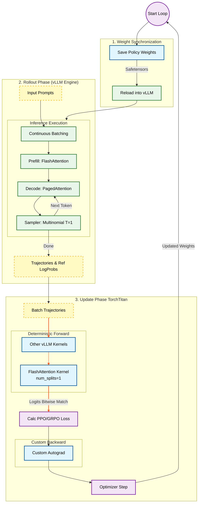

# TorchTitan + vLLM: RL 训练推理数值精度一致性与稳定性分析

## 1. 背景与挑战

在强化学习（RL）训练（如 PPO、GRPO）中，通常包含两个核心阶段：
1.  **Rollout (推理/生成)**：使用当前的策略模型与环境交互，生成轨迹（Samples）。这需要极高的推理速度，通常使用 **vLLM** 等高性能推理引擎。
2.  **Update (训练/更新)**：利用生成的轨迹计算优势（Advantages）和损失（Loss），更新模型参数。这通常在 **PyTorch** 中进行。

### 核心痛点：数值不一致性
当 Rollout 阶段使用 vLLM 的优化内核（如量化、特定的 Flash Attention 实现、融合算子），而 Update 阶段使用标准 PyTorch 算子时，会产生微小的数值差异。
*   **KL 散度漂移**：即使是同一组权重，vLLM 生成的 LogProb 与 PyTorch 计算的 LogProb 可能不完全一致。这会导致 RL 训练初期 KL 散度不为 0（理论上应为 0），破坏训练稳定性。
*   **Off-Policy 问题**：数值误差使得训练实际上是在针对一个微小偏移的“旧”策略进行更新，而非真正的当前策略。

---

## 2. 解决方案：TorchTitan 的 Deterministic vLLM RL

TorchTitan 通过 `experiments/deterministic_vllm_rl` 提供了一套完整的解决方案，核心思想是 **“Forward 用 vLLM，Backward 用 PyTorch (Custom)”**，确保训练时的前向传播与推理时的前向传播**Bitwise Identical（按位完全一致）**。

### 2.1 核心架构与完整流程图

下图展示了 TorchTitan 与 vLLM 深度集成的完整 RL 训练流程，采用左右分栏布局清晰展示了两个阶段的交互。



### 2.2 流程解析

1.  **权重同步 (Weight Sync)**: 训练开始前，TorchTitan 将最新的策略模型权重保存并转换为 vLLM 兼容格式。vLLM Engine 通过高效接口（如 `reload_weights`）加载新权重，确保 Rollout 使用的是最新策略。
2.  **推理生成 (Rollout)**:
    *   vLLM Engine 接收 Prompt。
    *   **Prefill**: 使用 FlashAttention 计算 Prompt 的 KV。
    *   **Decode**: 进入循环生成阶段，利用 **PagedAttention** 管理 KV Cache，配合 **Continuous Batching** 提高吞吐。
    *   **Sampling**: 使用多项式采样（Temperature=1.0）生成多样化回复，并记录每个 Token 的 Reference LogProb。
3.  **确定性训练 (Update)**:
    *   **Forward**: TorchTitan 模型接收 Rollout 生成的完整序列。**关键点**：它调用与 vLLM Prefill 阶段完全相同的 FlashAttention Kernel（`num_splits=1`），确保计算出的 Logits 与 vLLM 生成时的 Logits **按位一致**。
    *   **Loss**: 计算 PPO/GRPO Loss。由于数值一致，初始 KL 散度严格为 0。
    *   **Backward**: 通过自定义的 Autograd Function，利用 PyTorch 的自动微分机制计算梯度，更新模型参数。

---

## 3. 关键组件与 Attention 深度分析

### 3.1 Attention 机制详解

在 `torchtitan/experiments/deterministic_vllm_rl/models/attention.py` 中，`VLLMCompatibleFlashAttention` 类实现了与 vLLM 一致的 Attention 计算。

*   **内核选择 (Kernel Selection)**:
    *   代码明确导入了 `from vllm.vllm_flash_attn import flash_attn_varlen_func`。
    *   这意味着训练阶段使用的是 **FlashAttention (V2/V3)**，而不是 vLLM 推理时常用的 PagedAttention。
    *   **为什么用 FA 而不用 PA？** 训练阶段（Update）通常是对已经生成的完整轨迹进行一次性的 LogProb 计算（Teacher Forcing 模式）。此时不需要 KV Cache 管理（因为没有增量生成），因此使用 FlashAttention 处理变长序列（VarLen）是最高效且标准的方法。

*   **KV Cache 功能**:
    *   **不带 KV Cache**。
    *   `forward` 函数签名如下：
        ```python
        def forward(self, q, k, v, scale=None):
        ```
    *   它直接接收全量的 Query, Key, Value 张量，并没有接收 `block_tables` 或 `past_key_values`。这证实了在训练的 Forward Pass 中，是**全量重算** Attention，不使用 KV Cache。

*   **一致性保证**:
    *   虽然 vLLM 在生成（Decode）阶段通常使用 PagedAttention，但其 Prefill 阶段使用的是 FlashAttention。
    *   RL 的训练 Forward 本质上等价于对“Prompt + Generated Response”进行一次巨大的 Prefill。
    *   通过设置 `num_splits=1`（代码中 `FlashAttnWithBackward.forward` 调用时传入），强制 FlashAttention 串行计算，消除并行规约带来的非确定性误差，从而保证与 vLLM 的 Prefill 结果 Bitwise Identical。

---

## 4. Rollout 过程深度解析 (vLLM Inference)

Rollout 阶段复用了 vLLM 完整的推理引擎，保证了生成效率和样本多样性。

### 4.1 采样策略 (Sampling Strategy)
代码使用 `vllm.SamplingParams` 控制生成过程，核心配置如下：
*   **多样性保证**: 设置 `temperature=1.0`，且未指定 Top-K/Top-P（默认 `top_k=-1`, `top_p=1.0`）。这实际上执行了**多项式采样 (Multinomial Sampling)**，从完整的概率分布中采样 Token。这意味着即使 Logits 相同，每次采样也可能得到不同的 Token，从而保证了 Exploration（探索）。
*   **确定性复现**: 虽然采样具有随机性，但代码中设置了 `seed=42`。这保证了在给定相同权重和 Prompt 的情况下，整个 Batch 的采样结果是可复现的（Pseudo-Random）。
*   **Samples per Prompt**: 通过参数 `n=group_size`，对每个 Prompt 一次性生成多个不同的回答（Group Sampling），用于 GRPO 算法计算组内优势。

### 4.2 执行流程 (Process Breakdown)
整个 Rollout 过程 `VLLMRolloutEngine.generate` 包含以下步骤：

1.  **权重同步 (Weight Sync)**:
    *   TorchTitan (PyTorch) 模型权重转换为 vLLM 格式 (Merged Weights)。
    *   保存为临时 `.safetensors` 文件。
    *   调用 `self.llm.collective_rpc("reload_weights")` 通知 vLLM Worker 重载权重。这是一个**原地更新**，无需重启 vLLM 进程，开销较低。

2.  **推理请求 (Inference Request)**:
    *   将 Prompt 列表发送给 `self.llm.generate`。
    *   `SamplingParams` 设置 `logprobs=1`，要求 vLLM 返回每个生成 Token 的 LogProb。这些 LogProb 将作为 Reference LogProbs 用于计算 KL 散度和 Importance Sampling Ratio。

3.  **vLLM 内部执行**:
    *   **Prefill 阶段**: 使用 **FlashAttention** 处理 Prompt 部分。
    *   **Decode 阶段**: 使用 **PagedAttention (PA)** 管理 KV Cache。这里充分利用了 vLLM 的显存管理优势，将 KV Cache 分块存储在非连续显存中。
    *   **Continuous Batching**: 虽然代码设置了 `enforce_eager=True`（禁用 CUDA Graph 以避免动态形状问题），vLLM 的 **Continuous Batching** 调度器仍然工作。这意味着如果有部分序列先结束，新的序列可以立即插入（或者在 decode 阶段动态组成 Batch），极大提升了吞吐量。

4.  **结果提取**:
    *   从 `RequestOutput` 中提取 `token_ids` 和 `logprobs`。
    *   返回给 TorchTitan 用于后续的 Loss 计算。

### 4.3 基础设施特性
*   **PagedAttention (PA)**: **使用了**。vLLM 的推理核心强依赖 PA 进行 Decode 阶段的 KV Cache 管理，这是其高吞吐的基石。
*   **Continuous Batching**: **使用了**。这是 vLLM Engine 的默认行为，确保 GPU 利用率最大化。

---

## 5. 算子分析与汇总 (Operator Analysis)

该方案不仅统一了 Attention，还统一了其他核心算子，确保 Training Forward 和 Inference Forward 运行相同的 Kernel。

| 算子 (Operator) | 训练 Forward 内核 (Update Phase) | 推理 Forward 内核 (Rollout Phase) | 训练 Backward 实现 | 备注 |
| :--- | :--- | :--- | :--- | :--- |
| **Attention (Prefill)** | `vllm...flash_attn_varlen_func` (FA) | `vllm...flash_attn_varlen_func` (FA) | `FlashAttnWithBackward` | 训练全量计算等价于推理的 Prefill。强制 `num_splits=1`。 |
| **Attention (Decode)** | N/A (训练不涉及增量生成) | **PagedAttention** (PA) | N/A | 推理 Decode 阶段使用 PA，训练 Update 阶段使用 FA。 |
| **RMSNorm** | `vllm...rms_norm` (Triton) | `vllm...rms_norm` (Triton) | PyTorch Native Math | 使用 `RMSNormFunction` 封装，确保前向数值一致。 |
| **SiluAndMul** (SwiGLU) | `vllm...SiluAndMul` | `vllm...SiluAndMul` | PyTorch Native Math | 前向使用 vLLM 融合算子，反向使用 PyTorch 自动微分公式。 |
| **Matmul / Linear** | `torch.matmul` (Patched) | `torch.matmul` (vLLM GEMM) | `torch.matmul` (Patched) | vLLM 的 `batch_invariant` 模式 monkey-patch 了 PyTorch 的 matmul，使其调用 vLLM 的确定性 GEMM 实现。 |
| **RoPE** | PyTorch Native | PyTorch Native / vLLM Kernel | PyTorch Native | 这里的 RoPE 实现使用的是 PyTorch 原生算子，未强制对齐 vLLM Kernel，可能是因为 Element-wise 操作误差可忽略或 vLLM 也兼容此实现。 |

---

## 6. 优势总结

| 特性 | 传统混合方案 (PyTorch Train + vLLM Infer) | TorchTitan 确定性方案 |
| :--- | :--- | :--- |
| **初始 KL 散度** | 非零 (通常 > 1e-5)，存在漂移 | **严格为 0** (Bitwise Identical) |
| **训练稳定性** | 可能因数值误差导致策略更新方向偏差 | 高，梯度计算基于精确一致的概率分布 |
| **推理速度** | 快 (vLLM) | 快 (vLLM) |
| **训练速度** | 快 (PyTorch Native) | 略慢 (因 Python 开销和自定义 Backward)，但可接受 |
| **实现复杂度** | 低 | 高 (需维护自定义 Autograd) |

## 7. 结论

通过在训练的前向传播中复用 vLLM 的高性能、确定性内核，TorchTitan 成功消除了训练与推理之间的“数值鸿沟”。这对于对策略分布极其敏感的 RL 算法（如 PPO/GRPO）至关重要，它保证了 Off-Policy 修正项（Importance Sampling Ratio）能够真实反映策略的变化，而非计算误差。同时，Rollout 阶段完整保留了 vLLM 的 PagedAttention 和 Continuous Batching 等特性，确保了样本生成的高效性。

