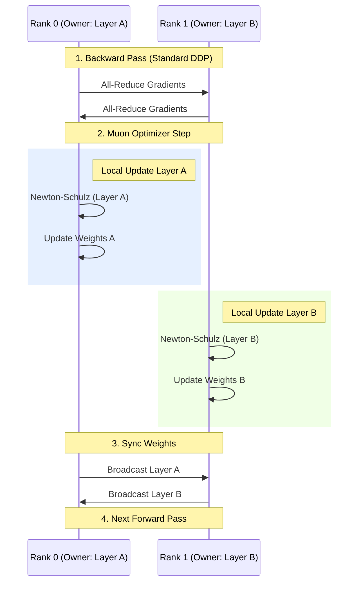

# Muon 优化器：原理解读与 Megatron-LM 实现分析

本文档基于 Muon 优化器论文及 NVIDIA Megatron-LM 的最新代码实现（Merge Request 4106），对 Muon 优化器的核心原理、分布式挑战及其在 Megatron 中的具体工程落地进行深度解析。

## 1. Muon 优化器核心原理

Muon (Momentum Orthogonalized) 是一种专为神经网络（特别是大规模 Transformer）设计的新型优化器。其核心思想是对参数更新量进行**正交化 (Orthogonalization)** 处理。

### 1.1 核心算法：Newton-Schulz 迭代

不同于 AdamW 这种逐元素 (Element-wise) 更新的优化器，Muon 将梯度视为矩阵，并对其进行正交化变换。
Muon 使用 **Newton-Schulz (NS) 迭代** 来逼近矩阵的奇异值分解 (SVD) 或正交化结果，从而使得更新量的谱范数 (Spectral Norm) 受到约束。

**算法步骤 (简化版)**:
1.  **输入**: 梯度矩阵 $G$。
2.  **迭代**: 运行 $K$ 次 Newton-Schulz 迭代（通常 $K=5$）：
    $$X_{k+1} = a X_k + b X_k X_k^T X_k + c X_k (X_k^T X_k)^2$$
    其中 $a, b, c$ 是特定系数。
3.  **缩放**: 对输出矩阵进行缩放（Scaling），以匹配期望的 RMS 或谱范数。
4.  **更新**: 使用处理后的矩阵 $U$ 更新参数 $W$。

---

## 2. 分布式训练中的挑战：Muon vs ZeRO

在分布式训练（如 ZeRO-1/2/3）中，模型参数和优化器状态通常被切分到不同的 GPU (Rank) 上。这对 Muon 提出了挑战。

### 2.1 为什么 Muon 不兼容原生 ZeRO-1？

*   **ZeRO-1 机制**：将完整的参数矩阵 $W$ 切分为 $N$ 个碎片 (Shard)。每个 Rank $i$ 只持有并维护第 $i$ 个碎片 $w_i$ 及其对应的梯度 $g_i$。
*   **Muon 的冲突**：Muon 的 Newton-Schulz 算法是**整体矩阵运算**。
    *   $NS(G) \neq Concat(NS(g_1), NS(g_2), ...)$
    *   如果在切分后的 $g_i$ 上直接运行 Muon，数学上完全不等价，且失去了正交化的物理意义（变成了一种 Block-Diagonal 近似，效果可能很差）。

### 2.2 论文提出的解决方案：Distributed Muon

论文中提出的算法试图在 ZeRO-1 框架下修复这个问题：
1.  **Reduce-Scatter**: 得到分片梯度 $g_i$。
2.  **DP Gather (关键步骤)**: 每个 Rank 临时收集所有其他 Rank 的 $g_j$，拼凑出完整的 $G$。
3.  **Local Compute**: 在完整 $G$ 上跑 Newton-Schulz，得到完整 $U$。
4.  **Discard**: 丢弃不属于自己的部分，只保留 $u_i$。
5.  **Update**: 更新本地 $w_i$。

---

## 3. Megatron-LM 实现分析

在实际的 Megatron-LM 代码中，并没有采用论文中复杂的 "ZeRO-1 + DP Gather" 方案，而是采用了一种更工程化、更高效的 **Layer-wise Partitioning (类 ZeRO-3)** 策略。

### 3.1 核心类架构

*   **`TensorParallelMuon`**: 继承自 `OrthogonalizedOptimizer`。
    *   **TP 感知**: 内置 `newton_schulz_tp` 函数，能够在 Tensor Parallel 组内进行通信。这意味着它处理的是逻辑上完整的矩阵，而不是 TP 切片。
*   **`LayerWiseDistributedOptimizer`**: 一种特殊的分布式优化器封装。
    *   **替代 ZeRO-1**: 显式禁用了 Megatron 原生的 `DistributedOptimizer`。

### 3.2 显存优化策略：Layer-wise Sharding

Megatron 选择的方案类似于 **ZeRO-3**，但是以“层”为粒度，而不是以“Tensor 切片”为粒度。

#### 工作流程：
1.  **参数分配 (Assign)**:
    *   将模型的所有层（Layer 1, Layer 2, ...）分配给不同的 DP Rank。
    *   例如：Rank 0 独占 Layer 1 的 Master Weights；Rank 1 独占 Layer 2 的 Master Weights。
    *   **优势**: 对于 Rank 0 来说，Layer 1 的参数在 DP 维度是**完整**的。

2.  **梯度聚合 (All-Reduce)**:
    *   使用标准的 DDP 流程，所有 Rank 都会计算并同步梯度。Rank 0 内存中也有 Layer 2 的梯度，虽然它不负责更新 Layer 2。

3.  **独立更新 (Optimizer Step)**:
    *   **Rank 0**: 对 Layer 1 运行 Muon。由于参数完整，它可以直接进行矩阵运算，**无需额外的 DP Gather 通信**。
    *   **Rank 1**: 对 Layer 2 运行 Muon。

4.  **参数同步 (All-Gather)**:
    *   更新完成后，Rank 0 将新的 Layer 1 广播给所有人；Rank 1 将新的 Layer 2 广播给所有人。
    *   最终所有 Rank 状态一致。

### 3.3 图示：Megatron Muon 流程

### 3.4 混合精度与混合优化器

*   **ChainedOptimizer**: Muon 仅用于 2D 线性层（Linear Layers）。其他参数（如 Layernorm, Embedding）依然使用 AdamW。Megatron 使用 `ChainedOptimizer` 将两者串联。
*   **TP 处理**: Muon 在 TP 组内通过 `newton_schulz_tp` 进行必要的通信（All-Reduce/All-Gather），确保切分后的矩阵能正确进行正交化。

## 4. 总结

1.  **Muon 原理**: 通过矩阵正交化（Newton-Schulz）约束更新量，适合大规模 Transformer 训练。
2.  **分布式难点**: Muon 需要完整矩阵信息，与 ZeRO-1 的切分机制冲突。
3.  **Megatron 方案**:
    *   **放弃 ZeRO-1**: 显式禁用标准 `DistributedOptimizer`。
    *   **采用 Layer-wise Partitioning**: 将不同层的参数完整分配给不同 Rank。
    *   **优势**: 规避了复杂的 "Gather-Compute-Discard" 流程，利用层级完整性直接计算，同时保留了类似 ZeRO 的显存节省能力。

## Related Pages

- [[01_theory/index]]
- [[llm_initiliaze_analysis]]
- [[megatron_distributed_optimizer_analysis]]
- [[../../02_engineering/02_train_frameworks/distributed_optimizer_deep_dive|distributed_optimizer_deep_dive]] — Adam vs Muon 分布式内存/通信影响的跨框架对比
- [[mHC]]
- [[../../02_engineering/02_train_frameworks/muon_sharded_hsdp_report]] — 分片 Muon 与双网格 HSDP 工程实现分析
