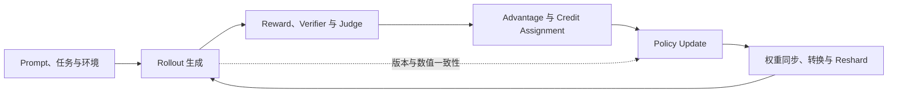

# D01 后训练前沿全景地图：算法目标、在线数据与系统闭环共同定义前沿

> **阶段**：S00 基线冻结与研究地图
> **文档编号**：D01
> **快照日期**：2026-07-28
> **研究主线**：Reasoning RL + Agentic/Coding RL
> **工程视角**：NVIDIA/CUDA 为上游基线，Ascend/NPU 作为映射与差距分析对象
> **阅读导航**：[[courses/posttraining_frontier|阅读课程导读]] · [[13_reasoning_rl_algorithm_evolution_analysis|下一篇 D02]]

---

## 0. 结论先行

当前 LLM 后训练的前沿，已经不能只用“又提出了一个新的 RL loss”来描述。真正决定训练效果与工业可用性的，是下面四个问题能否同时闭环：

1. **优化什么**：token、sequence、trajectory 还是 task outcome；怎样分配 credit，怎样限制策略更新。
2. **用什么数据更新**：样本来自哪个策略版本，允许多大 staleness，是否能正确计算 importance weight。
3. **怎样持续产出数据**：推理服务、环境、verifier、reward、训练器如何并发，长尾轨迹怎样处理。
4. **训练与采样是否真的是“同一个模型”**：相同权重并不自动意味着相同 token probability；kernel、精度、并行切分和推理实现都可能引入 mismatch。

因此，本知识库不把“算法论文”和“RL infra”拆成两条互不相干的线，而是用一个统一闭环研究它们：



**核心判断**：Reasoning RL 和 Agentic RL 的算法设计，正在被在线数据系统的约束重新塑形；与此同时，系统设计也不能只追求吞吐，而必须显式维护 freshness、correctness 和可诊断性。

---

## 1. 研究对象：一个五层后训练栈

| 层次 | 核心对象 | 当前关键问题 | 典型源码入口 | 后续文档 |
|---|---|---|---|---|
| L1 任务与环境 | 数学、代码、搜索、工具调用、SWE 任务 | 环境是否可复现；reward 是否可验证；交互成本如何隐藏 | dataset、sandbox、agent runtime、verifier | D03、D05 |
| L2 Rollout 与数据面 | prompt、response、trajectory、replay/data buffer | 同步还是流式；长尾如何消除；样本版本怎样记录 | rollout worker、inference engine、transfer queue、buffer | D04、D05 |
| L3 学习信号 | reward、advantage、credit assignment、KL | group-relative 信号是否必要；过程与结果奖励怎样组合 | reward manager、advantage estimator | D02、D03 |
| L4 优化与约束 | GRPO/PPO 类目标、sequence-level objective、off-policy correction | clip 粒度；importance ratio 粒度；staleness 可否被校正 | loss、policy trainer、optimizer step | D02、D04 |
| L5 分布式执行 | placement、并行策略、权重同步、reshard、容错 | train/rollout 共置还是解耦；权重怎样低开销刷新；数值语义是否一致 | controller、worker group、Megatron/FSDP、vLLM/SGLang | D05–D11 |

这五层并不是按顺序独立优化的。例如：

- sequence-level clipping 会改变 trainer 需要保存和聚合的数据；
- fully async 会使 policy lag 成为算法变量，而不再只是系统指标；
- agent trajectory 的不定长和环境等待，会改变 GPU 调度与 batch 构造；
- train–inference mismatch 会污染 importance ratio，使一个形式上 on-policy 的实现实际偏离目标分布。

---

## 2. 当前前沿由四组张力组织

### 2.1 Token-level 更新与 sequence/trajectory-level 决策

LLM 生成动作天然以 token 展开，但 reasoning 和 agent task 的成败通常在完整 response、trajectory 或最终任务结果上定义。于是出现两个不完全一致的粒度：

- **估计与优化粒度**：token probability、token advantage、sequence ratio、trajectory return；
- **系统承载粒度**：单条 response、同 prompt 的 group、异步返回的单条 trajectory、跨多轮交互的 episode。

[GSPO（arXiv:2507.18071v2）](https://arxiv.org/abs/2507.18071v2)把 importance ratio 和 clipping 提升到 sequence 粒度；[SAO（arXiv:2607.07508v1）](https://arxiv.org/abs/2607.07508v1)则直接针对异步 Agentic RL 中 group-wise sampling 的不适配，提出 single-rollout 方向。它们共同说明：**算法的统计单位必须与数据实际到达系统的单位相容**。

这不意味着 token-level 方法已经失效，而是后续分析必须明确回答：

- advantage 是怎样广播或分配到 token 的；
- clipping 在什么粒度发生；
- group 构造是否阻塞异步流水；
- trajectory 中不同动作的 credit 是否被粗暴地等同处理。

### 2.2 严格 on-policy 与硬件利用率

同步 RL loop 容易定义样本来自哪个 policy，但会被 rollout 长尾、环境延迟、reward/verifier 延迟和训练阶段切换拖出大量 bubble。Fully async 或 streamed pipeline 可以提高资源利用率，却引入 policy lag、样本分布漂移和 correction 的可信度问题。

这不是“同步落后、异步先进”的单向替代：

- [AReaL（arXiv:2505.24298v5）](https://arxiv.org/abs/2505.24298v5)把可控 staleness 和 staleness-aware 优化作为 fully async 的核心问题；
- [StreamRL（arXiv:2504.15930v1）](https://arxiv.org/abs/2504.15930v1)研究 generation 与 training 的流式解耦；
- [AsyncFlow（arXiv:2507.01663v1）](https://arxiv.org/abs/2507.01663v1)通过 producer–consumer 流水与 staleness threshold 组织异步执行；
- [RollPacker（arXiv:2509.21009v1）](https://arxiv.org/abs/2509.21009v1)则保留同步 policy freshness，用 tail batching、弹性 rollout 和资源调度消除同步系统中的长尾 bubble。
- Kimi K3 则保留同步 phase 和 prompt 内 $K$ 样本组，在完成量达到 $\lambda NK$ 后暂停全局长尾、跨 iteration 恢复，并显式承认 trajectory 会进入 extreme off-policy（Kimi K3 Technical Report §4.1.2，p.13）。

因此 D04 已沿四个维度分析，而不是只比较“同步/异步”两个标签：

1. 样本生成时的 policy version；
2. update 时可接受的最大 lag；
3. correction 所需的 log-prob 语义；
4. 吞吐收益来自 overlap、batching、资源弹性还是允许旧样本。

### 2.3 高吞吐与训练—推理一致性

RL 系统通常使用不同栈承担训练和推理：例如 Megatron/FSDP 训练，vLLM/SGLang rollout。即便权重同步正确，两边仍可能因为 kernel、精度、并行切分、采样实现或 batch-dependent numerics 得到不同的 token probability。

[Diagnosing Training–Inference Mismatch（arXiv:2605.14220v1）](https://arxiv.org/abs/2605.14220v1)在受控设置中把 TIM 单独隔离出来，说明很小的数值差异也可能成为训练稳定性的独立变量。[verl S00 baseline README](https://github.com/verl-project/verl/blob/983cb0f24443f87b3d161fad318445130a620b07/README.md)还公开了面向 zero-mismatch rollout 的 `vexact` 路线；D04 已解释它与 ratio 语义的关系，D07 则把稳定主路径与 experimental 边界落实到固定 commit 的源码。

这使“正确性”成为 infra 的一等指标：

- rollout log-prob 由谁计算；
- training 侧是否重算；
- ratio 的分子分母是否来自语义一致的前向；
- 权重转换后如何验证 tensor、layout 与输出；
- mismatch 是被监控、限制，还是仅被经验性地吸收进 clip。

K3 又增加了 deployment-aware 路线：从 SFT 到 RL 对 routed-expert MXFP4 weights/MXFP8 activations 做 QAT，并让 rollout 与 training 共享量化 scheme（Kimi K3 Technical Report §4.1.1、§4.1.4，pp.12、14）。这减少了量化 scheme 造成的 TIM，但不能代替 kernel、batch、并行 layout 和 sampling backend 的 exact calibration。

### 2.4 通用 RL loop 与 Agentic/Coding 环境

Reasoning RL 常可把一次 response 视作主要优化单位；Agentic/Coding RL 则可能包含多轮工具调用、外部环境、sandbox、测试执行和不可预测的等待时间。这会改变四个底层假设：

- rollout 不再是一次连续的纯 GPU decode；
- reward 不再总能在本地、低成本、无副作用地计算；
- trajectory 长度和完成时间呈现更强长尾；
- credit assignment 不能默认等同于“整条 response 一个标量”。

因此 Agentic RL 不是给 GRPO 外面套一个 agent loop。D03 已把环境协议、trajectory schema、reward/verifier、credit assignment 和异步调度作为同一个机制研究。

K3 把这条线再推进到 harness distribution：tools、system prompt、context management、skills、memories、subagents 都成为动态组合的 white-box environment 模块；XTML preserved-thinking history 则成为必须保留的 trajectory state（Kimi K3 Technical Report §4.2.1，pp.14–15；Appendix F，pp.46–47）。

---

## 3. 四个工业源码样本及固定基线

下面的 commit 是本轮研究的**可复现快照**，不是“永久最新版”。后续文档若升级 baseline，必须记录旧新 commit 和结论变化。

| 框架 | S00 固定 commit | 在研究中的角色 | 当前官方定位所显示的重点 | 深挖前必须保留的疑问 |
|---|---|---|---|---|
| verl | [`983cb0f`](https://github.com/verl-project/verl/commit/983cb0f24443f87b3d161fad318445130a620b07) | 主基线 | 通用 RL 训练生态；训练与 rollout 后端组合较广；fully async、one-step off-policy 等仍有 experimental 路径 | experimental 与稳定主路径的边界；权重同步/reshard 的真实调用链；vexact 的覆盖范围 |
| slime | [`aaf5c20`](https://github.com/THUDM/slime/commit/aaf5c2092b01219fa0d5c2d323741d409086ca32) | 性能与前沿对照 | Megatron + SGLang；`DataSource`/buffer；NCCL、tensor、disk、delta 多种权重传输；可选 warm async producer | 官方性能结论需在固定配置下复核；producer queue 的版本准入和故障语义；核心仓库能力与 Relax 等生态组件的边界 |
| AReaL | [`b23fa6c`](https://github.com/areal-project/AReaL/commit/b23fa6cf9c8edfebcf055079ab78913128bc4579) | Fully async 与 Agentic 对照 | AReaL 2.0 将 training、inference、agent、weight update 服务化；Hermes 在线 RL loop；含 SWE/Agentic 路径 | 论文版本与 2.0 源码代际如何对应；staleness 控制实际落在哪些组件；Ascend 分支与主线差异 |
| ROLL | [`370cb24`](https://github.com/alibaba/ROLL/commit/370cb24c1036ea9145365478fcc40612b2186fc8) | 多后端、异构与 Ascend 专项 | 多 role 的 Ray 架构；Strategy 抽象；Megatron/FSDP2；vLLM/SGLang；AutoDeviceMapping；提供 Ascend 使用路径 | 普通 RLVR 与 Agentic RL 的 async 状态并不相同；Strategy 抽象是否真正屏蔽后端差异；NPU 功能/性能缺口 |

框架定位的项目方说明固定在同一 commit 的 README：[verl](https://github.com/verl-project/verl/blob/983cb0f24443f87b3d161fad318445130a620b07/README.md)、[slime](https://github.com/THUDM/slime/blob/aaf5c2092b01219fa0d5c2d323741d409086ca32/README.md)、[AReaL](https://github.com/areal-project/AReaL/blob/b23fa6cf9c8edfebcf055079ab78913128bc4579/README.md)、[ROLL](https://github.com/alibaba/ROLL/blob/370cb24c1036ea9145365478fcc40612b2186fc8/README.md)。这些链接只证明项目在该版本公开声明的定位；D07–D10 已进一步用可达源码、示例和测试边界复核。

K3 不加入这张“工业源码样本”表。其官方仓库 `0797decb` 提供报告而没有 RL trainer、rollout 或 MOPD 训练源码，所以 D12 把它作为**项目级工业设计案例**，不作为第五个可追调用链的框架。

### 3.1 为什么不把四个框架排成一个总榜

它们的目标函数不同：

- verl 更适合作为**覆盖面和可读性主基线**；
- slime 更适合观察**高性能训练—生成解耦与最新系统机制**；
- AReaL 更适合研究**fully async、online agent loop 与服务化边界**；
- ROLL 更适合研究**Strategy 抽象、多后端、异构资源和 Ascend 落地**。

直接比较“谁最快”会混淆模型、集群、训练算法、rollout 长度、环境、后端版本和 freshness 约束。D06 的比较单位是**能力与机制**，性能数字只在配置可比、来源可追踪时使用。

### 3.2 源码活跃不等于本地资料仍然有效

本知识库已有的 verl 深挖基于较早的 `8a694930`，当前 S00 baseline 已变为 `983cb0f`。因此旧文档可复用它对角色划分、HybridFlow 和部分调用链的解释，但涉及以下内容时必须重新定位源码：

- 类名、模块目录和入口命令；
- rollout backend 与训练 backend 的组合；
- 权重同步、device mesh 和 reshard；
- fully async、one-step off-policy、VLA、vexact 等新路径；
- fault tolerance 与 metrics。

本研究已把四个框架都固定到 S00 commit；后续升级时仍不能用旧 checkout 中“没看到”推断当前官方仓库不支持某项能力。

---

## 4. 算法地图：从 GRPO 到异步 Agentic 优化

这张表不是按论文热度排序，而是按“改变了后训练闭环中的哪个约束”组织。

| 方向 | 代表来源 | 主要改变 | 系统含义 | 本库处理 |
|---|---|---|---|---|
| 纯 RL 激发 reasoning | [DeepSeek-R1，arXiv:2501.12948v2](https://arxiv.org/abs/2501.12948v2) | 展示无需先依赖大规模 SFT 也能通过 RL 激发可观察的 reasoning 行为 | 需要规模化、可验证的 reasoning rollout 与稳定训练闭环 | D02 |
| 工程化 GRPO 改造 | [DAPO，arXiv:2503.14476v2](https://arxiv.org/abs/2503.14476v2) | decoupled clipping、动态采样等组合改造 | rollout filtering、batch 动态性和 loss 逻辑紧密耦合 | D02、D07 |
| 无偏 group-relative reducer | [Dr. GRPO，arXiv:2503.20783v2](https://arxiv.org/abs/2503.20783v2) | 去除长度与组内标准差带来的偏置源 | reducer、mask、归一化分母必须成为可审计配置 | D02 |
| Sequence-level policy optimization | [GSPO，arXiv:2507.18071v2](https://arxiv.org/abs/2507.18071v2) | sequence-level ratio 与 clipping | trainer 的统计、聚合与有效样本单位改变 | D02、D04 |
| Fully asynchronous RL | [AReaL，arXiv:2505.24298v5](https://arxiv.org/abs/2505.24298v5) | policy lag 成为显式控制和优化变量 | 数据版本、staleness、weight update 服务成为核心组件 | D04、D09 |
| Streamed / producer–consumer RL | [StreamRL](https://arxiv.org/abs/2504.15930v1)、[AsyncFlow](https://arxiv.org/abs/2507.01663v1) | generation、storage、training 形成流式流水 | backpressure、buffer、传输、故障恢复影响算法数据分布 | D04、D05 |
| Freshness-preserving synchronous optimization | [RollPacker，arXiv:2509.21009v1](https://arxiv.org/abs/2509.21009v1) | 在不主动放宽 policy freshness 的前提下消除 rollout 长尾 | tail batching、弹性资源与 streaming training 成为替代路径 | D04、D05 |
| Agent trajectory credit | [RAGEN，arXiv:2504.20073v2](https://arxiv.org/abs/2504.20073v2)、[Agent Lightning，arXiv:2508.03680v1](https://arxiv.org/abs/2508.03680v1) | 从最终任务回报扩展到状态、转移和多轮 credit | 环境事件、reward provenance 与可重放 trajectory 进入训练 schema | D03、D05 |
| Single-rollout Agentic RL | [SAO，arXiv:2607.07508v1](https://arxiv.org/abs/2607.07508v1) | 让优化单位适应异步返回的单条 trajectory | 降低 group barrier，但需重新审视估计方差、clip 与 credit | D03、D04 |
| Expert RL → on-policy consolidation | [Kimi K3 Technical Report](https://github.com/MoonshotAI/Kimi-K3/blob/0797decb18ab079de86f991b87a64b81ec15a3c2/k3_tech_report.pdf) §4.1 | 3 领域 × 3 effort 专家经 MOPD 合并为统一 policy | student on-policy token、teacher routing 与 dense reward 进入同一 RL infra | D02、D12 |
| Phase-partial long-horizon rollout | Kimi K3 Technical Report §4.1.2、§5.3 | 达到 $\lambda NK$ 后暂停全局长尾，但保留 prompt 内 $K$ group | per-call version、KV continuation、sandbox resume 和 stale-data regularization 成为联合状态 | D03–D05、D12 |
| Train–inference consistency | [Diagnosing TIM，arXiv:2605.14220v1](https://arxiv.org/abs/2605.14220v1)、[Beyond Precision，arXiv:2602.01826v1](https://arxiv.org/abs/2602.01826v1)、[MIPI/MIPU，arXiv:2606.29526v1](https://arxiv.org/abs/2606.29526v1) | 从隔离数值差异扩展到动态检测、监控和校正 | kernel、precision、log-prob、policy version 与 ratio telemetry 进入 RL 正确性边界 | D04、D05、D07 |

### 4.1 暂不做出的三个结论

1. **不宣布某一种 optimizer 已经统一胜出。** 公开结果经常跨模型、任务、数据和系统配置，不适合仅按最终分数横比。
2. **不把异步等同于 off-policy。** 是否 off-policy 取决于样本分布、policy version 和使用方式；异步只是产生 lag 的常见系统原因。
3. **不把 throughput 当成独立指标。** 如果吞吐提升来自放宽 freshness、减少验证或改变有效 batch，它必须与算法语义一起报告。

---

## 5. Infra 地图：关键机制而不是组件名词表

### 5.1 控制面、数据面和权重面

工业后训练框架可以先拆成三个相互约束的平面：

| 平面 | 负责什么 | 需要追踪的源码证据 |
|---|---|---|
| 控制面 | role 创建、placement、状态机、调度、backpressure、失败处理 | controller → worker group → task/actor 的调用链；资源声明；重试与恢复 |
| 数据面 | prompt/trajectory/log-prob/reward/advantage 的产生、传输、缓存和消费 | schema；queue/buffer；版本字段；序列化；批构造；丢弃规则 |
| 权重面 | trainer 权重导出、格式转换、通信、加载、reshard 与版本发布 | 参数遍历；collective；layout 转换；版本提交点；加载完成信号；一致性校验 |

只看架构图会遗漏最容易出错的边界：例如“权重同步完成”究竟表示字节传完、所有 rank 加载完成，还是新 rollout 已经只使用新版本。D05 已用消息顺序和所有权边界定义这类提交语义。

### 5.2 Placement 与 parallelism 是两套问题

- **Placement** 回答训练、rollout、reward、agent/environment 使用哪些设备，是否 colocate，何时复用显存。
- **Parallelism** 回答单个 role 内部如何使用 DP/TP/PP/CP/EP/FSDP，参数和 KV cache 如何切分。

二者的交点是 reshard 与生命周期：训练布局通常不等于推理布局，colocation 还要求在 phase 切换时管理模型参数、optimizer state、KV cache 和临时 buffer。后续源码分析不能只罗列“支持 TP/PP/EP”，而必须定位：

1. mesh/group 在哪里创建；
2. 参数在什么 layout 下持有；
3. weight update 前后怎样转换；
4. 显存释放或 offload 由谁触发；
5. 失败时哪一侧拥有可恢复状态。

### 5.3 CUDA 主线与 Ascend 映射

本研究采用“先解释 CUDA 上游机制，再映射 Ascend”的顺序，避免把 NPU 支持简化为安装说明。每个机制会检查四层：

| 层次 | CUDA 侧问题 | Ascend 侧映射问题 |
|---|---|---|
| 框架接口 | PyTorch/Ray/Megatron/FSDP 如何组织 role | 接口兼容是否完整，是否需要分支或 monkey patch |
| 通信与 layout | NCCL、DTensor/device mesh、参数广播/AllGather | HCCL 与 device mesh 支持；collective 和 layout 限制 |
| Kernel 与推理后端 | CUDA kernel、FlashAttention、vLLM/SGLang | torch_npu/CANN、推理引擎与算子覆盖；数值语义差异 |
| 运维与诊断 | profiler、metrics、故障恢复、镜像版本 | 工具链成熟度、错误可观测性、版本耦合和恢复路径 |

阅读时先用 D10 理解 ROLL 的 Strategy/AutoDeviceMapping 与 Ascend 路径，再用 D11 查看跨框架的 CUDA–Ascend 差距矩阵。

---

## 6. 既有知识的复用与重新验证

旧资料不会被丢弃，但也不会无条件当作当前事实。本研究采用以下迁移规则：

| 既有页面 | 可直接复用 | 必须重新验证 |
|---|---|---|
| [[01_theory/04_posttraining/20_grpo_analysis|GRPO 原理与实现]] | 公式背景、group-relative advantage 的基本解释 | 与最新论文版本、具体框架 loss 实现和 on-policy 假设的对应 |
| [[01_theory/04_posttraining/21_dapo_analysis|DAPO 深度解析]] | DAPO 组件的概念拆解 | 论文 v2、verl 当前实现入口、动态采样对数据面的影响 |
| [[01_theory/04_posttraining/22_gspo_analysis|GSPO 深度解析]] | sequence-level objective 的背景 | 论文 v2、框架实际支持状态、与异步样本的组合语义 |
| [[02_engineering/04_posttrain_frameworks/12_rl_infra_efficiency_analysis|RL Infra 效率分析]] | 训练/rollout bubble、资源利用率的分析框架 | 性能数字、当前项目能力、同步与异步的边界 |
| [[02_engineering/04_posttrain_frameworks/11_rl_sandbox_design_analysis|RL Sandbox 设计]] | sandbox、verifier、agent environment 的问题清单 | 安全边界、生产实现、最新 coding-agent runtime |
| [[02_engineering/04_posttrain_frameworks/verl/index|verl 系列分析]] | HybridFlow/role 视角和历史调用链 | 从旧 baseline `8a694930` 迁移到 `983cb0f` 后的所有源码 locator |

迁移后的深挖页面统一放在 `wiki/03_posttraining/`，原页面作为历史背景和专题材料保留。这样既避免重复抄写，也不再让“算法”和“工程”分居两个目录。

---

## 7. 已完成的深挖顺序

| 顺序 | 编号与文档 | 阶段 | 必须回答的核心问题 | 当前状态 |
|---:|---|---|---|---|
| 1 | 课程导读 [[courses/posttraining_frontier|LLM 后训练前沿阅读课程]] | S00/S05 | 应按什么先修关系阅读，怎样从论文定位到源码和运行证据（原 D00，已随 kb-reorg P5 courses 化解散） | 已完成 |
| 2 | D01 本文 | S00 | 前沿问题怎样由算法、数据、系统和硬件共同定义 | 已完成 |
| 3 | D02 [[13_reasoning_rl_algorithm_evolution_analysis|Reasoning RL 算法演进]] | S01 | GRPO、DAPO、GSPO 及后续方法究竟改变了什么估计量与约束 | 已完成 |
| 4 | D03 [[24_agentic_rl_algorithm_analysis|Agentic RL 算法与环境]] | S01 | 多轮 trajectory、工具调用和 coding task 怎样改变 reward 与 credit | 已完成 |
| 5 | D04 [[25_on_policy_off_policy_staleness_analysis|On-policy、Off-policy 与 Staleness]] | S01 | policy lag 如何测量、校正和限制；TIM 如何影响 ratio | 已完成 |
| 6 | D05 [[01_posttraining_infra_mechanism_analysis|后训练 Infra 核心机制]] | S01 | control/data/weight 三平面的所有权、并发和故障语义是什么 | 已完成 |
| 7 | D06 [[30_rl_framework_comparison|四框架机制对比]] | S02/S05 | 在统一术语和约束下，各框架的真实能力边界是什么 | 已完成 |
| 8 | D07 [[10_verl_end_to_end_iteration_analysis|verl 单次迭代端到端源码]] | S02 | 一批数据怎样穿过 rollout、reward、advantage、update 和 weight sync | 已完成 |
| 9 | D08 [[01_slime_architecture_overview_analysis|slime 架构与高性能路径]] | S03 | DataSource、buffer、Megatron/SGLang 与 async producer 怎样协同 | 已完成；完整实现域见 [[slime/index]] |
| 10 | D09 [[21_areal_async_architecture_analysis|AReaL Fully Async 架构]] | S03 | 微服务、Hermes、staleness control 与 agent trajectory 怎样闭环 | 已完成 |
| 11 | D10 [[22_roll_strategy_and_ascend_analysis|ROLL Strategy、异构与 Ascend]] | S04 | Strategy 抽象、AutoDeviceMapping 和 Ascend 路径的真实边界 | 已完成 |
| 12 | D11 [[31_cuda_ascend_posttraining_stack_comparison|CUDA–Ascend 后训练栈对照]] | S04 | 算子、通信、推理、并行、诊断和性能差距分别在哪里 | 已完成 |
| 13 | D12 [[24_kimi_k3_posttraining_case_study_analysis\|Kimi K3 后训练案例]] | S05 | 九专家与 MOPD、partial rollout、1M agent state、QAT 和 draft model 怎样形成部署闭环 | 已完成 |

---

## 8. 证据等级与时效性规则

后续页面统一区分三类陈述：

1. **已验证事实**：能定位到固定 commit 的文件/符号/行，或固定版本论文的章节、公式和实验。
2. **项目方声明**：README、发布说明或官方博客中的能力/性能描述；明确标注为官方声明，不自动视为独立复现。
3. **综合判断**：基于多个事实做出的架构推断或选型建议；说明推理链和适用前提。

本页中的框架能力描述主要来自各项目官方仓库在固定 baseline 附近的公开说明；论文方向来自所列 arXiv 固定版本；K3 案例固定于 2026-07-28 的 `0797decb` 报告。D07–D10 已把框架级描述下钻为：

```text
入口命令
  → controller / trainer
  → role 与 worker
  → 数据结构与消息
  → collective / RPC / queue
  → model forward / loss / optimizer
  → weight publish / rollout refresh
```

如果源码证据与 README 表述不一致，以固定 commit 的实际可达调用路径为准，并记录差异。

---

## 9. 本地图的边界

- 这不是后训练论文的穷举清单，而是服务于 Reasoning RL、Agentic/Coding RL 和工业源码阅读的主干地图。
- SFT、DPO/偏好优化、reward modeling 会在影响主线机制时补充，不单独扩展成同等规模的研究分支。
- NeMo RL、Prime-RL、Relax、rLLM、AgentRL 等项目保留在观察池；只有当它们能解释四个主样本没有覆盖的关键机制时，才升级为深挖对象。
- 性能比较必须绑定模型、硬件、后端版本、并行配置、序列长度、算法与 freshness 条件；不收录脱离配置的排行榜。

---

## Related Pages

- [[courses/posttraining_frontier|LLM 后训练前沿阅读课程]] — 阅读路线与六级能力门槛(原 D00)
- [[24_kimi_k3_posttraining_case_study_analysis|D12 Kimi K3 后训练案例]]
- [[01_theory/04_posttraining/index|后训练旧目录索引]]
- [[02_engineering/04_posttrain_frameworks/verl/index|verl 既有分析索引]]
- [[02_engineering/04_posttrain_frameworks/12_rl_infra_efficiency_analysis|RL Infra 效率分析]]
- [[02_engineering/04_posttrain_frameworks/11_rl_sandbox_design_analysis|RL Sandbox 设计]]
