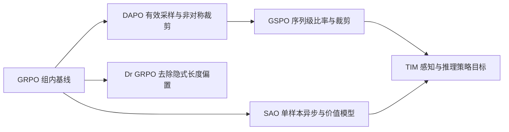

# D02 Reasoning RL 算法演进

> **阶段**：S01
> **文档编号**：D02
> **快照日期**：2026-07-28
> **证据基线**：固定 arXiv 版本与四框架 S00 commit，完整台账见 `docs/research/2026-07-27-posttraining-source-ledger.md`
> **结论先行**：前沿不是简单地从 GRPO 换一个缩写，而是在修正四类对象：统计单位、有效样本分布、行为策略比率和训练—推理一致性。
> **阅读导航**：[[01_posttraining_frontier_map_analysis|上一篇 D01]] · [[24_agentic_rl_algorithm_analysis|下一篇 D03]]
> **定位**（2026-07-31 kb-reorg P5）：本页是 GRPO/DAPO/Dr.GRPO/GSPO/SAO 公式演进与工程语义的统一权威页。各算法的论文元数据、原始实验数字与消融见 [[20_grpo_analysis]]/[[21_dapo_analysis]]/[[22_gspo_analysis]]；verl 的注册表实现与 config key→代码锚点见 [[15_verl_rl_algorithms_analysis]]。

---

## 1. 先回答一个常见误解

“verl 还在 rollout 多个对照样本，是不是过时了？”——**不是**。

组内对照仍是 GRPO/DAPO/GSPO 的 baseline 与 advantage estimator。真正可能过时的是把以下设计捆在一起：

- 必须等同题的全部 response 完成才开始训练；
- 不记录 behavior policy 版本，只把“最新一批”口头视作 on-policy；
- 无条件使用 response-length mean、group std 和 token ratio；
- 训练端重算 log-prob，却不测 rollout 与 train engine 的数值差。

SAO 的 single-rollout 是另一组偏差—方差—调度折衷，并没有证明 group rollout 普遍无效。它用 value model 和更严格的 token mask 补回单样本高方差；因此“一个样本”不是免费升级。

Kimi K3 又给出一个工业反例：它仍为每个 prompt 采 $K$ 条 completion，并在同题 $K$ 条全部完成后才送优化；partial rollout 打破的是全局 $N\times K$ 的长尾等待，而不是 $K$-response completion/dispatch boundary。报告没有重述所有任务的 advantage estimator，不能把这条调度边界扩大为通用统计公式（Kimi K3 Technical Report §4.1.2，p.13；详见 [[24_kimi_k3_posttraining_case_study_analysis|D12]]）。

## 2. 统一符号

对 prompt $x$，采样 response $y_i=(y_{i,1},\ldots,y_{i,T_i})$：

- $\mu$：真正生成 token 的 inference/behavior policy；
- $\pi_{\text{old}}$：近端更新锚点；
- $\pi_\theta$：当前训练 policy；
- $\pi_{\text{ref}}$：KL 参考 policy；
- $A_i$ 或 $A_{i,t}$：sequence 或 token credit；
- $r_{i,t}=\pi_\theta(y_{i,t}\mid s_{i,t})/\pi_{\text{old}}(y_{i,t}\mid s_{i,t})$。

基础 clipped surrogate 为：

$$
L=\mathbb E_{i,t}\left[
\min\left(r_{i,t}A_{i,t},
\operatorname{clip}(r_{i,t},1-\epsilon_l,1+\epsilon_h)A_{i,t}\right)
\right].
$$

公式看起来相近，实际语义由“谁生成样本、ratio 分母是谁、在哪个维度归一化和聚合”决定。

## 3. 演进主线



### 3.1 GRPO：critic-free 不等于 assumption-free

[DeepSeekMath v3](https://arxiv.org/abs/2402.03300v3) §4.1.1、Eq. 21 与 Algorithm 1 给出的核心是：对同一问题采样 $G$ 个输出，以组内 reward 的均值和标准差估计 advantage，并取消单独 value model。

$$
\hat A_i=\frac{R_i-\operatorname{mean}(R_1,\ldots,R_G)}
{\operatorname{std}(R_1,\ldots,R_G)+\delta}.
$$

它带来两个系统约束：

1. group 是不可随意拆散的统计单位；
2. 全 0 或全 1 reward group 没有有效相对信号。

因此 group rollout 不是“对照样本的旧习惯”，而是 estimator 的输入。可以优化 barrier，但不能在不改 estimator 的前提下任意拆组。

### 3.2 DAPO：同时改采样分布和 loss 权重

[DAPO v2](https://arxiv.org/abs/2503.14476v2) §3.1–3.4、Eq. 8–13 提出四个联动机制：

| 机制 | 真正改变 | Infra 要求 | 风险 |
|---|---|---|---|
| Clip-Higher | $\epsilon_l$ 与 $\epsilon_h$ 解耦 | 记录正负 advantage 与 clip fraction | 增大上界并非总能防 entropy collapse |
| Dynamic Sampling | 丢弃全同 reward group 并补采 | buffer、补采预算、group 完整性 | 训练分布已被可学习性过滤 |
| Token-Level Loss | 由 sample mean 改为有效 token 全局聚合 | 精确 response mask 与 token count | 长 response 权重上升 |
| Overlong Shaping | 在硬截断前增加平滑惩罚 | 保存 finish reason 与真实长度 | 可能奖励“短而未完成” |

论文 Table 1 的增益是完整 recipe、Qwen2.5-32B、20,480 generation cap 等条件下的结果，不能把单个组件宣传为无条件收益。

### 3.3 Dr. GRPO：loss reducer 也是算法

[Understanding R1-Zero-Like Training v2](https://arxiv.org/abs/2503.20783v2) §3.1–3.2、Fig. 4–5 指出：

- 每 response 除以自己的长度会造成 response-level length bias；
- 再除 group reward std 会让不同问题组获得不同权重；
- 用固定最大长度或 batch/global token divisor 才能更接近目标 policy gradient。

这件事的工业含义很直接：算法实现不能只审 `ratio * advantage`，还要审 `loss.sum() / divisor`。verl 当前 commit 的 policy loss 与 reducer 入口集中在 `verl/trainer/ppo/core_algos.py:1279-1358`，修改归一化应从这里和数据 mask 一起检查。

### 3.4 GSPO：把 ratio 和 reward 的统计单位重新对齐

[GSPO v2](https://arxiv.org/abs/2507.18071v2) §4.1 定义长度归一化的 sequence ratio：

$$
s_i(\theta)=
\exp\left[
\frac{1}{T_i}\sum_t
\log\frac{\pi_\theta(y_{i,t}\mid s_{i,t})}
{\pi_{\text{old}}(y_{i,t}\mid s_{i,t})}
\right].
$$

随后整条 response 共同接受或拒绝 clipping。其主张不是“token 不重要”，而是 sequence reward、sequence importance weight 与 sequence clipping 应保持同一统计语义。§4.3 的 GSPO-token 说明，在给同一 response 的 token 相同 advantage 和 clip mask 时，可保留 token 计算接口。

verl 的固定快照已有 GSPO 注册与 sequence clipping：`verl/trainer/ppo/core_algos.py:1538-1594`。这证明接口和实现可达，不自动证明任意模型/后端下的稳定性。

### 3.5 SAO：用 critic 换掉 group barrier

[SAO v1](https://arxiv.org/abs/2607.07508v1) §3 与 Fig. 2 面向异步 agentic workload：

- 每 prompt 只采一个 rollout，完成即可入训；
- 直接使用 rollout engine log-prob；
- 对两侧偏离都做严格 token-level mask；
- critic 更新频率高于 actor，并冻结 value model attention 的部分参数。

收益来自取消 group 完成 barrier 和更接近真实在线流量；代价是恢复 value model、提高 estimator 方差、加强版本与 log-prob 可信度要求。它与 GRPO/GSPO 是并列设计点，不是线性替代关系。

### 3.6 Kimi K3：先训练九个专家，再用 MOPD 合并

K3 把“优化一个 policy”和“合并多个 specialist”拆成两个问题：先按三个领域与 `low/high/max` 三档 reasoning effort 训练九个专家，再用 Multi-Teacher On-Policy Distillation（MOPD）让统一 student 在自己采样的 token 上接受对应 teacher 的 clipped dense reward 完成合并；完整 Eq. 15、reasoning-effort 预算约束公式与 partial rollout 的组边界分析见 [[24_kimi_k3_posttraining_case_study_analysis|D12 Kimi K3 后训练案例]] §2.2、§3、§4。

## 4. 真正改变了什么

| 方法 | 优化单位 | advantage | ratio/clip | 采样结构 | 关键系统不变量 |
|---|---|---|---|---|---|
| GRPO | token loss，group baseline | group-relative sequence reward | token ratio | 每 prompt $G$ 条 | group 不可破坏 |
| DAPO | 全局有效 token | group-relative | 非对称 token clip | 动态补齐有效 group | 过滤后 batch 仍满足目标规模 |
| Dr. GRPO | token sum 配固定 divisor | 去 std 或无偏 baseline | PPO 类 | group | reducer 不引入长度权重 |
| GSPO | sequence；可 token 化实现 | group-relative sequence reward | sequence ratio/clip | group | 整条 response 同一 clip 决策 |
| SAO | token | value estimator | rollout log-prob + 双侧 mask | 单 response 流 | behavior log-prob 与 version 可审计 |
| K3 MOPD | student token | 对应 domain/effort teacher 的 clipped dense reward | teacher/student log-ratio 作为 reward | student on-policy rollout，九 teacher | teacher 选择、effort 条件和 student token 严格对齐 |

## 5. 从公式推回 batch schema

最小工业 schema 不应只含 `input_ids`：

```text
prompt_id, group_id, trajectory_id
policy_version, engine_id, sampling_config_hash
input_ids, response_mask, finish_reason
rollout_log_probs, recomputed_old_log_probs
reward_components, reward, advantage
valid_token_count, response_length
```

若使用 GSPO，再增加 sequence log-ratio 与 sequence clip mask；若使用动态采样，记录 rejected reason 和补采次数；若使用 SAO，记录 critic version。

若使用 K3 类 partial rollout/MOPD，还要增加 `continuation_id`、`pause_iteration`、`resume_iteration`、`policy_version_per_call`、`teacher_domain`、`teacher_effort` 和 `teacher_log_probs`。这些字段是从报告机制推导的最小可审计 schema；K3 没有公开实际 trainer schema。

## 6. 选择算法的工程决策

| Workload | 首选起点 | 原因 | 必做对照 |
|---|---|---|---|
| 同题可并行、规则 reward、推理长度相近 | GRPO/Dr. GRPO | 简单且无需 critic | reducer 与 group-std 消融 |
| 长 CoT、无效 group 多 | DAPO | 动态采样与 token 聚合 | 过滤分布、overlong shaping |
| MoE/长序列出现 token clip 抖动 | GSPO | sequence ratio 与 reward 对齐 | sequence clip fraction、TIM |
| 长尾 agent/coding、每题只能得到一次反馈 | SAO/PPO 类 | 无 group barrier | critic error、version lag、rollout log-prob |
| 多领域、多 effort 专家需合为一个部署模型 | MOPD 类 consolidation | student on-policy 状态上接受对应 teacher 的 dense signal | 单 teacher、离线 KD、参数合并与 teacher-routing 消融 |

最终判断不是看算法名，而是检查：

1. estimator 的统计单位是否被调度器保持；
2. behavior、old、current、reference 四个 policy 是否区分；
3. reducer 是否隐式重加权；
4. rollout log-prob 是否可信；
5. freshness 与 TIM 是否有独立测量。

## Related Pages

- [[24_agentic_rl_algorithm_analysis|D03 Agentic RL 算法与环境]]
- [[25_on_policy_off_policy_staleness_analysis|D04 On-policy、Off-policy 与 Staleness]]
- [[24_kimi_k3_posttraining_case_study_analysis|D12 Kimi K3 后训练案例]]
- [[20_grpo_analysis|GRPO 论文分析(元数据/原始实验数字)]]
- [[21_dapo_analysis|DAPO 论文分析(元数据/原始实验数字)]]
- [[22_gspo_analysis|GSPO 论文分析(元数据/原始实验数字)]]
- [[15_verl_rl_algorithms_analysis|verl RL 算法全家桶(注册表+代码锚点)]]
