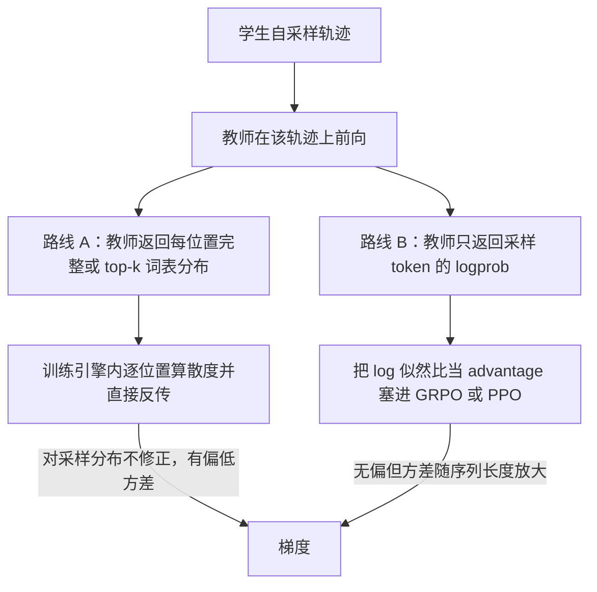

# 在线策略蒸馏（OPD）：形式化、与 RL 的统一视角、两条实现路线

> 本页是 OPD 的**主线权威页**：给出定义与坐标系、把"OPD 是 KL 约束 RL 的稠密奖励特例"这一论点**从头推导**出来（而非仅引用结论）、并解释 2026 年工业界两条实现路线为何是同一个偏差-方差权衡的两端。散度选择的演进见 [[15_opd_divergence_and_objective_evolution_analysis]]；工业谱系见 [[32_opd_industrial_landscape_analysis]]；有效性与失败模式见 [[33_opd_effectiveness_and_failure_modes_analysis]]；系统与基建见 [[13_opd_infra_mechanism_analysis]]。
>
> **来源与保真度**：本页素材来自 仓库外的 OPD 调研稿目录 `opd-survey/`（2026-08-10 基线，主稿 + 姊妹篇 + 八份底稿共 10 份；**按用户决定未纳入 `raw/`**，引用时请自行取用该目录）（一份 2026-08-10 基线的 OPD 综述调研稿及其八份底稿，作者对全部主张做了一手核实并显式标注了 ⚠️ 二手 / 【推断】三级可信度）。本页在其之上做了两件事：**(a) 独立回一手 PDF/页面复核了承载核心论点的数字与逐字引文**（结果见 §7）；**(b) 补齐源稿只陈述结论而未给推导的数学**（§2–§3，凡标「本页推导」者为标准数学推演，不依赖任何 2026 论文的内部结论）。凡标 ⚠️ 者为二手或未能独立核实，引用前需自行查证。
>
> 最后更新: 2026-08-11

---

## 1. 定义与坐标系

### 1.1 一句话定义

**在线策略蒸馏（On-Policy Distillation, OPD）：由学生模型自采样轨迹，教师模型对其逐 token 施加分布级监督。**

Thinking Machines Lab 博客（Kevin Lu, 2025-10-27, DOI 10.64434/tml.20251026）给出的工业界通行表述是 "sample trajectories from the *student* model and use a high-performing teacher to grade *each token* of each trajectory"。学术界的正名之作是 Google DeepMind 的 GKD，其标题即 *On-Policy Distillation of Language Models: Learning from Self-Generated Mistakes*（arXiv:2306.13649v3, ICLR 2024，已独立核实标题与会议）。

### 1.2 2×2 坐标：它填的是哪一格

OPD 的位置由两个正交轴确定——**训练数据由谁采样**，与**监督信号有多稠密**：

| | 信号稀疏（序列级标量） | 信号稠密（逐 token 分布） |
|---|---|---|
| **off-policy**（教师或固定数据集采样） | 拒绝采样 / Best-of-N SFT | **SFT / 离线蒸馏** |
| **on-policy**（学生自己采样） | **RL（RLVR / RLHF）** | **OPD** |

两个轴各自对应一个长期病灶：off-policy 的病是**暴露偏差**（§2.1），稀疏信号的病是**梯度信噪比**（每条轨迹只回传一个标量）。OPD 同时占住"在正确的分布上训练"与"每个 token 都有监督"两个好处，是这张表长期空缺的一格。

> **这个 2×2 不是事后总结，而是有因果的合流**：off-policy 的病由模仿学习一侧发现并治疗（DAgger 1011.0686 → ImitKD 2009.07253），稀疏信号的病由知识蒸馏一侧治疗（Hinton 软标签 1503.02531 → SeqKD 1606.07947）。两条线在 2023 年由 MiniLLM 与 GKD 合流。

### 1.3 与相邻概念的边界

区分下列容易混淆的做法，是读工业技术报告时的第一道关：

| 做法 | 采样者 | 信号 | 是不是 OPD |
|---|---|---|---|
| 序列级蒸馏 / SeqKD / R1→小模型的 800K SFT | 教师 | hard token（交叉熵） | **否**，纯 off-policy |
| 预训练蒸馏（Gemma 2 以 KD 替代 next-token） | 固定语料 | 教师软标签 | **否**，数据分布固定 |
| Llama 4 codistillation | 固定预训练流 | 在线计算的教师软标签 | **否**【推断】——教师目标虽在线计算，但数据不是学生 rollout |
| OpenAI Model Distillation 产品 | 大模型 | hard label（`store=True`→过滤→SFT） | **否**，无 logprob/KL |
| context distillation（Deliberative Alignment 2412.16339 §2.1） | — | 合成数据 + 上下文剥离 | **否**，机制不同 |
| **OPD** | **学生** | **教师逐 token 分布** | **是** |

**判据只有一条：训练用的轨迹是不是学生自己采的。** 教师在线不在线、软标签还是硬标签，都不是判据——"online distillation"这个词在不同报告里指代不同东西（Gemini 1.5 的用法与 TML 的定义并不必然相同，见 [[32_opd_industrial_landscape_analysis]]）。

---

## 2. 形式化

### 2.1 为什么 off-policy 必然有天花板：暴露偏差的量级

**结论**：在专家分布上训练、在自身分布上部署，误差随 horizon **二次**累积；在自身分布上训练则是**线性**。

**本页推导（DAgger 界的直观形式，Ross et al., arXiv:1011.0686v3）**：设策略在训练分布下每步犯错概率为 $\epsilon$。

- 若训练与部署同分布，$T$ 步的期望总代价为 $\sum_{t=1}^{T}\epsilon = O(\epsilon T)$。
- 若训练分布是专家的、部署分布是自己的：在第 $t$ 步首次犯错的概率约为 $\epsilon$，一旦犯错就进入训练中**从未见过**的状态，此后策略行为无保证，最坏情况下剩余 $T-t$ 步全错。求和：

$$
\sum_{t=1}^{T}\epsilon\,(T-t)\;=\;\epsilon\,\frac{T(T-1)}{2}\;=\;O(\epsilon T^{2})
$$

多出来的那个 $T$ 因子，就是"没在自己的分布上训练"的代价。

一个可感的算例（源稿 §2.2 转述 2604.00626 §2.2）：10 步推理、每步 95% 正确，即使按独立误差假设，轨迹级正确率也只剩 $0.95^{10}\approx 60\%$；而 off-policy 训练因为从不让学生见到自己的错误状态，每个错误还会把模型推向"下一步更容易错"的区域，形成自增强漂移。on-policy 训练的价值就是在训练期暴露自身错误状态、学会恢复，把 $O(\epsilon T^{2})$ 压回 $O(\epsilon T)$。

**但这个界搬到 LLM 需要一个关键限定**（源稿据 2604.00626 §2.2 Remark，⚠️ 转述）：DAgger 定理假设 interactive expert 在**任意**状态都给出最优动作。而白盒 OPD 里，学生若幻觉出严重偏离分布的前缀，教师在该前缀上的条件分布**本身就失准**（教师从未在这类输入上训练过），强行匹配这个带噪分布反而有害。**这不是噪声，是对 DAgger 前提的系统性违反**——它为 [[33_opd_effectiveness_and_failure_modes_analysis]] 中"教师信号并非处处可靠"整个失败模式族提供了理论定位，也解释了 token 级门控、支持集截断、EMA 教师这些自适应信任机制存在的理由。

2026 年该论证获得了正式定理形态：在只能访问**带噪教师**的设定下，离线行为克隆匹配干净专家所需样本量随 horizon **指数**增长，而在线方法只需**多项式**依赖（Sriraman et al., arXiv:2606.30923v1）。

### 2.2 蒸馏目标的一般形式

设教师 $\pi_T$、学生 $\pi_\theta$、提示分布 $x\sim\mathcal X$。一般形式是在某个数据分布 $\rho$ 上最小化某个散度 $\mathcal D$：

$$
\begin{aligned}
\min_\theta\;\mathbb E_{x\sim\mathcal X}\;\mathbb E_{y\sim\rho(\cdot\mid x)}
\big[\mathcal D(\pi_T\,\|\,\pi_\theta)(y\mid x)\big]
\end{aligned}
$$

两个设计轴由此展开：$\rho$ **是谁**（off-policy：固定数据集或教师分布；on-policy：学生分布 $\pi_\theta$）与 $\mathcal D$ **是什么**（FKL / RKL / JSD / f-散度族）。GKD 用混合系数 $\lambda$ 把 $\rho$ 轴的两端连成谱系（arXiv:2306.13649v3 §3.1，已独立核实）：

$$
\begin{aligned}
L_{\mathrm{GKD}}(\theta)
&=(1-\lambda)\,\mathbb E_{(x,y)\sim D}\big[\mathcal D(p_T\|p_S^\theta)\big] \\
&\quad +\lambda\,\mathbb E_{x}\,\mathbb E_{y\sim p_S(\cdot\mid x)}\big[\mathcal D(p_T\|p_S^\theta)\big]
\end{aligned}
$$

$\lambda=0$ 退化为监督式 KD，$\lambda=1$ 即纯 on-policy。**注意 $\rho$ 轴与 $\mathcal D$ 轴正交**——这是 GKD 最重要的概念贡献，详见 [[15_opd_divergence_and_objective_evolution_analysis]] §3。

---

## 3. OPD 与 RL 的统一视角（本页核心推导）

源稿的 P2 论点是"蒸馏 vs RL 是伪对立：OPD 在形式上是 KL 约束 RL 的稠密奖励特例"。源稿引用了 MiniLLM Eq. 2、TML 的一行改动、G-OPD（arXiv:2602.12125v2）三处结论，但**没有给出推导**。本节补上，分三步。

### 3.1 第一步：为什么 RKL 必须用策略梯度

反向 KL 目标：

$$
\begin{aligned}
L(\theta)
&=\mathrm{KL}(\pi_\theta\,\|\,\pi_T)=\mathbb E_{y\sim\pi_\theta}\Big[\log\frac{\pi_\theta(y\mid x)}{\pi_T(y\mid x)}\Big]
\end{aligned}
$$

与前向 KL 的结构差别是决定性的：**期望的采样分布 $\pi_\theta$ 就是被优化的对象**，因此不能像 FKL 那样把它当作固定数据分布直接反传。

**本页推导。** 记 $u_\theta(y)=\log\frac{\pi_\theta(y)}{\pi_T(y)}$，则

$$
\begin{aligned}
\nabla_\theta L
&=\nabla_\theta\sum_y \pi_\theta(y)\,u_\theta(y)=\underbrace{\sum_y \big[\nabla_\theta\pi_\theta(y)\big]u_\theta(y)}_{\text{(I) 采样分布的移动}} \\
&\quad +\underbrace{\sum_y \pi_\theta(y)\,\nabla_\theta u_\theta(y)}_{\text{(II) 被积函数的移动}}
\end{aligned}
$$

对 (I) 用对数导数恒等式 $\nabla_\theta\pi_\theta=\pi_\theta\nabla_\theta\log\pi_\theta$：

$$
\text{(I)}=\mathbb E_{y\sim\pi_\theta}\big[\nabla_\theta\log\pi_\theta(y)\cdot u_\theta(y)\big]
$$

对 (II)，因为 $\pi_T$ 与 $\theta$ 无关，$\nabla_\theta u_\theta=\nabla_\theta\log\pi_\theta$，故

$$
\begin{aligned}
\text{(II)}
&=\mathbb E_{y\sim\pi_\theta}\big[\nabla_\theta\log\pi_\theta(y)\big]=\sum_y\nabla_\theta\pi_\theta(y)=\nabla_\theta\!\sum_y\pi_\theta(y)=\nabla_\theta 1=0
\end{aligned}
$$

——但**只在对整条序列的完整期望下才为零**。合并并令**逐 token 奖励**为教师-学生对数似然比 $r_t=\log\frac{\pi_T(y_t\mid\cdot)}{\pi_\theta(y_t\mid\cdot)}$、其 reward-to-go 为 $R_t=\sum_{t'\ge t}r_{t'}$，就得到 REINFORCE 形式：

$$
\begin{aligned}
\nabla_\theta L
&=-\,\mathbb E_{y\sim\pi_\theta}\Big[\sum_{t}\big(R_t-1\big)\,\nabla_\theta\log\pi_\theta(y_t\mid y_{<t},x)\Big]
\end{aligned}
$$

这正是 MiniLLM 的 Eq. 2（arXiv:2306.08543，已独立核实梯度形式与 $R_t$ 定义）。

> **一个值得单独点出的细节**：括号里的 $-1$ 常被转述丢掉（源稿即如此）。它不是笔误，而是上式 (II) 项在**逐 token 分解**后的残留——把完整序列期望拆成逐位置的 reward-to-go 之后，(II) 不再整体为零，而是留下一个常数 $1$ 作为**内生基线**。工程上它可以被任何 baseline 吸收，所以实现里常看不到；但理解它的来源，才能明白"advantage = $-$reverse KL"这个写法为什么在数学上是合法的（常数偏移不改变策略梯度的期望方向）。

**结论**：反转散度方向的代价，是把蒸馏在形式上变成了 RL——也就继承了 RL 的全部病：高方差、reward hacking、长度偏置。MiniLLM 因此需要三个稳定化技巧（单步分解在词表上直接求期望以降方差、混入 $\alpha=0.2$ 的教师分布抑制退化样本、长度归一化；$\alpha$ 值已独立核实）。

### 3.2 第二步：OPD 是 KL 约束 RL 的哪个特例

标准的 KL 约束 RL 目标（RLHF 的通用形式）：

$$
\max_\theta\;\mathbb E_{y\sim\pi_\theta}\big[r(y)\big]-\beta\,\mathrm{KL}(\pi_\theta\,\|\,\pi_{\mathrm{ref}})
$$

**取 $r\equiv 0$、$\pi_{\mathrm{ref}}=\pi_T$、$\beta=1$，目标就退化为 $-\mathrm{KL}(\pi_\theta\|\pi_T)$，即纯 OPD。** 换句话说：**OPD 是 KL 约束 RL 把"奖励项清零、只留正则项、并把正则锚点从初始策略换成教师"的极限。** 这解释了 GKD §3.2（Eq. 5）为什么能自然地把蒸馏项与 RLHF 奖励并入同一目标——两者本来就住在同一个式子里（该式已独立核实；论文自称是首个同时做蒸馏与 RL 微调，属**作者自述**优先权而非第三方认定）。

反过来看更有用：把 §3.1 的逐 token 奖励 $r_t=\log\frac{\pi_T}{\pi_\theta}$ 当作 **advantage** 塞进任何策略梯度框架，得到的梯度与 RKL 的梯度**在期望意义上只差一个常数基线**。这就是 TML "一行改动"的数学依据——其伪代码（已独立核实存在）本质是：

$$
\begin{aligned}
\hat A_t \;
&=\; -\,\mathrm{sg}\Big[\log\frac{\pi_\theta(y_t\mid\cdot)}{\pi_T(y_t\mid\cdot)}\Big]\;=\;\mathrm{sg}\Big[\log\frac{\pi_T(y_t\mid\cdot)}{\pi_\theta(y_t\mid\cdot)}\Big]
\end{aligned}
$$

然后调用现成的 importance-sampling 损失。**近零基建改动**——这是 OPD 能在一年内被所有主流 RL 框架内建的根本原因（见 [[32_opd_framework_support_comparison]]）。

### 3.3 第三步：为什么 OPD 的不动点恰是教师，以及"超越教师"的数学入口

KL 约束 RL 有闭式最优解。对 $\max_\pi \mathbb E_{y\sim\pi}[r(y)]-\beta\mathrm{KL}(\pi\|\pi_{\mathrm{ref}})$ 做变分，在归一化约束下可得

$$
\pi^\*(y)\;\propto\;\pi_{\mathrm{ref}}(y)\,\exp\!\big(r(y)/\beta\big)
$$

**本页推导的两个推论：**

**(a) OPD 的不动点就是教师。** 取 $\beta=1$、$r(y)=\log\frac{\pi_T(y)}{\pi_{\mathrm{ref}}(y)}$，代入得

$$
\pi^\*\;\propto\;\pi_{\mathrm{ref}}\cdot\frac{\pi_T}{\pi_{\mathrm{ref}}}\;=\;\pi_T
$$

即最优解**恰好**是教师分布，不多不少。这正是 G-OPD（arXiv:2602.12125v2）所说的"OPD 是奖励与 KL **恒等权**的 KL 约束 RL"——奖励项与正则项的权重严格相消。**这也是 OPD"是能力放大器而非创造器"的数学表述**：目标函数的最优解不含任何超越教师的成分。

**(b) 引入奖励缩放 $\lambda$ 就打开了外推。** 取 $r_\lambda(y)=\lambda\log\frac{\pi_T(y)}{\pi_{\mathrm{ref}}(y)}$，同样代入：

$$
\begin{aligned}
\log\pi^\*_\lambda
&=\log\pi_{\mathrm{ref}}+\lambda\big(\log\pi_T-\log\pi_{\mathrm{ref}}\big) \\
&\quad -\log Z=\lambda\log\pi_T+(1-\lambda)\log\pi_{\mathrm{ref}}-\log Z
\end{aligned}
$$

这正是源稿引用的 G-OPD 结论式。**推导让它的几何含义变得显然**：最优解是教师与参考策略在**对数空间的线性插值**；$\lambda=1$ 落在教师这个端点上，$\lambda>1$ 则是沿"参考策略→教师"这条方向**外推到教师之外**。源稿称 $\lambda=1.25$ 时在多教师设定下可同时超越两个领域教师（⚠️ 未独立核实该实验数字）。

> **推导同时解释了"外推悬崖"**：$\lambda>1$ 时指数项为 $\pi_T^\lambda\pi_{\mathrm{ref}}^{1-\lambda}$，在 $\pi_{\mathrm{ref}}$ 很小而 $\pi_T$ 不小的区域会被急剧放大；$\lambda$ 越过某个阈值后归一化常数被少数极端 token 主导，行为从"保格式"翻转为"毁格式"。源稿转述的 ListOPD 给出了 $\lambda^\*$ 的闭式阈值（⚠️ 经 2604.00626 §7.2 转述，未开原文），与此推导的定性结论一致。

**几何补充**：参数空间的实证分析显示 OPD 处于 SFT 与 RL 之间的**独立体制**——更新迅速锁入低维子空间（"subspace locking"，arXiv:2606.07082v3）。即 OPD 不是二者的简单插值，上面的目标函数等价性是**目标层面**的，不等于优化轨迹层面的等价。

---

## 4. 两条实现路线：同一个偏差-方差权衡的两端

同为"学生采样 + 教师逐 token 监督"，2026 年工业实现分裂为两支。**这是当前最重要的 taxonomy 轴**，也是 infra 选型的第一决策（[[13_opd_infra_mechanism_analysis]] §3.2）。

| | 路线 A：全词表 / top-k logit 反传 | 路线 B：采样 token KL-as-reward |
|---|---|---|
| 教师需返回 | 每位置完整（或 top-k）分布 | 仅采样 token 的 logprob |
| 带宽量级 | 高（全词表约 4 GB/轨迹，见 infra 页） | 极低（约 64 KB/轨迹） |
| 对 RL 框架改动 | 需新增蒸馏损失分支 | **近零**（替换 advantage 即可） |
| 梯度性质 | 有偏、低方差 | 无偏、高方差 |
| 生产代表 | Qwen3、DeepSeek-V4 | GLM-5、MiMo-V2-Flash、Kimi K3、Nemotron-Cascade 2、TML/Tinker |

### 4.1 两条路线的历史来源【本页判断】

这两条路线**不是 2026 年才出现的分歧，而是 2023 年 MiniLLM 与 GKD 分岔的直接投影**：

- **路线 A 是 GKD 的后代**。GKD 的关键工程洞察是：轨迹一旦采出即视为常量，逐 token 散度 $\mathcal D(p_T\|p_S^\theta)$ 在每个前缀位置就是普通可微函数，可以**监督式直接反传，完全绕开策略梯度**——用"对采样分布的梯度不予修正"这个偏差，换掉了 MiniLLM 的高方差。
- **路线 B 是 MiniLLM 的后代**。它保留 §3.1 的策略梯度形式，把 $\log\frac{\pi_T}{\pi_\theta}$ 直接当 advantage。

学术侧的定量刻画（arXiv:2603.25562v2）：token 级 OPD 相对序列级 reverse-KL **有偏但方差界更紧**。**即 2023 年的那次分岔，本质就是这一偏差-方差权衡的两次不同取舍，三年后在生产系统里以更大规模重演。**

### 4.2 头部厂商给出了互相矛盾的经验报告

这是 OPD 领域目前最硬的一处未决问题，两边都是**已独立核实的一手原文**：

> [!contradiction] 全词表 vs 采样 token：DeepSeek-V4 与 Kimi K3 的一手经验直接对立
>
> **DeepSeek-V4 站 A 并点名批评 B**（arXiv:2606.19348v1 §5.1.2，本页已从 PDF 原文逐字核对）：
> > "prior works usually simplify the full-vocabulary KL loss into a token-level KL estimate at each token position, and reuse RL framework by replacing $\mathrm{sg}\log\frac{\pi_{E_i}(y_t\mid x,y_{<t})}{\pi_\theta(y_t\mid x,y_{<t})}$ as the per-token advantage estimate in the policy loss calculation. Although this approach is resource-efficient, **it leads to high variance in gradient estimation and often causes training instability**. Therefore, we adopt full-vocabulary logit distillation in our OPD."
>
> **Kimi K3 站 B 并给出反证**（arXiv:2607.24653v2 §4.1.3，本页已从 PDF 原文逐字核对）：
> > "This dense reward signal seamlessly integrates into our RL framework, naturally enabling infrastructure-level optimizations such as partial rollout training for long-horizon tasks. **While we also experimented with more fine-grained top-k distillation objectives, we observed no clear advantage in either convergence speed or final performance in our setting.**"
>
> K3 压方差的手段是对 log 比值做 clip（Eq. 15，$\mathrm{clip}(\cdot,-R_{\max},R_{\max})$）——即 V4 担心的极端 advantage 被截断处理掉了。NVIDIA Nemotron-Cascade 2（arXiv:2603.19220 §4.4，已核实）同样选 B，配截断重要性采样权重 $\varepsilon\in[0.5,2.0]$。
>
> **本页判断**：两边都对，只是最优点依赖具体设置。注意 K3 的原话限定是 "in our setting"，而 V4 的批评也没有给出支撑该判断的消融数据。一个可能的解释【推断】是各家 infra 成熟度不同导致成本函数不同——V4 建了整套万亿教师调度基建（§5.2.2）才使全词表可行，K3 则把预算投在 partial rollout 等长程 agent 基建上，复用 RL 通道的价值更高。

### 4.3 三个 clip 别混

工业报告里出现了三种作用对象完全不同的截断，混用会导致严重误读：

| 截断对象 | 形式 | 治的病 | 出处 |
|---|---|---|---|
| **师生 log 比值**（OPD 内生） | $\mathrm{clip}(\log\frac{\pi_T}{\pi_\theta},-R_{\max},R_{\max})$ | OPD advantage 的极端值 | Kimi K3 Eq. 15 |
| **训推比** $\pi_\theta/\mu_\theta$ | 区间外置零 | **训推不一致（TIM）**，与教师无关 | MiMo-V2-Flash Eq. 7-8；Nemotron-Cascade 2 的 $\varepsilon\in[0.5,2.0]$ |
| **词表支持集** | 教师 top-K 截断后再算 RKL | 教师在长尾上的不可靠信号 | 失败模式修复，见 [[33_opd_effectiveness_and_failure_modes_analysis]] |

**第二类与 OPD 本身无关**——它是 [[26_tim_causal_chain_analysis]] 讲的那件事（rollout 引擎与训练引擎对同一 token 算出不同 logprob），只是恰好出现在同一批报告的同一节里。源稿把三者并列叙述，本页据此拆开。

---

## 5. 发展脉络（压缩版）

| 阶段 | 关键事件 | 意义 |
|---|---|---|
| 2010–2020 前史 | DAgger（1011.0686）给出分布偏移理论根；Hinton KD（1503.02531）/ SeqKD（1606.07947）给出分布级监督；ImitKD（2009.07253, EMNLP 2020）首次以模仿学习视角做 KD | 两条线各自就绪但未合流 |
| **2023 成型** | MiniLLM（RKL + 策略梯度 + 三技巧）、GKD（$\lambda$ 混合 + 广义 JSD，标题正名 OPD）、f-DISTILL（f-散度统一与逐步分解定理）——前两篇同发 ICLR 2024 | 白盒 LLM OPD 成型；**路线 A/B 的分岔在此埋下** |
| 2024–2025H1 改进与首次产品化 | DistiLLM（skew KL + 自适应 replay，2.5–4.3× 加速）、SKD、DistiLLM-2、AKL、BOND；**Gemini 1.5 Flash 官方声明 "online distilled" 并引用 GKD**（2403.05530 §3.2）；Qwen3 公开首个完整生产配方 | 从论文技巧进入旗舰产品 |
| **2025-10 出圈** | TML 博客给出 2×2 框架、一行改动实现与效率叙事 | 成为其后几乎所有 OPD 论文与中国厂商技术报告的共同引文 |
| 2025Q4–2026 主流化 | DeepSeek-V4 以 OPD **整段替换** mixed RL；GLM-5 跨阶段自蒸馏；MiMo / K3 的 MOPD；框架全面基建化；学术重心转向"何时有效、为何有效" | 从压缩技巧升格为后训练主干阶段 |

**一个耐人寻味的术语追认**（已独立核实版本历史）：MiniLLM 的 arXiv 标题从 "MiniLLM: Knowledge Distillation of Large Language Models" 改为 "MiniLLM: **On-Policy Distillation** of Large Language Models"，改名发生在 **v6（2026-01-31）**；**v5（2025-11-21）仍为旧题**，即 TML 博客走红约 3 个月后。**ICLR 2024 正式论文集版本保留旧题**——改名纯属预印本的事后追认。引用时须注意版本：GPT-4 评分表在 v6 是 Table 1，在 ICLR 论文集版是 Table 6。

---

## 6. 本页的核心结论

1. **OPD 填的是 2×2 表的空格，判据只有"轨迹是不是学生自采"这一条**；"online distillation" 在不同报告里指代不同东西，读技术报告时须先落到这个判据上（§1.3）。
2. **OPD 在目标层面严格是 KL 约束 RL 的特例**：$r\equiv 0$、正则锚点换成教师、$\beta=1$（§3.2）。其不动点恰是教师分布（§3.3a），这是"能力放大器而非创造器"的数学表述；引入奖励缩放 $\lambda$ 后最优解成为教师与参考策略在对数空间的插值，$\lambda>1$ 即外推（§3.3b），这是"超越教师"目前唯一的形式化入口。
3. **反转散度方向的代价是把蒸馏变成 RL**（§3.1），MiniLLM 的三个稳定化技巧、以及路线 A/B 的全部分歧，都源自这一步引入的方差问题。
4. **两条实现路线是同一权衡的两端，且尚无定论**：一手证据正面对立（§4.2），学术侧只给出了偏差-方差的定性刻画。**Infra 选型必须先问算法团队站哪条路线**——两条路线的教师服务、传输格式、损失算子完全不同。
5. **三种 clip 作用对象不同，其中训推比截断与 OPD 无关**（§4.3）。

---

## 7. 独立核验记录

本页对源稿承载核心论点的主张做了独立复核，结果分三类。

**已核实为真（可作一手引用）**：DeepSeek-V4 §5.1.2 全部内容（从 `raw/` 中 PDF 原文逐字核对：整段替换 mixed RL 的表述、Eq. 29 的多教师反向 KL 形式、"more than ten teacher models"、对路线 B 的批评原文）；Kimi K3 §4.1.3（PDF 原文逐字核对：Eq. 15 的 clip 形式、"no clear advantage" 原句、九专家 = 三域 × 三档 effort）；Qwen3 §4.5 的 logits 对齐原句与 §4.7 Table 21 的十二格数字；GKD 的标题/会议/§3.1 公式/§3.2 Eq. 5；MiniLLM 的梯度形式、$\alpha=0.2$、三技巧、**v5/v6 版本与标题变更的日期**；f-DISTILL Theorem 1；AKL 的核心主张；Nemotron-Cascade 2 §4.4 的逐字引文与 $\varepsilon$ 区间。

**已发现并更正的错误**：

| # | 源稿表述 | 复核结果 |
|---|---|---|
| 1 | TML 博客"以梯度步计 50–100×" | **口径错位**。原文为梯度步 **7–10×**（<10 步 vs 70 步），**50–100× 是累计计算量**；且该对比出自 Discussion 节的 LoRA rank-128 实验，非主实验。详见 [[33_opd_effectiveness_and_failure_modes_analysis]] §1.2 |
| 2 | TML"同设置 RL 达 68%" | **非博客自跑实验**。博客是**引用 Qwen3 报告的 67.6%**（17,920 GPU 时，限定语为 "a similar SFT initialization"，相近而非同一起点） |
| 3 | MiMo BrowseComp "−6.3 失分域" | **语义误读**。学生实际 42.5→45.4（**上升 +2.9**），−6.3 是相对 SFT 教师 51.7 的**差距**。详见 [[32_opd_industrial_landscape_analysis]] |
| 4 | Nemotron-Cascade 2 的 MOPD | 该报告 §4.4 标题为 **Multi-domain** On-Policy Distillation，不是 multi-teacher；71.5→85.5 是 ArenaHard V2.0 的 **Hard Prompt 子项**而非总分 |
| 5 | MiMo"IcePop 式截断" | 正文未出现 "IcePop"（仅见于参考文献标题），原文为 "Following Zhao et al. (2025)"；且截断作用于**训推比**而非师生比（见 §4.3） |
| 6 | Nemotron 3 Ultra"两轮师生共进化，RLVR 后的学生当下一轮教师" | Figure 10 图注实为：第二轮教师由 **Ultra MOPD1（第一轮 MOPD 的学生）** 初始化并复用第一轮教师；**RLVR Student 是"自教师"**，用于专用教师未覆盖的领域 |

**未能独立核实（已降级标注）**：Nemotron 3 Ultra §3.3.5 的"教师天花板"逐字引语——arXiv HTML 与 ar5iv 两条路径均在 §3.3.1 之后截断，源稿中带引号的 "a limitation of the on-policy distillation setting" 及 HLE 语境本次无一手页面支撑，⚠️ 待核。该条是源稿 P6 的关键支撑之一，[[33_opd_effectiveness_and_failure_modes_analysis]] 已把 P6 改挂到不依赖此引语的其它证据上。

**源稿自身的方法论优点值得记录**：它对每条否定性结论都附了可复现检索式，并记录了复核中三项否定性结论被推翻的过程（Kimi 从"最大反例"转向 MOPD、Seed 的"无公开资料"被修正、MiniLLM 改名版本被定位）。**该领域"谁没在用"的判断半衰期以周计**——这是引用任何"某厂商未采用"结论时必须带的限定。

---

## Related Pages

- [[01_theory/04_posttraining/index]] — 后训练算法理论入口
- [[15_opd_divergence_and_objective_evolution_analysis]] — 散度与目标函数的演进详解（FKL→RKL→JSD/f→skew→自适应→奖励视角），含逐步推导
- [[32_opd_industrial_landscape_analysis]] — 工业实践全景：厂商谱系、四类用途、教师五类来源与生产经济学
- [[33_opd_effectiveness_and_failure_modes_analysis]] — 何时有效、失败模式全谱、scaling 与决策框架、安全治理
- [[13_opd_infra_mechanism_analysis]] — OPD 对基础设施的要求：带宽账、八项工程工作
- [[32_opd_framework_support_comparison]] — 六框架 OPD 支持对照与选型
- [[13_reasoning_rl_algorithm_evolution_analysis]] — Reasoning RL 算法演进（OPD 的姊妹主干：RL 创造能力，OPD 搬运能力）
- [[26_tim_causal_chain_analysis]] — 训推不一致因果链（§4.3 第二类 clip 治的正是这个问题）
- [[25_on_policy_off_policy_staleness_analysis]] — on/off-policy 与 staleness 的概念区分
- [[20_grpo_analysis]] · [[22_gspo_analysis]] — 路线 B 复用的 RL 目标
- [[11_ppo_analysis]] — KL 约束 RL 的原型（§3.2 的统一视角以此为基底）
