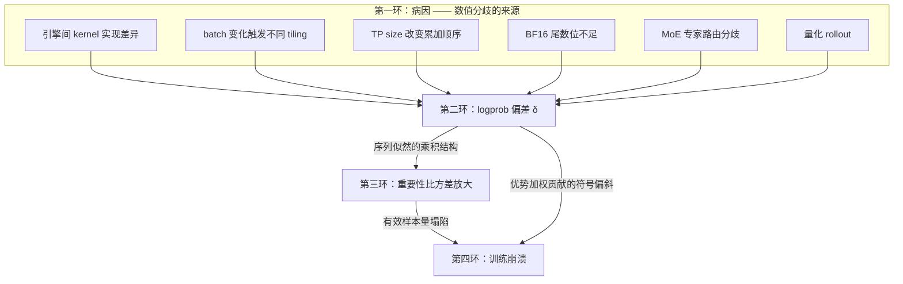
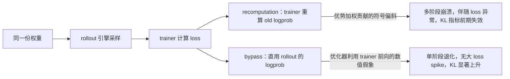
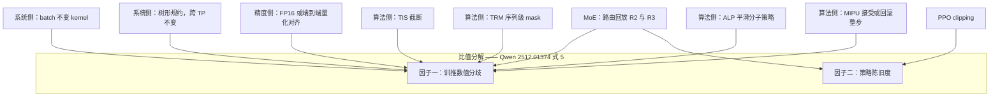

# 训推不一致（TIM）：从 kernel 非确定性到训练崩溃的完整因果链

> 本页打通一条在本库中**上下游都已有页、中间是断的**链路：kernel 非确定性 → logprob 偏差 → 重要性比方差放大 → 训练崩溃。上游（浮点非确定性、batch 不变性、推理引擎实现）见 [[determinism_and_numerical_reliability_analysis]] 与 [[vllm/index]]；下游（loss spike / 发散的治理）见 [[training_dynamics_stability_analysis]]。本页补的是中间两环，以及把四环串起来的归因框架。
>
> **保真度说明**：本页每条断言均标注一手来源与 §/Fig/Table/Eq 级定位符。凡标 `†` 的数字取自论文**图内标注**（PDF 文本层），正文未复述；凡标 `[未量化]` 的是论文明确没有给出的数据，不做推测补齐。跨论文拼接得出的结论一律显式标注为「本页推断」。
>
> 最后更新: 2026-07-25

---

## 0. 一个前置结论：TIM 不是数值噪声

在读任何机制之前，先确立本页的地基性事实。ByteDance 与 University of Virginia 的 *Diagnosing Training Inference Mismatch in LLM Reinforcement Learning*（arXiv 2605.14220）构造了 **VeXact**——一个与 FSDP trainer 逐位对齐的 rollout 引擎，使 TIM 成为实验中**唯一**的变量。其 §3.2 结论句：

> "Since TIM is the only difference between VeXact and vLLM baseline, these experiments confirm that TIM is itself a critical destabilizing factor, not merely a secondary artifact compounded with other training effects."

摘要给出的定性升格更强：

> "TIM is not benign numerical noise, but a **systems-level perturbation** that should be treated as a **first-order factor** in analyzing LLM RL stability."

这条实验设计上的隔离，是本页所有后续讨论能够成立的前提——在此之前，TIM 的效应始终与 off-policy drift、clipping、数据分布等因素纠缠，无法单独归因。

---

## 1. 因果链总览

注意图中**从第二环直连第四环的那条边**。这是 2605.14220 §4.1 的核心发现：TIM 致崩存在一条不经过「方差放大」的路径——优化器消费的不是概率差本身，而是优势加权的代理损失贡献，而 TIM 在其中造成的是**依赖优势符号的系统性偏斜**，不是均匀噪声。详见 §5.2。

### 归因框架：把偏差拆成两个因子

Qwen 团队的 *Stabilizing Reinforcement Learning with LLMs: Formulation and Practices*（arXiv 2512.01374）§2.4 给出了本页采用的归因框架。token 级代理目标之所以是序列级真实目标的一阶近似，条件是下式两个因子都接近 1：

$$\frac{\pi_\theta(y_t\mid x,y_{<t})}{\mu_{\theta_{\text{old}}}(y_t\mid x,y_{<t})}=\underbrace{\frac{\pi_{\theta_{\text{old}}}(y_t\mid x,y_{<t})}{\mu_{\theta_{\text{old}}}(y_t\mid x,y_{<t})}}_{\text{训推数值分歧}}\times\underbrace{\frac{\pi_\theta(y_t\mid x,y_{<t})}{\pi_{\theta_{\text{old}}}(y_t\mid x,y_{<t})}}_{\text{策略陈旧度}}$$

其中 $\mu$ 是推理引擎实现的策略，$\pi$ 是训练引擎实现的策略。原文对两者成因的表述分别是：训推分歧来自 "training and inference engines typically employ different computational kernels for peak performance, which would yield inconsistent outputs given the same model input"；陈旧度来自大 batch 被切成 mini-batch 做多次梯度更新。

**这个分解是本页所有修法归类的坐标系**：PPO clip 管的是第二个因子，TIS/TRM/ALP 管的是第一个因子，而 MoE 路由回放**同时**污染并同时治理两个因子（§6.2）。该框架的另一个价值在于，它把 IS 修正从「外挂补丁」重新定位为**代理目标的内生成分**——2512.01374 §2.3 的代理目标 $\mathcal J^{\text{token}}$ 中，停梯度的 $\text{sg}[\pi_\theta/\mu_{\theta_{\text{old}}}]$ 权重本来就在式子里。

---

## 2. 第一环：偏差从哪里来

### 2.1 引擎间 kernel 实现差异

2605.14220 归因清单的第一类，原文：

> "The model and kernel implementation differences between the inference and training engines."
> "inference engines prefer inference-optimized kernel libraries like FlashInfer, which is not applicable in training engines."

这一类无法通过配置消除，只能通过让两侧走同一套 kernel 实现来消除——VeXact 的做法正是把 rollout 侧 kernel **注册进 FSDP engine 的初始化**，使 trainer 走完全相同的路径（§3.1）。

### 2.2 reduction order 与 tiling 随 batch 变化

第二类，原文列出三条具体诱因：

> "performance-oriented optimizations such as **atomic additions** can introduce non-determinism."
> "changes in **batch size** can trigger different **launch-grid configurations through auto-tuning**, thereby altering GPU tiling strategies."
> "Since floating-point accumulation is **non-associative** under finite precision, these changes in execution order can ultimately lead to numerically different results."

这是 batch invariance 议题的完整来源，已在 [[batch_invariance_guide]] 与 [[determinism_and_numerical_reliability_analysis]]（问题 2）展开，此处不重复。

### 2.3 TP size 改变累加顺序 —— batch 不变性覆盖不到的那一块

这是本库此前没有覆盖的一环。*Deterministic Inference across Tensor Parallel Sizes*（arXiv 2511.17826，方法名 **TBIK = Tree-Based Invariant Kernels**）§3.3 指出：在 row-parallel 层（论文点名 `o_proj`、`down_proj`）中，输入 $X$ 与权重 $W$ **都沿 $K$ 维切分**，因此

> "Even if the reduction algorithm itself is deterministic, **the number of participating devices can alter the computation order** for each element."

对 batch-invariant 方案的定性（§3.2 附近）：

> "as its name indicated, this technique is **currently limited to eliminating variances from batch sizes**."

这条区分之所以对 RL 至关重要，是因为 RL 训练里 rollout 与 training **本来就跑在不同的 TP 配置上**——TBIK §5.5 的实验配置正是 rollout 用 vLLM TP=4、训练用 FSDP TP=1。在这种配置下，即使两侧都用了 batch-invariant kernel，输出仍然不一致。

TBIK §5.3 的对照实验给出了迄今最直接的证据（Table 1，12 种运行时配置：BS∈{8,16,32} × TP∈{1,2,4,8}，数值为平均 unique output 数，1 表示全配置完全一致）：

| 模型 | BF16 | BIO（仅 batch 不变） | BIO+TBIK |
|---|---|---|---|
| Qwen3-8B (AIME'24 / AMC'23) | 12.00 / 10.85 | 7.87 / 7.78 | **1 / 1** |
| Mistral-7B-Instruct | 12.00 / 11.08 | 7.97 / 7.75 | **1 / 1** |
| Llama-3.1-8B-Instruct | 9.60 / 9.85 | 7.20 / 7.13 | **1 / 1** |
| Qwen3-32B | 9.00 / 8.00 | 6.90 / 6.75 | **1 / 1** |

Table 2 的平均最大概率发散（×10⁻³）更说明问题：Llama-3.1-8B 上 BIO 的 **27.54 甚至高于 BF16 的 26.48**——**只做 batch 不变，几乎没有降低跨 TP 的数值发散**。

TBIK 的构造是在卡内与卡间强加同一棵固定满二叉树（§4.1）：

> "we impose a **fixed full binary-tree reduction topology shared by local MatMul and distributed collective operations**. Each partial MatMul result corresponds to a leaf node, while internal nodes perform deterministic pairwise accumulation."

对照的基线是 cuBLAS GEMM + NCCL **Ring** Reduce（卡内顺序累加 + 卡间环形），而 TBIK 卡内树深 $L=\log_2(T_K/C)$（$T_K$ 为 $K$ 维 tile 总数，$C$ 为 TP 卡数），卡间沿用同一拓扑。

> **本页推断（论文未显式论证）**：跨 TP 不变的完整机制应依赖「BLOCK_K 固定 ⇒ $T_K$ 与 $C$ 无关 ⇒ 卡内树 $\log_2(T_K/C)$ 与卡间树 $\log_2 C$ 拼成深度恒为 $\log_2 T_K$ 的全局固定树」。论文正文只给了结论句 "Because the reduction tree is fixed and does not depend on the number of GPUs, all TP configurations follow identical accumulation paths"，中间两环未见显式表述；Appendix C 的 Theorem 1 正文本次未能读到。$T_K$ 或 $C$ 是否须为 2 的幂，论文亦未说明。

### 2.4 BF16 尾数位不足

*Defeating the Training-Inference Mismatch via FP16*（arXiv 2510.26788，Sea AI Lab + NUS）主张根因在浮点格式本身。Table 1 的对照：FP16 为 5 位指数 / 10 位尾数，BF16 为 8 位指数 / 7 位尾数；1 之后的下一个可表示数分别是 $1+2^{-10}\approx1.000977$ 与 $1+2^{-7}\approx1.007812$——**分辨率相差 8 倍**。

§3.5 的实证（Figure 2）：

> "BF16 introduces an **exponentially larger mismatch, which worsens with longer responses due to cumulative autoregressive errors**, whereas FP16 maintains the mismatch at a much milder level (approximately **24× smaller**)."

图内标注给出 $\mathrm{KL}[\mu\Vert\pi]$ = **7.64（BF16）vs 0.32（FP16）**†，比值 23.9，与正文的「约 24×」自洽。序列 mismatch 对长度的斜率为 **−1.01（BF16）vs −0.07（FP16）**†。

### 2.5 MoE 专家路由分歧

MoE 引入了一类**结构性**的、不属于纯舍入也不属于纯优化的偏差源。三份来源交叉印证：

**GSPO（arXiv 2507.18071，已在 raw/）§5.3** 给出了漂移幅度——48 层 Qwen3-30B-A3B-Base 上：

> "after each RL gradient update and for the same rollout sample, there are roughly **10% of the experts activated under the new policy $\pi_\theta$ that are different from those under the old policy $\pi_{\theta_{old}}$**. This phenomenon, which becomes more prominent in deeper MoE models, makes the token-level importance ratios ... fluctuate drastically and further invalidates them."

**R3（arXiv 2510.11370，北大 + 小米）** 给出训推侧的量化对照：

| 度量 | 数值 |
|---|---|
| 训推 KL：Qwen3-30B-A3B（MoE） | $1.535\times10^{-3}$ |
| 训推 KL：Qwen3-8B（Dense） | $6.4\times10^{-4}$ |
| 训推 KL：R3 修正后（MoE） | $7.5\times10^{-4}$ |
| 参照：Megatron 内部两次 forward 之间的 KL | $8.4\times10^{-4}$ |
| 约 10% 的 router 训练/推理选到不同专家；**94% 的 token 至少在一层上不一致**；平均每 token 约 6 个 router 不一致 | |
| $\tau>2$ 的极端 token 比例：MoE 比 Dense **大一个数量级**；R3 将其**降低一个数量级** | |

其中「Megatron 内部两次 forward 就有 $8.4\times10^{-4}$ 的 KL」这个参照量尤其值得记住——它意味着 dense 模型的训推 KL（$6.4\times10^{-4}$）**已经低于同一框架内部重复前向的抖动**，而 MoE 的 $1.535\times10^{-3}$ 才是真正超出噪声底的信号。

**CompassMax-V3（arXiv 2512.07710，Shopee）** 定位了放大发生的层：训推 log-prob 差异**在 MoE router 层之后显著放大**，Router Replay 将其从约 $10^{-3}$ 压到 $10^{-4}$。

**FP8-RL（arXiv 2601.18150，NVIDIA）§2.2.3** 补上了时间维度：

> "Unlike the dense model where mismatch KL remains stable, **MoE models inherently exhibit a trend of increasing mismatch KL during training** in both the BF16 and FP8 runs. ... As training progresses and the policy evolves, these routing inconsistencies **accumulate**, causing the mismatch KL to gradually increase."

> **这是 MoE 与 dense 在 TIM 上的定性差异**：dense 的 mismatch 是平稳的，MoE 的是**随训练单调累积**的。它既不能由精度解释（BF16 run 同样如此），也不能由优化轨迹解释——路由分歧有自己独立的动力学。

详细的 R2/R3/RSPO/PR² 谱系另见 `moe_routing_replay_analysis`（待建）。

### 2.6 量化 rollout

*QaRL*（arXiv 2604.07853）§3.1 说明量化如何把 TIM 从 kernel 级微扰放大成分布漂移：普通 mismatch "typically limited to implementation details (e.g. different kernels), so the distribution shift is **mild**"，而量化 rollout 下 $w_{\text{mismatch}}=\pi_{\text{learner}}/\pi_{\text{sampler}}$ 会 "**drift far away from 1.00**"，且 "quantization-induced errors accumulate across decoding steps, making the divergence **grow with response length**"。

它进一步识别了 **error tokens**——欠训练的量化策略在长响应中产生重复、乱码 token，机制是自回归的误差放大："an error token at step $t$ sends the model off-trajectory, causing subsequent tokens generated from corrupted state."

---

## 3. 第二环：偏差有多大

### 3.1 度量的定义

2605.14220 §2 Eq.1：

$$\delta_t=\log\pi^{\text{train}}_{\text{old}}(a_t\mid s_t)-\log\pi^{\text{rollout}}_{\text{old}}(a_t\mid s_t)$$

其中 $\pi^{\text{train}}_{\text{old}}$ 是算法需要 old-policy 概率时 trainer 侧给出的参考分布，$\pi^{\text{rollout}}_{\text{old}}$ 是 rollout 引擎采样该 token 时**实际实现**的行为分布。原文对 TIM 的操作性定义：

> "TIM occurs when the rollout execution path and the trainer execution path assign **different probabilities to the same token under the same model weights and sampled sequence**."

以及与 PPO off-policy 偏差的区分：

> "Different from the off-policy bias introduced by PPO mini-steps, TIM off-policy bias is an **infrastructure-level noise**, which cannot be addressed by naive PPO clipping methods."

### 3.2 实测幅度

| 场景 | 度量 | 数值 | 出处 |
|---|---|---|---|
| Qwen3-1.7B GRPO | 每 batch $\lvert\delta_t\rvert$ **均值** | 很小 | 2605.14220 Fig.1 |
| 同上 | 每 batch $\lvert\delta_t\rvert$ **最大值** | 可达 **≈1.0** | 2605.14220 Fig.1 图注 |
| Qwen3-8B (bf16) 单句追踪 | 某 token $\delta_t$ | **−0.133**，且该位置发生 **argmax flip** | 2605.14220 Table 1 及脚注 |
| Dense 模型 | K3 KL | $10^{-5}\sim10^{-3}$ | Miles/SGLang 工程博客 |
| MoE 模型 | K3 KL | $10^{-3}\sim10^{-1}$ | 同上 |
| Qwen3-30B-A3B，FP8 rollout-only | mismatch KL | step≈700 尖峰**冲过 5**，随即崩溃 | 2601.18150 v2 §2.4 Fig.10 |

Figure 1 图注原文：

> "While the mean of $\lvert\delta_t\rvert$ is small, we can observe some **extreme tokens with its $\lvert\delta_t\rvert$ near 1.0**."

Table 1 的 argmax flip 脚注给出了这类极端 token 的实际后果：在该位置 trainer 侧的 top-1 token 是 `':\n\n'`（log prob −0.577），与 rollout 侧的选择完全不同——**同一份权重，两条执行路径给出了不同的最优 token**。

> **重要空白**：2605.14220 **没有**给出「$\lvert\delta_t\rvert$ 超过某阈值的 token 占比」这类频率统计，argmax flip 也只有这一个实例、没有 rate。这意味着「极端 token 有多罕见」这个对判断严重性至关重要的量，目前**无人报告**。

---

## 4. 第三环：从偏差到方差

### 4.1 为什么小偏差会被放大——序列似然的乘积结构

*VCPO*（arXiv 2602.17616，MIT + NVIDIA）§2.2 把这一环讲得最清楚。序列级重要性权重（Eq.2）：

$$w(x,y)\triangleq\frac{\pi_\theta(y\mid x)}{\mu(y\mid x)}=\prod_{t=1}^{T}\frac{\pi_\theta(y_t\mid y_{<t},x)}{\mu(y_t\mid y_{<t},x)}$$

> "the **product structure** in (2) makes $w(x,y)$ **highly sensitive to small per-token probability shifts**, so the resulting weights can become **heavy-tailed** and a few samples may dominate each update."

论文称之为 **"Curse of the Horizon"**。有效样本量的定义与方差关系：

$$\mathrm{ESS}\triangleq\frac{\left(\sum_{i=1}^{B}w_i\right)^2}{\sum_{i=1}^{B}w_i^2}=\frac{1}{\sum_i\tilde w_i^2}\in[1,B],\qquad \mathrm{Var}(\hat g)\approx\frac{1}{\mathrm{ESS}}\mathrm{Var}(g)$$

即 off-policy 梯度估计的方差收敛率中，**批大小 $B$ 被 ESS 取代**。

### 4.2 三种代理诊断量

| 诊断量 | 定义 | 提出者 | 关键性质 |
|---|---|---|---|
| ESS ratio $\rho_{\text{ess}}=\mathrm{ESS}/B$ | 见上 | VCPO / AIS | 直接对应梯度方差放大倍数 |
| 对数比二阶矩 $\hat M_2=\frac1N\sum_i(\log r_i)^2$ | M2PO Eq.4 | M2PO (2510.01161) | 逐 token 非负，**无相互抵消**；对 outlier 敏感 |
| 变异系数 $\mathrm{CV}=\sigma(w)/\mu(w)$ | — | AIS (2605.13907) | 三诊断之一 |

M2PO 的 **Theorem 5.1**：在 $1/R\le r\le R$ 有界假设下，$\chi^2(\pi_{\text{new}}\Vert\pi_{\text{behav}})\le R^2M_2$。全部实验使用单一阈值 $\tau_{M_2}=0.04$。

M2PO 对 batch 级 KL 的批评是选择 $M_2$ 的理由：KL 的逐 token 估计有正有负会**相互抵消**，掩盖尾部；$M_2$ 平方后不会。

### 4.3 这一环的实证现状：机制清楚，分布层面从未被测量

这是本页最需要如实交代的一点。

**可用的定量锚点**（全部为相对变化或聚合量）：

- **AIS（2605.13907）§3.1**：LLaDA-8B / GSM8K，未校正的 FP8 rollout 的 **ESS ratio 从 >0.95 衰减到 <0.70**。这是目前唯一一条在**真实引擎失配**（FP8 rollout vs BF16 training）场景下给出的 ESS 绝对轨迹。
- **VCPO Appendix F**：on-policy 参考值 $\rho^{\text{on}}_{\text{ess}}$ = 1.0（GSM8K）、1.0（Countdown/MATH）、**0.55（多轮工具调用 AIME-2025）**。最后一个值说明**即使完全 on-policy，长程多轮任务的序列级 ESS ratio 也只有 0.55**——这是 "curse of the horizon" 的直接量化。
- **M2PO**：staleness=256 时被裁剪 token 比例 **1.22% → 0.06%**（GRPO → M2PO）。

**没有任何一篇给出**：重要性比的尾指数 $\alpha$、Hill 估计、Pareto $\hat k$（PSIS 诊断）、权重分位数表、峰度、或对数权重的 QQ 图。三篇都是用**二阶矩类聚合量**（$M_2$、ESS、CV）替代尾部刻画。

> **本页判断**：ESS ratio 0.70 意味着 $\sum_i\tilde w_i^2\approx1.43/B$，有效样本量损失约 30%——这支持「中度权重集中」，**不足以支持「幂律重尾 / 方差发散」的强定量结论**。写作与工程判断时应把这一环表述为「**机制上有充分论证，分布层面尚未被直接测量**」。这一空白已记入 §8。

### 4.4 理论侧：误差界随序列长度的三档收紧

*Trust Region Masking*（arXiv 2512.23075）是一篇纯理论工作（无实验）。它给出的误差界层级值得单列，因为它解释了为什么长 CoT 场景下 TIM 尤其危险：

| 界 | 形式 | 缩放 | $T=4096,\ D^{\text{tok,max}}_{\mathrm{KL}}=10^{-4}$ |
|---|---|---|---|
| 经典 TRPO | $T(T-1)\,D^{\text{tok,max}}_{\mathrm{KL}}$ | $O(T^2)$ | 1677（vacuous） |
| Pinsker-Marginal (Thm 3.1) | $\tfrac43T^{3/2}D^{\text{tok,max}}_{\mathrm{KL}}$ | $O(T^{3/2})$ | 35.0（紧 48×） |
| Mixed (Thm 3.2) | $2T\sqrt{D^{\text{tok,max}}_{\mathrm{KL}}\cdot D^{\text{seq}}_{\mathrm{KL}}}$ | $O(T)$ | 8.2（紧 200×） |

同一量级的结论也出现在 *Beyond Precision*（arXiv 2602.01826）的 **Theorem 3.1**：$\Vert\nabla_\theta\mathcal J_{\text{actual}}-\nabla_\theta\mathcal J\Vert_2\le C\cdot T^2$，其中 $C=2B\Delta_{\max}$，$\Delta_{\max}$ 是单 token 级 TV 距离上界，$B$ 是 score function 范数上界。

> **这个 $C\cdot T^2$ 的乘积结构是理解 §7.1 那场争论的钥匙**：FP16 路线压的是 $\Delta_{\max}$，LR 调度路线压的是 $T$ 增长后被放大的更新幅度。两者在数学形式上**天然可叠加，不互斥**。

---

## 5. 第四环：崩溃的形态学

### 5.1 两种失效路径

TIM 的处理方式有两种工程惯例，二者的崩溃形态**完全不同**。2605.14220 §4.1 Eq.4：

$$\mathcal L_{\text{recomp}}=\mathcal L_{\text{ppo}}(r^{\text{train}}_{\text{ppo}},A),\qquad \mathcal L_{\text{bypass}}=\mathcal L_{\text{ppo}}(r^{\text{rollout}}_{\text{ppo}},A)$$

即 recomputation 用 trainer 重算 old logprob，bypass 直接用 rollout 返回的 logprob。

**Qwen3-1.7B GRPO 实测（Fig.3）**：

| 路径 | 崩溃曲线 | 伴随信号 |
|---|---|---|
| VeXact（零 mismatch） | 稳定维持 train reward ≈ **0.93** | — |
| vLLM **recomputation** | 前 650 步从 **0.87 → ≈0.40**；**部分回升**；≈step 1610 后急降；≈step 1665 后**崩到近零** | 存在同步 loss 异常与稍后的梯度尖峰 |
| vLLM **bypass** | **单阶段**退化到 ≈**0.4**，**不归零** | **无可比量级的 loss spike**，信号不同步 |

**Qwen3-30B-A3B MoE REINFORCE（Fig.2）**：vLLM 在 **step 280** 后开始退化，train/val reward 从 **0.574 / 0.293 → 0.255 / 0.067**；VeXact 稳定上升至 **0.753 / 0.534**。

两条路径的失效机理（§4.1 原文）：

- **recomputation**：> "sampling log-probabilities used in loss computation are **not from actual samplers** (rollout), resulting in a **skew in the advantage-weighted loss contributions** seen by the optimizer."
- **bypass**：> "Because TIM creates a misaligned probability landscape between trainer and rollout engine, **the optimizer exploits numerical artifacts in the trainer's forward pass**. These weight updates fail to translate into actual behavioral improvements when $\theta$ is deployed back to the rollout engine, leading to **silent policy degradation**."

### 5.2 为什么说 TIM 改变了优化目标

这一主张是**经验性的，不是形式化推导**——论文没有给出「TIM ⇒ 目标变成 X」的定理。它的论证方式是引入一个可测量的中间量（Eq.5）：

$$C(r_{\text{ppo}})=-(r_{\text{ppo}}-1)A_t$$

动机原句：> "The optimizer does not directly consume probability discrepancies; it consumes **advantage-weighted surrogate-loss contributions**."

在 VeXact 下 $r^{\text{train}}_{\text{ppo}}=r^{\text{rollout}}_{\text{ppo}}$，两条 $C$ 曲线重合；在 vLLM 下分离。Figure 5 图注给出结论：

> "recomputation induces a **sign-dependent skew** in the advantage-weighted update signal, **rather than merely adding uniform noise**."

> **这是本页第一环直连第四环那条边的依据**：均匀噪声可以靠增大 batch 平均掉，符号相关的系统性偏斜不能。`[未量化]` Figure 5 的偏斜幅度、正负 advantage 占比，论文正文均未给出。

### 5.3 前兆指标：哪些能提前预警，哪些是盲的

| 指标 | 提出/使用者 | 领先性 | 已知盲区 |
|---|---|---|---|
| K1 / K3 KL | 2605.14220 Fig.4；Miles 博客 | 对 **bypass** 型有效（K1、K3 显著上升） | **对 recomputation 型是盲的**——前 700 步几乎平坦，而 reward 已在退化 |
| ESS ratio | VCPO §3.1；AIS | 论文主张**退化先于** KL 爆炸与 reward 掉落 | **未给出提前多少步**；全文无量化提前量 |
| 二阶矩 $M_2$ / 裁剪比例 | M2PO | staleness 下裁剪比例急升 | 未报崩溃 step |
| 梯度范数 | Miles 博客；VCPO Fig.1 | Qwen30B-A3B 上 ≈step 320 **grad norm 0.07 → 0.02** 先于 reward 崩溃；VCPO 观察到 TIS run "brief gradient-norm spike followed by rapid collapse" | 方向不一致（一处降、一处尖峰） |
| 响应长度突增 | 2602.01826 Fig.6 | Qwen3-4B/8B 在 step ≈100 从 1000 涨到 3000–4000，早于 step≈300 的崩溃 | 与 TIM 的因果未直接建立 |
| **ACR**（优势坍塌率） | AVSPO (2605.21125) | **Final Accuracy = 51.4 − 29.6 × ACR₁₀₀，$R^2=0.617$** | 度量的是优势坍塌，非 TIM |

> **K1/K3 KL 对 recomputation 型崩溃失效**这一条，是本页最有工程价值的发现之一。当前多数 RL 框架把 K3 KL 作为默认监控项（Miles 博客即以此为主线指标），而 recomputation 恰恰是 verl 等框架的常见默认路径——这意味着**一个使用默认监控的团队，可能在 reward 已经掉了 700 步之后才从 KL 曲线上看到异常**。

### 5.4 崩溃时点的其它实证

| 来源 | 配置 | 崩溃/失稳时点 |
|---|---|---|
| 2602.01826 Fig.1 | Qwen3-4B-Base + filtered DAPO | **step ≈300**，且在数据量 2.5%~100% 变化下 "remarkably consistent"（说明 epoch 不是 anchor） |
| 2510.26788 §5.2 | LoRA Qwen2.5-Math-1.5B，BF16 | **≈600 步**后崩溃，FP16 全程稳定 |
| 2510.26788 §5.4 | OctoThinker-3B，BF16 | **≈150 步**后失稳 |
| 2601.18150 v2 §2.4 | Qwen3-30B-A3B，BF16 训练 + FP8 rollout | **step≈700**，KL>5 |
| VCPO Fig.8 | Qwen2-1.5B，Countdown，高异步 + TIS | 验证准确率在**前 ≈50 步**内崩到近零 |

---

## 6. 修法全谱

### 6.1 修法作用在分解式的哪个因子上

### 6.2 系统侧：病因—覆盖范围—实测代价

| 修法 | 消除的病因 | 覆盖范围 | 实测代价 | 关键局限 |
|---|---|---|---|---|
| batch-invariant kernel（TML / BIO） | batch 组合变化 | **仅 batch 不变，不跨 TP** | Triton GEMM **194 vs cuBLAS 527 TFLOPS（降 63%）**；RMSNorm 比 fused CUDA 慢**至多 50%**；SGLang 确定性模式平均降速 **34.35%** | TBIK Table 2 显示其对跨 TP 发散几乎无效 |
| **TBIK** 树形规约 | batch + **TP size** | 跨 TP bitwise 一致 | 端到端 **22%–63%**（BIO 单独 10–33%，TBIK 额外 5–30%）；kernel 层 120 vs 190 TFLOPS | 只覆盖 row-parallel matmul + all-reduce；attention 仍靠 BIO 的 FlexAttention；**全文未提 CUDA graph** |
| **LLM-42** verified speculation | batch 组合（**选择性**） | 仅 batch 不变 | @2% 确定性流量仅 **+3% P50 延迟**；@100% 与 SGLang-Det 相当或更快 | **non–prefill-decode invariant**（自承），对 RL 的 rollout/train 路径差异直接不利；不跨 TP |
| **DeepSeek-V4** 双 kernel（§3.3） | batch 不变的 **decoding attention** | 生产级 | 原文称 **"negligible"** | `[未量化]` 报告未给任何百分比 |
| FP16 全局 | BF16 尾数不足 | 全局 mismatch 降 ≈24× | **无速度损失**；需 dynamic loss scaling（成熟组件） | QaRL §3.1 报告 FP16 + dynamic loss scaling 出现 **gradient NaN underflow** |
| 端到端量化对齐（FP8-RL） | 量化引入的分布漂移 | KL 曲线明显低于 rollout-only | 端到端 FP8 训练时间降低约 **20%** | 仍需 IS 修正："importance-sampling-based correction **remains essential**" |
| MoE 路由回放 R2 / R3 | 专家路由分歧 | 同时压两个因子 | 需缓存并回放 routing | **代价是目标策略偏差**（见 §7.2） |

**关于 DeepSeek-V4 §3.3 的一处常见误读**（已按 raw 中 PDF 原文核实）：dual-kernel strategy 的原文是 "a dual-kernel strategy for **batch-invariant decoding**"，它抵消的是**放弃 split-KV 后 decoding attention 的 wave-quantization 损失**，两个 kernel 分别服务饱和波与尾波，并"carefully design the calculation path of the second kernel to ensure its accumulation order is the same as that of the first kernel"。**matmul 侧是另一条独立路径**：用 DeepGEMM 端到端替换 cuBLAS，"abandon split-k in most scenarios"，再"introduce a set of optimizations that enable our implementation of matrix multiplication to match or even surpass the performance of standard split-k"。确定性（§3.3.2）则另有三处处理：attention backward 用每 SM 独立累加 buffer + 全局确定性求和；MoE backward 用 rank 内 token order 预处理 + 跨 rank buffer 隔离；mHC 的小输出维度 matmul 不得不用 split-k 时，"output each split part separately and perform a deterministic reduction in a subsequent kernel"。

### 6.3 算法侧：机制—粒度—代价

| 修法 | 作用机制 | 粒度 | 关键超参 | 失效模式 | 代价 |
|---|---|---|---|---|---|
| **TIS** | IS 比值上截断 $\min(\cdot,C)$，乘在 PPO clip **外层** | 论文记号为序列级，但**未明确表态**；第三方称 sequence-level | $C$：**原论文无取值**、无敏感性分析 | 论文自承无；VCPO 观测到异步 lag 下"梯度尖峰后迅速崩溃"；Miles 博客实测 **clip 上界 2.0 会崩、1.5 不崩** | 极低算力；**需 patch rollout 引擎**暴露真实采样概率并把 lm_head 转 fp32 |
| **TRM** | 整条序列 0/1 mask，$M=\mathbb I[\max_t D_{\mathrm{KL}}(c_t)\le\delta]$ | **强制序列级**——$D^{\text{tok,max}}_{\mathrm{KL}}$ 本质是序列量 | $\delta$：仅示例 $10^{-4}$，无经验值 | 高 MoE 噪声下 mask 率过高致样本效率崩（自承，未量化） | **需存全词表 rollout logits**；退路是 $k_3$ 估计 |
| **ALP** | 改**分子策略本身**——逐层 hidden state 注高斯噪，外层仍是标准 clip | Token-ALP / Seq-ALP 两变体（单轮 Token 优、多轮 Seq 优） | std 初值 1e-4，扰动 lr 5e-4；**有敏感性分析**（4×3 网格，"tightly clustered"） | 自承未验证全异步 RL 与 MoE；$\sigma$ 有双边约束（Thm 1） | `[未量化]`；训练侧注噪，推理侧不变 |
| **MIPU** | 两步：Step1 序列级 TIS($w_{\max}=2$)×GRPO clip；Step2 用 inference-side gap proxy **接受或回滚整步** | 序列级（长度归一几何平均比） | $w_{\max}=2$；容差 $c$ 线性退火 | 仅中等规模验证（自承） | **最贵**：每步额外一次推理引擎 validation rollout + 打分 + 训练侧 logprob；回滚需同时还原**优化器状态** |
| PPO clipping | 限制单步更新幅度 | token 级 | $\epsilon$ | 对 TIM 无效——TIM 是 infrastructure-level noise | 无额外 |

**2605.14220 §4.2 的消融给出了目前最可信的组合建议**（$\tau_{\text{tok}}=2$，$\tau_{\text{seq}}=0.001$）：

1. 序列拒绝的判据用**修正比 $r_{\text{corr}}=\pi^{\text{train}}_{\text{old}}/\pi^{\text{rollout}}_{\text{old}}$ 优于用 $r_{\text{ppo}}$**；
2. **token 级截断 + 序列级拒绝的组合**最接近 VeXact 基线——论文由此推断 "TIM manifests at multiple granularities"；
3. K1 与 K3 作为序列判据差别不大。

`[未量化]` §4.2 未给出各变体的 reward 数值或崩溃 step。

### 6.4 确定性税：文献只回答了一半

| 场景 | 税率 | 出处 |
|---|---|---|
| batch-invariant GEMM kernel | cuBLAS 的 **37%** 性能（194 / 527 TFLOPS） | LLM-42 Fig.4a |
| 单个确定性请求混入 11 请求批次 | 整批吞吐 **掉 56%**（931 → 415 tok/s） | LLM-42 Fig.5 |
| SGLang 确定性模式 | 吞吐降 **24–36%**；博客自报平均 **34.35%** | LLM-42 Fig.10；SGLang 博客 |
| TBIK 端到端（4×H20，batch=64） | **22%–63%** | TBIK Fig.7 |
| vLLM + TorchTitan bitwise 一致 RL run | 比非 bitwise **慢 2.4×** | vLLM 官方博客 2025-11-10 |

> **三篇系统侧论文没有一篇测量 RL 训练闭环的端到端代价。** TBIK 最接近——它给出了收敛质量的收益（GSM8K 上 pass@1 **0.73 vs BIO 0.68 vs BF16 0.60**，rollout 用 vLLM TP=4、训练用 FSDP TP=1 时 **rollout-training KL = 0**）——但**没有把 rollout 侧 22–63% 的开销折算进 RL 总训练时间**。而 rollout 通常占 RL 训练耗时的主导部分，这个折算恰恰是判断"值不值"的关键。这是本页认定的头号 open question。

`[未量化]` TBIK 正文亦未说明 22% 与 63% 分别对应哪个 input/output 长度组合；该区间来自单一硬件配置（4×H20 NVLink），不是跨硬件范围。

---

## 7. 三处根本分歧

### 7.1 TIM 的根因：精度问题还是优化问题

> [!contradiction] 精度路线（arXiv 2510.26788）↔ 优化路线（arXiv 2602.01826），两篇互相点名，且各有实验支撑。

**精度侧主张**（2510.26788）："we show that its root cause lies in the **floating point precision itself**"。证据是换 FP16 后 mismatch 立即降约 24×，且在 LoRA、MoE、中训模型等多个场景消除崩溃。该文 §6 Discussions **完全不涉及**学习率、更新幅度、优化动力学或损失面几何，也未报告任何 FP16 仍然失稳的案例。

**优化侧主张**（2602.01826）直接点名反驳，§4.4 全节：

> "A recent study [Qi et al., 2025] suggests that substituting the default BF16 data type with FP16 may enhance the stability... As Figure 13 shows, **fp16 exhibits similar training collapse as bf16** in previous experiment. Notably, our length-triggered LR scheduler successfully stabilizes the training process using the same decay_period... These results reinforce our central argument: the training-inference mismatch and the resulting instability are **not merely precision problems**. Instead, they represent a **dynamic optimization challenge that transcends low-level hardware formats**."

其机制性论证（§3.1）更锋利：

> "While one might expect such a discrepancy to stem solely from numerical precision limits (and thus behave as **state-independent random noise**), our experiments suggest that this mismatch can be effectively **suppressed by shrinking the update size**, which demonstrates its connection to model weight location and optimization dynamics. We hypothesize that in the later stages of training, malignant dynamics leads the model weights to regions with specific geometric characteristics (e.g, sharp region, higher curvature), which in turn **amplifies numerical discrepancies**."

**第三方证据**：QaRL §3.1 给出一条独立的经验反例——"we empirically find that using $\theta_{\text{FP16}}$ with **dynamic loss scaling causes gradient NaN underflow**, and this phenomenon does not occur with $\theta_{\text{BF16}}$"，正好打在 FP16 论文声称"一行配置即可"的那个点上。但该文只给了一句话，无模型/step/scaler 配置，证据强度弱于 2602.01826 的 Figure 13。

> **本页判断**：两条路线在数学上**不互斥**。2602.01826 的界是 $\Vert\text{误差}\Vert\le 2B\Delta_{\max}T^2$——FP16 压的是 $\Delta_{\max}$，LR 调度压的是 $T$ 增长后的更新幅度，二者是**乘积关系**。2602.01826 §4.4 的实验（FP16 上照样崩、但同一个 scheduler 照样能救）正是这个乘积结构的直接体现。分歧之所以真实存在，很可能是因为**各自的实验 regime 由不同因子主导**：2510.26788 的主战场是 1.5B、8K 上下文、短程 sanity test；2602.01826 的主战场是 4B/8B base + DAPO 长程训练，响应长度从 1000 涨到 3000–4000。
>
> **裁决所需但缺失的数据**：2602.01826 Figure 13 **没有给 FP16 崩溃的 step 数，也没有报告 FP16 run 的 mismatch 绝对水平**。若 FP16 的 mismatch 确实低了 24× 却仍在同一步崩溃，强烈支持优化侧；若只是崩得更晚，则两者都对、只是量级之争。**这一关键对照，论文页面上读不到。**

### 7.2 MoE：Routing Replay 是否必要

> [!contradiction] GSPO §5.3 主张可取代 ↔ R3 / PR² / CompassMax 保留 ↔ 同作者组（arXiv 2512.01374）§4.4 回到"必需"。

**GSPO（2507.18071，Qwen Team）§5.3** 立场最强（已按 raw/ 中 PDF 原文核实）：

> "GSPO **eliminates the dependency on Routing Replay** and is fully capable of computing the importance ratios conventionally, converging normally, and optimizing stably."
> "GSPO fundamentally resolves the expert-activation volatility issue in MoE models, **obviating the need for complex workarounds like Routing Replay**."

**同一作者组（Chujie Zheng 均为一作）5 个月后的 2512.01374 §4.4**：

> "Once off-policy updates are introduced, both **Routing Replay and clipping become essential** for stable training"，缺任一则 "causes training to collapse prematurely"。

且给出了更细的实践建议：**on-policy 下加 R3 无收益**（"does not yield performance gains"）；**off-policy 下小 off-policiness 用 R2、大 off-policiness 用 R3**（"R3 surpasses R2"，且 "R2 fails to sustain stable training"）。

> **表述上的重要限定**：2512.01374 全文**没有出现 "GSPO" 或 "sequence-level importance sampling" 这两个词**，也**没有任何一句直接反驳** GSPO 的"可取代"主张。这是**同作者组前后两篇的实践结论出现张力**，不是一篇明确反驳另一篇。引用时不要写过头。

2512.01374 §3.2 还给出了 Routing Replay 的**代价**，这是 GSPO 一侧的合理担忧：

> "we point out that it also **implicitly biases the target policy**... Routing Replay constrains the routed experts to be $e^\pi_{\text{old},t}$ or $e^\mu_{\text{old},t}$, leading to another target policy $\pi^{R2}_\theta$ or $\pi^{R3}_\theta$ that **deviates from the original $\pi_\theta$**."

并诚实保留了判断：> "it is difficult to definitively assess whether the advantages or disadvantages of Routing Replay outweigh each other... We need further experiments to validate the practical utility of Routing Replay."

### 7.3 确定性是否必须付性能代价

> [!contradiction] TBIK / LLM-42 / SGLang / TML 实测 20–63% ↔ arXiv 2606.00279 主张消除 atomics 后全速即可 bitwise 复现。

*Bit-Exact AI Inference Verification Without Performance Tradeoffs*（arXiv 2606.00279，单作者，Machine Intelligence Research Institute）区分「真非确定性」与「非不变性」：

> "distinguish **true non-determinism (atomic functions)** from **non-invariance (deterministic, but different reduction trees)**"
> "Atomic: ... **This is the sole source of genuine non-determinism we identified.**"

它的经验部分是扎实的：跨 7 种 GPU SKU 的 L₂ 矩阵，**同 SKU 内 L₂ = 0**（重复运行 bit-identical）；emulator 在 A100/L40S 上 0 diffs。

**但本页认为它不构成对确定性税的反驳，理由有三**：

1. **目标不同**。TBIK 追求 **invariance**（输出跨 TP/batch 保持不变），本文追求 **verifiability**（给定完整配置即可精确重算）。后者甚至不试图让 TP=1 与 TP=4 的输出相同——它把 rounding error 当作**配置的可审计签名**来利用。**对 RL 的 rollout/train 对齐用例完全不适用。**
2. **前提极苛刻**。§6 列出五项必须固定/记录的条件：硬件 SKU、精确权重与量化格式、并行拓扑（prefill 与 decode **分别**）、软件版本与自定义 kernel、**每次 forward pass 的 batch size**；混合 batching 时还要记录每条目的 prefill/decode 状态与序列长度。
3. **标题的核心卖点零测量**。全文**没有任何 TFLOPS / latency / throughput 基准**。它证明的是"审计可以不加税"，不是"不变性可以不加税"。

另需注意其 §5 自承局限第 4 条：**反向传播被排除在外**，且 "backward kernel 大量使用 atomicAdd"——等于承认训练侧整条路径未被其框架覆盖。

> 补充：该文关于并行度的实验测的是 **pipeline parallelism**（PP 逐层传递、不改变 reduction 树，作者自称 "unsurprising"）。**PP 不变不能外推到 TP**——TP 才是改累加顺序的那个。

---

## 8. 知识缺口（无一手来源，勿硬凑）

1. **崩溃的校准阈值不存在**。没有任何一篇给出「$\delta>X$ 或 $\mathrm{KL}>Y$ ⇒ 必崩」的通用阈值。最接近的三条都是特定配置下的经验观测：FP8-RL 的 KL>5（Qwen3-30B-A3B，step≈700）、Miles 博客的 TIS clip 上界 2.0 崩 / 1.5 不崩、M2PO 的 $\tau_{M_2}=0.04$（且后者是超参选择而非实测崩溃点）。
2. **重尾从未被直接测量**。见 §4.3。所有工作都用二阶矩类聚合量替代尾指数。
3. **逐位置 TIM 增长曲线缺失**。没有在 16k/32k 长 CoT 上按 token 位置画 $\lvert\delta_t\rvert$ 增长的实证。只能用 2510.26788 的**序列级**斜率 + 2602.01826 的 $O(T^2)$ 理论界拼接——**这是拼接，不是单一来源的实证**。
4. **极端 token 的出现频率未知**。2605.14220 给了 $\lvert\delta_t\rvert$ 近 1.0 的存在性与一个 argmax flip 实例，但没有 rate。
5. **重尾 → 熵坍塌的因果未建立**。OPEFO（2605.11491）完全没提 TIM；TIM 这批也没一篇连到熵动力学。目前唯一桥梁是 M2PO **Figure 4(b)**：「$\lvert r-1\rvert$ 越大，token 平均熵越高」（基于 9000 万 training token，Qwen2.5-Math-7B，staleness 256，第 800–1200 次更新之间）。但这是**横截面相关性**，且论文的用途是论证 clipping 会误伤高熵 token，**不是**主张重尾导致熵坍塌。任何跨这一步的推论都必须显式标注。
6. **RL 闭环的确定性税无人报告**。见 §6.4。
7. **VeXact 自身的吞吐开销未量化**。2605.14220 全篇没有 vs vLLM 的任何 benchmark 数字，只有定性的 "retains reasonable throughput"。
8. **vLLM 的 logprobs/logits 语义一致性 RFC 不存在**。2026 Q2 RL roadmap（issue #41733）链到的 #37737 实际是一个流式 tool_call logprobs 缺失的 bug 报告，已 closed as not planned。

---

## 9. 落到工程上的判断

综合全部证据，本页给出四条可执行结论：

**监控项要按处理路径选。** 如果框架走 recomputation（verl 等的常见默认），**不要只看 K3 KL**——2605.14220 Fig.4 显示它在前 700 步几乎平坦而 reward 已在退化。此时应同时监控优势加权贡献的符号分布（Eq.5 的 $C(r)$）或 ESS ratio。走 bypass 则 K1/K3 有效。

**MoE 必须单独对待。** 它的 mismatch 是**随训练累积**的（FP8-RL §2.2.3），而 dense 是平稳的；MoE 的训推 KL 比 dense 高一个数量级，而 dense 已经低于同框架内部两次前向的抖动（R3）。任何在 dense 上验证过的阈值都不能直接搬到 MoE。

**跨 TP 场景下 batch 不变性不够。** 如果 rollout 与 training 的 TP 配置不同（这是常态），TBIK Table 2 显示只做 batch 不变几乎不降低数值发散。这时要么统一 TP，要么上树形规约，要么承认残余 mismatch 并靠算法侧补偿。

**算法侧修正是 post-hoc 的，有其边界。** 2605.14220 §6 自承："our evaluation is limited in scale and coverage... It remains unclear whether these mitigations generalize across broader RL settings, or whether they introduce additional optimization side effects that are not visible in our current experiments."。§7 的收尾主张值得原样引用：

> "Overall, our findings call for a **joint system-algorithm perspective** on RL stability and highlight the need for **zero-mismatch RL execution**."

---

## Related Pages

- [[01_theory/04_posttraining/index]] — 后训练算法理论入口
- [[determinism_and_numerical_reliability_analysis]] — 第一环的系统侧上游（问题 1-4：浮点非确定性五层来源、batch 不变性、低精度长链累加、SDC）
- [[batch_invariance_guide]] — batch 不变性的数学定义与 loss 聚合顺序依赖
- [[RL_Training_Inference_Precision_Analysis]] — 本库既有的训推精度页，本页为其 2025-2026 一代的延伸
- [[RL_PPO_Loss_and_GRPO_Analysis]] · [[grpo_analysis]] · [[gspo_analysis]] · [[dapo_analysis]] — 被本页各修法修改的基础目标
- [[on_policy_off_policy_staleness_analysis]] — §7 覆盖 TIM 与 staleness/off-policy 的关系区分，是本页四环因果链的上层概念坐标
- [[training_dynamics_stability_analysis]] — 第四环的下游（loss spike / NaN / 发散的四类根因与四层防线）
- [[07_training_reliability/index]] — 万卡训练确定性与可靠性问题域（问题 2 与本页直接接壤）
- [[verl/index]] · [[verl_rl_algorithms_analysis]] · [[verl_rollout_resharding_analysis]] — recomputation / bypass 两条路径在框架中的实现
- [[vllm/index]] — rollout 引擎侧的 kernel 与调度实现
- [[deepseek_v4_analysis]] — §3.3 批不变与确定性 kernel 库的完整上下文
- [[low_precision_training_analysis]] — FP16/BF16/FP8 精度路线的训练侧背景
