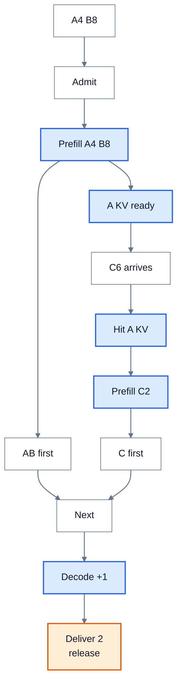

# LLM 推理原理全景：一条请求如何变成可交付的 token

> **文献基线**：[PagedAttention，arXiv:2309.06180v1](https://arxiv.org/pdf/2309.06180v1)（§2.1–2.3、§4.3–4.5）；[Orca，OSDI 2022 正式论文](https://www.usenix.org/system/files/osdi22-yu.pdf)（§3 S1、§4.2）；[SGLang，arXiv:2312.07104v1](https://arxiv.org/pdf/2312.07104v1)（§5）；[NVIDIA NIM LLM Metrics 1.0.0](https://docs.nvidia.com/nim/benchmarking/llm/1.0.0/metrics.html)（TTFT、ITL、TPS）。原始来源索引见 `raw/01_theory/05_inference/` 中对应论文及 T11 的指标索引。
> **主题**：从请求到达、已知输入计算、逐 token 生成到结束，建立单请求语义与多请求服务的共同地图；用短、长、共享前缀三条请求标出计算、KV 与等待分别在哪里发生。
> **适用范围**：带因果 decoder 的在线 LLM 推理总览。每个机制的证明、数值算法、实现配置和支持范围留给对应原理页或工程页；本页只拥有跨阶段关系，不重复它们的正文。
> **最近更新**：2026-09-17。新建全景页；三请求和所有资源数字均为教学推演，不是引擎 trace 或性能实测。

## 1. 请求不是一次前向，而是一串有状态的决定

服务先接收消息与生成参数，将实际模型输入规范化为 token 和其他条件。请求的 prompt 已知，可在 prefill 中并行计算这些位置的因果表示；最后已处理位置的 logits 只决定**下一**位置的 token。新 token 被选出后，若请求还未终止，它才作为下一轮 decode 的输入，并在那轮形成自己的 KV。终态刚输出的 token 不必再计算其 KV。[来源事实：PagedAttention §2.1–2.2](https://arxiv.org/pdf/2309.06180v1) 这个时序的逐位置账见 [[10_prefill_decode_analysis|Prefill / Decode]]，采样规则见 [[17_sampling_decoding_analysis|采样与解码策略]]。

多个请求的语义彼此独立，服务却可把它们的本轮输入合成一个执行批。Orca 的 iteration-level scheduling 在每轮执行返回后重选活动请求；PagedAttention 也描述了每轮移出完成项、加入新项并管理 KV 块。[来源事实：Orca §3 S1](https://www.usenix.org/system/files/osdi22-yu.pdf)；[PagedAttention §2.3、§4.3](https://arxiv.org/pdf/2309.06180v1) **何时准入**、**轮中计算什么**、**何时可交付 token**、**何时释放状态**因而是四个不同边界，不应把一次 kernel 完成当成整条请求完成。

## 2. 一张图放下三条教学请求

设短请求 A 的 prompt 为 `S0 S1 S2 S3`，长请求 B 为 `L0…L7`，请求 C 为 `S0 S1 S2 S3 C0 C1`。A、B 先到，C 在 A 的四位置 prompt KV 已完成且可被索引后到达。三者各要求恰好两枚输出，且在本例中不会提前遇到 EOS；模型、token IDs、位置与 mask、adapter 和隔离身份对共享前缀完全相同。若任一身份条件不同或缓存已逐出，C 必须普通 prefill，本例的命中路径就不成立。前缀身份与保护条件见 [[14_prefix_caching_analysis|Prefix Caching]]。

| 请求 | 已知 prompt | 查询时可用的相同前缀 | 本例新算的 prefill 位置 | 两枚输出所需后续 decode 输入 |
|---|---|---:|---:|---:|
| A 短请求 | 4 token | 0 | 4 | 1 |
| B 长请求 | 8 token | 0 | 8 | 1 |
| C 共享前缀 | 6 token | 4 | 2 | 1 |

不复用时三条 prompt 要处理 $4+8+6=18$ 个位置；在上表**命中成立且 KV 可读取**的条件下，新算位置为 $4+8+2=14$。这只是位置数，不等于节省四个单位的时间：索引、KV 读取、其他请求排队、kernel 形状和网络都可能改变时延。B 的 8-token prefill 可以按 [[16_chunked_prefill_analysis|Chunked Prefill]] 分成两个轮次，为 A 的 decode 留插入点；分块不会删掉 B 的历史依赖。[来源事实：SGLang v1 §5](https://arxiv.org/pdf/2312.07104v1)；[PagedAttention v1 §2.2–2.3](https://arxiv.org/pdf/2309.06180v1)

**图的规格**：A/B 先准入并完成 prefill，A 的四位置 KV 可索引后 C 才到达；图只画 C 命中并新算两位置的本例主路，未命中时 C 需重算六个位置的边界由上表与正文说明。`first` 表示 prefill 最末位置 logits 采样的首 token，`Next` 表示各请求各自进入后续轮次，并非同时推进；随后每条请求各有一次 decode 输入和终态释放。图不按真实时间比例绘制。

图中“前缀查找命中”只判定内容身份和 KV 可用性；逻辑位置到物理块的映射由 [[13_paged_kv_attention_analysis|分页 KV]]负责。若 A 先结束，而 C 仍引用其共享块，块不能因 A 的专属资源释放就重分配；引用与可逐出是物理存储的另一层判断。若 C 的 KV 在远端，索引命中也不代表传输完成后已经可读取。

## 3. 单请求的依赖与多请求的容量

**单请求**有因果顺序：第 $n+1$ 枚输出依赖前面已确定的 token。扩大同一请求的普通 decode batch 不能平白消除这条依赖；投机方法必须先提出候选并验证接受边界，结构化约束则改变候选 token 集合。**多请求**有可调度空间：每轮可以在等待、prefill、decode 和完成请求之间重新分配 token、请求位和 KV 容量。调度器可能让某些请求先到先服务、保护短请求延迟，或给长 prompt 分块；这些是政策选择，不是自回归定义。[来源事实：Orca §3–4.2](https://www.usenix.org/system/files/osdi22-yu.pdf)

在本例中，若没有共享、没有分页空位、每个已处理位置占一个理想 KV slot，三条请求输出第二枚 token 后的**逻辑** KV 长度为 A 的 $4+1=5$、B 的 $8+1=9$、C 的 $6+1=7$，合计 21。第二枚输出刚采样且请求终止，不再写入 KV。若 C 的前四个位置与 A 真实共享一份物理 KV，则这些理想 slot 的独立 payload 可降至 $21-4=17$；真实系统还要计块内碎片、引用元数据、保留池、复制或量化 scale。详账归 [[12_kv_cache_analysis|KV Cache]]和 [[11_inference_cost_model_analysis|成本模型]]，本页不把理想 slot 数换算为设备显存规格。

## 4. 三本账不能互相替代

| 账本 | 本例首先问什么 | 不能从它单独推出什么 |
|---|---|---|
| 计算 | A/B/C 本轮各有多少新输入位置？B 的长输入是否分块？ | 位置少四个不保证 TTFT 缩短四个时间单位 |
| 常驻与搬运 | 哪些 KV 已写、可命中、可读取；谁仍引用；是否需跨层传输？ | 逻辑 KV 长度不等于峰值显存或网络耗时 |
| 等待与交付 | 谁在队列、本轮选谁、首 token 何时到客户端、何时终态？ | GPU 算子更快不保证 P99 或有效吞吐更好 |

[[11_inference_cost_model_analysis|成本模型]]把容量、带宽与 TTFT/ITL/吞吐的量纲分开；[[40_inference_benchmarking_guide|推理性能评测]]再要求固定请求轨迹、时间戳和失败口径。对同一模型，量化可能减少存储字节，分页可能减少碎片，连续批处理可能提高利用机会，prefix 命中可能减少 prefill，分块可能改善已有 decode 的等待；任何一个变化都带有额外成本和适用前提，不能从机制名推出端到端收益。

## 5. 优化落点与继续阅读

下表是**职责地图**，并非优化清单或默认实施顺序。具体算法、实现限制和测量结论归拥有它们的页面。

| 阶段或边界 | 需要回答的问题 | 已有原理入口或后续专题 |
|---|---|---|
| 输入与输出合同 | 多模态条件、可选 token 与终止规则是什么？ | [[17_sampling_decoding_analysis|采样与解码]]、[[32_constrained_decoding_analysis|约束生成]]、[[33_multimodal_inference_analysis|多模态推理]] |
| 准入与批次 | 哪些请求、多少输入 token 可以进入本轮？ | [[15_continuous_batching_analysis|逐轮调度]]、[[16_chunked_prefill_analysis|分块预填充]]、[[25_multi_lora_serving_analysis|多 LoRA 服务]] |
| 状态与复用 | 哪些历史能复用，在哪里，可否读取？ | [[12_kv_cache_analysis|KV 基础]]、[[13_paged_kv_attention_analysis|分页]]、[[14_prefix_caching_analysis|前缀]]、[[21_kv_compression_analysis|KV 压缩]]、[[22_kv_tiering_transfer_analysis|分层迁移]] |
| 计算与并行 | 注意力怎样减少 IO，长上下文如何分给多卡？ | [[18_efficient_attention_analysis|高效 Attention]]、[[27_prefill_context_parallelism_analysis|PCP]]、[[28_decode_context_parallelism_analysis|DCP]]、[[29_chunked_pipeline_parallelism_analysis|CPP]]、[[30_inference_parallelism_composition_analysis|并行组合]] |
| 数值与执行 | 低精度、专家路由、图/融合改变什么成本？ | [[19_inference_quantization_analysis|量化表示]]、[[20_quantization_methods_analysis|量化方法]]、[[31_moe_inference_analysis|MoE 推理]]、[[34_hybrid_state_inference_analysis|混合状态]]、[[35_inference_execution_optimization_analysis|执行优化]] |
| 验证与部署 | 候选如何确认，P/D 怎样交接 KV？ | [[23_speculative_decoding_analysis|投机解码]]、[[24_speculative_decoding_variants_analysis|投机变体]]、[[26_prefill_decode_disaggregation_analysis|P/D 分离]]；具体代码与配置看工程域 |
| 证据与决定 | 优化是否满足质量和延迟目标？ | [[11_inference_cost_model_analysis|成本账]]、[[40_inference_benchmarking_guide|评测]]、[[41_inference_optimization_guide|优化决策]] |

需要某一引擎的 API、调度字段、缓存块池或支持矩阵时，转 [[02_engineering/03_infer_frameworks/index|推理框架工程域]]；本页的来源论文不替它证明当前代码行为。

## Related Pages

- [[10_prefill_decode_analysis|自回归生成与 Prefill / Decode]]：从全景进入单请求已知输入和未知输出的精确时序。
- [[15_continuous_batching_analysis|Continuous Batching 与请求调度]]：展开多个请求在轮次边界如何准入、释放和等待。
- [[12_kv_cache_analysis|KV Cache：复用依据与容量]]：给出历史状态的复用前提与每 token 容量账。
- [[11_inference_cost_model_analysis|推理性能与资源成本模型]]：将本页三本账落实到延迟、吞吐和资源量纲。
- [[40_inference_benchmarking_guide|推理性能评测]]：用冻结负载和请求级记录验证任何全景中的优化主张。
- [[02_engineering/03_infer_frameworks/index|推理框架工程域]]：承接到源码、配置、接口和特定引擎支持边界。
