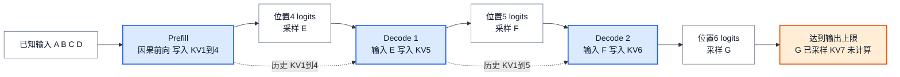

# 自回归生成与 Prefill / Decode：一个 token 何时成为历史

> **文献基线**：[Attention Is All You Need，arXiv:1706.03762v7](https://arxiv.org/pdf/1706.03762v7)（2023-08-02，§3.1–3.2）；[PagedAttention，arXiv:2309.06180v1](https://arxiv.org/pdf/2309.06180v1)（2023-09-12，§2.1–2.3）。来源索引分别见 `raw/01_theory/01_models/Attention_Is_All_You_Need-1706.03762.md` 和 `raw/01_theory/05_inference/PagedAttention-2309.06180.md`。
> **主题**：从因果条件概率出发，说明已知 prompt 为什么能一次前向、未知输出为什么仍须逐 token 生成；用同一序列追踪模型输入、KV 状态和采样结果的时间差。
> **适用范围**：讨论带因果自注意力的自回归、decoder-only 语言模型。KV 的复用和容量、采样规则、服务调度分别由后续专题负责；此处只给理解执行顺序所需的最小语义。
> **最近更新**：2026-09-17。新建原理页；论文静态阅读，未核验特定引擎代码或运行性能实验。

## 1. 为什么输入可以并行，输出却要等下一轮

给定 token 序列 $x_1,\ldots,x_n$，自回归模型把联合概率分解为逐位置的条件概率：

$$
p(x_1,\ldots,x_n)=\prod_{i=1}^{n}p(x_i\mid x_1,\ldots,x_{i-1}).
$$

生成时，prompt 的全部 token 已知，因此可在一次 **prefill** 前向中计算每个已知位置的表示；位置 $i$ 只能读取不晚于 $i$ 的位置，这是因果掩码维持的约束。前面的位置在同一层内不必等后面的位置算完，多个位置可以组成矩阵计算。模型层与层之间仍有依赖，所谓“并行”不是把整个模型一次算完。Transformer 论文 §3.1–3.2.3 给出了掩码和按位置的注意力规则；PagedAttention 论文 §2.2 将完整 prompt 的前向称为 prompt phase。[来源：Transformer §3.1–3.2.3](https://arxiv.org/pdf/1706.03762v7)，[PagedAttention §2.2](https://arxiv.org/pdf/2309.06180v1)。

下一枚输出 token 不在 prompt 中。先前向得到最后一个已知位置的 logits，再按某个解码规则选出新 token，才能为它计算下一步的模型表示。因此单个请求的第 $t+1$ 个输出在语义上依赖第 $t$ 个输出；不能把未知输出当成 prompt 一起送入一次普通前向。把整段历史每轮从头重算也能求同一条件分布，但会重复计算历史。保留历史 KV 则只需将新输入位置与历史状态结合；其成立条件见后续 KV 专题。[来源：PagedAttention §2.1–2.2](https://arxiv.org/pdf/2309.06180v1)。

## 2. 一个四输入、三输出的逐轮账本

以下是**教学算例**，`A B C D` 表示四枚 prompt token，`E F G` 表示三枚由示意采样器选出的输出；字母不是论文实测数据。固定模型、位置和因果掩码。`KV[1:4]` 表示四个位置在所有适用层的 KV 已经算出，不指某个具体物理块。

| 阶段 | 本轮送入模型 | 前向完成后已有的 KV | 最后位置的 logits 用来选 | 采样后尚未算出自身 KV 的 token |
|---|---|---|---|---|
| Prefill | `A B C D`，位置 1–4 | `KV[1:4]` | 第 5 位 `E` | `E` |
| Decode 1 | `E`，位置 5 | `KV[1:5]` | 第 6 位 `F` | `F` |
| Decode 2 | `F`，位置 6 | `KV[1:6]` | 第 7 位 `G` | `G` |

**图的规格**：横向顺序为 prefill、decode 1、decode 2；每一轮从“本轮已知输入”经过“因果前向、追加该输入的 KV”和“从末位 logits 采样”到“下一轮待处理 token”。历史 KV 以辅助边进入后续前向；图末标出达到三枚输出上限时 `G` 已输出但 `KV[7]` 尚不存在。这张拓扑图不表示时间比例，也不表示某种引擎的缓存布局。

图中前向和采样分开的原因是：**logits 属于已处理的输入位置，选出的 token 才是下一位置的输入**。若把 `E` 在 prefill 后直接记为已有 `KV[5]`，下一轮会错过对 `E` 的模型计算；若在达到输出上限后硬要计算 `G`，则多做了一轮无用前向。PagedAttention §2.2 也明确把 prompt phase 的首个输出与随后迭代读取该输出 token 的过程分开。[来源：PagedAttention §2.2](https://arxiv.org/pdf/2309.06180v1)。

## 3. 每轮的形状、依赖与可并行处

对一个请求、一层因果自注意力，暂不考虑 padding 和并行切分：prompt 长 $S=4$ 时，prefill 的 query/key/value 都覆盖四个输入位置，注意力分数为 $4\times4$ 的下三角有效区域；位置 4 的输出表示进入 logits 头。接着输入位置 5 的 `E` 时，本轮只有一个新 query，但它须看位置 1–5 的 key/value，分数形状为 $1\times5$；输入位置 6 的 `F` 时变为 $1\times6$。这些形状是从因果注意力定义推得的**逻辑形状**，实际 kernel 可以分块或不物化完整分数矩阵。[依据：Transformer §3.2.1–3.2.3，Eq. (1)](https://arxiv.org/pdf/1706.03762v7)。

多请求可以在同一服务轮次中各处理自己已知的 token，并在 batch 维合并执行；这不消除**同一请求内部**第 5、6、7 位的条件依赖。批调度和 token 预算属于后续调度专题。推理服务也可在 prefill 中只算用于下一 token 的最后位置 logits，而前面位置的 KV 仍须按因果依赖建立。这里说的是数学上所需的结果，不规定各引擎如何派发算子。[来源：PagedAttention §2.2–2.3](https://arxiv.org/pdf/2309.06180v1)。

## 4. 结束、输出与适用边界

普通生成在采样到 EOS 或达到输出长度上限时结束；若需要继续生成，刚采到的 token 必须在下一次前向中作为输入。这两个结束条件出自 PagedAttention §2.2。服务端何时把采样结果发送到客户端、是否缓冲以及何时释放状态，另受协议和实现影响；**模型算出 logits、采样出 token、用户看见 token**不是同一个事件。[来源：PagedAttention §2.2](https://arxiv.org/pdf/2309.06180v1)。

本页的逐轮表假设普通单路径生成。投机验证可一次评估若干**已提出的候选**位置；它仍须处理候选是否被接受及拒绝后的状态边界，不能拿来反驳普通自回归的条件依赖。编码器—解码器模型还包含 encoder 输出上的交叉注意力；Transformer 原文 §3.2.3 明确区分了它与 decoder 的因果自注意力。因此上面的 KV 账本只针对 decoder 自注意力，不覆盖 encoder 或 cross-attention 的缓存。[来源：Transformer §3.2.3](https://arxiv.org/pdf/1706.03762v7)。

本页没有给出“prefill 总是算力受限、decode 总是带宽受限”的无条件结论。PagedAttention §2.2 报告的是典型服务情形；具体瓶颈还随长度、batch、模型形状、量化、设备和算子实现变化。性能账应在专页按工作负载计算与测量。

## Related Pages

- [[01_theory/01_models/attention_is_all_you_need_analysis|Transformer 架构]] — 查看因果掩码与注意力的模型背景。
- [[12_kv_cache_analysis|KV Cache：复用依据与容量]] — 继续追踪已处理位置的 K/V 何时可复用、需要多少容量。
- [[02_engineering/03_infer_frameworks/01_llm_inference_technology_stack_analysis|推理技术栈全景]] — 从生成语义进入调度、KV 和服务实现层。
- [[02_engineering/03_infer_frameworks/vllm/08_vllm_kv_cache_management_analysis|vLLM KV Cache 管理]] — 查看一个固定源码基线中的 KV 分配、共享和回收。
- [[02_engineering/03_infer_frameworks/vllm/14_vllm_sampling_structured_output_analysis|vLLM 采样与结构化输出]] — 查看特定引擎怎样把 logits 转为输出 token。
