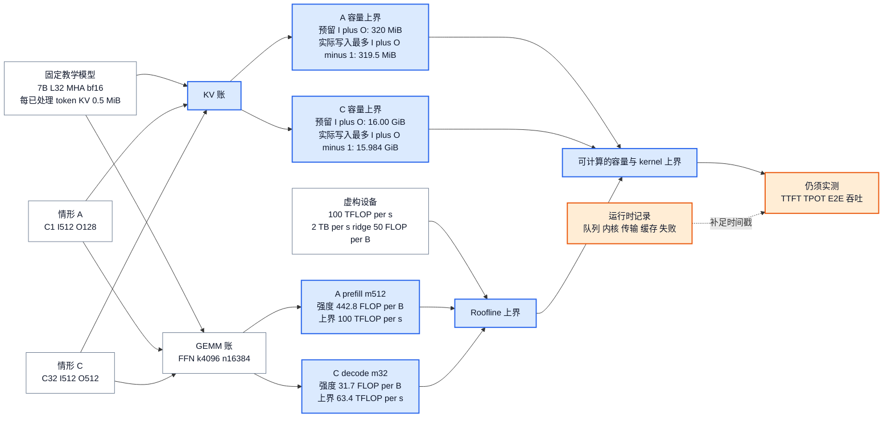

# 推理性能与资源成本模型：把 token 延迟、显存和硬件上界放进同一本账

> **文献基线**：[Roofline: An Insightful Visual Performance Model for Multicore Architectures，Communications of the ACM 52(4)](https://aiichironakano.github.io/cs596/Williams-Roofline-CACM09.pdf)（2009-04，p. 67–68；来源索引 `raw/01_theory/05_inference/Roofline-2009.md`）；[NVIDIA NIM LLM Benchmarking Metrics](https://docs.nvidia.com/nim/benchmarking/llm/1.0.0/metrics.html)（文档版本 1.0.0，2026-04-01，Metrics）；[NVIDIA AIPerf Metrics Reference](https://docs.nvidia.com/aiperf/dev/reference/ai-perf-metrics-reference) 与 [NVIDIA GenAI-Perf](https://docs.nvidia.com/deeplearning/triton-inference-server/user-guide/docs/perf_benchmark/genai-perf-README.html)（动态官方文档，访问快照 2026-09-17；官方指标索引 `raw/01_theory/05_inference/InferenceCostModelSources-20260917.md`）；[PagedAttention，arXiv:2309.06180v1](https://arxiv.org/pdf/2309.06180v1)（2023-09-12，§2.2；来源索引 `raw/01_theory/05_inference/PagedAttention-2309.06180.md`）。
> **主题**：定义流式生成的延迟、吞吐与有效吞吐口径，并用显存账、GEMM 形状和 Roofline 上界解释同一负载何以呈现不同成本；固定教学模型贯穿长度、并发和输出长度三个情形。
> **适用范围**：面向带 KV Cache 的稠密 decoder-only 推理，给出容量和性能的可审计近似。KV 表示的结构推导属于 [[12_kv_cache_analysis|KV Cache 专题]]，实验设计、工具和统计结论属于后续评测页；本文不报告任何本机或引擎实测。
> **最近更新**：2026-09-17。新建原理页；原始论文与官方指标文档已静态核验，数值账本和硬件参数均为明确标注的教学推演。

## 1. 先把“快”拆成可比较的时间点

一次流式请求至少有到达、实际发出、首个内容响应和末个内容响应四个时间点。令第 $i$ 个请求在客户观测点的到达时刻为 $t_{i,\mathrm{arr}}$，首个内容 token 为 $t_{i,\mathrm{first}}$，最后内容 token 为 $t_{i,\mathrm{last}}$，输出 token 数为 $O_i$。若记录的是服务端入队、调度或 kernel 时间，应另起字段；不能和客户端时钟混称同一指标。

常用的请求级定义是：

$$
\begin{aligned}
\operatorname{TTFT}_i
&=t_{i,\mathrm{first}}-t_{i,\mathrm{arr}}, \\
\operatorname{TPOT}_i
&=\frac{t_{i,\mathrm{last}}-t_{i,\mathrm{first}}}{O_i-1},
\qquad O_i\geq2, \\
\operatorname{E2E}_i
&=t_{i,\mathrm{last}}-t_{i,\mathrm{arr}}.
\end{aligned}
$$

**来源事实。** NVIDIA 的 NIM 指标页将 TTFT 定义为提交请求到收到第一枚 token，给出 $\operatorname{E2E}=\operatorname{TTFT}+\operatorname{GenerationTime}$，并用 $(\operatorname{E2E}-\operatorname{TTFT})/(O-1)$ 定义不含首 token 的 ITL/TPOT 口径。[来源：NIM Metrics，TTFT、E2E、ITL](https://docs.nvidia.com/nim/benchmarking/llm/1.0.0/metrics.html) 该文档同时提醒：不同工具可能是否把 TTFT 纳入 ITL，因而同名数字未必可直接比较。

若流式接口一次返回 $n_{i,j}$ 枚 token，而非恰好一枚，则第 $j$ 个响应块的间隔应写成

$$
\operatorname{ITL}_{i,j}
=\frac{t_{i,j}-t_{i,j-1}}{n_{i,j}},
\qquad j\geq2.
$$

这是一种把“块间隔”归一到 token 的**分析定义**。它解释了为什么 ITL 是流内体验，而系统吞吐是跨请求的容量；它不要求每个协议都按 token 切块。NVIDIA AIPerf 的当前参考也把 ITL 描述为排除初始 TTFT 的相邻 token 平均间隔，并单独定义每用户的 $1/\operatorname{ITL}$。[来源：AIPerf Metrics Reference，ITL 与 Output Token Throughput Per User](https://docs.nvidia.com/aiperf/dev/reference/ai-perf-metrics-reference)

设基准窗口从 $T_0$ 到 $T_1$，成功请求集合为 $\mathcal S$，则可明确写出系统口径：

$$
\begin{aligned}
\Theta_{\mathrm{out}}
&=\frac{\sum_{i\in\mathcal S}O_i}{T_1-T_0}, \\
Q_{\mathrm{succ}}
&=\frac{\lvert\mathcal S\rvert}{T_1-T_0}, \\
\Theta_{\mathrm{good}}
&=\frac{\sum_i O_i\,\mathbf{1}\{i\text{ 成功且满足预先声明的 SLO 与质量门}\}}{T_1-T_0}.
\end{aligned}
$$

这里 $\Theta_{\mathrm{out}}$ 是输出 tokens/s，$Q_{\mathrm{succ}}$ 是成功 requests/s，$\Theta_{\mathrm{good}}$ 是本文采用的**有效输出吞吐**。有效吞吐把失败、超 SLO 或未过质量门的输出从分子剔除；门限、质量判定和窗口必须随报告给出，否则它只是另一个不可复现的名字。官方 NIM 文档也展示了同为 TPS 时，分母可取“第一请求到最后响应”或整个基准运行期，且两者会纳入不同的客户端开销。[来源：NIM Metrics，TPS](https://docs.nvidia.com/nim/benchmarking/llm/1.0.0/metrics.html)

## 2. 一张账如何从请求合同走到用户看到的结果

**图的规格**：左侧固定写出教学模型、A/C 请求形状和虚构设备上界；中间把这些输入算成 KV 的预留与实际写入上界，以及两个 GEMM 的算术强度与 Roofline 上界；右侧只保留须实测的时间戳和指标。主箭头表达输入到可复算成本，橙色节点标出不能由账本预测的运行时量。图不把任何阶段预先标成固定的算力或带宽瓶颈。

这张图表达的是**归因顺序**：A、C 的固定输入先导出可检查的容量和 kernel 上界；容量足够是请求能被准入的条件，Roofline 是单个 kernel 的上界，二者都不自动给出端到端延迟。右端没有把 TTFT 或 TPOT 写成算出的数字，因为它们仍须用到达、准入、首响应和末响应时间戳测量。PagedAttention 把 prompt 的一次前向与随后逐 token 的生成分开，并指出后者会从 KV Cache 取已计算状态；它提供阶段语义，而非“prefill 或 decode 必然受限于某资源”的定律。[来源：PagedAttention §2.2](https://arxiv.org/pdf/2309.06180v1)

## 3. 显存账：先数长期驻留，再数峰值临时量

对一个已选定精度和模型版本，可把峰值预算写成下面的账户式近似：

$$
M_{\mathrm{peak}}
\approx
M_{\mathrm{weight}}+M_{\mathrm{KV}}+M_{\mathrm{act,peak}}
+M_{\mathrm{workspace,peak}}+M_{\mathrm{runtime}}.
$$

它是预算检查表，不是所有分配器都严格相加的物理定律：内存池可能复用 buffer，某些 workspace 与激活峰值不会同时出现，分片或复制又会改变每卡视角。因此计量时应同时保留“实际已分配”和“保留池”口径，且按峰值时间点核对是否重叠。

| 账户 | 可由模型或负载先估的部分 | 运行时必须补录的部分 |
|---|---|---|
| 权重 $M_{\mathrm{weight}}$ | 参数数 $P$ 乘存储字节 $b_w$；量化权重还需 scale、零点或元数据 | 权重分片、复制、副本与加载器的峰值副本 |
| KV $M_{\mathrm{KV}}$ | 当前在途序列的历史长度、层数、KV 头数、每头维度和 dtype | 块内空位、共享、量化 scale、复制、预留与淘汰策略 |
| 激活 $M_{\mathrm{act,peak}}$ | 某 kernel 的输入、输出和中间张量形状 | 是否融合、分块、重计算和 allocator 复用 |
| 工作空间 $M_{\mathrm{workspace,peak}}$ | 无可靠的模型常数；随算子、形状、库版本变化 | GEMM、attention、通信、图捕获所选算法的临时区 |
| 运行时 $M_{\mathrm{runtime}}$ | 无可靠的模型常数 | CUDA 或驱动上下文、通信库、碎片和未归属 buffer |

**教学账本的固定模型。** 以下所有例子使用一个稠密 decoder-only 模型：参数数 $P=7.0\times10^9$，$L=32$ 层，隐藏维度 $h=4096$，$H_q=H_{\mathrm{kv}}=32$，每头维度 $d=128$，权重与 KV 都按 bf16 的 $2$ B/元素存储。它不是某个已发布模型的配置，也不是部署建议。为让容量可复算，暂定 MHA、完整历史、没有分页碎片、没有 KV 量化或跨卡复制。

在这些前提下，权重约为 $P\times2=14{,}000{,}000{,}000$ B，即 $13.04$ GiB。每个已处理 token 的 KV 是

$$
m_{\mathrm{KV/token}}
=2L H_{\mathrm{kv}}db
=2\times32\times32\times128\times2
=524{,}288\ \mathrm{B}
=0.5\ \mathrm{MiB}.
$$

这个式子只用于本教学模型；KV 表示为什么由 $H_{\mathrm{kv}}$、布局和架构决定，以及 MQA/GQA/MLA 的改写方式，见 [[12_kv_cache_analysis|KV Cache：复用依据与容量]]。

| 情形 | 固定请求合同 | 预留或容量上界，每请求 $I+O$ | KV 预留或上界 | 实际已写 KV 的上限，每请求 $I+O-1$ | 实际 KV 上限 | 账本预测的压力 |
|---|---|---:|---:|---:|---:|---|
| A 短互动 | $C=1,I=512,O=128$ | 640 | 320 MiB | 639 | 319.5 MiB | 单请求的 token 间体验与启动开销可能突出 |
| B 长上下文 | $C=4,I=4096,O=128$ | 4224 | 8.25 GiB | 4223 | 8.248 GiB | 历史驻留和长 prefill 同时抬高准入压力 |
| C 高并发输出 | $C=32,I=512,O=512$ | 1024 | 16.00 GiB | 1023 | 15.984 GiB | 多序列的 KV 驻留先消耗容量，随后才讨论批处理收益 |

前三列保留 $I+O$，因为它适合表达按最大输出预留的容量上界；最后一个到达输出上限的采样 token 不会再成为下一轮输入，故实际已写 KV 的上限少每请求一个 token。差额分别为 A 的 $0.5$ MiB、B 的 $2$ MiB、C 的 $16$ MiB。以实际写入上限计，权重加 KV 分别约为 $13.35$、$21.29$、$29.02$ GiB；表内的两个 KV 列和这些合计都**故意未加**激活、workspace 和运行时余量，不能拿来宣称某张 24 GiB 或 40 GiB 卡“刚好能跑”。反过来，A 的 KV 很小也不证明 TTFT 很低，因为排队、权重读取、输入长度和预处理仍在路径上。

## 4. GEMM 形状与 Roofline：先算上界，再承认上界不等于实测

线性层 $[m,k]\times[k,n]\rightarrow[m,n]$ 的常规 FLOP 账为

$$
F_{\mathrm{GEMM}}=2mkn.
$$

若输入、权重和输出都需要从或写回主显存，且权重在这个 GEMM 内只计一次，可用下列**下界流量模型**近似算术强度：

$$
\begin{aligned}
D_{\mathrm{GEMM}}
&\approx b_a(mk+mn)+b_wkn, \\
I_{\mathrm{GEMM}}
&=\frac{F_{\mathrm{GEMM}}}{D_{\mathrm{GEMM}}}.
\end{aligned}
$$

$b_a$、$b_w$ 分别是激活和权重元素字节数。这不是 profiler 的字节计数：缓存命中、分块、重读、融合、量化格式和通信都会改变真实流量。Roofline 原论文把可达性能写为峰值浮点性能与“峰值内存带宽乘 operational intensity”的较小值；其横轴正是每个 DRAM 字节对应的 FLOP，并强调这是 kernel 上界。[来源：Williams 等，2009，p. 67–68](https://aiichironakano.github.io/cs596/Williams-Roofline-CACM09.pdf)

$$
\Pi_{\mathrm{roof}}
=\min\left(\Pi_{\mathrm{peak}},\ B_{\mathrm{mem}}I\right),
\qquad
I_{\mathrm{ridge}}=\frac{\Pi_{\mathrm{peak}}}{B_{\mathrm{mem}}}.
$$

为了沿用同一本账，把教学模型中 FFN 的第一投影取为 $k=h=4096$、$n=4h=16384$，并令 $b_a=b_w=2$ B。再**假定一台虚构设备**有 $\Pi_{\mathrm{peak}}=100$ TFLOP/s、$B_{\mathrm{mem}}=2$ TB/s，故 ridge point 是 $50$ FLOP/B；这两个硬件数不是任何产品规格。

| 同一 FFN 投影的 $m$ | 对应教学阶段 | $F_{\mathrm{GEMM}}$ | 流量下界 $D_{\mathrm{GEMM}}$ | $I_{\mathrm{GEMM}}$ | Roofline 上界 |
|---:|---|---:|---:|---:|---:|
| 512 | A 的单请求 prefill | 68.72 GFLOP | 148.00 MiB | 442.8 FLOP/B | 100 TFLOP/s |
| 1 | A 的单请求单轮 decode | 134.22 MFLOP | 128.03 MiB | 1.0 FLOP/B | 2.0 TFLOP/s |
| 32 | C 的一轮合批 decode | 4.29 GFLOP | 129.25 MiB | 31.7 FLOP/B | 63.4 TFLOP/s |

**教学推断。** 在这一“权重从显存读一次”的模型里，prefill 的大 $m$ 能把同一矩阵的权重流量摊到更多 token，算术强度跨过 $50$ FLOP/B 的 ridge；batch 为 1 的 decode 则没有这种摊销。将 32 条 decode 合批提高了 $m$，但仍未跨过该虚构设备的 ridge。它解释了为什么合批常有价值，却**不能**推出“prefill 必然算力受限、decode 必然带宽受限”：真实瓶颈还取决于 attention 的历史读取、实际 kernel、cache 层级、量化、并行通信、长度分布和设备。

对注意力的直觉也须带条件。对于 MHA、单层、一个新 query 且历史为 $S$ 的简化计数，QK 与加权 V 的计算随 $S H_qd$ 增长，K/V 的读取也随 $S H_{\mathrm{kv}}d$ 增长；若 $H_q=H_{\mathrm{kv}}$ 且 K/V 从主显存读取，粗略 FLOP/B 可接近常数。它提示长历史 decode 可能受数据移动约束，但不是全层、更不是端到端的实测分类。PagedAttention 的原文也只在其服务讨论的条件下描述 memory-bound 的 decoder phase。[来源：PagedAttention §2.2](https://arxiv.org/pdf/2309.06180v1)

## 5. 长度、batch 与排队如何共同改变延迟吞吐取舍

对相同模型，prefill 的 token 矩阵行数近似为当前批中输入 token 总数，因果 attention 的有效配对还随每条 prompt 长度呈二次增长；decode 则每轮只新增少量 query，却要为每条活跃序列读取不断增长的历史 KV。长度 $S$ 同时进入 KV 容量账和 attention 数据移动账，不能只在“token 数”列里登记一次。

batch 增大通常会让 GEMM 的 $m$ 变大、提高设备利用机会；同时也会增加本轮要等的请求数、KV 驻留、队列中其他请求的等待和某些通信量。高系统输出吞吐可以与单用户 TPOT 变差同时发生。NIM 文档明确区分系统总 TPS 和每用户 TPS，指出并发增加时前者可增长而后者可下降。[来源：NIM Metrics，TPS](https://docs.nvidia.com/nim/benchmarking/llm/1.0.0/metrics.html)

将请求级 TTFT 拆为诊断模型，可写成

$$
\operatorname{TTFT}_i
=W_{i,\mathrm{client}}+W_{i,\mathrm{server}}
+T_{i,\mathrm{prep}}+T_{i,\mathrm{prefill}}
+T_{i,\mathrm{first\,stream}}.
$$

其中 $W_{i,\mathrm{client}}$ 可能来自压测客户端并发阀，$W_{i,\mathrm{server}}$ 是服务端实际准入前等待；后面三项还可能含 tokenization、网络、调度和首块反序列化。这个分解是**分析账**，不能从客户端 TTFT 单独识别每一项。若一个报告只从“已实际发出”开始计时，它可能把客户端排队移出 TTFT；若服务端先排队再测 kernel，它又可能漏掉用户等待。必须同时报告时间戳边界与并发限制。

教学账本因此给出的是三条待验证假设，而非结论：A 适合检查小 batch 的启动、调度和单用户间隔；B 先检查容量余量、长 prefill 与排队竞争；C 先检查 KV 准入和单用户 TPOT 是否被总吞吐收益抵消。改变其中一个变量时，应固定模型、dtype、输入和输出分布、共享前缀状态、到达过程、成功判定和 SLO；否则账本前后的差额没有单一解释。

## 6. 测量偏差：模型不能替代记录

下面的边界不是附注，而是决定数值是否可比较的前提。

| 可能混入分母或分子的因素 | 会怎样误导结论 | 报告时的最低处理 |
|---|---|---|
| 首 token 的定义 | 空文本、特殊 token 或一个含多 token 的流块会改变 TTFT/ITL | 写明以何种内容响应为首，记录每块 token 数 |
| 窗口边界 | 从首请求到末响应与全运行期会给出不同 TPS | 给出 $T_0,T_1$ 的事件定义和成功、失败总数 |
| 输出长度与 EOS | 较短输出可虚增 requests/s 或掩盖 decode 成本 | 同时报输入、输出的分布和 stop/EOS 规则 |
| warmup、编译与图捕获 | 冷态和热态混在一起会把一次性成本误当稳态 | 分开报告冷态、warmup 协议和正式窗口 |
| 前缀命中与 KV 状态 | 缓存命中改变实际 prefill 工作量 | 固定并报告共享前缀比例、缓存开关和清理协议 |
| 客户端并发阀与网络 | 客户端 queue 可能把压力藏在服务端指标之外 | 记录计划到达、实际发出、服务端接收与响应时间点 |
| 平均值与选择成功样本 | 少数长尾、失败或超 SLO 请求会被平均吞掉 | 报告成功率、分位数、失败原因和 $\Theta_{\mathrm{good}}$ 的门 |

NVIDIA GenAI-Perf 的官方说明将 TTFT、ITL、请求吞吐和输出 token 吞吐并列为 LLM 指标，也要求用户指定并发或请求率；这支持“负载合同是指标的一部分”的做法，却不替代特定服务的端到端验证。[来源：GenAI-Perf，Overview 与 Metrics](https://docs.nvidia.com/deeplearning/triton-inference-server/user-guide/docs/perf_benchmark/genai-perf-README.html) 本页的公式和账本用于在测量前提出可证伪的资源假设；实际数值、分位数和优化结论应在后续评测页按冻结工作负载取得。

## Related Pages

- [[10_prefill_decode_analysis|自回归生成与 Prefill / Decode]] — 先厘清 prompt 和逐 token 阶段的执行语义，再给它们分别计时。
- [[12_kv_cache_analysis|KV Cache：复用依据与容量]] — 深入每 token KV 表示、头布局和容量公式的架构前提。
- [[02_engineering/03_infer_frameworks/01_llm_inference_technology_stack_analysis|推理技术栈全景]] — 将本页的三本账放回从请求入口到 GPU 执行的完整服务路径。
- [[02_engineering/03_infer_frameworks/vllm/04_vllm_performance_tuning_guide|vLLM 性能调优指南]] — 查看固定源码基线中的指标采集、负载合同和单变量实验做法。
- [[02_engineering/03_infer_frameworks/vllm/23_vllm_observability_reliability_analysis|vLLM 可观测性与可靠性]] — 用队列、KV、错误和健康信号辨别资源账与真实运行的差异。
