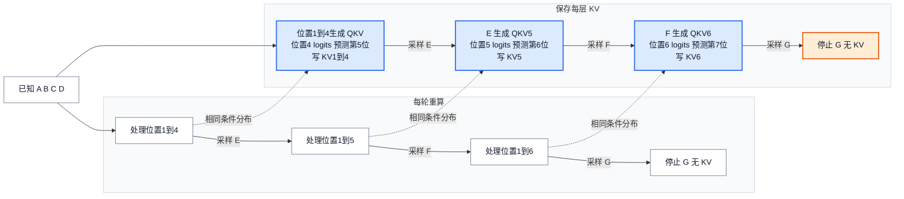

# KV Cache：为什么历史可以复用，以及它占多少内存

> **文献基线**：[PagedAttention，arXiv:2309.06180v1](https://arxiv.org/pdf/2309.06180v1)（2023-09-12，§2.1–2.2）；[Multi-Query Attention，arXiv:1911.02150v1](https://arxiv.org/pdf/1911.02150v1)（2019-11-06，§2.4、§3）；[GQA，arXiv:2305.13245v1](https://arxiv.org/pdf/2305.13245v1)（2023-05-22，§2.2、Fig. 2）；[DeepSeek-V2，arXiv:2405.04434v1](https://arxiv.org/pdf/2405.04434v1)（2024-05-07，§2.1.1–2.1.4、Table 1）。前三者的来源索引位于 `raw/01_theory/05_inference/`，后者见 `raw/01_theory/01_models/deepseek/DeepSeek_V2-2405.04434.md`。
> **主题**：因果注意力为何允许复用历史 K/V；一个请求怎样按位置追加每层状态；缓存容量为什么由真实 KV 表示而非 query 头数单独决定。
> **适用范围**：先讨论普通因果、稠密自注意力及正确位置/模型身份下的完全历史缓存。分页、跨请求前缀、选择性保留、分层卸载和混合循环状态分别留给各自专题；这里不把某引擎的块池规则写成通用原理。
> **最近更新**：2026-09-17。新建原理页；论文静态阅读，未核验特定引擎代码或运行性能实验。

## 1. 重算历史的浪费从哪里来

生成下一 token 时，新 query 必须读取允许访问的历史 key 和 value。朴素做法是把截至当前位置的完整序列每轮重新送入模型；它会反复计算相同历史位置的中间表示。KV Cache 保存**每层、每个已处理位置**的 K/V，使下一轮只计算新输入位置的 query 和 K/V，再用“历史 K/V + 本轮 K/V”做注意力。它避免历史位置的重复前向，但不消除新 query 对历史 K/V 的读取。[来源：PagedAttention §2.1–2.2](https://arxiv.org/pdf/2309.06180v1)，[Multi-Query Attention §2.4](https://arxiv.org/pdf/1911.02150v1)。

为什么这条捷径成立？因果掩码保证位置 $j$ 的表示只依赖位置 $1$ 到 $j$。在**同一模型、相同前缀 token、相同位置与注意力规则**下，后来追加位置 $j+1$ 不会改变旧位置 $j$ 的输入。逐层归纳：第一层的旧 K/V 不变，所以下一层旧位置的输入也不变，直到所有层。因此旧 K/V 可作为后续前向的历史状态。这是由论文中的因果注意力规则推出的分析论证；它不保证不同 kernel 的浮点舍入逐位相等，也不意味着任意状态都可缓存。[依据：Transformer §3.1–3.2.3](https://arxiv.org/pdf/1706.03762v7)，[PagedAttention §2.1–2.2](https://arxiv.org/pdf/2309.06180v1)。

## 2. 用同一序列对账：有缓存与无缓存

沿用[[10_prefill_decode_analysis|Prefill / Decode]]的**教学算例**：prompt 是 `A B C D`，依次采样 `E F G`，采样规则及模型参数固定。若只求三枚输出，模型真正处理的输入位置依次是 1–4、5、6；`G` 被采出后达到输出上限，尚未成为已处理位置。

| 第几次前向 | 无缓存：重新处理位置 | 有缓存：本轮新处理位置 | 有缓存：本轮读入的历史 KV | 前向后缓存覆盖 | 本轮采样 |
|---|---|---|---|---|---|
| Prefill | 1–4 | 1–4 | 无 | 1–4 | `E` |
| Decode 1 | 1–5 | 5，即 `E` | 1–4 | 1–5 | `F` |
| Decode 2 | 1–6 | 6，即 `F` | 1–5 | 1–6 | `G` |

**图的规格**：两条路线从同一个 prompt 出发，分别走“每轮重算完整前缀”和“prefill 后只计算新输入”；每轮都标本轮输入范围、采样 token、有缓存路线的读/写 KV。跨路线虚线表示在相同模型和前缀下目标条件分布相同，不表示浮点计算逐位相同。停止点标明 `G` 已采样但没有 `KV[7]`。该图只表达因果和状态转移，不表示物理块布局或时间比例。

这三轮在无缓存路线共处理 $4+5+6=15$ 个位置；有缓存路线共新处理 $4+1+1=6$ 个位置。若只数单层、单头稠密因果注意力的有效 query–key 位置对，无缓存路线为 $10+15+21=46$，有缓存路线为 $10+5+6=21$。这些是**教学算术**，不是 FLOPs、运行时间或通用加速比：投影、FFN、内存读取、kernel 启动和批处理都会改变实际成本。尤其有缓存的 decode 仍要读取不断增长的历史，不能说“每轮成本恒定”。

## 3. 状态是什么，谁可以复用它

对每层 $\ell$、已处理位置 $t$，状态至少包含该层的 $K_{\ell,t}$ 和 $V_{\ell,t}$，并须与请求的 token 前缀和位置语义绑定。Prefill 建立位置 1–4 的状态；Decode 1 在读 1–4 的同时产生位置 5 的 K/V；Decode 2 读 1–5 并产生位置 6。完成时，这个请求不再需要其私有历史；是否继续保留供别的请求命中，属于跨请求前缀缓存策略，不是“KV Cache”一词本身的必然含义。PagedAttention §2.2 明确指出，同一个 token 出现在不同位置或不同历史下，其 KV 可以不同。[来源：PagedAttention §2.2](https://arxiv.org/pdf/2309.06180v1)。

“文本相同”不足以保证复用。不同 tokenizer 可能给出不同 token 序列；相同 token 子串前面若接了不同历史，隐藏状态就不同。模型权重或 adapter 变更、位置编码变化、注意力可见范围变化，也会破坏上面的逐层归纳前提。对于滑动窗口、交叉注意力或循环状态，须重新分析它们保存的状态和失效条件，不能直接照搬本页的完全历史缓存论证。这些是由依赖关系推出的**适用边界**，不是声称每种引擎都实现了同一种失效检查。

## 4. 容量账：先写明架构和布局

设单请求保存 $S$ 个位置、$L$ 个具有同样 KV 形状的注意力层、每层 $H_{\mathrm{kv}}$ 个 KV 头，key/value 每头维度分别为 $d_k,d_v$，每个元素占 $b$ 字节；完整历史、无分页碎片、无额外 scale/metadata、每层都实际保存 K 和 V 时，**理想数据体积**是

$$
M_{\mathrm{KV}}=S L H_{\mathrm{kv}}(d_k+d_v)b.
$$

推导只是在每个位置每层数出 $H_{\mathrm{kv}}d_k$ 个 K 元素和 $H_{\mathrm{kv}}d_v$ 个 V 元素，再乘位置、层和字节数。请求长度不同则逐请求相加；不能简单把“最大长度 × 最大并发”当成当前实占。实际池还可能有块内空位、对齐、元数据、量化 scale、复制和暂存，因此公式既非总显存，也非所有注意力架构通式。[依据：DeepSeek-V2 §2.1.1、Table 1](https://arxiv.org/pdf/2405.04434v1)。

用**教学参数** $S=6,L=2,H_q=4,d_k=d_v=8,b=2$ 复算，且所有层同形：

| 注意力头布局 | $H_{\mathrm{kv}}$ | 每 token 的两层 KV | 六位置 KV |
|---|---:|---:|---:|
| MHA，四个 query 头各有 K/V | 4 | 256 B | 1536 B |
| GQA，四个 query 头分成两组 | 2 | 128 B | 768 B |
| MQA，四个 query 头共享一组 K/V | 1 | 64 B | 384 B |

GQA 的每组 query 共享一组 K/V；`GQA-1` 是 MQA，组数等于 query 头数时是 MHA。这是**头布局**差异，减少 KV 字节和历史读取量，不会把模型数学结果自动保持为原 MHA：采用不同头布局需要相应模型权重或转换训练。[来源：GQA §2.1–2.2、Fig. 2](https://arxiv.org/pdf/2305.13245v1)，[Multi-Query Attention §3](https://arxiv.org/pdf/1911.02150v1)。

MLA 不能只把 $H_{\mathrm{kv}}$ 代成一个更小头数。DeepSeek-V2 的 MLA 把内容 K/V 联合压到每位置每层 $d_c$ 维 latent，另存共享的解耦位置 key $d_h^R$ 维，因此论文 Table 1 的缓存元素数是每 token $L(d_c+d_h^R)$，再乘各自存储字节数才得到理想数据体积；若两种分量精度不同，要分别计字节。论文 §2.1.2–2.1.3 解释了为什么位置编码不能简单并入低秩上投影。这里只讨论**缓存表示与容量**，完整 MLA 模型机制归模型域。[来源：DeepSeek-V2 §2.1.2–2.1.4、Table 1](https://arxiv.org/pdf/2405.04434v1)。

## 5. 收益和失败边界

缓存的直接收益是省去历史位置的重复模型计算；直接代价是为每条在途序列保留状态，并在每个新 query 上读取历史。随着 $S$ 与并发增加，KV 容量可能限制能同时处理的请求数。MQA/GQA/MLA 改变**每位置的表示量**；分页、跨请求复用、压缩、卸载改变**状态的物理管理和驻留方式**。这些手段作用不同，需分别算容量与时间账。[来源：PagedAttention §2–3](https://arxiv.org/pdf/2309.06180v1)，[GQA §2.2](https://arxiv.org/pdf/2305.13245v1)。

若复用到不一致的历史，结果对应的是错误的条件分布；若需要的历史被提前释放，后续注意力没有完整输入。即使身份正确，容量公式仍可能因局部窗口、混合层、不同精度或显式复制而失效。接下来研究物理块映射时，应继续区分**KV 数据仍驻留、内容身份仍可命中、请求仍持有引用**三个不同命题。

## Related Pages

- [[10_prefill_decode_analysis|自回归生成与 Prefill / Decode]] — 对照本轮输入和刚采样但尚未产生 KV 的 token。
- [[01_theory/01_models/attention_is_all_you_need_analysis|Transformer 架构]] — 查看因果注意力为何使旧位置不依赖未来位置。
- [[01_theory/01_models/deepseek/11_deepseek_v2_analysis|DeepSeek-V2]] — 深入 MLA 的模型结构和位置编码设计。
- [[02_engineering/03_infer_frameworks/vllm/08_vllm_kv_cache_management_analysis|vLLM KV Cache 管理]] — 查看固定源码基线中块池、hash、引用与释放的实际行为。
