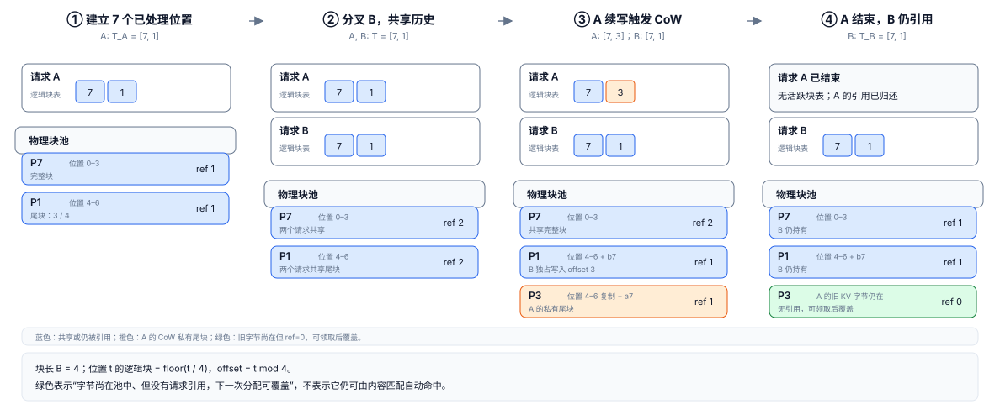

# 分页 KV 与 PagedAttention：让增长的历史按块落在块池中

> **文献基线**：[PagedAttention，arXiv:2309.06180v1](https://arxiv.org/pdf/2309.06180v1)（2023-09-12，§3、§4.1–4.5、§5.2、§7.1–7.2，Fig. 3、5–9、18）。来源索引见 `raw/01_theory/05_inference/PagedAttention-2309.06180.md`。本文只依论文版本讲分页块、映射和块粒度写时复制；不把今天某个 vLLM 版本的字段、策略或性能结果倒灌为论文事实。
> **主题**：把一条请求按 token 顺序看到的连续 KV 历史，映射到块池中可离散领取、共享和归还的物理块；PagedAttention 再经块表逐块读取这些 KV。
> **适用范围**：普通 Transformer 因果自注意力的 KV，以及论文提出的 paged KV 管理。本文不定义“哪些不同请求内容相同、应当命中哪份缓存”的身份与检索规则，该主题由 [[14_prefix_caching_analysis|Prefix Caching]] 负责；不展开特定引擎的块池实现、量化布局、调度或跨设备迁移。
> **最近更新**：2026-09-17。新建原理页；已逐段核对论文 HTML/PDF 对应版本，未把论文设计当作当前引擎运行实测。

## 1. 连续预分配为何会卡住增长中的请求

一条生成请求的 KV 会随着已处理 token 增长，而最终输出长度通常未知。论文 §3 指出，早期做法为每条请求一次性预留最大长度的连续区间；这会产生三类不同的占用：未来 token 的**预留空间**、请求结束才显露的**内部碎片**，以及不同大小连续区间留下的**外部碎片**。即使实际长度预先已知，整块连续区间在请求存活期间也不能借给短请求使用。[来源：PagedAttention §3、Fig. 3](https://arxiv.org/pdf/2309.06180v1)。

这不是 KV Cache 是否正确的数学问题。[[12_kv_cache_analysis|KV Cache]] 说明旧位置的 K/V 可以成为后续注意力的输入；这里的问题是怎样把那份历史放进有限的物理存储。将请求的 KV 分成固定 token 数的块，允许**一个请求的相邻逻辑块**落在不相邻的物理位置。固定大小还使池中每个可领取单元等大，因此在“按块分配”的层面消除了外部碎片；它没有消除最后一个未填满块的空槽。[来源：PagedAttention §4.1–4.2](https://arxiv.org/pdf/2309.06180v1)。

论文的类比是虚拟内存，但不要把类比扩大成操作系统语义：这里的逻辑地址是请求内的 token 位置，物理页是存 K/V 的块，块表是一次推理需要交给 kernel 的映射。论文仍让 block engine 先取得一段 GPU DRAM 并划成物理块；改变的是每个请求不必独占一条连续的最大长度区间。[来源：PagedAttention §4.2](https://arxiv.org/pdf/2309.06180v1)。

## 2. 四个坐标：逻辑 token、逻辑块、物理块与块内偏移

令块长为 $B$，已处理 token 的位置从 0 开始编号。对请求 $r$ 的位置 $t$，先得到逻辑块号 $l$ 和块内偏移 $o$，再从该请求的块表 $T_r$ 取物理块号 $p$：

$$
\begin{aligned}
l &= \left\lfloor \frac{t}{B} \right\rfloor, \\
o &= t \bmod B, \\
p &= T_r[l].
\end{aligned}
$$

位置 $t=6$、$B=4$ 时，$l=1,o=2$；若 $T_r[1]=1$，K/V 写入或读取物理块 $P1$ 的第 2 格。**$P1$ 是池编号，不是 byte 地址，也不是 CUDA thread block。**若某实现按层、按头或按层组维护不同表，公式仍描述每一张表的索引；论文 §4.1 明说 K/V 可整体管理，也可按头、层分别放块和表，选择取决于实现布局。[来源：PagedAttention §4.1，脚注 1](https://arxiv.org/pdf/2309.06180v1)。

在均匀、单表、每格恰好存一个 token 的教学布局里，可把它继续写成扁平 slot：

$$
\operatorname{slot}(r,t)=B\,T_r\!\left[\left\lfloor\frac{t}{B}\right\rfloor\right]+(t\bmod B).
$$

这只是帮助复算的**slot 编号**。真实 K/V 的字节地址还取决于层、头、元素形状、dtype、stride 与物理布局，不能把上式当成通用显存地址公式。

每个逻辑块表项还须知道已有多少有效格，避免读取最后块中尚未写入的位置。论文 §4.2 说明逻辑块从左到右填充，尾块的未填位置留给后续生成；它的 block table 记录逻辑块对应的物理块及填充数。[来源：PagedAttention §4.2](https://arxiv.org/pdf/2309.06180v1)。

## 3. 同一块池的贯穿算例：分叉、续写与释放

以下是**教学算例**，沿用论文 Fig. 8 的物理块编号 $P7,P1,P3$ 和“首条分支写共享尾块时 CoW、另一条随后原地写”的顺序，并额外补出 token 位置、offset 和释放后的状态；它不代表跨请求内容匹配。块长 $B=4$；A 已有位置 0–6，因而块表是 $T_A=[7,1]$：$P7$ 装 0–3，$P1$ 装 4–6，$P1$ 的 offset 3 仍空。B 由相同的已处理历史**分叉**而来，直接引用 A 的两块；这是同一请求多候选的共享模型。跨请求能否先证明“相同历史”并拿到这两块，留给 T14。

<!-- Figure spec: 四列状态图，固定块长 B=4。第 1 列为 A 的 7 个位置，表 [7,1]；第 2 列 B fork 后两个表引用同一 P7/P1，ref=2；第 3 列 A 在共享尾块续写，复制 P1 的三格到 P3 后写 a7，B 直接在 P1 offset3 写 b7；第 4 列 A 结束后 P3 ref=0，明确标“字节仍在、可覆盖”，P7/P1 仍由 B 引用。蓝色表示共享，橙色表示 CoW，绿色表示无引用且可分配。图不声称以 hash 发现同一前缀。 -->

图中的四轮账可以手算如下。第 2 轮后，$P7$ 与 $P1$ 都有引用计数 2。A 要把位置 7 的 K/V 写进逻辑块 1 时，直接写 $P1$ 会改掉 B 的历史；因此先取新块 $P3$，复制 $P1$ 中有效的 offset 0–2，把 A 的表项改为 $T_A[1]=3$，再在 $P3$ 的 offset 3 写入 $a_7$。此时 $P1$ 的计数从 2 降为 1，B 可以在自己独占的 $P1$ offset 3 写入 $b_7$。论文的 parallel sampling 例同样在共享尾块被第一条分支写入时分配新块、复制旧内容并递减旧块计数；随后另一条分支看到计数为 1，可以原地写。[来源：PagedAttention §4.4、Fig. 8](https://arxiv.org/pdf/2309.06180v1)。

| 快照 | A 的块表 | B 的块表 | 物理块与引用 | 可验证的结论 |
|---|---|---|---|---|
| A 已有 0–6 | `[7, 1]` | 不存在 | `P7:1`，`P1:1` | 位置 6：$l=1,o=2,p=1$；尾块空 1 格。 |
| B 分叉 | `[7, 1]` | `[7, 1]` | `P7:2`，`P1:2` | 两张逻辑表可以指向同一物理块。 |
| A、B 各写 7 | `[7, 3]` | `[7, 1]` | `P7:2`，`P1:1`，`P3:1` | A 的写不会污染 B；CoW 只复制一个尾块的有效数据。 |
| A 结束 | 无活跃表 | `[7, 1]` | `P7:1`，`P1:1`，`P3:0` | $P3$ 的旧字节可能仍在池中，但它已无引用，可被下次分配覆盖。 |

最后一行刻意区分三个常被混同的判断：**数据仍在**指尚未有后续写入覆盖的旧字节；**可复用作容量**表示该块没有活跃引用、分配器可领取并覆盖；**被请求引用**才表示一个活跃块表仍允许注意力读取它。前一个判断是为复算图状态作的存储层**分析推断**：论文定义的是引用到 0 后可 free 并再存其他请求 KV，并未规定任何实现何时清零物理字节。一个“无引用但仍有内容”的块是否还可按内容再次命中，需要内容身份、保留与淘汰策略，不能由引用计数或物理编号推出。[来源：PagedAttention §4.4–4.5](https://arxiv.org/pdf/2309.06180v1)。

论文把这些状态操作概括为 `fork`、`append` 和 `free`：fork 让新序列从旧序列开始，append 逐轮增加 token，free 删除到达停止条件的序列。这里的计数和复制顺序是它们在共享尾块上的必要物理后果；具体 API 名、异步 fence 或回收队列属于实现页，不能从论文的这三个操作名推导出来。[来源：PagedAttention §5.2](https://arxiv.org/pdf/2309.06180v1)。

## 4. Attention 怎样经块表读取 KV

分页不会改变因果注意力的可见位置。查询位置 $i$ 仍须读取 0 到 $i$ 的 K/V；区别是 kernel 先按逻辑块枚举这些位置所属的块，再用 $T_r$ 找到每一块的物理位置。对完整块 $j$，论文把逐 token 的注意力重写为块向量 $K_j,V_j$ 上的计算，最终仍对所有可见块归一化并求值向量的加权和。[来源：PagedAttention §4.1，Eq. (4)、Fig. 5](https://arxiv.org/pdf/2309.06180v1)。

对上例，B 在位置 7 的 query 读取逻辑块 0、1，即查表得到 $P7,P1$；只读取已填的 8 个位置。若查询发生在位置 6，则同样查 $P7,P1$，但最后块只能读取 offset 0–2。新块分配和块表更新必须在该轮读取/写入所依赖的映射建立后完成；论文描述的迭代顺序是先选候选序列、为新逻辑块分配物理块，再把本轮输入组成 batch，kernel 通过逻辑块所映射的物理块读取历史并写入新 KV。[来源：PagedAttention §4.3](https://arxiv.org/pdf/2309.06180v1)。

分页也不是“把 Attention 算法本身变成了另一种条件概率”。它是 KV 的**存储和寻址算法**；softmax 归一化、因果掩码和 K/V 表示仍由注意力模型与 kernel 实现决定。论文报告块表访问、额外分支与变长处理会增加其 attention kernel 的工作，并在所测配置下比高度优化的 FasterTransformer kernel 有 20–26% 更高的 attention kernel latency；因此不能从“减少碎片”推出每个短请求、每种 kernel 都更快。[来源：PagedAttention §7.1、Fig. 18(a)](https://arxiv.org/pdf/2309.06180v1)。

## 5. 块大小、碎片与元数据：省下的是什么，新增的又是什么

对独占的、已保存 $S$ 个 token 的请求，块数和末块空槽是：

$$
\begin{aligned}
n_{\mathrm{block}} &= \left\lceil \frac{S}{B}\right\rceil, \\
w_{\mathrm{tail}} &= \left\lceil \frac{S}{B}\right\rceil B-S, \\
0 &\leq w_{\mathrm{tail}} < B.
\end{aligned}
$$

这是**token 格的计数**，前提是固定块长、每 token 每张表占一个格、没有共享、没有预留的额外 block，也未把 K/V 字节形状或对齐纳入。A 的 $S=7,B=4$ 给出 $n_{\mathrm{block}}=2,w_{\mathrm{tail}}=1$；分叉后两条逻辑序列仍只占 $P7,P1$ 两个物理块，直到 A 写共享尾块才增加 $P3$。所以“每请求两块”与“池中占用两块”在共享情形不再等价。

块越小，单请求尾部的最大浪费上界越小，也能把共享边界切得更细；代价是更多表项、更多块管理记录和更多间接寻址。块越大，表更短、每块可并行处理的 token 更多，但短序列的尾部浪费和分叉时必须复制的上限更大。论文的 §7.2 在它的 ShareGPT/Alpaca 工作负载和模型配置下观察到这一权衡，并把 16 设为当时 vLLM 默认；这个数不是其他模型、设备、KV 表示或引擎的通用最优值。[来源：PagedAttention §7.2、Fig. 18(b)](https://arxiv.org/pdf/2309.06180v1)。

除了 KV payload，分页至少引入每请求的块表，以及每物理块的引用和空闲管理信息；块表数量随 $\lceil S/B\rceil$ 增长。这是由论文 §4.2 所述的 block table 和 §4.4 所述的 reference count 得出的**数据结构成本账**，不是论文给出的统一字节公式。实际元数据落在 CPU 还是设备、是否按层建表、条目宽度及同步开销都由具体实现决定。

## 6. 适用边界：分页、复用与计算各自回答什么

| 问题 | 本页的分页机制回答 | 仍需另页或具体实现回答 |
|---|---|---|
| 请求增长时 KV 放在哪里？ | 逻辑块表把连续 token 位置映射到按需领取的固定物理块。 | 块池容量预算、设备布局和执行同步。 |
| 多条序列已经共享历史，怎样安全续写？ | 共享尾块写入前分配私有块并做 CoW；引用到 0 才可归还容量。 | 如何证明两条请求的历史身份相同、如何检索与淘汰。 |
| Attention 如何读不连续的历史？ | kernel 由块表逐块定位 K/V，并在逻辑可见范围内计算。 | FlashAttention 等 IO/数值分块算法与具体 backend。 |
| 块被 free 后意味着什么？ | 活跃请求不再经其块表持有该物理块；它可作为容量被再次分配。 | 是否保留旧内容以便命中、是否迁移到 CPU/远端、何时物理擦除。 |

PagedAttention 适合“长度动态增长、KV 容量限制并发”的服务问题；论文也明确说 paging 的收益不能泛化到所有 GPU 工作负载：静态形状训练可以预先优化分配，而非 LLM 服务若主要算力受限，间接寻址与非连续块反而可能增加开销。[来源：PagedAttention §8](https://arxiv.org/pdf/2309.06180v1)。

本页的分叉算例故意不宣称 $P7,P1$ 是被 hash 自动发现的跨请求 prefix。分页提供“两个逻辑表能引用同一物理块”和“共享尾块如何安全写”的物理能力；内容等价、模型/位置/adapter 等身份条件、命中和保留策略由 [[14_prefix_caching_analysis|Prefix Caching]] 统一界定。更具体的 vLLM 块池、编号与引用生命周期则必须回到固定源码基线的工程页。

## Related Pages

- [[12_kv_cache_analysis|KV Cache：复用依据与容量]] — 先建立每层历史 K/V 的语义与 payload 容量，再看它怎样按物理块存放。
- [[10_prefill_decode_analysis|自回归生成与 Prefill / Decode]] — 对照哪些 token 已处理、何时产生新 KV，避免把刚采样的 token提前放进块表。
- [[02_engineering/03_infer_frameworks/vllm/08_vllm_kv_cache_management_analysis|vLLM KV Cache 管理]] — 查看固定 vLLM 源码基线如何把块池、表、引用和回收落实为具体对象与时序。
- [[02_engineering/03_infer_frameworks/01_llm_inference_technology_stack_analysis|推理技术栈全景]] — 将 paged KV 放回调度、执行 kernel、数据平面与服务目标的整体关系中。
