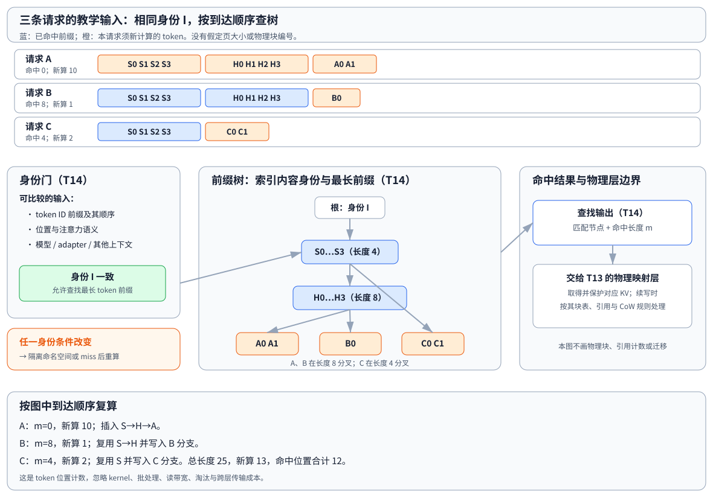

# Prefix Caching：跨请求前缀复用

> **文献基线**：[Efficiently Programming Large Language Models using SGLang，arXiv:2312.07104v1](https://arxiv.org/pdf/2312.07104v1)（2023-12-12，§2.1、Fig. 2、§5、Algorithm 1、Fig. 6、§6.4）；[PagedAttention，arXiv:2309.06180v1](https://arxiv.org/pdf/2309.06180v1)（2023-09-12，§4.4）。前者的来源索引见 `raw/01_theory/05_inference/SGLang_RadixAttention-2312.07104.md`，后者见同目录的 `PagedAttention-2309.06180.md`。
> **源码基线**：`sgl-project/sglang@0b3bb0cbe31873994c9f989fddfe2f87ca839fdd`（detached 于 `v0.5.15.post1`，2026-09-17；`python/sglang/srt/mem_cache/radix_cache.py::{RadixKey,RadixCache.match_prefix,RadixCache.inc_lock_ref,RadixCache.dec_lock_ref,RadixCache.evict}` 与 `python/sglang/srt/managers/schedule_policy.py::match_prefix_for_req`）。源码只作为一个条件化实现例证，不回填为论文或通用规则。
> **主题**：为已经算出的 KV 建立按内容身份检索的索引，使不同请求在正确的前缀上复用已处理位置；并说明命中、保护、续算、保留和失效的边界。
> **适用范围**：普通因果 Transformer 的完整前缀 KV。本文负责内容身份、前缀索引和保留决策；物理块表、引用与写时复制归 [[13_paged_kv_attention_analysis|分页 KV 与 PagedAttention]]，跨设备/跨层传输归 [[22_kv_tiering_transfer_analysis|KV 分层迁移]]。本文不把某引擎的页对齐、哈希字段或队列策略写成普适定律。
> **最近更新**：2026-09-17。新建原理页；逐段核对两篇固定论文版本，并以一个固定 SGLang 源码快照作条件化对应，未进行引擎性能实测。

## 1. 从单请求缓存到跨请求复用

[[12_kv_cache_analysis|KV Cache]] 已解释单个请求为何能保留自己已处理位置的 K/V：在因果注意力下，旧位置不依赖之后追加的 token。Prefix Caching 再加一层**内容索引**：请求结束或运行中已形成的前缀，不只由原请求持有，还可以登记为“某个身份下的一段 token 前缀”，供后来的请求寻找。SGLang 论文 §2.1 的前提正是 K/V 由先前 token 决定；它用 Fig. 2 展示多个调用共享 prompt 片段时可以重用相应 KV。[来源：SGLang §2.1、Fig. 2](https://arxiv.org/pdf/2312.07104v1)

因此它解决的不是“单请求下一轮怎样少算历史”，而是“另一条请求能否证明自己的开头就是已算历史”。命中后，新请求可把匹配位置当作已有 K/V，只对未命中的后缀作前向计算；未命中时仍按普通 prefill 计算。这个区分也避免把“缓存里仍有字节”误说成“新的请求一定能安全读取它”。

同一段内容被复用，需要两层条件同时成立：内容身份匹配，且保存它的 KV 仍在可用容量中。前一层由本页的键和索引回答；后一层会调用物理块管理。PagedAttention §4.4 说明已共享的块在续写时怎样以引用计数和 CoW 保持正确，但它不定义如何发现跨请求内容相同。[来源：PagedAttention §4.4](https://arxiv.org/pdf/2309.06180v1)

## 2. 身份键不是“文本相同”

最小的比较对象是按顺序排列的 **token ID 前缀**，不是展示给人的文本。相同字符串可经不同 tokenizer、chat template 或输入规范化变成不同 token；即使某段 token 子串相同，前面历史不同也会改变其隐藏状态与 K/V。位置和注意力可见规则也属于前缀语义的一部分：PagedAttention §2.2 明确指出，一个 token 位于不同位置或拥有不同历史时，KV 可以不同。[来源：PagedAttention §2.2](https://arxiv.org/pdf/2309.06180v1)

更一般地，缓存身份必须覆盖**一切会改变这段 KV 的上下文**。通常要检查模型权重或版本、位置编码及其位置、attention mask 或窗口语义、adapter/LoRA、以及参与模型输入的多模态或检索上下文。具体字段不是一张跨引擎通用清单，而是从“KV 是否仍代表同一条件历史”推出的接口约束：某项会改变 K/V，就应纳入身份或让它强制 miss。

固定的 SGLang 快照给出一个实现例子：`RadixKey` 将 token IDs 与可选 `extra_key` 组成查询键，`RadixCache.match_prefix` 的文档和实现把不同 `extra_key` 的同 token 前缀置于互不共享的命名空间；注释列出的用途包括 LoRA/adapter ID、cache salt、cache version 与 retrieval context。它说明“额外身份域”可以怎样落在一个键中；不能据此断言别的引擎使用同名字段、也不能省略它们自己需要的条件。

## 3. 块哈希与前缀树：索引内容，而非排列物理块

索引的目标是给一条输入找**最长已登记前缀**。前缀树把从根到节点的路径解释为 token 序列：共同系统提示词是一段公共路径，两个更相近请求可在更深节点才分叉。SGLang 论文 §5 把已保留 prompt 和生成结果的 KV 组织在 radix tree 中，说明该结构支持 prefix search、reuse、insertion 和 eviction；Fig. 6 展示了共享 system prompt 与分叉路径。[来源：SGLang §5、Fig. 6](https://arxiv.org/pdf/2312.07104v1)

另一类实现可用**块哈希**作为索引入口。若把身份域写为 $I$，第 $j$ 个 token 块写为 $X_j$，一种可审计的链式键是

$$
h_j=H(h_{j-1}, I, X_j), \qquad h_{-1}=H(I).
$$

把前一块摘要和 $I$ 放入输入，才能让相同的块内容出现在不同前缀或不同身份域时得到不同的查询链。这是说明“块哈希应保留前缀顺序与身份”的**分析构造**，不是 SGLang 论文声称的唯一算法；也不是所有 prefix cache 都需要哈希和树同时存在。无论使用树、链式 hash 或别的精确索引，命中后都应能回到原始 token/身份作一致性验证，避免把摘要碰撞当作内容相等。

树节点应记录内容路径、可命中的长度、访问/保护状态，以及指向 KV 的句柄；节点本身不等同于物理块。固定 SGLang 快照的 `match_prefix` 会在匹配结束于已压缩路径中间时切分节点，并在其自身 `page_size` 大于 1 时先截断为页边界。这是该快照的表示与对齐策略。教学图和本页算例都不要求块长度或页对齐，不能把该行为推广成 prefix cache 的定义。

<!-- Figure spec: 以三条按到达顺序处理的 prefill 输入展示身份门、radix 前缀树和命中长度。A 首次计算 10 个位置；B 命中 system+history 共 8 个、新算 1；C 只命中 system 4 个、新算 2。树输出“匹配节点+长度”，再交给 T13 取得和保护物理 KV；图中不出现物理块 ID、引用计数、CoW 或页对齐。蓝色为命中前缀，橙色为本请求新算 token，绿色为身份通过。 -->

## 4. 贯穿算例：命中、保护、续算与登记

以下是**教学算例**。三条已分词的 prefill 输入都在身份域 $I$ 下；`S0…S3` 是四个 system token，`H0…H3` 是两条请求共享的更长历史。A、B、C 依次到达：

| 请求 | 输入 token 路径 | 查找时最长命中 $m_i$ | 本轮新算 $L_i-m_i$ | 登记后的新分支 |
|---|---|---:|---:|---|
| A | $S0…S3\;H0…H3\;A0\;A1$ | 0 | 10 | $S\rightarrow H\rightarrow A$ |
| B | $S0…S3\;H0…H3\;B0$ | 8 | 1 | $S\rightarrow H\rightarrow B$ |
| C | $S0…S3\;C0\;C1$ | 4 | 2 | $S\rightarrow C$ |

第一个请求 A 在空索引中 miss，处理 10 个位置并登记路径。B 从根沿相同身份域走过 `S` 和 `H`，命中 8 个位置；调度器在使用这段 KV 的期间保护对应节点或句柄，只为 `B0` 计算新的 K/V，并把新后缀登记成 B 分支。C 只能共享 system 路径，故命中 4 个位置、另算两个位置，并写入 C 分支。图中 A、B 的深层共同节点与 C 的较浅共同节点可逐项复算这些长度。

“保护”不能理解成永久占用。SGLang 论文 §5 以节点 reference count 表示运行中的请求，计数为零的节点才可被逐出；其 Algorithm 1 在批处理选择后增加引用，在请求完成后减少引用并插入结果。固定源码快照的 `inc_lock_ref`、`dec_lock_ref` 与 `evict` 也体现了“运行路径受保护、无锁节点转为可逐出”的一种落实。[来源：SGLang §5、Algorithm 1](https://arxiv.org/pdf/2312.07104v1) 计数归零表示**当前运行请求不再保护该缓存节点**，不表示节点必然立即删除；是否还保留由容量和淘汰策略决定。

节点与物理 KV 的关联随后交给 [[13_paged_kv_attention_analysis|分页 KV 与 PagedAttention]]：物理层负责把可用 K/V 映射进请求块表、维护引用并处理共享尾块续写的 CoW。本例不画物理块编号，因此没有把“命中内容”偷换成“某个 P 编号相同”。

## 5. 保留成本与调度

若第 $i$ 条请求的输入长度为 $L_i$、有效命中长度为 $m_i$，则在“已命中的 K/V 可直接读、只数本轮须处理的位置”的教学计数下：

$$
N_{\mathrm{new}}=\sum_i(L_i-m_i), \qquad
N_{\mathrm{hit}}=\sum_i m_i, \qquad 0\le m_i\le L_i.
$$

上例未使用跨请求缓存时要处理 $10+9+6=25$ 个位置；按到达顺序缓存后新算 $10+1+2=13$ 个位置，命中位置合计 $0+8+4=12$。这是输入位置的**教学算术**，没有宣称 12 个位置等于固定 FLOPs、端到端时延或吞吐收益：KV 读带宽、批处理、kernel、排队、树维护、淘汰和重算都会改变实测结果。

保留一段前缀是在未来命中概率与现在容量之间交换。它占用 KV payload、树节点/键和访问元数据；保留得越多，可分给活跃请求或新前缀的空间越少。被逐出的内容下次即使身份相同也会 miss 并重算。SGLang 论文 §5 使用 LRU 驱逐未被运行请求引用的节点，并描述 cache-aware scheduler；Algorithm 1 先按匹配长度排序，再在可用/可逐出容量范围内选批。论文也说明其当时实现只匹配已有 cache tree、不会把 waiting queue 中尚未插入的请求当作可共享前缀。这些是该论文算法的事实，不构成所有服务都必须采用 LRU、最长前缀优先或相同批选择顺序的要求。[来源：SGLang §5、Algorithm 1](https://arxiv.org/pdf/2312.07104v1)

调度还要看请求何时到达和哪些前缀会再次被访问。论文 §6.4 的实验分别改变可共享长度和访问模式，结果随这些条件变化；这支持“命中长度、复用频率和容量共同决定收益”，却不能把其中任何测量数字移植到另一模型、数据集或硬件。跨设备保留或搬运的成本不在本页计算，见 [[22_kv_tiering_transfer_analysis|KV 分层迁移]]。

## 6. 失效与隔离：宁可 miss，也不能错用状态

前缀缓存的安全失败方式是 miss 后按普通 prefill 重算。下表列出常见的隔离触发条件；它描述检查的原因，具体实现会用版本号、namespace、salt、显式清空或其他协议表达。

| 条件变化 | 为什么不应直接复用 | 可审计的处理 |
|---|---|---|
| token IDs、顺序或前史不同 | 因果层的输入前缀不同，K/V 不再是同一历史。 | 在树中走不到同一路径，或令完整键不同。 |
| 位置、RoPE/位置语义、mask/窗口不同 | 同 token 可能面对不同位置编码或可见上下文。 | 将相关语义纳入身份；不能证明相同则 miss。 |
| 模型权重、KV 表示、adapter/LoRA 改变 | 投影或存储表示已改变。 | 版本化命名空间、adapter 键或清空旧项。 |
| 检索、多模态、模板等上游输入改变 | 人眼看到的文本可能遗漏模型实际条件。 | 将其稳定标识纳入键，或隔离缓存池。 |
| 租户/权限策略要求隔离 | 即使内容相同，也未必允许共享缓存状态。 | 按策略建立独立 namespace 或禁用共享。 |

最后一行是服务隔离政策，而非从任一论文推出的默认行为。类似地，缓存失效不要求一定擦除物理字节：对本页而言，关键结论是旧身份不能再被内容索引命中；物理块何时归还、覆盖或安全擦除属于块池和部署政策。这样可以避免把“可被重新分配”“仍有旧字节”和“仍可按内容命中”混为一件事。

## 7. 边界对账

| 问题 | T14 负责 | 交给何处 |
|---|---|---|
| 哪些输入可共享？ | 身份域、精确前缀、最长匹配与 miss。 | 模型/服务协议定义具体身份字段。 |
| 命中内容怎样落到存储？ | 输出匹配节点和长度，申请/保护对应 KV。 | [[13_paged_kv_attention_analysis|T13]] 的块表、物理引用与 CoW。 |
| 容量不足时保留谁？ | 高层说明命中价值、保护和淘汰会影响重算。 | 具体引擎的队列、优先级和实现策略。 |
| KV 在设备、主存或远端间移动？ | 只计为本页未覆盖的额外成本。 | [[22_kv_tiering_transfer_analysis|KV 分层迁移]]。 |

Prefix Caching 因此是一条受身份契约约束的计算复用路径：先证明前缀有效，再找最长可用路径，保护其 KV，计算后缀，并在容量允许时登记结果。它既不替代单请求 KV Cache 的因果前提，也不替代分页层的物理生命周期。

## Related Pages

- [[12_kv_cache_analysis|KV Cache：复用依据与容量]] — 建立单请求历史 KV 的语义和身份前提。
- [[13_paged_kv_attention_analysis|分页 KV 与 PagedAttention]] — 查看命中后的物理块表、引用与写时复制。
- [[10_prefill_decode_analysis|自回归生成与 Prefill / Decode]] — 对照“已处理位置”与本轮新算 token 的时序。
- [[02_engineering/03_infer_frameworks/vllm/08_vllm_kv_cache_management_analysis|vLLM KV Cache 管理]] — 读取固定工程基线中块池、hash、引用和回收的具体实现。
- [[02_engineering/03_infer_frameworks/01_llm_inference_technology_stack_analysis|推理技术栈全景]] — 将缓存索引放回调度、执行和服务层的整体关系。
